# 算法思想

- 编辑：李竹楠
- 日期：2024/02/05

## 1. 递归

**递归(Recursion)**：指的是一种通过重复将原问题分解为同类的子问题而解决的方法。在绝大数编程语言中，可以通过在函数中再次调用函数自身的方式来实现递归。

以以下代码为例：

``` python
def fact(n):
    if n == 0:
        return 1
    return n * fact(n - 1) 
```

以 n=6n = 6n=6 为例，上述代码中阶乘函数 fact(6)fact(6)fact(6) 的计算过程如下：

``` python
fact(6)
= 6 * fact(5)
= 6 * (5 * fact(4))
= 6 * (5 * (4 * fact(3)))
= 6 * (5 * (4 * (3 * fact(2))))
= 6 * (5 * (4 * (3 * (2 * fact(1)))))
= 6 * (5 * (4 * (3 * (2 * (1 * fact(0))))))
= 6 * (5 * (4 * (3 * (2 * (1 * 1)))))
= 6 * (5 * (4 * (3 * (2 * 1))))
= 6 * (5 * (4 * (3 * 2)))
= 6 * (5 * (4 * 6))
= 6 * (5 * 24)
= 6 * 120
= 720 
```

根据上面的描述，我们可以把阶乘函数的递归计算过程分为两个部分：

- **递推过程**：先逐层向下调用自身，直到达到结束条件（即 `n==0`）:指的是将原问题一层一层地分解为与原问题形式相同、规模更小的子问题，直到达到结束条件时停止，此时返回最底层子问题的解。
    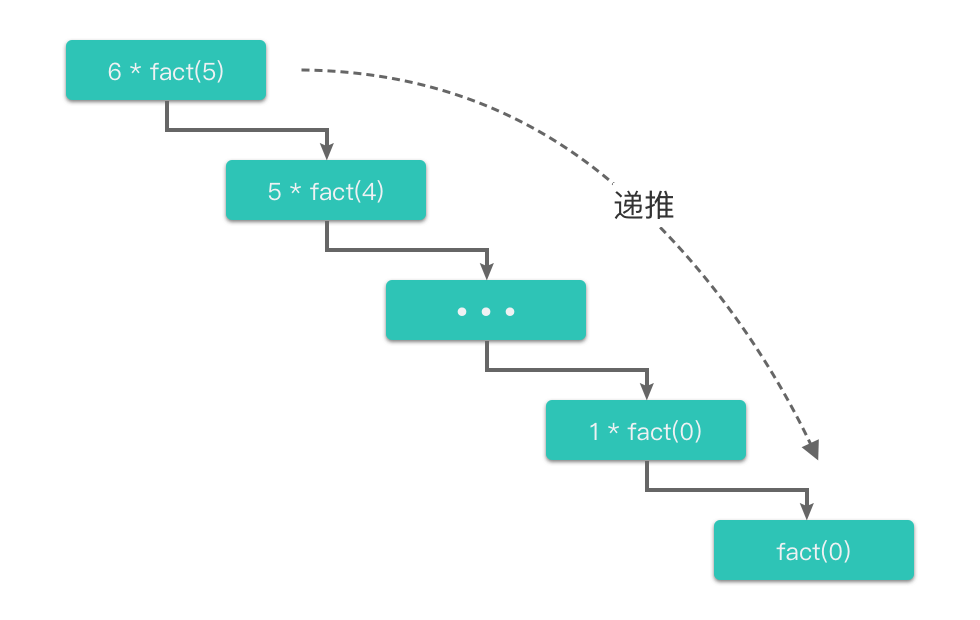
- **回归过程**：然后再向上逐层返回结果，直到返回原问题的解（即返回 `fact(6)==720`）:指的是从最底层子问题的解开始，逆向逐一回归，最终达到递推开始时的原问题，返回原问题的解。
    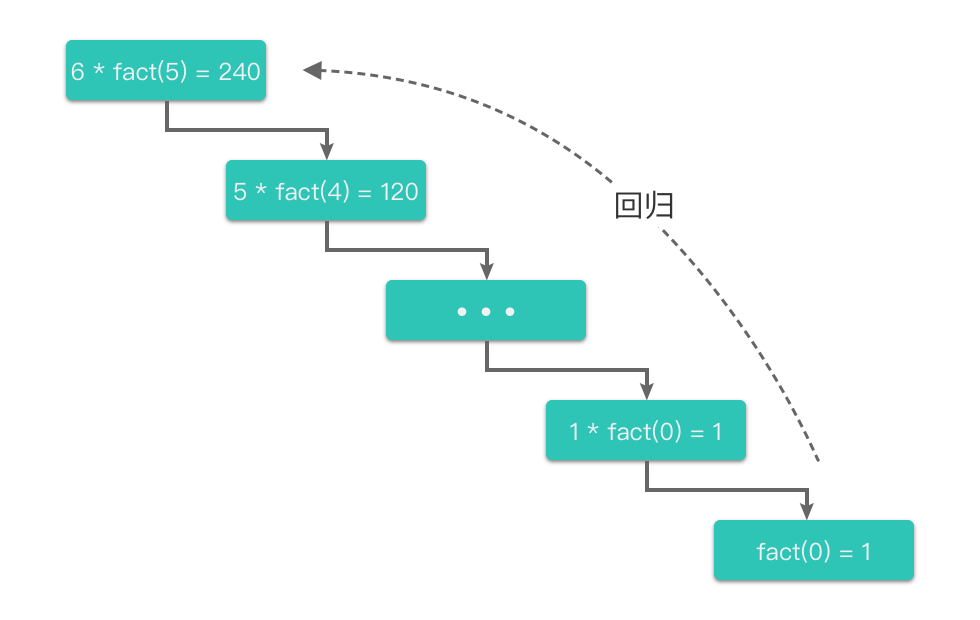

递推过程和回归过程是递归算法的精髓。从这个角度来理解递归，递归的基本思想就是： **把规模大的问题不断分解为子问题来解决**。同时，**因为解决原问题和不同规模的小问题往往使用的是相同的方法，所以就产生了函数调用函数自身的情况**，这也是递归的定义所在。

### 1.1 递归与数学归纳法

递归的数学模型其实就是**数学归纳法**。这里简单说明数学归纳法的证明步骤：

- 证明当 $n=b$（$b$ 为基本情况，通常为 0 或者 1）时，命题成立。
- 证明当 $n>b$ 时，假设 $n=k$ 时命题成立，那么可以推导出 $n=k+1$ 时命题成立。这一步不是直接证明的，而是先假设 $n=k$ 时命题成立，利用这个条件，可以推论出 $n=k+1$ 时命题成立。

通过以上两步证明，就可以说：当 $n>=b$ 时，命题都成立。

我们可以从数学归纳法的角度来解释递归：

- **递归终止条件**：数学归纳法第一步中的 $n=b$，可以直接得出结果。
- **递推过程**：数学归纳法第二步中的假设部分（假设 $n=k$ 时命题成立），也就是假设我们当前已经知道了 $n=k$ 时的计算结果。
- **回归过程**：数学归纳法第二步中的推论部分（根据 $n=k$ 推论出 $n=k+1$），也就是根据下一层的结果，计算出上一层的结果。

事实上，数学归纳法的思考过程也正是在解决某些数列问题时，可以使用递归算法的原因。比如阶乘、数组前n项和、斐波那契数列等等。

### 1.2 递归三步走

在写递归的时候，我们可以按照这个思想来书写递归，具体步骤如下：

- 写出递推公式：找到将原问题分解为子问题的规律，并且根据规律写出递推公式。
- 明确终止条件：推敲出递归的终止条件，以及递归终止时的处理方法。
将递推公式和终止条件翻译成代码：
    - 定义递归函数（明确函数意义、传入参数、返回结果等）。
    - 书写递归主体（提取重复的逻辑，缩小问题规模）。
    - 明确递归终止条件（给出递归终止条件，以及递归终止时的处理方法）。

#### 1.2.1 写出递推公式

写出递推公式的关键在于：**找到将原问题分解为子问题的规律，并将其抽象成递推公式**。

我们在思考递归的逻辑时，没有必要在大脑中将整个递推过程和回归过程一层层地想透彻。很可能还没有递推到栈底呢，脑子就已经先绕晕了。

之前讲解的阶乘例子中，一个问题只需要分解为一个子问题，我们很容易能够想清楚**递推过程**和**回归过程**的每一个步骤，所以写起来和理解起来都不难。但是当我们面对的是一个问题需要分解为多个子问题的情况时，就没有那么容易想清楚**递推过程**和**回归过程**的每一个步骤了。那么我们应该如何思考递推过程和回归过程呢，又该如何写出递归中的递推公式呢？

> 如果一个问题 A，可以分解为若干个规模较小、与原问题形式相同的子问题 B、C、D，那么这些子问题就可以用相同的解题思路来解决。我们可以假设 B、C、D 已经解决了，然后只需要考虑在这个基础上去思考如何解决问题 A 即可。不需要再一层层往下思考子问题与子子问题、子子问题与子子子问题之间的关系。这样理解起来就简单多了。
> 
> 从问题 A 到分解为子问题 B、C、D 的思考过程其实就是递归的递推过程。而从子问题 B、C、D 的解回到问题 A 的解的思考过程其实就是递归的回归过程。想清楚了**如何划分子问题**和**如何通过子问题来解决原问题**这两个过程，也就想清楚了递归的递推过程和回归过程。
> 
> 然后，我们只需要考虑原问题与子问题之间的关系，就能够在此基础上，写出递推公式了。

#### 1.2.2 明确终止条件

递归的终止条件也叫做递归出口。在写出了递推公式之后，就要考虑递归的终止条件是什么。如果没有递归的终止条件，函数就会无限地递归下去，程序就会失控崩溃了。通常情况下，递归的终止条件是问题的边界值。在找到递归的终止条件时，我们应该直接给出该条件下的处理方法。一般地，在这种情境下，问题的解决方案是直观的、容易的。例如阶乘中 $fact(0)=1$。斐波那契数列中 $f(1)=1$，$f(2)=2$。

#### 1.2.3 将递推公式和终止条件翻译成代码

在写出递推公式和明确终止条件之后，我们就可以将其翻译成代码了。这一步也可以分为 3 步来做：

1. **定义递归函数**：明确函数意义、传入参数、返回结果等。
2. **书写递归主体**：提取重复的逻辑，缩小问题规模。
3. **明确递归终止条件**：给出递归终止条件，以及递归终止时的处理方法。

``` python
def recursion(n): # n：大规模问题
    if condition: # 递归终止条件
        #...      # 递归终止时的处理方法
    return recursion(n-1) # n：小规模问题
```

#### 1.2.3 递归的注意点

##### 1.2.3.1 避免栈溢出

在程序执行中，递归是利用堆栈来实现的。每一次递推都需要一个栈空间来保存调用记录，每当进入一次函数调用，栈空间就会加一层栈帧。每一次回归，栈空间就会减一层栈帧。由于系统中的栈空间大小不是无限的，所以，如果递归调用的次数过多，会导致栈空间溢出。

为了避免栈溢出，我们可以在代码中限制递归调用的最大深度来解决问题。当递归调用超过一定深度时（比如 100）之后，不再进行递归，而是直接返回报错。

当然这种做法并不能完全避免栈溢出，也无法完全解决问题，因为系统允许的最大递归深度跟当前剩余的占空间有关，事先无法计算。

如果使用递归算法实在无法解决问题，我们可以考虑将递归算法变为非递归算法（即递推算法）来解决栈溢出的问题。

##### 1.2.3.2 避免重复运算

在使用递归算法时，还可能会出现重复运算的问题。

例如斐波那契堆：

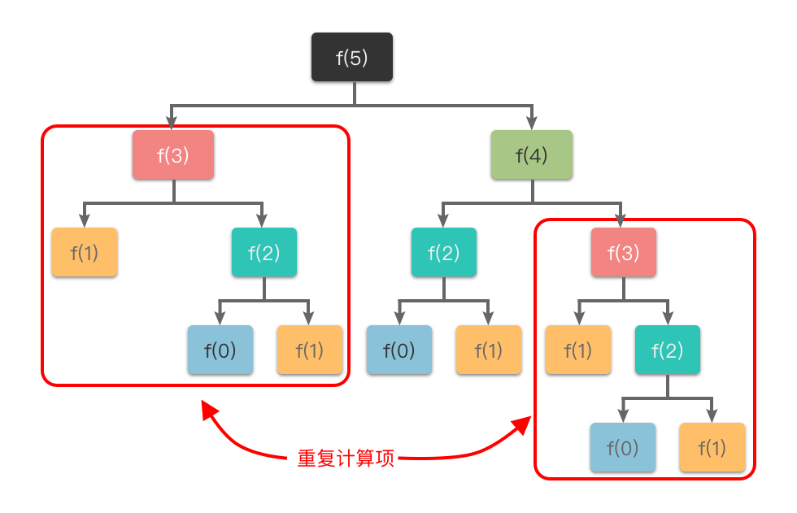

从图中可以看出：想要计算 $f(5)$，需要先计算 $f(3)$ 和 $f(4)$，而在计算 $f(4)$ 时还需要计算 $f(3)$(，这样 $f(3)$ 就进行了多次计算。同理 $f(0)$、$f(1)$、$f(2)$ 都进行了多次计算，就导致了重复计算问题。

为了避免重复计算，我们可以使用一个缓存（哈希表、集合或数组）来保存已经求解过的 $f(k)$ 的结果，这也是动态规划算法中的做法。当递归调用用到 $f(k)$ 时，先查看一下之前是否已经计算过结果，如果已经计算过，则直接从缓存中取值返回，而不用再递推下去，这样就避免了重复计算问题。

### 1.3 应用

#### 1.3.1 [斐波那契数](https://leetcode.cn/problems/fibonacci-number/description/)

#### 1.3.2 [二叉树的最大深度](https://leetcode.cn/problems/maximum-depth-of-binary-tree/description/)

给定一个二叉树 `root` ，返回其最大深度。

二叉树的 **最大深度** 是指从根节点到最远叶子节点的最长路径上的节点数。

示例 1：

> 输入：root = [3,9,20,null,null,15,7]
> 输出：3

示例 2：

> 输入：root = [1,null,2]
> 输出：2

思路：根据递归三步走策略，写出对应的递归代码。

1. 写出递推公式：**当前二叉树的最大深度 = max(当前二叉树左子树的最大深度, 当前二叉树右子树的最大深度) + 1**。即：先得到左右子树的高度，再计算当前节点的高度。
2. 明确终止条件：当前二叉树为空。
3. 翻译为递归代码：
    1. 定义递归函数：`maxDepth(self, root)` 表示输入参数为二叉树的根节点 `root`，返回结果为该二叉树的最大深度。
    2. 书写递归主体：`1 + max(self.maxDepth(root.left),self.maxDepth(root.right))`
    3. 明确递归终止条件：`root is None`

``` python
class Solution(object):
    def maxDepth(self, root):
        """
        :type root: TreeNode
        :rtype: int
        """
        if root is None:
            return 0
        return 1 + max(self.maxDepth(root.left),self.maxDepth(root.right))
```

- 时间复杂度：$O(n)$，其中 $n$ 是二叉树的节点数目。
- 空间复杂度：$O(n)$。递归函数需要用到栈空间，栈空间取决于递归深度，最坏情况下递归深度为 $n$，所以空间复杂度为 $O(n)$。

## 2. 分治法

**分治算法(Divide and Conquer)**：字面上的解释是分而治之，就是把一个复杂的问题分成两个或更多的相同或相似的子问题，直到最后子问题可以简单的直接求解，原问题的解即子问题的解的合并。

简单来说，分治算法的基本思想就是： **把规模大的问题不断分解为子问题，使得问题规模减小到可以直接求解为止**。

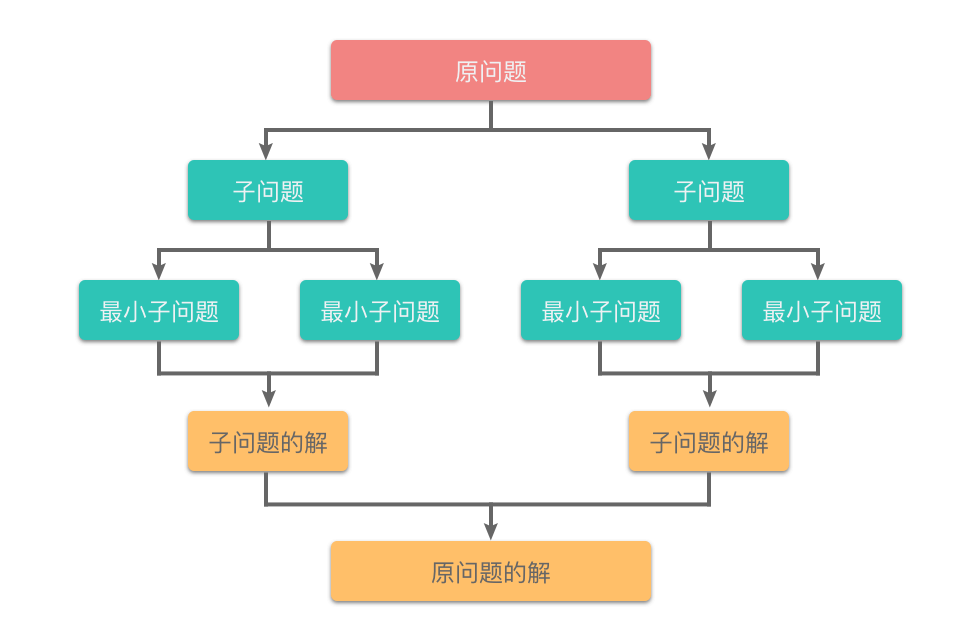

### 2.1 分治算法与递归算法的异同

从定义上来看，分治算法的思想和递归算法的思想是一样的，都是把规模大的问题不断分解为子问题。

其实，分治算法和递归算法的关系是包含与被包含的关系，可以看做： 递归算法 ∈ 分治算法。

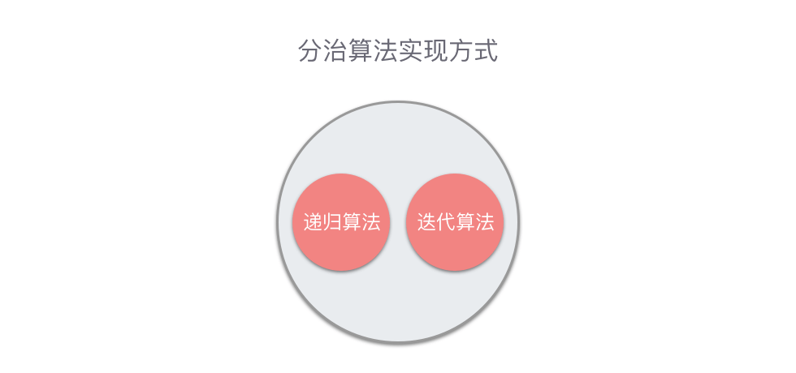

分治算法从实现方式上来划分，可以分为两种：**递归算法**和**迭代算法**。一般情况下，分治算法比较适合使用递归算法来实现。但除了递归算法之外，分治算法还可以通过迭代算法来实现。比较常见的例子有：快速傅里叶变换算法、二分查找算法、非递归实现的归并排序算法等等。我们先来说明一下分支算法的适用条件，再来讲解一下基本步骤。

### 2.2 分治算法的使用条件

分治算法能够解决的问题，一般需要满足以下 4 个条件：

1. **可分解**：原问题可以分解为若干个规模较小的相同子问题。
2. **子问题可独立求解**：分解出来的子问题可以独立求解，即子问题之间不包含公共的子子问题。
3. **具有分解的终止条件**：当问题的规模足够小时，能够用较简单的方法解决。
4. **可合并**：子问题的解可以合并为原问题的解，并且合并操作的复杂度不能太高，否则就无法起到减少算法总体复杂度的效果了。

### 2.3 分治算法的基本步骤

使用分治算法解决问题主要分为 3 个步骤：

1. **分解**：把要解决的问题分解为成若干个规模较小、相对独立、与原问题形式相同的子问题。
2. **求解**：递归求解各个子问题。
3. **合并**：按照原问题的要求，将子问题的解逐层合并构成原问题的解。

其中第 1 步中将问题分解为若干个子问题时，最好使子问题的规模大致相同。换句话说，将一个问题分成大小相等的 k 个子问题的处理方法是行之有效的。在许多问题中，可以取 $k=2$ 。这种使子问题规模大致相等的做法是出自一种平衡子问题的思想，它几乎总是比子问题规模不等的做法要好。

其中第 2 步的**递归求解各个子问题**指的是按照同样的分治策略进行求解，即通过将这些子问题分解为更小的子子问题来进行求解。就这样一直分解下去，直到分解出来的子问题简单到只用常数操作时间即可解决为止。

在完成第 2 步之后，最小子问题的解可用常数时间求得。然后我们再按照递归算法中回归过程的顺序，由底至上地将子问题的解合并起来，逐级上推就构成了原问题的解。

按照分而治之的策略，在编写分治算法的代码时，也是按照上面的 3 个步骤来编写的：

``` python
def divide_and_conquer(problems_n):             # problems_n 为问题规模
    if problems_n < d:                          # 当问题规模足够小时，直接解决该问题
        return solove()                         # 直接求解
    
    problems_k = divide(problems_n)             # 将问题分解为 k 个相同形式的子问题
    
    res = [0 for _ in range(k)]                 # res 用来保存 k 个子问题的解
    for problem_k in problems_k:
        res[i] = divide_and_conquer(problem_k)  # 递归的求解 k 个子问题
    
    ans = merge(res)                            # 合并 k 个子问题的解
    return ans                                  # 返回原问题的解
```

### 2.4 复杂度分析

分治算法中，在不断递归后，最后的子问题将变得极为简单，可在常数操作时间内予以解决，其带来的时间复杂度在整个分治算法中的比重微乎其微，可以忽略不计。所以，分治算法的时间复杂度实际上是由**分解**和**合并**两个部分构成的。

一般来讲，分治算法将一个问题划分为$a$个形式相同的子问题，每个子问题的规模为$n/b$，则总的时间复杂度的递归表达式可以表示为：

$$
T(n) = 
    \begin{cases} 
        \begin{array} \ 
            \Theta{(1)} & n = 1 \cr a \times T(n/b) + f(n) & n > 1 
        \end{array} 
    \end{cases}
$$

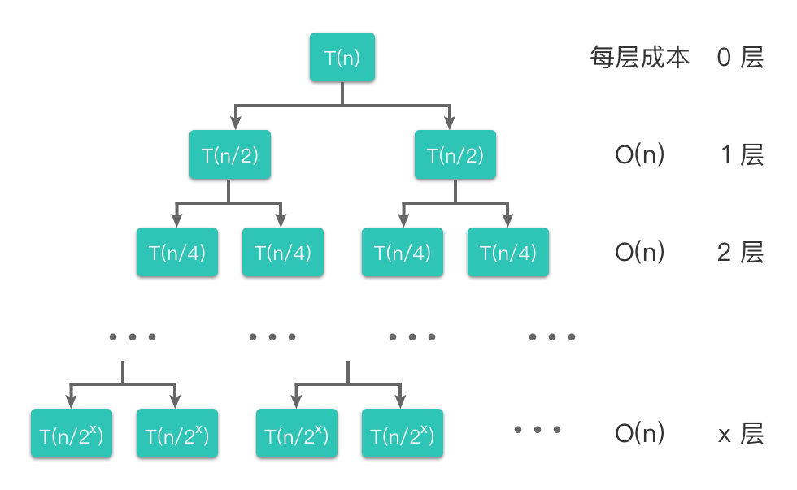

### 2.5 例题

## 3. 枚举法

**枚举算法（Enumeration Algorithm）**：也称为穷举算法，指的是按照问题本身的性质，一一列举出该问题所有可能的解，并在逐一列举的过程中，将它们逐一与目标状态进行比较以得出满足问题要求的解。在列举的过程中，既不能遗漏也不能重复。

枚举算法的核心思想是：**通过列举问题的所有状态，将它们逐一与目标状态进行比较，从而得到满足条件的解**。由于枚举算法要通过列举问题的所有状态来得到满足条件的解，因此，在问题规模变大时，其**效率一般是比较低**的。但是枚举算法也有自己特有的优点：

- 多数情况下容易编程实现，也容易调试。
- 建立在考察大量状态、甚至是穷举所有状态的基础上，所以算法的正确性比较容易证明。

所以，枚举算法通常用于**求解问题规模比较小**的问题，或者作为求解问题的一个**子算法**，通过枚举一些信息并进行保存，而这些消息的有无对主算法效率的高低有着较大影响。

### 3.1 枚举算法的解题思路

枚举算法是设计最简单、最基本的搜索算法。是我们在遇到问题时，最应该优先考虑的算法。因为其实现足够简单，所以在遇到问题时，我们往往可以**先通过枚举算法**尝试解决问题，然后在此基础上，**再去考虑其他优化方法和解题思路**。

采用枚举算法解题的一般思路如下：

1. 确定枚举对象、枚举范围和判断条件，并判断条件设立的正确性。
2. 一一枚举可能的情况，并验证是否是问题的解。
3. 考虑提高枚举算法的效率。

我们可以从下面几个方面考虑提高算法的效率：

- 抓住问题状态的本质，尽可能缩小问题状态空间的大小。
- 加强约束条件，缩小枚举范围。
- 根据某些问题特有的性质，例如对称性等，避免对本质相同的状态重复求解。

下面举个著名的例子：*百钱买百鸡问题*。这个问题是我国古代数学家张丘在*算经*一书中提出的。该问题叙述如下：

> 鸡翁一，值钱五；鸡母一，值钱三；鸡雏三，值钱一；百钱买百鸡，则鸡翁、鸡母、鸡雏各几何？

下面我们根据算法的一般思路来解决一下这道题:

1. 确定枚举对象、枚举范围和判断条件，并判断条件设立的正确性。
    - 确定枚举对象：枚举对象为公鸡、母鸡、小鸡的只数，那么我们可以用变量 $x$、$y$、$z$ 分别来代表公鸡、母鸡、小鸡的只数。
    - 确定枚举范围：因为总共买了 100 只鸡，所以 $0≤x,y,z≤100$，则 $x$、$y$、$z$ 的枚举范围为 $[0,100]$。
    - 根据题意，我们可以列出两个方程式：$5x+3y+z/3=100$, $x+y+z=100$。在枚举 $x$、$y$、$z$ 的过程中，我们可以根据这两个方程式来判断是否当前状态是否满足题意。
2. 一一枚举可能的情况，并验证是否是问题的解。
    根据枚举对象、枚举范围和判断条件，我们可以顺利写出对应的代码:
    ``` python
    class Solution:
        def buyChicken(self):
            for x in range(101):
                for y in range(101):
                    for z in range(101):
                        if z % 3 == 0 and 5 * x + 3 * y + z // 3 == 100 and x + y + z == 100:
                            print("公鸡 %s 只，母鸡 %s 只，小鸡 %s 只" % (x, y, z))

    ```
3. 考虑提高枚举算法的效率。
    - 在上面的代码中，我们枚举了 $x$、$y$、$z$，但其实根据方程式 $x+y+z=100$，得知：$z$ 可以通过 $z=100−x−y$ 而得到，这样我们就不用再枚举 $z$ 了。
    - 在上面的代码中，对 $x$、$y$ 的枚举范围是 $[0,100]$，但其实如果所有钱用来买公鸡，最多只能买 $20$ 只，同理，全用来买母鸡，最多只能买 $33$ 只。所以对 $x$x 的枚举范围可改为 $[0,20]$，$y$ 的枚举范围可改为 $[0,33]$。
    ``` python
    class Solution:
        def buyChicken(self):
            for x in range(21):
                for y in range(34):
                    z = 100 - x - y
                    if z % 3 == 0 and 5 * x + 3 * y + z // 3 == 100:
                        print("公鸡 %s 只，母鸡 %s 只，小鸡 %s 只" % (x, y, z))
    ```

### 3.2 例题

### 3.2.1 [两数之和](https://leetcode.cn/problems/two-sum/description/)

给定一个整数数组 nums 和一个整数目标值 target，请你在该数组中找出和为目标值 target  的那两个整数，并返回它们的数组下标。

你可以假设每种输入只会对应一个答案。但是，数组中同一个元素在答案里不能重复出现。

你可以按任意顺序返回答案。

示例 1：

> 输入：nums = [2,7,11,15], target = 9
> 输出：[0,1]
> 解释：因为 nums[0] + nums[1] == 9 ，返回 [0, 1] 。

示例 2：

> 输入：nums = [3,2,4], target = 6
> 输出：[1,2]

示例 3：

> 输入：nums = [3,3], target = 6
> 输出：[0,1]

思路1：使用枚举法暴力破解：

``` python
class Solution(object):
    def twoSum(self, nums, target):
        """
        :type nums: List[int]
        :type target: int
        :rtype: List[int]
        """
        fast = 0
        slow = 0
        while slow <= len(nums) - 1:
            while fast <= len(nums) - 1:
                if (nums[slow] + nums[fast] == target) and (slow != fast):
                    return (slow, fast)
                fast += 1
            fast = 0
            slow += 1
```

- 时间复杂度：$O(n^2)$，其中 n 为数组 nums 的元素数量。
- 空间复杂度：$O(1)$。

思路2：思路1的时间复杂度较高，如果使用对撞指针，会降低复杂度。具体做法是，先将数组使用堆排序进行排序，然后再使用对撞指针。这样时间复杂度会降低至$O(n)$

## 4. 回溯法

**回溯算法（Backtracking）**：一种能避免不必要搜索的穷举式的搜索算法。采用试错的思想，在搜索尝试过程中寻找问题的解，当探索到某一步时，发现原先的选择并不满足求解条件，或者还需要满足更多求解条件时，就退回一步（回溯）重新选择，这种走不通就退回再走的技术称为回溯法，而满足回溯条件的某个状态的点称为**回溯点**。

简单来说，回溯算法采用了一种走不通就回退的算法思想。溯算法通常用简单的递归方法来实现，在进行回溯过程中更可能会出现两种情况：

- 找到一个可能存在的正确答案；
- 在尝试了所有可能的分布方法之后宣布该问题没有答案。

### 4.1 如何理解回溯法

以求解 $[1,2,3]$ 的全排列为例，我们来讲解一下回溯算法的过程:

- 选择以 1 为开头的全排列。
    - 选择以 2 为中间数字的全排列，则最后数字只能选择 3。即排列为：$[1,2,3]$。
    - 撤销选择以 3 为最后数字的全排列，再撤销选择以 2 为中间数字的全排列。然后选择以 3 为中间数字的全排列，则最后数字只能选择 2，即排列为：$[1,3,2]$。
- 撤销选择以 2 为最后数字的全排列，再撤销选择以 3 为中间数字的全排列，再撤销选择以 1 为开头的全排列。然后选择以 2 开头的全排列。
    - 选择以 1 为中间数字的全排列，则最后数字只能选择 3。即排列为：$[2,1,3]$。
    - 撤销选择以 3 为最后数字的全排列，再撤销选择以 1 为中间数字的全排列。然后选择以 3 为中间数字的全排列，则最后数字只能选择 1，即排列为：$[2,3,1]$。
- 撤销选择以 1 为最后数字的全排列，再撤销选择以 3 为中间数字的全排列，再撤销选择以 2 为开头的全排列，选择以 3 开头的全排列。
    - 选择以 1 为中间数字的全排列，则最后数字只能选择 2。即排列为：$[3,1,2]$。
    - 撤销选择以 2 为最后数字的全排列，再撤销选择以 1 为中间数字的全排列。然后选择以 2 为中间数字的全排列，则最后数字只能选择 1，即排列为：$[3,2,1]$。
    
总结一下全排列的回溯过程：

- **按顺序枚举每一位上可能出现的数字，之前已经出现的数字在接下来要选择的数字中不能再次出现**。
- 对于每一位，进行如下几步：
    - 选择元素：从可选元素列表中选择一个之前没有出现过的元素。
    - 递归搜索：从选择的元素出发，一层层地递归搜索剩下位数，直到遇到边界条件时，不再向下搜索。
    - 撤销选择：一层层地撤销之前选择的元素，转而进行另一个分支的搜索。直到完全遍历完所有可能的路径。

对于上述决策过程，我们也可以用一棵决策树来表示：

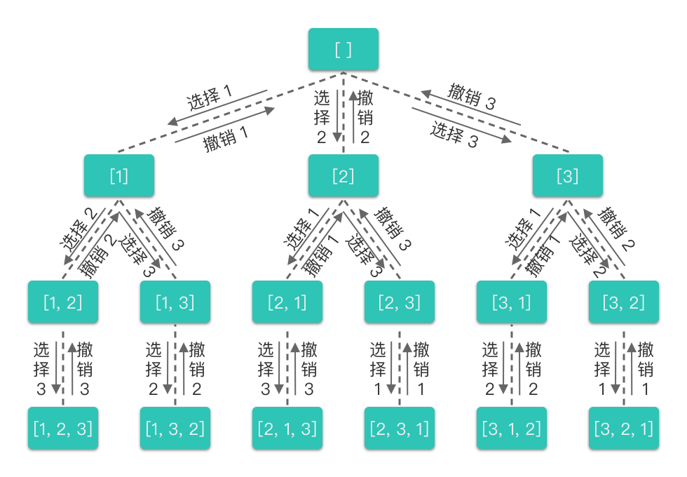

从全排列的决策树中我们可以看出：

- 每一层中有一个或多个不同的节点，这些节点以及节点所连接的分支代表了**不同的选择**。
- 每一个节点代表了求解全排列问题的一个**状态**，这些状态是通过**不同的值**来表现的。
- 每向下递推一层就是在**可选元素列表**中选择一个元素加入到当前状态。
- 当一个决策分支探索完成之后，会逐层向上进行回溯。
- 每向上回溯一层，就是把所选择的元素从当前状态中移除，回退到没有选择该元素时的状态（或者说重置状态），从而进行其他分支的探索。

根据上文的思路和决策树，我们来写一下全排列的回溯算法代码（假设给定数组 numsnumsnums 中不存在重复元素）。则代码如下所示：

``` python
class Solution:
    def permute(self, nums: List[int]) -> List[List[int]]:
        res = []    # 存放所有符合条件结果的集合
        path = []   # 存放当前符合条件的结果
        def backtracking(nums):             # nums 为选择元素列表
            if len(path) == len(nums):      # 说明找到了一组符合条件的结果
                res.append(path[:])         # 将当前符合条件的结果放入集合中
                return

            for i in range(len(nums)):      # 枚举可选元素列表
                if nums[i] not in path:     # 从当前路径中没有出现的数字中选择
                    path.append(nums[i])    # 选择元素
                    backtracking(nums)      # 递归搜索
                    path.pop()              # 撤销选择

        backtracking(nums)
        return res
```

### 4.2 回溯算法三步走

在递归算法知识的相关章节中，我们根据递归的基本思想总结了递归三步走的书写步骤。同样，根据回溯算法的基本思想，我们也来总结一下回溯算法三步走的书写步骤。

回溯算法的基本思想是：**以深度优先搜索的方式，根据产生子节点的条件约束，搜索问题的解。当发现当前节点已不满足求解条件时，就回溯返回，尝试其他的路径**。

那么，在写回溯算法时，我们可以按照这个思想来书写回溯算法，具体步骤如下：

1. **明确所有选择**：画出搜索过程的**决策树**，根据决策树来确定搜索路径。决策树是帮助我们理清搜索过程的一个很好的工具。我们可以画出搜索过程的决策树，根据决策树来帮助我们确定搜索范围和对应的搜索路径。
2. **明确终止条件**：推敲出递归的终止条件，以及递归终止时的要执行的处理方法。回溯算法的终止条件也就是决策树的底层，即达到无法再做选择的条件。回溯函数的终止条件一般为给定深度、叶子节点、非叶子节点（包括根节点）、所有节点等。并且还要给出在终止条件下的处理方法，比如输出答案，将当前符合条件的结果放入集合中等等。
3. **将决策树和终止条件翻译成代码**：
    1. 定义回溯函数（明确函数意义、传入参数、返回结果等）。
        - **传入参数和全局变量**：是由递归搜索阶段时的**当前状态**来决定的。最好是能通过传入参数和全局变量直接记录当前状态。比如全排列中，`backtracking(nums)` 这个函数的传入参数是 `nums`（可选择的元素列表），全局变量是 `res`（存放所有符合条件结果的集合数组）和 `path`（存放当前符合条件的结果）。`nums` 表示当前可选的元素，`path` 用于记录递归搜索阶段的**当前状态**。`res` 则用来保存递归搜索阶段的**所有状态**。
        - **返回结果**：返回结果是在遇到递归终止条件时，需要向上一层函数返回的信息。一般回溯函数的返回结果都是单个节点或单个数值，告诉上一层函数我们当前的搜索结果是什么即可。当然，如果使用全局变量来保存当前状态的话，也可以不需要向上一层函数返回结果，即返回空结果。比如上文中的全排列。
    2. 书写回溯函数主体（给出约束条件、选择元素、递归搜索、撤销选择部分）。
    3. 明确递归终止条件（给出递归终止条件，以及递归终止时的处理方法）。

根据上文以及全排列的回溯算法代码，我们可以提炼出回溯算法的通用模板，回溯算法的通用模板代码如下所示：

``` python
res = []    # 存放所欲符合条件结果的集合
path = []   # 存放当前符合条件的结果
def backtracking(nums):             # nums 为选择元素列表
    if condition:                   # 遇到边界条件，说明找到了一组符合条件的结果
        res.append(path[:])         # 将当前符合条件的结果放入集合中
        return

    for i in range(len(nums)):      # 枚举可选元素列表
        path.append(nums[i])        # 选择元素
        backtracking(nums)          # 递归搜索
        path.pop()                  # 撤销选择

backtracking(nums)
```

### 4.3 例题

#### 4.3.1 [子集](https://leetcode.cn/problems/subsets/)

#### 4.3.2 [N 皇后](https://leetcode.cn/problems/n-queens/)

## 5. 位运算

**位运算（Bit Operation）**：在计算机内部，数是以二进制（Binary）的形式来进行存储。位运算就是直接对数的二进制进行计算操作，在程序中使用位运算进行操作，会大大提高程序的性能。

### 5.1 位运算的基础操作

在二进制的基础上，我们可以对二进制数进行相应的位运算。基本的位运算共有 6 种，分别是：按位与运算、按位或运算、按位异或运算、取反运算、左移运算、右移运算。

这里的按位与运算、按位或运算、按位异或运算、左移运算、右移运算是双目运算。按位与运算、按位或运算、按位异或运算是将两个整数作为二进制数，对二进制数表示中的每一位（即二进位）逐一进行相应运算，即双目运算。左移运算、右移运算是将左侧整数作为二进制数，将右侧整数作为移动位数，然后对左侧二进制数的全部位进行移位运算，每次移动一位，总共移动右侧整数次位，也是双目运算。而取反运算是单目运算，是对一个整数的二进制数进行的位运算。

我们先来看下这 6 种位运算的规则，再来进行详细讲解：

|运算符|描述|规则|
|---|---|---|
|`\|`|按位或运算符|只要对应的两个二进位有一个为 1 时，结果位就为 111。|
|`&`|按位与运算符|只有对应的两个二进位都为 1 时，结果位才为 111。|
|`<<`|左移运算符|将二进制数的各个二进位全部左移若干位。`<<`右侧数字指定了移动位数，高位丢弃，低位补 0。|
|`>>`|右移运算符|对二进制数的各个二进位全部右移若干位。`>>` 右侧数字指定了移动位数，低位丢弃，高位补 0。|
|`^`|按位异或运算符|对应的两个二进位相异时，结果位为 1，二进位相同时则结果位为 0。|
|`~`|取反运算符|对二进制数的每个二进位取反，使数字 1 变为 0，0 变为 1。|

#### 5.1.1 按位与运算

按位与运算（AND）：按位与运算符为 `&`。其功能是对两个二进制数的每一个二进位进行与运算。只有对应的两个二进位都为 1 时，结果位才为 1。

``` shell
1 & 1 = 1
1 & 0 = 0
0 & 1 = 0
0 & 0 = 0
```

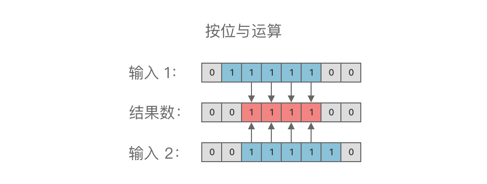

#### 5.1.2 按位或运算

按位或运算（OR）：按位或运算符为 `|`。其功能对两个二进制数的每一个二进位进行或运算。只要对应的两个二进位有一个为 1 时，结果位就为 1：

``` shell
1 | 1 = 1
1 | 0 = 1
0 | 1 = 1
0 | 0 = 0
```

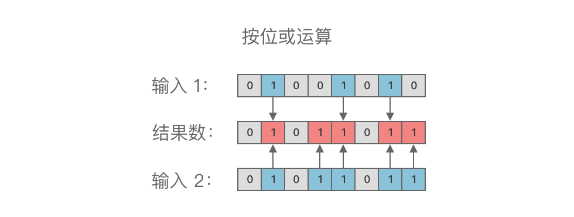

#### 5.1.3 按位异或运算

按位异或运算（XOR）：按位异或运算符为 `^`。其功能是对两个二进制数的每一个二进位进行异或运算。对应的两个二进位相异时，结果位为 1，二进位相同时则结果位为 0。

``` shell
1 ^ 1 = 0
1 ^ 0 = 1
0 ^ 1 = 1
0 ^ 0 = 0
```

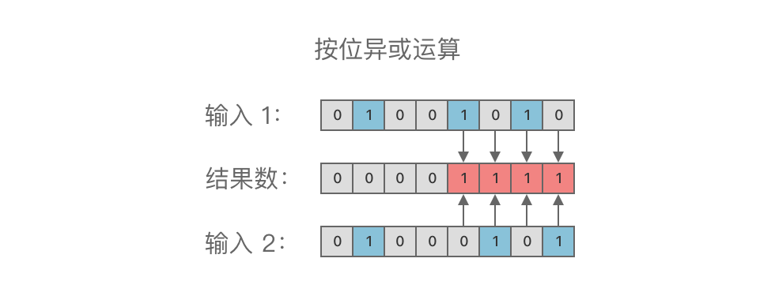

#### 5.1.4 取反运算

取反运算（NOT）：取反运算符为 `~`。其功能是对一个二进制数的每一个二进位进行取反运算。取反运算规则：使数字 1 变为 0，0 变为 1。

``` shell
~1 = 0
~0 = 1
```

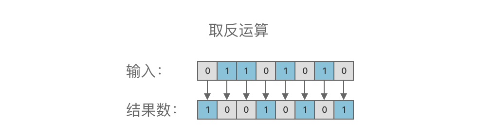

#### 5.1.5 左移运算和右移运算

左移运算（SHL）： 左移运算符为 `<<`。其功能是对一个二进制数的各个二进位全部左移若干位（高位丢弃，低位补 0）。

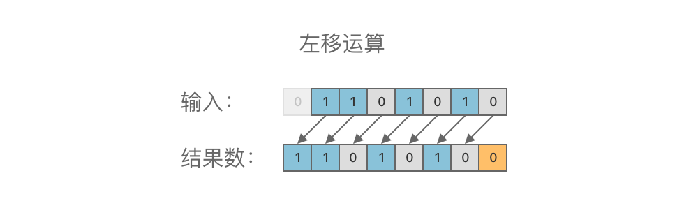

右移运算（SHR）： 右移运算符为 `>>`。其功能是对一个二进制数的各个二进位全部右移若干位（低位丢弃，高位补 0）。

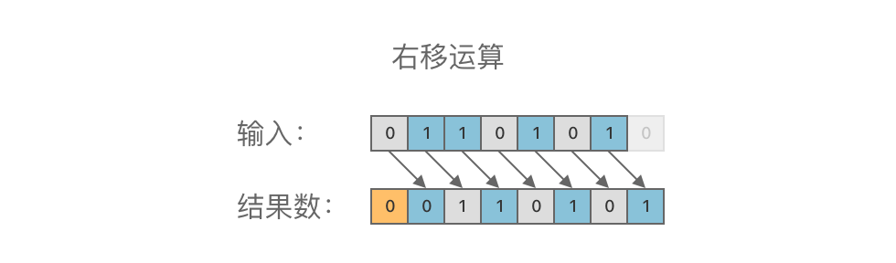

### 5.2 应用场景

#### 5.2.1 判断整数奇偶

一个整数，只要是偶数，其对应二进制数的末尾一定为 0；只要是奇数，其对应二进制数的末尾一定为 1。所以，我们通过与 1 进行按位与运算，即可判断某个数是奇数还是偶数。

``` python
(x & 1) == 0 # 为偶数。
(x & 1) == 1 # 为奇数。
```

#### 5.2.2 二进制数选取指定位

如果我们想要从一个二进制数 X 中取出某几位，使取出位置上的二进位保留原值，其余位置为 0，则可以使用另一个二进制数 Y，使该二进制数上对应取出位置为 1，其余位置为 0。然后令两个数进行按位与运算 `(X & Y)` ，即可得到想要的数。

举个例子，比如我们要取二进制数 $X=01101010_{(2)}$ 的末尾 4 位，则只需将 $X=01101010_{(2)}$ 与 $Y=00001111_{(2)}$ (末尾 4 位为 1，其余位为 0) 进行按位与运算，即 `01101010 & 00001111 == 00001010`。其结果 00001010 就是我们想要的数（即二进制数 $01101010_{(2)}$ 的末尾 4 位）。

#### 5.2.3 将指定位设置为 1

如果我们想要把一个二进制数 X 中的某几位设置为 1，其余位置保留原值，则可以使用另一个二进制数 Y，使得该二进制上对应选取位置为 1，其余位置为 0。然后令两个数进行按位或运算 $(X | Y)$，即可得到想要的数。

举个例子，比如我们想要将二进制数 $X=01101010_{(2)}$ 的末尾 4 位设置为 1，其余位置保留原值，则只需将 $X=01101010_{(2)}$ 与 $Y=00001111_{(2)}$ 末尾 4 位为 1，其余位为 0）进行按位或运算，即 `01101010 | 00001111 = 01101111`。其结果 01101111 就是我们想要的数（即将二进制数 $01101010_{(2)}$ 的末尾 4 位设置为 1，其余位置保留原值）。

#### 5.2.4 反转指定位

如果我们想要把一个二进制数 X 的某几位进行反转，则可以使用另一个二进制数 Y，使得该二进制上对应选取位置为 1，其余位置为 0。然后令两个数进行按位异或运算 $(X ^ Y)，即可得到想要的数。

举个例子，比如想要将二进制数 $X=01101010_{(2)}$ 的末尾 4 位进行反转，则只需将 $X=01101010_{(2)}$ 与 $Y=00001111_{(2)}$（末尾 4 位为 1，其余位为 0）进行按位异或运算，即 `01101010 ^ 00001111 = 01100101`。其结果 01100101 就是我们想要的数（即将二进制数 $X=01101010_{(2)}$ 的末尾 4 位进行反转）。

#### 5.2.5 交换两个数

#### 5.2.6 将二进制最右侧为 1 的二进位改为 0

#### 5.2.7 计算二进制中二进位为 1 的个数

#### 5.2.8 判断某数是否为 2 的幂次方

#### 5.2.9 常用操作总结

#### 5.2.10 二进制枚举子集

## 6. 贪心算法

### 6.1 定义

**贪心算法（Greedy Algorithm）**：一种在每次决策时，总是采取在**当前状态**下的最好选择，从而希望导致结果是最好或最优的算法。

贪心算法是一种改进的分步解决算法，其核心思想是：将求解过程分成**若干个步骤**，然后根据题意选择一种**度量标准**，每个步骤都应用**贪心原则**，选取当前状态下**最好或最优选择（局部最优解）**，并以此希望最后得出的结果也是**最好或最优结果（全局最优解）**。

换句话说，贪心算法不从整体最优上加以考虑，而是一步一步进行，每一步只以当前情况为基础，根据某个优化测度做出局部最优选择，从而**省去了为找到最优解要穷举所有可能所必须耗费的大量时间**。

### 6.2 特征

对许多问题来说，可以使用贪心算法，通过局部最优解而得到整体最优解或者是整体最优解的近似解。但并不是所有问题，都可以使用贪心算法的。

一般来说，这些能够使用贪心算法解决的问题必须满足下面的两个特征：

- 贪⼼选择性质
- 最优子结构

#### 6.2.1 贪心选择性质

贪心选择性质：指的是一个问题的全局最优解可以通过一系列局部最优解（贪心选择）来得到。

换句话说，当进行选择时，我们直接做出在当前问题中看来最优的选择，而不用去考虑子问题的解。在做出选择之后，才会去求解剩下的子问题，如下图所示。

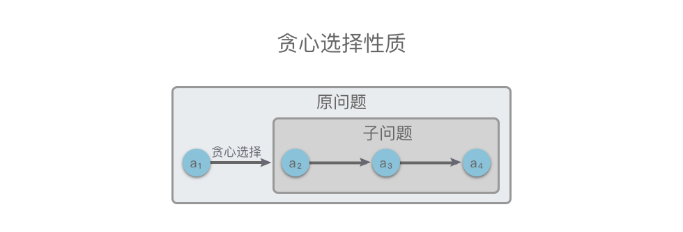

贪心算法在进行选择时，可能会依赖之前做出的选择，但不会依赖任何将来的选择或是子问题的解。运用贪心算法解决的问题在程序的运行过程中无回溯过程。

#### 6.2.2 最优子结构性质

最优子结构性质：指的是一个问题的最优解包含其子问题的最优解。

问题的最优子结构性质是该问题能否用贪心算法求解的关键。举个例子，如下图所示，原问题 $s={a_1, a_2, a_3, a_4}$，在 $a_1$步我们通过贪心选择选出一个当前最优解之后，问题就转换为求解子问题 $S_{subquestion}={a_2, a_3, a_4}$。如果原问题 $S$ 的最优解可以由**第 $a1$ 步通过贪心选择的局部最优解**和 **$S_{subquestion}$的最优解** 构成，则说明该问题满足最优子结构性质。也就是说，如果原问题的最优解包含子问题的最优解，则说明该问题满足最优子结构性质。

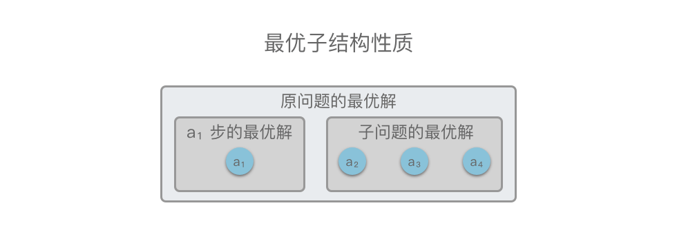

在做了贪心选择后，满足最优子结构性质的原问题可以分解成规模更小的类似子问题来解决，并且可以通过贪心选择和子问题的最优解推导出问题的最优解。

反之，如果不能利用子问题的最优解推导出整个问题的最优解，那么这种问题就不具有最优子结构。

### 6.3 贪心算法正确性证明

贪心算法最难的部分不在于问题的求解，而在于是正确性的证明。我们常用的证明方法有**数学归纳法**和**交换论证法**。

> - 数学归纳法：先计算出边界情况（例如 $n=1$）的最优解，然后再证明对于每个 $n$，$F_{n + 1}$ 都可以由 $F_n$ 推导出。
> - 交换论证法：从最优解出发，在保证全局最优不变的前提下，如果交换方案中任意两个元素或相邻的两个元素后，答案不会变得更好，则可以推定目前的解是最优解。

判断一个问题是否通过贪心算法求解，是需要进行严格的数学证明的。但是在日常写题或者算法面试中，不太会要求大家去证明贪心算法的正确性。

所以，当我们想要判断一个问题是否通过贪心算法求解时，我们可以：

- **凭直觉**：如果感觉这道题可以通过贪心算法去做，就尝试找到局部最优解，再推导出全局最优解。
- **举反例**：尝试一下，举出反例。也就是说找出一个局部最优解推不出全局最优解的例子，或者找出一个替换当前子问题的最优解，可以得到更优解的例子。如果举不出反例，大概率这道题是可以通过贪心算法求解的。

### 6.4 贪心算法三步走

- **转换问题**：将优化问题转换为具有贪心选择性质的问题，即先做出选择，再解决剩下的一个子问题。
- **贪心选择性质**：根据题意选择一种度量标准，制定贪心策略，选取当前状态下**最好或最优选择**，从而得到局部最优解。
- **最优子结构性质**：根据上一步制定的贪心策略，将贪心选择的局部最优解和子问题的最优解合并起来，得到原问题的最优解。

### 6.5 例题

#### 6.5.1 [分发饼干](https://leetcode.cn/problems/assign-cookies/description/)

假设你是一位很棒的家长，想要给你的孩子们一些小饼干。但是，每个孩子最多只能给一块饼干。

对每个孩子 i，都有一个胃口值 `g[i]`，这是能让孩子们满足胃口的饼干的最小尺寸；并且每块饼干 `j`，都有一个尺寸 `s[j]` 。如果 `s[j] >= g[i]`，我们可以将这个饼干 `j` 分配给孩子 `i` ，这个孩子会得到满足。你的目标是尽可能满足越多数量的孩子，并输出这个最大数值。

 
示例 1:

> 输入: `g = [1,2,3], s = [1,1]`
> 输出: 1
> 解释: 
> 你有三个孩子和两块小饼干，3个孩子的胃口值分别是：1,2,3。
> 虽然你有两块小饼干，由于他们的尺寸都是1，你只能让胃口值是1的孩子满足。
> 所以你应该输出1。

示例 2:

> 输入: `g = [1,2], s = [1,2,3]`
> 输出: 2
> 解释: 
> 你有两个孩子和三块小饼干，2个孩子的胃口值分别是1,2。
> 你拥有的饼干数量和尺寸都足以让所有孩子满足。
> 所以你应该输出2.

思路：

为了尽可能的满⾜更多的⼩孩，而且一块饼干不能掰成两半，所以我们应该尽量让胃口小的孩子吃小块饼干，这样胃口大的孩子才有大块饼干吃。

所以，从贪心算法的角度来考虑，我们应该按照孩子的胃口从小到大对数组 `g` 进行排序，然后按照饼干的尺寸大小从小到大对数组 `s` 进行排序，并且对于每个孩子，应该选择满足这个孩子的胃口且尺寸最小的饼干。

下面我们使用贪心算法三步走的方法解决这道题：

1. 转换问题：将原问题转变为，当胃口最小的孩子选择完满足这个孩子的胃口且尺寸最小的饼干之后，再解决剩下孩子的选择问题（子问题）。
2. 贪心选择性质：对于当前孩子，用尺寸尽可能小的饼干满足这个孩子的胃口。
3. 最优子结构性质：在上面的贪心策略下，当前孩子的贪心选择 + 剩下孩子的子问题最优解，就是全局最优解。也就是说在贪心选择的方案下，能够使得满足胃口的孩子数量达到最大。

``` python
class Solution(object):
    def findContentChildren(self, g, s):
        """
        :type g: List[int]
        :type s: List[int]
        :rtype: int
        """
        g.sort()
        s.sort()
        length_g = len(g)
        length_s = len(s)
        curr_g = 0
        curr_s = 0
        while curr_g < length_g and curr_s < length_s:
            if g[curr_g] <= s[curr_s]:
                curr_g += 1
                curr_s += 1
            else:
                curr_s += 1
        return curr_g
```

#### 6.5.2 [无重叠空间](https://leetcode.cn/problems/non-overlapping-intervals/)

给定一个区间的集合 `intervals` ，其中 `intervals[i] = [starti, endi]` 。返回 需要移除区间的最小数量，使剩余区间互不重叠 。

示例 1:

> 输入: `intervals = [[1,2],[2,3],[3,4],[1,3]]`
> 输出: 1
> 解释: 移除 `[1,3]` 后，剩下的区间没有重叠。

示例 2:

> 输入: `intervals = [[1,2], [1,2], [1,2]]`
> 输出: 2
> 解释: 你需要移除两个 `[1,2]` 来使剩下的区间没有重叠。

示例 3:

> 输入: `intervals = [[1,2], [2,3]]`
> 输出: 0
> 解释: 你不需要移除任何区间，因为它们已经是无重叠的了。

思路：

这道题我们可以转换一下思路。原题要求保证移除区间最少，使得剩下的区间互不重叠。换个角度就是：“如何使得剩下互不重叠区间的数目最多”。那么答案就变为了：“总区间个数 - 不重叠区间的最多个数”。我们的问题也变成了求所有区间中不重叠区间的最多个数。

从贪心算法的角度来考虑，我们应该将区间按照结束时间排序。每次选择结束时间最早的区间，然后再在剩下的时间内选出最多的区间。

我们用贪心三部走来解决这道题：

1. 转换问题：将原问题转变为，当选择结束时间最早的区间之后，再在剩下的时间内选出最多的区间（子问题）。
2. 贪心选择性质：每次选择时，选择结束时间最早的区间。这样选出来的区间一定是原问题最优解的区间之一。
3. 最优子结构性质：在上面的贪心策略下，贪心选择当前时间最早的区间 + 剩下的时间内选出最多区间的子问题最优解，就是全局最优解。也就是说在贪心选择的方案下，能够使所有区间中不重叠区间的个数最多。

``` python

```

### 6.6 相关题目

|题号|题目|标签|难度|
|---|---|---|---|
|0455|[分发饼干](https://leetcode.cn/problems/assign-cookies/description/)|贪心、数组、双指针、排序|简单|
|0860|[柠檬水找零](https://leetcode.cn/problems/lemonade-change/description/)|贪心、数组|简单|
|0056|[合并区间](https://leetcode.cn/problems/merge-intervals/description/)|数组、排序、贪心|中等|
|0435|[无重叠区间](https://leetcode.cn/problems/non-overlapping-intervals/description/)|贪心、数组、动态规划、排序|中等|
|0452|[用最少数量的箭引爆气球](https://leetcode.cn/problems/minimum-number-of-arrows-to-burst-balloons/description/)|贪心、数组、排序|中等|
