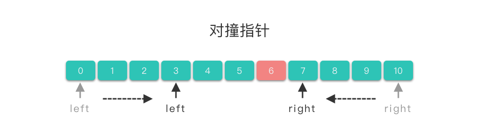
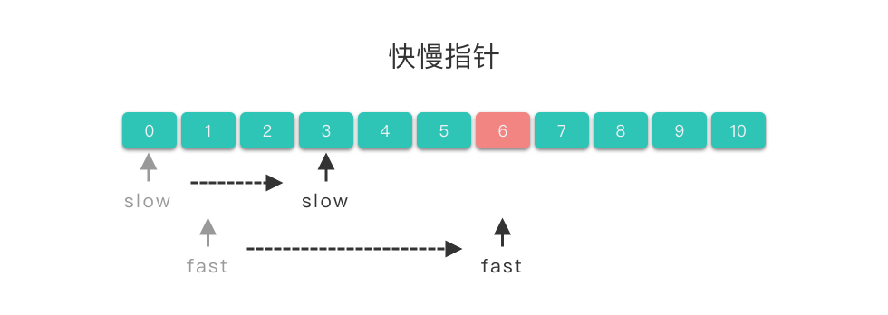
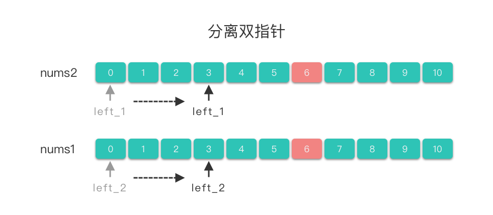
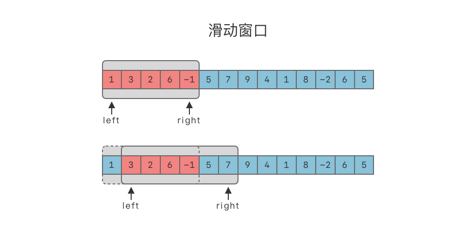
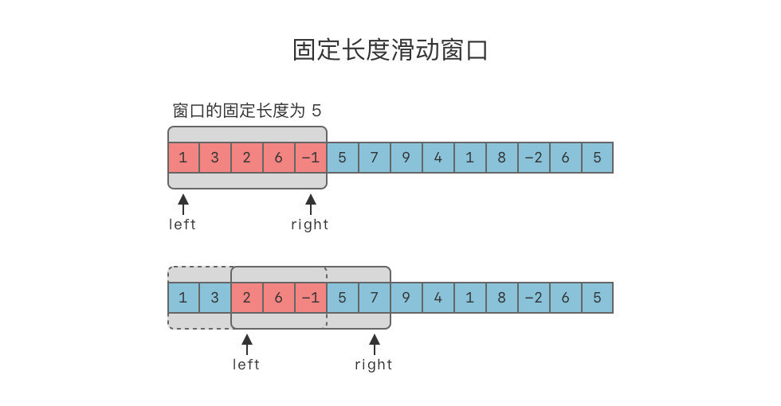
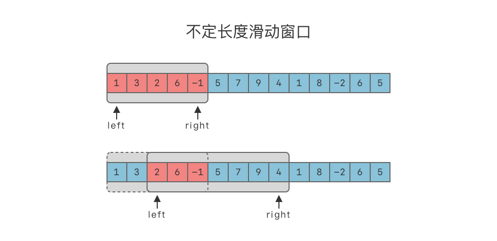

# 数组

- 编辑：李竹楠
- 日期：2024/02/06

## 1. 排序和查找

该部分在[排序](./sort.md)和[查找](./searching.md)部分有详细说明。

## 2. 数组双指针

**双指针(Two Pointers)**：指的是在遍历元素的过程中，不是使用单个指针进行访问，而是使用两个指针进行访问，从而达到相应的目的。如果两个指针方向相反，则称为**对撞指针**。如果两个指针方向相同，则称为**快慢指针**。如果两个指针分别属于不同的数组或链表，则称为**分离双指针**。

在数组的区间问题上，暴力算法的时间复杂度往往是 $O(n^2)$ 。而双指针利用了区间**单调性**的性质，可以将时间复杂度降到 $O(n)$ 。

### 2.1 对撞指针

对撞指针：指的是两个指针 `left` 和 `right` 分别指向序列第一个元素和最后一个元素，然后 `left` 指针不断递增，`right` 不断递减，直到两个指针的值相撞（即 `left==right`），或者满足其他要求的特殊条件为止。



### 2.1.1 对撞指针求解步骤

1. 使用两个指针 `left`，`right`。`left` 指向序列第一个元素，即：`left=0`，`right` 指向序列最后一个元素，即：`right=len(nums)−1`。
2. 在循环体中将左右指针相向移动，当满足一定条件时，将左指针右移，`left+=1`。当满足另外一定条件时，将右指针左移，`right−=1`。
3. 直到两指针相撞（即 `left==right`），或者满足其他要求的特殊条件时，跳出循环体。

模板代码如下：

``` python
left, right = 0, len(nums) - 1
while left < right:
    if condition: # 满足要求的特殊条件
        return success
    elif condition_left: # 满足左指针条件
        left += 1
    elif condition_right: # 满足右指针条件
        right -= 1
return None
```

### 2.1.2 对撞指针适用范围

对撞指针一般用来解决**有序数组**或者**字符串**问题：

- 查找有序数组中满足某些约束条件的一组元素问题：比如二分查找、数字之和等问题。
- 字符串反转问题：反转字符串、回文数、颠倒二进制等问题。

### 2.1.3 例题

#### 2.1.3.1 [两数之和 II - 输入有序数组](https://leetcode.cn/problems/two-sum-ii-input-array-is-sorted/description/)

给你一个下标从 1 开始的整数数组 `numbers` ，该数组已按 非递减顺序排列  ，请你从数组中找出满足相加之和等于目标数 target 的两个数。如果设这两个数分别是 `numbers[index1]` 和 `numbers[index2]` ，则 `1 <= index1 < index2 <= numbers.length`。

以长度为 2 的整数数组 `[index1, index2]` 的形式返回这两个整数的下标 `index1` 和 `index2`。

你可以假设每个输入 **只对应唯一的答案** ，而且你 **不可以** 重复使用相同的元素。

你所设计的解决方案必须只使用常量级的额外空间。

示例 1：

> 输入：numbers = [2,7,11,15], target = 9
> 输出：[1,2]
> 解释：2 与 7 之和等于目标数 9 。因此 index1 = 1, index2 = 2 。返回 [1, 2] 。

示例 2：

> 输入：numbers = [2,3,4], target = 6
> 输出：[1,3]
> 解释：2 与 4 之和等于目标数 6 。因此 index1 = 1, index2 = 3 。返回 [1, 3] 。

示例 3：

> 输入：numbers = [-1,0], target = -1
> 输出：[1,2]
> 解释：-1 与 0 之和等于目标数 -1 。因此 index1 = 1, index2 = 2 。返回 [1, 2] 。

思路：这道题如果暴力遍历数组，从中找到相加之和等于 target 的两个数，时间复杂度为 $O(n^2)$ ，可以尝试一下。

``` python

class Solution:
    def twoSum(self, numbers: List[int], target: int) -> List[int]:
        size = len(numbers)
        for i in range(size):
            for j in range(i + 1, size):
                if numbers[i] + numbers[j] == target:
                    return [i + 1, j + 1]
        return [-1, -1]
```

结果不出意外的超时了。所以我们要想办法减少时间复杂度。可以考虑使用对撞指针来减少时间复杂度。代码如下：

``` python
class Solution(object):
    def twoSum(self, numbers, target):
        """
        :type numbers: List[int]
        :type target: int
        :rtype: List[int]
        """
        left, right = 0, len(numbers) - 1
        while left < right:
            sum = (numbers[left] + numbers[right])
            if sum == target:
                return [left+1, right+1]
            elif sum < target:
                left += 1
            elif sum > target:
                right -= 1
        return [-1, -1]
```

- 时间复杂度：$O(n)$。
- 空间复杂度：$O(1)$。只用到了常数空间存放若干变量。

#### 2.1.3.2 [验证回文串](https://leetcode.cn/problems/valid-palindrome/description/)

如果在将所有大写字符转换为小写字符、并移除所有非字母数字字符之后，短语正着读和反着读都一样。则可以认为该短语是一个 **回文串** 。

字母和数字都属于字母数字字符。

给你一个字符串 `s`，如果它是 回文串 ，返回 `true` ；否则，返回 `false` 。

示例 1：

> 输入: s = "A man, a plan, a canal: Panama"
> 输出：true
> 解释："amanaplanacanalpanama" 是回文串。

示例 2：

> 输入：s = "race a car"
> 输出：false
>解释："raceacar" 不是回文串。

示例 3：

> 输入：s = " "
> 输出：true
> 解释：在移除非字母数字字符之后，s 是一个空字符串 "" 。由于空字符串正着反着读都一样，所以是回文串。

思路：这道题需要对撞指针同时向中间移动，在移动的过程中不停的判断指针内容是否相同。代码如下：

``` python
class Solution(object):
    def isPalindrome(self, s):
        """
        :type s: str
        :rtype: bool
        """
        s = ''.join(ch for ch in s if ch.isalnum()).lower()
        left, right = 0, len(s) - 1
        while left < right:
            if s[left] != s[right]:
                return False
            left += 1
            right -=1
        return True
```

- 时间复杂度：$O(len(s))$。
- 空间复杂度：$O(1)$。只用到了常数空间存放若干变量。

#### 2.1.3.3 [盛最多水的容器](https://leetcode.cn/problems/container-with-most-water/description/)

给定一个长度为 `n` 的整数数组 `height` 。有 `n` 条垂线，第 `i` 条线的两个端点是 `(i, 0)` 和 `(i, height[i])` 。

找出其中的两条线，使得它们与 `x` 轴共同构成的容器可以容纳最多的水。

返回容器可以储存的最大水量。

说明：你不能倾斜容器。

示例 1：


> 输入：[1,8,6,2,5,4,8,3,7]
> 输出：49 
> 解释：图中垂直线代表输入数组 [1,8,6,2,5,4,8,3,7]。在此情况下，容器能够容纳水（表示为蓝色部分）的最大值为 49。

示例 2：

> 输入：height = [1,1]
> 输出：1

思路：对撞指针同时向中间移动，并且计算最大面积。但是需要注意的是找**最长线段**。假如左线段小于右线端，在计算面积的同时，也将左线段向右移动，目的是找到一个**更长的线段**去获得更大的面积，右线端同理。

``` python
class Solution(object):
    def maxArea(self, height):
        """
        :type height: List[int]
        :rtype: int
        """
        left, right = 0, len(height) - 1
        max_ = 0
        while left < right:
            area = (right - left) * (min(height[left], height[right]))
            max_ = max(max_, area)
            if height[left] < height[right]:
                left += 1
            else:
                right -= 1
        return max_
```

- 时间复杂度：$O(n)$。
- 空间复杂度：$O(1)$。

### 2.2 快慢指针

**快慢指针**：指的是两个指针从同一侧开始遍历序列，且移动的步长一个快一个慢。移动快的指针被称为**快指针(fast)**，移动慢的指针被称为**慢指针(slow)**。两个指针以不同速度、不同策略移动，直到快指针移动到数组尾端，或者两指针相交，或者满足其他特殊条件时为止。



#### 2.2.1 快慢指针求解步骤

1. 使用两个指针 `slow`、`fast`。`slow` 一般指向序列第一个元素，即：`slow=0`，`fast` 一般指向序列第二个元素，即：`fast=1`。
2. 在循环体中将左右指针向右移动。当满足一定条件时，将慢指针右移，即 `slow+=1`。当满足另外一定条件时（也可能不需要满足条件），将快指针右移，即 `fast+=1`。
3. 到快指针移动到数组尾端（即 `fast==len(nums)−1`），或者两指针相交，或者满足其他特殊条件时跳出循环体。

模板代码如下：

``` python
slow = 0
fast = 1
while condition: # 遍历条件
    if move: # 满足满指针移动条件
        slow += 1
    fast += 1
```

#### 2.2.2 快慢指针适用范围

快慢指针一般用于处理数组中的**移动、删除元素问题**，或者**链表中的判断是否有环、长度问题**。

#### 2.2.3 例题

##### 2.2.3.1 [删除有序数组中的重复项](https://leetcode.cn/problems/remove-duplicates-from-sorted-array/description/)

给你一个 **非严格递增排列** 的数组 `nums` ，请你 **原地** 删除重复出现的元素，使每个元素 **只出现一次** ，返回删除后数组的新长度。元素的 **相对顺序** 应该保持 一致 。然后返回 `nums` 中唯一元素的个数。

考虑 `nums` 的唯一元素的数量为 `k` ，你需要做以下事情确保你的题解可以被通过：

- 更改数组 `nums` ，使 `nums` 的前 `k` 个元素包含唯一元素，并按照它们最初在 `nums` 中出现的顺序排列。`nums` 的其余元素与 `nums` 的大小不重要。
- 返回 `k` 。

判题标准:

系统会用下面的代码来测试你的题解:

> int[] nums = [...]; // 输入数组
> int[] expectedNums = [...]; // 长度正确的期望答案

> int k = removeDuplicates(nums); // 调用

> assert k == expectedNums.length;
> for (int i = 0; i < k; i++) {
>    assert nums[i] == expectedNums[i];
> }
如果所有断言都通过，那么您的题解将被 **通过**。

示例 1：

> 输入：nums = [1,1,2]
> 输出：2, nums = [1,2,_]
> 解释：函数应该返回新的长度 2 ，并且原数组 nums 的前两个元素被修改为 1, 2 。不需要考虑数组中超出新长度后面的元素。

示例 2：

> 输入：nums = [0,0,1,1,1,2,2,3,3,4]
> 输出：5, nums = [0,1,2,3,4]
> 解释：函数应该返回新的长度 5 ， 并且原数组 nums 的前五个元素被修改为 0, 1, 2, 3, 4 。不需要考虑数组中超出新长度后面的元素。

思路：因为数组是有序的，那么重复的元素一定会相邻。删除重复元素，实际上就是将不重复的元素移到数组左侧。考虑使用双指针。具体算法如下：

1. 定义两个快慢指针 `slow`，`fast`。其中 `slow` 指向去除重复元素后的数组的末尾位置。`fast` 指向当前元素。
2. 令 `slow` 在后， `fast` 在前。令 `slow=0`，`fast=1`。
3. 比较 `slow` 位置上元素值和 `fast` 位置上元素值是否相等。如果不相等，则将 `slow` 右移一位，将 `fast` 指向位置的元素复制到 `slow` 位置上。
4. 将 `fast` 右移 1 位。
5. 重复上述 3∼4 步，直到 `fast` 等于数组长度。
6. 返回 `slow+1` 即为新数组长度。

``` python
class Solution(object):
    def removeDuplicates(self, nums):
        """
        :type nums: List[int]
        :rtype: int
        """
        slow, fast = 0, 1
        while fast < len(nums):
            if nums[slow] != nums[fast]:
                slow += 1
                nums[slow] = nums[fast]
            fast += 1
        return slow + 1
```

- 时间复杂度：$O(n)$。
- 空间复杂度：$O(1)$。

### 2.3 分离双指针

**分离双指针**：两个指针分别属于不同的数组，两个指针分别在两个数组中移动。



#### 2.3.1 分离双指针求解步骤

1. 使用两个指针 `left1`、`left2`。`left1` 指向第一个数组的第一个元素，即：`left1=0`，`left2` 指向第二个数组的第一个元素，即：`left2=0`。
2. 当满足一定条件时，两个指针同时右移，即 `left1+=1`、`left2+=1`。
3. 当满足另外一定条件时，将 `left1+=1`
4. 当满足其他一定条件时，将 `left2+=1`
5. 当其中一个数组遍历完时或者满足其他特殊条件时跳出循环体。

``` python
left_1 = 0
left_2 = 0
while left_1 < len(nums1) and left_2 < len(nums2):
    if condition_1:
        left_1 += 1
        left_2 += 1
    elif condition_2:
        left_1 += 1
    elif condition_3:
        left_2 += 1
```

#### 2.3.2 分离双指针适用范围

分离双指针一般用于处理有序数组合并，求交集、并集问题。

#### 2.3.3 例题

##### 2.3.3.1 [两个数组的交集](https://leetcode.cn/problems/intersection-of-two-arrays/description/)

给定两个数组 `nums1` 和 `nums2` ，返回它们的交集 。输出结果中的每个元素一定是 **唯一** 的。我们可以 不考虑输出结果的顺序 。

示例 1：

> 输入：nums1 = [1,2,2,1], nums2 = [2,2]
> 输出：[2]

示例 2：

> 输入：nums1 = [4,9,5], nums2 = [9,4,9,8,4]
> 输出：[9,4]
> 解释：[4,9] 也是可通过的

思路：先对两个数组进行排序，然后判断两指针只想元素的关系，如果相等则加入（加入时记得做去重，即不在结果数组里就加入）。如果不相等，则指针对齐（对齐的意思是让两个指针指向元素相等的过程，即`left+=1`）。

``` python
class Solution(object):
    def intersection(self, nums1, nums2):
        """
        :type nums1: List[int]
        :type nums2: List[int]
        :rtype: List[int]
        """
        left1, left2 = 0, 0
        nums1.sort()
        nums2.sort()
        res = []
        while left1 < len(nums1) and left2 < len(nums2):
            if nums1[left1] < nums2[left2]:
                left1 += 1
            elif nums1[left1] > nums2[left2]:
                left2 += 1
            else:
                if nums1[left1] not in res:
                    res.append(nums1[left1])
                left1 += 1
                left2 += 1
        return res
```

- 时间复杂度：$O(n)$。
- 空间复杂度：$O(1)$。

### 2.4 总结

双指针分为**对撞指针**、**快慢指针**、**分离双指针**。

- 对撞指针：两个指针方向相反。适合解决查找有序数组中满足某些约束条件的一组元素问题、字符串反转问题。
- 快慢指针：两个指针方向相同。适合解决数组中的移动、删除元素问题，或者链表中的判断是否有环、长度问题。
- 分离双指针：两个指针分别属于不同的数组或链表。适合解决有序数组合并，求交集、并集问题。

## 3. 数组滑动窗口

在计算机网络中，滑动窗口协议(Sliding Window Protocol)是传输层进行流控的一种措施，接收方通过通告发送方自己的窗口大小，从而控制发送方的发送速度，从而达到防止发送方发送速度过快而导致自己被淹没的目的。我们所要讲解的滑动窗口算法也是利用了同样的特性。

> 滑动窗口算法(Sliding Window)：在给定数组或字符串上维护一个固定长度或不定长度的窗口。可以对窗口进行滑动操作、缩放操作，以及维护最优解操作。

- **滑动操作**：窗口可按照一定方向进行移动。最常见的是向右侧移动。
- **缩放操作**：对于不定长度的窗口，可以从左侧缩小窗口长度，也可以从右侧增大窗口长度。

滑动窗口利用了双指针中的**快慢指针**技巧，我们可以将滑动窗口看做是快慢指针两个指针中间的区间，**也可以将滑动窗口看做是快慢指针的一种特殊形式**。



### 3.1 滑动窗口适用范围

滑动窗口算法一般用来解决一些查找满足一定条件的连续区间的性质（长度等）的问题。该算法可以将一部分问题中的嵌套循环转变为一个单循环，因此它可以减少时间复杂度。

按照窗口长度的固定情况，我们可以将滑动窗口题目分为以下两种：

- 固定长度窗口：窗口大小是固定的。
- 不定长度窗口：窗口大小是不固定的。
    - 求解最大的满足条件的窗口。
    - 求解最小的满足条件的窗口。

### 3.2 定长滑动窗口

固定长度滑动窗口算法(Fixed Length Sliding Window)：在给定数组或字符串上维护一个固定长度的窗口。可以对窗口进行滑动操作、缩放操作，以及维护最优解操作。



#### 3.2.1 定长滑动窗口步骤

假设窗口的固定大小为 `windowsize`。

1. 使用两个指针 `left`、`right`。初始时，`left`和`right` 都指向序列的第一个元素，即：`left=0`，`right=0`，区间 `[left,right]` 被称为一个**窗口**。
2. 当窗口未达到 `windowsize` 大小时，不断移动 `right`，先将数组前 `windowsize` 个元素填入窗口中，即 `window.append(nums[right])`。
3. 当窗口达到 `windowsiz` 大小时，即满足 `right - left + 1 >= windowsize` 时，判断窗口内的连续元素是否满足题目限定的条件。
    1. 如果满足，再根据要求更新最优解。
    2. 然后向右移动 left，从而缩小窗口长度，即 `left += 1`，使得窗口大小始终保持为 `windowsize`。
4. 向右移动 `right`，将元素填入窗口中，即 `window.append(nums[right])`。
5. 重复 2∼4 步，直到 `right` 到达数组末尾。

``` python
left = 0
right = 0
while right < len(nums):
    window.append(nums[right])
    # 超过窗口大小时，缩小窗口，维护窗口中始终为 window_size 的长度
    if right - left + 1 >= window_size:
        left += 1
    # 向右侧增大窗口
    right += 1
```

#### 3.2.2 例题

##### 3.2.2.1 [大小为 K 且平均值大于等于阈值的子数组数目](https://leetcode.cn/problems/number-of-sub-arrays-of-size-k-and-average-greater-than-or-equal-to-threshold/description/)

给你一个整数数组 `arr` 和两个整数 `k` 和 `threshold` 。

请你返回长度为 `k` 且平均值大于等于 `threshold` 的子数组数目。

示例 1：

> 输入：arr = [2,2,2,2,5,5,5,8], k = 3, threshold = 4
> 输出：3
> 解释：子数组 [2,5,5],[5,5,5] 和 [5,5,8] 的平均值分别为 4，5 和 6 。其他长度为 3 的子数组的平均值都小于 4 （threshold 的值)。

示例 2：

> 输入：arr = [11,13,17,23,29,31,7,5,2,3], k = 3, threshold = 5
> 输出：6
> 解释：前 6 个长度为 3 的子数组平均值都大于 5 。注意平均值不是整数。

思路：检查“right指针是否到达数组最后一位”作为循环条件，在循环体内对窗口内数组进行求和（注意：不要每次迭代使用sum函数求和，因为时间复杂度会超出。而是选择窗口移动一步就加一个“头数”并减一个“尾数”）。使用left控制窗口大小。遍历完整个数组后，返回结果。

``` python
class Solution(object):
    def numOfSubarrays(self, arr, k, threshold):
        """
        :type arr: List[int]
        :type k: int
        :type threshold: int
        :rtype: int
        """
        left, right = 0, 0
        ret = 0
        sum_ = 0
        while right < len(arr):
            sum_ += arr[right] 
            if right - left + 1 >= k:
                if sum_ / k >= threshold:
                    ret += 1
                sum_ -= arr[left] 
                left += 1
            right += 1
        return ret
```

- 时间复杂度：$O(n)$。
- 空间复杂度：$O(1)$。

### 3.3 不定长滑动窗口

不定长度滑动窗口算法(Sliding Window)：在给定数组或字符串上维护一个不定长度的窗口。可以对窗口进行滑动操作、缩放操作，以及维护最优解操作。



#### 3.3.1 不定长滑动窗口步骤

1. 使用两个指针 `left`、`right`。初始时，`left`、`right` 都指向序列的第一个元素。即：`left=0`，`right=0`，区间 `[left,right]` 被称为**窗口**。
2. 将区间最右侧元素添加入窗口中，即 `window.add(s[right])`。
3. 然后向右移动 `right`，从而增大窗口长度，即 `right += 1`。直到窗口中的连续元素满足要求。
4. 此时，停止增加窗口大小。转向不断将左侧元素移出窗口，即 `window.popleft(s[left])`。
5. 然后向右移动 `left`，从而缩小窗口长度，即 `left += 1`。直到窗口中的连续元素不再满足要求。
6. 重复 2 ~ 5 步，直到 `right` 到达序列末尾。

``` python 
left = 0
right = 0
while right < len(nums):
    window.append(nums[right])
    while condition: # 窗口需要缩小
        window.popleft()
        left += 1
    right += 1
```

#### 3.3.2 例题

##### 3.3.2.1 [无重复字符的最长子串](https://leetcode.cn/problems/longest-substring-without-repeating-characters/description/)

给定一个字符串 `s` ，请你找出其中不含有重复字符的 **最长子串** 的长度。

示例 1:

> 输入: s = "abcabcbb"
> 输出: 3 
> 解释: 因为无重复字符的最长子串是 "abc"，所以其长度为 3。

示例 2:

> 输入: s = "bbbbb"
> 输出: 1
> 解释: 因为无重复字符的最长子串是 "b"，所以其长度为 1。

示例 3:

> 输入: s = "pwwkew"
> 输出: 3
> 解释: 因为无重复字符的最长子串是 "wke"，所以其长度为 3。请注意，你的答案必须是 **子串** 的长度，"pwke" 是一个子序列，不是子串。

思路：

``` python

```

##### 3.3.2.2 [长度最小的子数组](https://leetcode.cn/problems/minimum-size-subarray-sum/description/)

给定一个含有 `n` 个正整数的数组和一个正整数 `target` 。

找出该数组中满足其总和大于等于 `target` 的长度最小的 连续子数组 `[numsl, numsl+1, ..., numsr-1, numsr]` ，并返回其长度。如果不存在符合条件的子数组，返回0。

示例 1：

> 输入：target = 7, nums = [2,3,1,2,4,3]
> 输出：2
> 解释：子数组 [4,3] 是该条件下的长度最小的子数组。

示例 2：

> 输入：target = 4, nums = [1,4,4]
> 输出：1

示例 3：

> 输入：target = 11, nums = [1,1,1,1,1,1,1,1]
> 输出：0

思路：

``` python

```

##### 3.3.2.3 乘积小于K的子数组