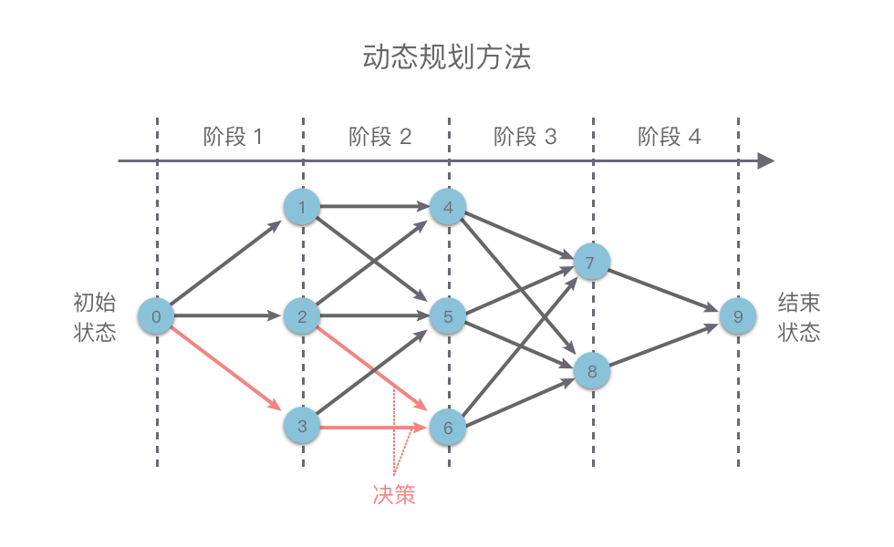

# 动态规划(Dynamic Programming)

- 编辑：李竹楠
- 日期：2024/03/15

## 1. 简介

动态规划（Dynamic Programming）：简称 DP，是一种求解多阶段决策过程最优化问题的方法。在动态规划中，通过把原问题分解为相对简单的子问题，先求解子问题，再由子问题的解而得到原问题的解。

动态规划最早由理查德 · 贝尔曼于 1957 年在其著作 *动态规划（Dynamic Programming）* 一书中提出。这里的 Programming 并不是编程的意思，而是指一种“表格处理方法”，即将每一步计算的结果存储在表格中，供随后的计算查询使用。

## 2. 核心思想

动态规划的核心思想：

1. 把**原问题**分解为**若干个重叠的子问题**，每个子问题的求解过程都构成一个**阶段**。在完成一个阶段的计算之后，动态规划方法才会执行下一个阶段的计算。
2. 在求解子问题的过程中，按照**自顶向下的记忆化搜索方法**或者**自底向上的递推方法**求解出**子问题的解**，把结果存储在表格中，当需要再次求解此子问题时，直接从表格中查询该子问题的解，从而避免了大量的重复计算。

这看起来很像是分治算法，但动态规划与分治算法的不同点在于：

- 适用于动态规划求解的问题，在分解之后得到的子问题往往是相互联系的，会出现若干个重叠子问题。
- 使用动态规划方法会将这些重叠子问题的解保存到表格里，供随后的计算查询使用，从而避免大量的重复计算。

下面我们先来通过一个简单的例子来介绍一下什么是动态规划算法，然后再来讲解动态规划中的各种术语。斐波那契数列：数列由 $f(0)=1$，$f(1)=2$ 开始，后面的每一项数字都是前面两项数字的和。也就是：

$$
f(n) =
    \begin{cases}
      0, & n=0 \\
      1, & n=1 \\
      f(n-2)+f(n-1), & n>1
    \end{cases}
$$

计算过程如下：


从上图可知，会重现大量的重复项。为了避免这个缺点，我们可以使用动态规划中的**表格处理方法**来处理。

``` python
def fib(self, n: int) -> int:
    if n == 0:
        return 0
    if n == 1:
        return 1
    dp = [0 for _ in range(n + 1)]
    dp[0] = 0
    dp[1] = 1
    for i in range(2, n + 1):
        dp[i] = dp[i - 2] + dp[i - 1]
    return dp[n]
```

这种使用缓存（哈希表、集合或数组）保存计算结果，从而避免子问题重复计算的方法，就是**动态规划算法**。

## 3. 基本思路

如下图所示，我们在使用动态规划方法解决某些最优化问题时，可以将解决问题的过程按照一定顺序（时间顺序、空间顺序或其他顺序）分解为若干个相互联系的**阶段**。然后按照顺序对每一个阶段做出**决策**，这个决策既决定了本阶段的效益，也决定了下一阶段的初始状态。依次做完每个阶段的决策之后，就得到了一个整个问题的决策序列。这样就将一个原问题分解为了一系列的子问题，再通过逐步求解从而获得最终结果。



这种前后关联、具有链状结构的多阶段进行决策的问题也叫做**多阶段决策问题**。

通常我们使用动态规划方法来解决问题的基本思路如下：

1. **划分阶段**：原问题按顺序（时间顺序、空间顺序或其他顺序）分解为若干个相互联系的**阶段**。划分后的阶段⼀定是有序或可排序的，否则问题⽆法求解。这里的**阶段**指的是⼦问题的求解过程。每个⼦问题的求解过程都构成⼀个**阶段**，在完成前⼀阶段的求解后才会进⾏后⼀阶段的求解。
2. **定义状态**：将和子问题相关的某些变量（位置、数量、体积、空间等等）作为一个**状态**表示出来。状态的选择要满⾜⽆后效性。一个**状态**对应一个或多个子问题，所谓某个**状态**下的值，指的就是这个**状态**所对应的子问题的解。
3. **状态转移**：根据**上一阶段的状态**和**该状态下所能做出的决策**，推导出**下一阶段的状态**。或者说根据相邻两个阶段各个状态之间的关系，确定决策，然后推导出状态间的相互转移方式（即**状态转移方程**）。
4. **初始条件和边界条件**：根据问题描述、状态定义和状态转移方程，确定初始条件和边界条件。
5. **最终结果**：确定问题的求解目标，然后按照一定顺序求解每一个阶段的问题。最后根据状态转移方程的递推结果，确定最终结果。

动态规划问题的关键点在于**如何状态设计**和**推导状态转移条件**，还有各种各样的**优化方法**。

### 3.1 例题

#### 3.1.1 [爬楼梯](https://leetcode.cn/problems/climbing-stairs/)

假设你正在爬楼梯。需要 n 阶你才能到达楼顶。

每次你可以爬 1 或 2 个台阶。你有多少种不同的方法可以爬到楼顶呢？

示例 1：

> 输入：n = 2
> 输出：2
> 解释：有两种方法可以爬到楼顶。
> 1. 1 阶 + 1 阶
> 2. 2 阶

示例 2：

> 输入：n = 3
> 输出：3
> 解释：有三种方法可以爬到楼顶。
> 1. 1 阶 + 1 阶 + 1 阶
> 2. 1 阶 + 2 阶
> 3. 2 阶 + 1 阶

思路：

1. 设置状态表 `dp`
2. 设置已知状态：`dp[0] = 1`，`dp[1] = 1`
2. 推导状态转移函数 `dp[i]=dp[i−1]+dp[i−2]`
3. 使用状态转移函数计算未知状态

``` python
class Solution(object):
    def climbStairs(self, n):
        """
        :type n: int
        :rtype: int
        """
        dp = [0] * (n+1)
        dp[0] = 1
        dp[1] = 1
        for i in range(2, n+1):
            dp[i] = dp[i-1] + dp[i-2]
        return dp[n]
```

#### 3.1.2 [不同路径](https://leetcode.cn/problems/unique-paths/)

一个机器人位于一个 m x n 网格的左上角 （起始点在下图中标记为 “Start” ）。

机器人每次只能向下或者向右移动一步。机器人试图达到网格的右下角（在下图中标记为 “Finish” ）。

问总共有多少条不同的路径？

示例 1：

> 输入：m = 3, n = 2
> 输出：3
> 解释：
> 从左上角开始，总共有 3 条路径可以到达右下角。
> 1. 向右 -> 向下 -> 向下
> 2. 向下 -> 向下 -> 向右
> 3. 向下 -> 向右 -> 向下

``` python
class Solution(object):
    def uniquePaths(self, m, n):
        """
        :type m: int
        :type n: int
        :rtype: int
        """
        dp = [[0 for _ in range(n)] for _ in range(m)]
        for i in range(m):
            dp[i][0] = 1
        for j in range(n):
            dp[0][j] = 1
        for i in range(1, m):
            for j in range(1, n):
                dp[i][j] = dp[i][j-1] + dp[i-1][j]
        return dp[m-1][n-1]
```

### 3.2 其他实现

#### 3.2.1 记忆化搜索

记忆化搜索(Memoization Search)：是一种通过存储已经遍历过的状态信息，从而避免对同一状态重复遍历的搜索算法。

记忆化搜索是动态规划的一种实现方式。在记忆化搜索中，当算法需要计算某个子问题的结果时，它首先检查是否已经计算过该问题。如果已经计算过，则直接返回已经存储的结果；否则，计算该问题，并将结果存储下来以备将来使用。

##### 3.2.1.1 记忆化搜索与递推区别

- 记忆化搜索：**自顶向下**的解决问题，采用自然的递归方式编写过程，在过程中会保存每个子问题的解（通常保存在一个数组或哈希表中）来避免重复计算。
    - 优点：代码清晰易懂，可以**有效的处理一些复杂的状态转移方程**。有些状态转移方程是非常复杂的，使用记忆化搜索可以将复杂的状态转移方程拆分成多个子问题，通过递归调用来解决。
    - 缺点：可能会因为递归深度过大而导致**栈溢**出问题。
- 递推：**自底向上**的解决问题，采用循环的方式编写过程，在过程中通过保存每个子问题的解（通常保存在一个数组或哈希表中）来避免重复计算。
    - 优点：避免了深度过大问题，**不存在栈溢出**问题。计算顺序比较明确，易于实现。
    - 缺点：无法处理一些**复杂的状态转移方程**。有些状态转移方程非常复杂，如果使用递推方法来计算，就会导致代码实现变得非常困难。

根据记忆化搜索和递推的优缺点，我们可以在不同场景下使用这两种方法。

- 适合使用**记忆化搜索**的场景：
    - 问题的状态转移方程比较复杂，递推关系不是很明确。
    - 问题适合转换为递归形式，并且递归深度不会太深。

- 适合使用**递推**的场景：
    - 问题的状态转移方程比较简单，递推关系比较明确。
    - 问题不太适合转换为递归形式，或者递归深度过大容易导致栈溢出。

##### 3.2.1.2 记忆化搜索解题步骤

我们在使用记忆化搜索解决问题的时候，其基本步骤如下：

1. 写出问题的动态规划**状态**和**状态转移方程**。
2. 定义一个缓存（数组或哈希表），用于保存子问题的解。
3. 定义一个递归函数，用于解决问题。在递归函数中，首先检查缓存中是否已经存在需要计算的结果，如果存在则直接返回结果，否则进行计算，并将结果存储到缓存中，再返回结果。
4. 在主函数中，调用递归函数并返回结果。

##### 3.2.1.3 例题

###### 3.2.1.3.1 [目标和](https://leetcode.cn/problems/target-sum/description/)


###### 3.2.1.3.2 [第 N 个泰波那契数](https://leetcode.cn/problems/n-th-tribonacci-number/description/)

思路：使用动态规划。具体来说，使用了递推（用时22ms）和记忆化搜索（用时9ms）两种实现方式，但是最终的耗时（leetcode显示）并不一致。两种思路基本一致，使用dp或者memo存储状态，并且根据不同实现方式进行状态转移。不同点在于，递推中使用 `dp[i] = dp[i-3] + dp[i-2] + dp[i-1]` 作为状态转移方程去转移状态，而记忆化搜索中使用 `memo[n] = self.func(memo, n-3) +  self.func(memo, n-2) +  self.func(memo, n-1)` 递归调用去完成状态转移。

递归：

``` python 
def tribonacci(self, n):
    """
    :type n: int
    :rtype: int
    """    
    dp = [-1] * (n+1)
    dp[0] = 0
    dp[1] = 1
    dp[2] = 1
    for i in range(3, n+1):
        dp[i] = dp[i-3] + dp[i-2] + dp[i-1]
    return dp[n] 
```

记忆化搜索：

``` python
class Solution(object):
    def tribonacci(self, n):
        """
        :type n: int
        :rtype: int
        """
        memo = [0] * (n+1)
        return self.func(memo, n)

    def func(self, memo, n):
        if n < 3: return 0 if n == 0 else 1 
        if memo[n] != 0: return memo[n]
        memo[n] = self.func(memo, n-3) +  self.func(memo, n-2) +  self.func(memo, n-1)
        return memo[n]
```

#### 3.2.2 线性动态规划


#### 3.2.3 背包问题

背包问题：背包问题是线性线性规划问题中一类经典而又特殊的模型。背包问题可以描述为：给定一组物品，每种物品都有自己的重量、价格以及数量。再给定一个最多能装重量为 $W$ 的背包。现在选择将一些物品放入背包中，请问在总重量不超过背包载重上限的情况下，能装入背包的最大价值总和是多少？


根据物品限制条件的不同，背包问题可分为：0-1 背包问题、完全背包问题、多重背包问题、分组背包问题，以及混合背包问题等。

背包问题的暴力解题思路比较简单。假设有 $n$ 件物品。我们先枚举出这 $n$ 件物品所有可能的组合。然后再判断这些组合中的物品是否能放入背包，以及是否能得到最大价值。这种做法的时间复杂度是 $O(2^n)$。背包问题暴力解法的时间复杂度是指数级别的，我们可以利用动态规划算法减少一下时间复杂度。下面我们来讲解一下如何使用动态规划方法解决各种类型的背包问题。

##### 3.2.3.1 0-1背包问题

0-1背包问题：有 $n$ 件物品和有一个最多能装重量为 $W$ 的背包。第 $i$ 件物品的重量为$ weight[i]$，价值为 $value[i]$，每件物品有且只有 $1$ 件。请问在总重量不超过背包载重上限的情况下，能装入背包的最大价值是多少？

###### 3.2.3.1.1 基本思路

0-1 背包问题的特点：每种物品有且仅有 $1$ 件，可以选择不放入背包，也可以选择放入背包。

思路：

1. 划分阶段：按照物品的序号、当前背包的载重上限进行阶段划分。
2. 定义状态：定义状态 $dp[i][w]$ 表示为：前 $i$ 件物品放入一个最多能装重量为 $w$ 的背包中，可以获得最大价值。状态 $dp[i][w]$ 是一个二维数组，其中第一维代表**当前正在考虑的物品**，第二维表示**当前背包的载重上限**，二维数组值表示**可以获得的最大价值**。
3. 状态转移方程：对于**将前 $i$ 件物品放入一个最多能装重量为 $w$ 的背包中，可以获得的最大价值**这个子问题，如果我们只考虑第 $i−1$ 件物品（前 $i$ 件物品中最后一件物品）的放入策略（放入背包和不放入背包两种策略）。则问题可以转换为一个只跟前 $i−1$ 件物品相关的问题。有以下情况：

- **第 $i−1$ 件物品不放入背包**：问题转换为**前 $i−1$ 件物品放入一个最多能装重量为 $w$ 的背包中 ，可以获得的最大价值**为 $dp[i−1][w]$。
- **第 $i−1$ 件物品放入背包**：问题转换为**前 $i−1$ 件物品放入一个最多能装重量为 $w−weight[i−1]$ 的背包中，可以获得的最大价值**为 $dp[i−1][w−weight[i−1]]$，再加上**放入的第 $i−1$ 件物品的价值**为 $value[i−1]$，则此时可以获得的最大价值为 $dp[i−1][w−weight[i−1]]+value[i−1]$。

接下来我们再来考虑一下第 $i−1$ 件物品满足什么条件时才能考虑是否放入背包，并且在什么条件下一定不能放入背包：

- 如果当前背包的载重不足时（即 w<weight[i−1]w < weight[i - 1]w<weight[i−1]）：第 i−1i - 1i−1 件物品一定不能放入背包，此时背包的价值 dp[i][w]dp[i][w]dp[i][w] 仍为 dp[i−1][w]dp[i - 1][w]dp[i−1][w] 时的价值，即 dp[i][w]=dp[i−1][w]dp[i][w] = dp[i - 1][w]dp[i][w]=dp[i−1][w]。
- 如果当前背包的载重足够时（即 w≥weight[i−1]w \ge weight[i - 1]w≥weight[i−1]）：第 i−1i - 1i−1 件物品可以考虑放入背包，或者不放入背包，此时背包的价值取两种情况下的最大值，即 dp[i][w]=max{dp[i−1][w],dp[i−1][w−weight[i−1]]+value[i−1]}dp[i][w] = max \lbrace dp[i - 1][w], dp[i - 1][w - weight[i - 1]] + value[i - 1] \rbracedp[i][w]=max{dp[i−1][w],dp[i−1][w−weight[i−1]]+value[i−1]}

则状态转移方程为：

$$

$$

4. 
5. 

###### 3.2.3.1.2 0-1背包问题滚动数组优化

###### 3.2.3.1.3 例题

##### 3.2.3.2 完全背包问题

##### 3.2.3.3 多重背包问题

##### 3.2.3.4 分组背包问题

##### 3.2.3.5 混合背包问题

#### 3.2.4 区间动态规划

## 4. 相关题目

|题号|题目|标签|难度|
|---|---|---|---|
|0070|[爬楼梯](https://leetcode.cn/problems/climbing-stairs/description/)|记忆化搜索、数学、动态规划|简单|
|0062|[不同路径](https://leetcode.cn/problems/unique-paths/description/)|数学、动态规划、组合数学|中等|
|0494|[目标和](https://leetcode.cn/problems/target-sum/description/)|数组、动态规划、回溯|中等|
|1137|[第 N 个泰波那契数](https://leetcode.cn/problems/n-th-tribonacci-number/description/)|记忆化搜索、数学、动态规划|简单|
|||||
|||||
|||||
|||||
|||||
|||||
|||||
|||||