# 图

- 作者：李竹楠
- 日期：2023/12/17

## 1. 图的表示

图的表示有两种：邻接矩阵和邻接表。

邻接矩阵是表示图形中 顶点之间相邻关系 的矩阵，对于$n$个顶点的图而言，矩阵的$row$和$col$表示的是$1....n$个点。

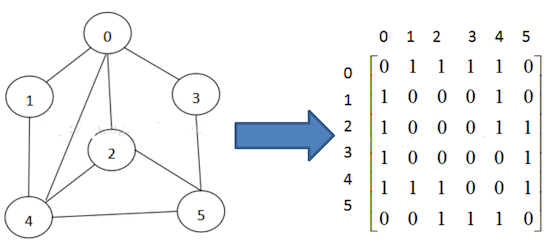

上图是一个无向图，它用矩阵表示如右图：

- 左侧的0~5表示顶点（也就是列，竖看）
- 横着的0~5表示，左侧的顶点，与其他顶点的关系

比如：$(0,0)$的值为$0$，则表示**不能直连**，$(0,1)$的值为$1$，表示可用直连。

由于邻接矩阵有一个缺点：它需要为每个顶点都分配$n$个边的空间，其实有很多边都是不存在的（比如上面的$(0,0)$不链接，也需要表示出来），这**会造成空间的一定损失**。

而邻接表的实现只关心 存在的边，因此没有空间浪费，由数组+链表组成。

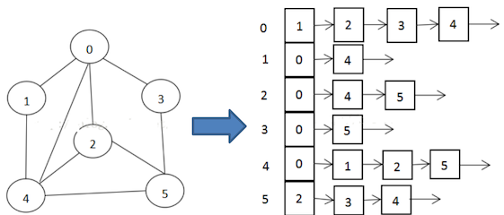

如上图：

- 左侧（竖向）表示了有$n$个点，用数组存放。
- 右侧每一个点，都有一条链表，表示：**顶点与链表中的点都可以直连。**

在后续代码中，将使用邻接矩阵作为基本的表示形式被算法操作。

## 2. 图的遍历

### 2.1 广度优先遍历(BFS)


遍历或搜索是可在图上执行的基本操作之一。在广度优先搜索(BFS)中，我们从一个特定的顶点开始，在进入下一层的顶点之前探索它当前深度的所有邻居。与树不同，图可以包含循环(第一个和最后一个顶点是相同的路径)。因此，**我们必须跟踪访问过的顶点。在实现BFS时，我们使用队列数据结构**。

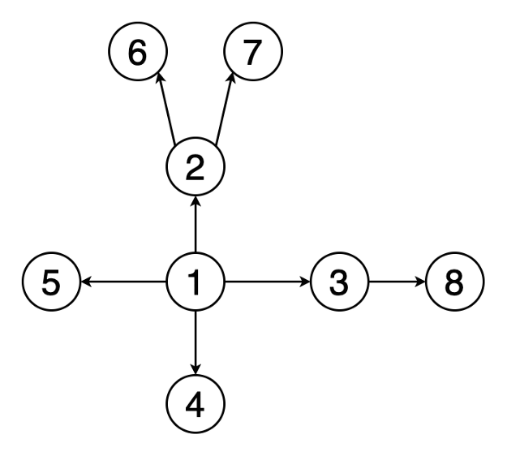

上图（注意，该图是无向图，箭头只是表示下一个节点法线方向，而不是有向图）表示一个示例图的BFS遍历的动画。注意顶点是如何被发现(黄色)和被访问(红色)的。

应用：

- 用于确定最短路径和最小生成树。
- 被搜索引擎爬虫用来建立网页的索引。
- 用来在社交网络上搜索。
- 用于查找可用的邻接节点在对等网络，如BitTorrent。

### 2.2 深度优先遍历(DFS)

在深度优先搜索(DFS)中，我们从一个特定的顶点开始，在回溯(backtracking)之前沿着每个分支尽可能地搜索。在DFS中，我们还需要跟踪访问过的顶点。在实现DFS时，我们**使用堆栈数据结构来支持回溯**。


上图（注意，该图是无向图，箭头只是表示下一个节点法线方向，而不是有向图）示例图进行DFS遍历的动画。注意它是如何遍历到深度和回溯的。

应用：

- 用于查找两个顶点之间的路径。
- 用于检测图中的循环。
- 用于拓扑排序。
- 用于解决只有一个解的谜题(如迷宫)。

## 3. 最短路径算法

从一个顶点到另一个顶点的最短路径是图中应该移动的边的权值总和最小的路径。文档和代码着重说明Dijkstra算法、Floyd-Warshall算法和A*算法

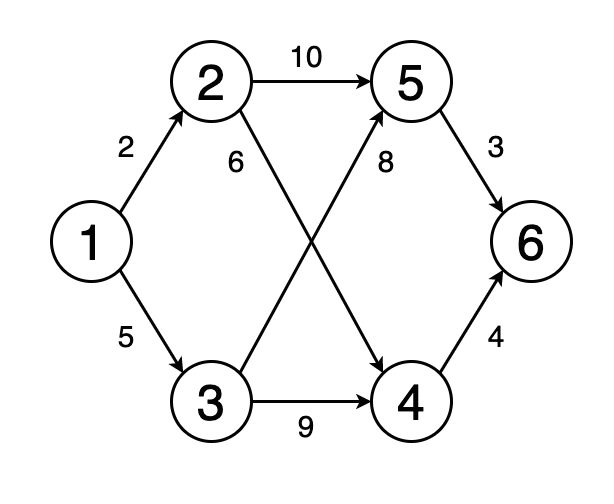

上图（注意，该图是无向图，箭头只是表示下一个节点法线方向，而不是有向图）显示了一个动画，其中确定了图中顶点1到顶点6的最短路径。

应用：

- 用于在谷歌maps或Apple maps等地图软件中查找从一个地方到另一个地方的路线。
- 用于网络中解决最小时延路径问题。

### 3.1 Dijkstra算法

使用 Dijkstra 算法，可以寻找图中节点之间的最短路径。特别是，可以在图中寻找一个节点（称为“源节点”）到所有其它节点的最短路径，生成一个最短路径树。GPS设备使用这个算法来寻找当前位置到目标位置的最短路径。Dijkstra算法被广泛应用在工业上，尤其是需要建模网络的领域。

算法图解：

1. 选定A节点并初始化，如上述步骤3所示

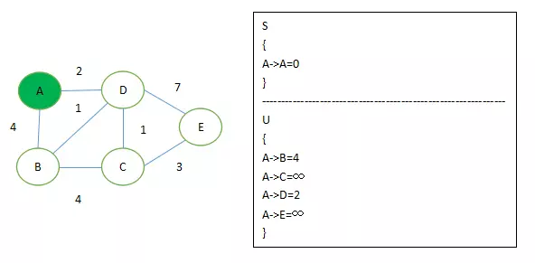

2. 执行上述 4、5两步骤，找出U集合中路径最短的节点D 加入S集合，并根据条件如果‘D到B,C,E的距离’+‘AD距离’小于‘A到B,C,E的距离’来更新U集合。

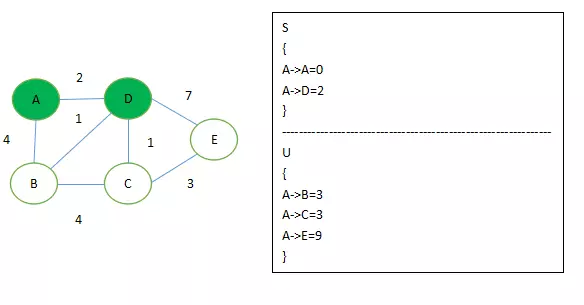

3. 这时候 A->B, A->C 都为3，没关系。其实这时候他俩都是最短距离，如果从算法逻辑来讲的话，会先取到B点。而这个时候如果条件变成了‘B到C, E的距离’+‘AB距离’小于‘A到C, E的距离’，如图所示这时候A->B距离，其实为 A->D->B

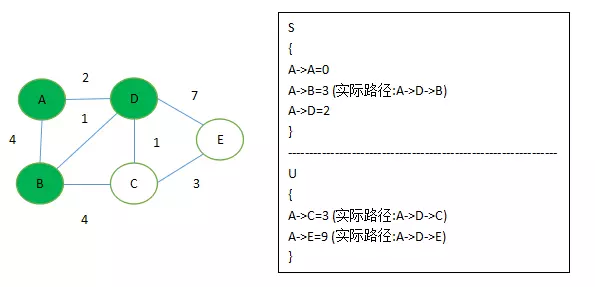

4. 思路就是这样，往后就是大同小异了。

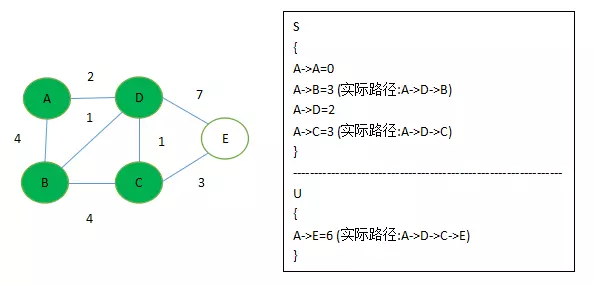

5. 算法结束

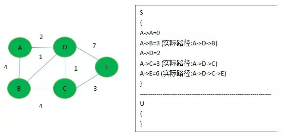

**迪杰斯特拉算法的运行过程是一个排序的过程，既不是深度优先也不是广度优先算法**。就上面的例子来说，是根据A到图中其余点的最短路径长度进行排序，路径越短越先被找到，路径越长越靠后才能被找到，要找A到F的最短路径，我们依次找到了。

- A –> C 的最短路径 3
- A –> C –> B 的最短路径 5
- A –> C –> D 的最短路径 6
- A –> C –> E 的最短路径 7
- A –> C –> D –> F 的最短路径 9

Dijkstra 算法运行的附加效果是得到了另一个信息，A到C的路径最短，其次是A到B, A到D, A到E, A到F。

为什么 Dijkstra 算法不适用于带负权的图？
> Dijkstra算法是贪心算法，大概前提是，从当前的所有可能中就能找到全局的最优解，而负权图不满足这个条件（比如本文末尾的图例）。
> 如果是正权图，集合内的点到初始点的最短距离已经确认了，把没在集合内的点加入路径只可能会增加无用的边，也就增加了路径长度；所以只根据集合内点的邻边来更新，就能得到当前的最小```d[x]```了。
> 但如果是负权图，注意上句话中的文字 “把没在集合内的点加入路径”，这个时候，如果边的长度是负的，就有可能产生更小的```d[x]```！而Dijkstra根本没有不会考虑 “把没在集合内的点加入路径”这种情况，这也就是Dijkstra算法目光短浅的原因。
> 举个例子：
> ```
> A ---(4)--- B 
>  \         / 
>   \(5)    /(-3)
>    \     /
>       C
> ```
> 从A到B的最短路。用Dijkstra算法，第一步就能得到所谓的最短路径长度4，不会去考虑边(C,B)。 而实际上最短路径却需要加入边(C, B)，长度是2。
> 对于带负权的图，搜索最短路径应该用Floyd算法。

### 3.2 Floyd-Warshall算法

Floyd-Warshall算法（Floyd-Warshall algorithm）是解决任意两点间的最短路径的一种算法，可以正确处理**有向图或负权**的最短路径问题，同时也被用于计算有向图的传递闭包。Floyd-Warshall算法的时间复杂度为$O(n^3)$，空间复杂度为$O(n^2)$。

Floyd算法是一个经典的**动态规划**算法。用通俗的语言来描述的话，首先我们的目标是寻找从点i到点j的最短路径。从动态规划的角度看问题，我们需要为这个目标重新做一个诠释（这个诠释正是动态规划最富创造力的精华所在）。

从任意节点i到任意节点j的最短路径不外乎2种可能，1是直接从i到j，2是从i经过若干个节点k到j。所以，我们假设```Dis(i,j)```为节点u到节点v的最短路径的距离，对于每一个节点k，我们检查```Dis(i,k) + Dis(k,j) < Dis(i,j)```是否成立，如果成立，证明从i到k再到j的路径比i直接到j的路径短，我们便设置```Dis(i,j) = Dis(i,k) + Dis(k,j)```，这样一来，当我们遍历完所有节点k，```Dis(i,j)```中记录的便是i到j的最短路径的距离。

算法描述：

1. 从任意一条单边路径开始。所有两点之间的距离是边的权，如果两点之间没有边相连，则权为无穷大。
2. 对于每一对顶点 u 和 v，看看是否存在一个顶点 w 使得从 u 到 w 再到 v 比己知的路径更短。如果是更新它。

算法图解：

两条线，从左上角开始计算一直到右下角。如下所示，给出矩阵，其中矩阵A是邻接矩阵，而矩阵Path记录u,v两点之间最短路径所必须经过的点。

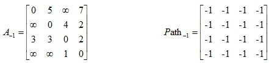

相应计算方法如下：

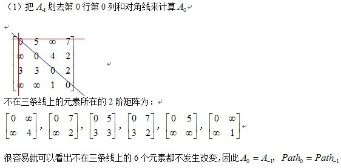

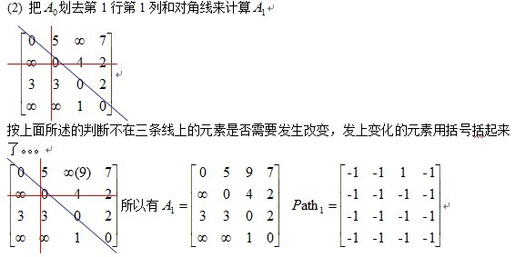

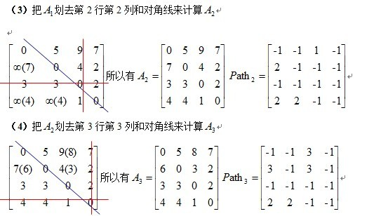

### 3.3 A*算法


## 4. 最小生成树

### 4.1 Prim算法

### 4.2 Kruskal算法

## 5. 图匹配

## 6. 强连通分支算法与网络流

## 7. 拓扑排序

## 8. 循环检测

## 9. 图着色