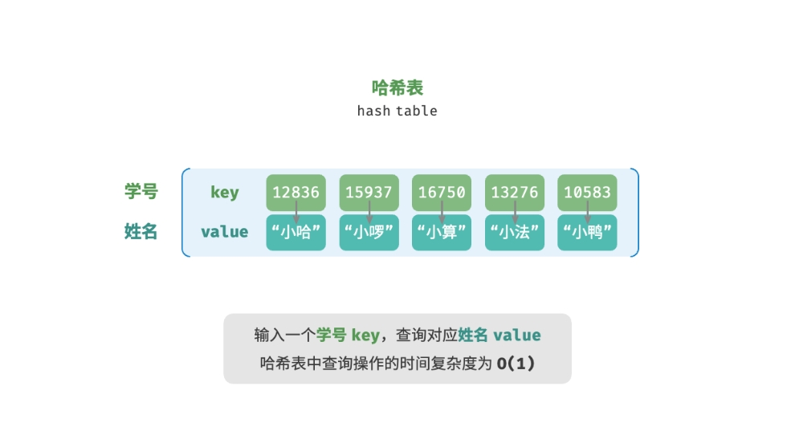
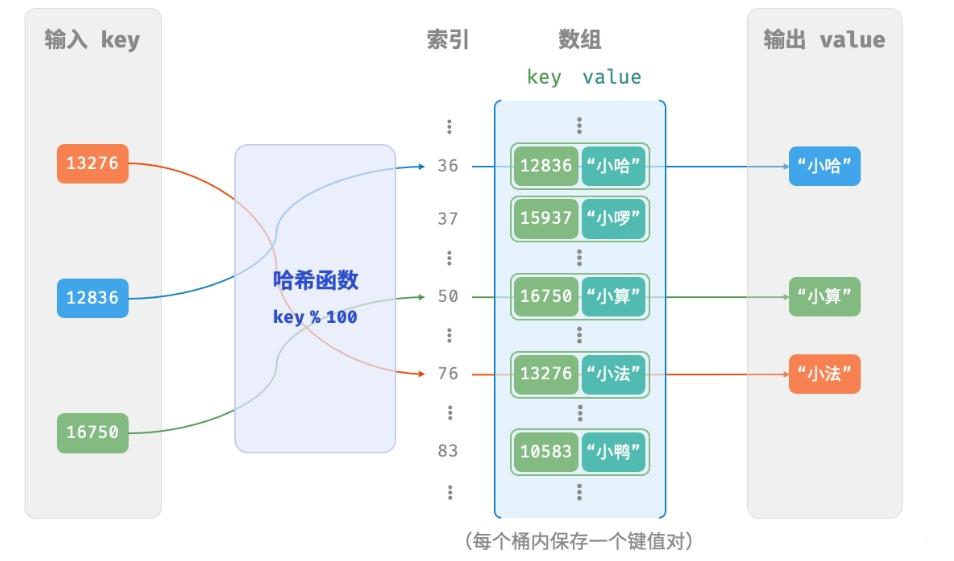
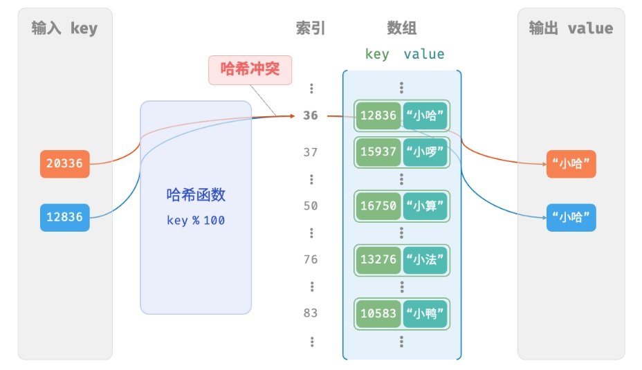
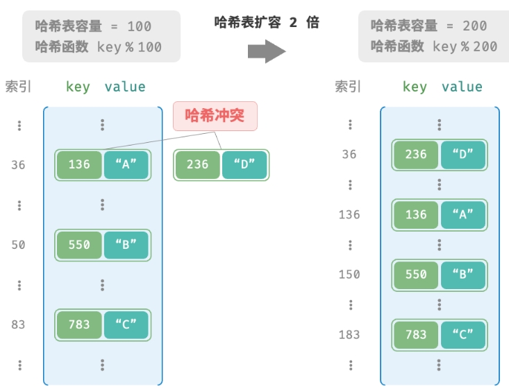
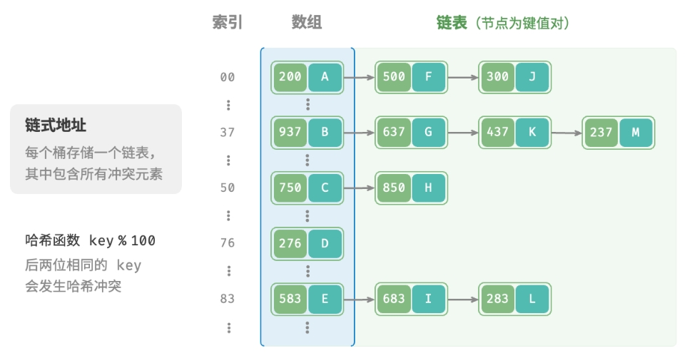
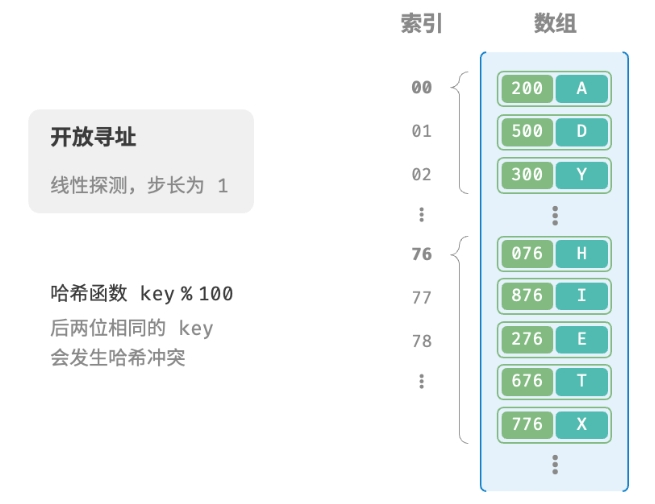
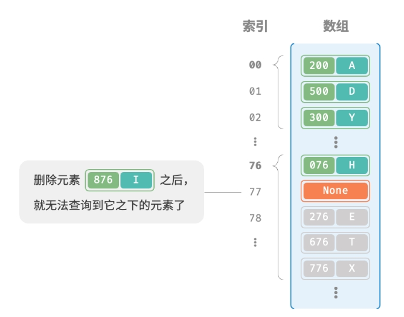
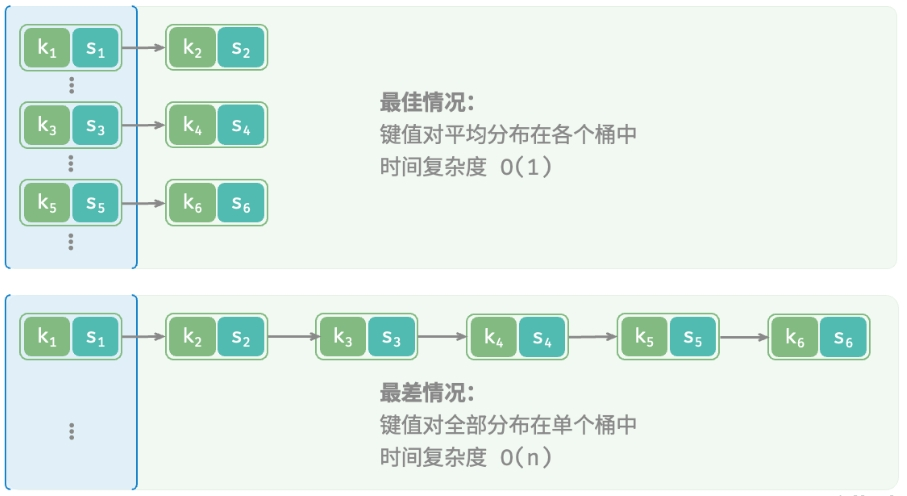

# 哈希表

- 编辑：李竹楠
- 日期：2023/12/10

## 1. 哈希表基础

### 1.1 简介

哈希表(hash table)，又称散列表，它通过建立键 `key` 与值 `value` 之间的映射，实现高效的元素查询。具体而言，我们向哈希表中输入一个键 key ，则可以在$O(1)$时间内获取对应的值 `value` 。



如上图，n个学生，每个学生都有“姓名”和“学号”两项数据。假如我们希望实现“输入一个学号，返回对应的姓名”的查询功能，则可以采用哈希表来实现。

除哈希表外，数组和链表也可以实现查询功能，它们的效率对比如下表所示：

||数组|链表|哈希表|
|---|---|---|---|
|查找|$O(n)$|$O(n)$|$O(1)$|
|添加|$O(1)$|$O(1)$|$O(1)$|
|删除|$O(n)$|$O(n)$|$O(1)$|

观察发现，**在哈希表中进行增删查改的时间复杂度都是$O(1)$**，非常高效。

### 1.2 哈希表简单实现

我们先考虑最简单的情况，仅用一个数组来实现哈希表。在哈希表中，我们将数组中的每个空位称为“桶(bucket)”，每个桶可存储一个键值对。因此，查询操作就是找到 `key` 对应的桶，并在桶中获取 `value` 。

那么，如何基于 key 定位对应的桶呢？这是通过 **[哈希函数 hash function](#2-散列函数)** 实现的。**哈希函数的作用是将一个较大的输入空间映射到一个较小的输出空间**。在哈希表中，输入空间是所有 key ，输出空间是所有桶（数组索引）。换句话说，输入一个 `key` ，**我们可以通过哈希函数得到该 `key` 对应的键值对在数组中的存储位置**。

输入一个 `key`，哈希函数的计算过程分为以下两步。

1. 通过某种哈希算法 `hash()` 计算得到哈希值。
2. 将哈希值对桶数量（数组长度）capacity 取模，从而获取该 `key` 对应的数组索引index($index = hash(key) \% capacity$)。

随后，我们就可以利用 `index` 在哈希表中访问对应的桶，从而获取 `value` 。

例如，设数组长度$capacity = 100$、哈希算法$hash(key) = key$，得哈希函数为$key \% 100$。下图以 `key` 学号和 `value` 姓名为例，展示了哈希函数的工作原理：



将以上过程实现代码：[实现基于数组的哈希表](../../../code/1/1.1/hash-table/array_map.py)，散列函数如下所示：

``` python
def _hash_func(self, key):
        return key%len(self.buckets)
```

## 2. 散列函数

在上节中，对key取模值即为散列函数的一种，或者被称为哈希函数。**哈希函数（Hash Function）：将哈希表中元素的关键键值映射为元素存储位置的函数**。

在哈希表的实际应用中，关键字的类型除了整型，还有可能是字符串类型、浮点数类型、大整数类型，甚至还有可能是几种类型的组合。一般我们会将各种类型的**关键字先转换为整型**，再通过哈希函数，将其映射到哈希表中。

而关于整数类型的关键字，通常用到的哈希函数方法有：直接定址法、除留余数法、平方取中法、基数转换法、数字分析法、折叠法、随机数法、乘积法、点积法等。下面我们介绍几个常用的哈希函数方法。

### 2.1 直接定址法

取关键字本身 / 关键字的某个线性函数值作为哈希地址。即：

$$
Hash(key)=key
$$

或者

$$
Hash(key)=a×key+b
$$

其中 $a$ 和 $b$ 为常数。

这种方法计算**最简单**，且**不会产生冲突**。适合于**关键字分布基本连续**的情况，如果关键字分布不连续，空位较多，则会**造成存储空间的浪费**。

举一个例子，假设我们有一个记录了从 1 岁到 100 岁的人口数字统计表。其中年龄为关键字，哈希函数取关键字自身，如下表所示：

|年龄|1|2|3|4|5|6|...|100|
|---|---|---|---|---|---|---|---|---|
|人数|300|200|580|100|400|200|...|12|

比如我们想要查询 5 岁的人有多少，则只要查询表中第 5 项即可。

### 2.2 除留余数法

假设哈希表的表长为 $m$，取一个不大于 $m$ 但接近或等于 $m$ 的质数 $p$，利用取模运算，将关键字转换为哈希地址。即：

$$
Hash(key)=key \mod p
$$

其中 $p$ 为不大于 $m$ 的质数。

这也是一种简单且常用的哈希函数方法。其关键点在于 $p$ 的选择。根据经验而言，一般 $p$ 取素数或者 $m$，这样可以尽可能的减少冲突。

比如我们需要将 7 个数 `[432,5,128,193,92,111,88]`存储在 10 个区块中（长度为 10 的数组），通过除留余数法将这 7 个数应分别位于如下地址：

|索引|0|1|2|3|4|5|6|7|8|9|
|---|---|---|---|---|---|---|---|---|---|---|
|数据|88|111||432|92|5|193||128||||

### 2.3 平方取中法

先通过求关键字平方值的方式**扩大相近数之间的差别**，然后根据表长度取关键字平方值的中间几位数为哈希地址。例如：

$$
Hash(key)=\frac{key^2}{100}\mod1000
$$

先计算平方，去除末尾的 $2$ 位数，再取中间 $3$ 位数作为哈希地址。这种方法因为**关键字平方值的中间几位数和原关键字的每一位数都相关**，所以产生的**哈希地址也比较均匀**，有利于减少冲突的发生。

### 2.4 基数转换法

将关键字看成另一种进制的数再转换成原来进制的数，然后选其中几位作为哈希地址。比如，将关键字看做是 13 进制的数，再将其转变为 10 进制的数，将其作为哈希地址。

以 343246 为例，哈希地址计算方式如下：

$$
343246_{13}=3×13^5+4×13^4+3×13^3+2×13^2+4×13^1+6×13^0=1235110_{10}
$$

## 3. 哈希冲突与扩容

### 3.1 扩容

从本质上看，哈希函数的作用是将所有 key 构成的输入空间映射到数组所有索引构成的输出空间，而输入空间往往远大于输出空间。因此， **理论上一定存在“多个输入对应相同输出”** 的情况。对于上述示例中的哈希函数，当输入的 `key` 后两位相同时，哈希函数的输出结果也相同。例如，查询学号为 12836 和 20336 的两个学生时，我们得到：

``` shell
12836 % 100 = 36
20336 % 100 = 36
```
如下图所示，两个学号指向了同一个姓名，这显然是不对的。我们将这种多个输入对应同一输出的情况称为**哈希冲突(hash collision)**。



容易想到，哈希表容量$n$越大，多个 `key` 被分配到同一个桶中的概率就越低，冲突就越少。因此，**我们可以通过扩容哈希表来减少哈希冲突**。

如下图所示，扩容前键值对 (136, A) 和 (236, D) 发生冲突，扩容后冲突消失。



类似于数组扩容，哈希表扩容需将所有键值对从原哈希表迁移至新哈希表，**非常耗时**；并且由于哈希表容量capacity改变，我们需要通过哈希函数来重新计算所有键值对的存储位置，这进一步增加了扩容过程的**计算开销**。为此，编程语言通常会预留足够大的哈希表容量，防止频繁扩容。

**负载因子(load factor)** 是哈希表的一个重要概念，其定义为哈希表的元素数量除以桶数量，用于衡量哈希冲突的严重程度，也常作为哈希表扩容的触发条件。例如在 Java 中，当负载因子超过0.75时，系统会将哈希表扩容至原先的2倍。

哈希冲突会导致查询结果错误，严重影响哈希表的可用性。为了解决该问题，每当遇到哈希冲突时，我们就进行哈希表扩容，直至冲突消失为止。此方法简单粗暴且有效，但效率太低，因为哈希表扩容需要进行大量的数据搬运与哈希值计算。为了提升效率，我们可以采用以下策略:

- 改良哈希表数据结构，**使得哈希表可以在出现哈希冲突时正常工作**
- 仅在必要时，即当哈希冲突比较严重时，才执行扩容操作

哈希表的结构改良方法主要包括 **[链式地址](#32-链式地址法)** 和 **[开放寻址](#33-开放寻址法)**。

代码实现如下：

``` python
# 
# ...
self.size = 0 # 哈希表使用量
self.capacity = 10 # 哈希表容量
self.load_thres = load_thres # 扩容阈值
self.extend_ratio = extend_ratio # 扩容倍数
# ...
# 当前容量大于阈值时进行扩容
if self._load_factor() > self.load_thres:
    self._extend()
# ...
def _extend(self):  
    # 暂存旧哈希表
    temp = self.buckets
    # 扩容后的哈希表
    self.capacity *= self.extend_ratio
    self.buckets = [[] for _ in range(self.capacity)]
    self.size = 0
    # 哈希表搬运
    for t in temp:
        for pair in t:
            self.put(pair.key, pair.value)
```

### 3.2 链式地址法

在原始哈希表中，每个桶仅能存储一个键值对。**链式地址(separate chaining)** 将单个元素转换为链表，将键值对作为链表节点，将所有发生冲突的键值对都存储在同一链表中。下图展示了一个链式地址哈希表的例子。



基于链式地址实现的哈希表的操作方法发生了以下变化：

- **查询元素**：输入 `key` ，经过哈希函数得到桶索引，即可访问链表头节点，然后遍历链表并对比 `key` 以查找目标键值对。
- **添加元素**：首先通过哈希函数访问链表头节点，然后将节点（键值对）添加到链表中。
- **删除元素**：根据哈希函数的结果访问链表头部，接着遍历链表以查找目标节点并将其删除。

链式地址存在以下局限性：

- **占用空间增大**：链表包含节点指针，它相比数组更加耗费内存空间。
- **查询效率降低**：因为需要线性遍历链表来查找对应元素。

实现代码给出了[链式地址哈希表的简单实现](../../../code/1/1.1/hash-table/map.py)

``` python
# ...
# hash table桶结构，为了简化代码，这里并没有使用链表，而是使用动态数组。
# 哈希表中含有多个桶。每个桶都是一个列表，桶内含有键值对
self.buckets = [[] for _ in range(self.capacity)]
# ...
# 插入操作作为示例，对哈希表进行操作。
def put(self, key, value):
    # 扩容
    if self._load_factor() > self.load_thres:
        self._extend()
    bucket = self.buckets[self._hash_func(key)]
    # 若key存在，则更新
    for pair in bucket:
        if pair.key == key:
            pair.value = value
            return
    # 若key不存在，则新增
    pair = Pair(key, value)
    bucket.append(pair)
    self.size += 1
```

**注意：当链表很长时，查询效率 $O(n)$ 很差。此时可以将链表转换为AVL树或红黑树，从而将查询操作的时间复杂度优化至 $O(\log n)$**。

### 3.3 开放寻址法

**开放寻址(open addressing)** 不引入额外的数据结构，而是通过“多次探测”来处理哈希冲突，探测方式主要包括线性探测、平方探测和多次哈希等。

下面以线性探测为例，介绍开放寻址哈希表的工作机制。

#### 3.3.1 线性探测

线性探测采用固定步长的线性搜索来进行探测，其操作方法与普通哈希表有所不同。

- **插入元素**：通过哈希函数计算桶索引，若发现桶内已有元素，则从冲突位置向后线性遍历（步长通常为1），直至找到空桶，将元素插入其中。
- **查找元素**：若发现哈希冲突，则使用相同步长向后进行线性遍历，直到找到对应元素，返回 `value` 即可；如果遇到空桶，说明目标元素不在哈希表中，返回 `None` 。

下图展示了开放寻址（线性探测）哈希表的键值对分布。根据此哈希函数，最后两位相同的 key 都会被映射到相同的桶。而通过线性探测，它们被依次存储在该桶以及之下的桶中。



然而，线性探测容易产生**聚集现象**。具体来说，数组中连续被占用的位置越长，这些连续位置发生哈希冲突的可能性越大，从而进一步促使该位置的聚堆生长，形成恶性循环，最终导致增删查改操作效率劣化。

值得注意的是，我们**不能在开放寻址哈希表中直接删除元素**。这是因为删除元素会在数组内产生一个空桶 `None` ，而当查询元素时，线性探测到该空桶就会返回，因此在该空桶之下的元素都无法再被访问到，程序可能误判这些元素不存在，如下图所示：



为了解决该问题，我们可以采用**懒删除(lazy deletion0**机制：它不直接从哈希表中移除元素，而是利用一个常量 **`TOMBSTONE`** 来标记这个桶。在该机制下，`None `和 `TOMBSTONE` 都代表空桶，都可以放置键值对。但不同的是，线性探测到 `TOMBSTONE` 时应该继续遍历，因为其之下可能还存在键值对。

然而，**懒删除可能会加速哈希表的性能退化**。这是因为每次删除操作都会产生一个删除标记，随着 `TOMBSTONE` 的增加，搜索时间也会增加，因为线性探测可能需要跳过多个 `TOMBSTONE` 才能找到目标元素。

为此，考虑在线性探测中记录遇到的首个 `TOMBSTONE` 的索引，并将搜索到的目标元素与该 `TOMBSTONE` 交换位置。这样做的好处是当每次查询或添加元素时，元素会被移动至距离理想位置（探测起始点）更近的桶，从而优化查询效率。

#### 3.3.2 平方探测

平方探测与线性探测类似，都是开放寻址的常见策略之一。当发生冲突时，平方探测不是简单地跳过一个固定的步数，而是跳过“探测次数的平方”的步数，即$1, 4, 9, \dots$步。

平方探测主要具有以下优势。

- 平方探测通过跳过探测次数平方的距离，试图**缓解线性探测的聚集效应**。
- 平方探测会跳过更大的距离来寻找空位置，有助于**数据分布得更加均匀**。

然而，平方探测并不是完美的：

- **仍然存在聚集现象**，即某些位置比其他位置更容易被占用。
- 由于平方的增长，平方探测**可能不会探测整个哈希表**，这意味着即使哈希表中有空桶，平方探测也可能无法访问到它。

#### 3.3.3 多次哈希

顾名思义，多次哈希方法使用多个哈希函数$f_1(x), f_2(x), f_3(x), \dots$进行探测。

- **插入元素**：若哈希函数$f_1(x)$出现冲突，则尝试$f_2(x)$，以此类推，直到找到空位后插入元素。
- **查找元素**：在相同的哈希函数顺序下进行查找，直到找到目标元素时返回；若遇到空位或已尝试所有哈希函数，说明哈希表中不存在该元素，则返回 `None`。

与线性探测相比，多次哈希方法不易产生聚集，但多个哈希函数会带来额外的计算量。

**注意：开放寻址（线性探测、平方探测和多次哈希）哈希表都存在“不能直接删除元素”的问题**。

### 3.4 编程语言相关

各种编程语言采取了不同的哈希表实现策略，下面举几个例子：

- Python： 采用开放寻址，字典 `dict` 使用伪随机数进行探测。
- Java：采用链式地址，自 JDK 1.8 以来，当 `HashMap` 内数组长度达到 64 且链表长度达到 8 时，链表会转换为**红黑树**以提升查找性能。
- Go：采用链式地址，Go 规定每个桶最多存储 8 个键值对，超出容量则连接一个溢出桶；当溢出桶过多时，会执行一次特殊的等量扩容操作，以确保性能。

## 4. 哈希算法

无论是开放寻址还是链式地址，**它们只能保证哈希表可以在发生冲突时正常工作，而无法减少哈希冲突的发生**。

如果哈希冲突过于频繁，哈希表的性能则会急剧劣化。如下图所示，对于链式地址哈希表，理想情况下键值对均匀分布在各个桶中，达到最佳查询效率；最差情况下所有键值对都存储到同一个桶中，时间复杂度退化至$O(n)$。



对于公式

$$
index = hash(key) \% capacity
$$

当哈希表容量(capacity)固定时，哈希算法 `hash()` 决定了输出值，进而决定了键值对在哈希表中的分布情况。这意味着，为了降低哈希冲突的发生概率，我们应当将注意力集中在哈希算法 `hash()` 的设计上。

### 4.1 哈希算法的目标

为了实现“既快又稳”的哈希表数据结构，哈希算法应具备以下特点。

- **确定性**：对于相同的输入，哈希算法应始终产生相同的输出。这样才能确保哈希表是可靠的。
- **效率高**：计算哈希值的过程应该足够快。计算开销越小，哈希表的实用性越高。
- **均匀分布**：哈希算法应使得键值对均匀分布在哈希表中。分布越均匀，哈希冲突的概率就越低。

实际上，哈希算法除了可以用于实现哈希表，还广泛应用于其他领域中。

- **密码存储**：为了保护用户密码的安全，系统通常不会直接存储用户的明文密码，而是存储密码的哈希值。当用户输入密码时，系统会对输入的密码计算哈希值，然后与存储的哈希值进行比较。如果两者匹配，那么密码就被视为正确。
    - 可以固定密码长度
    - 散列值不可逆，即使数据库泄露，也无法破解密码
- **数据完整性检查**：数据发送方可以计算数据的哈希值并将其一同发送；接收方可以重新计算接收到的数据的哈希值，并与接收到的哈希值进行比较。如果两者匹配，那么数据就被视为完整。

对于密码学的相关应用，为了防止从哈希值推导出原始密码等逆向工程，哈希算法需要具备更高等级的安全特性。

- **单向性**：无法通过哈希值反推出关于输入数据的任何信息。
- **抗碰撞性**：应当极难找到两个不同的输入，使得它们的哈希值相同。
- **雪崩效应**：输入的微小变化应当导致输出的显著且不可预测的变化。

**注意：“均匀分布”与“抗碰撞性”是两个独立的概念，满足均匀分布不一定满足抗碰撞性**。例如，在随机输入 `key` 下，哈希函数 $key \% 100$ 可以产生均匀分布的输出。然而该哈希算法过于简单，所有后两位相等的 `key` 的输出都相同，因此我们可以很容易地从哈希值反推出可用的 `key` ，从而破解密码。

### 4.2 哈希算法的设计

哈希算法的设计是一个需要考虑许多因素的复杂问题。然而对于某些要求不高的场景，我们也能设计一些简单的哈希算法。

- **加法哈希**：对输入的每个字符的 ASCII 码进行相加，将得到的总和作为哈希值。
- **乘法哈希**：利用乘法的不相关性，每轮乘以一个常数，将各个字符的 ASCII 码累积到哈希值中。
- **异或哈希**：将输入数据的每个元素通过异或操作累积到一个哈希值中。
- **旋转哈希**：将每个字符的 ASCII 码累积到一个哈希值中，每次累积之前都会对哈希值进行旋转操作。

许多哈希算法最后一步会对大质数取模。因为**使用大质数作为模数，可以最大化地保证哈希值的均匀分布**。因为质数不与其他数字存在公约数，可以减少因取模操作而产生的周期性模式，从而避免哈希冲突。

总而言之，我们通常选取质数作为模数，并且这个质数最好足够大，以尽可能消除周期性模式，提升哈希算法的稳健性。

### 4.3 常见哈希算法

在实际中，我们通常会用一些标准哈希算法，例如 MD5、SHA-1、SHA-2 和 SHA-3 等。它们可以将任意长度的输入数据映射到恒定长度的哈希值。

下表展示了实际应用中常见的哈希算法：

||MD5|SHA-1|SHA-2|SHA-3|
|---|---|---|---|---|
|推出时间|1992|1995|2002|2008|
|输出长度|128 bit|160 bit|256/512 bit|224/256/384/512 bit|
|哈希冲突|较多|较多|很少|很少|
|安全等级|低，已被成功攻击|低，已被成功攻击|高|高|
|应用|已被弃用，仍用于数据完整性检查|已被弃用|加密货币交易验证、数字签名等|可代替SHA-2|

- MD5 和 SHA-1 已多次被成功攻击，因此它们被各类安全应用弃用。
- SHA-2 系列中的 SHA-256 是最安全的哈希算法之一，仍未出现成功的攻击案例，因此常用在各类安全应用与协议中。
- SHA-3 相较 SHA-2 的实现开销更低、计算效率更高，但目前使用覆盖度不如 SHA-2 系列。

### 4.4 数据结构的哈希值

哈希表的 `key` 可以是整数、小数或字符串等数据类型。编程语言通常会为这些数据类型提供内置的哈希算法，用于计算哈希表中的桶索引。以 Python 为例，我们可以调用 `hash()` 函数来计算各种数据类型的哈希值。

- 整数和布尔量的哈希值就是其本身。
- 浮点数和字符串的哈希值计算较为复杂。
- 元组的哈希值是对其中每一个元素进行哈希，然后将这些哈希值组合起来，得到单一的哈希值。
- 对象的哈希值基于其内存地址生成。通过重写对象的哈希方法，可实现基于内容生成哈希值。

**注意，不同编程语言的内置哈希值计算函数的定义和方法不同。**

``` python
num = 3
hash_num = hash(num)
# 整数 3 的哈希值为 3

bol = True
hash_bol = hash(bol)
# 布尔量 True 的哈希值为 1

dec = 3.14159
hash_dec = hash(dec)
# 小数 3.14159 的哈希值为 326484311674566659

str = "Hello 算法"
hash_str = hash(str)
# 字符串“Hello 算法”的哈希值为 4617003410720528961

tup = (12836, "小哈")
hash_tup = hash(tup)
# 元组 (12836, '小哈') 的哈希值为 1029005403108185979

obj = ListNode(0)
hash_obj = hash(obj)
# 节点对象 <ListNode object at 0x1058fd810> 的哈希值为 274267521
```

在许多编程语言中，**只有不可变对象才可作为哈希表的 `key`** 。假如我们将列表（动态数组）作为 `key` ，当列表的内容发生变化时，它的哈希值也随之改变，我们就无法在哈希表中查询到原先的 `value` 了。

虽然自定义对象（比如链表节点）的成员变量是可变的，但它是可哈希的。**这是因为对象的哈希值通常是基于内存地址生成的**，即使对象的内容发生了变化，但它的内存地址不变，哈希值仍然是不变的。

在不同控制台中运行程序时，输出的哈希值是不同的。**这是因为 Python 解释器在每次启动时，都会为字符串哈希函数加入一个随机的盐（salt）值**。这种做法可以有效防止 HashDoS 攻击，提升哈希算法的安全性。

> 关于HashDos攻击
> 随着RESTful风格的接口普及，程序员默认都会使用json作为数据传递的方式。json格式的数据冗余少，兼容性高，从提出到现在已被广泛的使用，可以说成为了Web的一种标准。无论我们服务端使用什么语言，我们拿到json格式的数据之后都需要做jsonDecode(),将json串转换为json对象，而对象默认会存储于Hash Table，而Hash Table很容易被碰撞攻击。我只要将攻击数据放在json中，服务端程序在做jsonDecode()时必定中招，中招后CPU会立刻飙升至100%。16核的CPU，16个请求就能达到DoS的目的。

## 5. 面试题

日后再补