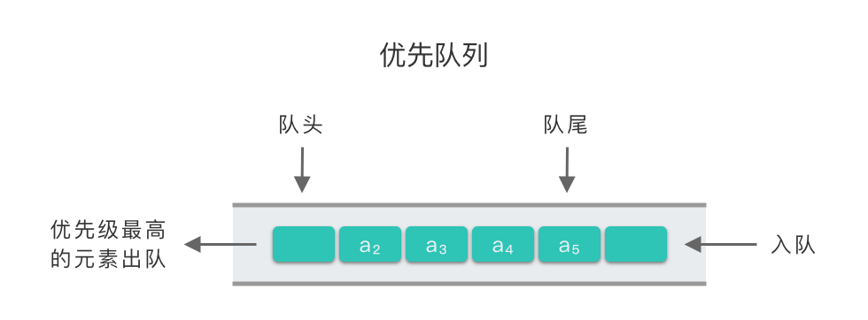

# 队列

- 编辑：李竹楠
- 日期：2024/02/08

## 1. 队列的应用

队列是算法和程序中最常用的辅助结构，其应用十分广泛。比如现实生活中的排队买票、银行办理业务挂号等等。队列在计算机科学领域的应用主要提现在以下两个方面：

- **解决计算机的主机与外部设备之间速度不匹配的问题**：比如解决主机与打印机之间速度不匹配问题。主机输出数据给计算机打印，输出数据的速度比打印数据的速度要快很多，如果直接把数据送给打印机进行打印，由于速度不匹配，显然行不通。为此，可以设置一个打印数据缓存队列，将要打印的数据依次写入缓存队列中。然后打印机从缓冲区中按照先进先出的原则依次取出数据并且打印。这样即保证了打印数据的正确，又提高了主机的效率。
- **解决由于多用户引起的系统资源竞争的问题**：比如说一个带有多终端的计算机系统，当有多个用户需要各自运行各自的程序时，就分别通过终端向操作系统提出占用 CPU 的请求。操作系统通常按照每个请求在时间上的先后顺序将它们排成一个队列，每次把 CPU 分配给队头请求的用户使用；当相应的程序运行结束或用完规定的时间间隔之后，将其退出队列，再把 CPU 分配给新的队头请求的用户使用。这样既能满足多用户的请求，又能使 CPU 正常运行。

## 2. 优先队列

**优先队列(Priority Queue)**：一种特殊的队列。在优先队列中，元素被赋予优先级，当访问队列元素时，具有最高优先级的元素最先删除。优先队列与普通队列最大的不同点在于**出队顺序**。

- 普通队列的出队顺序跟入队顺序相关，符合先进先出(First in, First out)的规则。
- 优先队列的出队顺序跟入队顺序无关，优先队列是按照元素的优先级来决定出队顺序的。优先级高的元素优先出队，优先级低的元素后出队。优先队列符合最高级先出(First in, Largest out)的规则。



### 2.1 适用场景

优先队列的应用场景非常多，比如：

- 数据压缩：赫夫曼编码算法；
- 最短路径算法：Dijkstra 算法；
- 最小生成树算法：Prim 算法；
- 任务调度器：根据优先级执行系统任务；
- 事件驱动仿真：顾客排队算法；
- 排序问题：查找第 k 个最小元素。

很多语言都提供了优先级队列的实现。比如，Java 的 PriorityQueue，C++ 的 priority_queue 等。Python 中也可以通过 heapq 来实现优先队列。

### 2.2 实现方式

优先队列所涉及的基本操作跟普通队列差不多，主要是**入队操作**和**出队操作**。而优先队列的实现方式也有很多种，除了使用数组（顺序存储）实现与链表（链式存储）实现之外，我们最常用的是使用 **二叉堆结构实现**优先队列。以下是三种方案的介绍和总结。

- 数组（顺序存储）实现优先队列：入队操作直接插入到数组队尾，时间复杂度为 $O(1)$。出队操作需要遍历整个数组，找到优先级最高的元素，返回并删除该元素，时间复杂度为 $O(n)$。
- 链表（链式存储）实现优先队列：链表中的元素按照优先级排序，入队操作需要为待插入元素创建节点，并在链表中找到合适的插入位置，时间复杂度为 $O(n)$。出队操作直接返回链表队头元素，并删除队头元素，时间复杂度为 $O(1)$。
- 二叉堆结构实现优先队列：构建一个二叉堆结构，二叉堆按照优先级进行排序。入队操作就是将元素插入到二叉堆中合适位置，时间复杂度为 $O(\log⁡_2n)$。吹对操作则返回二叉堆中优先级最大节点并删除，时间复杂度也是 $O(\log⁡_2n)$。

下表是三种结构实现的优先队列入队操作和出队操作的时间复杂度总结。

||入队操作时间复杂度|出队操作（取出优先级最高的元素）时间复杂度|
|---|---|---|
|堆|$O(\log⁡_2n)$|$O(\log⁡_2n)$|
|数组|$O(1)$|$O(n)$|
|链表|$O(n)$|$O(1)$|

使用二叉堆这种数据结构来实现优先队列是比较高效的。下面我们来讲解一下二叉堆实现的优先队列。

### 2.3 使用堆实现优先队列

涉及堆的基本介绍和操作可参考[tree.md](./tree.md)中*5. 堆*中的介绍，在此不作赘述。

对于优先队列的基本操作有：

- **入队操作 heappush**：
    1. 先将待插入元素 `value` 插入到数组 `nums` 末尾。
    2. 如果完全二叉树的深度为 `d`，则从 `d−1` 层开始最右侧分支节点（序号为 $\lfloor \frac{n}{2} \rfloor$）开始，初始时令 $i=\lfloor \frac{n}{2} \rfloor$，从下向上依次查找插入位置。
    3. 遇到 `value` 小于当前根节点时，将其插入到当前位置。否则继续向上寻找插入位置。
    4. 如果找到插入位置或者到达根位置，将 `value` 插入该位置。
- **出队操作 heappop**：
    1. 交换数组 `nums` 首尾元素，此时 `nums` 尾部就是值最大（优先级最高）的元素，将其从 `nums` 中弹出，并保存起来。
    2. 弹出后，对 `nums` 剩余元素调用堆调整算法，将其调整为大顶堆。

#### 2.3.1 手写二叉堆实现优先队列

日后再补。

#### 2.3.2 使用 heapq 模块实现优先队列

Python 中的 `heapq` 模块提供了优先队列算法。函数 `heapq.heappush()` 用于在队列 `queue` 上插入一个元素。`heapq.heappop()` 用于在队列 `queue` 上删除一个元素。

**注意：`heapq.heappop()` 函数总是返回最小的元素。所以我们在使用 `heapq.heappush()` 时，将优先级设置为负数，这样就使得元素可以按照优先级从高到低排序， 这个跟普通的按优先级从低到高排序的堆排序恰巧相反。这样做的目的是为了 `heapq.heappop()` 每次弹出的元素都是优先级最高的元素。**

``` python
import heapq
class PriorityQueue:
    def __init__(self):
        self.queue = []
        self.index = 0

    def push(self, item, priority):
        # 传入两个参数，一个是存放元素的数组，另一个是要存储的元素，这里是一个元组。
        # 由于heap内部默认有小到大排，所以对priority取负数
        heapq.heappush(self.queue, (-priority, self.index, item))
        self.index += 1

    def pop(self):
        return heapq.heappop(self.queue)[-1]
```

### 2.4 例题

#### 2.4.1 [滑动窗口最大值](https://leetcode.cn/problems/sliding-window-maximum/description/)

给你一个整数数组 nums，有一个大小为 k 的滑动窗口从数组的最左侧移动到数组的最右侧。你只可以看到在滑动窗口内的 k 个数字。滑动窗口每次只向右移动一位。

返回 滑动窗口中的最大值 。

示例 1：

> 输入：nums = [1,3,-1,-3,5,3,6,7], k = 3
> 输出：[3,3,5,5,6,7]
> 解释：
    滑动窗口的位置                最大值
    ---------------               -----
    [1  3  -1] -3  5  3  6  7       3
    1 [3  -1  -3] 5  3  6  7       3
    1  3 [-1  -3  5] 3  6  7       5
    1  3  -1 [-3  5  3] 6  7       5
    1  3  -1  -3 [5  3  6] 7       6
    1  3  -1  -3  5 [3  6  7]      7

示例 2：

> 输入：nums = [1], k = 1
> 输出：[1]

#### 2.4.2 [前 K 个高频元素](https://leetcode.cn/problems/top-k-frequent-elements/description/)

给你一个整数数组 nums 和一个整数 k ，请你返回其中出现频率前 k 高的元素。你可以按 任意顺序 返回答案。

示例 1:

> 输入: nums = [1,1,1,2,2,3], k = 2
> 输出: [1,2]

示例 2:

> 输入: nums = [1], k = 1
> 输出: [1]

思路：哈希表+堆，哈希表用于统计次数，堆进行排序输出。

``` python
def topKFrequent(self, nums, k):
    """
    :type nums: List[int]
    :type k: int
    :rtype: List[int]
    """
    import heapq
    d = {}
    n = []
    ret = []
    for i in nums:
        if i in d:
            d[i] += 1
        else:
            d[i] = 1
    for key, v in d.items():
        n.append((-1 * v, key))
    heapq.heapify(n)
    for i in range(k):
        ret.append(heapq.heappop(n)[1])
    return ret
```