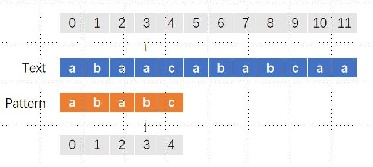
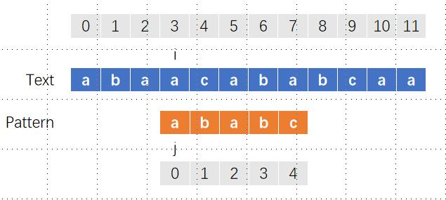
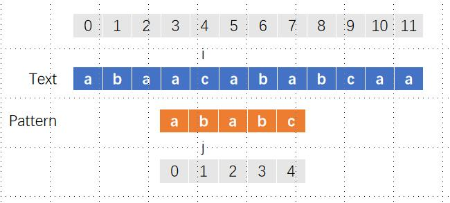
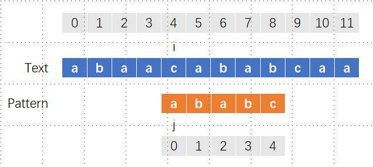
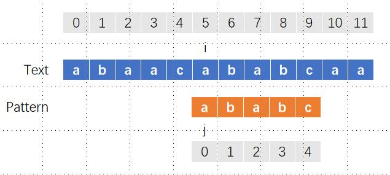

# 字符串

- 作者：李竹楠
- 日期：2023/11/22

## 1. 子串查找

列出了几个比较重要的字符串查找的算法。总的来说，是按照发展（效率之类的）的角度把这几个算法串起来。比如一开始的BF，我会分析他的优劣，然后根据BF算法的缺点，又提出RK算法，以及KMP算法和为什么提出BM算法。这些算法各有各的优缺点，所以我不仅简单的对复杂度进行分析，而且对应用场景进行分析，并在代码里有所体现。代码内容有实际案例模型和Leetcode题目。按照发展的顺序来学，就算是某个算法忘了具体的实现步骤也知道自己应该怎样去查漏补缺。

### 1.1 Brute Force(BF)

暴力算法，是最普通的匹配算法。过程如下图。

算法过程：
1. 设文本串`s`（图中ABCDEFG）和模式串`p`(图中DEF)
2. 将`s`和`p`的第一个字符串进行匹配
    - 若相等，则比较`s`的第二个字符和`p`的第二个字符
    - 若不相等，则比较`s`的第二个字符和`p`的第一个字符

上述过程循环比较直到得出结果。因为使用两层循环进行蛮力匹配，所以当字符串较长时，执行效率低，不适合长字符串。

- 时间复杂度分析：
    - 最坏情况：设主串`s`长度为$n$，子串`t`长度为$m$，那么主串`s`中则会有$n-m+1$个长度为$m$的子串，最坏情况下需要进行$m*(n-m+1)$次比较。
    - 最优情况：需要进行$n+m$次比较
    - 时间复杂度: $O(n*m)$
- 空间复杂度：$O(1)$

### 1.2 Robin-Karp(RK)

哈希检索算法，由Robin和Karp提出，是对**BF算法的改进**：
- BF算法中每一个字符串都需要进行比较。然后，在发现首字母匹配成功后仍需要匹配剩下的所有字符。
- RK算法（计算过程如下图）通过计算子串的HASH值，通过比较HASH值降低时间复杂度。

算法过程：
1. 设文本串`s`（图中ABCDEFG）和模式串`p`(图中DEF)
2. 计算`p`的HASH值和`s`所有子串的HASH值
    - 得到`p`HASH值为$hp$和`s`子串HASH值为$hs=hs1, hs2, hs3...$
3. 比较$hp$和$hs$，
    - 不相同，则子串不匹配
    - 相同，由于HASH会有冲突存在，所以需要再进行一次BF算法的比较

图中的例子为：得到由`p`计算出的$hp$和`s`子串计算出的$ABC:hs1, BCD:hs2, CDE:hs3, DEF:hs4$。得到$hp$与$hs4$相等，再用BF算法对两串进行对比，检查是否一致。

- 时间复杂度分析：
    - RK算法包括两部分：计算子串哈希值和子串哈希值的比较。对于第一部分，设主串`s`长度为$n$，子串`t`长度为$m$，那么主串`s`中则会有$n-m+1$个子串，则需要进行计算$n-m+1$次；对于第二部分，哈希值直接计算比较的时间复杂度为$O(1)$。
    - 最优情况：$O(n)$
    - 最坏情况：这种情况不常见。如果哈希值存在冲突，且每个子串都与模式串的哈希值相同，则退化成BF算法（这种情况下需要对每个子串进行对比），时间复杂度为$O(m*n)$。
    - 时间复杂度：最坏情况不常见，所以总的来说时间复杂度还是$O(n)$。

- 空间复杂度：需要存储$n-m+1$个子串，所以复杂度为$O(n)$。

### 1.3 Knuth-Morris-Pratt(KMP)

该算法由Knuth、Morris和Pratt共同提出。KMP算法相比较BF算法的优点在于可以能够**动态地调整每次后移的距离**，但BF算法只能移动一个字符的距离。KMP算法则用了一种聪明的办法，**当发现字符串不匹配的时候，并不会从头开始比较，因为之前已经匹配成功的字符可以给我们提供一些有用的信息，利用这个信息我们可以将子串移动到某个位置，并从这个位置直接开始比较**，它的时间复杂度降到了$O(m+n)$，也就是 2 个字符串的长度之和。

在讲解算法之前需要对KMP的几个核心概念进行说明：

- 部分匹配表（Partial Match Table）

以abababca为例：

| 字符 char | 索引 index | 值 value |
| ---- | ----  | ---- | 
|a	|0	|0|
|b	|1	|0|
|a	|2	|1|
|b	|3	|2|
|a	|4	|3|
|b	|5	|4|
|c	|6	|0|
|a	|7	|1|

- 前缀：除了**最后一个字符**外，一个字符串的全部**头部**集合。例如：`Hello`的前缀包括$$prefix\ set: \{H, He, Hel, Hell\}$$。
- 后缀：除了**第一个字符**外，一个字符串的全部**尾部**集合。例如：`World`的后缀包括$$suffix\ set: \{orld, rld, ld, d\}$$。

通过前后缀的概念可以理解什么时部分匹配表：PMT 中的值是字符串的前缀集合与后缀集合的交集中最长元素的长度。例如：`aba`的前缀集合为$\{a, ab\}$，后缀集合为$\{ba, a\}$。两个集合的交集为$\{a\}$，那么长度最长的是$a$，长度为1，所以PMT中对应的值是1。再例如：字符串`ababa`，前缀集合为$\{a, ab, aba, abab\}$，后缀集合为$\{baba, aba, ba, a\}$，两个集合的交集为$\{a, aba\}$，最长的是`aba`，长度是3，所以PMT中对应的值是3。

算法过程：
举例说明：当我们第一次碰到不匹配时（i和j都等于3的时候）：

此时i和j之前的3个字符aba必然完全匹配的，因为只有前面匹配成功了j才能走到3，而我们又知道**aba 的最长公共前后缀是a**，这可以给我们一个很好的提示，**主串中的aba的后缀和子串中的aba前缀有最长的公共部分a**，这样一来，我们就没必要重新比较了，直接将相同部分对齐就好了，也就是说让j退回到位置1就可以了，而i保持不变。

分析一下，为什么j知道应该退回到位置1：

1. 我们知道j是在位置3不匹配的，那么j前面的字符串我们可以知道是 aba
2. 前面我们已经得到了next数组，知道aba的最长公共前后缀长度是1，**也就是说，我们可以知道i之前1个位置（主串的后缀）和子串开头之后1个位置（子串的前缀）是相同的**。
3. 进而我们可以让相同部分对齐，也就是让`j=next[j-1]`

接下来，我们发现i和j仍然不匹配，而j之前的字符a最长公共前后缀是0，此时j退到位置0，i仍然保持不变。

i和j匹配，同时右移一格

此时i和j不匹配，`j=next[j-1]`回退到0，然后我们发现i和j仍然不匹配，同时j已经是0了，那么我们就让i往右移动一格。

### 1.4 Boyer-Moore(BM)

被Boyer和Moore提出的字符串检索算法。

### 1.5 Sunday

Sunday算法是Daniel M.Sunday于1990年提出的字符串模式匹配。

## 2. 正则表达式

## 3. 数据压缩

## 4. 排序

