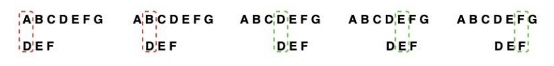

# 字符串

- 作者：李竹楠
- 日期：2023/11/22

## 子串查找

列出了几个比较重要的字符串查找的算法。总的来说，是按照发展（效率之类的）的角度把这几个算法串起来。比如一开始的BF，我会分析他的优劣，然后根据BF算法的缺点，又提出RK算法，以及KMP算法和为什么提出BM算法。这些算法各有各的优缺点，所以我不仅简单的对复杂度进行分析，而且对应用场景进行分析，并在代码里有所体现。代码内容有实际案例模型和Leetcode题目。按照发展的顺序来学，就算是某个算法忘了具体的实现步骤也知道自己应该怎样去查漏补缺。

### Brute Force(BF)

暴力算法，是最普通的匹配算法。过程如下图。

算法过程：
1. 设文本串`s`（图中ABCDEFG）和模式串`p`(图中DEF)
2. 将`s`和`p`的第一个字符串进行匹配
    - 若相等，则比较`s`的第二个字符和`p`的第二个字符
    - 若不相等，则比较`s`的第二个字符和`p`的第一个字符

上述过程循环比较直到得出结果。因为使用两层循环进行蛮力匹配，所以当字符串较长时，执行效率低，不适合长字符串。

- 时间复杂度分析：
    - 最坏情况：设主串`s`长度为$n$，子串`t`长度为$m$，那么主串`s`中则会有$n-m+1$个长度为$m$的子串，最坏情况下需要进行$m*(n-m+1)$次比较。
    - 最优情况：需要进行$n+m$次比较
    - 时间复杂度: $O(n*m)$
- 空间复杂度：$O(1)$

实现：
- Python代码
- Java代码
- C++代码

### Robin-Karp(RK)

哈希检索算法，由Robin和Karp提出，是对**BF算法的改进**：
- BF算法中每一个字符串都需要进行比较。然后，在发现首字母匹配成功后仍需要匹配剩下的所有字符。
- RK算法（计算过程如下图）通过计算子串的HASH值，通过比较HASH值降低时间复杂度。

算法过程：
1. 设文本串`s`（图中ABCDEFG）和模式串`p`(图中DEF)
2. 计算`p`的HASH值和`s`所有子串的HASH值
    - 得到`p`HASH值为$hp$和`s`子串HASH值为$hs=hs1, hs2, hs3...$
3. 比较$hp$和$hs$，
    - 不相同，则子串不匹配
    - 相同，由于HASH会有冲突存在，所以需要再进行一次BF算法的比较

图中的例子为：得到由`p`计算出的$hp$和`s`子串计算出的$ABC:hs1, BCD:hs2, CDE:hs3, DEF:hs4$。得到$hp$与$hs4$相等，再用BF算法对两串进行对比，检查是否一致。

- 时间复杂度分析：
    - RK算法包括两部分：计算子串哈希值和子串哈希值的比较。对于第一部分，设主串`s`长度为$n$，子串`t`长度为$m$，那么主串`s`中则会有$n-m+1$个子串，则需要进行计算$n-m+1$次；对于第二部分，哈希值直接计算比较的时间复杂度为$O(1)$。
    - 最优情况：$O(n)$
    - 最坏情况：这种情况不常见。如果哈希值存在冲突，且每个子串都与模式串的哈希值相同，则退化成BF算法（这种情况下需要对每个子串进行对比），时间复杂度为$O(m*n)$。
    - 时间复杂度：最坏情况不常见，所以总的来说时间复杂度还是$O(n)$。

- 空间复杂度：需要存储$n-m+1$个子串，所以复杂度为$O(n)$。

实现：
- Python代码
- Java代码
- C++代码

### Knuth-Morris-Pratt(KMP)

该算法由Knuth、Morris和Pratt共同提出。KMP算法相比较BF算法的优点在于可以能够**动态地调整每次后移的距离**，但BF算法只能移动一个字符的距离。

在讲解算法之前需要对KMP的几个核心概念进行说明：

- 部分匹配表（Partial Match Table）

以abababca为例：

| 字符 char | 索引 index | 值 value |
| ---- | ----  | ---- | 
|a	|0	|0|
|b	|1	|0|
|a	|2	|1|
|b	|3	|2|
|a	|4	|3|
|b	|5	|4|
|c	|6	|0|
|a	|7	|1|

- 前缀：除了**最后一个字符**外，一个字符串的全部**头部**集合。例如：`Hello`的前缀包括$$prefix\ set: \{H, He, Hel, Hell\}$$。
- 后缀：除了**第一个字符**外，一个字符串的全部**尾部**集合。例如：`World`的后缀包括$$suffix\ set: \{orld, rld, ld, d\}$$。

通过前后缀的概念可以理解什么时部分匹配表：PMT 中的值是字符串的前缀集合与后缀集合的交集中最长元素的长度。例如：`aba`的前缀集合为$\{a, ab\}$，后缀集合为$\{ba, a\}$。两个集合的交集为$\{a\}$，那么长度最长的是$a$，长度为1，所以PMT中对应的值是1。再例如：字符串`ababa`，前缀集合为$\{a, ab, aba, abab\}$，后缀集合为$\{baba, aba, ba, a\}$，两个集合的交集为$\{a, aba\}$，最长的是`aba`，长度是3，所以PMT中对应的值是3。

算法过程：

### Boyer-Moore(BM)

被Boyer和Moore提出的字符串检索算法。

### Sunday

## 正则表达式

## 数据压缩

## 排序