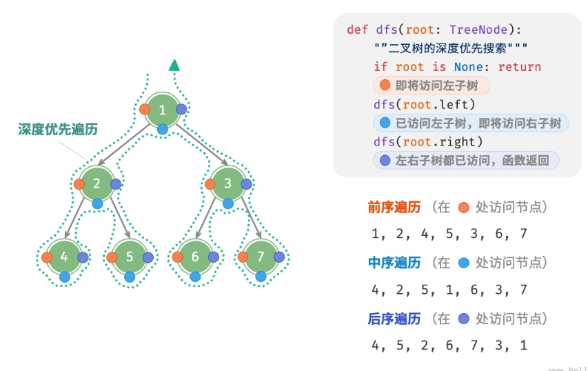
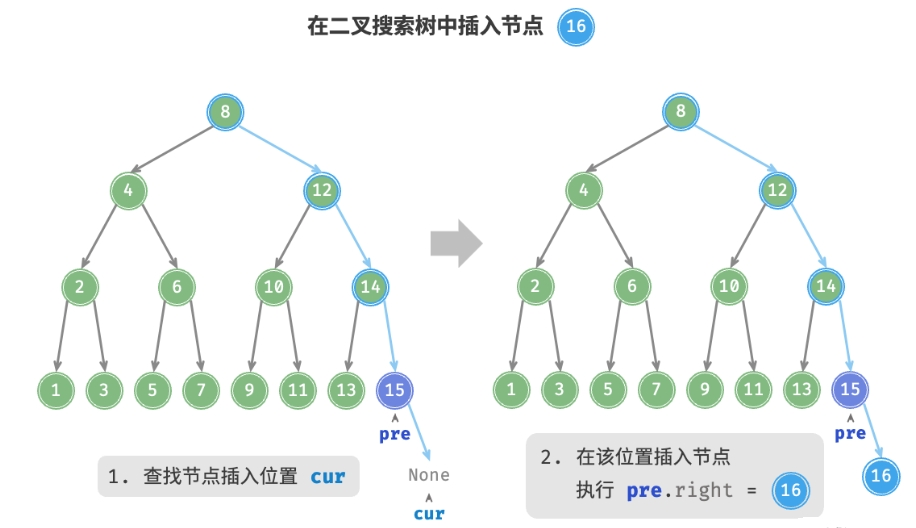

# 树

- 编辑：李竹楠
- 日期：2024/02/04

## 1. 二叉树 

### 1.1 基本操作

二叉树(binary tree)是一种非线性数据结构，代表“祖先”与“后代”之间的派生关系，体现了“一分为二”的分治逻辑。与链表类似，二叉树的基本单元是节点，每个节点包含值、左子节点引用和右子节点引用。代码如下：

``` python
class TreeNode:
    """
        二叉树节点类
    """
    def __init__(self, val: int):
        self.val: int = val                # 节点值
        self.left: TreeNode | None = None  # 左子节点引用
        self.right: TreeNode | None = None # 右子节点引用
```

每个节点都有两个引用（指针），分别指向 **左子节点(left-child node)** 和 **右子节点(right-child node)**，该节点被称为这两个子节点的**父节点(parent node)**。当给定一个二叉树的节点时，我们将该节点的左子节点及其以下节点形成的树称为该节点的**左子树(left subtree)**，同理可得**右子树(right subtree)**。**在二叉树中，除叶节点外，其他所有节点都包含子节点和非空子树**。

- **根节点(root node)**：位于二叉树顶层的节点，没有父节点。
- **叶节点(leaf node)**：没有子节点的节点，其两个指针均指向 None 。
- **边(edge)**：连接两个节点的线段，即节点引用（指针）。
- **节点所在的层(level)**：从顶至底递增，根节点所在层为 1 。
- **节点的度(degree)**：节点的子节点的数量。在二叉树中，度的取值范围是 0、1、2 。
- **二叉树的高度(height)**：从根节点到最远叶节点所经过的边的数量。
- **节点的深度(depth)**：从根节点到该节点所经过的边的数量。
- **节点的高度(height)**：从距离该节点最远的叶节点到该节点所经过的边的数量。


**注意：我们通常将“高度”和“深度”定义为“经过的边的数量”，但有些题目或教材可能会将其定义为“经过的节点的数量”。在这种情况下，高度和深度都需要加1**。

#### 1.1.1 初始化

与链表类似，首先初始化节点，然后构建引用（指针），[实现代码](../../../code/1/1.1/tree/README.md)如下：

``` python
# 初始化二叉树
# 初始化节点
n1 = TreeNode(val=1)
n2 = TreeNode(val=2)
n3 = TreeNode(val=3)
n4 = TreeNode(val=4)
n5 = TreeNode(val=5)
# 构建节点之间的引用（指针）
n1.left = n2
n1.right = n3
n2.left = n4
n2.right = n5
```

#### 1.1.2 插入与删除

与链表类似，在二叉树中插入与删除节点可以通过修改指针来实现。下图给出了一个示例。


``` python
# 插入与删除节点
p = TreeNode(0)
# 在 n1 -> n2 中间插入节点 P
n1.left = p
p.left = n2
# 删除节点 P
n1.left = n2
```

### 1.2 二叉树常见类型

#### 1.2.1 完美二叉树（满二叉树）

如下图所示，完美二叉树(perfect binary tree)所有层的节点都被完全填满。在完美二叉树中，叶节点的度为0，其余所有节点的度都为2；若树的高度为$h$，则节点总数为$2^{h+1}-1$，呈现标准的指数级关系，反映了自然界中常见的细胞分裂现象。


**注意，在中文社区中，完美二叉树常被称为满二叉树**。

#### 1.2.2 完全二叉树

如下图所示，完全二叉树(complete binary tre)只有最底层的节点未被填满，且最底层节点尽量靠左填充。


#### 1.2.3 完满二叉树

如下图所示，完满二叉树(full binary tree)除了叶节点之外，其余所有节点都有两个子节点。


#### 1.2.4 平衡二叉树

如下图所示，平衡二叉树(balanced binary tree)中任意节点的左子树和右子树的高度之差的绝对值不超过 1 。


设节点的$High_{left}-High_{right}=d$，则平衡二叉树中所有节点都满足$\lvert d \rvert \leqslant 1$

#### 1.2.5 二叉树的退化

当二叉树的每层节点都被填满时，达到“完美二叉树”；而当所有节点都偏向一侧时，二叉树退化为“链表”。

- 完美二叉树是理想情况，可以充分发挥二叉树“分治”的优势。
- 链表则是另一个极端，各项操作都变为线性操作，时间复杂度退化至$O(n)$

如下表所示，在最佳结构和最差结构下，二叉树的叶节点数量、节点总数、高度等达到极大值或极小值。

||完美二叉树|链表|
|---|---|---|
|第$i$层的节点数量|$2^{i-1}$|$1$|
|高度为$h$的树的叶节点数量|$2^h$|$1$|
|高度为$h$的树的节点总数|$2^{h+1}-1$|$h+1$|
|节点总数为$n$的树的高度|$\log_2(n+1)-1$|$n-1$|

### 1.3 二叉树遍历

从物理结构的角度来看，树是一种基于链表的数据结构，因此其遍历方式是通过指针逐个访问节点。然而，树是一种非线性数据结构，这使得遍历树比遍历链表更加复杂，需要借助搜索算法来实现。

二叉树常见的遍历方式包括层序遍历、前序遍历、中序遍历和后序遍历等。

#### 1.3.1 层序遍历

如下图所示，层序遍历(level-order traversal)从顶部到底部逐层遍历二叉树，并在每一层按照从左到右的顺序访问节点。

层序遍历本质上属于广度优先遍历(breadth-first traversal)，也称广度优先搜索(breadth-first search, BFS)，它体现了一种**一圈一圈向外扩展**的逐层遍历方式。


##### 1.3.1.1 代码实现

广度优先遍历通常借助**队列**来实现。队列遵循**先进先出**的规则，而广度优先遍历则遵循**逐层推进**的规则，两者背后的思想是一致的。[实现代码](../../../code/1/1.1/tree/README.md)如下：

``` python
def level_order(self):
    result = []
    q = queue.Queue() 
    q.put(self.tree)
    while not q.empty():
        node = q.get()
        result.append(node.value)
        if node.left is not None:
            q.put(node.left)
        if node.right is not None:
            q.put(node.right)
    return result
```

##### 1.3.1.2 复杂度分析

- **时间复杂度为 $O(n)$**：所有节点被访问一次，使用$O(n)$时间，其中$n$为节点数量。
- **空间复杂度为 $O(n)$**：在最差情况下，即满二叉树时，遍历到最底层之前，队列中最多同时存在$(n+1)/2$个节点，占用$O(n)$空间。

#### 1.3.2 前序、中序、后序遍历

相应地，前序、中序和后序遍历都属于深度优先遍历(depth-first traversal)，也称深度优先搜索(depth-first search, DFS)，它体现了一种“先走到尽头，再回溯继续”的遍历方式。

下图展示了对二叉树进行深度优先遍历的工作原理。**深度优先遍历就像是绕着整棵二叉树的外围“走”一圈**，在每个节点都会遇到三个位置，分别对应前序遍历、中序遍历和后序遍历。



##### 1.3.2.1 代码实现

深度优先搜索通常基于递归实现，[实现代码](../../../code/1/1.1/tree/README.md)如下：

``` python
def pre_order(self, node):
    if node is None:
        return
    self.result.append(node.value)
    self.in_order(node.left)
    self.in_order(node.right)
def in_order(self, node):
    if node is None:
        return
    self.in_order(node.left)
    self.result.append(node.value)
    self.in_order(node.right)
def post_order(self, node):
    if node is None:
        return
    self.post_order(node.left)
    self.post_order(node.right)
    self.result.append(node.value)
```

下图展示了前序遍历二叉树的递归过程，其可分为“递”和“归”两个逆向的部分。

- “递”表示开启新方法，程序在此过程中访问下一个节点。
- “归”表示函数返回，代表当前节点已经访问完毕。


|Step 1|Step 2|Step 3|Step 4|Step 5|Step 6|Step 7|Step 8|Step 9|Step 10|Step 11|
|---|---|---|---|---|---|---|---|---|---|---|
|<div style="width:350pt"><image src='../../../pics/282.png' width="100%" height="100%"/></div>|<div style="width:350pt"><image src='../../../pics/283.png' width="100%" height="100%"/></div>|<div style="width:350pt"><image src='../../../pics/284.png' width="100%" height="100%"/></div>|<div style="width:350pt"><image src='../../../pics/285.png' width="100%" height="100%"/></div>|<div style="width:350pt"><image src='../../../pics/286.png' width="100%" height="100%"/></div>|<div style="width:350pt"><image src='../../../pics/287.png' width="100%" height="100%"/></div>|<div style="width:350pt"><image src='../../../pics/288.png' width="100%" height="100%"/></div>|<div style="width:350pt"><image src='../../../pics/289.png' width="100%" height="100%"/></div>|<div style="width:350pt"><image src='../../../pics/290.png' width="100%" height="100%"/></div>|<div style="width:350pt"><image src='../../../pics/291.png' width="100%" height="100%"/></div>|<div style="width:350pt"><image src='../../../pics/292.png' width="100%" height="100%"/></div>|

**注意：可以使用栈进行顺序遍历**

##### 1.3.2.2 复杂度分析

- **时间复杂度为 $O(n)$**：所有节点被访问一次，使用$O(n)$时间，其中$n$为节点数量。
- **空间复杂度为 $O(n)$**：在最差情况下，即树退化为链表时，递归深度达到$n$，系统占用$O(n)$栈帧空间。

### 1.4 二叉树数组表示

#### 1.4.1 表示满二叉树

先分析一个简单案例。给定一棵完美二叉树，我们将所有节点按照层序遍历的顺序存储在一个数组中，则每个节点都对应唯一的数组索引。根据层序遍历的特性，我们可以推导出父节点索引与子节点索引之间的“映射公式”：**若某节点的索引为$i$，则该节点的左子节点索引为$2i+1$，右子节点索引为$2i+2$**。下图展示了各个节点索引之间的映射关系：


**映射公式的角色相当于链表中的指针**。给定数组中的任意一个节点，我们都可以通过映射公式来访问它的左（右）子节点。

#### 1.4.2 表示任意二叉树

完美二叉树是一个特例，在二叉树的中间层通常存在许多 `None` 。由于层序遍历序列并不包含这些 `None` ，因此我们无法仅凭该序列来推测 `None` 的数量和分布位置。**这意味着存在多种二叉树结构都符合该层序遍历序列**。

如下图所示，给定一棵非满二叉树，上述数组表示方法已经失效。


为了解决此问题，我们可以**考虑在层序遍历序列中显式地写出所有 `None`**。如下图所示，这样处理后，层序遍历序列就可以唯一表示二叉树了。示例代码如下：

``` python
# 二叉树的数组表示
# 使用 None 来表示空位
tree = [1, 2, 3, 4, None, 6, 7, 8, 9, None, None, 12, None, None, 15]
```


值得说明的是，**完全二叉树非常适合使用数组来表示**。回顾完全二叉树的定义，`None`只出现在最底层且靠右的位置，因此所有 `None` 一定出现在层序遍历序列的末尾。这意味着使用数组表示完全二叉树时，可以省略存储所有 `None` ，非常方便。下图给出了一个例子。


#### 1.4.3 还原二叉树

**二叉树的还原：指的是通过二叉树的遍历序列，还原出对应的二叉树**。

从二叉树的遍历过程可以看出，给定一棵非空二叉树，它的前序、中序、后续遍历所得到的遍历序列都是唯一的。那么反过来，如果已知节点的某种遍历序列，能否确定这棵二叉树呢？并且确定的二叉树是否是唯一的呢？我们先来回顾一下二叉树的前序遍历、中序遍历、后序遍历规则：

- 非空二叉树的前序遍历规则：
    1. 访问根节点。
    2. 以前序遍历的方式遍历根节点的左子树。
    3. 以前序遍历的方式遍历根节点的右子树。
- 非空二叉树的中序遍历规则：
    1. 以中序遍历的方式遍历根节点的左子树。
    2. 访问根节点。
    3. 以中序遍历的方式遍历根节点的右子树。
- 非空二叉树的后序遍历规则：
    1. 以后序遍历的方式遍历根节点的左子树。
    2. 以后序遍历的方式遍历根节点的右子树。
    3. 访问根节点。

先来看二叉树的前序遍历，前序遍历过程中首先访问的是根节点，**所以通过前序遍历序列，我们可以确定序列的第 1 个节点肯定是根节点**。但是从第 2 个节点开始就不确定它是根节点的左子树还是根节点的右子树了。所以单凭前序遍历序列是无法恢复一棵二叉树的。

再来看二叉树的后序遍历，后序遍历也是只能**确定序列的最后一个节点为根节点，而无法确定其他节点在二叉树中的位置**。所以单凭后序遍历序列也是无法恢复一棵二叉树的。

最后我们来看二叉树的中序遍历，中序遍历是先遍历根节点的左子树，然后访问根节点，最后遍历根节点的右子树。这样，根节点在中序遍历序列中必然将**中序序列分割成前后两个子序列，其中前一个子序列是根节点的左子树的中序遍历序列，后一个子序列是根节点的右子树的中序遍历序列**。当然单凭中序遍历序列也是无法恢复一棵二叉树的。

但是如果我们可以将**前序遍历序列**和**中序遍历序列**相结合，那么我们就可以通过上面中序遍历序列中的两个子序列，在前序遍历序列中找到对应的左子序列和右子序列。在前序遍历序列中，左子序列的第 1 个节点是左子树的根节点，右子序列的第 1 个节点是右子树的根节点。这样，就确定了二叉树的 3 个节点。同时，左子树和右子树的根节点在中序遍历序列中又可以将左子序列和右子序列分别划分成两个子序列。如此递归下去，当确定了前序遍历序列中的所有节点时，我们就得到了一棵二叉树。

还有一个问题，通过前序序列和中序序列还原的二叉树是唯一的吗？这个唯一性可以利用归纳法加以证明。

通过上述过程说明：**如果已知一棵二叉树的前序序列和中序序列，可以唯一地确定这棵二叉树**。同理，**如果已知一棵二叉树的中序序列和后序序列，也可以唯一地确定这棵二叉树**。 类似的，**已知二叉树的中序遍历序列和层序遍历序列，也可以唯一地确定一棵二叉树**。

需要注意的是：如果已知二叉树的前序遍历序列和后序遍历序列，是不能唯一地确定一棵二叉树的。 这是因为没有中序遍历序列无法确定左右部分，也就无法进行子序列的分割。

只有二叉树中每个节点度为 2 或者 0 的时候，已知前序遍历序列和后序遍历序列，才能唯一地确定一颗二叉树，如果二叉树中存在度为 1 的节点时是无法唯一地确定一棵二叉树的，这是因为我们无法判断该节点是左子树还是右子树。

##### 1.4.3.1 从前序与中序遍历序列构造二叉树

##### 1.4.3.2 从中序与后序遍历序列构造二叉树

##### 1.4.3.3 从前序与后序遍历序列构造二叉树

#### 1.4.4 总结

二叉树的数组表示主要有以下优点：

- 数组存储在连续的内存空间中，对缓存友好，访问与遍历速度较快。
- 不需要存储指针，比较节省空间。
- 允许随机访问节点。

然而，数组表示也存在一些局限性：

- 数组存储需要连续内存空间，因此不适合存储数据量过大的树。
- 增删节点需要通过数组插入与删除操作实现，效率较低。
- 当二叉树中存在大量 `None` 时，数组中包含的节点数据比重较低，空间利用率较低。

### 1.5 二叉搜索树(Binary Search Tree, BST)

#### 1.5.1 查找

给定目标节点值 `num` ，可以根据二叉搜索树的性质来查找。如下图所示，我们声明一个节点 `cur` ，从二叉树的根节点 `root` 出发，循环比较节点值 `cur.val` 和 `num` 之间的大小关系。

- 若 `cur.val < num` ，说明目标节点在 `cur` 的右子树中，因此执行 `cur = cur.right` 。
- 若 `cur.val > num` ，说明目标节点在 `cur` 的左子树中，因此执行 `cur = cur.left` 。
- 若 `cur.val = num `，说明找到目标节点，跳出循环并返回该节点。

|Step 1|Step 2|Step 3|Step 4
|---|---|---|---|
|<div style="width:250pt"><image src='../../../pics/297.png' width="100%" height="100%"/></div>|<div style="width:250pt"><image src='../../../pics/298.png' width="100%" height="100%"/></div>|<div style="width:250pt"><image src='../../../pics/299.png' width="100%" height="100%"/></div>|<div style="width:250pt"><image src='../../../pics/300.png' width="100%" height="100%"/></div>|

二叉搜索树的查找操作与二分查找算法的工作原理一致，都是每轮排除一半情况。循环次数最多为二叉树的高度，当二叉树平衡时，使用$O(\log n)$时间。[实现代码](../../../code/1/1.1/tree/README.md)如下：

``` python
def search(self, root, key):
    cur = root
    while cur is not None:
        if key < cur.value:
            cur = cur.left
        elif key > cur.value:
            cur = cur.right
        else:
            return cur
    return None
```

#### 1.5.2 插入

给定一个待插入元素 `num` ，为了保持二叉搜索树“左子树 < 根节点 < 右子树”的性质，插入操作流程如下图所示。

- 查找插入位置：与查找操作相似，从根节点出发，根据当前节点值和 `num` 的大小关系循环向下搜索，直到越过叶节点（遍历至 `None` ）时跳出循环。
- 在该位置插入节点：初始化节点 `num` ，将该节点置于 `None` 的位置。



[实现代码](../../../code/1/1.1/tree/README.md)如下：

``` python
def insert(self, root, key):
    if root is None:
        root = BinTreeNode(key)
        return
    cur = root
    pre = None
    while cur is not None:
        pre = cur
        if key < cur.value:
            cur = cur.left
        elif key > cur.value:
            cur = cur.right
        else:
            return
    node = BinTreeNode(key)
    if pre.value > key:
        pre.left = node
    else:
        pre.right = node
```

与查找节点相同，使用$O(\log n)$时间。

#### 1.5.3 删除

先在二叉树中查找到目标节点，再将其删除。与插入节点类似，我们需要保证在删除操作完成后，二叉搜索树的“左子树 < 根节点 < 右子树”的性质仍然满足。因此，我们根据目标节点的子节点数量，分 0、1 和 2 三种情况，执行对应的删除节点操作。

如下图所示，当待删除节点的度为0时，表示该节点是叶节点，可以直接删除。


如下图所示，当待删除节点的度为1时，将待删除节点替换为其子节点即可。


当待删除节点的度为2时，我们无法直接删除它，而需要使用一个节点替换该节点。由于要保持二叉搜索树“左子树 < 根节点 < 右子树”的性质，**因此这个节点可以是右子树的最小节点或左子树的最大节点**。

假设我们选择右子树的最小节点（中序遍历的下一个节点），则删除操作流程如下图所示：

- 找到待删除节点在“中序遍历序列”中的下一个节点，记为 `tmp` 。
- 用 `tmp` 的值覆盖待删除节点的值，并在树中递归删除节点 `tmp` 。

|Step 1|Step 2|Step 3|Step 4
|---|---|---|---|
|<div style="width:300pt"><image src='../../../pics/pics1/304.png' width="100%" height="100%"/></div>|<div style="width:300pt"><image src='../../../pics/pics1/305.png' width="100%" height="100%"/></div>|<div style="width:300pt"><image src='../../../pics/pics1/306.png' width="100%" height="100%"/></div>|<div style="width:300pt"><image src='../../../pics/pics1/307.png' width="100%" height="100%"/></div>|

与查找节点相同，使用$O(\log n)$时间，[实现代码](../../../code/1/1.1/tree/README.md)如下：

``` python
def remove(self, key):
    if self.root is None:
        return
    cur = self.root
    pre = None
    while cur is not None:
        if cur.value == key:
            break
        pre = cur
        if key < cur.value:
            cur = cur.left
        elif key > cur.value:
            cur = cur.right
    if cur is None:
        return
    if (cur.right is None) or (cur.left is None):
        # 删除节点的度为0或1
        child = cur.left or cur.right
        if cur != self.root:
            if pre.left == cur:
               pre.left = child
            else:
                pre.right = child
        else:
            # 若删除根节点，则重新制定根节点
            self.root = child
    elif (cur.right is not None) and (cur.left is not None):
        # 删除节点的度为2
         tmp = cur.right # 获取待删除节点的下一个节点
        while tmp.left is not None: # 找到右子树的最小节点
            tmp = tmp.left
        self.remove(tmp.value) # 递归删除节点
        cur.value = tmp.value
```

#### 1.5.4 BST性能

给定一组数据，我们考虑使用数组或二叉搜索树存储。如下表所示，二叉搜索树的各项操作的时间复杂度都是对数阶，具有稳定且高效的性能。只有在高频添加、低频查找删除数据的场景下，数组比二叉搜索树的效率更高。

||无序数组|二叉搜索树|
|---|---|---|
|查找|$O(n)$|$O(\log n)$|
|插入|$O(1)$|$O(\log n)$|
|删除|$O(n)$|$O(\log n)$|

在理想情况下，二叉搜索树是“平衡”的，这样就可以在 $\log n$ 轮循环内查找任意节点。然而，如果我们在二叉搜索树中不断地插入和删除节点，可能导致二叉树退化为链表，这时各种操作的时间复杂度也会退化为 $O(n)$。

#### 1.5.5 BST应用

- 在一些数据库中作为某些搜索算法的底层数据结构，例如红黑树和B-树。
- 用于存储数据流，以保持其有序状态。
- 用作系统中的多级索引，实现高效的查找、插入、删除操作。

## 2. 平衡二叉树(AVL树)

在多次插入和删除操作后，二叉搜索树可能退化为链表。在这种情况下，所有操作的时间复杂度将从 $O(\log n)$ 劣化为 $O(n)$ 。

1962 年 G. M. Adelson-Velsky 和 E. M. Landis 在论文*An algorithm for the organization of information*中提出了**AVL 树**。论文中详细描述了一系列操作，确保在持续添加和删除节点后，AVL 树不会退化，从而使得各种操作的时间复杂度保持在 $O(\log n)$ 级别。换句话说，在需要频繁进行增删查改操作的场景中，AVL 树能始终保持高效的数据操作性能，具有很好的应用价值。

AVL 树既是二叉搜索树，也是平衡二叉树，同时满足这两类二叉树的所有性质，因此也被称为**平衡二叉搜索树(balanced binary search tree)**。

相比较于BST，AVL树做出了部分改动，添加了树的高度和节点平衡因子，目的是为了保证二叉树的平衡。

首先，由于 AVL 树的相关操作需要获取节点高度，因此我们需要为节点类添加 `height` 变量：

``` python
def __init__(self, value: int):
    self.value = value # 节点值
    self.height = 0    # 节点高度
    self.left = None   # 左子节点引用
    self.right = None  # 右子节点引用
```

**节点高度**是指从该节点到它的**最远叶节点**的距离，即所经过的**边**的数量。需要特别注意的是，叶节点的高度为0，而空节点的高度为-1。我们将创建两个工具函数，分别用于获取和更新节点的高度，[实现代码](../../../code/1/1.1/tree/README.md)如下：

``` python
def height(self, node):
    if node is not None:
        return node.height
    return -1

def _update_height(self, node):
    node.height = max([self.height(node.left), self.height(node.right)]) + 1

```

另外，节点的 **平衡因子(balance factor)** 定义为节点**左子树的高度减去右子树的高度**，同时规定空节点的平衡因子为0。我们同样将获取节点平衡因子的功能封装成函数，方便后续使用，[实现代码](../../../code/1/1.1/tree/README.md)如下：

``` python
def balance_factor(self, node):
    if node is None:
        return 0
    # 节点平衡因子 = 左子树高度 - 右子树高度
    return self.height(node.left) - self.height(node.right)
```

**注意：设平衡因子为 $f$ ，则一棵 AVL 树的任意节点的平衡因子皆满足  $-1 \leqslant f \leqslant 1$ 。**

### 2.1 AVL树旋转

AVL 树的特点在于“旋转”操作，它能够在不影响二叉树的中序遍历序列的前提下，使失衡节点重新恢复平衡。换句话说，**旋转操作既能保持“二叉搜索树”的性质，也能使树重新变为“平衡二叉树”**。

我们将平衡因子绝对值 $>1$ 的节点称为“失衡节点”。根据节点失衡情况的不同，旋转操作分为四种：右旋、左旋、先左旋后右旋、先右旋后左旋。下面详细介绍这些旋转操作。

#### 2.1.1 右旋

如下图所示，节点下方为平衡因子。从底至顶看，二叉树中首个失衡节点是“节点 3”。我们关注以该失衡节点为根节点的子树，将该节点记为 `node` ，其左子节点记为 `child` ，执行“右旋”操作。完成右旋后，子树恢复平衡，并且仍然保持二叉搜索树的性质。

|Step 1|Step 2|Step 3|Step 4
|---|---|---|---|
|<div style="width:200pt"><image src='../../../pics/pics1/308.png' width="100%" height="100%"/></div>|<div style="width:200pt"><image src='../../../pics/pics1/309.png' width="100%" height="100%"/></div>|<div style="width:200pt"><image src='../../../pics/pics1/310.png' width="100%" height="100%"/></div>|<div style="width:200pt"><image src='../../../pics/pics1/311.png' width="100%" height="100%"/></div>|

如下图所示，当节点 `child` 有右子节点（记为 `grand_child` ）时，需要在右旋中添加一步：将 `grand_child` 作为 `node` 的左子节点。


“向右旋转”是一种形象化的说法，实际上需要通过修改节点指针来实现，[实现代码](../../../code/1/1.1/tree/README.md)如下：

``` python
def _right_rotate(self, node):
    child = node.left
    grand_child = child.right
    # 以child为原点，将node向右旋转
    child.right = node
    node.left = grand_child
    # 更新节点高度
    self._update_height(node)
    self._update_height(child)
    return child
```

#### 2.1.2 左旋

相应地，如果考虑上述失衡二叉树的“镜像”，则需要执行下图所示的“左旋”操作。


同理，如下图所示，当节点 `child` 有左子节点（记为 `grand_child` ）时，需要在左旋中添加一步：将 `grand_child` 作为 `node` 的右子节点。


可以观察到，**右旋和左旋操作在逻辑上是镜像对称的，它们分别解决的两种失衡情况也是对称的**。基于对称性，我们只需将右旋的实现代码中的所有的 `left` 替换为 `right` ，将所有的 `right` 替换为 `left` ，即可得到左旋的[实现代码](../../../code/1/1.1/tree/README.md)如下：

``` python
def _left_rotate(self, node):
    child = node.right
    grand_child = child.left
    # 以child为原点，将node向右旋转
    child.left = node
    node.right = grand_child
    # 更新节点高度
    self._update_height(node)
    self._update_height(child)
    return child
```

#### 2.1.3 先左旋后右旋

对于下图中的失衡节点 3 ，仅使用左旋或右旋都无法使子树恢复平衡。此时需要先对 `child` 执行“左旋”，再对 `node` 执行“右旋”。


#### 2.1.4 先右旋后左旋

如下图所示，对于上述失衡二叉树的镜像情况，需要先对 `child` 执行“右旋”，再对 `node` 执行“左旋”。


#### 2.1.5 旋转的选择

下图展示的四种失衡情况与上述案例逐个对应，分别需要采用右旋、先左旋后右旋、先右旋后左旋、左旋的操作。


如下表所示，我们通过判断失衡节点的平衡因子以及较高一侧子节点的平衡因子的正负号，来确定失衡节点属于上图中的哪种情况。

|失衡节点的平衡因子|子节点的平衡因子|应采用的旋转方法|
|---|---|---|
|$>1$（左偏树）|$\geqslant 0$|右旋|
|$>1$（左偏树）|$<0$|先左旋后右旋|
|$<-1$（右偏树）|$\leqslant 0$|左旋|
|$<-1$（右偏树）|$>0$|先右旋后左旋|

为了便于使用，我们将旋转操作封装成一个函数。有了这个函数，我们就能对各种失衡情况进行旋转，使失衡节点重新恢复平衡。[实现代码](../../../code/1/1.1/tree/README.md)如下：

``` python
def rotate(self, node):
    balance_factor = self._balance_factor(node)
    if balance_factor > 1:
        # 左偏树
            if self.balance_factor(node.left) >= 0:
            # 右旋
            return self._right_rotate(node)
        else:
            # 先左旋后右旋
            node.left = self._left_rotate(node.left)
            return self._right_rotate(node)
    elif balance_factor < -1:
        # 右偏树
        if self.balance_factor(node.right) <= 0:
            # 左旋
            return self._left_rotate(node)
        else:
            # 先右旋后左旋
            node.right = self._right_rotate(node.right)
        return self._left_rotate(node)
    # 平衡树，无须旋转，直接返回
    return node
```

### 2.2 基本操作

#### 2.2.1 插入

AVL 树的节点插入操作与二叉搜索树在主体上类似。唯一的区别在于，在 AVL 树中插入节点后，从该节点到根节点的路径上可能会出现一系列失衡节点。因此，**我们需要从这个节点开始，自底向上执行旋转操作，使所有失衡节点恢复平衡**。[实现代码](../../../code/1/1.1/tree/README.md)如下：

``` python
def _insert_helper(self, node, key):
    if node is None:
        return AVLTreeNode(key)
    # 1. 查找插入位置并插入节点
    if key < node.value:
        node.left = self._insert_helper(node.left, key)
    elif key > node.value:
        node.right = self._insert_helper(node.right, key)
    else:
        # 重复节点不插入，直接返回
        return node
    # 更新节点高度
    self._update_height(node)
    # 2. 执行旋转操作，使该子树重新恢复平衡
    return self._rotate(node)

def insert(self, key):
    self.root = self._insert_helper(self.root, key)
```

#### 2.2.2 删除

类似地，在二叉搜索树的删除节点方法的基础上，需要从底至顶执行旋转操作，使所有失衡节点恢复平衡。[实现代码](../../../code/1/1.1/tree/README.md)如下：

``` python
def _remove_helper(self, node, key):
    # 1. 查找节点并删除
    if node is None:
        return None
    # 1. 查找节点并删除
    if key < node.value:
        node.left = self._remove_helper(node.left, key)
    elif key > node.value:
        node.right = self._remove_helper(node.right, key)
    else:
        if node.left is None or node.right is None:
            child = node.left or node.right
            # 子节点数量 = 0 ，直接删除 node 并返回
            if child is None:
                return None
            # 子节点数量 = 1 ，直接删除 node
            else:
                node = child
        else:
            # 子节点数量 = 2 ，则将中序遍历的下个节点删除，并用该节点替换当前节点
            temp = node.right
            while temp.left is not None:
                temp = temp.left
            node.right = self._remove_helper(node.right, temp.value)
            node.value = temp.value
    # 更新节点高度
    self._update_height(node)
    # 2. 执行旋转操作，使该子树重新恢复平衡
    return self._rotate(node)

def remove(self, key):
    self.root = self._remove_helper(self.root, key)
```

#### 2.2.3 查找

AVL树与BST的节点查找操作一致，在此不再赘述。

### 2.3 AVL树典型应用

- 红黑树在许多应用中比 AVL 树更受欢迎。这是因为红黑树的平衡条件相对宽松，在红黑树中插入与删除节点所需的旋转操作相对较少，其节点增删操作的平均效率更高。
- 组织和存储大型数据，适用于高频查找、低频增删的场景（同BST）。
- 用于构建数据库中的索引系统。

## 3. 红黑树

日后再补

## 4. 最优二叉树

日后再补

## 5. 堆

堆 heap 是一种满足特定条件的完全二叉树，主要可分为两种类型，如下图所示。

- 小顶堆 min heap：任意节点的值 < 其子节点的值。
- 大顶堆 max heap：任意节点的值 > 其子节点的值。


堆作为完全二叉树的一个特例，具有以下特性。

- 最底层节点靠左填充，其他层的节点都被填满。
- 我们将二叉树的根节点称为“堆顶”，将底层最靠右的节点称为“堆底”。
- 对于大顶堆（小顶堆），堆顶元素（根节点）的值是最大（最小）的。

需要指出的是，许多编程语言提供的是**优先队列(priority queue)**，这是一种抽象的数据结构，定义为具有优先级排序的队列。

实际上，**堆通常用于实现优先队列，大顶堆相当于元素按从大到小的顺序出队的优先队列**。从使用角度来看，我们可以将“优先队列”和“堆”看作等价的数据结构。

在实际应用中，我们可以直接使用编程语言提供的堆类（或优先队列类）。类似于排序算法中的“从小到大排列”和“从大到小排列”，我们可以通过设置一个 `flag` 或修改 `Comparator` 实现“小顶堆”与“大顶堆”之间的转换。代码如下所示：

``` python
# 初始化小顶堆
min_heap, flag = [], 1
# 初始化大顶堆
max_heap, flag = [], -1

# Python 的 heapq 模块默认实现小顶堆
# 考虑将“元素取负”后再入堆，这样就可以将大小关系颠倒，从而实现大顶堆
# 在本示例中，flag = 1 时对应小顶堆，flag = -1 时对应大顶堆

# 元素入堆
heapq.heappush(max_heap, flag * 1)
heapq.heappush(max_heap, flag * 3)
heapq.heappush(max_heap, flag * 2)
heapq.heappush(max_heap, flag * 5)
heapq.heappush(max_heap, flag * 4)

# 获取堆顶元素
peek: int = flag * max_heap[0] # 5

# 堆顶元素出堆
# 出堆元素会形成一个从大到小的序列
val = flag * heapq.heappop(max_heap) # 5
val = flag * heapq.heappop(max_heap) # 4
val = flag * heapq.heappop(max_heap) # 3
val = flag * heapq.heappop(max_heap) # 2
val = flag * heapq.heappop(max_heap) # 1

# 获取堆大小
size: int = len(max_heap)

# 判断堆是否为空
is_empty: bool = not max_heap

# 输入列表并建堆
min_heap: list[int] = [1, 3, 2, 5, 4]
heapq.heapify(min_heap)
```

### 5.1 堆的实现

下文实现的是大顶堆。若要将其转换为小顶堆，只需将所有大小逻辑判断取逆（例如，将 > 替换为 < ）。

#### 5.1.1 堆的存储与表示

完全二叉树非常适合用数组来表示。由于堆正是一种完全二叉树，**因此我们将采用数组来存储堆**。当使用数组表示二叉树时，元素代表节点值，索引代表节点在二叉树中的位置。**节点指针通过索引映射公式来实现**。如下图所示，给定索引 $i$ ，其左子节点的索引是 $2i+1$ ，右子节点的索引为 $2i+2$ ，父节点的索引为 $ \lfloor (i-1)/2 \rfloor$ 。当索引越界时，表示空节点或节点不存在。


我们可以将索引映射公式封装成函数，方便后续使用，[实现代码](../../../code/1/1.1/tree/README.md)如下：

``` python
def _left(self, i):
    return 2 * i + 1

def _right(self, i):
    return 2 * i + 2

def _parent(self, i):
    return (i - 1) // 2  # 向下整除
```

#### 5.1.2 访问堆顶元素

堆顶元素即为二叉树的根节点，也就是列表的首个元素，[实现代码](../../../code/1/1.1/tree/README.md)如下：

``` python
def peek(self) -> int:
    return self.max_heap[0]
```

#### 5.1.3 元素入堆

给定元素 `key` ，我们首先将其添加到堆底。添加之后，由于 `key` 可能大于堆中其他元素，堆的成立条件可能已被破坏，因此需要修复从插入节点到根节点的路径上的各个节点，这个操作被称为**堆化(heapify)**。

考虑从入堆节点开始，**从底至顶执行堆化**。如下图所示，我们比较插入节点与其父节点的值，如果插入节点更大，则将它们交换。然后继续执行此操作，从底至顶修复堆中的各个节点，直至越过根节点或遇到无须交换的节点时结束。

|Step 1|Step 2|Step 3|Step 4|Step 5|Step 6|Step 7|Step 8|Step 9|
|---|---|---|---|---|---|---|---|---|
|<div style="width:350pt"><image src='../../../pics/pics1/320.png' width="100%" height="100%"/></div>|<div style="width:350pt"><image src='../../../pics/pics1/321.png' width="100%" height="100%"/></div>|<div style="width:350pt"><image src='../../../pics/pics1/322.png' width="100%" height="100%"/></div>|<div style="width:350pt"><image src='../../../pics/pics1/323.png' width="100%" height="100%"/></div>|<div style="width:350pt"><image src='../../../pics/pics1/324.png' width="100%" height="100%"/></div>|<div style="width:350pt"><image src='../../../pics/pics1/325.png' width="100%" height="100%"/></div>|<div style="width:350pt"><image src='../../../pics/pics1/326.png' width="100%" height="100%"/></div>|<div style="width:350pt"><image src='../../../pics/pics1/327.png' width="100%" height="100%"/></div>|<div style="width:350pt"><image src='../../../pics/pics1/328.png' width="100%" height="100%"/></div>|

设节点总数为 $n$ ，则树的高度为 $O(\log n)$ 。由此可知，堆化操作的循环轮数最多为 $O(\log n)$ ，**元素入堆操作的时间复杂度为 $O(\log n)$**。[实现代码](../../../code/1/1.1/tree/README.md)如下：

``` python
def push(self, key):
    self.max_heap.append(key)
    self._sift_up(self._size() - 1) # 从底至顶堆化    
def _sift_up(self, i):
    while True:
        p = self._parent(i) # 获取节点 i 的父节点
        # 当“越过根节点”或“节点无须修复”时，结束堆化
        if p < 0 or self.max_heap[i] <= self.max_heap[p]:
            break
        self._swap(i, p) # 交换两节点
        i = p # 循环向上堆化
```

#### 5.1.4 堆顶元素出堆

堆顶元素是二叉树的根节点，即列表首元素。如果我们直接从列表中删除首元素，那么二叉树中所有节点的索引都会发生变化，这将使得后续使用堆化进行修复变得困难。**为了尽量减少元素索引的变动**，我们采用以下操作步骤。

1. 交换堆顶元素与堆底元素（交换根节点与最右叶节点）。
2. 交换完成后，将堆底从列表中删除（注意，由于已经交换，因此实际上删除的是原来的堆顶元素）。
3. 从根节点开始，**从顶至底执行堆化**。

如下图所示，**“从顶至底堆化”的操作方向与“从底至顶堆化”相反**，我们将根节点的值与其两个子节点的值进行比较，将最大的子节点与根节点交换。然后循环执行此操作，直到越过叶节点或遇到无须交换的节点时结束。

|Step 1|Step 2|Step 3|Step 4|Step 5|Step 6|Step 7|Step 8|Step 9|Step 10|
|---|---|---|---|---|---|---|---|---|---|
|<div style="width:350pt"><image src='../../../pics/pics1/329.png' width="100%" height="100%"/></div>|<div style="width:350pt"><image src='../../../pics/pics1/330.png' width="100%" height="100%"/></div>|<div style="width:350pt"><image src='../../../pics/pics1/331.png' width="100%" height="100%"/></div>|<div style="width:350pt"><image src='../../../pics/pics1/332.png' width="100%" height="100%"/></div>|<div style="width:350pt"><image src='../../../pics/pics1/333.png' width="100%" height="100%"/></div>|<div style="width:350pt"><image src='../../../pics/pics1/334.png' width="100%" height="100%"/></div>|<div style="width:350pt"><image src='../../../pics/pics1/335.png' width="100%" height="100%"/></div>|<div style="width:350pt"><image src='../../../pics/pics1/336.png' width="100%" height="100%"/></div>|<div style="width:350pt"><image src='../../../pics/pics1/337.png' width="100%" height="100%"/></div>|<div style="width:350pt"><image src='../../../pics/pics1/338.png' width="100%" height="100%"/></div>|

与元素入堆操作相似，堆顶元素出堆操作的时间复杂度也为 $O(\log n)$ 。[实现代码](../../../code/1/1.1/tree/README.md)如下：

``` python
def _sift_down(self, i):
    while True:
        # 判断节点 i, l, r 中值最大的节点，记为 max_
        l, r, max_ = self._left(i), self._right(i), i
        if l < self._size() and self.max_heap[l] > self.max_heap[max_]:
            max_ = l
        if r < self.size() and self.max_heap[r] > self.max_heap[max_]:
            max_ = r
        # 若节点 i 最大或索引 l, r 越界，则无须继续堆化，跳出
        if max_ == i:
            break
        self._swap(i, max_)
        i = max_
def pop(self):
    if self._size() == 0:
        # 判空处理
        raise IndexError('heap is empty.')
    # 1. 交换根节点与最右叶节点（交换首元素与尾元素）
    self._swap(0, self._size() - 1)
    # 2. 删除节点
    key = self.max_heap.pop()
    # 3. 从顶至底堆化
    self._sift_down(0)
    return key
```

### 5.2 堆的常见应用

- **优先队列**：堆通常作为实现优先队列的首选数据结构，其入队和出队操作的时间复杂度均为 $O(\log n)$ 而建队操作为 $O(n)$ ，这些操作都非常高效。
- **堆排序**：给定一组数据，我们可以用它们建立一个堆，然后不断地执行元素出堆操作，从而得到有序数据。然而，我们通常会使用一种更优雅的方式实现堆排序，详见“堆排序”。
- **获取最大的 $k$ 个元素**：这是一个经典的算法问题，同时也是一种典型应用，例如选择热度前 10 的新闻作为微博热搜，选取销量前 10 的商品等。

### 5.3 建堆操作

在某些情况下，我们希望使用一个列表的所有元素来构建一个堆，这个过程被称为“建堆操作”。

#### 5.3.1 借助入堆操作实现

我们首先创建一个空堆，然后遍历列表，依次对每个元素执行“入堆操作”，即先将元素添加至堆的尾部，再对该元素执行“从底至顶”堆化。

每当一个元素入堆，堆的长度就加一。由于节点是从顶到底依次被添加进二叉树的，因此堆是“自上而下”构建的。

设元素数量为 $n$ ，每个元素的入堆操作使用 $O(\log n)$ 时间，因此该建堆方法的时间复杂度为 $O(n\log n)$ 。

#### 5.3.2 通过遍历堆化实现

实际上，我们可以实现一种更为高效的建堆方法，共分为两步。

1. 将列表所有元素原封不动地添加到堆中，此时堆的性质尚未得到满足。
2. 倒序遍历堆（层序遍历的倒序），依次对每个非叶节点执行“从顶至底堆化”。

**每当堆化一个节点后，以该节点为根节点的子树就形成一个合法的子堆**。而由于是倒序遍历，因此堆是“自下而上”构建的。

之所以选择倒序遍历，是因为这样能够保证当前节点之下的子树已经是合法的子堆，这样堆化当前节点才是有效的。

值得说明的是，**由于叶节点没有子节点，因此它们天然就是合法的子堆，无须堆化**。如以下代码所示，最后一个非叶节点是最后一个节点的父节点，我们从它开始倒序遍历并执行堆化，实现代码如下：

``` python
def __init__(self, nums: list[int]):
    """构造方法，根据输入列表建堆"""
    # 将列表元素原封不动添加进堆
    self.max_heap = nums
    # 堆化除叶节点以外的其他所有节点
    for i in range(self.parent(self.size() - 1), -1, -1):
        self.sift_down(i)
```

复杂度分析日后再补。结论是：**输入列表并建堆的时间复杂度为 $O(n)$ ，非常高效**。

### 5.4 Top-K 问题

经典问题：给定一个长度为 $n$ 的无序数组 `nums` ，请返回数组中最大的 $k$ 个元素。这是一个经典的算法问题，同时也是一种典型应用，例如选择热度前 10 的新闻作为微博热搜，选取销量前 10 的商品等。

对于该问题，我们先介绍两种思路比较直接的解法，再介绍效率更高的堆解法。

#### 5.4.1 方法一：遍历选择

我们可以进行下图所示的 $k$ 轮遍历，分别在每轮中提取第 $1, 2, 3, \dots, k$ 大的元素，时间复杂度为 $O(nk)$ 。此方法只适用于 $k\ll n$ 的情况，因为当 $k$ 与 $n$ 比较接近时，其时间复杂度趋向于 $O(n^2)$ ，非常耗时。


**注意：当 $k=n$ 时，我们可以得到完整的有序序列，此时等价于“选择排序”算法。**
#### 5.4.2 方法二：排序

如下图所示，我们可以先对数组 `nums` 进行排序，再返回最右边的 $k$ 个元素，时间复杂度为 $O(n\log n)$ 。显然，该方法“超额”完成任务了，因为我们只需找出最大的 $k$ 个元素即可，而不需要排序其他元素。


#### 5.4.3 方法三：堆

我们可以基于堆更加高效地解决 Top-k 问题，流程如下图所示：

1. 初始化一个小顶堆，其堆顶元素最小。
2. 先将数组的前 $k$ 个元素依次入堆。
3. 从第 $k+1$ 个元素开始，若当前元素大于堆顶元素，则将堆顶元素出堆，并将当前元素入堆。
4. 遍历完成后，堆中保存的就是最大的 $k$ 个元素。

|Step 1|Step 2|Step 3|Step 4|Step 5|Step 6|Step 7|Step 8|Step 9|
|---|---|---|---|---|---|---|---|---|
|<div style="width:350pt"><image src='../../../pics/pics1/341.png' width="100%" height="100%"/></div>|<div style="width:350pt"><image src='../../../pics/pics1/342.png' width="100%" height="100%"/></div>|<div style="width:350pt"><image src='../../../pics/pics1/342.png' width="100%" height="100%"/></div>|<div style="width:350pt"><image src='../../../pics/pics1/344.png' width="100%" height="100%"/></div>|<div style="width:350pt"><image src='../../../pics/pics1/345.png' width="100%" height="100%"/></div>|<div style="width:350pt"><image src='../../../pics/pics1/346.png' width="100%" height="100%"/></div>|<div style="width:350pt"><image src='../../../pics/pics1/347.png' width="100%" height="100%"/></div>|<div style="width:350pt"><image src='../../../pics/pics1/348.png' width="100%" height="100%"/></div>|<div style="width:350pt"><image src='../../../pics/pics1/349.png' width="100%" height="100%"/></div>|

[实现代码](../../../code/1/1.1/tree/README.md)如下：

``` python
def top_k(self, nums, k):
    # 将数组的前 k 个元素入堆
    for i in range(k):
        self.push(nums[i])
    # 从第 k+1 个元素开始，保持堆的长度为 k
    for i in range(k, len(nums)):
        print(nums[i], '-', self.peek())
        # 若当前元素大于堆顶元素，则将堆顶元素出堆、当前元素入堆
        if nums[i] < self.peek():
            self.pop()
            self.push(nums[i])
```

总共执行了 $n$ 轮入堆和出堆，堆的最大长度为 $k$ ，因此时间复杂度为 $O(n \log k)$ 。该方法的效率很高，当 $k$ 较小时，时间复杂度趋向 $O(n)$ ；当 $k$ 较大时，时间复杂度不会超过 $O(n \log n)$ 。

另外，该方法适用于**动态数据流**的使用场景。在不断加入数据时，我们可以持续维护堆内的元素，从而实现最大的 $k$ 个元素的动态更新。

### 5.5 斐波那契堆

日后再补

## 7. 线段树

日后再补

## 8. 并查集

日后再补

## 9. 面试题

日后再补