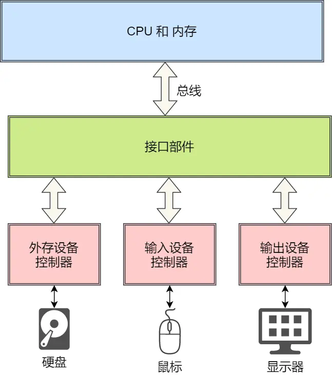
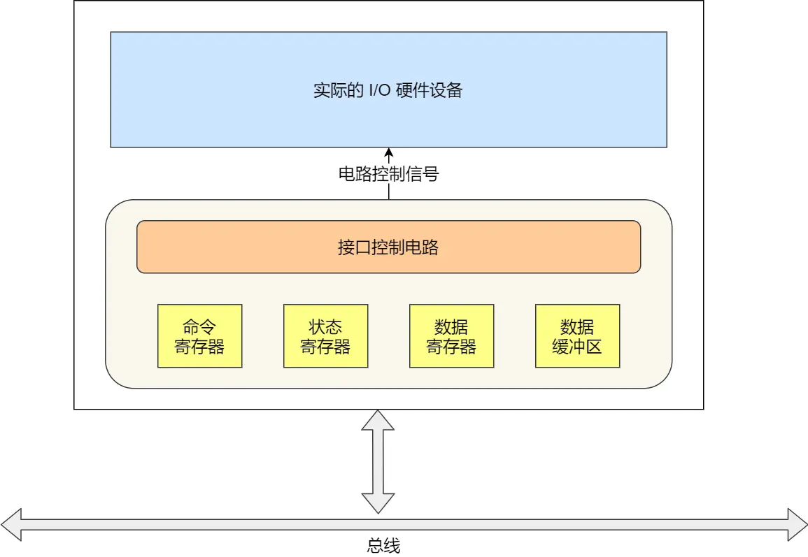
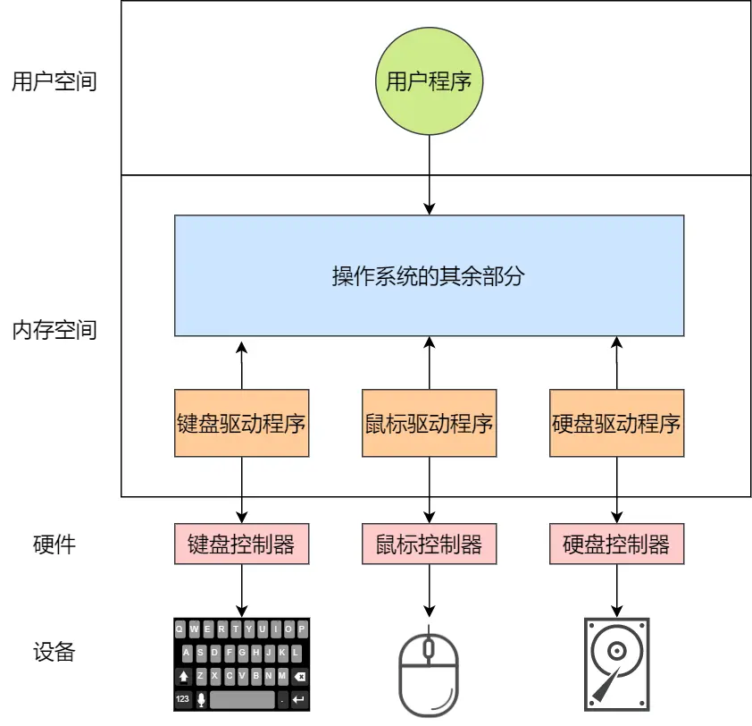
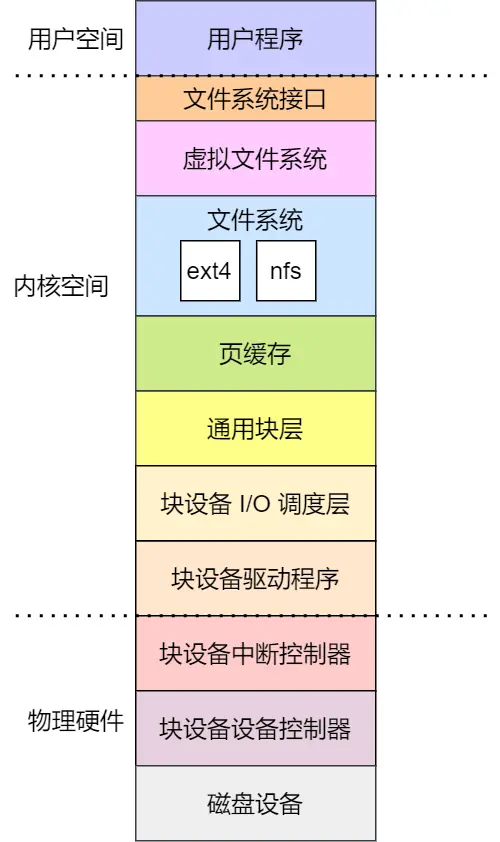
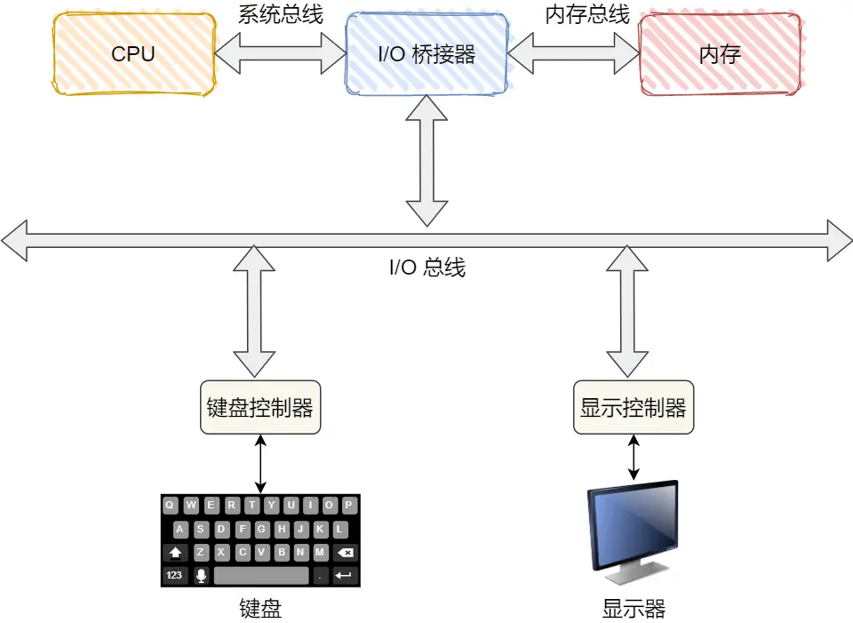

# 输入输出系统（设备管理）

- 编辑：李竹楠
- 日期：2024/01/27

## 1. 设备管理器

我们的电脑设备可以接非常多的输入输出设备，比如键盘、鼠标、显示器、网卡、硬盘、打印机、音响等等，每个设备的用法和功能都不同，那操作系统是如何把这些输入输出设备统一管理的呢?

为了屏蔽设备之间的差异，每个设备都有一个叫**设备控制器（Device Control）**的组件，比如硬盘有硬盘控制器、显示器有视频控制器等。

因为这些控制器都很清楚的知道对应设备的用法和功能，所以CPU是通过设备控制器来和设备打交道的。

设备控制器里有芯片，它可执行自己的逻辑，也有自己的寄存器，用来与 CPU 进行通信，比如：

- 通过写入这些寄存器，操作系统可以命令设备发送数据、接收数据、开启或关闭，或者执行某些其他操作。
- 通过读取这些寄存器，操作系统可以了解设备的状态，是否准备好接收一个新的命令等。

实际上，控制器是有三类寄存器，它们分别是**状态寄存器（Status Register）、命令寄存器（Command Register）以及数据寄存器（Data Register）**，如下图：

- 数据寄存器，CPU 向 I/O 设备写入需要传输的数据，比如要打印的内容是「Hello」，CPU 就要先发送一个 H 字符给到对应的 I/O 设备。
- 命令寄存器，CPU 发送一个命令，告诉 I/O 设备，要进行输入/输出操作，于是就会交给 I/O 设备去工作，任务完成后，会把状态寄存器里面的状态标记为完成。
- 状态寄存器，目的是告诉 CPU ，现在已经在工作或工作已经完成，如果已经在工作状态，CPU 再发送数据或者命令过来，都是没有用的，直到前面的工作已经完成，状态寄存标记成已完成，CPU 才能发送下一个字符和命令。

另外， 输入输出设备可分为两大类：**块设备（Block Device）**和**字符设备（Character Device）**。

- 块设备，把数据存储在固定大小的块中，每个块有自己的地址，硬盘、USB是常见的块设备。
- 字符设备，以字符为单位发送或接收一个字符流，字符设备是不可寻址的，也没有任何寻道操作，鼠标是常见的字符设备。

块设备通常传输的数据量会非常大，于是控制器设立了一个可读写的**数据缓冲区**。

- CPU 写入数据到控制器的缓冲区时，当缓冲区的数据囤够了一部分，才会发给设备。
- CPU 从控制器的缓冲区读取数据时，也需要缓冲区囤够了一部分，才拷贝到内存。

这样做是为了，减少对设备的频繁操作。

那CPU是如何与设备的控制寄存器和数据缓冲区进行通信的？

存在两个方法：

- 端口I/O，每个控制寄存器被分配一个I/O端口，可以通过特殊的汇编指令操作这些寄存器，比如`in/out`类似的指令。
- 内存映射 I/O，将所有控制寄存器映射到内存空间中，这样就可以像读写内存一样读写数据缓冲区。

## 2. I/O 控制方式

在前面我知道，每种设备都有一个设备控制器，控制器相当于一个小 CPU，它可以自己处理一些事情，但有个问题是，当 CPU 给设备发送了一个指令，让设备控制器去读设备的数据，它读完的时候，要怎么通知 CPU 呢？

控制器的寄存器一般会有状态标记位，用来标识输入或输出操作是否完成。于是，我们想到第一种**轮询等待**的方法，让 CPU 一直查寄存器的状态，直到状态标记为完成，很明显，这种方式非常的傻瓜，它会占用 CPU 的全部时间。

那我们就想到第二种方法 —— **中断**，通知操作系统数据已经准备好了。我们一般会有一个硬件的**中断控制器**，当设备完成任务后触发中断到中断控制器，中断控制器就通知 CPU，一个中断产生了，CPU 需要停下当前手里的事情来处理中断。另外，中断有两种，一种**软中断**，例如代码调用`INT`指令触发，一种是**硬件中断**，就是硬件通过中断控制器触发的。

但中断的方式对于频繁读写数据的磁盘，并不友好，这样 CPU 容易经常被打断，会占用 CPU 大量的时间。对于这一类设备的问题的解决方法是使用**DMA（Direct Memory Access）**功能，它可以使得设备在 CPU 不参与的情况下，能够自行完成把设备 I/O 数据放入到内存。那要实现 DMA 功能要有**DMA控制器**硬件的支持。

DMA 的工作方式如下：

1. CPU 需对 DMA 控制器下发指令，告诉它想读取多少数据，读完的数据放在内存的某个地方就可以了；
2. 接下来，DMA 控制器会向磁盘控制器发出指令，通知它从磁盘读数据到其内部的缓冲区中，接着磁盘控制器将缓冲区的数据传输到内存；
3. 磁盘控制器把数据传输到内存的操作
4. 磁盘控制器在总线上发出一个确认成功的信号到 DMA 控制器；
5. DMA 控制器收到信号后，DMA 控制器发中断通知 CPU 指令完成，CPU 就可以直接用内存里面现成的数据了。

可以看到， CPU 当要读取磁盘数据的时候，只需给 DMA 控制器发送指令，然后返回去做其他事情，当磁盘数据拷贝到内存后，DMA 控制机器通过中断的方式，告诉 CPU 数据已经准备好了，可以从内存读数据了。仅仅在传送开始和结束时需要 CPU 干预。

## 3. 设备驱动程序

虽然设备控制器**屏蔽了设备**的众多细节，但每种设备的控制器的寄存器、缓冲区等使用模式都是不同的，所以为了**屏蔽设备控制器的差异**，引入了设备驱动程序。

设备控制器不属于操作系统范畴，它是属于硬件，而设备驱动程序属于操作系统的一部分，操作系统的内核代码可以像本地调用代码一样使用设备驱动程序的接口，而设备驱动程序是面向设备控制器的代码，它发出操控设备控制器的指令后，才可以操作设备控制器。

不同的设备控制器虽然功能不同，但是设备驱动程序会**提供统一的接口给操作系统**，这样不同的设备驱动程序，就可以以相同的方式接入操作系统。如下图：

前面提到了不少关于中断的信息，设备完成了任务，则会发送中断来通知操作系统。那操作系统就需要有一个地方来处理这个中断，这个地方也就是在设备驱动程序里，它会及时响应控制器发来的中断请求，并根据这个中断的类型调用响应的**中断处理程序**进行处理。

通常，设备驱动程序初始化的时候，要先注册一个该设备的中断处理函数。

中断处理程序的处理流程：

1. 在 I/O 时，设备控制器如果已经准备好数据，则会通过中断控制器向 CPU 发送中断请求；
2. 保护被中断进程的 CPU 上下文；
3. 转入相应的设备中断处理函数；
4. 进行中断处理；
5. 恢复被中断进程的上下文。

## 4. 通用块层

对于块设备，为了减少不同块设备的差异带来的影响，Linux 通过一个统一的**通用块层**，来管理不同的块设备。

通用块层是处于文件系统和磁盘驱动中间的一个块设备抽象层，它主要有两个功能：

- 向上为文件系统和应用程序，**提供访问块设备的标准接口**，向下把各种不同的磁盘设备**抽象为统一的块设备**，并在内核层面，提供一个框架来管理这些设备的驱动程序；
- 通用层还会给文件系统和应用程序发来的I/O请求排队，接着会对队列重新排序、请求合并等方式，也就是**I/O 调度**，主要目的是为了**提高磁盘读写的效率**。

Linux 内存支持 5 种 I/O 调度算法，分别是：

- 没有调度算法，它不对文件系统和应用程序的 I/O 做任何处理，这种算法常用在虚拟机 I/O 中，此时磁盘 I/O 调度算法交由物理机系统负责。
- 先入先出调度算法，这是最简单的 I/O 调度算法，先进入 I/O 调度队列的 I/O 请求先发生。
- 完全公平调度算法，大部分系统都把这个算法作为默认的 I/O 调度器，它为每个进程维护了一个 I/O 调度队列，并**按照时间片来均匀分布每个进程的 I/O 请求**。
- 优先级调度算法，顾名思义，优先级高的 I/O 请求先发生， 它适用于运行大量进程的系统，像是桌面环境、多媒体应用等。
- 最终期限调度算法，分别为读、写请求创建了不同的 I/O 队列，这样可以提高机械磁盘的吞吐量，并确保达到最终期限的请求被优先处理，适用于在 I/O 压力比较大的场景，比如数据库等。

## 5. 存储系统 I/O 软件分层

可以把 Linux 存储系统的 I/O 由上到下可以分为三个层次，分别是文件系统层、通用块层、设备层。他们整个的层次关系如下图：

- 文件系统层，包括虚拟文件系统和其他文件系统的具体实现，它向上为应用程序统一**提供了标准的文件访问接口**，向下会通过通用块层来**存储和管理磁盘数据**。
- 通用块层，包括块设备的 I/O 队列和 I/O 调度器，它会对**文件系统的 I/O 请求进行排队**，再通过 I/O 调度器，选择一个 I/O 发给下一层的设备层。
- 设备层，包括硬件设备、设备控制器和驱动程序，负责最终物理设备的 I/O 操作。

有了文件系统接口之后，不但可以通过文件系统的命令行操作设备，也可以通过应用程序，调用`read`、`write`函数，就像读写文件一样操作设备，**所以说设备在Linux下，也只是一个特殊的文件**。

## 6. 举例

以“键盘敲入字母时，操作系统期间发生了什么？”为例，如下图：

CPU 里面的内存接口，直接和系统总线通信，然后系统总线再接入一个 I/O 桥接器，这个 I/O 桥接器，另一边接入了内存总线，使得 CPU 和内存通信。再另一边，又接入了一个 I/O 总线，用来连接 I/O 设备，比如键盘、显示器等。

那当用户输入了键盘字符，**键盘控制器**就会产生扫描码数据，并将其缓冲在键盘控制器的寄存器中，紧接着键盘控制器通过总线给 CPU 发送**中断请求**。

CPU 收到中断请求后，操作系统会**保存被中断进程的 CPU 上下文**，然后调用键盘的**中断处理程序**。

**键盘的中断处理程序**是在键盘驱动程序初始化时注册的，那键盘中断处理函数的功能就是从**键盘控制器的寄存器的缓冲区**读取扫描码，再根据扫描码找到用户在键盘输入的字符，如果输入的字符是显示字符，那就会把扫描码翻译成对应显示字符的 ASCII 码，比如用户在键盘输入的是字母 A，是显示字符，于是就会把扫描码翻译成 A 字符的 ASCII 码。

得到了显示字符的 ASCII 码后，就会把 ASCII 码放到**读缓冲区队列**，接下来就是要把显示字符显示屏幕了，显示设备的驱动程序会定时从**读缓冲区队列**读取数据放到**写缓冲区队列**，最后把**写缓冲区队列**的数据一个一个写入到显示设备的控制器的**寄存器中的数据缓冲区**，最后将这些数据显示在屏幕里。

显示出结果后，**恢复被中断进程的上下文**。

## 7. 面试题

### 7.1 零拷贝了解吗？

假如需要文件传输，使用传统I/O，数据读取和写入是用户空间到内核空间来回赋值，而内核空间的数据是通过操作系统的I/O接口从磁盘读取或者写入，这期间发生了多次用户态和内核态的上下文切换，以及多次数据拷贝。

为了提升I/O性能，就需要**减少用户态与内核态的上下文切换和内存拷贝的次数**。

零拷贝技术实现主要有两种：

- mmap + write：mmap()系统调用函数会直接把内核缓冲区地址**映射**到用户空间缓冲区地址，这样，操作系统内核与用户空间就不需要再进行任何的数据拷贝操作。但是在内核空间内仍然有一次CPU拷贝。

    

- sendfile：mmap+write方式有一定改进，但是由系统调用引起的状态切换并没有减少。在Linux 2.1 中替代了`read()`和`write()`这两个系统调用。这样就可以减少一次系统调用，也就减少了两次上下文切换的开销。其次，将内核缓冲区数据直接拷贝到Socket缓冲区，这样就不用将数据拷贝到用户态，减少了两次拷贝

    

很多开源项目如Kafka、RocketMQ都采用了零拷贝技术来提升IO效率。

### 7.2 I/O 多路复用

日后再补