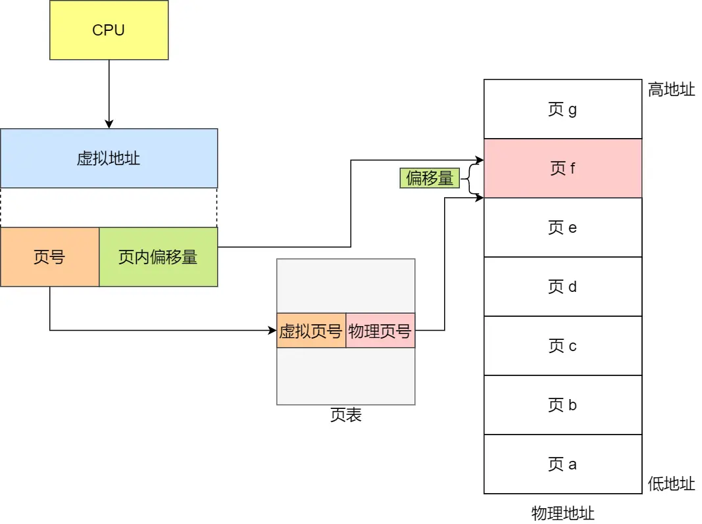
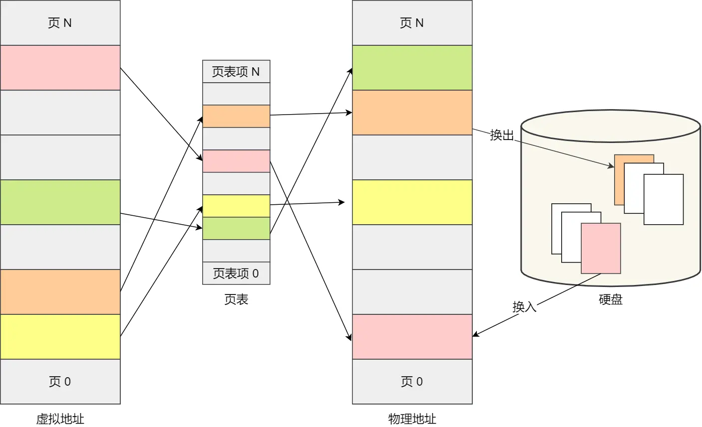
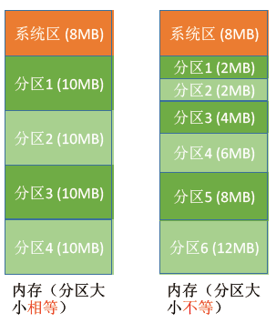
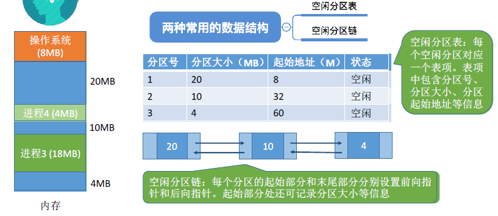
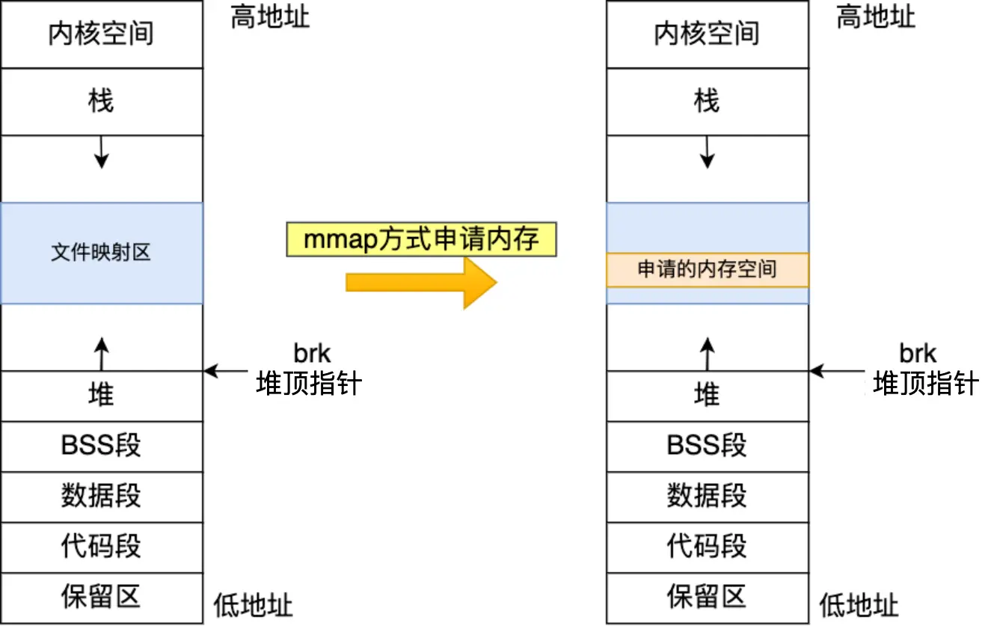
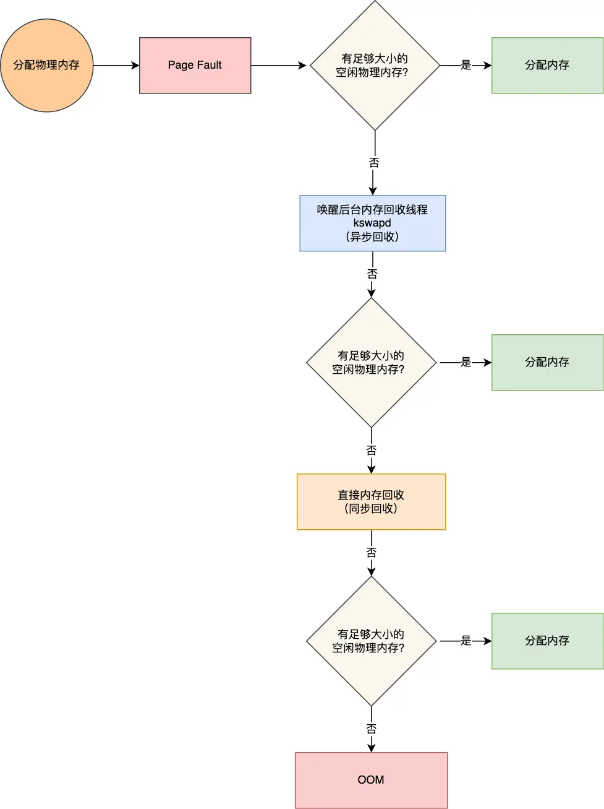

# 内存管理

- 编辑：李竹楠
- 日期：2023/12/20

## 1. 内存基础

如何区分各个程序的数据存放的位置？
> 给内存的存储单元**编号**
> 如果计算机**按字节编号**，则**每个存储单元大小为1字节**，即**8B**，即**8**个二进制位
> 如果字长为16位的计算机按字编址，则每个存储单元大小为1个字，即每个字大小为16个二进制位

### 1.1 指令的工作原理

对于一个写好的程序，经过**编译、链接，会形成可执行文件**。可执行文件中的内容是一个个的指令（二进制），指令中的地址都是相对地址（相对于该可执行文件的地址，又称逻辑地址）。每次真正运行的时候，需要把可执行文件装入内存中，内存会开辟一段空间专门给这个程序，这就涉及到两个问题：

- **[装入方式](#12-装入方式)**
- 逻辑地址和物理地址的**[转换](#4-地址转换)**

### 1.2 虚拟内存

以单片机为例，由于单片机没有操作系统，所以写完代码需要借助工具烧录。另外，单片机的 CPU 是直接操作内存的**物理地址**。

在这种情况下，要想在内存中同时运行两个程序是不可能的。如果第一个程序在 2000 的位置写入一个新的值，将会擦掉第二个程序存放在相同位置上的所有内容，所以同时运行两个程序是根本行不通的，这两个程序会立刻崩溃。

操作系统是如何解决这个问题呢？
> 这里关键的问题是这两个程序都引用了绝对物理地址，而这正是我们最需要避免的。

我们可以把进程所使用的地址**隔离**开来，即让操作系统为每个进程分配独立的一套**虚拟地址**，人人都有，大家自己玩自己的地址就行，互不干涉。但是有个前提每个进程都不能访问物理地址，至于虚拟地址最终怎么落到物理内存里，对进程来说是透明的，操作系统已经把这些都安排的明明白白了。

**操作系统会提供一种机制，将不同进程的虚拟地址和不同内存的物理地址映射起来。**

如果程序要访问虚拟地址的时候，由操作系统转换成不同的物理地址，这样不同的进程运行的时候，写入的是不同的物理地址，这样就不会冲突了。

于是，这里就引出了两种地址的概念：
- 我们程序所使用的内存地址叫做虚拟内存地址（Virtual Memory Address）
- 实际存在硬件里面的空间地址叫物理内存地址（Physical Memory Address）。

操作系统引入了虚拟内存，进程持有的虚拟地址会通过CPU芯片中的内存管理单元（MMU）的映射关系，来转换变成物理地址，然后再通过物理地址访问内存，如下图所示：


操作系统是如何管理虚拟地址与物理地址之间的关系？
主要有两种方式，分别是 **[内存分段](#2-分段存储管理)** 和 **[内存分页](#3-分页存储管理)**，其中分段是比较早提出的。

在这之前，下文对基本概念做了一个复盘。

### 1.3 链接方式

#### 1.3.1 静态链接

在程序运行之前，先将各目标模块及它们所需的库函数连接成一个完整的可执行文件（转入模块），之后不再拆开。


C++中的静态链接：
> 静态链接在编译阶段就将库文件的所有代码加到可执行文件中，因此生成的程序体积更大，其后缀名一般为`.a`，静态库的优点：
> 
> - 代码装载速度比动态库快，执行效率也略高。
> - 不依赖于外部库安装环境，部署方便。
> 
> 静态库链接顺序：`gcc`链接库的顺序是从右到左的，假设`main.cpp`依赖`liba.a`，`liba.a`依赖`libb.a`，则链接顺序为`g++ main.cpp liba.a libb.a`，如果修改顺序就会链接报错。

#### 1.3.2 装入时动态链接

将各目标模块装入内存时，边装入边链接的方式。


#### 1.3.3 运行时动态链接

在执行程序中需要用到的目标模块才对它进行链接。优点是方便修改和更新，便于对目标模块的共享。


C++中的动态链接：
> 动态链接在编译链接时并不会把库文件的代码加到可执行文件中，而是在运行时加载所需的动态库，后缀名一般为`.so`，动态库的优点：
> 
> - 生成的可执行程序更小。
> - 共享库是通过mmap映射的方式实现文件共享，多进程运行时更加节省内存。
> - 库文件修改时，可执行文件不需要重新编译，只需要加载模块即可。

### 1.4 装入方式

一共分为三种装入方式：

- 绝对装入：在编译时，如果知道程序将放在内存的位置，**编译程序就直接产生绝对地址的目标代码**。缺点是如果分配的内存地址发生改变，需要重新编译链接生成新的目标代码，**灵活性不高**。只适用于单道程序的运行环境。
- 可重定位装入（静态重定位）：编译链接生成目标代码的时候，依然生成相对地址，**当装入内存的时候，把所有地址都加上起始物理地址**。缺点是在装入一个作业时，**必须分配其要求的全部内存空间**，如果没有足够的内存，就不能够装入该作业。作业一旦装入内存，**在运行期间也不可以移动，也不可以申请新的内存空间**。
- 动态运行时装入（动态重定位）：装入内存的时候，依然采用相对地址，**把地址转换工作推迟到程序真正要执行时才进行**。需要借用一个**重定位寄存器**的支持，重定位寄存器中保存装入模块存放的**起始位置**。特点是可将程序分配到不连续的内存空间中；运行某一部分代码时，装入相应的代码即可；便于用户共享程序段。

## 2. 分段存储管理

程序是由若干个逻辑分段组成的，如可由代码分段、数据分段、栈段、堆段组成。**不同的段是有不同的属性的，所以就用分段（Segmentation）的形式把这些段分离出来**。

分段机制下，虚拟地址和物理地址是如何映射的？
分段机制下的虚拟地址由两部分组成，**段选择因子**和**段内偏移量**。


- 段选择因子：保存在段寄存器内。段选择子里面最重要的是**段号**，用作段表的索引。**段表**里面保存的是这个**段的基地址、段的界限和特权等级**等。
- 段内偏移量：应该位于 0 和段界限之间，如果段内偏移量是合法的，就将段基地址加上段内偏移量得到物理内存地址。

在上面，知道了虚拟地址是通过**段表**与物理地址进行映射的，分段机制会把程序的虚拟地址分成 4 个段，每个段在段表中有一个项，在这一项找到段的基地址，再加上偏移量，于是就能找到物理内存中的地址，如下图：


如果要访问段 3 中偏移量 500 的虚拟地址，我们可以计算出物理地址为，段 3 基地址 7000 + 偏移量 500 = 7500。

分段的办法很好，解决了程序本身不需要关心具体的物理内存地址的问题，但它也有一些不足之处：

- 就是**内存碎片**的问题。
- 就是**内存交换的效率低**的问题。

为什么会产生内存碎片？

我们来看看这样一个例子。假设有 1G 的物理内存，用户执行了多个程序，其中：1. 游戏占用了 512MB 内存；2. 浏览器占用了 128MB 内存；3. 音乐占用了 256 MB 内存。这个时候，如果我们关闭了浏览器，则空闲内存还有 1024 - 512 - 256 = 256MB。

如果这个 256MB 不是连续的，被分成了两段 128 MB 内存，这就会导致没有空间再打开一个 200MB 的程序。


那么内存分段会出现内存碎片吗？

内存分段管理可以做到段根据实际需求分配内存，所以有多少需求就分配多大的段，所以**不会出现内部内存碎片**。但是由于每个段的长度不固定，所以多个段未必能恰好使用所有的内存空间，会产生了多个不连续的小物理内存，导致新的程序无法被装载，所以**会出现外部内存碎片**的问题。解决**外部内存碎片**的问题就是**内存交换**。

如何进行内存交换？

可以把音乐程序占用的那 256MB 内存写到硬盘上，然后再从硬盘上读回来到内存里。不过再读回的时候，我们不能装载回原来的位置，而是紧紧跟着那已经被占用了的 512MB 内存后面。这样就能空缺出连续的 256MB 空间，于是新的 200MB 程序就可以装载进来。

这个内存交换空间，在Linux系统里，也就是我们常看到的**Swap**空间，这块空间是从硬盘划分出来的，用于内存与硬盘的空间交换。

分段为什么会导致内存交换效率低的问题？

对于多进程的系统来说，用分段的方式，外部内存碎片是很容易产生的，产生了外部内存碎片，那不得不重新 Swap 内存区域，这个过程会产生性能瓶颈。**因为硬盘的访问速度要比内存慢太多了，每一次内存交换，我们都需要把一大段连续的内存数据写到硬盘上。所以，如果内存交换的时候，交换的是一个占内存空间很大的程序，这样整个机器都会显得卡顿**。为了解决内存分段的「外部内存碎片和内存交换效率低」的问题，就出现了[内存分页](#3-分页存储管理)。

## 3. 分页存储管理

### 3.1 简单内存分页

分段的好处就是能产生连续的内存空间，但是会出现**外部内存碎片和内存交换的空间太大**的问题。

要解决这些问题，那么就要想出能**少出现一些内存碎片**的办法。另外，当需要进行内存交换的时候，让需要**交换写入或者从磁盘装载的数据更少一点**，这样就可以解决问题了。这个办法，也就是内存分页（Paging）。

**分页是把整个虚拟和物理内存空间切成一段段固定尺寸的大小**。这样一个连续并且尺寸固定的内存空间，我们叫**页（Page）**。在 Linux 下，每一页的大小为4KB。

虚拟地址与物理地址之间通过**页表**来映射，如下图：


页表存放在物理内存中，页表起始地址和页表长度存在 PCB 中，记录了进程的每个页面在内存中的位置信息。


页表是存储在内存里的，**内存管理单元（MMU）**就做将虚拟内存地址转换成物理地址的工作。而当进程访问的虚拟地址在页表中查不到时，系统会产生一个**缺页异常**，进入系统内核空间分配物理内存、更新进程页表，最后再返回用户空间，恢复进程的运行。

分页机制下，虚拟地址和物理地址是如何映射的？

在分页机制下，虚拟地址分为两部分，**页号**和**页内偏移**。页号作为页表的索引，页表包含**物理页每页所在物理内存的基地址**，这个**基地址与页内偏移的组合就形成了物理内存地址**，见下图：



总结一下，对于一个内存地址转换，其实就是这样三个步骤：

1. 把虚拟内存地址，切分成页号和偏移量；
2. 根据页号，从页表里面，查询对应的物理页号；
3. 直接拿物理页号，加上前面的偏移量，就得到了物理内存地址。

下面举个例子，虚拟内存中的页通过页表映射为了物理内存中的页，如下图：


分页是怎么解决分段的**外部内存碎片**问题？

内存分页由于内存空间都是预先划分好的，也就不会像内存分段一样，在段与段之间会产生间隙非常小的内存，这正是分段会产生外部内存碎片的原因。而**采用了分页，页与页之间是紧密排列的，所以不会有外部碎片**。

但是，因为内存分页机制分配内存的最小单位是一页，即使程序不足一页大小，我们最少只能分配一个页，所以页内会出现内存浪费，所以针对内存分页机制**会有内部内存碎片**的现象。

分页是怎么解决分段的**内存交换效率低**问题？

如果内存空间不够，操作系统会把其他正在运行的进程中的**最近没被使用**的内存页面给释放掉，也就是暂时写在硬盘上，称为**换出（Swap Out）**。一旦需要的时候，再加载进来，称为**换入（Swap In）**。所以，一次性写入磁盘的也只有少数的**一个页或者几个页**，不会花太多时间，**内存交换的效率就相对比较高**。



更进一步地，分页的方式使得我们在加载程序的时候，**不再需要一次性**都把程序加载到物理内存中。我们完全可以在进行虚拟内存和物理内存的页之间的映射之后，并不真的把页加载到物理内存里，而是**只有在程序运行中，需要用到对应虚拟内存页里面的指令和数据时，再加载到物理内存里面去**。

简单的分页有什么缺陷吗？

有空间上的缺陷。因为操作系统是可以同时运行非常多的进程的，那这意味着页表会非常的庞大。在32位的环境下，虚拟地址空间共有4GB，假设一个页的大小是4KB（$2^{12}$），那么就需要大约100万（$2^{20}$）个页，每个页表项需要4个字节大小来存储，那么整个4GB空间的映射就需要有4MB的内存来存储页表。这4MB大小的页表，看起来也不是很大。但是每个进程都是有自己的虚拟地址空间，也就说**都有自己的页表**。那么，100个进程的话，就需要400MB的内存来存储页表，这是非常大的内存了，更别说64位的环境了。

### 3.2 多级页表

要解决上面的问题，就需要采用一种叫作**多级页表（Multi-Level Page Table）** 的解决方案。

上文已知，对于单页表的实现方式，在 32 位和页大小 4KB 的环境下，一个进程的页表需要装下 100 多万个页表项，并且每个页表项是占用 4 字节大小的，于是相当于每个页表需占用 4MB 大小的空间。

我们把这个 100 多万个**页表项**的单级页表再分页，将页表（一级页表）分为 1024 个页表（二级页表），每个表（二级页表）中包含 1024 个**页表项**，形成**二级分页**。如下图所示：


你可能会问，分了二级表，映射 4GB 地址空间就需要 4KB（一级页表）+ 4MB（二级页表）的内存，这样占用空间不是更大了吗？

当然如果 4GB 的虚拟地址全部都映射到了物理内存上的话，二级分页占用空间确实是更大了，但是，我们往往不会为一个进程分配那么多内存。如果在**局部性原理**的角度思考这个问题。<u>每个进程都有 4GB 的虚拟地址空间，而显然对于大多数程序来说，其使用到的空间远未达到 4GB，会存在部分对应的页表项都是空的，根本没有分配，对于已分配的页表项，如果存在最近一定时间未访问的页表，在物理内存紧张的情况下，操作系统会将页面换出到硬盘，也就是说不会占用物理内存。</u>

如果使用了二级分页，一级页表就可以覆盖整个 4GB 虚拟地址空间，但**如果某个一级页表的页表项没有被用到，也就不需要创建这个页表项对应的二级页表了，即可以在需要时才创建二级页表**。做个简单的计算，假设只有 20% 的一级页表项被用到了，那么页表占用的内存空间就只有 4KB（一级页表） + 20% * 4MB（二级页表）= 0.804MB，这对比单级页表的 4MB 是一个巨大的节约。

那么为什么不分级的页表就做不到这样节约内存呢？

我们从页表的性质来看，保存在内存中的页表承担的职责是将虚拟地址翻译成物理地址。假如虚拟地址在页表中找不到对应的页表项，计算机系统就不能工作了。所以**页表一定要覆盖全部虚拟地址空间，不分级的页表就需要有 100 多万个页表项来映射，而二级分页则只需要 1024 个页表项**（此时一级页表覆盖到了全部虚拟地址空间，二级页表在需要时创建）。

我们把二级分页再推广到多级页表，就会发现页表占用的内存空间更少了，这一切都要归功于对局部性原理的充分应用。对于 64 位的系统，两级分页肯定不够了，就变成了四级目录，分别是：

- 全局页目录项 PGD（Page Global Directory）；
- 上层页目录项 PUD（Page Upper Directory）；
- 中间页目录项 PMD（Page Middle Directory）；
- 页表项 PTE（Page Table Entry）；


### 3.3 TLB(Translation Lookaside Buffer)

多级页表虽然解决了空间上的问题，但是虚拟地址到物理地址的转换就多了几道转换的工序，这显然就降低了这俩地址转换的速度，也就是带来了时间上的开销。

程序是有局部性的，即在一段时间内，整个程序的执行仅限于程序中的某一部分。相应地，执行所访问的存储空间也局限于某个内存区域。


我们就可以利用这一特性，把最常访问的几个页表项存储到访问速度更快的硬件。所以，就在 CPU 芯片中，加入了一个专门存放程序最常访问的页表项的 Cache，这个 Cache 就是 TLB（Translation Lookaside Buffer） ，通常称为**页表缓存、转址旁路缓存、快表**等。


在 CPU 芯片里面，封装了内存管理单元（Memory Management Unit）芯片，它用来完成地址转换和 TLB 的访问与交互。

有了 TLB 后，那么 CPU 在寻址时，会先查 TLB，如果没找到，才会继续查常规的页表。

TLB 的命中率其实是很高的，因为程序最常访问的页就那么几个。

## 4. 段页式内存管理

内存分段和内存分页并不是对立的，它们是可以组合起来在同一个系统中使用的，那么组合起来后，通常称为**段页式内存管理**。


段页式内存管理实现的方式：

- 先将程序划分为多个有逻辑意义的段，也就是前面提到的分段机制；
- 接着再把每个段划分为多个页，也就是对分段划分出来的连续空间，再划分固定大小的页；

这样，地址结构就由**段号、段内页号和页内位移**三部分组成。

用于段页式地址变换的数据结构是每一个程序一张段表，每个段又建立一张页表，段表中的地址是页表的起始地址，而页表中的地址则为某页的物理页号，如图所示：


段页式地址变换中要得到物理地址须经过三次内存访问：

- 第一次访问段表，得到页表起始地址；
- 第二次访问页表，得到物理页号；
- 第三次将物理页号与页内位移组合，得到物理地址。

可用软、硬件相结合的方法实现段页式地址变换，这样虽然增加了硬件成本和系统开销，但提高了内存的利用率。

## 5. 内存的分配与回收

### 5.1 分配方式

#### 5.1.1 单一连续分配

在单一连续分配方式中，内存被分为**系统区**和**用户区**。系统区常常位于内存的低地址部分，用于存放操作系统相关数据；用户区用于存放用户进程相关数据。内存中只能有一道用户程序，用户程序独占整个用户区空间。

- 优点：实现简单；无外部碎片；可以采用覆盖技能扩充内存；不一定需要采取内存保护（因为只有一道用户程序）
- 缺点：只能用于单用户、单任务的操作系统中；有内部碎片；存储器利用率极低

#### 5.1.2 固定分区分配

为了可以装入多道程序，且这些程序之间又不会互相干扰，于是将整个用户空间划分为**若干个固定大小的分区，在每个分区中只装入一道作业**，这样就形成了最早的、最简单的一种可运行多道程序的内存管理方式。



- 分区大小相等：缺乏灵活性，但是很适合用于用一台计算机控制多个相同对象的场合
- 分区大小不等：增加了灵活性，可以满足大小不同的进程需求，根据常在系统中运行的作业情况进行划分（划分多个小分区、适量中等分区、少量大分区）

操作系统需要建立一个数据结构 —— 分区说明表，来实现各个分区的分配与回收。每个表项对应一个分区，通常按分区的大小排列。每个表项包括：分区的大小、起始状态、状态（是否分配）


- 优点：实现简单、**无外部碎片**
- 缺点：
    - 当用户程序太大，可能没有一个分区满足要求，不得不采用覆盖技术，会降低性能
    - 会产生**内部碎片**，内存利用率低

#### 5.1.3 动态分区分配

动态分区分配（可变分区分配）：不会预先分配分区，而是进程装入内存时，根据进程的大小动态地建立分区。



##### 5.1.3.1 分区的分配和回收

- 分配：
    - 当从空闲分区表中选择一个分区分配后，内存还有剩余，则修改表项
    - 当从空闲分区表中选择一个分区分配后，刚刚好分配完，则删除该表项
- 回收：
    - 回收区后面有一个相邻的空闲分区，则合并
    - 回收区前面有一个相邻的空闲分区，则合并
    - 回收区前后各有一个相邻的空闲分区，则三个合并为一个
    - 回收区前后无相邻的空闲分区，则新增一个表项
- 内部碎片：分配给某些进程的内存区域中，有些部分没有用上
- 外部碎片：内存中某些空闲的分区由于太小而难以利用

如果内存中零碎的空间太多，导致无法满足内存较大的进程，可采用**拼凑技术**来解决外部碎片。动态分区分配应该使用动态重定位装入（绝对装入地址改变，需要重新编译；静态装入，不支持移动）。

##### 5.1.3.2 空闲分区的选择

把一个新作业装入内存时，须按照一定的动态分区分配算法，从空闲分区中选择一个分区分配给该作业。

| 算法 | 算法思想 | 分区排列顺序 | 优点 | 缺点 |
| ---- | ---- | ---- | --- | --- |
|首次适应|从头开始找到第一个满足大小的内存空闲分区|按地址递增|综合性能最好算法开销小回收分区后一般不需要对空闲分区重新排序|增加查找的开销|
|最佳适应|优先使用更小的分区以保留更多更大的分区|按容量递增|会有更多更大的内存空闲块保留能满足更大进程的需求|会产生很多很小难以利用的碎片算法开销大（需要重新排序）|
|最坏适应|优先使用更大的分区以防止产生太多的外部碎片|按容量递减|可以减少难以利用的小碎片（外部碎片）|大分区容易被用完不利于大进程算法开销大（需要重新排序）|
|邻近适应|每次从上次结束的位置开始查找|按地址递增|不用每次从头开始检索，算法开销小|会使得高地址的大分区也被用完|

###### 5.1.3.2.1 首次适应算法（First Fit）

算法思想：每次都从低地址开始查找，找到第一个能满足大小的空闲分区。

实现方法：**空闲分区以地址递增的次序开始排序**。每次分配内存时顺序查找空闲分区链（或空闲分区表），找到第一个满足大小的空闲分区。

缺点：增加查找的开销。

###### 5.1.3.2.2 最佳适应算法（Best Fit）

算法思想：考虑大内存的进程有地可留，优先使用更小内存的空闲区。

实现方法：空闲分区**按容量**递增次序链接。每次分配内存时顺序查找空闲分区链（或空闲分区表），找到**第一个满足大小的空闲分区**。

缺点：每次都选小内存的分区进行分配，**会留下越来越多很小的、难以利用的内存块**。因此这种方法会产生很多外部碎片。

###### 5.1.3.2.3 最坏适应算法（Worst Fit）

算法思想：避免留下越来越多的小内存块，优先使用更大内存的空闲块。

实现方法：空闲分区按容量递减次序链接。每次分配内存时顺序查找空闲分区链（或空闲分区表），找到第一个满足大小的空闲分区。

缺点：导致**更快使用完大内存的空闲块**，使之后的大内存的进程无分区可用。

###### 5.1.3.2.4 邻近适应算法（Next Fit）

算法思想：首次适应算法，每次都从低地址开始遍历，导致低地址产生越来越多很小的空闲块。新来一个进程就重新从头开始遍历，会增加查找的开销。**邻近适应算法就是接着从上一次查找结束的位置开始检索**。

实现方法：空闲分区按地址递增次序排列（可排成一个循环列表）。每次分配内存时**从上次查找结束的位置**开始查找空闲分区链（或空闲分区表），找到第一个满足大小的空闲分区。

优点：无论低地址还是高地址都有相同的概率被使用。

## 6. Linux 内存布局

那么，Linux 操作系统如何管理内存？

在回答这个问题前，我们得先看看 Intel 处理器的发展历史。早期 Intel 的处理器从 80286 开始使用的是段式内存管理。但是很快发现，光有段式内存管理而没有页式内存管理是不够的，这会使它的 X86 系列会失去市场的竞争力。因此，在不久以后的 80386 中就实现了页式内存管理。也就是说，80386 除了完成并完善从 80286 开始的段式内存管理的同时还实现了页式内存管理。

但是这个 80386 的页式内存管理设计时，没有绕开段式内存管理，而是建立在段式内存管理的基础上，这就意味着：**页式内存管理的作用是在由段式内存管理所映射而成的地址上再加上一层地址映射**。

由于此时由段式内存管理映射而成的地址不再是“物理地址”了，Intel 就称之为“线性地址”（也称虚拟地址）。于是，段式内存管理先将逻辑地址映射成线性地址，然后再由页式内存管理将线性地址映射成物理地址。


这里说明下逻辑地址和线性地址：

- 程序所使用的地址，通常是没被段式内存管理映射的地址，称为逻辑地址；
- 通过段式内存管理映射的地址，称为线性地址，也叫虚拟地址；

逻辑地址是**段式内存管理**转换前的地址，线性地址则是**页式内存管理**转换前的地址。

了解完 Intel 处理器的发展历史后，我们再来说说 Linux 采用了什么方式管理内存？

**Linux 内存主要采用的是页式内存管理，但同时也不可避免地涉及了段机制**。

这主要是上面 Intel 处理器发展历史导致的，因为 Intel X86 CPU 一律对程序中使用的地址先进行段式映射，然后才能进行页式映射。既然 CPU 的硬件结构是这样，Linux 内核也只好服从 Intel 的选择。

但是事实上，Linux 内核所采取的办法是使段式映射的过程实际上不起什么作用。也就是说，“上有政策，下有对策”，若惹不起就躲着走。

**Linux 系统中的每个段都是从 0 地址开始的整个 4GB 虚拟空间（32 位环境下），也就是所有的段的起始地址都是一样的。这意味着，Linux 系统中的代码，包括操作系统本身的代码和应用程序代码，所面对的地址空间都是线性地址空间（虚拟地址），这种做法相当于屏蔽了处理器中的逻辑地址概念，段只被用于访问控制和内存保护**。

Linux 的虚拟地址空间是如何分布的？

在 Linux 操作系统中，虚拟地址空间的内部又被分为**内核空间和用户空间**两部分，不同位数的系统，地址空间的范围也不同。比如最常见的 32 位和 64 位系统，如下所示：


通过这里可以看出：

- 32 位系统的内核空间占用 1G，位于最高处，剩下的 3G 是用户空间；
- 64 位系统的内核空间和用户空间都是 128T，分别占据整个内存空间的最高和最低处，剩下的中间部分是未定义的。

再来说说，内核空间与用户空间的区别：

- 进程在用户态时，只能访问用户空间内存；
- 只有进入内核态后，才可以访问内核空间的内存；

虽然每个进程都各自有独立的虚拟内存，但是**每个虚拟内存中的内核地址，其实关联的都是相同的物理内存**。这样，进程切换到内核态后，就可以很方便地访问内核空间内存。


接下来，进一步了解虚拟空间的划分情况，用户空间和内核空间划分的方式是不同的，内核空间的分布情况就不多说了。

我们看看用户空间分布的情况，以 32 位系统为例，表示它们的关系：


通过这张图你可以看到，用户空间内存，从**低到高**分别是 6 种不同的内存段：

- 代码段，包括二进制可执行代码；
- 数据段，包括已初始化的静态常量和全局变量；
- BSS 段，包括未初始化的静态变量和全局变量；
- 堆段，包括动态分配的内存，从低地址开始向上增长；
- 文件映射段，包括动态库、共享内存等，从低地址开始向上增长（[跟硬件和内核版本有关](https://lishiwen4.github.io/linux/linux-process-memory-location)）；
- 栈段，包括局部变量和函数调用的上下文等。栈的大小是固定的，一般是 8 MB。当然系统也提供了参数，以便我们自定义大小；

上图中的内存布局可以看到，代码段下面还有一段内存空间的（灰色部分），这一块区域是**保留区**，之所以要有保留区这是**因为在大多数的系统里，我们认为比较小数值的地址不是一个合法地址**，例如，我们通常在 C 的代码里会将无效的指针赋值为 NULL。因此，这里会出现一段不可访问的内存保留区，防止程序因为出现 bug，导致读或写了一些小内存地址的数据，而使得程序跑飞。

在这 7 个内存段中，堆和文件映射段的内存是动态分配的。比如说，使用 C 标准库的·`malloc()`或者`mmap()`，就可以分别在堆和文件映射段动态分配内存。

最后的总结：

为了在多进程环境下，使得进程之间的内存地址不受影响，相互隔离，于是操作系统就为每个进程独立分配一套**虚拟地址空间**，每个程序只关心自己的虚拟地址就可以，实际上大家的虚拟地址都是一样的，但分布到物理地址内存是不一样的。作为程序，也不用关心物理地址的事情。

每个进程都有自己的虚拟空间，而物理内存只有一个，所以当启用了大量的进程，物理内存必然会很紧张，于是操作系统会通过**内存交换技术**，把不常使用的内存暂时存放到硬盘（换出），在需要的时候再装载回物理内存（换入）。

那既然有了虚拟地址空间，那必然要把虚拟地址**映射**到物理地址，这个事情通常由操作系统来维护。那么对于虚拟地址与物理地址的映射关系，可以有分段和分页的方式，同时两者结合都是可以的。

内存**分段**是根据程序的逻辑角度，分成了栈段、堆段、数据段、代码段等，这样可以分离出不同属性的段，同时是一块连续的空间。但是每个段的大小都不是统一的，这就会导致外部内存碎片和内存交换效率低的问题。

于是，就出现了内存**分页**，把虚拟空间和物理空间分成大小固定的页，如在 Linux 系统中，每一页的大小为 4KB。由于分了页后，就不会产生细小的内存碎片，解决了内存分段的外部内存碎片问题。同时在内存交换的时候，写入硬盘也就一个页或几个页，这就大大提高了内存交换的效率。

再来，为了解决简单分页产生的页表过大的问题，就有了**多级页表**，它解决了空间上的问题，但这就会导致 CPU 在寻址的过程中，需要有很多层表参与，加大了时间上的开销。于是根据程序的局部性原理，在 CPU 芯片中加入了 **TLB**，负责缓存最近常被访问的页表项，大大提高了地址的转换速度。

**Linux 系统主要采用了分页管理，但是由于 Intel 处理器的发展史，Linux 系统无法避免分段管理**。于是 Linux 就把所有段的基地址设为 0，也就意味着所有程序的地址空间都是线性地址空间（虚拟地址），相当于屏蔽了 CPU 逻辑地址的概念，所以段只被用于访问控制和内存保护。

另外，Linux 系统中虚拟空间分布可分为用户态和内核态两部分，其中用户态的分布：代码段、全局变量、BSS、函数栈、堆内存、映射区。

最后，虚拟内存有什么作用？

- **虚拟内存可以使得进程对运行内存超过物理内存大小**，因为程序运行符合局部性原理，CPU 访问内存会有很明显的重复访问的倾向性，对于那些没有被经常使用到的内存，我们可以把它换出到物理内存之外，比如硬盘上的 swap 区域。
- 由于每个进程都有自己的页表，所以每个进程的虚拟内存空间就是相互独立的。进程也没有办法访问其他进程的页表，所以这些页表是私有的，这就**解决了多进程之间地址冲突的问题**。
- 页表里的页表项中除了物理地址之外，还有一些标记属性的比特，比如控制一个页的读写权限，标记该页是否存在等。在内存访问方面，操作系统**提供了更好的安全性**。

## 7. 深入理解 Linux 内存管理

日后再补。

## 7.1 虚拟内存管理

## 7.2 物理内存管理

## 8. 面试题

### 8.1 什么是虚拟内存？

简单说，**虚拟内存是操作系统提供的⼀种机制，将不同进程的虚拟地址和不同内存的物理地址映射起来**。每个进程都有自己独立的地址空间，再由操作系统映射到到实际的物理内存。

### 8.2 什么是内存分段？

程序是由若干个逻辑分段组成的，如可由代码分段、数据分段、栈段、堆段组成。不同的段是有不同的属性的，所以就用分段（Segmentation）的形式把这些段分离出来。分段机制下的虚拟地址由两部分组成，**段号**和**段内偏移量**。

### 8.3 什么是内存分页？

**分⻚是把整个虚拟和物理内存空间切成⼀段段固定尺⼨的⼤⼩**。这样⼀个连续并且尺寸固定的内存空间，我们叫页（Page）。在 Linux 下，每一页的大小为 4KB 。

### 8.4 多级页表知道吗？

操作系统可能会有非常多进程，如果只是使用简单分页，可能导致的后果就是页表变得非常庞大。所以，引入了多级页表的解决方案。所谓的多级页表，就是把我们原来的单级页表再次分页，这里利用了**局部性原理**除了顶级页表，其它级别的页表一来可以在需要的时候才被创建，二来内存紧张的时候还可以被置换到磁盘中。，

### 8.5 什么是快表？

同样利用了**局部性原理**，即在⼀段时间内，整个程序的执行仅限于程序中的某一部分。相应地，执行所访问的存储空间也局限于某个内存区域。

利用这一特性，把最常访问的几个页表项存储到访问速度更快的硬件，于是计算机科学家们，就在 CPU 芯片中，加⼊了⼀个专门存放程序最常访问的页表项的 Cache，这个 Cache 就是 TLB（Translation Lookaside Buffer） ，通常称为页表缓存、转址旁路缓存、快表等。

### 8.6 分页和分段有什么区别？

- 段是信息的逻辑单位，它是根据用户的需要划分的，因此段对用户是可见的 ；页是信息的物理单位，是为了管理主存的方便而划分的，对用户是透明的。
- 段的大小不固定，有它所完成的功能决定；页的大小固定，由系统决定
- 段向用户提供二维地址空间；页向用户提供的是一维地址空间
- 段是信息的逻辑单位，便于存储保护和信息的共享，页的保护和共享受到限制。

### 8.7 什么是交换空间？

操作系统把物理内存(Physical RAM)分成一块一块的小内存，每一块内存被称为页(page)。当内存资源不足时，Linux把某些页的内容转移至磁盘上的一块空间上，以释放内存空间。磁盘上的那块空间叫做交换空间(swap space),而这一过程被称为交换(swapping)。物理内存和交换空间的总容量就是虚拟内存的可用容量。

### 8.8 页面置换算法有哪些？

在分页系统里，一个虚拟的页面可能在主存里，也可能在磁盘中，如果CPU发现虚拟地址对应的物理页不在主存里，就会产生一个**缺页中断**，然后从磁盘中把该页调入主存中。如果内存里没有空间，就需要从主存里选择一个页面来置换。常见的页面置换算法有：

- 最佳页面置换算法（OPT）：最佳页面置换算法是一个理想的算法，基本思路是，置换在未来最长时间不访问的页面。所以，该算法实现需要计算内存中每个逻辑页面的下⼀次访问时间，然后比较，选择未来最⻓时间不访问的页面。但这个算法是无法实现的，因为当缺页中断发生时，操作系统无法知道各个页面下一次将在什么时候被访问。
- 先进先出置换算法（FIFO）：既然我们无法预知页面在下⼀次访问前所需的等待时间，那可以选择在内存驻留时间很长的页面进行中置换，这个就是先进先出置换算法的思想。FIFO的实现机制是使用链表将所有在内存的页面按照进入时间的早晚链接起来，然后每次置换链表头上的页面就行了，新加进来的页面则挂在链表的末端。
- 最近最久未使用的置换算法（LRU）：发⽣缺页时，选择**最长时间没有被访问的页面进⾏置换**，也就是说，该算法假设已经很久没有使用的页面很有可能在未来较长的⼀段时间内仍然不会被使用。这种算法近似最优置换算法，最优置换算法是通过**未来**的使⽤情况来推测要淘汰的页面，而 LRU 则是通过历史的使用情况来推测要淘汰的页面。LRU 在理论上是可以实现的，但代价很高。为了完全实现 LRU，需要在内存中维护⼀个所有页面的链表，最近最多使用的页面在表头，最近最少使用的页面在表尾。
- 时钟页面置换算法：这个算法的思路是，把所有的页面都保存在⼀个类似钟面的环形链表中，⼀个表针指向最老的页面。
- 最不常用置换算法（LFU）：当发生缺页中断时，选择访问次数最少的那个页面，将其置换。它的实现方式是，对每个页面设置⼀个**访问计数器**，每当⼀个页面被访问时，该页面的访问计数器就累加 1。在发生缺页中断时，淘汰计数器值最小的那个页面。

### 8.9 malloc 是如何分配内存的？

#### 8.9.1 Linux 进程的内存分布长什么样？

在 Linux 操作系统中，虚拟地址空间的内部又被分为**内核空间**和**用户空间**两部分，不同位数的系统，地址空间的范围也不同。比如最常见的 32 位和 64 位系统，如下所示：


- 32 位系统的内核空间占用 1G，位于最高处，剩下的 3G 是用户空间；
- 64 位系统的内核空间和用户空间都是 128T，分别占据整个内存空间的最高和最低处，剩下的中间部分是未定义的。

再来说说，内核空间与用户空间的区别：

- 进程在用户态时，只能访问用户空间内存；
- 只有进入内核态后，才可以访问内核空间的内存；

虽然每个进程都各自有独立的虚拟内存，但是**每个虚拟内存中的内核地址，其实关联的都是相同的物理内存**。这样，进程切换到内核态后，就可以很方便地访问内核空间内存。


接下来，进一步了解虚拟空间的划分情况，用户空间和内核空间划分的方式是不同的，内核空间的分布情况就不多说了。

我们看看用户空间分布的情况，以 32 位系统为例，我画了一张图来表示它们的关系：


通过这张图你可以看到，用户空间内存，从**低到高**分别是 6 种不同的内存段：

- 代码段，包括二进制可执行代码；
- 数据段，包括已初始化的静态常量和全局变量；
- BSS 段，包括未初始化的静态变量和全局变量；
- 堆段，包括动态分配的内存，从低地址开始向上增长；
- 文件映射段，包括动态库、共享内存等，从低地址开始向上增长（[跟硬件和内核版本有关](https://lishiwen4.github.io/linux/linux-process-memory-location)）；
- 栈段，包括局部变量和函数调用的上下文等。栈的大小是固定的，一般是 8 MB。当然系统也提供了参数，以便我们自定义大小；

上图中的内存布局可以看到，代码段下面还有一段内存空间的（灰色部分），这一块区域是**保留区**，之所以要有保留区这是**因为在大多数的系统里，我们认为比较小数值的地址不是一个合法地址**，例如，我们通常在 C 的代码里会将无效的指针赋值为 NULL。因此，这里会出现一段不可访问的内存保留区，防止程序因为出现 bug，导致读或写了一些小内存地址的数据，而使得程序跑飞。

在这 7 个内存段中，堆和文件映射段的内存是动态分配的。比如说，使用 C 标准库的·`malloc()`或者`mmap()`，就可以分别在堆和文件映射段动态分配内存。

#### 8.9.2 malloc 是如何分配内存的？

实际上，malloc() 并不是系统调用，而是 C 库里的函数，用于动态分配内存。malloc 申请内存的时候，会有两种方式向操作系统申请堆内存。

- 通过 brk() 系统调用从堆分配内存：通过 brk() 函数将**堆顶**指针向高地址移动，获得新的内存空间。如下图：

    

- 通过 mmap() 系统调用在文件映射区域分配内存：通过 mmap() 系统调用中**私有匿名映射**的方式，在文件映射区分配一块内存，也就是从文件映射区“偷”了一块内存。如下图：

    

什么场景下 malloc() 会通过 brk() 分配内存？又是什么场景下通过 mmap() 分配内存？

malloc() 源码里默认定义了一个阈值：

- 如果用户分配的内存小于 128 KB，则通过 brk() 申请内存；
- 如果用户分配的内存大于 128 KB，则通过 mmap() 申请内存；

**注意，不同的 glibc 版本定义的阈值也是不同的**。

#### 8.9.3 malloc() 分配的是物理内存吗？

不是的，**malloc() 分配的是虚拟内存**。

如果分配后的虚拟内存没有被访问的话，虚拟内存是不会映射到物理内存的，这样就不会占用物理内存了。只有在访问已分配的虚拟地址空间的时候，操作系统通过查找页表，发现虚拟内存对应的页没有在物理内存中，就会触发缺页中断，然后操作系统会建立虚拟内存和物理内存之间的映射关系。

#### 8.9.4 malloc(1) 会分配多大的虚拟内存？

malloc() 在分配内存的时候，并不是老老实实按用户预期申请的字节数来分配内存空间大小，而是**会预分配更大的空间作为内存池**。具体会预分配多大的空间，跟 malloc 使用的内存管理器有关系，我们就以 malloc 默认的内存管理器（Ptmalloc2）来分析。接下里，我们做个实验，用下面这个代码，通过 malloc 申请 1 字节的内存时，看看操作系统实际分配了多大的内存空间。

``` C
#include <stdio.h>
#include <malloc.h>

int main() {
  printf("使用cat /proc/%d/maps查看内存分配\n",getpid());
  
  //申请1字节的内存
  void *addr = malloc(1);
  printf("此1字节的内存起始地址：%x\n", addr);
  printf("使用cat /proc/%d/maps查看内存分配\n",getpid());
 
  //将程序阻塞，当输入任意字符时才往下执行
  getchar();

  //释放内存
  free(addr);
  printf("释放了1字节的内存，但heap堆并不会释放\n");
  
  getchar();
  return 0;
}
```

执行代码

``` Shell
DESKTOP:~$ ./test
使用cat /proc/18339/maps查看内存分配
此1字节的内存起始地址：1c9e3670
使用cat /proc/18339/maps查看内存分配
```

我们可以通过 /proc/maps 文件查看进程的内存分布情况。我在 maps 文件通过此 1 字节的内存起始地址过滤出了内存地址的范围。

``` shell
557f1c9e3000-557f1ca04000 rw-p 00000000 00:00 0                          [heap]
```

这个例子分配的内存小于 128 KB，所以是通过 brk() 系统调用向堆空间申请的内存，因此可以看到最右边有 [heap] 的标识。

可以看到，堆空间的内存地址范围是`557f1c9e3000-557f1ca04000`，这个范围大小是 132KB，也就说明了 **malloc(1) 实际上预分配 132K 字节的内存**。

**注意：程序里打印的内存起始地址是`1c9e3670`而 maps 文件显示堆内存空间的起始地址是`557f1c9e3000`，会多出670，这个问题会在[该段落](#898-free-函数只传入一个内存地址为什么能知道要释放多大的内存)中说明**

#### 8.9.5 free 释放内存，会归还给操作系统吗？

我们在上面的进程往下执行，看看通过 free() 函数释放内存后，堆内存还在吗？

``` Shell
DESKTOP:~$ ./test
使用cat /proc/18339/maps查看内存分配
此1字节的内存起始地址：1c9e3670
使用cat /proc/18339/maps查看内存分配

释放了1字节的内存，但heap堆并不会释放
```

通过输出可以发现，通过 free 释放内存后，堆内存还是存在的，并没有归还给操作系统。

``` Shell 
557f1c9e3000-557f1ca04000 rw-p 00000000 00:00 0                          [heap]
```

**这是因为与其把这 1 字节释放给操作系统，不如先缓存着放进 malloc 的内存池里，当进程再次申请 1 字节的内存时就可以直接复用，这样速度快了很多**。

当然，当进程退出后，操作系统就会回收进程的所有资源。上面说的 free 内存后**堆内存还存在**，是针对 malloc 通过 **brk()** 方式申请的内存的情况。如果 malloc 通过 **mmap** 方式申请的内存，free 释放内存后就**会归归还**给操作系统。

我们做个实验验证下， 通过 malloc 申请 128 KB 字节的内存，来使得 malloc 通过 mmap 方式来分配内存。将以上代码改为：

``` C
void *addr = malloc(128*1024);
```

执行代码：

``` Shell
DESKTOP:~$ ./test
此128字节的内存起始地址：84354010
使用cat /proc/18965/maps查看内存分配
```

查看进程的内存的分布情况，可以发现最右边没有 [heap] 标志，说明是通过 mmap 以匿名映射的方式从文件映射区分配的匿名内存。

``` Shell
7f6484354000-7f6484497000 rw-p 00000000 00:00 0
```

然后我们释放掉这个内存看看：

``` Shell
DESKTOP:~$ ./test
此128字节的内存起始地址：84354010
使用cat /proc/18965/maps查看内存分配

释放了128字节的内存，但heap堆会释放
```

再次查看该 128 KB 内存的起始地址，可以发现已经不存在了，说明归还给了操作系统。

对于“malloc 申请的内存，free 释放内存会归还给操作系统吗？”这个问题，我们可以做个总结了：

- malloc 通过 brk() 方式申请的内存，free 释放内存的时候，**并不会把内存归还给操作系统，而是缓存在 malloc 的内存池中，待下次使用**；
- malloc 通过 mmap() 方式申请的内存，free 释放内存的时候，**会把内存归还给操作系统，内存得到真正的释放**。

#### 8.9.6 为什么不全部使用 mmap 来分配内存？

因为向操作系统申请内存，是要通过系统调用的，执行系统调用是要进入内核态的，然后在回到用户态，运行态的切换会耗费不少时间。

所以，申请内存的操作应该避免频繁的系统调用，如果都用 mmap 来分配内存，等于每次都要执行系统调用。

另外，因为 mmap 分配的内存每次释放的时候，都会归还给操作系统，于是每次 mmap 分配的虚拟地址都是缺页状态的，然后在第一次访问该虚拟地址的时候，就会触发缺页中断。

也就是说，频繁通过 mmap 分配的内存话，不仅每次都会发生运行态的切换，还会发生缺页中断（在第一次访问虚拟地址后），这样会导致 CPU 消耗较大。

为了改进这两个问题，malloc 通过 brk() 系统调用在堆空间申请内存的时候，由于堆空间是连续的，所以直接预分配更大的内存来作为内存池，当内存释放的时候，就缓存在内存池中。

等下次在申请内存的时候，就直接从内存池取出对应的内存块就行了，而且可能这个内存块的虚拟地址与物理地址的映射关系还存在，这样不仅减少了系统调用的次数，也减少了缺页中断的次数，这将大大降低 CPU 的消耗。

#### 8.9.7 为什么不全部使用 brk 来分配？

前面我们提到通过 brk 从堆空间分配的内存，并不会归还给操作系统，那么我们那考虑这样一个场景。

如果我们连续申请了 10k，20k，30k 这三片内存，如果 10k 和 20k 这两片释放了，变为了空闲内存空间，如果下次申请的内存小于 30k，那么就可以重用这个空闲内存空间。

但是如果下次申请的内存大于 30k，没有可用的空闲内存空间，必须向 OS 申请，实际使用内存继续增大。

因此，随着系统频繁地 malloc 和 free ，尤其对于小块内存，堆内将产生越来越多不可用的碎片，导致“内存泄露”。而这种“泄露”现象使用 valgrind 是无法检测出来的。

所以，malloc 实现中，充分考虑了 brk 和 mmap 行为上的差异及优缺点，默认分配大块内存 (128KB) 才使用 mmap 分配内存空间。

#### 8.9.8 free() 函数只传入一个内存地址，为什么能知道要释放多大的内存？

前面提到， malloc 返回给用户态的内存起始地址比进程的堆空间起始地址多了670字节。这个多出来的670字节就是保存了该内存块的描述信息，比如有该内存块的大小。


这样当执行 free() 函数时，free 会对传入进来的内存地址向左偏移670字节，然后从这个670字节的分析出当前的内存块的大小，自然就知道要释放多大的内存了。

### 8.10 内存满了，会发生什么？

#### 8.10.1 内存分配的过程是怎样的？

应用程序通过 malloc 函数申请内存的时候，实际上申请的是虚拟内存，此时并不会分配物理内存。当应用程序读写了这块虚拟内存，CPU 就会去访问这个虚拟内存， 这时会发现这个虚拟内存没有映射到物理内存， CPU 就会产生**缺页中断**，进程会从用户态切换到内核态，并将缺页中断交给内核的 Page Fault Handler （缺页中断函数）处理。

缺页中断处理函数会看是否有空闲的物理内存，如果有，就直接分配物理内存，并建立虚拟内存与物理内存之间的映射关系。

如果没有空闲的物理内存，那么内核就会开始进行**回收内存**的工作，回收的方式主要是两种：直接内存回收和后台内存回收。

- 后台内存回收（kswapd）：在物理内存紧张的时候，会唤醒 kswapd 内核线程来回收内存，这个回收内存的过程异步的，不会阻塞进程的执行。
- 直接内存回收（direct reclaim）：如果后台异步回收跟不上进程内存申请的速度，就会开始直接回收，这个回收内存的过程是同步的，会阻塞进程的执行。

如果直接内存回收后，空闲的物理内存仍然无法满足此次物理内存的申请，那么内核就会触发**OOM（Out of Memory）机制**。

OOM Killer 机制会根据算法选择一个占用物理内存较高的进程，然后将其杀死，以便释放内存资源，如果物理内存依然不足，OOM Killer 会继续杀死占用物理内存较高的进程，直到释放足够的内存位置。申请物理内存的过程如下图：




#### 8.10.2 哪些内存可以被回收？

系统内存紧张的时候，就会进行回收内存的工作，那具体哪些内存是可以被回收的呢？主要有两类内存可以被回收，而且它们的回收方式也不同。

- 文件页（File-backed Page）：**内核缓存的磁盘数据（Buffer）**和**内核缓存的文件数据（Cache）**都叫作文件页。大部分文件页，都可以直接释放内存，以后有需要时，再从磁盘重新读取就可以了。而那些被应用程序修改过，并且暂时还没写入磁盘的数据（也就是脏页），就得先写入磁盘，然后才能进行内存释放。所以，***回收干净页的方式是直接释放内存，回收脏页的方式是先写回磁盘后再释放内存**。
- 匿名页（Anonymous Page）：这部分内存没有实际载体，不像文件缓存有硬盘文件这样一个载体，比如堆、栈数据等。这部分内存很可能还要再次被访问，所以不能直接释放内存，它们回收的方式是通过**Linux 的 Swap 机制**，Swap 会把不常访问的内存先写到磁盘中，然后释放这些内存，给其他更需要的进程使用。再次访问这些内存时，重新从磁盘读入内存就可以了。

文件页和匿名页的回收都是基于 LRU 算法，也就是优先回收不常访问的内存。LRU 回收算法，实际上维护着 active 和 inactive 两个双向链表，其中：

- active_list 活跃内存页链表，这里存放的是最近被访问过（活跃）的内存页；
- inactive_list 不活跃内存页链表，这里存放的是很少被访问（非活跃）的内存页；

越接近链表尾部，就表示内存页越不常访问。这样，在回收内存时，系统就可以根据活跃程度，优先回收不活跃的内存。活跃和非活跃的内存页，按照类型的不同，又分别分为文件页和匿名页。可以从 /proc/meminfo 中，查询它们的大小，比如：

``` Shell
@DESKTOP:~$ cat /proc/meminfo | grep -i active | sort
Active(anon):        168 kB
Active(file):     998968 kB
Active:           999136 kB
Inactive(anon):   740656 kB
Inactive(file):   157288 kB
Inactive:         897944 kB

```

#### 8.10.3 回收内存带来的性能影响

在前面我们知道了回收内存有两种方式。

- 一种是后台内存回收，也就是唤醒 kswapd 内核线程，这种方式是异步回收的，不会阻塞进程。
- 一种是直接内存回收，这种方式是同步回收的，会阻塞进程，这样就会造成很长时间的延迟，以及系统的 CPU 利用率会升高，最终引起系统负荷飙高。

可被回收的内存类型有文件页和匿名页：

- 文件页的回收：对于干净页是直接释放内存，这个操作不会影响性能，而对于脏页会先写回到磁盘再释放内存，这个操作会发生磁盘 I/O 的，这个操作是会影响系统性能的。
- 匿名页的回收：如果开启了 Swap 机制，那么 Swap 机制会将不常访问的匿名页换出到磁盘中，下次访问时，再从磁盘换入到内存中，这个操作是会影响系统性能的。

可以看到，回收内存的操作基本都会发生磁盘 I/O 的，如果回收内存的操作很频繁，意味着磁盘 I/O 次数会很多，这个过程势必会影响系统的性能，整个系统给人的感觉就是很卡。

下面针对回收内存导致的性能影响，说说常见的解决方式。

- **调整文件页和匿名页的回收倾向**。从文件页和匿名页的回收操作来看，文件页的回收操作对系统的影响相比匿名页的回收操作会少一点，因为文件页对于干净页回收是不会发生磁盘 I/O 的，而匿名页的 Swap 换入换出这两个操作都会发生磁盘 I/O。Linux 提供了一个`/proc/sys/vm/swappiness`选项，用来调整文件页和匿名页的回收倾向。swappiness 的范围是 0-100，数值越大，越积极使用 Swap，也就是更倾向于回收匿名页；数值越小，越消极使用 Swap，也就是更倾向于回收文件页。

    ``` Shell
    DESKTOP-1H1PJTD:~$ cat /proc/sys/vm/swappiness
    60
    ```

    一般建议 swappiness 设置为 0（默认值是 60），这样在回收内存的时候，会更倾向于文件页的回收，但是并不代表不会回收匿名页。
- **尽早触发 kswapd 内核线程异步回收内存**。首先，使用`sar -B 1`查看直接内存回收和后台内存回收的指标：

    ``` Shell
    Linux 5.10.16.3-microsoft-standard-WSL2 (DESKTOP)       01/31/24        _x86_64_        (8 CPU)

    11:26:14     pgpgin/s pgpgout/s   fault/s  majflt/s  pgfree/s pgscank/s pgscand/s pgsteal/s    %vmeff
    11:26:15         0.00      0.00      6.00      0.00     47.00      0.00      0.00      0.00      0.00
    11:26:16         0.00      0.00      6.00      0.00      1.00      0.00      0.00      0.00      0.00
    11:26:17         0.00      0.00      2.00      0.00      1.00      0.00      0.00      0.00      0.00
    11:26:18         0.00   3508.91      1.98      0.00    536.63      0.00      0.00      0.00      0.00
    11:26:19         0.00      0.00      5.00      0.00      1.00      0.00      0.00      0.00      0.00
    11:26:20         0.00      0.00      5.00      0.00      1.00      0.00      0.00      0.00      0.00
    11:26:21         0.00      0.00      4.00      0.00      1.00      0.00      0.00      0.00      0.00
    11:26:22         0.00      0.00      2.00      0.00      1.00      0.00      0.00      0.00      0.00
    11:26:23         0.00     12.00      3.00      0.00     19.00      0.00      0.00      0.00      0.00
    11:26:24         0.00      0.00   1206.00      0.00   1932.00      0.00      0.00      0.00      0.00
    Average:         0.00    355.24    123.98      0.00    254.35      0.00      0.00      0.00      0.00
    ```

    - pgscank/s : kswapd(后台回收线程) 每秒扫描的 page 个数。
    - pgscand/s: 应用程序在内存申请过程中每秒直接扫描的 page 个数。
    - pgsteal/s: 扫描的 page 中每秒被回收的个数（pgscank+pgscand）。

    如果系统时不时发生抖动，并且在抖动的时间段里如果通过`sar -B`观察到 pgscand 数值很大，那大概率是因为「直接内存回收」导致的。针对这个问题，解决的办法就是，可以通过尽早的触发**后台内存回收**来避免应用程序进行直接内存回收。
    <u>那么什么条件下才能触发 kswapd 内核线程回收内存呢？</u>
    内核定义了三个内存阈值（watermark，也称为水位），用来衡量当前剩余内存（pages_free）是否充裕或者紧张，分别是：

    - 页最小阈值（pages_min）；
    - 页低阈值（pages_low）；
    - 页高阈值（pages_high）；

    这三个内存阈值会划分为四种内存使用情况，如下图：
    
    

    kswapd 会定期扫描内存的使用情况，根据剩余内存（pages_free）的情况来进行内存回收的工作。

    - 图中绿色部分：如果剩余内存（pages_free）大于 页高阈值（pages_high），说明剩余内存是充足的；
    - 图中蓝色部分：如果剩余内存（pages_free）在页高阈值（pages_high）和页低阈值（pages_low）之间，说明内存有一定压力，但还可以满足应用程序申请内存的请求；
    - 图中橙色部分：如果剩余内存（pages_free）在页低阈值（pages_low）和页最小阈值（pages_min）之间，说明内存压力比较大，剩余内存不多了。**这时 kswapd0 会执行内存回收，直到剩余内存大于高阈值（pages_high）为止。虽然会触发内存回收，但是不会阻塞应用程序，因为两者关系是异步的**。
    - 图中红色部分：如果剩余内存（pages_free）小于页最小阈值（pages_min），说明用户可用内存都耗尽了，此时就会**触发直接内存回收**，这时应用程序就会被阻塞，因为两者关系是同步的。

    可以看到，当剩余内存页（pages_free）小于页低阈值（pages_low），就会触发 kswapd 进行后台回收，然后 kswapd 会一直回收到剩余内存页（pages_free）大于页高阈值（pages_high）。也就是说 kswapd 的活动空间只有 pages_low 与 pages_min 之间的这段区域，如果剩余内存低于了 pages_min 会触发直接内存回收，高于了 pages_high 又不会唤醒 kswapd。

    页低阈值（pages_low）可以通过内核选项`/proc/sys/vm/min_free_kbytes`（该参数代表系统所保留空闲内存的最低限）来间接设置。

    min_free_kbytes 虽然设置的是页最小阈值（pages_min），但是页高阈值（pages_high）和页低阈值（pages_low）都是根据页最小阈值（pages_min）计算生成的，它们之间的计算关系如下：

    ``` Shell
    pages_min = min_free_kbytes
    pages_low = pages_min*5/4
    pages_high = pages_min*3/2
    ```

    如果系统时不时发生抖动，并且通过`sar -B`观察到`pgscand`数值很大，那大概率是因为直接内存回收导致的，这时可以增大`min_free_kbytes`这个配置选项来及早地触发后台回收，然后继续观察`pgscand`是否会降为 0。

    增大了`min_free_kbytes`配置后，这会使得系统预留过多的空闲内存，从而在一定程度上降低了应用程序可使用的内存量，这在一定程度上浪费了内存。极端情况下设置`min_free_kbytes`接近实际物理内存大小时，留给应用程序的内存就会太少而可能会频繁地导致 OOM 的发生。

    **所以在调整`min_free_kbytes`之前，需要先思考一下，应用程序更加关注什么，如果关注延迟那就适当地增大`min_free_kbytes`，如果关注内存的使用量那就适当地调小`min_free_kbytes`**。

#### 8.10.4 如何保护一个进程不被 OOM 杀掉？

在系统空闲内存不足的情况，进程申请了一个很大的内存，如果直接内存回收都无法回收出足够大的空闲内存，那么就会触发 OOM 机制，内核就会根据算法选择一个进程杀掉。

Linux 到底是根据什么标准来选择被杀的进程呢？这就要提到一个在 Linux 内核里有一个`oom_badness()`函数，它会把系统中可以被杀掉的进程扫描一遍，并对每个进程打分，得分最高的进程就会被首先杀掉。

进程得分的结果受下面这两个方面影响：

- 进程已经使用的物理内存页面数。
- 每个进程的 OOM 校准值`oom_score_adj`。它是可以通过`/proc/[pid]/oom_score_adj`来配置的。我们可以在设置 -1000 到 1000 之间的任意一个数值，调整进程被 OOM Kill 的几率。

函数 oom_badness() 里的最终计算方法是这样的：

``` Shell
// points 代表打分的结果
// process_pages 代表进程已经使用的物理内存页面数
// oom_score_adj 代表 OOM 校准值
// totalpages 代表系统总的可用页面数
points = process_pages + oom_score_adj*totalpages/1000
```

**用系统总的可用页面数乘以OOM校准值再除以 1000，最后再加上进程已经使用的物理页面数，计算出来的值越大，那么这个进程被 OOM Kill 的几率也就越大**。

每个进程的`oom_score_adj`默认值都为 0，所以最终得分跟进程自身消耗的内存有关，消耗的内存越大越容易被杀掉。我们可以通过调整`oom_score_adj`的数值，来改成进程的得分结果：

- 如果你不想某个进程被首先杀掉，那你可以调整该进程的`oom_score_adj`，从而改变这个进程的得分结果，降低该进程被 OOM 杀死的概率。
- 如果你想某个进程无论如何都不能被杀掉，那你可以将`oom_score_adj`配置为 -1000。

**我们最好将一些很重要的系统服务的`oom_score_adj`配置为 -1000，比如 sshd，因为这些系统服务一旦被杀掉，我们就很难再登陆进系统了。但是，不建议将我们自己的业务程序的`oom_score_adj`设置为 -1000，因为业务程序一旦发生了内存泄漏，而它又不能被杀掉，这就会导致随着它的内存开销变大，OOM killer 不停地被唤醒，从而把其他进程一个个给杀掉。**

#### 8.10.5 总结

内核在给应用程序分配物理内存的时候，如果空闲物理内存不够，那么就会进行内存回收的工作，主要有两种方式：

- 后台内存回收：在物理内存紧张的时候，会唤醒 kswapd 内核线程来回收内存，这个回收内存的过程异步的，不会阻塞进程的执行。
- 直接内存回收：如果后台异步回收跟不上进程内存申请的速度，就会开始直接回收，这个回收内存的过程是同步的，会阻塞进程的执行。

可被回收的内存类型有文件页和匿名页：

- 文件页的回收：对于干净页是直接释放内存，这个操作不会影响性能，而对于脏页会先写回到磁盘再释放内存，这个操作会发生磁盘 I/O 的，这个操作是会影响系统性能的。
- 匿名页的回收：如果开启了 Swap 机制，那么 Swap 机制会将不常访问的匿名页换出到磁盘中，下次访问时，再从磁盘换入到内存中，这个操作是会影响系统性能的。

文件页和匿名页的回收都是基于 LRU 算法，也就是优先回收不常访问的内存。回收内存的操作基本都会发生磁盘 I/O 的，如果回收内存的操作很频繁，意味着磁盘 I/O 次数会很多，这个过程势必会影响系统的性能。

针对回收内存导致的性能影响，常见的解决方式：

- 设置`/proc/sys/vm/swappiness`，调整文件页和匿名页的回收倾向，尽量倾向于回收文件页；
- 设置`/proc/sys/vm/min_free_kbytes`，调整 kswapd 内核线程异步回收内存的时机；

在经历完直接内存回收后，空闲的物理内存大小依然不够，那么就会触发 OOM 机制，OOM killer 就会根据每个进程的内存占用情况和`oom_score_adj`的值进行打分，得分最高的进程就会被首先杀掉。

我们可以通过调整进程的`/proc/[pid]/oom_score_adj`值，来降低被 OOM killer 杀掉的概率。

### 8.11 在 4GB 物理内存的机器上，申请 8G 内存会怎么样？

这个问题要考虑以下前置条件：

- 操作系统是 32 位的，还是 64 位的？
- 申请完 8G 内存后会不会被使用？
- 操作系统有没有使用 Swap 机制？

所以，分情况讨论。

#### 8.11.1 32位操作系统

现在可以回答这个问题了：在 32 位操作系统、4GB 物理内存的机器上，申请 8GB 内存，会怎么样？

因为 32 位操作系统，进程最多只能申请 3 GB 大小的虚拟内存空间，所以进程申请 8GB 内存的话，在申请虚拟内存阶段就会失败。

#### 8.11.2 64位操作系统

在 64 位操作系统、4GB 物理内存的机器上，申请 8G 内存，会怎么样？

64 位操作系统，进程可以使用 128 TB 大小的虚拟内存空间，所以进程申请 8GB 内存是没问题的，**因为进程申请内存是申请虚拟内存，只要不读写这个虚拟内存，操作系统就不会分配物理内存**。

可以做一个实验，我的机器是64位Windows 11下的WSL，虽然有8G内存，但是在实验中我将请求10G： 

``` Shell
DESKTOP:/proc$ free -m
              total        used        free      shared  buff/cache   available
Mem:           7750         831        5707           0        1211        6664
Swap:          2048           0        2048
```

现在，我在机器上，连续申请 10 次 1 GB 内存，也就是一共申请了 4 GB 内存，注意下面代码只是单纯分配了虚拟内存，并没有使用该虚拟内存：

``` C
#include <stdio.h>
#include <stdlib.h>
#include <string.h>
#include <errno.h>

#define MEM_SIZE 1024 * 1024 * 1024

int main() {
    char* addr[10];
    int i = 0;
    for(i = 0; i < 10; ++i) {
        addr[i] = (char*) malloc(MEM_SIZE);
        if(!addr[i]) {
            printf("执行 malloc 失败, 错误：%s\n",strerror(errno));
		        return -1;
        }
        printf("主线程调用malloc后，申请1gb大小得内存，此内存起始地址：0X%p\n", addr[i]);
    }
    
    //输入任意字符后，才结束
    getchar();
    return 0;
}
```

然后运行这个代码，可以看到，我的物理内存虽然只有 8GB，但是程序正常分配了 10GB 大小的虚拟内存：

``` Shell
DESKTOP:~$ ./test
主线程调用malloc后，申请1gb大小得内存，此内存起始地址：0X0x7fa7af30a010
主线程调用malloc后，申请1gb大小得内存，此内存起始地址：0X0x7fa76f309010
主线程调用malloc后，申请1gb大小得内存，此内存起始地址：0X0x7fa72f308010
主线程调用malloc后，申请1gb大小得内存，此内存起始地址：0X0x7fa6ef307010
主线程调用malloc后，申请1gb大小得内存，此内存起始地址：0X0x7fa6af306010
主线程调用malloc后，申请1gb大小得内存，此内存起始地址：0X0x7fa66f305010
主线程调用malloc后，申请1gb大小得内存，此内存起始地址：0X0x7fa62f304010
主线程调用malloc后，申请1gb大小得内存，此内存起始地址：0X0x7fa5ef303010
主线程调用malloc后，申请1gb大小得内存，此内存起始地址：0X0x7fa5af302010
主线程调用malloc后，申请1gb大小得内存，此内存起始地址：0X0x7fa56f301010
```

我们可以通过下面这条命令查看进程（test）的虚拟内存大小：

``` Shell
DESKTOP:/proc$ ps aux | grep test
root 21840  0.0  0.0 10490316 820 pts/4    S+   10:13   0:00 ./test
```

其中，虚拟内存为10490316，实际使用的物理内存为820。

总结：

- 在 32 位操作系统，因为进程最大只能申请 3 GB 大小的虚拟内存，所以直接申请 8G 内存，会申请失败。
- 在 64 位操作系统，因为进程最大只能申请 128 TB 大小的虚拟内存，即使物理内存只有 8GB，申请 10G 内存也是没问题，因为申请的内存是虚拟内存。

程序申请的虚拟内存，如果没有被使用，它是不会占用物理空间的。当访问这块虚拟内存后，操作系统才会进行物理内存分配。

如果申请物理内存大小超过了空闲物理内存大小，就要看操作系统有没有开启 Swap 机制：

- 如果没有开启 Swap 机制，程序就会直接 OOM；
- 如果有开启 Swap 机制，程序可以正常运行。

#### 8.11.3 Swap机制

当系统的物理内存不够用的时候，就需要将物理内存中的一部分空间释放出来，以供当前运行的程序使用。那些被释放的空间可能来自一些很长时间没有什么操作的程序，这些被释放的空间会被临时保存到磁盘，等到那些程序要运行时，再从磁盘中恢复保存的数据到内存中。

另外，当内存使用存在压力的时候，会开始触发内存回收行为，会把这些不常访问的内存先写到磁盘中，然后释放这些内存，给其他更需要的进程使用。再次访问这些内存时，重新从磁盘读入内存就可以了。

这种，将内存数据换出磁盘，又从磁盘中恢复数据到内存的过程，就是 Swap 机制负责的。

Swap 就是把一块磁盘空间或者本地文件，当成内存来使用，它包含换出和换入两个过程：

- 换出（Swap Out），是把进程暂时不用的内存数据存储到磁盘中，并释放这些数据占用的内存；
- 换入（Swap In），是在进程再次访问这些内存的时候，把它们从磁盘读到内存中来；

使用 Swap 机制优点是，应用程序实际可以使用的内存空间将远远超过系统的物理内存。由于硬盘空间的价格远比内存要低，因此这种方式无疑是经济实惠的。当然，频繁地读写硬盘，会显著降低操作系统的运行速率，这也是 Swap 的弊端。

Linux 中的 Swap 机制会在内存不足和内存闲置的场景下触发：

- 内存不足：当系统需要的内存超过了可用的物理内存时，内核会将内存中不常使用的内存页交换到磁盘上为当前进程让出内存，保证正在执行的进程的可用性，这个内存回收的过程是强制的直接内存回收（Direct Page Reclaim）。直接内存回收是同步的过程，会阻塞当前申请内存的进程。
- 内存闲置：应用程序在启动阶段使用的大量内存在启动后往往都不会使用，通过后台运行的守护进程（kSwapd），我们可以将这部分只使用一次的内存交换到磁盘上为其他内存的申请预留空间。kSwapd 是 Linux 负责页面置换（Page replacement）的守护进程，它也是负责交换闲置内存的主要进程，它会在空闲内存低于一定水位 (opens new window)时，回收内存页中的空闲内存保证系统中的其他进程可以尽快获得申请的内存。kSwapd 是后台进程，所以回收内存的过程是异步的，不会阻塞当前申请内存的进程。

Linux 提供了两种不同的方法启用 Swap，分别是 Swap 分区（Swap Partition）和 Swap 文件（Swapfile）：

- Swap 分区是硬盘上的独立区域，该区域只会用于交换分区，其他的文件不能存储在该区域上，我们可以使用```swapon -s```命令查看当前系统上的交换分区；
- Swap 文件是文件系统中的特殊文件，它与文件系统中的其他文件也没有太多的区别；

Swap换入换出的文件类型：

内核缓存的文件数据，因为都有对应的磁盘文件，所以在回收文件数据的时候， 直接写回到对应的文件就可以了。

但是像进程的堆、栈数据等，它们是没有实际载体，这部分内存被称为匿名页。而且这部分内存很可能还要再次被访问，所以不能直接释放内存，于是就需要有一个能保存匿名页的磁盘载体，这个载体就是 Swap 分区。

匿名页回收的方式是通过 Linux 的 Swap 机制，Swap 会把不常访问的内存先写到磁盘中，然后释放这些内存，给其他更需要的进程使用。再次访问这些内存时，重新从磁盘读入内存就可以了。

有了 Swap 分区，是不是意味着进程可以使用的内存是无上限的？

不是的，当系统多次尝试回收内存，还是无法满足所需使用的内存大小，进程就会被系统 kill 掉了，意味着发生了 OOM。

总结：

- 在 32 位操作系统，因为进程理论上最大能申请 3 GB 大小的虚拟内存，所以直接申请 8G 内存，会申请失败。
- 在 64位 位操作系统，因为进程理论上最大能申请 128 TB 大小的虚拟内存，即使物理内存只有 4GB，申请 8G 内存也是没问题，因为申请的内存是虚拟内存。如果这块虚拟内存被访问了，要看系统有没有 Swap 分区：
    - 如果没有 Swap 分区，因为物理空间不够，进程会被操作系统杀掉，原因是 OOM（内存溢出）；
    - 如果有 Swap 分区，即使物理内存只有 4GB，程序也能正常使用 8GB 的内存，进程可以正常运行；

### 8.12 如何避免预读失效和缓存污染的问题？

日后再补。