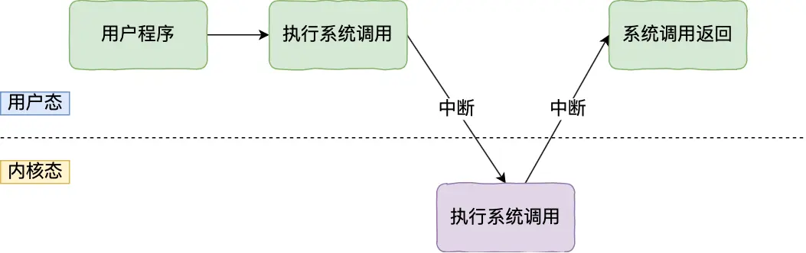

# 计算机操作系统概述

- 编辑：李竹楠
- 日期：2023/12/03

这部分内容主要是对操作系统做一个整体的概述。

- 进程管理：CPU的管理和分配，主要指的是进程管理。
- 内存管理：内存的分配和管理，主要利用了虚拟内存的方式。
- 文件管理：外存（磁盘等）的分配和管理，将外存以文件的形式提供出去。
- 设备管理：对输入/输出设备的统一管理。

除此之外，在这个文件里还对一些概念做出说明和举例，例如什么是内核，以及不同操作系统的内核的比较。

## 1. 内核

什么是内核？

> 计算机是由各种外部硬件设备组成的，比如内存、cpu、硬盘等，如果每个应用都要和这些硬件设备对接通信协议，那这样太累了，所以这个中间人就由内核来负责，**让内核作为应用连接硬件设备的桥梁**，应用程序只需关心与内核交互，不用关心硬件的细节。可以这么说，内核是一个计算机程序，它是操作系统的核心，提供了操作系统最核心的能力，可以控制操作系统中所有的内容。
> 

内核的基本能力有以下四点：

- 管理进程、线程（决定哪个进程、线程使用 CPU）；
- 管理内存（决定内存用来做什么）；
- 连接硬件设备（为进程、和设备间提供通信能力）；
- 提供系统调用（接收进程发送来的系统调用并执行）。

内核时如何工作的？

> 内核具有很高的权限，可以控制 cpu、内存、硬盘等硬件，而应用程序具有的权限很小，因此大多数操作系统，把内存分成了两个区域：
> - 内核空间，这个内存空间只有内核程序可以访问；
> - 用户空间，这个内存空间专门给应用程序使用；
> 用户空间的代码只能访问一个局部的内存空间，而内核空间的代码可以访问所有内存空间。因此，当程序使用用户空间时，我们常说该程序在**用户态**执行，而当程序使内核空间时，程序则在**内核态**执行。
> 应用程序如果需要进入内核空间，就需要通过系统调用，下面来看看系统调用的过程：
> 
> 内核程序执行在内核态，用户程序执行在用户态。当应用程序使用系统调用时，会产生一个中断。发生中断后， CPU 会中断当前在执行的用户程序，转而跳转到中断处理程序，也就是开始执行内核程序。内核处理完后，主动触发中断，把 CPU 执行权限交回给用户程序，回到用户态继续工作。

### 1.1 内核的种类

内核主要有以下四个分类：

- 宏内核（单内核）：Linux，MacOS 8.6 版本之前，Windows 9X 系列
- 微内核：Fuchsia
- 混合内核：Windows XP，Windows 7，Mac OS X
- 外内核

什么是宏内核
> 我们上面说到，内核管理着操作系统的内存，文件，IO，网络等等，每个功能可以看做一个模块，在宏内核中，这些模块都是集成在一起的，运行在内核进程中，模块之间的交互直接通过方法调用。

什么是微内核？
> 而在微内核中，内核只提供最核心的功能，比如任务调度，内存管理等等，其他模块被移出内核，运行在不同的进程中，这样即使某一个模块出现问题，只要重启这个模块的进程即可，不会影响到其他模块，**稳定性大大增加。甚至可以在系统运行过程中替换现有模块的实现**。而且由于模块独立的性质，可以做到模块的按需加载。**但是模块间的相互调用需要通过进程间通信，通信效率相对较低**。

什么是混合内核？
> 混合内核集中了宏内核和微内核的特点，让微内核中的一些核心模块运行在内核中，从而使内核效率更高一些

什么是外内核？
> 外内核是把硬件暴露给应用程序，应用程序可以直接访问硬件，外内核对系统提供保护。目前还在研究阶段。

### 1.2 主流内核的比较

对于主流内核的比较，这里只选择的Linux和Windows，对于一些类Linux或者再次基础上的二次开发操作系统（IOS或Android）后续可以进行补充（如果有时间）。

#### 1.2.1 Linux

Linux 内核设计的理念主要有这几个点：

- MultiTask，多任务
- SMP，对称多处理
- ELF，可执行文件链接格式
- Monolithic Kernel，宏内核

##### 1.2.1.1 MultiTask

MultiTask 的意思是**多任务**，代表着 Linux 是一个多任务的操作系统。多任务意味着可以有多个任务同时执行，这里的同时可以是**并发或并行**：

- 对于单核 CPU 时，可以让每个任务执行一小段时间，时间到就切换另外一个任务，从宏观角度看，一段时间内执行了多个任务，这被称为并发。
- 对于多核 CPU 时，多个任务可以同时被不同核心的 CPU 同时执行，这被称为并行。

##### 1.2.1.2 SMP

SMP 的意思是对称多处理，代表着每个 CPU 的地位是相等的，对资源的使用权限也是相同的，多个 CPU 共享同一个内存，每个 CPU 都可以访问完整的内存和硬件资源。这个特点决定了 Linux 操作系统不会有某个 CPU 单独服务应用程序或内核程序，而是每个程序都可以被分配到任意一个 CPU 上被执行。

##### 1.2.1.3 ELF(Executable and Linkable Format)

ELF 的意思是**可执行文件链接格式**，它是 Linux 操作系统中可执行文件的存储格式，你可以从下图看到它的结构：

ELF 把文件分成了一个个分段，每一个段都有自己的作用，具体每个段的作用这里我就不详细说明了，感兴趣的同学可以去看《程序员的自我修养——链接、装载和库》这本书。

ELF 文件有两种索引:

- Program header table 中记录了运行时所需的段
- Section header table 记录了二进制文件中各个段的首地址。

那 ELF 文件怎么生成的呢？
> 我们编写的代码，首先通过编译器编译成汇编代码，接着通过汇编器变成目标代码，也就是目标文件，最后通过链接器把多个目标文件以及调用的各种函数库链接起来，形成一个可执行文件，也就是ELF文件。

那 ELF 文件是怎么被执行的呢？
> 执行 ELF 文件的时候，会通过装载器把 ELF 文件装载到内存里，CPU 读取内存中的指令和数据，于是程序就被执行起来了。

##### 1.2.1.4 Monolithic Kernel

Monolithic Kernel 的意思是宏内核，Linux 内核架构就是宏内核，意味着 Linux 的内核是一个完整的可执行程序，且拥有最高的权限。

宏内核的特征是系统内核的所有模块，比如进程调度、内存管理、文件系统、设备驱动等，都运行在内核态。

不过，Linux 也实现了动态加载内核模块的功能，例如大部分设备驱动是以可加载模块的形式存在的，与内核其他模块解藕，让驱动开发和驱动加载更为方便、灵活。

#### 1.2.2 Windows

当今 Windows 7、Windows 10 使用的内核叫 Windows NT，NT 全称叫 New Technology。下图是 Windows NT 的结构图片：

Windows 和 Linux 一样，同样支持 MultiTask 和 SMP，但不同的是，Window 的内核设计是**混合型内核**，在上图你可以看到内核中有一个 MicroKernel 模块，这个就是最小版本的内核，而整个内核实现是一个完整的程序，含有非常多模块。Windows 的可执行文件格式叫 PE，称为可移植执行文件，扩展名通常是.exe、.dll、.sys等。PE 的结构你可以从下图中看到，它与 ELF 结构有一点相似。

## 2. 中断

### 2.1 为什么需要中断？

中断其实就是在CPU正在做某件事的时候，收到了通知告诉CPU你要放下手头现在做的事，去处理另一件事（**当然这个是立即处理还是过一会处理以及如何处理取决于中断的类型**）。中断可以提高操作系统运行的效率，有了中断系统才能并发运行。

并发是指单位时间内处理的工作量，比如每秒并发数是100，意思是指1s内CPU处理的请求总量是100个。并行是指同时真正的一起运行，比如并行量100，是指任意瞬间同时有100个请求发送。因此对于单核CPU来说只谈并发，多核CPU才配谈并行。例如，假设你是一个资深vloger，此时你正在对视频进行合成渲染，在等待合成的过程中你同时在整理下一期视频的文案拍摄场景，这在你看来一切理所应当，其实都是中断都在替你负重前行。假设没有中断，视频在合成的时候你啥事也干不了，你只能去泡壶茶躺平等他结束然后开始你的下一步工作，这会极大的降低你的效率。

操作系统本质上就是个死循环，但是这个死循环只是为了保证操作系统周而复始的运行下去，而运行的目的就是为了等待某件事情的发生，当事件（中断）发生时去做响应的工作，**操作系统是中断驱动的**。

对比现实世界，这个中断，其实很好理解。比如我是一个厨子，我现在要做一顿饭，需要烧水、刷锅、切菜、炒菜、煮饭这几个步骤，但是我相信没有人会傻到，把这几件事情一件一件地干完。这样非常浪费时间，我可以把水烧了，就开始去煮饭，等锅在煮的时候，自己去切菜，等水烧开了，然后先把手头的事情放下，那么把水装到水壶里，再去刷锅，然后等这些做完了，在回头去切菜。

### 2.2 外部中断

外部中断是指来自CPU外部的中断，外部的中断源必须是硬件，**因此外部中断又称为硬件中断**。

CPU如何收到来自外部的中断呢？
> 外部中断是通过两根信号线通知CPU的，这两根信号线是INTR和NMI，通过INTR总线进来的是可屏蔽中断，NMI总线进来的是不可屏蔽中断。

可屏蔽中断和不可屏蔽中断的区别是什么？
> - 可屏蔽中断是通过INTR信号线进入CPU，外部硬件设备产生的中断CPU可以理会，可以不理会，因为此类中断不会让操作系统宕机。
> - 不可屏蔽中断是指通过NMI信号线进入CPU，表示系统中出现了致命的错误，此类错误会导致操作系统宕机，因此不可以屏蔽，必须进行响应的处理。

### 2.3 内部中断

常见的有：

- 陷入（trap）：由陷入指令引发，是应用程序故意引发的，比如，read, fork, execve...例如，某应用程序想请求操作系统内核的服务，此时会执行一条特殊的指令——陷入（trap）指令，该指令会引发一个内部中断信号。**系统调用（system call）**，就是通过陷入（trap）指令完成，由外部调用系统接口，完成用户态转化成内核态的状态。
- 故障（fault）：由**错误条件**引起的，可以被错误处理程序纠正并返回正常程序。内核程序修复故障后会把 CPU使用权还给应用程序，让它继续执行下去。例如，缺页故障（Page fault），当软件试图访问已映射在虚拟地址空间中，但是目前并未被加载在物理内存中的一个分页时，由中央处理器的内存管理单元所发出的中断。
- 终止（abort）：由致命错误引起，内核程序无法修复该错误，**因此一般不再将CPU使用权还给引发终止的应用程序，而是直接终止该应用程序**。