# 进程管理

- 编辑：李竹楠
- 日期：2023/12/05

## 1. 进程与线程

### 1.1 进程

非常基础的题目（其实不算题目只是概念），一般除了考试没这么问的，但是还是做下区分比较好，算是对进程的一个串讲。

- 程序：是静态的，是存放在磁盘里的可执行文件，是一系列的指令集合。
- 进程（Process）：是动态的，是程序一次执行过程。同一个程序可能有多个进程。

进程的基本描述信息全部存放在一个**数据结构 PCB（Process Control Block）**中，即**进程控制块**。操作系统需要对各个并发运行的进程进行管理，但凡管理时所需要的信息，都会被放在 PCB 中。

进程是由PCB、程序段和数据段组成。

其中，操作系统对进程管理工作所需的信息都存放在 PCB 中，**PCB 是进程存在的唯一标志**，当进程被创建时，操作系统为其创建 PCB，当进程结束时，会回收其 PCB。总的来说，PCB随着进程的生命周期而存在，里面存放着进程的关键信息，比如：进程标识符 PID，用户标识符 UID，进程当前状态，正在使用哪些文件，正在使用哪些内存区域，正在使用哪些 I/O 设备之类的。

其中，程序段是程序的代码（指令序列），数据段是运行过程中产生的各种数据（如：程序中定义的变量）

**PCB 是给操作系统用的；程序段、数据段是给进程自己用的**

### 1.2 线程

既然有了进程，为什么要引入线程呢？
> 线程是一个**基本的 CPU 执行单元**，也是程序执行流的最小单位。
> 引入线程后，不仅是**进程之间可以并发**，**进程内的各线程之间也可以并发**，从而进一步提升了系统的并发度，使得一个进程内也可以并发处理各种任务（如 QQ视频、文字聊天，传文件等等）
> 引入线程后，**进程只作为除 CPU 之外的系统资源的分配单元**（如打印机、内存地址空间等都是分配给进程的）；**线程作为处理机的分配单元**
> 举一个例子：之前参加的嵌入式比赛中，需要对机器人进行操控并执行任务。比赛要求是任务做的又快又准，这就要求机器人需要尽可能的多做任务。一个机器人可以看作一个进程，需要处理的任务有控制步进电机、控制摄像头转向并拍照、执行图像识别任务等等。以上任务就需要多线程进行同时执行，一个线程通过控制步进电机驱动机器人前进，一个线程通过控制摄像头拍照等等。另外，还有一个进程作为守护进程。最后，比完赛后需要交接给下一届，学弟问我为什么不用多进程，而是用的一个进程开多个线程。我的回答是，控制系统是基于安卓系统的，一般来说一个应用启动就是一个进程启动（当然，守护进程和通讯进程另说）。进程间的通信相对复杂，所以就选择了进程间交互。而且，我们的任务要求并发执行，要求机器人一边动任务一边执行，所以，综合考虑还是使用线程。由应用进程获得被分配的系统资源，然后用线程作为占用CPU的基本单元去做其中的具体的任务（控制页面的主线程、通信线程、图像识别线程等等）。

引入线程后有了哪些变化（上面我跟学弟讲的举的例子看不懂可以看这里，我为什么要使用线程而不是进程）？
> - 资源分配、调度：传统进程机制中，进程是资源分配、调度的基本单位；引入线程后，进程是资源分配的基本单位，线程是调度的基本单位
> - 并发性：传统进程机制中，只能进程间并发；引入线程后，各线程之间也能并发，提升了并发度
> - 系统开销：传统的进程间并发，需要切换进程的运行环境，系统开销很大；线程间并发，如果是同一个进程内的线程切换，则不需要切换进程环境，系统开销小

#### 1.2.1 线程的实现

主要有三种线程的实现方式：

- 用户线程（User Thread）：在用户空间实现的线程，不是由内核管理的线程，是由用户态的线程库来完成线程的管理
- 内核线程（Kernel Thread）：在内核中实现的线程，是由内核管理的线程
- 轻量级进程（LightWeight Process）：在内核中来支持用户线程

用户线程如何理解？存在什么优势和缺陷？
> 用户线程是基于用户态的线程管理库来实现的，那么线程控制块（Thread Control Block, TCB） 也是在库里面来实现的，对于操作系统而言是看不到这个 TCB 的，它只能看到整个进程的 PCB。所以，**用户线程的整个线程管理和调度，操作系统是不直接参与的，而是由用户级线程库函数来完成线程的管理，包括线程的创建、终止、同步和调度等**。
> 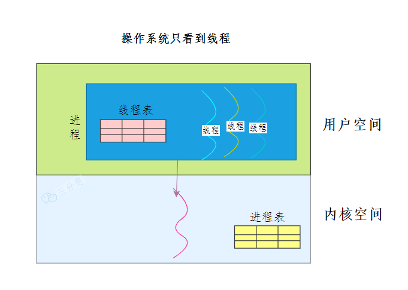
> 优势： 
>    1. 每个进程都需要有它私有的线程控制块（TCB）列表，用来跟踪记录它各个线程状态信息（PC、栈指针、寄存器），TCB 由用户级线程库函数来维护，可用于不支持线程技术的操作系统；
>    2. **用户线程的切换也是由线程库函数来完成的，无需用户态与内核态的切换，所以速度特别快**；
>
> 缺陷：
>   1. 由于操作系统不参与线程的调度，如果一个线程发起了系统调用而阻塞，那进程所包含的用户线程都不能执行了
>   2. 由于时间片分配给进程，故与其他进程比，在多线程执行时，每个线程得到的时间片较少，执行会比较慢

内核线程如何理解？存在什么优势和缺陷？
> **内核线程是由操作系统管理的，线程对应的TCB自然是放在操作系统里的，这样线程的创建、终止和管理都是由操作系统负责**。
> 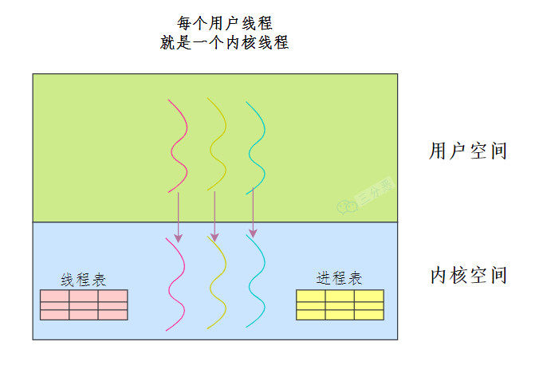
> 优势：
>   1. 在一个进程当中，如果某个内核线程发起系统调用而被阻塞，并不会影响其他内核线程的运行
>   2. 分配给线程，多线程的进程获得更多的 CPU 运行时间
>
> 缺陷：
>   1. 在支持内核线程的操作系统中，由内核来维护进程和线程的上下文信息，如 PCB 和 TCB
>   2. 线程的创建、终止和切换都是通过系统调用的方式来进行，因此对于系统来说，系统开销比较大

轻量级进程如何理解？存在什么优势和缺陷？
> 现代操作系统基本都是将两种方式结合起来使用。**用户态的执行负责进程内部线程在非阻塞时的切换**；**内核态的执行负责阻塞线程的切换**。即我们同时实现内核态和用户态线程管理。其中内核态线程数量较少，而用户态线程数量较多。每个内核态线程可以服务一个或多个用户态线程。
> 

### 1.3 两者区别

- 拥有资源：
进程是资源分配的基本单位，但是线程不拥有资源，线程可以访问隶属进程的资源。
- 调度：
线程是独立调度的基本单位，在同一进程中，线程的切换不会引起进程切换，从一个进程中的线程切换到另一个进程中的线程时，会引起进程切换。
- 系统开销：
由于创建或撤销进程时，系统都要为之分配或回收资源，如内存空间、I/O 设备等，所付出的开销远大于创建或撤销线程时的开销。类似地，在进行进程切换时，涉及当前执行进程 CPU 环境的保存及新调度进程 CPU 环境的设置，而线程切换时只需保存和设置少量寄存器内容，开销很小。
- 通信方面：
线程间可以通过直接读写同一进程中的数据进行通信，但是进程通信需要借助 IPC。

## 2. 进程状态与切换

首先要明确两个概念，并发和并行有什么区别：

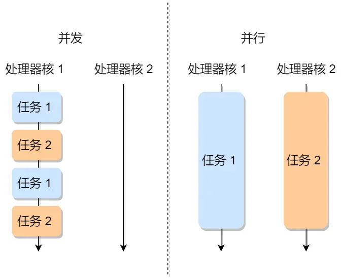

> 举个例子：假如你在吃饭，接到一个电话。如果，你只能吃饭完后接电话，那么就是没有并发也没有并行；如果吃一口说一句，那么就是并发，因为你可以一张嘴倒腾两个任务；如果有两张嘴一张吃饭，一张接电话，那么就是并行，因为这两个任务在两个嘴里同时进行，就不用抢占一个嘴做任务。在这个例子中，嘴就是处理核。

进程有以下几种状态：

- 运行状态（Running）：该时刻进程占用 CPU；
- 就绪状态（Ready）：可运行，由于其他进程处于运行状态而暂时停止运行；
- 阻塞状态（Blocked）：该进程正在等待某一事件发生（如等待输入/输出操作的完成）而暂时停止运行，这时，即使给它CPU控制权，它也无法运行；
- 创建状态（new）：进程正在被创建时的状态；
- 结束状态（Exit）：进程正在从系统中消失时的状态；


详细说明一下进程的状态变迁：

1. NULL -> 创建状态：一个新进程被创建时的第一个状态；
2. 创建状态 -> 就绪状态：当进程被创建完成并初始化后，一切就绪准备运行时，变为就绪状态，这个过程是很快的；
3. 就绪态 -> 运行状态：处于就绪状态的进程被操作系统的进程调度器选中后，就分配给 CPU 正式运行该进程；
4. 运行状态 -> 结束状态：当进程已经运行完成或出错时，会被操作系统作结束状态处理；
5. 运行状态 -> 就绪状态：处于运行状态的进程在运行过程中，由于分配给它的运行时间片用完，操作系统会把该进程变为就绪态，接着从就绪态选中另外一个进程运行；
6. 运行状态 -> 阻塞状态：当进程请求某个事件且必须等待时，例如请求 I/O 事件；
7. 阻塞状态 -> 就绪状态：当进程要等待的事件完成时，它从阻塞状态变到就绪状态；

如果有大量处于阻塞状态的进程，进程可能会占用着物理内存空间，显然不是我们所希望的，毕竟物理内存空间是有限的，被阻塞状态的进程占用着物理内存就一种浪费物理内存的行为。所以，在虚拟内存管理的操作系统中，通常会把阻塞状态的进程的物理内存空间换出到硬盘，等需要再次运行的时候，再从硬盘换入到物理内存。那么，就需要一个新的状态，来**描述进程没有占用实际的物理内存空间的情况，这个状态就是挂起状态**。这跟阻塞状态是不一样，阻塞状态是等待某个事件的返回。另外，挂起状态可以分为两种：

8. 阻塞挂起状态：进程在外存（硬盘）并等待某个事件的出现；
9. 就绪挂起状态：进程在外存（硬盘），但只要进入内存，即刻立刻运行；


导致进程挂起的原因不只是因**为进程所使用的内存空间不在物理内存**，还包括如下情况：

- 通过 sleep 让进程间歇性挂起，其工作原理是设置一个定时器，到期后唤醒进程
- 用户希望挂起一个程序的执行，比如在 Linux 中用 Ctrl+Z 挂起进程

我们了解了进程的状态变迁和进程的数据结构 PCB 后，再来看看进程的创建、终止、阻塞、唤醒的过程，这些过程也就是进程的控制。

1. **创建进程**：操作系统允许一个进程创建另一个进程，而且允许子进程继承父进程所拥有的资源。创建进程的过程如下：
    1. 申请一个空白的 PCB，并向 PCB 中填写一些控制和管理进程的信息，比如进程的唯一标识等
    2. 为该进程分配运行时所必需的资源，比如内存资源
    3. 将 PCB 插入到就绪队列，等待被调度运行
2. **终止进程**：进程可以有 3 种终止方式：正常结束、异常结束以及外界干预（信号 kill 掉）。当子进程被终止时，其在父进程处继承的资源应当还给父进程。而当父进程被终止时，该父进程的子进程就变为**孤儿进程**，会被 1 号进程收养，并由 1 号进程对它们完成状态收集工作。终止进程的过程如下：
    1. 查找需要终止的进程的 PCB
    2. 如果处于执行状态，则立即终止该进程的执行，然后将 CPU 资源分配给其他进程
    3. 如果其还有子进程，则应将该进程的子进程交给 1 号进程接管
    4. 将该进程所拥有的全部资源都归还给操作系统
    5. 将其从 PCB 所在队列中删除
3. **阻塞进程**：当进程需要等待某一事件完成时，它可以调用阻塞语句把自己阻塞等待。而一旦被阻塞等待，它只能由另一个进程唤醒。阻塞进程的过程如下：
    1. 找到将要被阻塞进程标识号对应的 PCB
    2. 如果该进程为运行状态，则保护其现场，将其状态转为阻塞状态，停止运行
    3. 将该PCB插入到阻塞队列中去
4. **唤醒进程**：进程由运行转变为阻塞状态是由于进程必须等待某一事件的完成，所以处于阻塞状态的进程是绝对不可能叫醒自己的。如果某进程正在等待 I/O 事件，需由别的进程发消息给它，则只有当该进程所期待的事件出现时，才由发现者进程用唤醒语句叫醒它。唤醒进程的过程如下：
    1. 在该事件的阻塞队列中找到相应进程的 PCB
    2. 将其从阻塞队列中移出，并置其状态为就绪状态
    3. 把该PCB插入到就绪队列中，等待调度程序调度

## 3. 上下文切换

各个进程之间是共享 CPU 资源的，在不同的时候进程之间需要切换，让不同的进程可以在 CPU 执行，那么这个**一个进程切换到另一个进程运行，称为进程的上下文切换**。

在详细说进程上下文切换前，首先要了解CPU是如何进行上下文切换的？
> 大多数操作系统都是多任务，通常支持大于 CPU 数量的任务同时运行。实际上，这些任务并不是同时运行的，只是因为系统在很短的时间内，让各个任务分别在 CPU 运行，于是就造成同时运行的错觉。任务是交给 CPU 运行的，那么在每个任务运行前，CPU 需要知道任务从哪里加载，又从哪里开始运行。所以，操作系统需要事先帮 CPU 设置好 CPU **寄存器和程序计数器**，并且在运行任何任务前，所以依赖的环境叫做**CPU上下文**。
切换CPU的上下文就是先把前一个任务的 CPU 上下文（CPU 寄存器和程序计数器）保存起来，然后加载新任务的上下文到这些寄存器和程序计数器，最后再跳转到程序计数器所指的新位置，运行新任务。系统内核会存储保持下来的上下文信息，当此任务再次被分配给 CPU 运行时，CPU 会重新加载这些上下文，这样就能保证任务原来的状态不受影响，让任务看起来还是连续运行。

上文所提到的“任务”主要包括进程、线程和中断。所以，根据任务不同，把CPU上下文切换分成：**进程上下文切换**、**线程上下文切换**和**中断上下文切换**。

### 3.1 进程的上下文切换

进程是由内核管理和调度的，所以进程的切换只能发生在内核态。所以，**进程的上下文切换不仅包含了虚拟内存、栈、全局变量等用户空间的资源，还包括了内核堆栈、寄存器等内核空间的资源。**

通常，会把交换的信息保存在进程的 PCB，当要运行另外一个进程的时候，我们需要从这个进程的 PCB 取出上下文，然后恢复到 CPU 中，这使得这个进程可以继续执行，如下图所示：


大家需要注意，进程的上下文开销是很关键的，我们希望它的开销越小越好，这样可以使得进程可以把更多时间花费在执行程序上，而不是耗费在上下文切换。

发生进程上下文切换有哪些场景？
> - 时间片结束：为了保证所有进程可以得到公平调度，CPU 时间被划分为一段段的时间片，这些时间片再被轮流分配给各个进程。这样，当某个进程的时间片耗尽了，进程就从运行状态变为就绪状态，系统从就绪队列选择另外一个进程运行
> - 等待资源：进程在系统资源不足（比如内存不足）时，要等到资源满足后才可以运行，这个时候进程也会被挂起，并由系统调度其他进程运行
> - 代码实现：当进程通过睡眠函数```sleep```这样的方法将自己主动挂起时，自然也会重新调度
> - 优先级：当有优先级更高的进程运行时，为了保证高优先级进程的运行，当前进程会被挂起，由高优先级进程来运行
> - 硬件中断：发生硬件中断时，CPU上的进程会被中断挂起，转而执行内核中的中断服务程序

### 3.2 线程的上下文切换

线程与进程最大的区别在于：**线程是调度的基本单位，而进程则是资源拥有的基本单位**。所以，所谓操作系统的任务调度，实际上的调度对象是线程，而进程只是给线程提供了虚拟内存、全局变量等资源。

为什么线程的上下文切换比进程的资源开销小？
> - 当两个线程不是属于同一个进程，则切换的过程就跟进程上下文切换一样，这种情况下资源开销并没有什么区别
> - **当两个线程是属于同一个进程，因为虚拟内存是共享的，所以在切换时，虚拟内存这些资源就保持不动，只需要切换线程的私有数据、寄存器等不共享的数据**
> 
> 所以，线程的上下文切换相比进程，开销要小很多。

## 3. 进程调度

进程都希望自己能够占用 CPU 进行工作，那么这涉及到前面说过的进程上下文切换。一旦操作系统把进程切换到运行状态，也就意味着该进程占用着 CPU 在执行，但是当操作系统把进程切换到其他状态时，那就不能在 CPU 中执行了，于是操作系统会选择下一个要运行的进程。选择一个进程运行这一功能是在操作系统中完成的，通常称为调度程序（scheduler）。

### 3.1 调度时机

在进程的生命周期中，当进程从一个运行状态到另外一状态变化的时候，其实会触发一次调度。例如以下：

- **就绪态 -> 运行态**：当进程被创建时，会进入到就绪队列，操作系统会从就绪队列选择一个进程运行；
- **运行态 -> 阻塞态**：当进程发生 I/O 事件而阻塞时，操作系统必须选择另外一个进程运行；
- **运行态 -> 结束态**：当进程退出结束后，操作系统得从就绪队列选择另外一个进程运行；

因为，这些状态变化的时候，操作系统需要考虑是否要让新的进程给 CPU 运行，或者是否让当前进程从 CPU 上退出来而换另一个进程运行。

另外，如果硬件时钟提供某个频率的周期性中断，那么可以根据如何处理时钟中断 ，把调度算法分为两类：

- **非抢占式调度算法**挑选一个进程，然后让该进程运行直到被阻塞，或者直到该进程退出，才会调用另外一个进程，也就是说不会理时钟中断这个事情。
- **抢占式调度算法**挑选一个进程，然后让该进程只运行某段时间，如果在该时段结束时，该进程仍然在运行时，则会把它挂起，接着调度程序从就绪队列挑选另外一个进程。这种抢占式调度处理，需要在时间间隔的末端发生时钟中断，以便把CPU控制返回给调度程序进行调度，也就是常说的时间片机制。

### 3.2 调度原则

- 提高CPU利用率，在这种发送 I/O 事件致使 CPU 空闲的情况下，调度程序需要从就绪队列中选择一个进程来运行
- 提高系统的吞吐率，调度程序要权衡长任务和短任务进程的运行完成数量
- 降低周转时间，从进程开始到结束的过程中，实际上是包含两个时间，分别是进程运行时间和进程等待时间，这两个时间总和就称为周转时间。进程的周转时间越小越好，如果进程的等待时间很长而运行时间很短，那周转时间就很长，这不是我们所期望的，调度程序应该避免这种情况发生
- 降低等待时间，处于就绪队列的进程，也不能等太久，当然希望这个等待的时间越短越好，这样可以使得进程更快的在 CPU 中执行。所以，就绪队列中进程的等待时间也是调度程序所需要考虑的原则
- 降低响应时间，对于交互式比较强的应用，响应时间也是调度程序需要考虑的原则

目的就是要使得进程要**快**。

### 3.3 调度算法

#### 3.3.1 先来先服务(First Come First Serve, FCFS)

最简单的调度算法就是非抢占式的先来先服务算法了。顾名思义，先来后到，每次从就绪队列选择最先进入队列的进程，然后一直运行，直到进程退出或被阻塞，才会继续从队列中选择第一个进程接着运行。

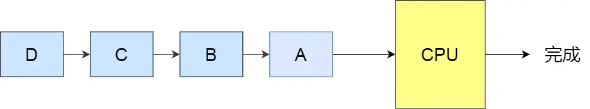

**这似乎很公平，但是当一个长作业先运行了，那么后面的短作业等待的时间就会很长，不利于短作业。FCFS 对长作业有利，适用于 CPU 繁忙型作业的系统，而不适用于 I/O 繁忙型作业的系统。**

#### 3.3.2 最短作业优先(Shortest Job First, SJF)

最短作业优先调度算法同样也是顾名思义，它会优先选择运行时间最短的进程来运行，这有助于**提高系统的吞吐量**。

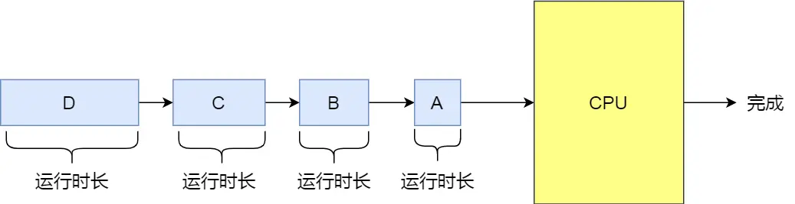

这显然对长作业不利，很容易造成一种极端现象。比如，一个长作业在就绪队列等待运行，而这个就绪队列有非常多的短作业，那么就会**使得长作业不断的往后推，周转时间变长**，致使长作业长期不会被运行。

#### 3.3.3 高响应比优先(Highest Response Ratio Next, HRRN)

前面的先来先服务调度算法和最短作业优先调度算法都没有很好的权衡短作业和长作业。那么，高响应比优先度算法主要是权衡了短作业和长作业。每次进行进程调度时，先计算响应比优先级，然后把响应比优先级最高的进程投入运行，响应比优先级的计算公式：

$$priority = \frac {time_{wait} + time_{service}} {time_{service}}$$

从上面的公式，可以发现：

- 如果两个进程的等待时间相同时，要求的服务时间越短，响应比就越高，这样短作业的进程容易被选中运行
- 如果两个进程要求的服务时间相同时，等待时间越长，响应比就越高，这就兼顾到了长作业进程，因为进程的响应比可以随时间等待的增加而提高，当其等待时间足够长时，其响应比便可以升到很高，从而获得运行的机会

> 由于要求服务时间是不可预估的，所以高响应比优先调度算法是理想型算法，现实中是实现不了的。

#### 3.3.4 时间片轮转(Round Robin, RR)

最古老、最简单、最公平且使用最广的算法就是时间片轮转调度算法。每个进程被分配一个时间段，称为时间片（Quantum），即允许该进程在该时间段中运行。

- 如果时间片用完，进程还在运行，那么将会把此进程从 CPU 释放出来，并把 CPU 分配给另外一个进程；
- 如果该进程在时间片结束前阻塞或结束，则 CPU 立即进行切换；


另外，时间片的长度就是一个很关键的点：

- 如果时间片设得太**短**会导致过多的进程上下文切换，**降低了 CPU 效率**；
- 如果设得太**长**又可能引起对短作业进程的**响应时间变长**

一般来说，时间片设为```20ms~50ms```通常是一个比较合理的折中值。

#### 3.3.5 最高优先级(Highest Priority First, HPF)

前面的时间片轮转算法做了个假设，即让所有的进程同等重要，也不偏袒谁，大家的运行时间都一样。但是，对于多用户计算机系统就有不同的看法了，它们希望调度是有优先级的，即**希望调度程序能从就绪队列中选择最高优先级的进程进行运行**，这称为最高优先级调度算法。

进程的优先级可以分为，静态优先级和动态优先级：

- 静态优先级：创建进程时候，就已经确定了优先级了，然后整个运行时间优先级都不会变化；
- 动态优先级：根据进程的动态变化调整优先级，比如如果进程运行时间增加，则降低其优先级，如果进程等待时间（就绪队列的等待时间）增加，则升高其优先级，也就是随着时间的推移增加等待进程的优先级。

该算法也有两种处理优先级高的方法，非抢占式和抢占式：

- 非抢占式：当就绪队列中出现优先级高的进程，运行完当前进程，再选择优先级高的进程。
- 抢占式：当就绪队列中出现优先级高的进程，当前进程挂起，调度优先级高的进程运行。

**但是依然有缺点，可能会导致低优先级的进程永远不会运行**。

#### 3.3.6 多级反馈队列(Multilevel Feedback Queue, MFQ)

多级反馈队列调度算法是时间片轮转算法和最高优先级算法的综合和发展。

顾名思义：

- 多级表示有多个队列，每个队列优先级从高到低，同时优先级越高时间片越短。
- 反馈表示如果有新的进程加入优先级高的队列时，立刻停止当前正在运行的进程，转而去运行优先级高的队列；


如何工作的：
> 1. 设置了多个队列，赋予每个队列不同的优先级，每个队列优先级从高到低，同时优先级越高时间片越短；
> 2. 新的进程会被放入到第一级队列的末尾，按先来先服务的原则排队等待被调度，如果在第一级队列规定的时间片没运行完成，则将其转入到第二级队列的末尾，以此类推，直至完成；
> 3. 当较高优先级的队列为空，才调度较低优先级的队列中的进程运行。如果进程运行时，有新进程进入较高优先级的队列，则停止当前运行的进程并将其移入到原队列末尾，接着让较高优先级的进程运行；
> 
> 可以发现，对于短作业可能可以在第一级队列很快被处理完。对于长作业，如果在第一级队列处理不完，可以移入下次队列等待被执行，虽然等待的时间变长了，但是运行时间也变更长了，所以该算法**很好的兼顾了长短作业，同时有较好的响应时间**。

## 4. 进程通信

每个进程的用户地址空间都是独立的，一般而言是不能互相访问的，但内核空间是每个进程都共享的，所以进程之间要通信必须通过内核。

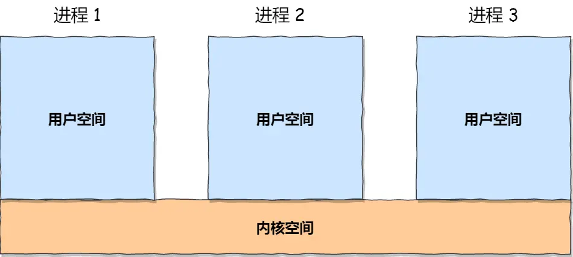

以下的实例都是基于Linux系统。

### 4.1 管道

如果学过Linux，应该非常熟悉```|```符号。

``` shell
$ ps auxf | grep mysql
```

上面的命令中```|```符号就是一个管道。它的功能是将前一个命令```ps auxf```的输出作为后一个命令```grep mysql```的输入，从这功能描述，可以看出**管道传输数据是单向的，如果想相互通信，我们需要创建两个管道才行**。同时，我们得知上面这种管道是没有名字，所以```|```表示的管道称为**匿名管道**，用完了就销毁。

管道还有另外一个类型是**命名管道**，也被叫做FIFO，因为数据是**先进先出**的传输方式。在使用命名管道前，先需要通过```mkfifo```命令来创建，并且指定管道名字：

``` shell
$ mkfifo myPipe
```

myPipe就是这个管道的名称。基于 Linux 一切皆文件的理念，所以管道也是以文件的方式存在，我们可以用```ls```看一下，这个文件的类型是```p```，也就是pipe（管道）的意思：

``` shell
$ ls -l
prw-r--r--. 1 root    root         0 Dec 06 02:45 myPipe
```

接下来，我们往 myPipe 这个管道写入数据：

``` shell
$ echo "hello" > myPipe  // 将数据写进管道
                         // 停住了 ...
```

你操作了后，你会发现命令执行后就停在这了，这是因为管道里的内容没有被读取，只有当管道里的数据被读完后，命令才可以正常退出。于是，我们执行另外一个命令来读取这个管道里的数据：

``` shell
$ cat < myPipe  // 读取管道里的数据
hello
```
可以看到，管道里的内容被读取出来了，并打印在了终端上，另外一方面，echo那个命令也正常退出了。

我们可以看出，**管道这种通信方式效率低，不适合进程间频繁地交换数据**。当然，**它的好处，自然就是简单，同时也我们很容易得知管道里的数据已经被另一个进程读取了**。

#### 4.1.1 管道原理

匿名管道的创建，需要通过下面这个系统调用：

``` c
int pipe(int fd[2])
```

这里表示创建一个匿名管道，并返回了两个描述符，一个是管道的读取端描述符```fd[0]```，另一个是管道的写入端描述符```fd[1]```。注意，这个匿名管道是特殊的文件，只存在于内存，不存于文件系统中。


其实，**所谓的管道，就是内核里面的一串缓存**。从管道的一段写入的数据，实际上是缓存在内核中的，另一端读取，也就是从内核中读取这段数据。另外，管道传输的数据是无格式的流且大小受限。

看到这，你可能会有疑问了，这两个描述符都是在一个进程里面，并没有起到进程间通信的作用，怎么样才能使得管道是跨过两个进程的呢？

我们可以使用```fork```创建子进程，**创建的子进程会复制父进程的文件描述符**，这样就做到了两个进程各有两个```fd[0]```与```fd[1]```，两个进程就可以通过各自的```fd```写入和读取同一个管道文件实现跨进程通信了。


管道只能一端写入，另一端读出，所以上面这种模式容易造成混乱，因为父进程和子进程都可以同时写入，也都可以读出。那么，为了避免这种情况，通常的做法是：

- 父进程关闭读取的```fd[0]```，只保留写入的```fd[1]```；
- 子进程关闭写入的```fd[1]```，只保留读取的```fd[0]```；

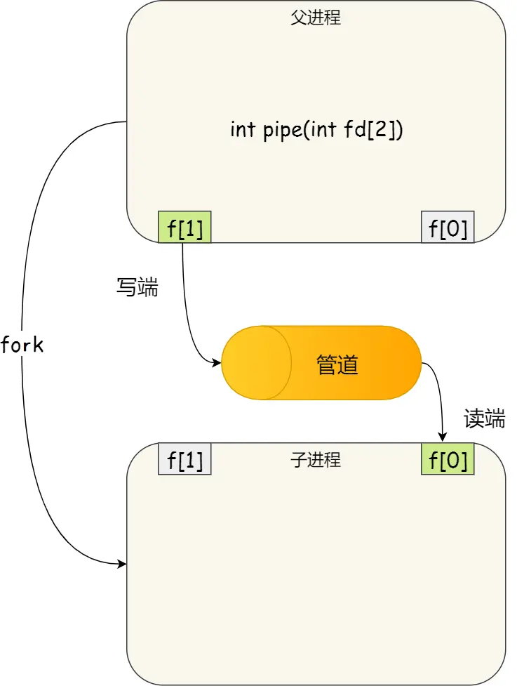

所以说如果需要双向通信，则应该**创建两个管道**。

到这里，我们仅仅解析了使用管道进行父进程与子进程之间的通信，但是在我们shell里面并不是这样的。在 shell里面执行```A | B```命令的时候，A 进程和 B 进程都是 shell 创建出来的子进程，A 和 B 之间不存在父子关系，它俩的父进程都是 shell。


所以说，在 shell 里通过```|```匿名管道将多个命令连接在一起，实际上也就是创建了多个子进程，那么在我们编写 shell 脚本时，**能使用一个管道搞定的事情，就不要多用一个管道，这样可以减少创建子进程的系统开销**。

我们可以得知，对于**匿名管道，它的通信范围是存在父子关系的进程**。因为管道没有实体，也就是没有管道文件，只能通过 fork 来复制父进程 fd 文件描述符，来达到通信的目的。另外，**对于命名管道，它可以在不相关的进程间也能相互通信**。因为命令管道，提前创建了一个类型为管道的设备文件，在进程里只要使用这个设备文件，就可以相互通信。

不管是匿名管道还是命名管道，进程写入的数据都是缓存在内核中，另一个进程读取数据时候自然也是从内核中获取，同时通信数据都遵循**先进先出**原则，不支持```lseek```之类的文件定位操作。

### 4.2 消息队列

前面说到管道的通信方式是效率低的，因此管道不适合进程间频繁地交换数据。

对于这个问题，消息队列的通信模式就可以解决。比如，A 进程要给 B 进程发送消息，A 进程把数据放在对应的消息队列后就可以正常返回了，B 进程需要的时候再去读取数据就可以了。同理，B 进程要给 A 进程发送消息也是如此。消息队列是保存在内核中的消息链表，在发送数据时，会分成一个一个独立的数据单元，也就是消息体（数据块），消息体是用户自定义的数据类型，消息的发送方和接收方要约定好消息体的数据类型，**所以每个消息体都是固定大小的存储块，不像管道是无格式的字节流数据**。如果进程从消息队列中读取了消息体，内核就会把这个消息体删除。**消息队列生命周期随内核，如果没有释放消息队列或者没有关闭操作系统，消息队列会一直存在，而前面提到的匿名管道的生命周期，是随进程的创建而建立，随进程的结束而销毁**。消息这种模型，两个进程之间的通信就像平时发邮件一样，你来一封，我回一封，可以频繁沟通了。

但邮件的通信方式存在不足的地方有两点，**一是通信不及时，二是附件也有大小限制**，这同样也是消息队列通信不足的点。

**消息队列不适合比较大数据的传输**，因为在内核中每个消息体都有一个最大长度的限制，同时所有队列所包含的全部消息体的总长度也是有上限。在 Linux 内核中，会有两个宏定义```MSGMAX```和 ```MSGMNB```，它们以字节为单位，分别定义了一条消息的最大长度和一个队列的最大长度。

**消息队列通信过程中，存在用户态与内核态之间的数据拷贝开销**，因为进程写入数据到内核中的消息队列时，会发生从用户态拷贝数据到内核态的过程，同理另一进程读取内核中的消息数据时，会发生从内核态拷贝数据到用户态的过程。

### 4.3 共享内存

消息队列的读取和写入的过程，**都会有发生用户态与内核态之间的消息拷贝过程（用户态和内核态之间转换开销大）**。那共享内存的方式，就很好的解决了这一问题。

现代操作系统，对于内存管理，采用的是虚拟内存技术，也就是每个进程都有自己独立的虚拟内存空间，不同进程的虚拟内存映射到不同的物理内存中。所以，即使进程 A 和 进程 B 的虚拟地址是一样的，其实访问的是不同的物理内存地址，对于数据的增删查改互不影响。

**共享内存的机制，就是拿出一块虚拟地址空间来，映射到相同的物理内存中**。这样这个进程写入的东西，另外一个进程马上就能看到了，都不需要拷贝来拷贝去，传来传去，大大提高了进程间通信的速度。


这样这个进程写⼊的东西，另外的进程⻢上就能看到。共享内存是最快的 IPC方式，它是针对其他进程间通信方式运行效率低而专门设计的。它往往与其他通信机制，如信号量，配合使用，来实现进程间的同步和通信。

### 4.4 信号量

用了共享内存通信方式，带来新的问题，**那就是如果多个进程同时修改同一个共享内存，很有可能就冲突了**。例如两个进程都同时写一个地址，那先写的那个进程会发现内容被别人覆盖了。

为了防止多进程竞争共享资源，而造成的数据错乱，所以需要保护机制，使得共享的资源，在任意时刻只能被一个进程访问。正好，信号量就实现了这一保护机制。

**信号量其实是一个整型的计数器，主要用于实现进程间的互斥与同步，而不是用于缓存进程间通信的数据。**

信号量表示资源的数量，控制信号量的方式有两种原子操作：

- P操作，这个操作会把信号量减去 1，相减后如果信号量 < 0，则表明资源已被占用，进程需阻塞等待；相减后如果信号量 >= 0，则表明还有资源可使用，进程可正常继续执行。
- V操作，这个操作会把信号量加上 1，相加后如果信号量 <= 0，则表明当前有阻塞中的进程，于是会将该进程唤醒运行；相加后如果信号量 > 0，则表明当前没有阻塞中的进程；

P 操作是用在进入共享资源之前，V 操作是用在离开共享资源之后，这两个操作是必须成对出现的。接下来，举个例子，如果要使得两个进程互斥访问共享内存，我们可以初始化信号量为 1。


具体的过程如下：
>   1. 进程 A 在访问共享内存前，先执行了 P 操作，由于信号量的初始值为 1，故在进程 A 执行 P 操作后信号量变为 0，表示共享资源可用，于是进程 A 就可以访问共享内存。
>   2. 若此时，进程 B 也想访问共享内存，执行了 P 操作，结果信号量变为了 -1，这就意味着临界资源已被占用，因此进程 B 被阻塞。
>   3. 直到进程 A 访问完共享内存，才会执行 V 操作，使得信号量恢复为 0，接着就会唤醒阻塞中的线程 B，使得进程 B 可以访问共享内存，最后完成共享内存的访问后，执行 V 操作，使信号量恢复到初始值 1。

可以发现，信号初始化为 1，就代表着是**互斥信号量**，它可以保证共享内存在任何时刻只有一个进程在访问，这就很好的保护了共享内存。

另外，在多进程里，每个进程并不一定是顺序执行的，它们基本是以各自独立的、不可预知的速度向前推进，但有时候我们又希望多个进程能密切合作，以实现一个共同的任务。例如，进程 A 是负责生产数据，而进程 B 是负责读取数据，这两个进程是相互合作、相互依赖的，进程 A 必须先生产了数据，进程 B 才能读取到数据，所以执行是有前后顺序的。那么这时候，就可以用信号量来实现多进程同步的方式，我们可以初始化信号量为 0。


具体的过程如下：
>   1. 如果进程 B 比进程 A 先执行了，那么执行到 P 操作时，由于信号量初始值为 0，故信号量会变为 -1，表示进程 A 还没生产数据，于是进程 B 就阻塞等待；
>   2. 接着，当进程 A 生产完数据后，执行了 V 操作，就会使得信号量变为 0，于是就会唤醒阻塞在 P 操作的进程 B；
>   3. 最后，进程 B 被唤醒后，意味着进程 A 已经生产了数据，于是进程 B 就可以正常读取数据了。

可以发现，信号初始化为 0，就代表着是**同步信号量**，它可以保证进程 A 应在进程 B 之前执行。

### 4.5 信号

上面说的进程间通信，都是常规状态下的工作模式。**对于异常情况下的工作模式，就需要用信号的方式来通知进程**。

信号跟信号量虽然名字相似度 66.66%，但两者用途完全不一样，就好像 Java 和 JavaScript 的区别。

在 Linux 操作系统中， 为了响应各种各样的事件，提供了几十种信号，分别代表不同的意义。我们可以通过```kill -l```命令，查看所有的信号：

``` shell
$ kill -l
 1) SIGHUP       2) SIGINT       3) SIGQUIT      4) SIGILL       5) SIGTRAP
 6) SIGABRT      7) SIGBUS       8) SIGFPE       9) SIGKILL     10) SIGUSR1
11) SIGSEGV     12) SIGUSR2     13) SIGPIPE     14) SIGALRM     15) SIGTERM
16) SIGSTKFLT   17) SIGCHLD     18) SIGCONT     19) SIGSTOP     20) SIGTSTP
21) SIGTTIN     22) SIGTTOU     23) SIGURG      24) SIGXCPU     25) SIGXFSZ
26) SIGVTALRM   27) SIGPROF     28) SIGWINCH    29) SIGIO       30) SIGPWR
31) SIGSYS      34) SIGRTMIN    35) SIGRTMIN+1  36) SIGRTMIN+2  37) SIGRTMIN+3
38) SIGRTMIN+4  39) SIGRTMIN+5  40) SIGRTMIN+6  41) SIGRTMIN+7  42) SIGRTMIN+8
43) SIGRTMIN+9  44) SIGRTMIN+10 45) SIGRTMIN+11 46) SIGRTMIN+12 47) SIGRTMIN+13
48) SIGRTMIN+14 49) SIGRTMIN+15 50) SIGRTMAX-14 51) SIGRTMAX-13 52) SIGRTMAX-12
53) SIGRTMAX-11 54) SIGRTMAX-10 55) SIGRTMAX-9  56) SIGRTMAX-8  57) SIGRTMAX-7
58) SIGRTMAX-6  59) SIGRTMAX-5  60) SIGRTMAX-4  61) SIGRTMAX-3  62) SIGRTMAX-2
63) SIGRTMAX-1  64) SIGRTMAX
```

运行在 shell 终端的进程，我们可以通过键盘输入某些组合键的时候，给进程发送信号。例如：

- Ctrl+C 产生```SIGTERM```信号，表示终止该进程；
- Ctrl+Z 产生```SIGTSTP```信号，表示停止该进程，但还未结束；

如果进程在后台运行，可以通过```kill```命令的方式给进程发送信号，但前提需要知道运行中的进程```PID```号，例如：```kill -9 1050```，表示给```PID```为```1050```的进程发送```SIGKILL```信号，用来立即结束该进程；所以，信号事件的来源主要有硬件来源（如键盘Cltr+C）和软件来源（如```kill```命令）。

信号是进程间通信机制中唯一的**异步通信机制**，因为可以在任何时候发送信号给某一进程，一旦有信号产生，我们就有下面这几种用户进程对信号的处理方式。

1. 执行默认操作。Linux 对每种信号都规定了默认操作，例如，上面列表中的```SIGTERM```信号，就是终止进程的意思。
2. 捕捉信号。我们可以为信号定义一个信号处理函数。当信号发生时，我们就执行相应的信号处理函数。
3. 忽略信号。当我们不希望处理某些信号的时候，就可以忽略该信号，不做任何处理。有两个信号是应用进程无法捕捉和忽略的，即```SIGKILL```和```SEGSTOP```，它们用于在任何时候中断或结束某一进程。

### 4.6 Socket

前面提到的管道、消息队列、共享内存、信号量和信号都是在同一台主机上进行进程间通信，**那要想跨网络与不同主机上的进程之间通信，就需要 Socket 通信了**。实际上，Socket 通信不仅可以跨网络与不同主机的进程间通信，还可以在同主机上进程间通信。我们来看看创建 socket 的系统调用：

``` c
int socket(int domain, int type, int protocal)
```

三个参数分别代表：

1. domain 参数用来指定协议族，比如 AF_INET 用于 IPV4、AF_INET6 用于 IPV6、AF_LOCAL/AF_UNIX 用于本机
2. type 参数用来指定通信特性，比如 SOCK_STREAM 表示的是字节流，对应 TCP、SOCK_DGRAM 表示的是数据报，对应 UDP、SOCK_RAW 表示的是原始套接字
3. protocal 参数原本是用来指定通信协议的，但现在基本废弃。因为协议已经通过前面两个参数指定完成，protocol 目前一般写成 0 即可

#### 4.6.1 基于TCP


[计算机网络应用层协议文档](../1.3/application_layer.md)部分有详细介绍。

#### 4.6.2 基于UDP


[计算机网络应用层协议文档](../1.3/application_layer.md)部分有详细介绍。

#### 4.6.3 本地进程间通信

本地字节流 socket 和 本地数据报 socket 在 bind 的时候，不像 TCP 和 UDP 要绑定 IP 地址和端口，**而是绑定一个本地文件，这也就是它们之间的最大区别**。

### 4.7 总结

由于每个进程的用户空间都是独立的，不能相互访问，这时就需要借助内核空间来实现进程间通信，原因很简单，每个进程都是共享一个内核空间。

Linux 内核提供了不少进程间通信的方式，其中最简单的方式就是**管道**，管道分为匿名管道和命名管道。

- 匿名管道顾名思义，它没有名字标识，匿名管道是特殊文件只存在于内存，没有存在于文件系统中，shell 命令中的```|```竖线就是匿名管道，通信的数据是无格式的流并且大小受限，通信的方式是单向的，数据只能在一个方向上流动，如果要双向通信，需要创建两个管道，再来匿名管道是只能用于存在父子关系的进程间通信，匿名管道的生命周期随着进程创建而建立，随着进程终止而消失。

- 命名管道突破了匿名管道只能在亲缘关系进程间的通信限制，因为使用命名管道的前提，需要在文件系统创建一个类型为 p 的设备文件，那么毫无关系的进程就可以通过这个设备文件进行通信。另外，不管是匿名管道还是命名管道，进程写入的数据都是缓存在内核中，另一个进程读取数据时候自然也是从内核中获取，同时通信数据都遵循先进先出原则，不支持```lseek```之类的文件定位操作。

**消息队列**克服了管道通信的数据是无格式的字节流的问题，消息队列实际上是保存在内核的消息链表，消息队列的消息体是可以用户自定义的数据类型，发送数据时，会被分成一个一个独立的消息体，当然接收数据时，也要与发送方发送的消息体的数据类型保持一致，这样才能保证读取的数据是正确的。消息队列通信的速度不是最及时的，毕竟每次数据的写入和读取都需要经过用户态与内核态之间的拷贝过程。

**共享内存**可以解决消息队列通信中用户态与内核态之间数据拷贝过程带来的开销，它直接分配一个共享空间，每个进程都可以直接访问，就像访问进程自己的空间一样快捷方便，不需要陷入内核态或者系统调用，大大提高了通信的速度，享有最快的进程间通信方式之名。但是便捷高效的共享内存通信，带来新的问题，多进程竞争同个共享资源会造成数据的错乱。

那么，就需要**信号量**来保护共享资源，以确保任何时刻只能有一个进程访问共享资源，这种方式就是互斥访问。信号量不仅可以实现访问的互斥性，还可以实现进程间的同步，信号量其实是一个计数器，表示的是资源个数，其值可以通过两个原子操作来控制，分别是 P 操作和 V 操作。

与信号量名字很相似的叫**信号**，它俩名字虽然相似，但功能一点儿都不一样。信号是异步通信机制，信号可以在应用进程和内核之间直接交互，内核也可以利用信号来通知用户空间的进程发生了哪些系统事件，信号事件的来源主要有硬件来源（如键盘 Cltr+C ）和软件来源（如 kill 命令），一旦有信号发生，进程有三种方式响应信号 1. 执行默认操作、2. 捕捉信号、3. 忽略信号。有两个信号是应用进程无法捕捉和忽略的，即```SIGKILL```和 ```SIGSTOP```，这是为了方便我们能在任何时候结束或停止某个进程。

前面说到的通信机制，都是工作于同一台主机，如果要与不同主机的进程间通信，那么就需要**Socket**通信了。Socket 实际上不仅用于不同的主机进程间通信，还可以用于本地主机进程间通信，可根据创建 Socket 的类型不同，分为三种常见的通信方式，一个是基于 TCP 协议的通信方式，一个是基于 UDP 协议的通信方式，一个是本地进程间通信方式。

以上，就是进程间通信的主要机制了。那线程通信间的方式呢？

同个进程下的线程之间都是共享进程的资源，只要是共享变量都可以做到线程间通信，比如全局变量，**所以对于线程间关注的不是通信方式，而是关注多线程竞争共享资源的问题**，信号量也同样可以在线程间实现互斥与同步：

- 互斥的方式，可保证任意时刻只有一个线程访问共享资源；
- 同步的方式，可保证线程 A 应在线程 B 之前执行；

关于IPC问题，在开发中是非常常见的，下面有几个例子可以对上面不同IPC方式进行说明。（埋坑，后续补上）

## 5. 进程同步和互斥

这一部分需要和死锁联系起来理解。在上文中说到信号量时，提起过同步和互斥问题。在这里将做详细说明。

先引入一个例子：
>
> ``` c++
>   #include <iostream> 
>   #include <thread>
>   int i = 0; // 共享数据
>   // 线程函数:对共享变量  自增 1 执行 10000 次void test()
>   int num = 10000;
>   void test() {
>       for(int n = 0; n < num; n++){
>           i = i + 1;
>       }
>   }
>
>   int main(void){
>       std::cout << "Start all threads." << std::endl;
>       //创建线程
>       std::thread thread_test1(test);
>       std::thread thread_test2(test);
>       //等待线程执行完成
>       thread_test1.join();
>       thread_test2.join();
>       std::cout << "All threads joined." << std::endl;
>       std::cout << "now i is " << i << std::endl;
>       return 0;
>   }
> ```
>
> 按理来说，```i```变量最后的值应该是20000，但很不幸，并不是如此。我们对上面的程序执行一下：
>
> ``` shell
> $ ./test_thread
> start all threads
> All threads joined.
> now i is 15173
> $ ./test_thread
> start all threads
> All threads joined.
> now i is 20000
> ```
>
> 运行了两次，发现出现了```i```值的结果是15173，也会出现 20000 的```i```值结果。
> 
> 为什么会发生这种情况？
> 为了理解为什么会发生这种情况，我们必须了解编译器为更新计数器```i```变量生成的代码序列，也就是要了解汇编指令的执行顺序。
> 在这个例子中，我们只是想给```i```加上数字 1，那么它对应的汇编指令执行过程是这样的：
> 
> 
> 
> 可以发现，只是单纯给```i```加上数字1，在CPU运行的时候，实际上要执行3条指令。
> 设想我们的线程1进入这个代码区域，它将```i```的值（假设此时是 50 ）从内存加载到它的寄存器中，然后它向寄存器加1，此时在寄存器中的```i```值是51。
> 现在，一件不幸的事情发生了：时钟中断发生。因此，操作系统将当前正在运行的线程的状态保存到线程的线程控制块TCB。
> 现在更糟的事情发生了，线程2被调度运行，并进入同一段代码。它也执行了第一条指令，从内存获取```i```值并将其放入到寄存器中，此时内存中```i```的值仍为50，因此线程2寄存器中的```i```值也是50。假设线程2执行接下来的两条指令，将寄存器中的```i + 1```，然后将寄存器中的```i```值保存到内存中，于是此时全局变量```i```值是51。
> 最后，又发生一次上下文切换，线程1恢复执行。还记得它已经执行了两条汇编指令，现在准备执行最后一条指令。回忆一下， 线程1寄存器中的```i```值是51，因此，执行最后一条指令后，将值保存到内存，全局变量```i```的值再次被设置为51。
> 简单来说，增加```i```（值为 50 ）的代码被运行两次，按理来说，最后的```i```值应该是52，但是由于不可控的调度，导致最后```i```值却是51。
> 针对上面线程 1 和线程 2 的执行过程，下面的流程图，会更明确一些
> 
> 
> 

- 同步：多线程具有异步性，但是需要按照一定顺序来执行。如管道通信，只有写进程先执行后，读进程才可以执行，这就是进程同步需要处理的内容。
- 互斥：并发需要共享的支持，各个并发的进程不可避免的需要共享一些系统资源（如：内存、打印机、摄像头）。

### 5.1 临界资源 

讨论关于互斥的问题，首先要了解什么是临界资源：
> 临界资源：一个时间段内只允许一个进程使用的资源。如：物理设备（摄像头、打印机）都属于临界资源，此外还有许多变量、数据、内存缓冲区都属于临界资源。
> 对临界资源的访问，必须互斥地进行。互斥亦称间接制约关系。进程互斥指当一个进程访问某临界资源时，另一个想要访问该临界资源的进程必须等待，当前访问临界资源的进程访问结束，释放该资源后，另一个进程才可以访问临界资源。

对于访问临界资源有两种共享方式：
> - 互斥共享方式：系统中的某些资源，虽然可以提供给多个进程使用，但是一个时间段内只允许一个进程 访问该资源
> - 同时共享方式：系统中的某些资源，运行一个时间段内由多个进程“同时”对它们进行访问

对临界资源的互斥访问，可以逻辑上分为四个部分：

``` c
do {
    /**
     * 进入区
     * 负责检查是否可以进入临界区
     * 若可以进入，则应设置正在访问临界资源的标志(上锁)
     * 以阻止其它进程同时访问临界区
     */
    entry section;
    /**
     * 临界区
     * 访问临界资源的代码
     */
    critical section;
    /**
     * 退出区
     * 负责解除正在访问临界资源的标志(解锁)
     */
    exit section;
    /**
     * 剩余区
     * 做其它处理
     */   
    remainder section;
} while (true)
```

实现对临界资源的互斥访问，同时保证系统整体性能，需要遵循四个原则：
- 空闲让进：临界区空闲时，可以允许一个请求进入临界区的进程进入临界区
- 忙则等待：当已有进程进入临界区时，其他试图进入临界区的进程必须等待
- 有限等待：当请求访问的进程，应保证能在有限的时间内进入临界区（保存不会饥饿）
- 让权等待：当进程不能进入临界区，应立即释放处理机，防止进程忙等

### 5.2 互斥和同步的实现

为了实现进程/线程间正确的协作，操作系统必须提供实现进程协作的措施和方法，主要的方法有两种：

- 锁：加锁、解锁操作；
- 信号量：P、V 操作；

这两个都可以方便地实现进程/线程互斥，而信号量比锁的功能更强一些，它还可以方便地实现进程/线程同步。

#### 5.2.1 锁

使用加锁操作和解锁操作可以解决并发线程/进程的互斥问题。

任何想进入临界区的线程，必须先执行加锁操作。若加锁操作顺利通过，则线程可进入临界区；在完成对临界资源的访问后再执行解锁操作，以释放该临界资源。

##### 5.2.1.1 单标志法

算法思想：两个进程在访问临界区后会把使用临界区的权限转交给另一个进程。也就是说**每个进程进入临界区的权限只能被另一个进程赋予**。

``` c
int turn = 0; // turn 表示当前允许进入临界区的进程号(表示谦让)

// P0 进程
while (trun != 0);
critical section;
turn = 1;
remainder section;

// P1 进程
while (trun != 1);
critical section;
turn = 0;
remainder section;
```

主要问题：违背了空闲让进原则：

- 当 turn = 0，P0 进程不需要访问临界区，P1 进程需要访问临界区，这样就会导致 P1 不能访问，但此时临界区时空闲的

##### 5.2.1.2 双标志先检查法

算法思想：设置一个布尔类型数组```flag[]```，数组中各个元素用来标记各进程想进入临界区的意愿，比如```flag[0] = true```意味着0号进程P0现在想进入临界区。**每个进程在进入临界区之前先检查当前有没有别的进程想进入临界区**，如果没有，则把自身对应的标志```flag[i]```设为```true```，之后开始访问临界区

``` c
bool flag[2]; // 表示进入临界区意愿的数组(表达意愿)
flag[0] = false; // P0 进程不想进入临界区
flag[1] = false; // P1 进程不想进入临界区

// P0 进程
while (flag[1]);   // 如果此时 P1 想进入临界区，P0 就一直循环等待 (检查)
flag[0] = true;    // 标记为 P0 进程想进入临界区 (上锁)
critical section;  // 访问临界区
flag[0] = false;   // 访问完临界区，修改标记为 P0 不想使用临界区
remainder section; //

// P1 进程
while (flag[0]);
flag[1] = true;
critical section;
flag[1] = false;
remainder section;
```

主要问题：违背了忙则等待原则：

- 最开始，两个进程数组对应的值都为```false```，两个进程同时访问临界区，由于都为```false```，所以可以直接运行到```while```循环后
- 原因：检查和上锁 不能一气呵成

##### 5.2.1.3 双标志后检查法

算法思想：在双标志先检查法的基础上进行了改进，先上锁，后检查

``` c
bool flag[2]; // 表示进入临界区意愿的数组(表达意愿)
flag[0] = false; // P0 进程不想进入临界区
flag[1] = false; // P1 进程不想进入临界区

// P0 进程
flag[0] = true;    // 标记为 P0 进程想进入临界区 (上锁)
while (flag[1]);   // 如果此时 P1 想进入临界区，P0 就一直循环等待 (检查)
critical section;  // 访问临界区
flag[0] = false;   // 访问完临界区，修改标记为 P0 不想使用临界区
remainder section; //

// P1 进程
flag[1] = true;
while (flag[0]);
critical section;
flag[1] = false;
remainder section;
```

主要问题：违背了空闲让进 & 有限等待原则

- 可能两个进程同时上锁，导致谁都不能访问临界区，产生死等

##### 5.2.1.4 Peterson算法

算法思想：结合双标志法，单标志法的思想。如果双方都争着进入临界区，那可以让进程尝试互相谦让，即表达自己想进入临界区的意愿，但是先让别人访问

``` c
bool flag[2]; // 表示进入临界区意愿的数组(表达意愿)
int turn = 0; // 表示当前允许进入临界区的进程号(表示谦让)
// P0 进程
flag[0] = true;
turn = 1;
while (flag[1] && turn == 1);
critical section;
flag[0] = false;
remainder section;

// P1 进程
flag[1] = true;
turn = 0;
while (flag[0] && turn == 0);
critical section;
flag[1] = false;
remainder section;
```

#### 5.2.2 信号量

用户进程可以通过使用操作系统提供的一对**原语**来对**信号量**进程操作，从而很方便的实现了进程互斥、进程同步。

信号量其实就是一个变量（可以是一个整数，也可以是更复杂的记录型变量），可以用一个**信号量来表示系统中某种资源的数量**，比如：系统中只有一台打印机，就可以设置一个初值为 1 的信号量。一对原语：wait(S)、signal(S)，简称为 P、V 操作

##### 5.2.2.1 信号量机制

首先提出的是整型信号量。代码如下：

``` c
int S = 1; // 初始化整型信号量 S，表示当前系统中可用的打印机资源数

void wait(int S) {   // wait 原语，相当于 进入区
    while (S <= 0);  // 如果资源数不够，就一直循环等待
    S = S - 1;       // 如果资源数够，则占用一个资源
}

void signal(int S) { // signal 原语，相当于 退出区
    S = S + 1;       // 使用完资源后，在退出区释放资源
}

// 进程 P0
wait(S);              // 进入区，申请资源
// 使用打印机资源...
signal(S);            // 退出区，释放资源

// 进程 P1
wait(S);
// 使用打印机资源...
signal(S);

// 进程 Pn
wait(S);
// 使用打印机资源...
signal(S);
```

存在的问题：不满足让权等待原则，会发生忙等。

整型信号量的缺陷是存在忙等问题，因此又提出了记录型信号量，即用记录型数据结构表示信号量：

``` c
/* 记录型信号量的定义 */
typedef struct {
    int value;          // 剩余资源数
    struct process *L;  // 等待队列
} semaphore;

/**
 * 某进程需要使用资源时，通过 wait 原语申请
 *
 * 对信号量 S 的一次 P 操作意味着进程请求一个单位的该类资源
 * 因此需要执行 S.value--，表示资源数减 1
 * 当 S.value < 0 时表示该类资源已经分配完毕
 * 因此进程应调用 block 原语进行自我阻塞（当前运行的进程从 运行态 -> 阻塞态）
 * 主动放弃处理机，并插入到该类资源的等待队列 S.L 中
 * 可见，该机制遵循了 让权等待 原则，不会出现 忙等 现象
 *
 */
void wait (semaphore S) {
    S.value--;
    while(s < 0) {
        // 如果剩余资源数不够，使用 block 原语使进程从运行态进入阻塞态
        // 并把挂到信号量 S 的等待队列(即阻塞队列)中
        block(S.L);
    }
}

/**
 * 进程使用完资源后，通过 signal 原语释放
 *
 * 对信号量 S 的一次 V 操作意味着进程释放一个单位的该类资源
 * 因此需要执行 S.value++，表示资源数加 1
 * 若加 1 后仍是 S.value <= 0，表示依然有进程在等待该类资源
 * 因此调用 wakeup 原语唤醒等待队列中的第一个进程
 * （被唤醒进程从 阻塞态 -> 就绪态）
 *
 */
void signal(semaphore S) {
    s.value++;
    if (S.value <= 0) {
        // 释放资源后，若还有别的进程在等待这种资源
        // 则使用 wakeup 原语唤醒等待队列中的一个进程，该进程从阻塞态变为就绪态
        wakeup(S.L);
    }
}
```

##### 5.2.2.2 实现同步和互斥

###### 5.2.2.2.1 同步

1. 分析什么地方需要实现 同步关系，即必须保证 一前一后执行的两个操作
2. 设置同步信号量 S，初始值为 0
3. 在 前操作 之后执行 V(S)
4. 在 后操作 之前执行 P(S)

``` c
/**
 * 要求：代码4需要在代码1和代码2执行后才可以执行
 */
P1() {
    // 代码1
    // 代码2
    V(S);
    // 代码3
}
P2() {
    P(S);  //如果代码1和代码2没有执行完，就会主动请求阻塞
    // 代码4
    // 代码5
    // 代码6
}
```


###### 5.2.2.2.2 互斥

1. 分析并发进程的关键活动，划定临界区（如：对临界资源打印机的访问就应该放在临界区）
2. 设置互斥信号量 mutex，初值为 1
3. 在进入区 P(mutex) —— 申请资源
4. 在退出区 V(mutex) —— 释放资源

``` c
/* 信号量机制实现互斥 */
semaphore mutex = 1;  // 初始化信号量

P1() {
    // ...
    P(mutex);  // 使用临界资源前需要加锁
    // 临界区代码段...
    V(mutex);  // 使用临界资源后需要解锁
    // ...
}

P2() {
    // ...
    P(mutex);  // 使用临界资源前需要加锁
    // 临界区代码段...
    V(mutex);  // 使用临界资源后需要解锁
    // ...
}
```


### 5.3 经典问题

#### 5.3.1 生产者和消费者问题

系统中有一组生产者进程和一组消费者进程，生产者进程每次生产一个产品放入缓冲区，消费者进程每次从缓冲区中取出一个产品并使用。（注：这里的“产品”理解为某种数据） 

1. 生产者、消费者共享一个初始为空、大小为n的缓冲区
2. 只有缓冲区没满时，生产者才能把产品放入缓冲区，否则必须等待（缓冲区没满 -> 生产者生产）
3. 只有缓冲区不空时，消费者才能从中取出产品，否则必须等待（缓冲区不空 -> 消费者消费）
4. 缓冲区是临界资源，各进程必须互斥地访问（互斥关系）


``` c
semaphore mutex = 1;  // 互斥信号量，实现对缓冲区的互斥访问
semaphore empty = n;  // 同步信号量，表示空闲缓冲区的数量
semaphore full = 0;  // 同步信号量，表示产品的数量，也即非空缓冲区的数量

producer() {
    // 生产一个产品...
    P(empty);
    P(mutex);
    // 把产品放入缓冲区...
    V(mutex);
    V(full);
}

consumer() {
    P(full);
    P(mutex);
    // 从缓冲区取出一个产品...
    V(mutex);
    V(empty);
    // 使用产品...
}
```

#### 5.3.2 多生产者和多消费者问题

桌子上有一只盘子，每次只能向其中放入一个水果。爸爸专向盘子中放苹果，妈妈专向盘子中放橘子，儿子专等着吃盘子中的橘子，女儿专等着吃盘子中的苹果。只有盘子空时，爸爸或妈妈才可向盘子中放一个水果。仅当盘子中有自己需要的水果时，儿子或女儿可以从盘子中取出水果。 用PV操作实现上述过程。

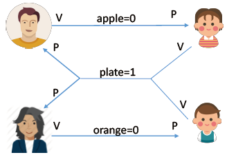

- 互斥关系：（mutex = 1）
    - 对缓冲区（盘子）的访问要互斥地进行
- 同步关系（一前一后）：
    - 父亲将苹果放入盘子后，女儿才可以取走苹果
    - 母亲将橘子放入盘子后，儿子才可以取走橘子
    - 只有盘子为空是，父亲或母亲才可以放入水果

``` c
semaphore mutex = 1;   // 实现互斥访问盘子(缓冲区)
semaphore plate = 1;   // 盘子中还可以放多少个水果
semaphore apple = 0;   // 盘子中有几个苹果
semaphore orange = 0;  // 盘子中有几个橘子

father() {
    while (1) {
        // 准备一个苹果
        P(plate);
        P(mutex);
        // 放苹果
        V(mutex);
        V(apple);
    }
}

mother() {
    while (1) {
        // 准备一个橘子
        P(plate);
        P(mutex);
        // 放橘子
        V(mutex);
        V(orange);
    }
}

daughter() {
    while (1) {
        P(apple);
        P(mutex);
        // 取苹果
        V(mutex);
        V(plate);
        // 吃掉苹果
    }
}

son() {
    while (1) {
        P(orange);
        P(mutex);
        // 取橘子
        V(mutex);
        V(plate);
        // 吃到橘子
    }
}
```

#### 5.3.3 读者和写者问题

有读者和写者两组并发进程，共享一个文件，当两个或两个以上的读进程同时访问共享数据时不会产生副作用，但若某个写进程和其他进程（读进程或写进程）同时访问共享数据时则可能导致数据不一致的错误。因此要求：
- 允许多个读者可以同时对文件执行读操作
- 只允许一个写者往文件中写信息
- 任一写者在完成写操作之前不允许其他读者或写者工作
- 写者执行写操作前，应让已有的读者和写者全部退出

``` c
semaphore rw = 1;     // 用于实现对共享文件的互斥访问
int count = 0;        // 记录当前有几个读进程在访问文件
semaphore mutex = 1;  // 用于保证对 count 变量的互斥访问

writer() {
    while (1) {
        P(rw);  // 写之前 加锁
        // 写文件
        V(rw);  // 写完后 解锁
    }
}

reader() {
    while (1) {
        P(mutex);          // 各进程互斥的访问 count
        if (count == 0) {  // 由第一个读进程负责加锁
            P(rw);
        }
        count++;  // 访问文件的读进程数 +1
        V(mutex);
        // 读文件...
        P(mutex);          // 各进程互斥的访问 count
        count--;           // 访问文件的读进程数 -1
        if (count == 0) {  // 由最后一个读进程负责解锁
            V(rw);
        }
        V(mutex);
    }
}
```

#### 5.3.4 哲学家进餐问题

一张圆桌上坐着5名哲学家，每两个哲学家之间的桌上摆一根筷子，桌子的中间是一碗米饭。哲学家们倾注毕生的精力用于思考和进餐，哲学家在思考时，并不影响他人。只有当哲学家饥饿时，才试图拿起左、右两根筷子（一根一根地拿起）。如果筷子已在他人手上，则需等待。饥饿的哲学家只有同时拿起两根筷子才可以开始进餐，当进餐完毕后，放下筷子继续思考。

分析：如果规定所有的哲学家都先拿左手边的筷子，再拿右手边的筷子，这样会导致死锁。

解决方法：
1. 可以对哲学家进程施加一些限制条件，比如最多运行四个哲学家同时进餐。这样可以保证至少有一个哲学家是可以拿到左右两只筷子的
2. 要求奇数号哲学家先拿左边的筷子，然后再拿右边的筷子，而偶数号哲学家刚好相反。用这种方法可以保证如果相邻的两个奇偶号哲学家都想吃饭，那么只会有其中一个可以拿起第一只筷子，另一个会直接阻塞。这就避免了占有一支后再等待另一只的情况
3. 仅当一个哲学家左右两支筷子都可用时才允许他抓起筷子

``` c
semaphore chopstick[5] = {1, 1, 1, 1, 1};
semaphore mutex = 1;  // 互斥地取筷子
Pi() {                // i 号哲学家的进程
    while (1) {
        P(mutex);
        P(chopstick[i]);
        P(chopstick[(i + 1) % 5]);
        V(mutex);
        // 吃饭...
        V(chopstick[i]);
        V(chopstick[(i + 1) % 5]);
        // 思考
    }
}
```

### 5.4 管程

由于信号量机制存在编写程序困难、易出错等问题。所以，设计一种机制，让程序员写程序的时候不需要再关心复杂的PV操作。

解决方法是将 PV 操作封装到具体问题的类中，使用的时候就直接调用方法即可，特征（和类的特征相似）：

- 管程内的数据只能被管程内的方法访问（类中的私有变量只能由类中的方法访问）
- 一个进程只能通过管程所提供的方法才能访问共享数据（类中的私有变量只能通过类中方法获取）
- **每次仅允许一个进程在管程内执行某个过程（方法）**。

``` c++
monitor producerConsumer
    condition full, empty;    // 条件变量
    int count = 0;            // 缓冲区中的产品数
    void insert(Item item) {  // 把产品 item 放入缓冲区
        if (count == N) {
            wait(full);
        }
        count++;
        insert_item(item);
        if (count == 1) {
            signal(empty);
        }
    }
    Item remove() {  // 从缓冲区中取走一个产品
        if (count == 0) {
            wait(empty);
        }
        count--;
        if (count == N - 1) {
            signal(full);
        }
        return remove_item();
    }
end monitor;

// 生产者进程
provider() {
    while (1) {
        item = new Item();
        producerConsumer.insert(item);
    }
}

// 消费者进程
consumer() {
    while (1) {
        item = producerConsumer.remove();
    }
}
```

## 6. 死锁

讨论死锁概念之前通过一个例子引入：

首先，我们先创建 2 个线程，分别为线程 A 和 线程 B，然后有两个互斥锁，分别是 mutex_A 和 mutex_B，代码如下：

``` c++
pthread_mutex_t mutex_A = PTHREAD_MUTEX_INITIALIZER;
pthread_mutex_t mutex_B = PTHREAD_MUTEX_INITIALIZER;

int main()
{
    pthread_t tidA, tidB;
    
    //创建两个线程
    pthread_create(&tidA, NULL, threadA_proc, NULL);
    pthread_create(&tidB, NULL, threadB_proc, NULL);
    
    pthread_join(tidA, NULL);
    pthread_join(tidB, NULL);
    
    printf("exit\n");
    
    return 0;
}
```

首先看一下线程A做了什么：

``` c++
//线程函数 A
void *threadA_proc(void *data)
{
    printf("thread A waiting get ResourceA \n");
    pthread_mutex_lock(&mutex_A);
    printf("thread A got ResourceA \n");
    
    sleep(1);
    
    printf("thread A waiting get ResourceB \n");
    pthread_mutex_lock(&mutex_B);
    printf("thread A got ResourceB \n");

    pthread_mutex_unlock(&mutex_B);
    pthread_mutex_unlock(&mutex_A);
    return (void *)0;
}
```

可以看到，线程 A 函数的过程：

- 先获取互斥锁 A，然后睡眠 1 秒；
- 再获取互斥锁 B，然后释放互斥锁 B；
- 最后释放互斥锁 A；

然后再看一下线程B做了什么

``` c++
//线程函数 B
void *threadB_proc(void *data)
{
    printf("thread B waiting get ResourceB \n");
    pthread_mutex_lock(&mutex_B);
    printf("thread B got ResourceB \n");
    
    sleep(1);
    
    printf("thread B waiting  get ResourceA \n");
    pthread_mutex_lock(&mutex_A);
    printf("thread B got ResourceA \n");
    
    pthread_mutex_unlock(&mutex_A);
    pthread_mutex_unlock(&mutex_B);
    return (void *)0;
}
```

可以看到，线程 B 函数的过程：

- 先获取互斥锁 B，然后睡眠 1 秒；
- 再获取互斥锁 A，然后释放互斥锁 A；
- 最后释放互斥锁 B；

然后，我们运行这个程序，运行结果如下：

``` shell
thread B waiting get ResourceB 
thread B got ResourceB 
thread A waiting get ResourceA 
thread A got ResourceA 
thread B waiting get ResourceA 
thread A waiting get ResourceB 
// 阻塞中。。。
```

可以看到线程 B 在等待互斥锁 A 的释放，线程 A 在等待互斥锁 B 的释放，双方都在等待对方资源的释放，很明显，产生了死锁问题。

以上是模拟死锁发生的场景。下面会通过概念、产生条件、排查和避免死锁对死锁进行系统的讨论。

### 6.1 死锁的概念

在多线程编程中，我们为了防止多线程竞争共享资源而导致数据错乱，都会在操作共享资源之前加上互斥锁，只有成功获得到锁的线程，才能操作共享资源，获取不到锁的线程就只能等待，直到锁被释放。

那么，当两个线程为了保护两个不同的共享资源而使用了两个互斥锁，那么这两个互斥锁应用不当的时候，可能会**造成两个线程都在等待对方释放锁**，在没有外力的作用下，这些线程会一直相互等待，就没办法继续运行，这种情况就是发生了死锁。

举个例子，小林拿了小美房间的钥匙，而小林在自己的房间里，小美拿了小林房间的钥匙，而小美也在自己的房间里。如果小林要从自己的房间里出去，必须拿到小美手中的钥匙，但是小美要出去，又必须拿到小林手中的钥匙，这就形成了死锁。

**注：这里死锁、饥饿和死循环做个区分：**

 状态| 区别
---|---
死锁：各进程互相等待对方手里的资源，导致各进程都阻塞，无法向前推进的现象 | 死锁一定是**循环等待对方手里的资源**导致的，因此如果有死锁现象，**那至少有两个或两个以上的进程同时发送死锁**。另外，发生死锁的进程一定处于**阻塞态**
饥饿：由于长期得不到想要的资源，某进程无法向前推进的现象 | 可**能只有一个进程发生饥饿**。发生饥饿的进程既可能是**阻塞态**（如长期得不到需要的 I/O 设备），也可能是**就绪态**（长期得不到处理机）
死循环：某进程执行过程中一直跳不出某个循环的现象 | **可能只有一个进程发生死循环**，死循环可以上处理机运行（可以是**运行态**），只不过无法像期待的那样顺利推进。死锁、饥饿是由于操作系统的策略不合理导致的，而死循环是由代码逻辑的错误导致的

### 6.2 死锁的条件

死锁只有同时满足以下四个条件才会发生：

- 互斥条件
- 持有并等待条件
- 不可剥夺条件
- 环路等待条件

#### 6.2.1 互斥条件

互斥条件是指**多个线程不能同时使用同一个资源**。

比如下图，如果线程 A 已经持有的资源，不能再同时被线程 B 持有，如果线程 B 请求获取线程 A 已经占用的资源，那线程 B 只能等待，直到线程 A 释放了资源。

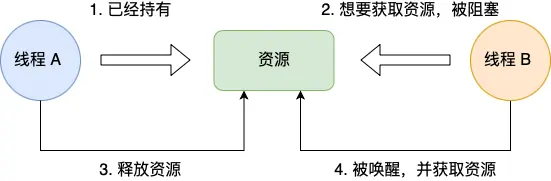

#### 6.2.2 持有并等待条件

持有并等待条件是指，当线程 A 已经持有了资源 1，又想申请资源 2，而资源 2 已经被线程 C 持有了，所以线程 A 就会处于等待状态，但是**线程 A 在等待资源 2 的同时并不会释放自己已经持有的资源 1**。


#### 6.2.3 不可剥夺条件

不可剥夺条件是指，当线程已经持有了资源 ，**在自己使用完之前不能被其他线程获取**，线程 B 如果也想使用此资源，则只能在线程 A 使用完并释放后才能获取。

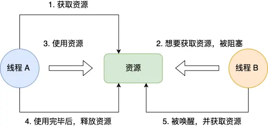

#### 6.2.4 环路等待条件

环路等待条件指的是，在死锁发生的时候，**两个线程获取资源的顺序构成了环形链**。比如，线程 A 已经持有资源 2，而想请求资源 1， 线程 B 已经获取了资源 1，而想请求资源 2，这就形成资源请求等待的环形图。


### 6.3 死锁的处理策略

- 预防死锁：破坏死锁产生的四个必要条件中的一个或几个
- 避免死锁：用某种方法防止系统进入不安全状态，从而避免死锁（银行家算法）
- 死锁的检测和解除：允许死锁的发生，不过操作系统会负责检测出死锁的发生，然后采取某种措施解除死锁

####

## 7. 面试题

1. 什么是僵尸进程？
僵尸进程是已完成且处于终止状态，但在进程表中却仍然存在的进程。僵尸进程一般发生有父子关系的进程中，一个子进程的进程描述符在子进程退出时不会释放，只有当父进程通过 wait() 或 waitpid() 获取了子进程信息后才会释放。如果子进程退出，而父进程并没有调用 wait() 或 waitpid()，那么子进程的进程描述符仍然保存在系统中。
僵尸进程危害场景：例如有个进程，它定期的产 生一个子进程，这个子进程需要做的事情很少，做完它该做的事情之后就退出了，因此这个子进程的生命周期很短，但是，父进程只管生成新的子进程，至于子进程 退出之后的事情，则一概不闻不问，这样，系统运行上一段时间之后，系统中就会存在很多的僵死进程，倘若用ps命令查看的话，就会看到很多状态为Z的进程。 严格地来说，僵死进程并不是问题的根源，罪魁祸首是产生出大量僵死进程的那个父进程。因此，当我们寻求如何消灭系统中大量的僵死进程时，答案就是把产生大 量僵死进程的那个元凶枪毙掉（也就是通过kill发送SIGTERM或者SIGKILL信号啦）。枪毙了元凶进程之后，它产生的僵死进程就变成了孤儿进程，这些孤儿进程会被init进程接管，init进程会wait()这些孤儿进程，释放它们占用的系统进程表中的资源，这样，这些已经僵死的孤儿进程就能瞑目而去了。

2. 什么是孤儿进程？
一个父进程退出，而它的一个或多个子进程还在运行，那么这些子进程将成为孤儿进程。孤儿进程将被 init 进程 (进程 ID 为 1 的进程) 所收养，并由 init 进程对它们完成状态收集工作。因为孤儿进程会被 init 进程收养，所以孤儿进程不会对系统造成危害。

3. 线程崩溃了，进程也会崩溃吗？
在C/C++中，线程崩溃后，进程也会崩溃，而JAVA却不会。类似地，美团面试题：为什么线程崩溃崩溃不会导致 JVM 崩溃？这几个问题可以统一拿出来讨论。

分为以下几个部分：
    
> 1. 线程崩溃，进程一定会崩溃吗？
> 2. 进程是如何崩溃的-信号机制简介
> 3. 为什么在 JVM 中线程崩溃不会导致 JVM 进程崩溃
> 4. openJDK 源码解析

首先，讨论的问题是线程崩溃，进程一定会崩溃吗？大部分情况下，其他线程并不会自己崩溃，而是操作系统检测到异常，会kill掉进程，其他线程就一起被干掉了。大部分情况下，其他线程并不会自己崩溃，而是操作系统检测到异常，会kill掉进程，其他线程就一起被干掉了。大部分情况下，其他线程并不会自己崩溃，而是操作系统检测到异常，会kill掉进程，其他线程就一起被干掉了。出现第二种情况的原因是，一个进程中所有线程都共享计算机资源，没有隔离。所以，对于操作系统来说，他们是不分你我的一个整体。

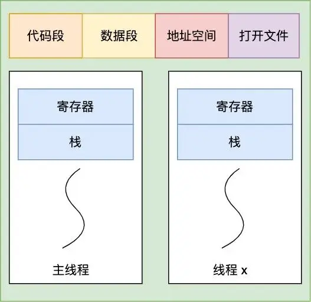

由上图可知，主线程和线程X在进程中共享代码段、数据段、地址空间和文件（但是寄存器和栈不共享）。下面几个例子说明：

``` c
// 针对只读内存写入数据
#include <stdio.h>
#include <stdlib.h>
   
int main() {
    char *s = "hello world";
    // 向只读内存写入数据，崩溃
    s[1] = 'H'; 
}
```

``` c
// 访问了进程没有权限访问的地址空间（比如内核空间）
#include <stdio.h>
#include <stdlib.h>

int main() {
   int *p = (int *)0xC0000fff;
   // 针对进程的内核空间写入数据，崩溃
   *p = 10; 
}
```

``` c
// 访问了不存在的内存
#include <stdio.h>
#include <stdlib.h>
    
int main() {
    int *a = NULL;
    *a = 1;     
}
```
以上错误都是访问内存时的错误，所以统一会报 Segment Fault 错误（即段错误），这些都会导致进程崩溃。

进程是如何崩溃的？
那么线程崩溃后，进程是如何崩溃的呢，这背后的机制到底是怎样的，答案是信号。
大家想想要干掉一个正在运行的进程是不是经常用```kill -9 pid```这样的命令，这里的 kill 其实就是给指定 pid 发送终止信号的意思，其中的 9 就是信号。

当然了发 kill 信号必须具有一定的权限，否则任意进程都可以通过发信号来终止其他进程，那显然是不合理的，实际上 kill 执行的是系统调用，将控制权转移给了内核（操作系统），由内核来给指定的进程发送信号

那么发个信号进程怎么就崩溃了呢，这背后的原理到底是怎样的？
其背后的机制如下：

> 1. CPU 执行正常的进程指令
> 2. 调用 kill 系统调用向进程发送信号
> 3. 进程收到操作系统发的信号，CPU 暂停当前程序运行，并将控制权转交给操作系统
> 4. 调用 kill 系统调用向进程发送信号（假设为 11，即 SIGSEGV，一般非法访问内存报的都是这个错误）
> 5. **操作系统根据情况执行相应的信号处理程序（函数），一般执行完信号处理程序逻辑后会让进程退出**

注意上面的第五步，如果进程没有注册自己的信号处理函数，那么操作系统会执行默认的信号处理程序（一般最后会让进程退出），但如果注册了，则会执行自己的信号处理函数，这样的话就给了进程一个垂死挣扎的机会，它收到 kill 信号后，可以调用 exit() 来退出，但也可以使用```sigsetjmp siglongjmp```这两个函数来恢复进程的执行。

``` c++
// 自定义信号处理函数示例

#include <stdio.h>
#include <signal.h>
#include <stdlib.h>
// 自定义信号处理函数，处理自定义逻辑后再调用 exit 退出
void sigHandler(int sig) {
    printf("Signal %d catched!\n", sig);
    exit(sig);
}
int main(void) {
    signal(SIGSEGV, sigHandler);
    int *p = (int *)0xC0000fff;
    *p = 10; // 针对不属于进程的内核空间写入数据，崩溃
}
// 以上结果输出: Signal 11 catched!
```

如代码所示：注册信号处理函数后，当收到 SIGSEGV 信号后，先执行相关的逻辑再退出。

另外当进程接收信号之后也可以不定义自己的信号处理函数，而是选择忽略信号，如下

``` c++
#include <stdio.h>
#include <signal.h>
#include <stdlib.h>

int main(void) {
    // 忽略信号
    signal(SIGSEGV, SIG_IGN);

    // 产生一个 SIGSEGV 信号
    raise(SIGSEGV);

    printf("正常结束");
}
```

也就是说虽然给进程发送了```kill```信号，但如果进程自己定义了信号处理函数或者无视信号就有机会逃出生天，当然了```kill -9```命令例外，不管进程是否定义了信号处理函数，都会马上被干掉。

通过上面的介绍大家不难发现，其实是 JVM 自己定义了信号处理函数，这样当发送```kill pid```命令（默认会传 15 也就是 SIGTERM）后，JVM 就可以在信号处理函数中执行一些资源清理之后再调用 exit 退出。这种场景显然不能用```kill -9```，不然一下把进程干掉了资源就来不及清除了。

那么，为什么线程崩溃不会导致 JVM 进程崩溃？

现在我们再来看看开头这个问题，相信你多少会心中有数，想想看在 Java 中有哪些是常见的由于非法访问内存而产生的```Exception```或```error```呢，常见的是大家熟悉的```StackoverflowError```或者```NPE(NullPointerException)```,NPE 我们都了解，属于是访问了不存在的内存。

但为什么栈溢出（Stackoverflow）也属于非法访问内存呢，这得简单聊一下进程的虚拟空间，也就是前面提到的共享地址空间。

现代操作系统为了保护进程之间不受影响，所以使用了虚拟地址空间来隔离进程，进程的寻址都是针对虚拟地址，每个进程的虚拟空间都是一样的，而线程会共用进程的地址空间。

以 32 位虚拟空间，进程的虚拟空间分布如下：

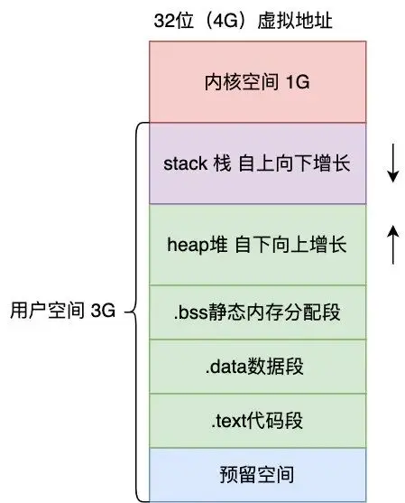

那么 stackoverflow 是怎么发生的呢？

进程每调用一个函数，都会分配一个栈桢，然后在栈桢里会分配函数里定义的各种局部变量。假设现在调用了一个无限递归的函数，那就会持续分配栈帧，但 stack 的大小是有限的（Linux 中默认为 8 M，可以通过```ulimit -a```查看），如果无限递归很快栈就会分配完了，此时再调用函数试图分配超出栈的大小内存，就会发生段错误，也就是```stackoverflowError```。

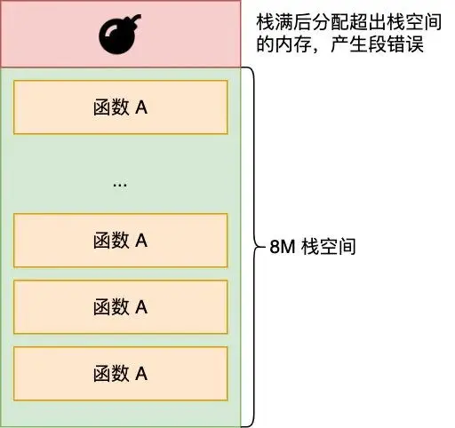

好了，现在我们知道了StackoverflowError怎么产生的。那问题来了，既然StackoverflowError或者NPE都属于非法访问内存，JVM为什么不会崩溃呢？

有了上一节的铺垫，相信你不难回答，**其实就是因为 JVM 自定义了自己的信号处理函数，拦截了 SIGSEGV 信号，针对这两者不让它们崩溃**。

怎么证明这个推测呢，我们来看下 JVM 的源码来一探究竟。

HotSpot 虚拟机目前使用范围最广的 Java 虚拟机，据 R 大所述， Oracle JDK 与 OpenJDK 里的 JVM 都是 HotSpot VM，从源码层面说，两者基本上是同一个东西。OpenJDK 是开源的，所以我们主要研究下 Java 8 的 OpenJDK 即可，地址如下：https://github.com/AdoptOpenJDK/openjdk-jdk8u (opens new window)，有兴趣的可以下载来看看。

我们只要研究 Linux 下的 JVM，为了便于说明，也方便大家查阅，我把其中关于信号处理的关键流程整理了下（忽略其中的次要代码）。

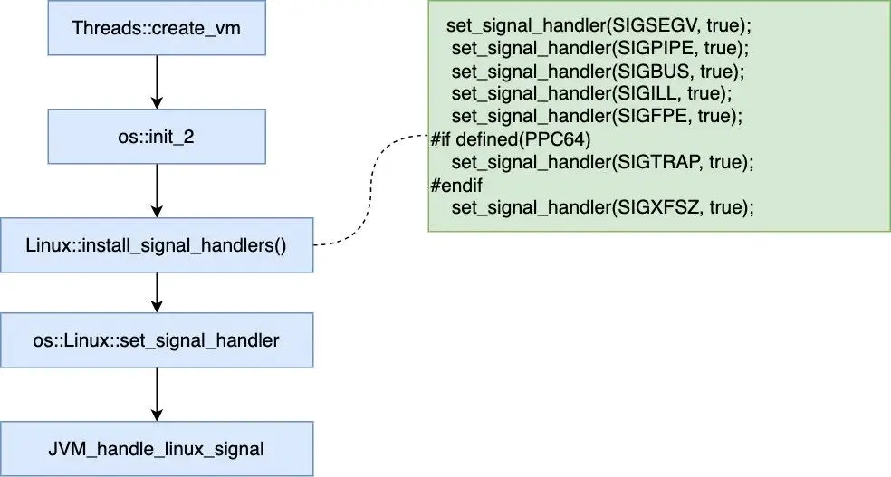

可以看到，在启动 JVM 的时候，也设置了信号处理函数，收到 SIGSEGV，SIGPIPE 等信号后最终会调用 JVM_handle_linux_signal 这个自定义信号处理函数，再来看下这个函数的主要逻辑。

``` java
JVM_handle_linux_signal(int sig,
                        siginfo_t* info,
                        void* ucVoid,
                        int abort_if_unrecognized) {

    // Must do this before SignalHandlerMark, if crash protection installed we will longjmp away
    // 这段代码里会调用 siglongjmp，主要做线程恢复之用
    os::ThreadCrashProtection::check_crash_protection(sig, t);

    if (info != NULL && uc != NULL && thread != NULL) {
            pc = (address) os::Linux::ucontext_get_pc(uc);

        // Handle ALL stack overflow variations here
        if (sig == SIGSEGV) {
            // Si_addr may not be valid due to a bug in the linux-ppc64 kernel (see
            // comment below). Use get_stack_bang_address instead of si_addr.
            address addr = ((NativeInstruction*)pc)->get_stack_bang_address(uc);

            // 判断是否栈溢出了
            if (addr < thread->stack_base() &&
                addr >= thread->stack_base() - thread->stack_size()) {
                if (thread->thread_state() == _thread_in_Java) {            // 针对栈溢出 JVM 的内部处理
                    stub = SharedRuntime::continuation_for_implicit_exception(thread, pc, SharedRuntime::STACK_OVERFLOW);
                }
            }
            }
    }

    if (sig == SIGSEGV &&
                    !MacroAssembler::needs_explicit_null_check((intptr_t)info->si_addr)) {
                // 此处会做空指针检查
        stub = SharedRuntime::continuation_for_implicit_exception(thread, pc, SharedRuntime::IMPLICIT_NULL);
    }


    // 如果是栈溢出或者空指针最终会返回 true，不会走最后的 report_and_die，所以 JVM 不会退出
    if (stub != NULL) {
            // save all thread context in case we need to restore it
            if (thread != NULL) thread->set_saved_exception_pc(pc);

            uc->uc_mcontext.gregs[REG_PC] = (greg_t)stub;
            // 返回 true 代表 JVM 进程不会退出
            return true;
    }

    VMError err(t, sig, pc, info, ucVoid);
    // 生成 hs_err_pid_xxx.log 文件并退出
    err.report_and_die();

    ShouldNotReachHere();
    return true; // Mute compiler

    }
```

从以上代码我们可以知道以下信息：

> 1. 发生 stackoverflow 还有空指针错误，确实都发送了 SIGSEGV，只是虚拟机不选择退出，而是自己内部作了额外的处理，其实是恢复了线程的执行，并抛出 StackoverflowError 和 NPE，这就是为什么 JVM 不会崩溃且我们能捕获这两个错误/异常的原因
> 2. 如果针对 SIGSEGV 等信号，在以上的函数中 JVM 没有做额外的处理，那么最终会走到 report_and_die 这个方法，这个方法主要做的事情是生成 hs_err_pid_xxx.log crash 文件（记录了一些堆栈信息或错误），然后退出
    
至此我相信大家明白了为什么发生了 StackoverflowError 和 NPE 这两个非法访问内存的错误，JVM 却没有崩溃。

**原因其实就是虚拟机内部定义了信号处理函数，而在信号处理函数中对这两者做了额外的处理以让 JVM 不崩溃，另一方面也可以看出如果 JVM 不对信号做额外的处理，最后会自己退出并产生 crash 文件 hs_err_pid_xxx.log（可以通过``` -XX:ErrorFile=/var/log/hs_err.log``` 这样的方式指定），这个文件记录了虚拟机崩溃的重要原因。**

所以也可以说，虚拟机是否崩溃只要看它是否会产生此崩溃日志文件。


> 回过头来看为什么虚拟机会针对```StackoverflowError```和```NullPointerException```做额外处理让线程恢复呢，针对 stackoverflow 其实它采用了一种栈回溯的方法保证线程可以一直执行下去，而捕获空指针错误主要是这个错误实在太普遍了。为了这一个很常见的错误而让 JVM 崩溃那线上的 JVM 要宕机多少次，所以出于工程健壮性的考虑，与其直接让 JVM 崩溃倒不如让线程起死回生，并且将这两个错误/异常抛给用户来处理。

4. 一个进程最多可以创建多少线程？
在 Linux 操作系统中，虚拟地址空间的内部又被分为内核空间和用户空间两部分，不同位数的系统，地址 空间的范围也不同。比如最常⻅的 32 位和 64 位系统，如下所示:

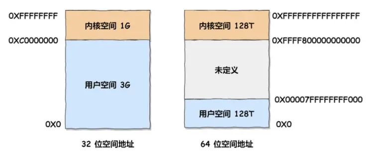

通过这里可以看出:

> - 32 位系统的内核空间占用 1G ，位于最高处，剩下的 3G 是用户空间;
> - 64 位系统的内核空间和用户空间都是 128T ，分别占据整个内存空间的最高和最低处，剩下的中 间部分是未定义的。

回到题目本身：一个进程最多可以创建多少个线程？

这个问题跟两个东西有关系：

> - **进程的虚拟内存空间上限**，因为创建一个线程，操作系统需要为其分配一个栈空间，如果线程数量越多，所需的栈空间就要越大，那么虚拟内存就会占用的越多。
> - **系统参数限制**，虽然 Linux 并没有内核参数来控制单个进程创建的最大线程个数，但是有系统级别的参数来控制整个系统的最大线程个数。

我们先看看，在进程里创建一个线程需要消耗多少虚拟内存大小？

我们可以执行```ulimit -a```这条命令，查看进程创建线程时默认分配的栈空间大小，比如我这台服务器默认分配给线程的栈空间大小为```stack size 8M```。

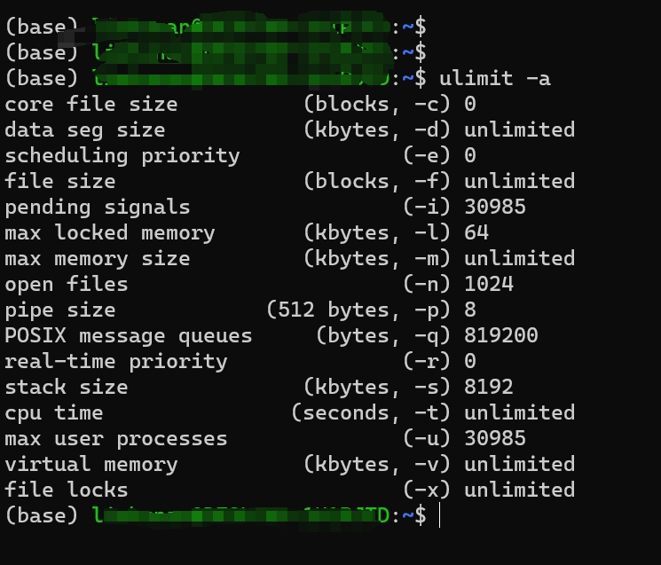

在前面我们知道，在 32 位 Linux 系统里，一个进程的虚拟空间是 4G，内核分走了1G，留给用户用的只有 3G。那么假设创建一个线程需要占用 10M 虚拟内存，总共有 3G 虚拟内存可以使用。于是我们可以算出，最多可以创建差不多 300 个（3G/10M）左右的线程。

如果你想自己做个实验，你可以找台 32 位的 Linux 系统运行下面这个代码：

``` c++
#include<stdio.h>
#include<pthread.h>
#include<errno.h>
#include<string.h>

void *thread ( void *vargp){//让线程循环，不退出
    while(1) {
        sleep(1);
    }
}

int main(){
    int err = 0, count = 0;
    pthread_t tid;
    //持续创建线程，直到创建失败
    while (err == 0){
        //创建线程
        err = pthread_create (&tid, NULL, thread， NULL);
        count++:
        printf("count = %d\n", count);
    }
    printf("create thread error : s \n",strerror(errno));printf("Maximum number of thread within a Process"" is : d n", count);
    //输入回车键，程序才退出，可以方便观察创建完线程后，进程的top情况
    getchar();
    
    return 0;

}
```

建议在32位机器上进行实验。贴一个别人的结果：


按 64 位系统的虚拟内存大小，理论上可以创建无数个线程。事实上，肯定创建不了那么多线程，除了虚拟内存的限制，还有系统的限制。

比如下面这三个内核参数的大小，都会影响创建线程的上限：

> - ```/proc/sys/kernel/threads-max```，表示系统支持的最大线程数，默认值是 14553；
> - ```/proc/sys/kernel/pid_max```，表示系统全局的 PID 号数值的限制，每一个进程或线程都有 ID，ID 的值超过这个数，进程或线程就会创建失败，默认值是 32768；
> - ```/proc/sys/vm/max_map_count```，表示限制一个进程可以拥有的VMA(虚拟内存区域)的数量，具体什么意思我也没搞清楚，反正如果它的值很小，也会导致创建线程失败，默认值是 65530。