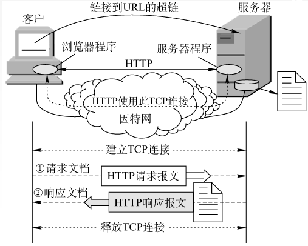
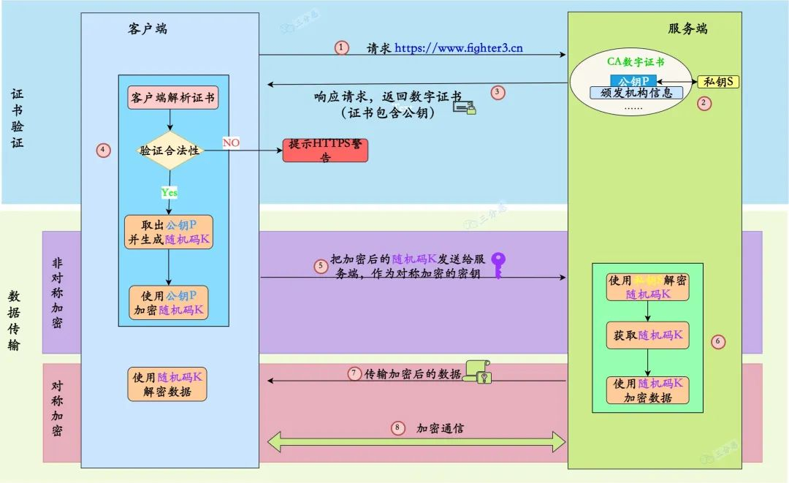

# 应用层

- 编辑：李竹楠
- 日期：2023/12/03

## 1. 概述

在 TCP/IP 模型中，应用层提供的服务相当于 OSI 模型的应用层、表示层和会话层的服务总和。不仅包含了**管理通信连接的会话层功能**、**数据格式转换的表示层功能**，还包括**主机间交互的应用层功能**。

TCP/IP 模型中应用层位于传输层之上，**传输层的端口号用于标识数据所对应的应用层协议**。也就是说，有端口号的协议都是应用层协议。应用协议是终端设备之间的应用通信规则。应用之间交互的信息叫消息，应用协议定义这些消息的格式以及消息的控制或操作的规则。


## 2. HTTP

该章节按照介绍万维网和HTTP之间的关系、HTTP协议、HTTPS协议的顺序。

### 2.1 万维网（WWW）

- **万维网 WWW（World Wide Web）**是一个大规模的、联机式的信息储藏所（资料空间），是无数个网络站点和网页的集合。
- **统一资源定位符（URL）**唯一标识资源（文字、视频、音频...）
- URL一般形式：<协议>://<主机>:<端口>/<路径>

用户通过点击**超连接接获取资源**，这些资源通过**超文本传输协议（HTTP）**传送给使用者。万维网以客户/服务器方式工作，用户使用的浏览器就是万维网客户程序，万维网文档所驻留的主机运行服务器程序。万维网使用超文本标记语言HTML，使得万维网页面设计者可以从很方便地一个界面的链接转到另一个界面，并能在自己的屏幕上显示出来。

### 2.2 HTTP协议

HTTP协议定义了浏览器（万维网客户进程）怎样向万维网服务器请求万维网文档（**请求**），以及服务器怎样把文档传送给浏览器（**响应**）。



#### 2.2.1 具体过程

1. 浏览器分析URL
2. 浏览器向DNS请求解析IP地址
3. DNS解析出IP地址
4. 浏览器与服务器建立TCP连接
5. 浏览器发出取文件命令
6. 服务器响应
7. 释放TCP连接
8. 浏览器显示

#### 2.2.2 协议特点

HTTP是**无状态**的（即每一次浏览都是相同的，不会记录用户信息），但是在实际工作中，一些万维网站点常常希望能够识别用户（**通过 Cookie**）。Cookie是存储在用户主机中的文本文件，记录一段时间内某用户的访问记录（提供个性化服务）。HTTP 采用TCP作为运输层协议，但HTTP协议本身是**无连接**的（通信双方在交换 HTTP 报文之前不需要先建立 HTTP 连接）

#### 2.2.3 连接方式


持久连接：如果有大量的连接，每次在连接，关闭都要经历三次握手，四次挥手，这显然会造成性能低下。因此。Http 有一种叫做 长连接（keepalive connections） 的机制。它可以在传输数据后仍保持连接，当客户端需要再次获取数据时，直接使用刚刚空闲下来的连接而无需再次握手。

#### 2.2.4 报文结构


状态码：

- 1xx 表示通知信息的，如请求收到了或正在处理
- 2xx 表示成功，如接受或知道了（202 Accepted）
- 3xx 表示重定向，如要完成请求还必须采取进一步的行动（301 Moved Permanently）
- 4xx 表示客户的差错，如请求中有错误的语法或不能完成（404 Not Found）
- 5xx 表示服务器的差错，如服务器失效无法完成请求

#### 2.2.5 HTTP2.0

官网对于HTTP2.0的表述是：

- 对1.x协议语意的完全兼容：2.0协议是在1.x基础上的升级而不是重写，1.x协议的方法，状态及api在2.0协议里是一样的。
- 性能的大幅提升

下文着重说明优化内容：

- 二进制分帧（Binary Format），http2.0的基石
- 多路复用 (Multiplexing) / 连接共享
- 头部压缩（Header Compression）
- 请求优先级（Request Priorities）
- 服务端推送（Server Push）

关于HTTP2.0核心概念：

- 连接 Connection： 1 个 TCP 连接，包含一个或者多个 Stream。
- 数据流 Stream：一个双向通讯数据流，包含 1 条或者多条 Message。
- 消息 Message:对应 HTTP/1 中的请求或者响应，包含一条或者多条 Frame。
- 数据帧 Frame：最小单位，以二进制压缩格式存放 HTTP/1 中的内容。


> Tips：图中 Stream 表示多个数据流，它们可以源源不断地并发传送，同一个 Stream 流中的 frame 数据是串行发送的。

##### 2.2.5.1 二进制分帧

http2.0之所以能够突破http1.X标准的性能限制，改进传输性能，**实现低延迟和高吞吐量**，就是因为其新增了二进制分帧层。

帧(frame)包含部分：类型Type, 长度Length, 标记Flags, 流标识Stream和frame payload有效载荷。消息(message)：一个完整的请求或者响应，比如请求、响应等，由一个或多个 Frame 组成。流是连接中的一个虚拟信道，可以承载双向消息传输。每个流有唯一整数标识符。为了防止两端流ID冲突，客户端发起的流具有奇数ID，服务器端发起的流具有偶数ID。


在二进制分帧层上，http2.0会将所有传输信息分割为更小的消息和帧，并对它们采用二进制格式的编码将其封装，新增的二进制分帧层同时也能够保证http的各种动词，方法，首部都不受影响，兼容上一代http标准。其中，http1.X中的首部信息header封装到Headers帧中，而request body将被封装到Data帧中。

##### 2.2.5.2 多路复用

在 HTTP1 中浏览器限制了同一个域名下的请求数量（Chrome下一般是六个），当在请求很多资源的时候，由于**队头阻塞**，当浏览器达到最大请求数量时，剩余的资源需等待当前的六个请求完成后才能发起请求。这也是为何一些站点会有多个静态资源 CDN 域名的原因之一。

为什么会队头堵塞？
> HTTP 1.x 中，如果想并发多个请求，必须使用多个 TCP 链接，且浏览器为了控制资源，还会对单个域名有 6-8个的TCP链接请求限制。**所有就是请求的都是通过一个 TCP连接并发完成**。如下图，红色圈出来的请求就因域名链接数已超过限制，而被挂起等待了一段时间：
> 

而http2.0中的多路复用优化了这一性能。多路复用允许同时通过单一的http/2 连接发起多重的请求-响应消息。有了新的**分帧机制**后，http/2 **不再**依赖多个TCP连接去实现多流并行了。**每个数据流都拆分成很多互不依赖的帧，而这些帧可以交错（乱序发送），还可以分优先级，最后再在另一端把它们重新组合起来**。 

这一特性，使性能有了极大提升：

- **同个域名只需要占用一个TCP连接**，消除了因多个TCP连接而带来的延时和内存消耗。
- 单个连接上可以并行交错的请求和响应，之间互不干扰。
- 在HTTP/2中，每个请求都可以带一个31bit的优先值，0表示最高优先级， 数值越大优先级越低。有了这个优先值，客户端和服务器就可以在处理不同的流时采取不同的策略，以最优的方式发送流、消息和帧。


上图展示了一个连接上的多个传输数据流：客户端向服务端传输数据帧stream5，同时服务端向客户端乱序发送stream1和stream3。这次连接上有三个响应请求乱序并行交换。


上图就是http1.X和http2.0在传输数据时的区别。

##### 2.2.5.3 头部压缩

HTTP 1.1请求的大小变得越来越大，有时甚至会大于TCP窗口的初始大小，因为它们需要等待带着ACK的响应回来以后才能继续被发送。HTTP/2对消息头采用HPACK（专为http/2头部设计的压缩格式）进行压缩传输，能够节省消息头占用的网络的流量。而HTTP/1.x每次请求，都会携带大量冗余头信息，浪费了很多带宽资源。

HTTP每一次通信都会携带一组头部，用于描述这次通信的的资源、浏览器属性、cookie等，如下图：


为了减少这块的资源消耗并提升性能， HTTP/2对这些首部采取了压缩策略：

- HTTP/2在客户端和服务器端使用**首部表**来跟踪和存储之前发送的键－值对，对于相同的数据，不再通过每次请求和响应发送；
- 首部表在HTTP/2的连接存续期内始终存在，由客户端和服务器共同渐进地更新；
- 每个新的首部键－值对要么被追加到当前表的末尾，要么替换表中之前的值。

例如：下图中的两个请求， 请求一发送了所有的头部字段，第二个请求则只需要发送差异数据，这样可以减少冗余数据，降低开销。


##### 2.2.5.4 请求优先级

把http消息分为很多独立帧之后，就可以通过优化这些帧的交错和传输顺序进一步优化性能。每个流都可以带有一个31比特的优先值：0表示最高优先级；2的31次方-1表示最低优先级。

服务器可以根据流的优先级，控制资源分配（CPU、内存、带宽），而在响应数据准备好之后，优先将最高优先级的帧发送给客户端。高优先级的流都应该优先发送，但又不会绝对的。绝对地准守，可能又会引入首队阻塞的问题：高优先级的请求慢导致阻塞其他资源交付。

分配处理资源和客户端与服务器间的带宽，不同优先级的混合也是必须的。客户端会指定哪个流是最重要的，有一些依赖参数，这样一个流可以依赖另外一个流。优先级别可以在运行时动态改变，当用户滚动页面时，可以告诉浏览器哪个图像是最重要的，你也可以在一组流中进行优先筛选，能够突然抓住重点流。

- 优先级最高：主要的html
- 优先级高：CSS文件
- 优先级中：js文件
- 优先级低：图片

##### 2.2.5.5 服务器推送

服务端可以在发送页面HTML时主动推送其它资源，而不用等到浏览器解析到相应位置，发起请求再响应。例如服务端可以主动把JS和CSS文件推送给客户端，而**不需要客户端解析HTML时再发送这些请求**。

服务端可以主动推送，客户端也有权利选择是否接收。**如果服务端推送的资源已经被浏览器缓存过，浏览器可以通过发送RST_STREAM帧来拒收**。主动推送也遵守同源策略，服务器不会随便推送第三方资源给客户端。

##### 2.2.5.6 HTTP2.0性能瓶颈

HTTP2协议虽然大幅提升了HTTP/1.1的性能，然而，基于TCP实现的HTTP2遗留下3个问题：

- 有序字节流引出的[队头阻塞（Head-of-line blocking）](https://zhuanlan.zhihu.com/p/330300133)，使得HTTP2的多路复用能力大打折扣；
- **TCP与TLS叠加了握手时延**，建链时长还有1倍的下降空间；
- 基于TCP四元组确定一个连接，这种诞生于有线网络的设计，并不适合移动状态下的无线网络，这意味着**IP地址的频繁变动会导致TCP连接、TLS会话反复握手**，成本高昂。

#### 2.2.6 HTTP3.0

HTTP3.0解决了一下问题：

- HTTP3基于UDP协议重新定义了连接，在QUIC层实现了无序、并发字节流的传输，解决了队头阻塞问题（包括基于QPACK解决了动态表的队头阻塞）；
- HTTP3重新定义了TLS协议加密QUIC头部的方式，既提高了网络攻击成本，又降低了建立连接的速度（仅需1个RTT就可以同时完成建链与密钥协商）；
- HTTP3 将Packet、QUIC Frame、HTTP3 Frame分离，实现了连接迁移功能，降低了5G环境下高速移动设备的连接维护成本。

本文将会从HTTP3协议的概念讲起，从连接迁移的实现上学习HTTP3的报文格式，再围绕着队头阻塞问题来分析多路复用与QPACK动态表的实现。

##### 2.2.6.1 HTTP3.0协议是什么

就像HTTP2协议一样，HTTP3并没有改变HTTP1的语义。那什么是HTTP语义呢？在我看来，它包括以下3个点：

- 请求只能由客户端发起，而服务器针对每个请求返回一个响应；
- 请求与响应都由Header、Body（可选）组成，其中请求必须含有URL和方法，而响应必须含有响应码；
- Header中各Name对应的含义保持不变。

HTTP2/HTTP3在保持HTTP1语义不变的情况下，更改了编码格式，这由2个原因所致：

- 为了减少编码长度。HTTP1协议的编码使用了ASCII码，用空格、冒号以及\r\n作为分隔符，编码效率很低。
- 由于HTTP1协议不支持多路复用，这样高并发只能通过多开一些TCP连接实现。

HTTP2协议基于TCP有序字节流实现，**因此应用层的多路复用并不能做到无序地并发，在丢包场景下会出现队头阻塞问题**。如下面的动态图片所示，服务器返回的绿色响应由5个TCP报文组成，而黄色响应由4个TCP报文组成，当第2个黄色报文丢失后，即使客户端接收到完整的5个绿色报文，但TCP层不会允许应用进程的read函数读取到最后5个报文，并发成了一纸空谈：


当网络繁忙时，丢包概率会很高，多路复用受到了很大限制。因此，**HTTP3采用UDP作为传输层协议，重新实现了无序连接，并在此基础上通过有序的QUIC Stream提供了多路复用**，如下图所示：


##### 2.2.6.2 QUIC协议

QUIC（Quick UDP Internet Connections)基于UDP的传输层协议，提供像TCP一样的可靠性。

而QUIC协议最最吸引人的特性有两点，一是对线头阻塞(HOL)问题的解决更为彻底。基于TCP的HTTP/2，尽管从逻辑上来说，**不同的流之间相互独立，不会相互影响**，但在实际传输方面，**数据还是要一帧一帧的发送和接收**，一旦某一个流的数据有丢包，则同样会**阻塞**在它之后传输的其它与它毫不相干的流的数据的传输。而基于UDP的QUIC协议则可以更为彻底地解决这样的问题，让不同的流之间真正的实现相互独立传输，互不干扰。

另一个特性切换网络时的连接保持。当前移动端的应用环境，用户的网络可能会经常切换，比如从办公室或家里出门，WiFi断开，网络切换为3G或4G。基于TCP的协议，由于切换网络之后，IP会改变，因而之前的连接不可能继续保持。而基于UDP的QUIC协议，则可以内建与TCP中不同的连接标识方法，从而在网络完成切换之后，恢复之前与服务器的连接。

那么它是如何避免前序包阻塞（HOL阻塞）。多个数据在TCP连接上传输时，若一个数据包出现问题，TCP需要等待该包重传后，才能继续传输其它数据包。但在QUIC中，因为其基于UDP协议，UDP数据包在出问题需要重传时，并不会对其他数据包传输产生影响。

##### 2.2.6.2 连接迁移功能是怎样实现的？

对于当下的HTTP1和HTTP2协议，传输请求前需要先完成耗时1个RTT的TCP三次握手、耗时1个RTT的TLS握手（TLS1.3），由于它们分属内核实现的传输层、openssl库实现的表示层，所以难以合并在一起，如下图所示：


在IoT时代，移动设备接入的网络会频繁变动，从而导致设备IP地址改变。**对于通过四元组（源IP、源端口、目的IP、目的端口）定位连接的TCP协议来说，这意味着连接需要断开重连，所以上述2个RTT的建链时延、TCP慢启动都需要重新来过**。而HTTP3的QUIC层实现了连接迁移功能，允许移动设备更换IP地址后，只要仍保有上下文信息（比如连接ID、TLS密钥等），就可以复用原连接。

在UDP报文头部与HTTP消息之间，共有3层头部，定义连接且实现了Connection Migration主要是在Packet Header中完成的，如下图所示：


这3层Header实现的功能各不相同：

- Packet Header实现了可靠的连接。当UDP报文丢失后，通过Packet Header中的Packet Number实现**报文重传**。连接也是通过其中的Connection ID字段定义的；
- QUIC Frame Header在无序的Packet报文中，基于QUIC Stream概念实现了有序的字节流，这允许HTTP消息可以像在TCP连接上一样传输；
- HTTP3 Frame Header定义了HTTP Header、Body的格式，以及服务器推送、QPACK编解码流等功能。

### 2.3 HTTPS协议

由于HTTP协议有以下缺点：

- 通信使用明文（不加密），内容可能会被窃听。
- 不验证通信方的身份，因此有可能遭遇伪装。
- 无法证明报文的完整性，所以有可能已遭篡改。

所以，需要对协议进行加密。即HTTP下加入SSL层，HTTPS的安全基础是SSL，因此加密的详细内容就需要SSL。HTTPS协议的主要作用可以分为两种：**一种是建立一个信息安全通道，来保证数据传输的安全；另一种就是确认网站的真实性**。

HTTPS并非是应用层的一种新协议。只是HTTP通信接口部分用SSL（Secure Socket Layer）和TLS（Transport Layer Security）协议代替而已。通常，HTTP直接和TCP通信。当使用 SSL时，则演变成先和SSL通信，再由SSL和TCP通信了。简言之，所谓 HTTPS，其实就是身披SSL协议这层外壳的HTTP。

#### 2.3.1 与HTTP的区别


- HTTPS是加密传输协议，HTTP是名文传输协议
- HTTPS需要用到SSL证书，而HTTP不用
- HTTPS比HTTP更加安全
- HTTPS标准端口443，HTTP标准端口80
- HTTPS基于传输层，HTTP基于应用层

#### 2.3.2 关于加密

前文对于HTTPS有一个大概的了解，在介绍HTTPS详细内容之前，需要对加密进行概括。

<u>为什么要加密？</u>主要就是上文提到HTTP的缺点。因为http的内容是明文传输的，明文数据会经过中间代理服务器、路由器、wifi热点、通信服务运营商等多个物理节点，如果信息在传输过程中被劫持，传输的内容就完全暴露了。劫持者还可以篡改传输的信息且不被双方察觉，这就是**中间人攻击**。所以我们才需要对信息进行加密。最容易理解的就是对称加密 。

<u>什么是对称性加密？</u>简单说就是有一个密钥，它可以加密一段信息，也可以对加密后的信息进行解密，和我们日常生活中用的钥匙作用差不多。


<u>用对称性加密可行吗？</u>**如果通信双方都各自持有同一个密钥，且没有别人知道，这两方的通信安全当然是可以被保证的（除非密钥被破解）**。

然而最大的问题就是**这个密钥怎么让传输的双方知晓，同时不被别人知道**。如果由服务器生成一个密钥并传输给浏览器，那在这个传输过程中密钥被别人劫持到手了怎么办？之后他就能用密钥解开双方传输的任何内容了，所以这么做当然不行。换种思路？试想一下，如果浏览器内部就预存了网站A的密钥，且可以确保除了浏览器和网站A，不会有任何外人知道该密钥，那理论上用对称加密是可以的，这样浏览器只要预存好世界上所有HTTPS网站的密钥就行了！这么做显然不现实。怎么办？所以我们就需要非对称加密 。

<u>什么是非对称加密？</u>简单说就是有两把密钥，通常一把叫做公钥、一把叫私钥，用公钥加密的内容必须用私钥才能解开，同样，私钥加密的内容只有公钥能解开。


<u>用非对称加密可行吗？</u>鉴于非对称加密的机制，我们可能会有这种思路：服务器先把公钥以明文方式传输给浏览器，之后浏览器向服务器传数据前都先用这个公钥加密好再传，这条数据的安全似乎可以保障了！**因为只有服务器有相应的私钥能解开公钥加密的数据。**

<u>然而反过来由服务器到浏览器的这条路怎么保障安全？</u>如果服务器用它的私钥加密数据传给浏览器，那么浏览器用公钥可以解密它，而这个公钥是一开始通过明文传输给浏览器的，若这个公钥被中间人劫持到了，那他也能用该公钥解密服务器传来的信息了。所以**目前似乎只能保证由浏览器向服务器传输数据的安全性（其实仍有漏洞，下文会说）**。

<u>改良的非对称加密方案，似乎可以？</u>我们已经理解通过一组公钥私钥，可以保证单个方向传输的安全性，那用两组公钥私钥，是否就能保证双向传输都安全了？看下面的过程：1. 某网站服务器拥有公钥A与对应的私钥A’；浏览器拥有公钥B与对应的私钥B’。2. 浏览器把公钥B明文传输给服务器。3. 服务器把公钥A明文给传输浏览器。4. 之后浏览器向服务器传输的内容都用公钥A加密，服务器收到后用私钥A’解密。由于只有服务器拥有私钥A’，所以能保证这条数据的安全。5. 同理，服务器向浏览器传输的内容都用公钥B加密，浏览器收到后用私钥B’解密。同上也可以保证这条数据的安全。

的确可以！抛开这里面仍有的漏洞不谈（下文会讲），HTTPS的加密却没使用这种方案，为什么？很重要的原因是非对称加密算法非常耗时，而对称加密快很多。那我们能不能运用非对称加密的特性解决前面提到的对称加密的漏洞？

<u>非对称加密+对称加密？</u>既然非对称加密耗时，那非对称加密+对称加密结合可以吗？而且得尽量减少非对称加密的次数。当然是可以的，且非对称加密、解密各只需用一次即可。看下面的过程：1. 某网站拥有用于非对称加密的公钥A、私钥A’。2. 浏览器向网站服务器请求，服务器把公钥A明文给传输浏览器。3. 浏览器随机生成一个用于对称加密的密钥X，用公钥A加密后传给服务器。4. 服务器拿到后用私钥A’解密得到密钥X。5. 这样双方就都拥有密钥X了，且别人无法知道它。之后双方所有数据都通过密钥X加密解密即可。**HTTPS基本采用的这种方案**。但是，还有漏洞。

<u>漏洞是如何产生的？</u>**代理人攻击**。如果在数据传输过程中，中间人劫持到了数据，此时他的确无法得到浏览器生成的密钥X，这个密钥本身被公钥A加密了，只有服务器才有私钥A’解开它，然而中间人却完全不需要拿到私钥A’就能窃取信息。过程如下：1. 某网站有用于非对称加密的公钥A、私钥A’。2. 浏览器向网站服务器请求，服务器把公钥A明文给传输浏览器。3. **中间人劫持到公钥A，保存下来，把数据包中的公钥A替换成自己伪造的公钥B（它当然也拥有公钥B对应的私钥B’）。** 4. 浏览器生成一个用于对称加密的密钥X，用**公钥B**（浏览器无法得知公钥被替换了）加密后传给服务器。5. **中间人劫持后用私钥B’解密得到密钥X，再用公钥A加密后传给服务器。** 6. 服务器拿到后用私钥A’解密得到密钥X。

这样在双方都不会发现异常的情况下，中间人通过一套“狸猫换太子”的操作，掉包了服务器传来的公钥，进而得到了密钥X。**根本原因是浏览器无法确认收到的公钥是不是网站自己的**。因为公钥本身是明文传输的，难道还得对公钥的传输进行加密？

<u>如何证明浏览器收到的公钥一定是该网站的公钥？</u>比如现实生活中，若想证明某身份证号一定是小明的，可以看他身份证，而身份证是由政府作证的，这里的“公理”就是“政府机构可信”，这也是社会正常运作的前提。那能不能类似地有个机构充当互联网世界的“公理”呢？让它作为一切证明的源头，给网站颁发一个“身份证”？它就是**CA机构**，它是如今互联网世界正常运作的前提，而CA机构颁发的“身份证”就是**数字证书**。

<u>数字证书</u>网站在使用HTTPS前，需要向CA机构申领一份数字证书，数字证书里含有证书持有者信息、公钥信息等。服务器把证书传输给浏览器，浏览器从证书里获取公钥就行了，证书就如身份证，证明“该公钥对应该网站”。而这里又有一个显而易见的问题，**证书本身的传输过程中，如何防止被篡改**？即如何证明证书本身的真实性？身份证运用了一些防伪技术，而数字证书怎么防伪呢？我们把证书原本的内容生成一份“签名”，比对证书内容和签名是否一致就能判别是否被篡改。这就是数字证书的“防伪技术”，这里的“签名”就叫**数字签名**。

<u>数字签名</u>这部分内容建议看下图并结合后面的文字理解，图中左侧是数字签名的制作过程，右侧是验证过程：


数字签名的制作过程：

1. CA机构拥有非对称加密的私钥和公钥。
2. CA机构对证书明文数据T进行hash。
3. 对hash后的值用私钥加密，得到数字签名S。

**明文和数字签名**共同组成了数字证书，这样一份数字证书就可以颁发给网站了。那浏览器拿到服务器传来的数字证书后，如何验证它是不是真的？（有没有被篡改、掉包）

浏览器验证过程：

1. 拿到证书，得到明文T，签名S。
2. 用CA机构的公钥对S解密（由于是浏览器信任的机构，所以浏览器保有它的公钥。详情见下文），得到S’。
3. 用证书里指明的hash算法对明文T进行hash得到T’。
4. 显然通过以上步骤，T’应当等于S‘，除非明文或签名被篡改。所以此时比较S’是否等于T’，等于则表明证书可信。

<u>中间人有可能篡改该证书吗？</u>假设中间人篡改了证书的原文，由于他没有CA机构的私钥，所以无法得到此时加密后签名，无法相应地篡改签名。浏览器收到该证书后会发现原文和签名解密后的值不一致，则说明证书已被篡改，证书不可信，从而终止向服务器传输信息，防止信息泄露给中间人。

<u>中间人有可能把证书掉包吗？</u>假设有另一个网站B也拿到了CA机构认证的证书，它想劫持网站A的信息。于是它成为中间人拦截到了A传给浏览器的证书，然后替换成自己的证书，传给浏览器，之后浏览器就会错误地拿到B的证书里的公钥了，这确实会导致上文“中间人攻击”那里提到的漏洞？其实这并不会发生，因为证书里包含了网站A的信息，包括域名，浏览器把证书里的域名与自己请求的域名比对一下就知道有没有被掉包了。

<u>怎么证明CA机构的公钥是可信的？</u>操作系统、浏览器本身会预装一些它们信任的根证书，其中会有CA机构的根证书，这样就可以拿到它对应的可信公钥了。实际上证书之间的认证也可以不止一层，可以A信任B，B信任C，以此类推，我们把它叫做**信任链**或**数字证书链**。也就是一连串的数字证书，由根证书为起点，透过层层信任，使终端实体证书的持有者可以获得转授的信任，以证明身份。

> 另外，不知你们是否遇到过网站访问不了、提示需安装证书的情况？这里安装的就是根证书。说明浏览器不认给这个网站颁发证书的机构，那么你就得手动下载安装该机构的根证书（风险自己承担XD）。安装后，你就有了它的公钥，就可以用它验证服务器发来的证书是否可信了。

每次进行HTTPS请求时都必须在SSL/TLS层进行握手传输密钥吗？
> 显然每次请求都经历一次密钥传输过程非常耗时，那怎么达到只传输一次呢？服务器会为每个浏览器（或客户端软件）维护一个session ID，在TLS握手阶段传给浏览器，浏览器生成好密钥传给服务器后，服务器会把该密钥存到相应的session ID下，之后浏览器每次请求都会携带session ID，服务器会根据session ID找到相应的密钥并进行解密加密操作，这样就不必要每次重新制作、传输密钥了。

#### 2.3.3 TLS/SSL协议基础

TLS与SSL关系？
> 最新版本的TLS（Transport Layer Security，传输层安全协议）是IETF（Internet Engineering Task Force，Internet工程任务组）制定的一种新的协议，它建立在SSL 3.0协议规范之上，是SSL 3.0的后续版本。在TLS与SSL3.0之间存在着显著的差别，主要是它们所支持的加密算法不同，所以TLS与SSL3.0不能互操作。可以认为TLS是SSL的升级版本。

Secure Socket Layer(SSL)/Transport Layer Security(TLS)的功能实现主要依赖于三类基本算法：**散列函数 Hash、对称加密和非对称加密**，其利用<u>非对称加密实现身份认证和密钥协商</u>，<u>对称加密算法采用协商的密钥对数据加密</u>，<u>基于散列函数验证信息的完整性</u>。 


- 非对称加密：即常见的 RSA 算法，还包括 ECC、DH 等算法，算法特点是，密钥成对出现，一般称为公钥(公开)和私钥(保密)，公钥加密的信息只能私钥解开，私钥加密的信息只能公钥解开。因此掌握公钥的不同客户端之间不能互相解密信息，只能和掌握私钥的服务器进行加密通信，服务器可以实现1对多的通信，客户端也可以用来验证掌握私钥的服务器身份。
- 对称加密： 常见的有 AES-CBC、DES、3DES、AES-GCM等，相同的密钥可以用于信息的加密和解密，掌握密钥才能获取信息，能够防止信息窃听，通信方式是1对1。
- 散列函数：常见的有 MD5、SHA1、SHA256，该类函数特点是函数单向不可逆、对输入非常敏感、输出长度固定，针对数据的任何修改都会改变散列函数的结果，用于防止信息篡改并验证数据的完整性。

TLS的基本工作方式是，客户端使用非对称加密与服务器进行通信，实现身份验证并协商对称加密使用的密钥，然后对称加密算法采用协商密钥对信息以及信息摘要进行加密通信，不同的节点之间采用的对称密钥不同，从而可以保证信息只能通信双方获取。

#### 2.3.5 TLS/SSL协议握手协商

基于RSA握手和密钥交换的客户端验证服务器为示例详解TLS/SSL握手过程：


1. client_hello：客户端发起请求，以明文传输请求信息，包含版本信息，加密套件候选列表，压缩算法候选列表，随机数，扩展字段等信息。
2. server_hello+server_certificate+sever_hello_done：server_hello，服务端返回协商的信息结果，包括选择使用的协议版本 version，选择的加密套件 cipher suite，选择的压缩算法 compression method、随机数 random_S 等，其中随机数用于后续的密钥协商；server_certificates, 服务器端配置对应的证书链，用于身份验证与密钥交换；server_hello_done，通知客户端 server_hello 信息发送结束。
3. 证书校验：客户端验证证书的合法性，如果验证通过才会进行后续通信，否则根据错误情况不同做出提示和操作
4. client_key_exchange+change_cipher_spec+encrypted_handshake_message：合法性验证通过之后，客户端计算产生随机数字Pre-master，并用证书公钥加密，发送给服务器；此时客户端已经获取全部的计算协商密钥需要的信息：两个明文随机数random_C和random_S与自己计算产生的Pre-master，计算得到协商密钥；  change_cipher_spec：客户端通知服务器后续的通信都采用协商的通信密钥和加密算法进行加密通信；encrypted_handshake_message：结合之前所有通信参数的hash值与其它相关信息生成一段数据，采用协商密钥session secret与算法进行加密，然后发送给服务器用于数据与握手验证。
5. change_cipher_spec+encrypted_handshake_message：服务器用私钥解密加密的Pre-master数据，基于之前交换的两个明文随机数random_C和random_S，计算得到协商密钥:enc_key=Fuc(random_C, random_S, Pre-Master)；计算之前所有接收信息的hash值，然后解密客户端发送的 encrypted_handshake_message，验证数据和密钥正确性；change_cipher_spec, 验证通过之后，服务器同样发送 change_cipher_spec 以告知客户端后续的通信都采用协商的密钥与算法进行加密通信；encrypted_handshake_message, 服务器也结合所有当前的通信参数信息生成一段数据并采用协商密钥session secret与算法加密并发送到客户端。
6. 握手结束：客户端计算所有接收信息的hash值，并采用协商密钥解密 encrypted_handshake_message，验证服务器发送的数据和密钥，验证通过则握手完成。
7. 加密通信

#### 2.3.4 HTTPS性能与优化

前文讨论了HTTPS原理与优势：身份验证、信息加密与完整性校验等，且未对TCP和HTTP协议做任何修改。但通过增加新协议以实现更安全的通信必然需要付出代价，HTTPS协议的性能损耗主要体现如下：

- 增加延时：分析前面的握手过程，一次完整的握手至少需要两端依次来回两次通信，至少增加延时2 * RTT，利用会话缓存从而复用连接，延时也至少1 * RTT。
- 消耗较多的CPU资源：除数据传输之外，HTTPS通信主要包括对对称加解密、非对称加解密(服务器主要采用私钥解密数据)。

考虑优化：

- CDN接入，HTTPS增加的延时主要是传输延时RTT，RTT的特点是节点越近延时越小，CDN 天然离用户最近，因此选择使用CDN作为HTTPS接入的入口，将能够极大减少接入延时。CDN节点通过和业务服务器维持长连接、会话复用和链路质量优化等可控方法，极大减少HTTPS带来的延时。
- 会话缓存： 虽然前文提到HTTPS即使采用会话缓存也要至少1*RTT的延时，但是至少延时已经减少为原来的一半，明显的延时优化；同时，基于会话缓存建立的HTTPS连接不需要服务器使用RSA私钥解密获取Pre-master信息，可以省去CPU的消耗。如果业务访问连接集中，缓存命中率高，则HTTPS的接入能力讲明显提升。
- 硬件加速：为接入服务器安装专用的SSL硬件加速卡，作用类似GPU，释放CPU，能够具有更高的HTTPS接入能力且不影响业务程序。
- SPDY/HTTP2：前面的方法分别从减少传输延时和单机负载的方法提高HTTPS接入性能，但是方法都基于不改变HTTP协议的基础上提出的优化方法，SPDY/HTTP2利用TLS/SSL带来的优势，通过修改协议的方法来提升HTTPS的性能，提高下载速度等。

### 2.4 八股文

#### 2.4.1 说说HTTP常用的状态码及其含义？

HTTP状态码首先应该知道个大概的分类：

- 1XX：信息性状态码：101切换请求协议
- 2XX：成功状态码：200请求成功
- 3XX：重定向状态码：301请求资源永久转移，返回新URI
- 4XX：客户端错误状态码：404页面不存在
- 5XX：服务端错误状态码：500服务器错误

#### 2.4.2 HTTP有哪些请求方式？

- GET：从服务器获取资源，例如网页或图像。
- POST：将数据提交给服务器进行处理，例如表单提交或文件上传。
- PUT：用新数据更新服务器上的现有资源。
- DELETE：从服务器中删除资源。
- HEAD：检索资源的标头，不带消息正文。
- OPTIONS：用于获取当前URL所支持的方法。若请求成功，则它会在HTTP头中包含一个名为“Allow”的头，值是所支持的方法，如“GET, POST”。
- CONNECT：建立到资源的网络连接，例如代理服务器。
- TRACE：回显接收到的请求消息，用于调试目的。

#### 2.4.3 说⼀下GET和POST的区别？

- 传参形式不同。从 HTTP 报文层面来看，GET请求将信息放在URL，POST将请求信息放在请求体中。这一点使得GET请求携带的数据量有限，因为URL本身是有长度限制的，而POST请求的数据存放在报文体中，因此对大小没有限制。而且从形式上看，GET请求把数据放URL上不太安全，而POST请求把数据放在请求体里想比较而言安全一些。
- 从数据库层面来看，**GET符合幂等性和安全性，而POST请求不符合**。这个其实和GET/POST请求的作用有关。按照HTTP的约定，GET请求用于查看信息，不会改变服务器上的信息；而POST请求用来改变服务器上的信息。正因为GET请求只查看信息，**不改变信息，对数据库的一次或多次操作获得的结果是一致的，认为它符合幂等性**。**安全性是指对数据库操作没有改变数据库中的数据**。
- 从其他层面来看，GET请求能够被缓存，GET请求能够保存在浏览器的浏览记录里，GET请求的URL能够保存为浏览器书签。这些都是POST请求所不具备的。缓存是GET请求被广泛应用的根本，他能够被缓存也是因为它的幂等性和安全性，除了返回结果没有其他多余的动作，因此绝大部分的 GET 请求都被CDN缓存起来了，大大减少了Web服务器的负担。

#### 2.4.4 GET的长度限制是多少？

HTTP中的GET方法是通过URL传递数据的，但是URL本身其实并没有对数据的长度进行限制，真正限制GET长度的是浏览器。例如IE浏览器对URL的最大限制是2000多个字符，大概2kb左右，像Chrome、Firefox等浏览器支持的URL字符数更多，其中FireFox中URL的最大长度限制是65536个字符，Chrome则是8182个字符。这个长度限制也不是针对数据部分，而是针对整个 URL。

#### 2.4.5 HTTP请求的过程与原理？


1. 每个服务器都有一个进程，它不断监听TCP的端口80，以便发现是否有浏览器向它发出连接建立请求。
2. 监听到连接请求，就会建立TCP连接。
3. 浏览器向服务器发出浏览某个页面的请求，服务器接着就返回所请求的页面作为响应。
4. 最后，释放TCP连接

在浏览器和服务器之间的请求和响应的交互，必须按照规定的格式和遵循一定的规则，这些格式和规则就是超文本传输协议HTTP。

#### 2.4.6 说一下 HTTP 的报文结构？


HTTP 请求报文的格式如下：

```
GET / HTTP/1.1
User-Agent: Mozilla/5.0 (Macintosh; Intel Mac OS X 10_10_5)
Accept: */*
```

HTTP请求报文的第一行叫做请求行，后面的行叫做首部行，首部行后还可以跟一个实体主体。请求首部之后有一个空行，这个空行不能省略，它用来划分首部与实体。请求行包含三个字段：

- 方法字段：包括 POST、GET 等请方法。
- URL 字段
- HTTP 版本字段。

HTTP响应报文的格式如下：

```
HTTP/1.0 200 OK
Content-Type: text/plain
Content-Length: 137582
Expires: Thu, 05 Dec 1997 16:00:00 GMT
Last-Modified: Wed, 5 August 1996 15:55:28 GMT
Server: Apache 0.84
<html>
  <body>Hello World</body>
</html>
```

HTTP 响应报文的第一行叫做状态行，后面的行是首部行，最后是实体主体。

- 状态行包含了三个字段：协议版本字段、状态码和相应的状态信息。
- 实体部分是报文的主要部分，它包含了所请求的对象。
- 首部行首部可以分为四种首部，请求首部、响应首部、通用首部和实体首部。通用首部和实体首部在请求报文和响应报文中都可以设置，区别在于请求首部和响应首部。
- 常见的请求首部有Accept可接收媒体资源的类型、Accept-Charset可接收的字符集、Host请求的主机名。
- 常见的响应首部有ETag资源的匹配信息，Location客户端重定向的 URI。
- 常见的通用首部有Cache-Control控制缓存策略、Connection管理持久连接。
- 常见的实体首部有Content-Length实体主体的大小、Expires实体主体的过期时间、Last-Modified资源的最后修改时间。

> 其中，响应报文中，Context-Length可以用于断点续传功能。

#### 2.4.7 URI 和 URL 有什么区别？


- URI，统一资源标识符(Uniform Resource Identifier， URI)，标识的是Web上每一种可用的资源，如HTML文档、图像、视频片段、程序等都是由一个URI进行标识的。
- URL，统一资源定位符（Uniform Resource Location)，它是URI的一种子集，主要作用是提供资源的路径。

#### 2.4.8 说下 HTTP/1.0，1.1，2.0， 3.0的区别？

关键需要记住HTTP/1.0 **默认是短连接**，可以强制开启，HTTP/1.1 **默认长连接**，HTTP/2.0采用**多路复用**，HTTP/3.0将传输层改为基于**UDP**、使用**QUIC**保证UDP可靠性。

1. HTTP1.0：默认使用短连接，每次请求都需要建立一个TCP连接。它可以设置Connection: keep-alive这个字段，强制开启长连接
2. HTTP1.1：
    - 引入了持久连接，即TCP连接默认不关闭，可以被多个请求复用。
    - 分块传输编码，即服务端每产生一块数据，就发送一块，用” 流模式” 取代” 缓存模式”。
    - 管道机制，即在同一个 TCP 连接里面，客户端可以同时发送多个请求。
3. HTTP2.0：
    - 二进制协议，1.1 版本的头信息是文本（ASCII 编码），数据体可以是文本或者二进制；2.0 中，头信息和数据体都是二进制。
    - 完全多路复用，在一个连接里，客户端和浏览器都可以同时发送多个请求或回应，而且不用按照顺序一一对应。
    - 报头压缩，HTTP 协议不带有状态，每次请求都必须附上所有信息。Http/2.0 引入了头信息压缩机制，使用 gzip 或 compress 压缩后再发送。
    - 服务端推送，允许服务器未经请求，主动向客户端发送资源。
4. HTTP3.0：
    - 使用UDP作为传输层进行通信。
    - 在DP的基础上 QUIC协议保证了HTTP/3的安全性，在传输的过程中就完成了TLS加密握手。
    - HTTPS要建⽴⼀个连接，要花费6次交互，先是建⽴三次握⼿，然后是TLS/1.3的三次握⼿。QUIC直接把以往的TCP和TLS/1.3的6次交互合并成了3次，减少了交互次数。
    - QUIC 有⾃⼰的⼀套机制可以保证传输的可靠性的。当某个流发⽣丢包时，只会阻塞这个流，其他流不会受到影响。

HTTP协议的变迁：


#### 2.4.9 HTTP性能优化？

1HTTP 建立之初，是为了将超文本标记语言(HTML)文档从Web服务器传送到客户端的浏览器。但随着CSS,Javascript的出现，以及移动互联时代的到来，我们不得不对HTTP进行不断地优化。

HTTP优化：
影响一个HTTP网络请求的因素主要有两个方面：带宽和延迟。随着网络基础建设的完善，带宽因素已经不需要再考虑，仅需要考虑的就是**延迟**。延迟主要受三个方面影响：**浏览器阻塞（HOL blocking），DNS查询（DNS Lookup），建立连接（Initial connection）**。

1. HTTP1.0：

    - 请求与响应支持HTTP头，响应含状态行，增加了状态码，
    - 支持HEAD，POST方法
    - 支持传输HTML文件以外其他类型的内容

    HTTP1.0使用的是非持久连接，主要缺点是客户端必须为每一个待请求的对象建立并维护一个新的连接，即每请求一个文档就要有两倍RTT 的开销。因为同一个页面可能存在多个对象，所以非持久连接可能使一个页面的下载变得十分缓慢，而且这种**短连接增加了网络传输的负担**。
2. HTTP2.0：

    - **支持长连接**
    - 在HTTP1.0的基础上引入了更多的缓存控制策略。
    - 引入了请求范围设置，优化了带宽。
    - 在错误通知管理中新增了错误状态响应码。
    - 增加了Host头处理，可以传递主机名（hostname）。

    但是缺点是传输内容是明文，不够安全。
3. HTTPS：

    - HTTPS运行在安全套接字协议(Secure Sockets Layer，SSL )或传输层安全协议（Transport Layer Security，TLS）之上，所有在TCP中传输的内容都需要经过加密
    - 连接方式不同，HTTP的端口是80，**HTTPS的端口是443**
    - HTTPS可以有效防止运营商劫持。

4. HTTP2.0：

    - 二进制分帧：HTTP2.0基于二进制格式进行解析，而HTTP 1.x基于文本格式进行解析。
    - **多路复用**：HTTP1.1是多个请求串行化单线程处理，HTTP2.0是并行执行，一个请求超时并不会影响其他请求。
    - 头部压缩
    - 请求优先级
    - 服务端推送

5. HTTP3.0：QUIC (Quick UDP Internet Connections), 快速 UDP 互联网连接。

    - 线头阻塞(HOL)问题的解决更为彻底：基于TCP的HTTP/2，尽管从逻辑上来说，不同的流之间相互独立，不会相互影响，但在实际传输方面，数据还是要一帧一帧的发送和接收，一旦某一个流的数据有丢包，则同样会阻塞在它之后传输的流数据传输。而基于UDP的QUIC协议则可以更为彻底地解决这样的问题，让不同的流之间真正的实现相互独立传输，互不干扰。
    - 切换网络时的连接保持：当前移动端的应用环境，用户的网络可能会经常切换，比如从办公室或家里出门，WiFi断开，网络切换为3G或4G。**基于TCP的协议，由于切换网络之后，IP会改变，因而之前的连接不可能继续保持。而基于UDP的QUIC协议，则可以内建与TCP中不同的连接标识方法，从而在网络完成切换之后，恢复之前与服务器的连接**。

#### 2.4.10 HTTP 如何实现长连接？在什么时候会超时？

什么是HTTP的长连接？
> - HTTP分为长连接和短连接，本质上说的是TCP的长短连接。TCP连接是一个双向的通道，它是可以保持一段时间不关闭的，因此TCP连接才具有真正的长连接和短连接这一说法。
> - 长连接可以复用一个TCP连接，来发起多次的HTTP请求，这样就可以减少资源消耗，比如一次请求HTML，如果是短连接的话，可能还需要请求后续的JS/CSS。

如何设置长连接？
> 通过在头部（请求和响应头）设置Connection字段指定为keep-alive，HTTP/1.0 协议支持，但是是默认关闭的，从 HTTP/1.1 以后，连接默认都是长连接。

在什么时候会超时呢？
> HTTP 一般会有httpd守护进程，里面可以设置keep-alive timeout，当tcp连接闲置超过这个时间就会关闭，也可以在HTTP的header里面设置超时时间。
> TCP的 keep-alive包含三个参数，支持在系统内核的net.ipv4里面设置；当TCP连接之后，闲置了tcp_keepalive_time，则会发生侦测包，如果没有收到对方的ACK，那么会每隔tcp_keepalive_intvl再发一次，直到发送了tcp_keepalive_probes，就会丢弃该连接。如下：
> 
> ``` shell
> tcp_keepalive_intvl = 15
> tcp_keepalive_probes = 5
> tcp_keepalive_time = 1800
> ```

#### 2.4.11 说说HTTP与HTTPS有哪些区别？

- HTTP是超⽂本传输协议，信息是明⽂传输，存在安全⻛险的问题。HTTPS则解决 HTTP 不安全的缺陷，在TCP和HTTP⽹络层之间加⼊了SSL/TLS安全协议，使得报⽂能够加密传输。
- HTTP连接建⽴相对简单， TCP三次握⼿之后便可进⾏HTTP的报⽂传输。⽽HTTPS在TCP三次握⼿之后，还需进⾏SSL/TLS的握⼿过程，才可进⼊加密报⽂传输。
- HTTP的端⼝号是80，HTTPS的端⼝号是443。
- HTTPS协议需要向CA（证书权威机构）申请数字证书，来保证服务器的身份是可信的。


#### 2.4.12 为什么要用HTTPS解决了哪些问题？

- 窃听⻛险，⽐如通信链路上可以获取通信内容，用户账号被盗。
- 篡改⻛险，⽐如强制植⼊垃圾⼴告，视觉污染。
- 冒充⻛险，⽐如冒充淘宝⽹站，用户金钱损失。

#### 2.4.13 HTTPS工作流程是怎样的？

这道题有几个要点：**公私钥、数字证书、加密、对称加密、非对称加密**。



1. 客户端发起HTTPS请求，连接到服务端的443端口。
2. 服务端有一套数字证书（证书内容有公钥、证书颁发机构、失效日期等）。
3. 服务端将自己的数字证书发送给客户端（公钥在证书里面，私钥由服务器持有）。
4. 客户端收到数字证书之后，会验证证书的合法性。如果证书验证通过，就会生成一个随机的对称密钥，用证书的公钥加密。
5. 客户端将公钥加密后的密钥发送到服务器。
6. 服务器接收到客户端发来的密文密钥之后，用自己之前保留的私钥对其进行非对称解密，解密之后就得到客户端的密钥，然后用客户端密钥对返回数据进行对称加密，这样传输的数据都是密文了。
7. 服务器将加密后的密文返回到客户端。
8. 客户端收到后，用自己的密钥对其进行对称解密，得到服务器返回的数据。

#### 2.4.14 客户端怎么去校验证书的合法性？

为了让服务端的公钥被⼤家信任，服务端的证书都是由CA（Certificate Authority，证书认证机构）签名的，CA就是⽹络世界⾥的公证中⼼，具有极⾼的可信度，所以由它来给各个公钥签名，信任的⼀⽅签发的证书，那必然证书也是被信任的。


CA 签发证书的过程，如上图左边部分：

- ⾸先CA会把持有者的公钥、⽤途、颁发者、有效时间等信息打成⼀个包，然后对这些信息进⾏Hash计算，得到⼀个Hash值；
- 然后CA会使⽤⾃⼰的私钥将该Hash值加密，⽣成Certificate Signature，也就是CA对证书做了签名；
- 最后将Certificate Signature添加在⽂件证书上，形成数字证书；

客户端校验服务端的数字证书的过程，如上图右边部分：

- ⾸先客户端会使⽤同样的Hash算法获取该证书的Hash值H1；
- 通常浏览器和操作系统中集成了CA的公钥信息，浏览器收到证书后可以使⽤CA的公钥解密Certificate Signature内容，得到⼀个Hash值H2；
- 最后⽐较H1和H2，如果值相同，则为可信赖的证书，否则则认为证书不可信。

假如在HTTPS的通信过程中，中间人篡改了证书原文，由于他没有CA机构的私钥，所以CA公钥解密的内容就不一致。

#### 2.4.15 如何理解 HTTP 协议是无状态的？

这个无状态的的状态值的是什么？是客户端的状态，所以字面意思，就是 HTTP协议中服务端不会保存客户端的任何信息。比如当浏览器第一次发送请求给服务器时，服务器响应了；如果同个浏览器发起第二次请求给服务器时，它还是会响应，但是呢，服务器不知道你就是刚才的那个浏览器。

那有什么办法记录状态？
> 主要有两个办法，Session和Cookie。

#### 2.4.16 说说Session和Cookie有什么联系和区别?

什么是Cookie？
> Cookie是保存在客户端的一小块文本串的数据。客户端向服务器发起请求时，服务端会向客户端发送一个Cookie，客户端就把Cookie保存起来。在客户端下次向同一服务器再发起请求时，Cookie被携带发送到服务器。服务端可以根据这个Cookie判断用户的身份和状态。

什么是Session？
> Session指的就是服务器和客户端一次会话的过程。它是另一种记录客户状态的机制。不同的是cookie保存在客户端浏览器中，而session保存在服务器上。客户端浏览器访问服务器的时候，服务器把客户端信息以某种形式记录在服务器上，这就是session。客户端浏览器再次访问时只需要从该session中查找用户的状态。

Session和Cookie到底有什么不同？
> - 存储位置不一样，Cookie保存在客户端，Session保存在服务器端。
> - 存储数据类型不一样，Cookie只能保存ASCII，Session可以存任意数据类型，一般情况下我们可以在Session中保持一些常用变量信息，比如说UserId等。
> - 有效期不同，Cookie可设置为长时间保持，比如我们经常使用的默认登录功能，Session一般有效时间较短，客户端关闭或者Session超时都会失效。
> - 隐私策略不同，Cookie存储在客户端，比较容易遭到不法获取，早期有人将用户的登录名和密码存储在Cookie中导致信息被窃取；Session 存储在服务端，安全性相对Cookie要好一些。
> - 存储大小不同， 单个Cookie保存的数据不能超过4K，Session可存储数据远高于Cookie。

Session 和 Cookie 有什么关联？
> - 用户第一次请求服务器时，服务器根据用户提交的信息，创建对应的 Session，请求返回时将此Session的唯一标识信息SessionID返回给浏览器，浏览器接收到服务器返回的SessionID信息后，会将此信息存入 Cookie 中，同时Cookie记录此SessionID是属于哪个域名。
> - 当用户第二次访问服务器时，请求会自动判断此域名下是否存在Cookie信息，如果存在，则自动将Cookie信息也发送给服务端，服务端会从Cookie中获取SessionID，再根据SessionID查找对应的Session信息，如果没有找到，说明用户没有登录或者登录失效，如果找到Session证明用户已经登录可执行后面操作。

分布式环境下Session怎么处理呢？
> 分布式环境下，客户端请求经过负载均衡，可能会分配到不同的服务器上，假如一个用户的请求两次没有落到同一台服务器上，那么在新的服务器上就没有记录用户状态的Session。可以使用Redis等分布式缓存来存储Session，在多台服务器之间共享。

客户端无法使用Cookie怎么办？
> 有可能客户端无法使用Cookie，比如浏览器禁用Cookie，或者客户端是安卓、IOS等等。这时候怎么办？SessionID 怎么存？怎么传给服务端呢？首先是SessionID的存储，可以使用客户端的本地存储，比如浏览器的sessionStorage。接下来怎么传呢？
> - 拼接到 URL 里：直接把SessionID作为URL的请求参数
> - 放到请求头里：把SessionID放到请求的Header里，比较常用。

## 3. 网络管理

### 3.1 DHCP(Dynamic Host Configuration Protocol)

DHCP是动态主机配置协议的缩写。它是一种存在于应用层的网络管理协议。在DHCP的帮助下，可以动态地给网络上的任何设备或节点分配一个互联网协议IP地址，使它们可以使用这个IP进行通信。网络管理员的任务是将大量的IP地址手动分配给网络中的所有设备。然而，在DHCP中，这个任务是自动化的，是集中管理，而不是手工管理。无论是小型本地网络还是大型企业网络都实现了DHCP。DHCP的基本目标是为主机分配一个唯一的IP地址。前身是BOOTP协议，是一个局域网的网络协议，使用**UDP**协议工作，常用的2个端口：

- 67(DHCP server)
- 68(DHCP client)。

DHCP 工作过程如下：


1. 客户端发送Discover报文，该报文的目的地址为255.255.255.255:67，源地址为0.0.0.0:68，被放入UDP中，该报文被广播到同一个子网的所有主机上。如果客户端和DHCP服务器不在同一个子网，就需要使用中继代理。
2. DHCP 服务器收到Discover报文之后，发送Offer报文给客户端，该报文包含了客户端所需要的信息。因为客户端可能收到多个DHCP服务器提供的信息，因此客户端需要进行选择。
3. 如果客户端选择了某个DHCP服务器提供的信息，那么就发送Request报文给该DHCP服务器。
4. DHCP服务器发送Ack报文，表示客户端此时可以使用提供给它的信息。

### 3.2 DNS(Domain Name System)

DNS是一个分布式数据库，提供了主机名和IP地址之间相互转换的服务。这里的分布式数据库是指，每个站点只保留它自己的那部分数据。域名具有层次结构，从上到下依次为：根域名、顶级域名、二级域名。


DNS可以使用UDP或者TCP进行传输，使用的端口号都为53。大多数情况下DNS使用**UDP**进行传输，这就要求域名解析器和域名服务器都必须自己处理超时和重传从而保证可靠性。在两种情况下会使用**TCP**进行传输：

- 如果返回的响应超过的512字节（UDP最大只支持512字节的数据）。
- 区域传送（区域传送是主域名服务器向辅助域名服务器传送变化的那部分数据）。

## 4. 远程登陆

在实际工作中，除了个别无法远程管理设备外，大多会采用远程管理的方式，来管理设备的配置文件和系统文件。对比本地管理，远程管理不受物理位置限制，连上网络就可以对世界另一端的设备进行操控，更省去了插拔设备线缆、终端设置的过程，可以通过一个远程应用同时管理大量的网络设备。

### 4.1 TELNET

Telnet 协议定义了一台设备通过IP网络向远端设备发起**明文**管理连接的通信标准，可以在一台设备上通过 Telnet 协议与一台远端设备建立管理连接，并对远端设备实施配置和监控，这种方式的体验与本地登录设备并无区别。发起管理的设备为**Telnet客户端**，被管理的设备是**Telnet服务器**。因此，Telnet 协议是一个典型的服务器和客户端模型的应用层协议。


Telnet协议通过**TCP**协议建立服务器和客户端的一条连接，并通过这条连接向服务器发送用户名、密码和命令。Telnet协议使用的是TCP**23 端口**，表示客户端在发起Telnet连接时，默认连接服务器的TCP**23端口**。

当Telnet客户端输入命令后，这些命令通过TCP连接发送到23号端口，监听请求的守护进程Telnetd收到后，将命令发送给Shell ，Shell为操作系统进行命令解释，然后操作系统执行Telnet客户端发出的命令。同理，操作系统按照相反的顺序，将命令执行的结果发回给Telnet客户端。

Telnet协议实现了远程命令传输，但是客户端和服务器跨越**不可靠的公共网络**时，在命令传输过程中可以截获Telnet通信的所有数据，然后使用截获的用户名和密码来通过Telnet务器的身份认证，并登录到设备上对配置文件进行修改。Telnet协议存在重大安全隐患，不推荐在实验室之外的环境使用。

### 4.2 SSH

SSH协议全程是安全外壳协议，目的就是为了取代Telnet ，SSH是加密的远程登录协议，提供更加安全的远程登录服务。使用SSH后会加密通信内容。即使信息被截获，由于无法解密，也无法了解数据的真正内容。建立这条安全信道的方式是让客户端使用服务器的RSA公钥来验证SSH 服务器的身份。SSH协议默认使用TCP的22端口。

如果客户端成功验证了服务器的身份，它们之间就会创建出一个会话密钥，并用双方协商出来的加密算法和会话密钥，对这个信道传输的数据进行加密。这样，两台设备之间就建立了一条安全的信道，使用这条安全信道发送密码，密码以密文的形式传输，通过服务器的身份认证。SSH就是通过这种方式建立加密信道，确保SSH服务器，也就是被管理设备的Shell免遭非法用户操作。

## 5. 文件传输

除了远程登录，我们还需要从远端设备传输文件，文件传输协议提供的应用服务可以满足我们的需求。FTP是网络上文件传输的标准协议，FTP使用 **TCP**作为传输协议，支持用户的登录认证和访问权限的控制。另一种常见的文件传输协议是TFTP协议，TFTP是一种简单的文件传输协议，不支持用户的登录认证，也没有复杂的命令。TFTP使用**UDP**作为传输协议，并有重传机制。

### 5.1 FTP(File Transfer Protocol)

FTP用于服务器和客户端之间传输文件，是IP网络上传输文件的通用协议。FTP 采用客户端和服务器的模式，使用TCP协议提供可靠传输。FTP可以对登录服务器的**用户名和密码进行验证**，允许客户端指定文件的**传输类型**，并且可以设置文件的**传输权限**。

FTP使用两条TCP连接实现文件传输。

- 一条是FTP控制连接（端口21），用来控制管理；
- 另一条是FTP数据连接（端口20），用于数据传输。

FTP控制连接用于传输FTP控制命令和命令执行的应答信息，比如登录用户名和密码的验证、发送文件的名称、发送方式的设置。这条连接在整个FTP会话过程中一直保持打开，通过ASCII码字符串发送请求和接收应答。在控制连接上无法发送数据，而FTP数据连接用于文件和文件列表的传输，仅在需要传输数据时建立数据连接，数据传输完毕后终止。


在 FTP 数据连接过程中，有两种数据传输方式：

- 主动方式：也称为PORT方式。采用主动方式建立数据连接时，FTP客户端会通过FTP控制连接向FTP服务器发送PORT命令，PORT 命令携带参数：A1 、A2 、A3 、A4 、P1 、P2 ，其中 A1 、A2 、A3 、A4 表示需要建立数据连接的主机IP地址，而P1和P2表示客户端用于传输数据的临时端口号，临时端口号的数值为256*P1+P2 。当需要传输数据时，服务器通过TCP端口号20与客户端提供的临时端口建立数据传输通道，完成数据传输。**在整个过程中，由于服务器在建立数据连接时主动发起连接，因此被称为主动模式**。

    

如果客户端在防火墙内部，主动方式可能会有问题，因为客户端的端口号是随机的，防火墙并不知道。默认安全策略，防火墙只会允许外部主机访问部分内部已知端口，阻断对内部随机端口的访问，从而无法建立FTP数据连接。这时，就需要使用FTP被动方式来进行文件传输。

- 被动方式：被动方式也被称为PASV方式。FTP控制通道建立后，希望通过被动方式建立数据传输通道的FTP客户端会利用控制通道向FTP服务器发送PASV命令，告诉服务器进入被动方式传输。服务器选择临时端口号并告知客户端，命令参数和主动传输方式一致。当需要传输数据时，客户端主动与服务器的临时端口建立数据传输通道，并完成数据传输。**在整个过程中，服务器是被动接收客户端的数据连接，所以被称为被动模式**。

    

采用被动方式时，两个连接都由客户端发起。一般防火墙不会限制内部的客户端发起的连接，这样就解决了主动方式下的问题。

### 5.2 TFTP(Trivial File Transfer Protocol)

TFTP也是用于服务器和客户端之间传输文件的，对比FTP ，TFTP没有复杂的交互接口和认证控制，适用于不需要复杂交互的网络环境。

TFTP采用客户端和服务器的模式，使用UDP协议传输，服务器使用端口号 69侦听TFTP连接。由于UDP不能提供可靠的数据传输，因此TFTP使用超时重传机制确保数据正确发送。TFTP只能提供简单的文件传输能力，包括文件的上传和下载。不支持文件目录功能，也不能对用户的身份进行验证和授权。


## 6. 电子邮件协议

感觉不重要，以后再写。

## 7. 网络安全

### 7.1 说说有哪些安全攻击？

网络安全攻击主要分为两种类型，被动攻击和主动攻击。

- 被动攻击：是指攻击者从网络上窃听他人的通信内容，通常把这类攻击称为截获，被动攻击主要有两种形式：消息内容泄露攻击和流量分析攻击。由于攻击者没有修改数据，使得这种攻击很难被检测到。
- 主动攻击：直接对现有的数据和服务造成影响，常见的主动攻击类型有：
    - 篡改：攻击者故意篡改网络上送的报文，甚至把完全伪造的报文传送给接收方。
    - 恶意程序：恶意程序种类繁多，包括计算机病毒、计算机蠕虫、特洛伊木马、后门入侵、流氓软件等等。
    - 拒绝服务Dos：攻击者向服务器不停地发送分组，使服务器无法提供正常服务。

### 7.2 DNS劫持了解吗？

DNS劫持即域名劫持，是通过将原域名对应的IP地址进行替换，从而使用户访问到错误的网站，或者使用户无法正常访问网站的一种攻击方式。域名劫持往往只能在特定的网络范围内进行，范围外的DNS服务器能够返回正常的IP地址。攻击者可以冒充原域名所属机构，通过电子邮件的方式修改组织机构的域名注册信息，或者将域名转让给其它主持，并将新的域名信息保存在所指定的DNS服务器中，从而使用户无法对原域名来进行解析以访问目标地址。

DNS劫持的步骤是什么样的？
> 1. 获取要劫持的域名信息：攻击者会首先访问域名查询要劫持的站点的域名信息。
> 2. 控制域名响应的E-Mail账号：在获取到域名信息后，攻击者通过暴力破解或者专门的方法破解公司注册域名时使用的E-mail账号所对应的密码，更高级的攻击者甚至能够直接对E-Mail进行信息窃取。
> 3. 修改注册信息：当攻击者破解了E-Mail后，会利用相关的更改功能修改该域名的注册信息，包括域名拥有者信息，DNS服务器信息等。
> 4. 使用E-Mail收发确认函：在修改完注册信息后，攻击者E-Mail在真正拥有者之前收到修改域名注册信息的相关确认信息，并回复确认修改文件，待网络公司恢复已成功修改信件后，攻击者便成功完成DNS劫持。

怎么应对DNS劫持？
> - 直接通过 IP 地址访问网站，避开DNS劫持
> - 由于域名劫持往往只能在特定的网络范围内进行，因此一些高级用户可以通过网络设置让DNS指向正常的域名服务器以实现对目标网址的正常访问，例如计算机首选DNS服务器的地址固定为8.8.8.8。

### 7.3 什么是 CSRF 攻击？如何避免？

什么是 CSRF 攻击？
> CSRF，跨站请求伪造（英文全称是 Cross-site request forgery），是一种挟持用户在当前已登录的Web应用程序上执行非本意的操作的攻击方法。

CSRF 是如何攻击的呢？
> 
> 
> 
> 1. 用户登陆银行，没有退出，浏览器包含了 用户 在银行的身份认证信息。
> 2. 攻击者将伪造的转账请求，包含在在帖子。
> 3. 用户在银行网站保持登陆的情况下，浏览帖子。
> 4. 将伪造的转账请求连同身份认证信息，发送到银行网站。
> 5. 银行网站看到身份认证信息，以为就是用户的合法操作，最后造成用户资金损失。

怎么应对 CSRF 攻击呢？
> 
> - 检查Referer字段：HTTP头中的Referer字段记录了该HTTP请求的来源地址。在通常情况下，访问一个安全受限页面的请求来自于同一个网站，而如果黑客要对其实施CSRF攻击，他一般只能在他自己的网站构造请求。因此，可以通过验证Referer值来防御CSRF攻击。
> - 添加校验 token：以在HTTP请求中以参数的形式加入一个随机产生的token，并在服务器端建立一个拦截器来验证这个token，如果请求中没有token或者token内容不正确，则认为可能是CSRF攻击而拒绝该请求。
> - 敏感操作多重校验：对一些敏感的操作，除了需要校验用户的认证信息，还可以通过邮箱确认、验证码确认这样的方式多重校验。

### 7.4 什么是 DoS、DDoS、DRDoS 攻击？

- DOS: (Denial of Service), 翻译过来就是拒绝服务, 一切能引起拒绝行为的攻击都被称为DOS攻击。最常见的DoS攻击就有计算机网络宽带攻击、连通性攻击。
- DDoS: (Distributed Denial of Service)，翻译过来是分布式拒绝服务。是指处于不同位置的多个攻击者同时向一个或几个目标发动攻击，或者一个攻击者控制了位于不同位置的多台机器，并利用这些机器对受害者同时实施攻击。主要形式有流量攻击和资源耗尽攻击，常见的DDoS攻击有：SYN Flood、Ping of Death、ACK Flood、UDP Flood等。
- DRDoS: (Distributed Reflection Denial of Service)，中文是分布式反射拒绝服务，该方式靠的是发送大量带有被害者IP地址的数据包给攻击主机，然后攻击主机对IP地址源做出大量回应，从而形成拒绝服务攻击。

如何防范 DDoS?
> 针对 DDoS 中的流量攻击，最直接的方法是增加带宽，理论上只要带宽大于攻击流量就可以了，但是这种方法成本非常高。在有充足带宽的前提下，我们应该尽量提升路由器、网卡、交换机等硬件设施的配置。
> 针对资源耗尽攻击，我们可以升级主机服务器硬件，在网络带宽得到保证的前提下，使得服务器能够有效对抗海量的 SYN 攻击包。我们也可以安装专业的抗 DDoS 防火墙，从而对抗 SYN Flood 等流量型攻击。负载均衡，CDN等技术都能有效对抗 DDos 攻击。

### 7.5 对称加密与非对称加密有什么区别？

- 对称加密：指加密和解密使用同一密钥，优点是运算速度较快，缺点是如何安全将密钥传输给另一方。常见的对称加密算法有：DES、AES等。
- 非对称加密：指的是加密和解密使用不同的密钥（即公钥和私钥）。公钥与私钥是成对存在的，如果用公钥对数据进行加密，只有对应的私钥才能解密。常见的非对称加密算法有RSA。

### 7.6 RSA 和 AES 算法有什么区别？

- RSA：采用非对称加密的方式，采用公钥进行加密，私钥解密的形式。其私钥长度一般较长，由于需要大数的乘幂求模等运算，**其运算速度较慢，不合适大量数据文件加密**。
- AES：采用对称加密的方式，其秘钥长度最长只有256个比特，加密和解密速度较快，易于硬件实现。由于是对称加密，通信双方在进行数据传输前需要获知加密密钥。