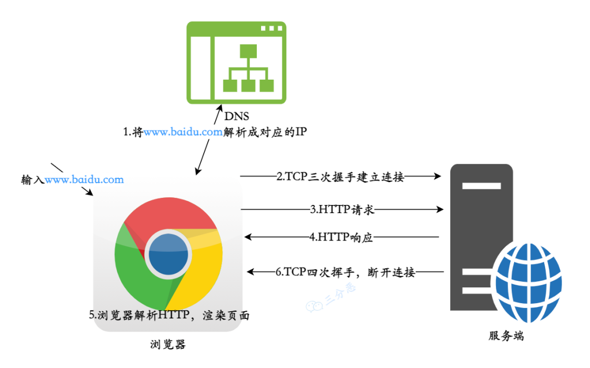

# 计算机网络概述

- 作者：李竹楠
- 日期：2023/11/24

## 计算机网络体系

1. OSI七层模型：一个理论上的网络通信模型
2. TCP/IP模型：实际上应用的网络通信模型
3. 五层网络模型：为了介绍网络原理而折中的网络通信模型

体系结构对比图如下：

### OSI七层模型

OSI 七层模型是国际标准化组织（International Organization for Standardization）制定的一个用于计算机或通信系统间互联的标准体系。

- 应用层：通过应用进程之间的交互来完成特定网络应用，应用层协议定义的是应用进程间通信和交互的规则，常见的协议有：HTTP、FTP 、SMTP、SNMP、DNS.
- 表示层：数据的表示、安全、压缩。确保一个系统的应用层所发送的信息可以被另一个系统的应用层读取。
- 会话层：建立、管理、终止会话，是**用户应用程序和网络**之间的接口。
- 传输层：提供源端与目的端之间提供可靠的透明数据传输，传输层协议为不同主机上运行的**进程**提供**逻辑通信**。
- 网络层：将**网络地址翻译成对应的物理地址**，实现不同网络之间的路径选择, 协议有 ICMP、IGMP、IP 等.
- 数据链路层：在物理层提供**比特流服务**的基础上，建立相邻结点之间的**数据链路**。
- 物理层：建立、维护、断开物理连接。

### TCP/IP模型

- 应用层：对应于 OSI 参考模型的（应用层、表示层、会话层）。
- 传输层: 对应 OSI 的传输层，为应用层实体提供端到端的通信功能，保证了数据包的**顺序传送**及数据的**完整性**。
- 网际层：对应于 OSI 参考模型的网络层，主要解决主机到主机的通信问题。
- 网络接口层：与 OSI 参考模型的数据链路层、物理层对应。

### 五层网络模型

- 应用层：对应于 OSI 参考模型的（应用层、表示层、会话层）。
- 传输层：对应 OSI 参考模型的的传输层
- 网络层：对应 OSI 参考模型的的网络层
- 数据链路层：对应 OSI 参考模型的的数据链路层
- 物理层：对应 OSI 参考模型的的物理层。

## 面试题

1. 数据在各层之间是怎么传输的？

    对于发送方而言，从上层到下层层层包装，对于接收方而言，从下层到上层，层层解开包装。

    1. 发送方的应用进程向接收方的应用进程传送数据
    2. AP 先将数据交给本主机的应用层，应用层加上本层的控制信息 H5 就变成了下一层的数据单元
    3. 传输层收到这个数据单元后，加上本层的控制信息 H4，再交给网络层，成为网络层的数据单元
    4. 到了数据链路层，控制信息被分成两部分，分别加到本层数据单元的首部（H2）和尾部（T2）
    5. 最后的物理层，进行比特流的传输

    

    这个过程类似写信，写一封信，每到一层，就加一个信封，写一些地址的信息。到了目的地之后，又一层层解封，传向下一个目的地。

2. 从浏览器地址栏输入 url 到显示主页的过程？

    1. DNS 解析：将域名解析成对应的 IP 地址。
    2. TCP 连接：与服务器通过三次握手，建立 TCP 连接
    3. 向服务器发送 HTTP 请求
    4. 服务器处理请求，返回 HTTp 响应
    5. 浏览器解析并渲染页面
    6. 断开连接：TCP 四次挥手，连接结束

    