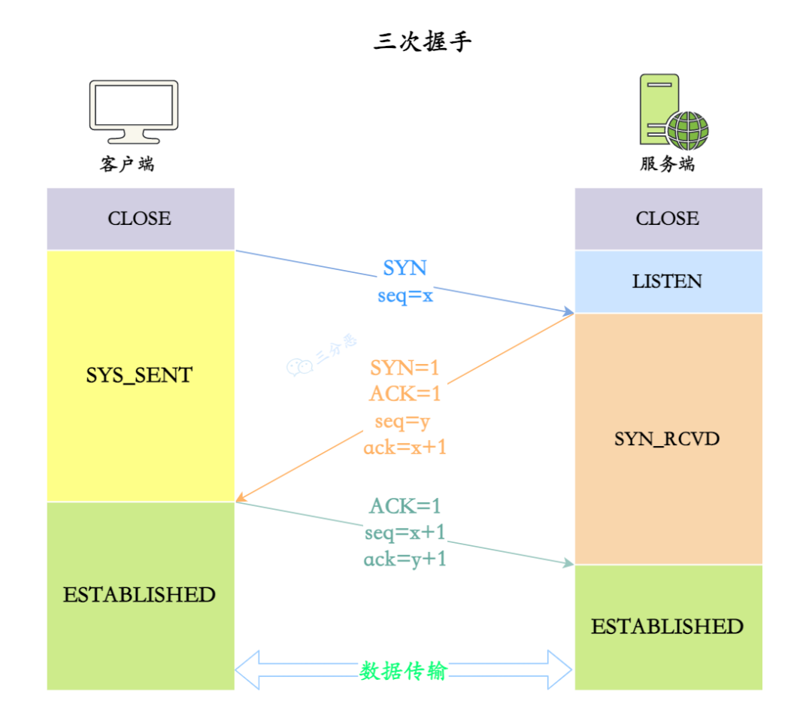
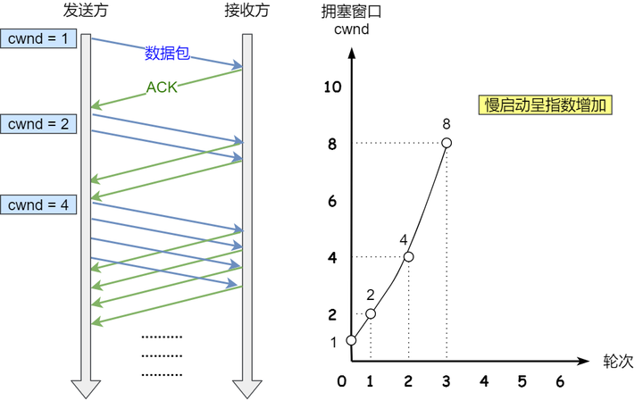

# 传输层

- 编辑：李竹楠
- 日期：2023/11/29

## 1. 概述

网络层只把分组发送到目的主机，但是真正通信的并不是主机而是主机中的进程。传输层提供了进程间的逻辑通信，传输层向高层用户屏蔽了下面网络层的核心细节，使应用程序看起来像是在两个传输层实体之间有一条端到端的逻辑通信信道。

该协议主要包括TCP和UDP协议。

## 2. TCP协议

### 2.1 TCP首部格式


- 源端口号：表示发送端的端口号，字段长 16 位。
- 目的端口号：表示接收端端口号，字段长度 16 位。
- 序号：字段长 32 位。序列号是指发送数据的位置。每发送一次数据，就累加一次该数据字节数的大小。序列号不会从 0 开始，是在建立连接的时候由计算机随机生成一个数作为初始值，通过 SYN 包传给接收端主机。
- 确认号：长度是 32 位。是指下一次应该收到的数据的序列号。发送端收到这个确认应答以后可以认定这个序号之前的数据都已经被正常接收。
- 数据偏移：表示数据开始的地方离 TCP 起始处有多远。实际上也就是表示 TCP 首部的长度。
- 保留：该字段是为了以后扩展时使用，长度是 4 位。
- 控制位：长度为 8 位。每一位从左到右分别是URG、ACK、PSH、RST、SYN、FIN。具体我会在讲解 TCP 三次握手和四次挥手再重点说明。
- 窗口大小：窗口值作为接收方让发送方设置其发送窗口的依据。之所以要有这个限制，是因为接收方的数据缓存空间是有限的。
- 校验和：由发送端填充，接收端对TCP报文段执行CRC算法以检验TCP报文段在传输过程中是否损坏。注意，这个校验不仅包括TCP头部，也包括数据部分。这也是TCP可靠传输的一个重要保障。
- 紧急指针：该字段表示本报文中紧急数据的指针。从数据部分的首位到紧急指针所指位置为止为紧急数据。
- 选项：用于提高 TCP 的传输性能，是可变长的可选信息。最多包含 40 字节。

#### 2.1.1 面试题

1. 详细说一下 TCP 的三次握手机制

> TCP 提供面向连接的服务，在传送数据前必须建立连接，TCP 连接是通过三次握手建立的。下图是三次握手示意图
> 
> 过程如下：
> 1. 最开始，客户端和服务端都处于```CLOSE```状态，服务端监听客户端的请求，进入```LISTEN```状态
> 2. 客户端端发送连接请求，**第一次握手**```(SYN=1, seq=x)```，发送完毕后，客户端就进入```SYN_SENT```状态
> 3. 服务端确认连接，**第二次握手**```(SYN=1, ACK=1, seq=y, ACKnum=x+1)```，发送完毕后，服务器端就进入```SYN_RCV```状态
> 4. 客户端收到服务端的确认之后，再次向服务端确认，这就是**第三次握手**```(ACK=1，ACKnum=y+1)```，发送完毕后，客户端进入```ESTABLISHED```状态，当服务器端接收到这个包时，也进入```ESTABLISHED```状态

2. TCP握手为什么是三次，为什么不能是两次？不能是四次？

回答为什么是两次的时候，要先明白为什么要三次握手，还说句话说，为什么三次握手成功后才算是可靠的链路。
> **检查双方是否都具备发送和接收数据的能力**：TCP 是基于全双工的可信传输协议，也就意味着数据可以同时在两个方向上传输。在建立三次握手的过程中也就是在检验双方发送和接收数据的能力是否具备。
> - **第一次握手**：这时候客户端知道自己具备了发送数据的能力，但还不知道服务端是否有接收和发送数据的能力。
> - **第二次握手**：当服务端接收到报文后，回复确认报文，此时服务端知道客户端具有发送报文的能力，并且知道自己具有接收和发送数据的能力，但还不知道客户端是否具有接收数据的能力。
> - **第三次握手**：当客户端收到服务端的确认报文后，知道服务端具备接收和发送数据的能力，因为服务端还不知道客户端具备接收数据的能力，所以还需要发送一个确认报文，告知服务端自己是具有接收能力的。
>
> **防止重复连接**：
> 在网络状况比较复杂或比较差的情况下，发送方可能会连续发送多次建立连接的请求。
> 如果 TCP 握手的次数只有两次，那么接收方只能选择接受请求或者拒绝连接请求，但并不清楚这次的请求是否是正常的请求。
> 如果是三次握手的话，客户端在接收到服务端```seq+1```的消息之后，通过对比，就可以判断当前连接是否是历史连接。
> 如果是的话就会发送终止报文给服务端终止连接。如果不是历史连接就发送确认报文建立连接。

上文可以得到一个小总结，1. 检验各方对数据接收发送的能力。2. 防止重复连接（同样解释了为什么不能只是两次握手）。那么只有两次还有其他问题？
> 有两个主要原因：
> - 首先，为了防止服务器端开启一些无用的连接增加服务器开销
> 由于网络传输是有延时的(要通过网络光纤和各种中间代理服务器)，在传输的过程中，比如客户端发起了SYN=1的第一次握手。
> 如果服务器端就直接创建了这个连接并返回包含SYN、ACK和Seq等内容的数据包给客户端，并且这个数据包因为网络传输的原因丢失了，丢失之后客户端就一直没有接收到服务器返回的数据包。
> 如果没有第三次握手告诉服务器端客户端收的到服务器端传输的数据的话，服务器端是不知道客户端有没有接收到服务器端返回的信息的。
> 所以，造成的后果就是，服务端就认为这个连接是可用的，端口就一直开着，等到客户端因超时重新发出请求时，服务器就会重新开启一个端口连接。这样一来，就会有很多无效的连接端口白白地开着，导致资源的浪费。如下图：
> 
> - 另外，防止已失效的连接请求报文段突然又传送到了服务端，因而产生错误（这个就是上文提到的**防止重复链接**）。
> 
> 所以我们需要“第三次握手”来确认这个过程：
> 通过第三次握手的数据告诉服务端，客户端有没有收到服务器“第二次握手”时传过去的数据，以及这个连接的序号是不是有效的。
> 若发送的这个数据是“收到且没有问题”的信息，接收后服务器就正常建立TCP连接，否则建立TCP连接失败，服务器关闭连接端口。由此减少服务器开销和接收到失效请求发生的错误。
> 为什么不是四次？
> 简单说，就是三次挥手已经足够创建可靠的连接，没有必要再多一次握手导致花费更多的时间建立连接。

3. 三次握手中每一次没收到报文会发生什么情况？

> - 第一次握手服务端未收到```SYN```报文
> 服务端不会进行任何的动作，而客户端由于一段时间内没有收到服务端发来的确认报文，等待一段时间后会重新发送```SYN```报文，如果仍然没有回应，会重复这个过程，直到发送次数超过最大重传次数限制，就会返回连接建立失败。
> - 第二次握手客户端未收到服务端响应的```ACK```报文 
> 客户端会继续重传，直到次数限制；而服务端此时会阻塞在```accept()```处，等待客户端发送```ACK```报文
> - 第三次握手服务端未收到客户端发送过来的```ACK```报文
> 服务端同样会采用类似客户端的超时重传机制，如果重试次数超过限制，则```accept()```调用返回-1，服务端建立连接失败；而此时客户端认为自己已经建立连接成功，因此开始向服务端发送数据，但是服务端的```accept()```系统调用已经返回，此时不在监听状态，因此服务端接收到客户端发送来的数据时会发送```RST```报文给客户端，消除客户端单方面建立连接的状态。

在之前的开发过程中使用TCP会遇到非常多的异常，基本都与上面三种情况相关。
所以需要重新捋一下其中的逻辑。一般情况下，正常关闭是需要调用```Socket.close()```函数，经过四次挥手以及FIN标记，服务器和客户端断开连接。这是正常情况。但是往往会出现异常，比如JAVA中常见的```java.net.SocketException: Connection reset```。出现这个异常是因为TCP标记位置为了RST。这个问题就出现在服务器断开连接不接受数据，如果此时客户端还往服务器发送数据，但是发现此时Socket已经 关闭了，则会返回RST标志给客户端。
另外，还有一个常见的错误```Connection reset by peer```，虽然TCP的标记位都是RST，但是与上面的```Connection Reset```是有区别的：
- 一端退出，但退出时并未关闭该连接，另一端如果在从连接中读数据则抛出```Connection Reset```：服务器返回了RST时，如果此时客户端正在从Socket的输出流中**读数据**则会提示```Connection reset```
- 如果一端的Socket被关闭（或主动关闭，或因为异常退出而 引起的关闭），另一端仍发送数据，发送的第一个数据包引发```Connection reset by peer```：服务器返回了RST时，如果此时客户端正在往Socket的输入流中**写数据**则会提示 ```Connection reset by peer```

这类问题比较容易排查，就是一方断开连接了，可以对应上文的没收到报文的不同情况进行排查。
解决方案有以下几种：（埋坑，后续补上）

4. 第二次握手传回了```ACK```，为什么还要传回```SYN```？

> ```ACK```是为了告诉客户端传来的数据已经接收无误。
> 而传回```SYN```是为了告诉客户端，服务端响应的确实是客户端发送的报文。

5. 第 3 次握手可以携带数据吗？

> 第 3 次握手是可以携带数据的。
> 此时客户端已经处于```ESTABLISHED```状态。对于客户端来说，它已经建立连接成功，并且确认服务端的接收和发送能力是正常的。
> 第一次握手不能携带数据是出于安全的考虑，因为如果允许携带数据，攻击者每次在```SYN```报文中携带大量数据，就会导致服务端消耗更多的时间和空间去处理这些报文，会造成CPU和内存的消耗。

6. 说说半连接队列和SYN Flood攻击的关系？

> 首先，先说一下什么是半连接队列。TCP进入三次握手前，服务端会从```CLOSED```状态变为```LISTEN```状态, 同时在内部创建了两个队列：半连接队列（```SYN```队列）和全连接队列（```ACCEPT```队列）。
> 顾名思义，半连接队列存放的是三次握手未完成的连接，全连接队列存放的是完成三次握手的连接。
> TCP 三次握手时，客户端发送```SYN```到服务端，服务端收到之后，便回复```ACK```和```SYN```，状态由```LISTEN```变为```SYN_RCVD```，此时这个连接就被推入了```SYN```队列，即半连接队列。
> 当客户端回复```ACK```, 服务端接收后，三次握手就完成了。这时连接会等待被具体的应用取走，在被取走之前，它被推入```ACCEPT```队列，即全连接队列。
> SYN Flood就是针对半连接队列发起的攻击。SYN Flood是一种典型的```DDos```攻击，它在短时间内，伪造不存在的IP地址, 向服务器发送大量```SYN```报文。当服务器回复```SYN+ACK```报文后，不会收到 ACK 回应报文，那么```SYN```队列里的连接旧不会出对队，久⽽久之就会占满服务端的```SYN```接收队列（半连接队列），使得服务器不能为正常⽤户服务。
> 
> 解决方案：
> 主要有两种：1. SYN cookie 2. SYN Proxy 防火墙
> - SYN cookie：在收到```SYN```包后，服务器根据一定的方法，以数据包的源地址、端口等信息为参数计算出一个cookie值作为自己的 SYNACK 包的序列号，回复```SYN+ACK```后，服务器并不立即分配资源进行处理，等收到发送方的 ACK 包后，重新根据数据包的源地址、端口计算该包中的确认序列号是否正确，如果正确则建立连接，否则丢弃该包。
> - SYN Proxy 防火墙：服务器防火墙会对收到的每一个 SYN 报文进行代理和回应，并保持半连接。等发送方将```ACK```包返回后，再重新构造```SYN```包发到服务器，建立真正的TCP连接。

7. 说说 TCP 四次挥手的过程？

> 
> 数据传输结束之后，通信双方都可以主动发起断开连接请求，这里假定客户端发起。
> 1. 客户端发送释放连接报文，**第一次挥手**```(FIN=1，seq=u)```，发送完毕后，客户端进入```FIN_WAIT_1```状态。
> 2. 服务端发送确认报文，**第二次挥手**```(ACK=1，ack=u+1,seq =v)```，发送完毕后，服务器端进入```CLOSE_WAIT```状态，客户端接收到这个确认包之后，进入```FIN_WAIT_2```状态。
> 前两次挥手，既让服务端知道了客户端想释放连接，也让客户端知道了服务端了解了自己想要释放连接的请求。于是，可以确认关闭客户端到服务端方向上的连接的。
> 3. 服务端发送释放连接报文，**第三次挥手**```(FIN=1，ACK1,seq=w,ack=u+1)```，发送完毕后，服务器端进入```LAST_ACK```状态，等待来自客户端的最后一个```ACK```。
> 4. 客户端发送确认报文，**第四次挥手**```(ACK=1，seq=u+1,ack=w+1)```，客户端接收到来自服务器端的关闭请求，发送一个确认包，并进入```TIME_WAIT```状态，等待了某个固定时间（两个最大段生命周期，2MSL，2 Maximum Segment Lifetime）之后，没有收到服务器端的ACK，认为服务器端已经正常关闭连接，于是自己也关闭连接，进入```CLOSED```状态。服务器端接收到这个确认包之后，关闭连接，进入```CLOSED```状态。

8. TCP 挥手为什么需要四次呢？

> 关闭连接时，客户端向服务端发送```FIN```时，仅仅表示客户端不再发送数据了但是还能接收数据。
> 服务端收到客户端的```FIN```报文时，先回一个```ACK```应答报文，而**服务端可能还有数据需要处理和发送，等服务端不再发送数据时（这就是为什么服务端需要进入```CLOSED_WAIT```状态）**，才发送```FIN```报文给客户端来表示同意现在关闭连接。
> 服务端通常需要等待完成数据的发送和处理，所以服务端的```ACK```和```FIN```一般都会分开发送，从而比三次握手导致多了一次。

9. TCP 四次挥手过程中，为什么需要等待 2MSL, 才进入 CLOSED 关闭状态？

> 两个问题：
> - 为什么要等待？
> 1. **为了保证客户端发送的最后一个```ACK``` 报文段能够到达服务端。** 这个```ACK```报文段有可能丢失，因而使处在```LAST_ACK```状态的服务端就收不到对已发送的```FIN + ACK```报文段的确认。服务端会超时重传这个```FIN + ACK```报文段，而客户端就能在2MSL内（超时 + 1MSL 传输）收到这个重传的```FIN + ACK```报文段。接着客户端重传一次确认，重新启动2MSL计时器。最后，客户端和服务器都正常进入到```CLOSED```状态。
> **假设客户端最后一次发送的```ACK```包在传输的时候丢失了，由于 TCP 协议的超时重传机制，服务端将重发```FIN```报文，如果客户端没有维持```TIME-WAIT```状态而直接关闭的话，当收到服务端重新发送的```FIN```包时，客户端就会使用```RST```包来响应服务端，导致服务端以为有错误发生，然而实际关闭连接过程是正常的。**
> 2. **防止已失效的连接请求报文段出现在本连接中。** 客户端在发送完最后一个```ACK```报文段后，再经过时间2MSL，就可以使本连接持续的时间内所产生的所有报文段都从网络中消失。这样就可以使下一个连接中不会出现这种旧的连接请求报文段。
> **如果客户端收到服务端的```FIN```报文之后立即关闭连接，但是此时服务端对应的端口并没有关闭，如果客户端在相同端口建立新的连接，可能会导致新连接收到旧连接残留的数据包，导致不可预料的异常发生。**
>
> - 为什么要等待2MSL？
> MSL 是 Maximum Segment Lifetime，报⽂最⼤⽣存时间，它是任何报⽂在⽹络上存在的最⻓时间，超过这个时间报⽂将被丢弃。
> TIME_WAIT 等待 2 倍的 MSL，⽐较合理的解释是：**⽹络中可能存在来⾃发送⽅的数据包，当这些发送⽅的数据包被接收⽅处理后⼜会向对⽅发送响应，所以⼀来⼀回需要等待 2 倍的时间。**
> 
> ⽐如如果被动关闭⽅没有收到断开连接的最后的```ACK```报⽂，就会触发超时重发```Fin```报⽂，另⼀⽅接收到```FIN```后，会重发```ACK```给被动关闭⽅，⼀来⼀去正好 2 个 MSL。

10. 保活计时器有什么用？

> 除时间等待计时器外，TCP还有一个保活计时器（keepalive timer）。
> 设想这样的场景：客户已主动与服务器建立了TCP连接。但后来客户端的主机突然发生故障。显然，服务器以后就不能再收到客户端发来的数据。因此，应当有措施使服务器不要再白白等待下去。这就需要使用保活计时器了。
> 服务器每收到一次客户端的数据，就重新设置保活计时器，时间的设置通常是两个小时。若两个小时都没有收到客户端的数据，服务端就发送一个探测报文段，以后则每隔 75 秒钟发送一次。若连续发送 10 个探测报文段后仍然无客户端的响应，服务端就认为客户端出了故障，接着就关闭这个连接。

11. ```CLOSE_WAIT```和```TIME_WAIT```的状态和意义？

> ```CLOSE_WAIT``` 状态有什么意义？
> 服务端收到客户端关闭连接的请求并确认之后，就会进入```CLOSE_WAIT```状态。此时服务端可能还有一些数据没有传输完成，因此不能立即关闭连接，而```CLOSE_WAIT```状态就是为了保证服务端在关闭连接之前将待发送的数据处理完。
>
> ```TIME_WAIT```有什么意义？
> ```TIME_WAIT```状态发生在第四次挥手，当客户端向服务端发送```ACK```确认报文后进入```TIME_WAIT```状态。
> 意义如上文提到的：1. 保证连接正确关闭。2. 防⽌旧连接的数据包。

### 2.2 关于TCP是如何保证可靠性的

TCP协议是如何保证可靠性的？

- **连接管理**：TCP 使用三次握手和四次挥手保证可靠地建立连接和释放连接，这里就不用多说了。
- **校验和**：TCP 将保持它首部和数据的检验和。这是一个端到端的检验和，目的是检测数据在传输过程中的任何变化。如果接收端的检验和有差错，TCP 将丢弃这个报文段和不确认收到此报文段。
- **序列号/确认应答**：TCP 给发送的每一个包进行编号，接收方会对收到的包进行应答，发送方就会知道接收方是否收到对应的包，如果发现没有收到，就会重发，这样就能保证数据的完整性。
- **流量控制**：TCP 连接的每一方都有固定大小的缓冲空间，TCP 的接收端只允许发送端发送接收端缓冲区能接纳的数据。当接收方来不及处理发送方的数据，能提示发送方降低发送的速率，防止包丢失。TCP 使用的流量控制协议是可变大小的滑动窗口协议。（TCP 利用滑动窗口实现流量控制）
- **最大消息长度**：在建立 TCP 连接的时候，双方约定一个最大的长度（MSS）作为发送的单位，重传的时候也是以这个单位来进行重传。理想的情况下是该长度的数据刚好不被网络层分块。
- **超时重传**：超时重传是指发送出去的数据包到接收到确认包之间的时间，如果超过了这个时间会被认为是丢包了，需要重传。
- **拥塞控制**：如果网络非常拥堵，此时再发送数据就会加重网络负担，那么发送的数据段很可能超过了最大生存时间也没有到达接收方，就会产生丢包问题。为此 TCP 引入慢启动机制，先发出少量数据，就像探路一样，先摸清当前的网络拥堵状态后，再决定按照多大的速度传送数据。

下面尽量以一个因果逻辑的顺序解释。

#### 2.2.1 重传机制

在TCP协议中，实现可靠传输的方式之一是通过**序列号和确认应答**，过程如下图：


在 TCP 中，当发送端的数据到达接收主机时，接收端主机会返回一个确认应答消息，表示已收到消息。但在错综复杂的网络，并不一定能如上图那么顺利能正常的数据传输，万一数据在传输过程中丢失了呢？所以 TCP 针对数据包丢失的情况，会用**重传机制**解决。有以下常见的重传机制：

- 超时重传
- 快速重传
- SACK
- D-SACK

##### 2.2.1.1 超时重传

重传机制的其中一个方式，就是在发送数据时，设定一个定时器，当超过指定的时间后，没有收到对方的```ACK```确认应答报文，就会重发该数据，也就是我们常说的超时重传。

TCP 会在以下两种情况发生超时重传：

- 数据包丢失
- 确认应答丢失


那么超时时间应该设置为多少？
> 
> 一个RTT（Round-Trip Time 往返时延）就是数据从网络一端传送到另一端所需的时间，也就是包的往返时间。
> 超时重传时间是以RTO（Retransmission Timeout 超时重传时间）表示。
> 假设在重传的情况下，超时时间RTO较长或较短时，会发生什么事情呢？
> 
> - 当超时时间 RTO 较大时，重发就慢，丢了老半天才重发，没有效率，性能差；
> - 当超时时间 RTO 较小时，会导致可能并没有丢就重发，于是重发的就快，会增加网络拥塞，导致更多的超时，更多的超时导致更多的重发。
> 精确的测量超时时间 RTO 的值是非常重要的，这可让我们的重传机制更高效。
> 根据上述的两种情况，我们可以得知，超时重传时间RTO的值应该略大于报文往返RTT的值。
> 
> 从以上的情况来看，并不是很复杂，根据RTT确定一个RTO就可以，但是事实上，由于网络是实时变化的，所以RTT也是**动态变化的**，因此，RTO也是一个**变化的值**。
> 以Linux系统为例，说明如何计算RTO。
> 1. 需要 TCP 通过采样RTT的时间，然后进行加权平均，算出一个平滑RTT(SRTT)的值，而且这个值还是要不断变化的，因为网络状况不断地变化。
> 2. 除了采样RTT，还要采样RTT的波动范围，这样就避免如果RTT有一个大的波动的话，很难被发现的情况。
> 3. 然后根据以下公式计算得出RTO，中间的很多参数是从实验中得到的。
> $$
> \begin{align}
> \begin{cases}
> SRTT &= R1 \\
> DevRTT &= R1/2 \\
> RTO &= \mu * SRTT + \epsilon * DevRTT \\
> \end{cases} \\
> \begin{cases}
> SRTT &= SRTT + \alpha(RTT - SRTT) \\
> DevRTT &= (1-\beta)DevRTT + \beta(RTT - SRTT) \\
> RTO &= \mu * SRTT + \epsilon * DevRTT
> \end{cases}
> \end{align} 
> $$
> 其中$SRTT$是计算平滑的RTT，$DevRTT$是计算平滑的RTT与最新RTT的差距。
> 在 Linux 下，$α = 0.125，β = 0.25， μ = 1，∂ = 4$。别问怎么来的，问就是大量实验中调出来的。
> 如果超时重发的数据，再次超时的时候，又需要重传的时候，**TCP 的策略是超时间隔加倍**。
> 也就是**每当遇到一次超时重传的时候，都会将下一次超时时间间隔设为先前值的两倍。两次超时，就说明网络环境差，不宜频繁反复发送**。

超时触发重传存在的问题是，超时周期可能相对较长。那是不是可以有更快的方式呢？

于是就可以用「快速重传」机制来解决超时重发的时间等待。

##### 2.2.1.2 快速重传

TCP 还有另外一种快速重传（Fast Retransmit）机制，**它不以时间为驱动，而是以数据驱动重传**。原理如下图：


在上图，发送方发出了 1，2，3，4，5 份数据：
1. 第一份 Seq1 先送到了，于是就 Ack 回 2；
2. 结果 Seq2 因为某些原因没收到，Seq3 到达了，于是还是 Ack 回 2；
3. 后面的 Seq4 和 Seq5 都到了，但还是 Ack 回 2，因为 Seq2 还是没有收到；
4. **发送端收到了三个 Ack = 2 的确认，知道了 Seq2 还没有收到，就会在定时器过期之前，重传丢失的 Seq2。**
5. 最后，收到了 Seq2，此时因为 Seq3，Seq4，Seq5 都收到了，于是 Ack 回 6 。

所以，快速重传的工作方式是当收到三个相同的 ACK 报文时，会在定时器过期之前，重传丢失的报文段。

快速重传机制只解决了一个问题，就是超时时间的问题，但是它依然面临着另外一个问题。**就是重传的时候，是重传之前的一个，还是重传所有的问题**。

比如对于上面的例子，是重传 ```Seq2``` 呢？还是重传```Seq2, Seq3, Seq4, Seq5 ```呢？因为发送端并不清楚这连续的三个```Ack 2```是谁传回来的。根据 TCP 不同的实现，以上两种情况都是有可能的。

为了解决不知道该重传哪些TCP报文，于是就有SACK方法。

##### 2.2.1.3 SACK

为了解决快速重传不知道重传那些报文的问题，实现了SACK(Selective Acknowledgment 选择性确认)。

这种方式需要在TCP头部选项字段里加一个SACK的东西，它**可以将缓存的地图发送给发送方**，这样发送方就可以知道哪些数据收到了，哪些数据没收到，知道了这些信息，就可以只重传丢失的数据。

如下图，发送方收到了三次同样的 ACK 确认报文，于是就会触发快速重发机制，通过 SACK 信息发现只有 200~299 这段数据丢失，则重发时，就只选择了这个 TCP 段进行重复。


如果要支持SACK，必须双方都要支持。在Linux 下，可以通过```net.ipv4.tcp_sack```参数打开这个功能（Linux 2.4 后默认打开）。

##### 2.2.1.4 Duplicate SACK(D-SACK)

主要**使用了SACK来告诉发送方有哪些数据被重复接收了**。

用一下两个例子说明D-SACK的作用：

> 1. ACK丢包
> 
> 接收方发给发送方的两个```ACK```确认应答都丢失了，所以发送方超时后，重传第一个数据包（3000 ~ 3499）
> 于是接收方发现数据是重复收到的，于是回了一个```SACK = 3000~3500```，告诉发送方3000~3500的数据早已被接收了，因为```ACK```都到了4000了，已经意味着 4000 之前的所有数据都已收到，所以这个SACK就代表着D-SACK。
> 这样发送方就知道了，数据没有丢，是接收方的 ACK 确认报文丢了
>
> 2. 网络延时
> 
> 数据包（1000~1499）被网络延迟了，导致发送方没有收到```Ack 1500```的确认报文。
> 而后面报文到达的三个相同的```ACK```确认报文，就触发了快速重传机制，但是在重传后，被延迟的数据包（1000~1499）又到了接收方；
> **所以接收方回了一个SACK=1000~1500，因为```ACK```已经到了3000，所以这个SACK是D-SACK，表示收到了重复的包**
> 这样发送方就知道快速重传触发的原因不是发出去的包丢了，也不是因为回应的```ACK```包丢了，而是因为网络延迟了

D-SACK 有这么几个好处：

1. 可以让发送方知道，是发出去的包丢了，还是接收方回应的```ACK```包丢了;
2. 可以知道是不是发送方的数据包被网络延迟了;
3. 可以知道网络中是不是把发送方的数据包给复制了;

在Linux下可以通过```net.ipv4.tcp_dsack```参数开启/关闭这个功能（Linux 2.4 后默认打开）。

#### 2.2.2 滑动窗口

- 为什么要引入滑动窗口？
> TCP通过应答确认保证链路的稳定可靠，这种机制就像是问一句回答一句，虽然保证了稳定性，但是同时带来了效率低的弊端。比如，有其他任务正在处理，如果等待后进行应答，**数据包的往返时间越长，通信的效率就越低**。
> 
> 为解决这个问题，TCP 引入了**窗口**这个概念。即使在往返时间较长的情况下，它也不会降低网络通信的效率。
> 那么有了窗口，就可以指定窗口大小，窗口大小就是指无需等待确认应答，而可以继续发送数据的最大值。

- 基本逻辑是什么？
> 窗口的实现实际上是操作系统开辟的一个缓存空间，发送方主机在等到确认应答返回之前，必须在缓冲区中保留已发送的数据。如果按期收到确认应答，此时数据就可以从缓存区清除。假设窗口大小为3个 TCP 段，那么发送方就可以连续发送3个TCP段，并且中途若有```ACK```丢失，可以通过下一个确认应答进行确认。如下图：
> 
> 图中的 ACK 600 确认应答报文丢失，也没关系，因为可以通过下一个确认应答进行确认，只要发送方收到了 ACK 700 确认应答，就意味着 700 之前的所有数据接收方都收到了。这个模式就叫**累计确认**或者**累计应答**。

- 窗口大小由哪一方决定？
> TCP头里有一个字段叫```Window```，也就是窗口大小。**这个字段是接收端告诉发送端自己还有多少缓冲区可以接收数据。于是发送端就可以根据这个接收端的处理能力来发送数据，而不会导致接收端处理不过来**。所以，通常窗口的大小是由**接收方**的窗口大小来决定的。发送方发送的数据大小不能超过接收方的窗口大小，否则接收方就无法正常接收到数据。

- 滑动窗口的工作过程？
> 我们先来看看发送方的窗口，下图就是发送方缓存的数据，根据处理的情况分成四个部分，其中深蓝色方框是发送窗口，紫色方框是可用窗口：
> 
> \#1 是已发送并收到 ACK确认的数据：1~31 字节
> \#2 是已发送但未收到 ACK确认的数据：32~45 字节
> \#3 是未发送但总大小在接收方处理范围内（接收方还有空间）：46~51字节
> \#4 是未发送但总大小超过接收方处理范围（接收方没有空间）：52字节以后
> 在下图，当发送方把数据全部都一下发送出去后，可用窗口的大小就为 0 了，表明可用窗口耗尽，在没收到```ACK```确认之前是无法继续发送数据了。
> 
> 在下图，当收到之前发送的数据 32~36 字节的```ACK```确认应答后，如果发送窗口的大小没有变化，**则滑动窗口往右边移动 5 个字节，因为有 5 个字节的数据被应答确认**，接下来 52~56 字节又变成了可用窗口，那么后续也就可以发送 52~56 这 5 个字节的数据了。
> 

- 程序是如何表示发送方的四个部分的呢？
> TCP 滑动窗口方案使用三个指针来跟踪在四个传输类别中的每一个类别中的字节。其中两个指针是绝对指针（指特定的序列号），一个是相对指针（需要做偏移）。
> 
> - ```SND.WND```：表示发送窗口的大小（大小是由接收方指定的）； 
> - ```SND.UNA```：是一个绝对指针，它指向的是已发送但未收到确认的第一个字节的序列号，也就是#2的第一个字节。 
> - ```SND.NXT```：也是一个绝对指针，它指向未发送但可发送范围的第一个字节的序列号，也就是#3的第一个字节。 
> 
> 指向#4的第一个字节是个相对指针，它需要```SND.UNA```指针加上```SND```.```WND```大小的偏移量，就可以指向#4的第一个字节了。
> 那么可用窗口大小的计算就可以是：
> $$WINDOWS = SND.WND -(SND.NXT - SND.UNA)$$

- 接收方的滑动窗口是如何工作的？
> 接下来我们看看接收方的窗口，接收窗口相对简单一些，根据处理的情况划分成三个部分：
> - \#1 + #2 是已成功接收并确认的数据（等待应用进程读取）
> - \#3 是未收到数据但可以接收的数据
> - \#4 未收到数据并不可以接收的数据
> 
> 其中三个接收部分，使用两个指针进行划分:
> ```RCV.WND```：表示接收窗口的大小，它会通告给发送方。
> ```RCV.NXT```：是一个指针，它指向期望从发送方发送来的下一个数据字节的序列号，也就是 #3 的第一个字节。
> 指向 #4 的第一个字节是个相对指针，它需要 RCV.NXT 指针加上 RCV.WND 大小的偏移量，就可以指向 #4 的第一个字节了

- 接收窗口和发送窗口的大小是相等的吗？
> 并不是完全相等，接收窗口的大小是**约等于**发送窗口的大小的。因为滑动窗口并不是一成不变的。比如，当接收方的应用进程读取数据的速度非常快的话，这样的话接收窗口可以很快的就空缺出来。那么新的接收窗口大小，是通过 TCP 报文中的```Windows```字段来告诉发送方。那么这个传输过程是存在时延的，所以接收窗口和发送窗口是约等于的关系。

#### 2.2.3 流量控制

以上是对于发送方和接收方如何保证传输的稳定性。基于稳定性会逐步提高传输效率，但是也要考虑到接收方的处理能力。如果一直给接收方发送数据，但接收方处理不过来，也会出发重发机制，导致网络流量的浪费。

为了解决这个问题，TCP协议提供流量控制机制，**可以让发送方根据接收方的实际接收能力控制发送的数据量**。以下分别通过几个例子探究网络中流量的情况。

这里举一个正常的例子如下图：
> - 客户端是接收方，服务端是发送方
> - 假设接收窗口和发送窗口相同，都为 200
> - 假设两个设备在整个传输过程中都保持相同的窗口大小，不受外界影响
> 
> 
> 
> 根据上图的流量控制，说明下每个过程：
> 1. 服务端收到请求报文后，发送确认报文和80字节的数据，于是可用窗口Usable减少为120字节，同时```SND.NXT```指针也向右偏移80字节后，指向 321，**这意味着下次发送数据的时候，序列号是321**。
> 2. 客户端收到80字节数据后，于是接收窗口往右移动80字节，```RCV.NXT```也就指向321，这意味着客户端期望的下一个报文的序列号是321，接着发送确认报文给服务端。
> 3. 服务端再次发送了120字节数据，于是可用窗口耗尽为0，服务端无法再继续发送数据。
> 4. 客户端收到120字节的数据后，于是接收窗口往右移动120字节，```RCV.NXT```也就指向441，接着发送确认报文给服务端。
> 5. 服务端收到对80字节数据的确认报文后，```SND.UNA```指针往右偏移后指向321，于是可用窗口Usable增大到 80。
> 6. 服务端收到对120字节数据的确认报文后，```SND.UNA```指针往右偏移后指向 441，于是可用窗口Usable增大到200。
> 7. 服务端可以继续发送了，于是发送了160字节的数据后，```SND.NXT```指向 601，于是可用窗口Usable减少到40。
> 8. 客户端收到160字节后，接收窗口往右移动了160字节，```RCV.NXT```也就是指向了601，接着发送确认报文给服务端。
> 9. 服务端收到对160字节数据的确认报文后，发送窗口往右移动了160字节，于是 ```SND.UNA```指针偏移了160后指向601，可用窗口Usable也就增大至了200。

前面的流量控制例子，我们假定了发送窗口和接收窗口是不变的，但是实际上，发送窗口和接收窗口中所存放的字节数，都是放在操作系统内存缓冲区中的，而操作系统的缓冲区，会被操作系统调整。当应用进程没办法及时读取缓冲区的内容时，也会对我们的缓冲区造成影响。

操作系统的缓冲区，是如何影响发送窗口和接收窗口的呢？这里使用一个例子如下图：当应用程序没有及时读取缓存时，发送窗口和接收窗口的变化。
> - 客户端作为发送方，服务端作为接收方，发送窗口和接收窗口初始大小为360；
> - 服务端非常的繁忙，当收到客户端的数据时，应用层不能及时读取数据。
> 
> 
> 
> 根据上图的流量控制，说明下每个过程：
> 1. 客户端发送140字节数据后，可用窗口变为220（360-140）。
> 2. 服务端收到140字节数据，**但是服务端非常繁忙，应用进程只读取了40个字节，还有100字节占用着缓冲区，于是接收窗口收缩到了260（360-100）**，最后发送确认信息时，将窗口大小通告给客户端。
> 3. 客户端收到确认和窗口通告报文后，发送窗口减少为260。
> 4. 客户端发送180字节数据，此时可用窗口减少到80。
> 5. 服务端收到180字节数据，**但是应用程序没有读取任何数据，这180字节直接就留在了缓冲区，于是接收窗口收缩到了80（260-180）**，并在发送确认信息时，通过窗口大小给客户端。
> 6. 客户端收到确认和窗口通告报文后，发送窗口减少为80。
> 7. 客户端发送80字节数据后，可用窗口耗尽。
> 8. 服务端收到80字节数据，**但是应用程序依然没有读取任何数据，这80字节留在了缓冲区，于是接收窗口收缩到了0**，并在发送确认信息时，通过窗口大小给客户端。
> 9. 客户端收到确认和窗口通告报文后，发送窗口减少为0。

可见最后窗口都收缩为 0 了，也就是发生了窗口关闭。当发送方可用窗口变为 0 时，发送方实际上会定时发送窗口探测报文，以便知道接收方的窗口是否发生了改变，这个内容后面会说，这里先简单提一下。另外，还有一个极端的例子：
> 当服务端系统资源非常紧张的时候，操心系统可能会直接减少了接收缓冲区大小，这时应用程序又无法及时读取缓存数据，那么这时候就有严重的事情发生了，会出现数据包丢失的现象。
> 
> 
>
> 根据上图的流量控制，说明下每个过程：
> 1. 客户端发送140字节的数据，于是可用窗口减少到了220。
> 2. **服务端因为现在非常的繁忙，操作系统于是就把接收缓存减少了120字节，当收到140字节数据后，又因为应用程序没有读取任何数据，所以140字节留在了缓冲区中，于是接收窗口大小从360收缩成了100**，最后发送确认信息时，通告窗口大小给对方。
> 3. 此时客户端因为还没有收到服务端的通告窗口报文，所以不知道此时接收窗口收缩成了100，客户端只会看自己的可用窗口还有220，所以客户端就发送了180字节数据，于是可用窗口减少到40。
> 4. 服务端收到了180字节数据时，**发现数据大小超过了接收窗口的大小，于是就把数据包丢失了。**
> 5. 客户端收到第2步时，服务端发送的确认报文和通告窗口报文，尝试减少发送窗口到100，把窗口的右端向左收缩了80，此时可用窗口的大小就会出现诡异的负值。
> 所以，如果发生了先减少缓存，再收缩窗口，就会出现丢包的现象。

为了防止这种情况发生，TCP规定是不允许同时减少缓存又收缩窗口的，而是采用先收缩窗口，过段时间再减少缓存，这样就可以避免了丢包情况。

##### 2.2.3.1 窗口关闭

在前面我们都看到了，TCP 通过让接收方指明希望从发送方接收的数据大小（窗口大小）来进行流量控制。

**如果窗口大小为 0 时，就会阻止发送方给接收方传递数据，直到窗口变为非 0 为止，这就是窗口关闭。**

窗口关闭存在什么危险？
> 接收方向发送方通告窗口大小时，是通过```ACK```报文来通告的。
> 那么，当发生窗口关闭时，接收方处理完数据后，会向发送方通告一个窗口非0的```ACK```报文，如果这个通告窗口的```ACK```报文在网络中丢失了，那麻烦就大了。
> 这会导致发送方一直等待接收方的非0窗口通知，接收方也一直等待发送方的数据，如不采取措施，这种相互等待的过程，会造成了死锁的现象。

如何解决窗口关闭？
> 为了解决这个问题，TCP为每个连接设有一个持续定时器，**只要TCP连接一方收到对方的零窗口通知，就启动持续计时器**。
> 如果持续计时器超时，就会发送**窗口探测(Window probe)报文**，而对方在确认这个探测报文时，给出自己现在的接收窗口大小。
> 
> - 如果接收窗口仍然为0，那么收到这个报文的一方就会重新启动持续计时器；
> - 如果接收窗口不是0，那么死锁的局面就可以被打破了。

窗口探测的次数一般为3次，每次大约30-60秒（不同的实现可能会不一样）。如果3次过后接收窗口还是0的话，有的TCP实现就会发```RST```报文来中断连接。

##### 2.2.3.2 糊涂窗口综合征

如果接收方太忙了，来不及取走接收窗口里的数据，那么就会导致发送方的发送窗口越来越小。到最后，**如果接收方腾出几个字节并告诉发送方现在有几个字节的窗口，而发送方会义无反顾地发送这几个字节，这就是糊涂窗口综合症**。要知道，我们的TCP+IP头有40个字节，为了传输那几个字节的数据，要达上这么大的开销，这太不经济了。考虑以下场景：

> 接收方的窗口大小是 360 字节，但接收方由于某些原因陷入困境，假设接收方的应用层读取的能力如下：
> - 接收方每接收 3 个字节，应用程序就只能从缓冲区中读取 1 个字节的数据；
> - 在下一个发送方的 TCP 段到达之前，应用程序还从缓冲区中读取了 40 个额外的字节；
> 
> 每个过程的窗口大小的变化，在图中都描述的很清楚了，可以发现窗口不断减少了，并且发送的数据都是比较小的了。
> 
> 所以，糊涂窗口综合症的现象是可以发生在发送方和接收方：
> - 接收方可以通告一个小的窗口
> - 而发送方可以发送小数据
> 
> 于是，要解决糊涂窗口综合症，就解决上面两个问题就可以了
> - 让接收方不通告小窗口给发送方
> - 让发送方避免发送小数据
> 
> 怎么让接收方不通告小窗口呢？
> 当窗口大小小于```min(MSS，1/2 * 缓存空间)``` ，也就是小于MSS与 $1/2$ 缓存大小中的最小值时，就会向发送方通告窗口为0，也就阻止了发送方再发数据过来。等到接收方处理了一些数据后，窗口大小>=MSS，或者接收方缓存空间有一半可以使用，就可以把窗口打开让发送方发送数据过来。
>
> 怎么让发送方避免发送小数据呢？
> 使用Nagle算法，该算法的思路是**延时处理**，它满足以下两个条件中的一条才可以发送数据：
> - 要等到窗口大小>= MSS或是数据大小>=MSS
> - 收到之前发送数据的 ack 回包
> 
> 只要没满足上面条件中的一条，发送方一直在囤积数据，直到满足上面的发送条件。另外Nagle算法默认是打开的，如果对于一些需要小数据包交互的场景的程序，比如，telnet或ssh这样的交互性比较强的程序，则需要关闭Nagle算法。
> 可以在```Socket```设置```TCP_NODELAY```选项来关闭这个算法（关闭Nagle算法没有全局参数，需要根据每个应用自己的特点来关闭）
> ```setsockopt(sock_fd, IPPROTO_TCP, TCP_NODELAY, (char *)&value, sizeof(int));```

#### 2.2.4 拥塞控制

为什么要有拥塞控制呀，不是有流量控制了吗？
> 前面的流量控制是避免发送方的数据填满接收方的缓存，但是并不知道网络的中发生了什么。一般来说，计算机网络都处在一个共享的环境。因此也有可能会因为其他主机之间的通信使得网络拥堵。
> **在网络出现拥堵时，如果继续发送大量数据包，可能会导致数据包时延、丢失等，这时TCP就会重传数据，但是一重传就会导致网络的负担更重，于是会导致更大的延迟以及更多的丢包，这个情况就会进入恶性循环被不断地放大。**
> 所以，TCP不能忽略网络上发生的事，它被设计成一个**无私**的协议，当网络发生拥塞时，TCP会自我牺牲，降低发送的数据量。
>
> <u>这个与流量控制的原因不同，流量控制是因为接收方无法接收更多的数据。而拥塞控制，接收方可能窗口没有达到极限，只是网络环境拥塞，导致发送方需要让步。</u>
>
> 于是，就有了**拥塞控制**，控制的目的就是**避免发送方的数据填满整个网络**。
> 为了在发送方调节所要发送数据的量，定义了一个叫做**拥塞窗口**的概念。

什么是拥塞窗口？和发送窗口有什么关系呢？
> 拥塞窗口```cwnd```是发送方维护的一个的状态变量，它会**根据网络的拥塞程度动态变化的**。
> 我们在前面提到过发送窗口```swnd```和接收窗口```rwnd```是约等于的关系，那么由于加入了拥塞窗口的概念后，此时发送窗口的值是```swnd = min(cwnd, rwnd)```，也就是拥塞窗口和接收窗口中的最小值。
> 拥塞窗口 cwnd 变化的规则：
> - 只要网络中没有出现拥塞，cwnd就会增大
> - 但网络中出现了拥塞，cwnd就减少

那么怎么知道当前网络是否出现了拥塞呢？
> 其实只要发送方没有在规定时间内接收到```ACK```应答报文，也就是**发生了超时重传，就会认为网络出现了用拥塞**。

拥塞控制算法涉及到以下阶段：

- 慢启动
- 拥塞避免
- 拥塞发生
- 快速恢复

##### 2.2.4.1 慢启动

连接刚一建立时，首先是慢启动的过程，慢启动是指一点点增加发送数据包的数量：**当发送方每收到一个```ACK```，拥塞窗口```cwnd```的大小就会加 1**。



可以看出慢启动算法，发包的个数是指数性的增长。那么慢启动时，拥塞窗口大小的上限是多少呢？
> 有一个叫慢启动门限```ssthresh```（slow start threshold）状态变量。一般来说```ssthresh```的大小是65535字节
> - 当 $cwnd < ssthresh$ 时，使用慢启动算法。
> - 当 $cwnd >= ssthresh$ 时，就会使用拥塞避免算法。

##### 2.2.4.2 拥塞避免

当拥塞窗口大小到达上线时，会进入**拥塞避免**阶段。由慢启动的**指数增长**变成了**线性增长**。


随着拥塞窗口大小的的增加，网络进入拥塞状态。这时会出现丢包，并且触发重传机制。一旦触发重传机制则进入拥塞发生阶段。

##### 2.2.4.3 拥塞发生

针对于不同的重传机制，对应的拥塞发送算法是不同的。

当发生超时重传时，会在用一个比较激进的方法：```ssthresh```设为$cwnd/2$，```cwd```重置为$1$：


接着，就重新开始慢启动，慢启动是会突然减少数据流的。造成的问题就是造成网络卡顿。但是可以采用更加平滑的方式：前面我们讲过快速重传算法。当接收方发现丢了一个中间包的时候，发送三次前一个包的```ACK```，于是发送端就会快速地重传，不必等待超时再重传。TCP 认为这种情况不严重，因为大部分没丢，只丢了一小部分，则```ssthresh```和```cwnd```变化如下：```cwnd = cwnd/2``` ，也就是设置为原来的一半；```ssthresh = cwnd```；进入快速恢复算法。

##### 2.2.4.4 快速恢复

快速重传和快速恢复算法一般同时使用，快速恢复算法是认为，你还能收到 3 个重复 ACK 说明网络也不那么糟糕，所以没有必要像 RTO 超时那么强烈。

进入快速恢复之前，cwnd 和 ssthresh 已被更新了：

1. ```cwnd = cwnd/2``` ，也就是设置为原来的一半;
2. ```ssthresh = cwnd```

然后，进入快速恢复算法如下：

1. 拥塞窗口```cwnd = ssthresh + 3```（ 3 的意思是确认有 3 个数据包被收到了）；
2. 重传丢失的数据包；
3. 如果再收到重复的```ACK```，那么```cwnd```增加 1；
4. 如果收到新数据的```ACK```后，把```cwnd```设置为第一步中的```ssthresh```的值，原因是该```ACK```确认了新的数据，说明从```duplicated ACK```时的数据都已收到，该恢复过程已经结束，可以回到恢复之前的状态了，也即再次进入拥塞避免状态；


也就是没有像超时重传一夜回到解放前，而是还在比较高的值，后续呈线性增长。

#### 2.2.5 面试题

1. 说说 TCP 的粘包和拆包？

> 什么是 TCP 粘包和拆包？
> TCP 是面向流，没有界限的一串数据。TCP 底层并不了解上层业务数据的具体含义，它会根据 TCP 缓冲区的实际情况进行包的划分，所以在业务上认为，**一个完整的包可能会被 TCP 拆分成多个包进行发送，也有可能把多个小的包封装成一个大的数据包发送**，这就是所谓的 TCP 粘包和拆包问题。
> 
> 为什么会产生粘包和拆包呢?
> 要发送的数据小于 TCP 发送缓冲区的大小，TCP 将多次写入缓冲区的数据一次发送出去，将会发生粘包；
> 接收数据端的应用层没有及时读取接收缓冲区中的数据，将发生粘包；
> 要发送的数据大于 TCP 发送缓冲区剩余空间大小，将会发生拆包；
> 待发送数据大于 MSS（最大报文长度），TCP 在传输前将进行拆包。即 TCP 报文长度 - TCP 头部长度 > MSS。
> 
>
> 如何解决？
> 这个问题经常在开发中遇到，解决的总体思路就是将数据包进行合理分割。
> 1. 第一个也是我我常用的方法，将消息封装消息头和消息体，其中消息头带有消息体的长度信息，只有读到足够长度的消息之后才算一个完整的读取过程。这个一般用于消息长度为变长的消息（**因为读取的数据量跟消息头中的长度信息有关，所以无论拆包还是粘包，只要根据长度信息读取就完全可以避免**）。
> 2. 对于短消息或者是固定长度消息，一般采取将每个包封装成固定长度的方法。例如，定义一个消息为1024字节，如果不足1024字节则用0补全到指定长度（**由于发送和接受消息都是指定长度所以就不存在粘包问题，定义的消息长度在MSS之内，就不存在拆包问题**）。
> 3. 可以采取类似于FTP协议的方法，在消息尾加入固定分隔符，比如\r\n。如果发生拆包，则需要等待接受多个包并且找到分隔符后拼接消息。
> 4. 一些开源库提供一些函数或者方法避免这些问题，例如Netty。

2. 长连接和短链接？

> 长链接：长链接，指在一个连接上可以连续发送多个数据包，在连接保持期间，如果没有数据包发送，需要双方发链路检测包。
> 短链接：短链接是相对于长连接而言的概念，指的是在数据传送过程中，只在需要发送数据时，才去建立一个连接，数据发送完成后，则断开此连接，即每次连接只完成一项业务的发送。
>
> 长链接多用于操作频繁，点对点的通信而且不能有过多的TCP链接的场景。因为TCP每次链接都需要三次握手和四次挥手，如果频繁建立和销毁链接会使得效率变低。例如数据库使用长连接，如果使用短链接会造成socket错误，而且频繁的socket创建也是对资源的浪费。
> 短链接适用于WEB场景，比如HTTP协议。因为客户发起请求获取资源然后返回，这个过程并不是频繁过程。更重要的是，如果成千上万个用户使用长连接进行HTTP通信，则服务器需要维护成千上万个长连接，这必然会造成服务器的巨大压力。

## 3. UDP协议

### 3.1 UDP首部格式


首部字段只有 8 个字节，包括源端口、目的端口、长度、检验和。12 字节的伪首部是为了计算检验和临时添加的。

1. 说说 TCP 和 UDP 的区别？

最根本区别：TCP 是面向连接，而 UDP 是无连接。


两者的使用场景：

- TCP 应用场景：效率要求相对低，但对准确性要求相对高的场景。因为传输中需要对数据确认、重发、排序等操作，相比之下效率没有 UDP 高。例如：文件传输（准确高要求高、但是速度可以相对慢）、收发邮件、远程登录。
- UDP 应用场景： 效率要求相对高，对准确性要求相对低的场景。例如：QQ 聊天、在线视频、网络语音电话（即时通讯，速度要求高，但是出现偶尔断续不是太大问题，并且此处完全不可以使用重发机制）、广播通信（广播、多播）。

> 之前开发过程中设备主机需要与从机做状态交换，首先想到的方案是TCP建立长连接作为专用状态交换信道，例如一个主机维护5个从机的TCP信道。但是问题出现在TCP有非常多的异常需要处理且综合效果比UDP没有明显的提高。所以就使用了UDP，毕竟好开发（自己要用socket建立信道），而且3秒钟发送状态包，就算UDP不稳定丢包了也无所谓。

> 另外，在实际开发中，用Socket编程时，UDP协议要求包小于64K。但是基于TCP的Socket是没有规定长度的。

2. 为什么 QQ 采用 UDP 协议？

- 首先，QQ 并不是完全基于 UDP 实现。比如在使用 QQ 进行文件传输等活动的时候，就会使用 TCP 作为可靠传输的保证。
- 使用 UDP 进行交互通信的好处在于，延迟较短，对数据丢失的处理比较简单。同时，TCP 是一个全双工协议，需要建立连接，所以网络开销也会相对大。
- 如果使用 QQ 语音和 QQ 视频的话，UDP 的优势就更为突出了，首先延迟较小。最重要的一点是不可靠传输，这意味着如果数据丢失的话，不会有重传。因为用户一般来说可以接受图像稍微模糊一点，声音稍微不清晰一点，但是如果在几秒钟以后再出现之前丢失的画面和声音，这恐怕是很难接受的。
- 由于 QQ 的服务器设计容量是海量级的应用，一台服务器要同时容纳十几万的并发连接，因此服务器端只有采用 UDP 协议与客户端进行通讯才能保证这种超大规模的服务

3. UDP 协议为什么不可靠？

UDP 在传输数据之前不需要先建立连接，远地主机的运输层在接收到 UDP 报文后，不需要确认，提供不可靠交付。总结就以下四点：

- 不保证消息交付：不确认，不重传，无超时
- 不保证交付顺序：不设置包序号，不重排，不会发生队首阻塞
- 不跟踪连接状态：不必建立连接或重启状态机
- 不进行拥塞控制：不内置客户端或网络反馈机制

4. DNS 为什么要用 UDP?

更准确地说，DNS 既使用 TCP 又使用 UDP。

当进行区域传送（主域名服务器向辅助域名服务器传送变化的那部分数据）时会使用 TCP，因为数据同步传送的数据量比一个请求和应答的数据量要多，而 TCP 允许的报文长度更长，因此为了保证数据的正确性，会使用基于可靠连接的 TCP。

当客户端想 DNS 服务器查询域名（域名解析）的时候，一般返回的内容不会超过 UDP 报文的最大长度，即 512 字节，用 UDP 传输时，不需要创建连接，从而大大提高了响应速度，但这要求域名解析服务器和域名服务器都必须自己处理超时和重传从而保证可靠性。
