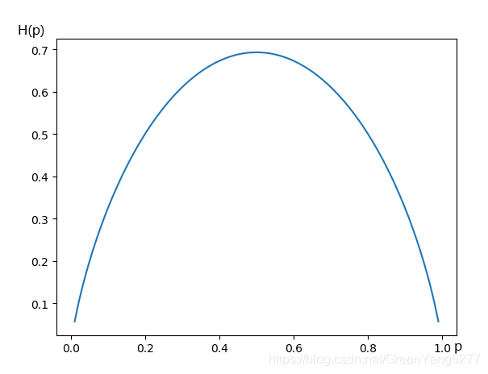
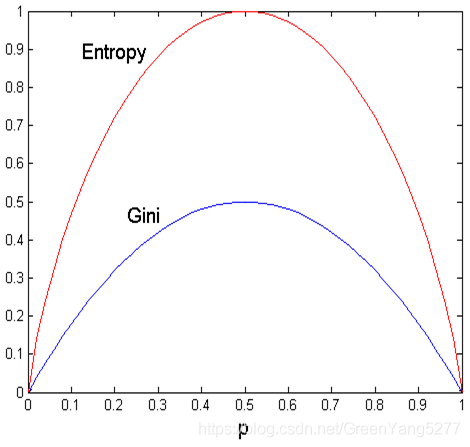
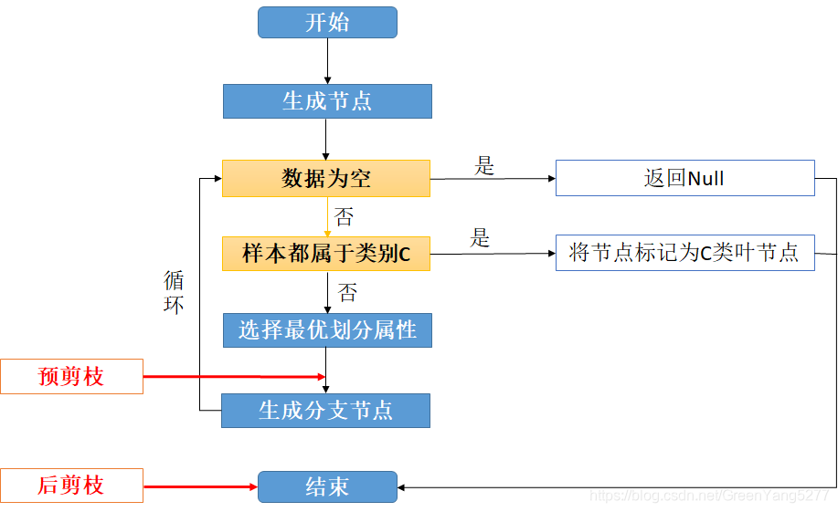
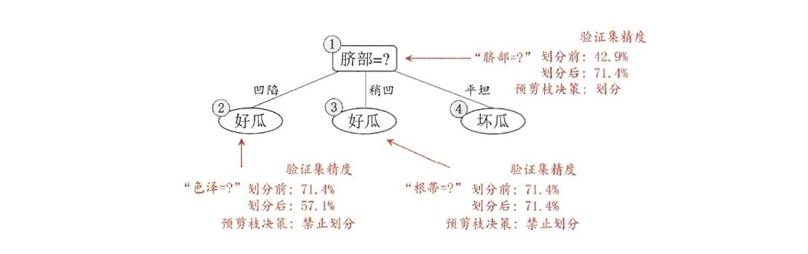
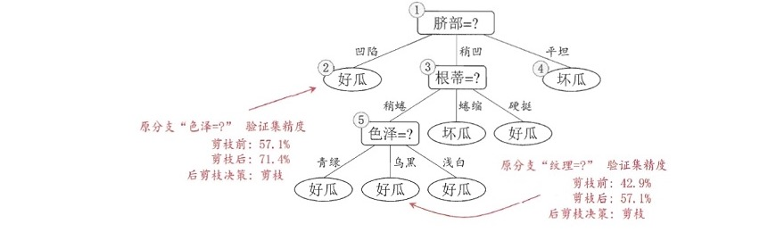

# Decision Tree

- 编辑：李竹楠
- 日期：2024/03/05

## 1. 决策树结构

一个决策树将分为以下节点：

- 根节点：包含**样本**的全集
- 内部节点：对应**特征**属性测试
- 叶节点：代表决策的**结果**

预测时，在树的内部节点处用某一属性值进行判断，根据判断结果决定进入哪个分支节点，直到到达叶节点处，得到分类结果。这是一种基于 `if-then-else` 规则的有监督学习算法，决策树的这些规则通过训练得到，而不是人工制定的。决策树是最简单的机器学习算法，它易于实现，可解释性强，完全符合人类的直观思维，有着广泛的应用。

## 2. 决策步骤

决策树模型在训练时遵守以下步骤：

1. 特征选择：特征选择决定了使用哪些特征来做判断。在训练数据集中，每个样本的属性可能有很多个，不同属性的作用有大有小。因而特征选择的作用就是筛选出跟分类结果**相关性较高**的特征，也就是**分类能力较强**的特征。在特征选择中通常使用的准则例如信息增益等。
2. 决策树生成：选择好特征后，就从根节点出发，计算**所有**特征的信息增益，选择**信息增益最大**的特征作为节点特征，根据该特征的不同取值建立子节点；对每个子节点使用相同的方式生成新的子节点，直到信息增益很小或者没有特征可以选择为止。
3. 决策树剪枝：剪枝的主要目的是对抗**过拟合**，通过主动去掉部分分支来降低过拟合的风险。

## 3. 经典算法

属性划分算法帮助我们基于训练样本集选择一个基于样本特征最优的属性分类方案， 帮助我们基于样本特征简单的将样本分类。常见的划分方式有：

- 基于信息熵(Entropy)：ID3、C4.5
- 基于基尼指数(Gini)：CART

### 3.1 信息熵(Entropy)

我们理科生都学过化学，热力学里有一个熵的概念，熵就是来形容系统混乱程度的，**系统越混乱，熵就越大**。信息熵也具有**同样**的意义，不过它描述的是随机变量的不确定性（也就是混乱程度）。

在机器学习中，信息熵是度量样本集合**纯度**最常用的一种指标。假定当前样本集合 $X$ 中第 $i$ 类样本所占比例(随机概率分布)为 $p_i(i=1,2, \dots, n)$，则 $X$ 的信息熵定义为：

$$
H(X)=-\sum ^n_{i=1} p_i \log_2 p_i
$$

$H(X)$的值越小，$X$ 的纯度越大。用下图辅助理解：

由上图可以看出，当p=0.5的时候，H§达到最大值。因为p=0或p=1的时候，X只有一种可能性，也就是X是确定的，因此熵最小，而随着p接近0.5的过程中，变量X的不确定性就越来越大，我们计算出来的熵也是越来越大，与实际相符。

使用判断西瓜是否为好瓜为例介绍以下算法：样本属性有纹理、触感、色泽，其中每个属性有若干个可取值，比如纹理（清晰，稍糊，模糊），色泽（青绿，乌黑，浅白），触感（硬滑，软粘）。样本分类有两种，好瓜和坏瓜。

#### 3.1.1 ID3

ID3是基于信息增益(Information Gain)的分类算法。如果将西瓜的例子样本 $X$，经过属性 $a$ 的划分后分为 $X_1, X_2, \dots, X_n$。

则样本 $X$ 对于属性 $a$ 划分的 **信息增益(Information Gain)** 为：

$$
Gain(X, a) = H(X) - \sum ^n_{i=1} \frac{X^i}{X} H(X^i)
$$

上述过程很简单，就是划分前的信息熵减去划分后的信息熵。其中 $a$ 代表的此次划分中所使用的属性。一般而言，信息增益越大，则意味着使用属性 $a$ 来进行划分所获得的**纯度提升**越大。如果决策树使用信息增益准则来选择最优划分属性的话，在划分前会针对每个属性都计算信息增益，选择能使得**信息增益最大的属性作为最优划分属性**。

#### 3.1.2 C4.5

信息增益虽然在理论上可以找到最优的划分属性，但在某些情况下会存在问题。信息增益比较偏好可取值较多的属性，比如我们的样本有一个属性叫序号，每一个样本都具有一个单独的序号，因此使用序号划分后，每个子结点只有一个样本，熵为0。这样的话信息增益最大，算法就会以此属性作为最优划分属性。这显然与我们的意愿不同。因此引申出了增益比的思想。

可以这么说，**增益比**就是为了矫正信息增益偏好的问题。为了使算法不偏向可取值较多的属性。C4.5 算法不直接使用信息增益， 而是使用**信息增益率**来选择最优划分属性。公式如下：

$$
Gain\_ratio(X, a)=\frac{Gain(X, a)}{-\sum ^n_{i=1} {\frac{X^i}{X} \log_2 \frac{X_i}{X}}}
$$

可以看出，增益比就是信息增益除以 ${-\sum ^n_{i=1} {\frac{X^i}{X} \log_2 \frac{X_i}{X}}}$，这是属性 $a$ 的固有属性，当属性 $a$ 可取值增多的时候，${-\sum ^n_{i=1} {\frac{X^i}{X} \log_2 \frac{X_i}{X}}}$ 一般也增大，因此在一定程度上能抑制信息增益偏好取值多的属性的特点，但是增益比偏好取值较少的属性。

算法C4.5是算法ID3的改进版，它使用了信息增益和增益比两种选择算法，**先选出信息增益高于平均水平的属性，然后再在这些属性中选择增益比最高的，作为最优划分属性**。这样综合了信息增益和增益比的优点，可以取得较好的效果。

### 3.2 基尼指数(Gini)

基尼指数也是一个寻找最优划分属性的准则。公式如下：

$$
Gini(X)=\sum ^n_{k=1} \sum _{k \prime \neq k} p_kp_{k\prime}=1-\sum ^n_{k=1} p^2_k
$$

通俗的可以这么理解，基尼指数就是在样本集中随机抽出两个样本不同类别的概率。当样本集越不纯的时候，这个概率也就越大，即基尼指数也越大。这个规律与信息熵的相同，还是以刚才的只有两个取值的随机变量为例，我们这次纵坐标除了有信息熵外，再加上基尼指数：

可以看出，基尼指数与信息熵虽然值不同，但是趋势一致。同样的，使用基尼指数来选择最优划分属性也是对比不同属性划分后基尼指数的差值，选择使样本集基尼指数减小最多的属性。

#### 3.2.1 CART(Classification and Regression Tree)

与信息增益计算方式类似，CART 使用划分前样本集 $X$ 的基尼指数减去划分后子样本集 $X_i$ 的基尼指数加权和。这种算法即可以用于分类，也可以用于回归问题。CART 算法使用了基尼系数取代了信息熵模型。

回归模型日后再补。

## 4. 数据处理

### 4.1 连续值处理

我们之前使用的例子都是离散型数据，比如纹理（清晰，稍糊，模糊），色泽（青绿，乌黑，浅白），触感（硬滑，软粘），实际上我们的数据还有可能是连续值，比如西瓜的含糖率是0-1之间的连续值。这种情况下，属性的可取值无穷多，就无法直接划分节点，需要先将连续值离散化。

日后再补

### 4.2 缺失值处理

由于各种原因，我们得到的数据经常含有缺失值。当然如果一条样本缺失值太多，我们可以直接舍弃。但对于只缺失少量数据的样本，我们丢弃就有些可惜，尤其是对于不方便收集的数据样本。我们谈一下决策树算法中对于缺失值怎么处理的。

日后再补

## 5. 剪枝

如果按照我们之前的方法形成决策树后，会存在一定的问题。决策树会无休止的生长，直到训练样本中所有样本都被划分到正确的分类。实际上训练样本中含有异常点，当决策树节点样本越少的时候，异常点就可能使得该结点划分错误。另外，我们的样本属性并不一定能完全代表分类的标准，可能有漏掉的特征，也可能有不准确的特征。**这样就会导致决策树在训练集上准确率超高，但是在测试集上效果不好，模型过拟合，泛化能力弱**。因此我们需要适当控制决策树的生长。

剪枝处理是防止决策树过拟合的有效手段。剪枝，其实就是把决策树里不该生长的枝叶剪掉，也就是不该划分的节点就不要继续划分了。剪枝分为“预剪枝”和“后剪枝”。两种操作在决策树生辰步骤的位置如下图：

### 5.1 预剪枝

预剪枝是在构建决策树过程中进行剪枝， 在每次选择一个划分属性时， 首先判断划分前后在**测试数据集**的误差大小：

- 如果属性不划分时(使用类别最多的样本作为该属性对应的类别)在测试集的错误率**大于**属性划分后在测试集的错误率，则进行该属性划分；
- 如果属性不划分时(使用类别最多的样本作为该属性对应的类别)在测试集的错误率**小于**属性划分后在测试集的错误率, 则放弃划分。

预剪枝使得决策树的很多分支都没有展开， 这不仅**降低**了过拟合的风险，还显著**减少**了决策树的训练时间开销和测试时间开销。

然而，有些分支的当前划分虽然不能提升泛化性能，甚至可能导致泛化性能下降，但是在其基础上进行的后续划分却有可能导致性能的显著提升，预剪枝的基于**贪心**的本质禁止了这些分支展开，给预剪枝决策树带来了欠拟合的风险。

### 5.2 后剪枝

后剪枝是在决策树训练完成后合并分支的手段。

后剪枝从下到上在测试集**比较节点**的泛化能力，对于其分支拆分后泛化能力下降者进行合并。一般情况下，后剪枝的欠拟合风险很小并且泛化能力往往优于预剪枝。但是，后剪枝时间开销要比预剪枝要大的多。

## 6. 总结

- 优点：
    - 决策树**易于理解和解释**，可以可视化分析，容易提取出规则，可以使用统计检验来验证模型结果，可以**检验模型的可靠性**。
    - 几乎不用数据清洗。其他的工具往往需要data normalization、创建dummy variables等工作。神经网络在训练之前则必须要先归一化，否则会出现效果不好或者出现梯度爆炸/消失。
    - 比较适合处理有缺失属性的样本；
    - 能够处理不相关的特征；
    - 运算速度快。训练决策树的成本和数据点的数量为对数关系。
- 缺点：
    - 决策树模型容易出现**过拟合**现象，使得模型的泛化能力很低。但是我们可以通过**剪枝**、设置每一个叶节点的最小样本数、设置树的最大深度来减小模型的复杂度，从而避免过拟合现象。
    - 决策树的**稳定性较低**。对数据集进行很小的改变就可能导致训练出完全不同的树。我们可以通过使用**集成算法**（随机森林、XGBoost）来解决这个问题。
    - 决策树会受到**样本不平衡**的影响。我们需要在训练模型之前**平衡样本**，避免出现某一个类别在dataset中占绝对多数的情况，特别是 ID3 算法。