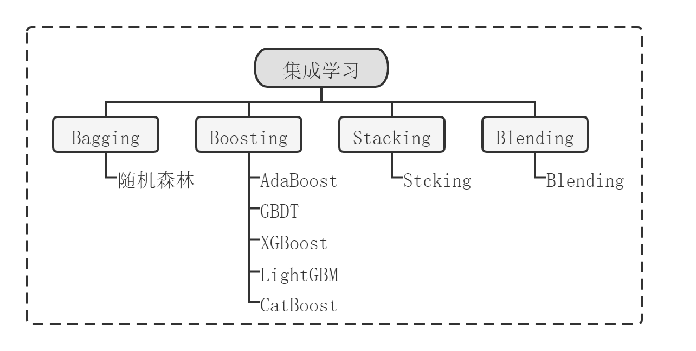
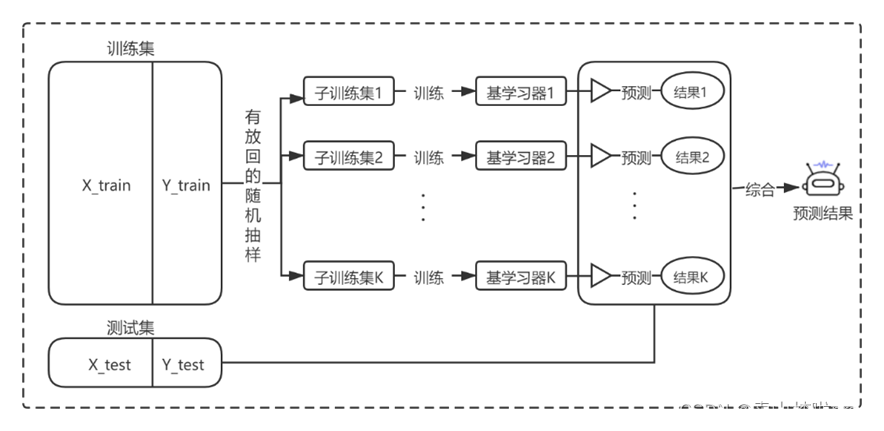
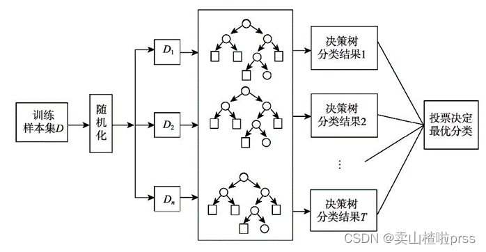
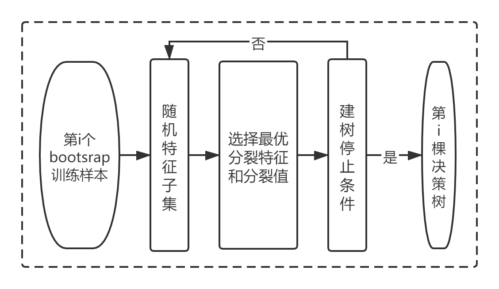
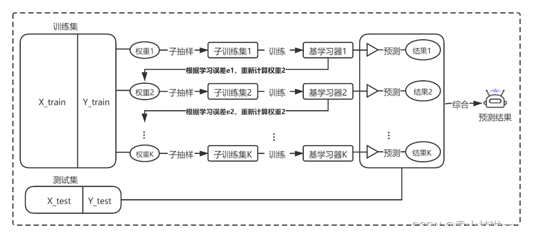

# Ensemble Learning

- 编辑：李竹楠
- 日期：2024/03/06

## 1. 概述

集成学习归属于机器学习，他是一种“训练思路”，并不是某种具体的方法或者算法。集成学习会挑选一些“简单”的基础模型进行组装，并结合起来得到一个**强模型**，这个强模型通常比单一模型有更强的性能。目前，集成学习模型的分类主要是根据个体学习器之间的关系进行区分，常用集成学习框架包括：Bagging、Boosting以及Stacking。

## 2. Bagging

Bagging算法也称为袋装法，其基本思想是将多个弱学习器通过并行的方式进行训练，然后再将所有训练好弱学习器通过集成策略组合为一个强学习器。这种方式可以实现以**高偏差换取低方差，从而减小模型的整体误差**。Bagging算法流程图如下：

### 2.1 随机森林(Random Forests)

随机森林（Random Forests）是以决策树作为基分类器的一种Bagging集成学习方法，其基本思想是**随机选择特征**，将被选择的多棵决策树独立并行训练后利用 **集成策略（投票或平均）** 来输出最终结果，其中每棵决策树均是在原始训练集中随机选择样本、随机选择特征构建而成。过程如下：

单个树建立流程：

- 优点：
    - 训练可以**高度并行化**，可以有效运行在**大数据集**上。
    - 由于对决策树候选划分属性的采样，这样在样本特征维度较高的时候，仍然可以高效的训练模型。
    - 由于有了样本和属性的采样，最终训练出来的模型**泛化能力强**。
    - 可以输出各特征对预测目标的重要性。
    - 对部分特征的缺失容忍度高。
- 缺点：
    - 在某些噪声比较大的样本集上，随机森林容易陷入过拟合。
    - 取值划分比较多的特征容易对随机森林的决策产生更大的影响，从而影响拟合的模型效果。

## 3. Boosting

Boosting算法也称为提升法，其主要思想是将多个弱学习器通过串行的方式进行训练，然后将所有弱学习器集成为一个强学习器。在Boosting算法中每个弱学习器之间并不独立，即第一个弱学习器在学习的时候对每个样本出现的权重均视为等同，而当下一个弱学习器学习时会计算上一个弱学习器的训练误差，重新更新每个样本的权重（把被错分的样本权重调高，增加样本的出现几率）。具体的，Boosting算法流程图如下：

Boosting是一种递进的组合方式，每一个新的分类器都在前一个分类器的预测结果上改进，所以说boosting是减少偏差而bagging是减少方差的模型组合方式。

### 3.1 AdaBoost

AdaBoost，是英文"Adaptive Boosting"（自适应增强）的缩写，由Yoav Freund和Robert Schapire在1995年提出。它的自适应在于：前一个基本分类器分错的样本会得到加强，加权后的全体样本再次被用来训练下一个基本分类器。同时，在每一轮中加入一个新的弱分类器，直到达到某个预定的足够小的错误率或达到预先指定的最大迭代次数 。

具体说来，整个Adaboost 迭代算法就3步：

1. 初始化训练数据的权值分布。如果有N个样本，则每一个训练样本最开始时都被赋予相同的权值：1/N。
2. 训练弱分类器。具体训练过程中，**如果某个样本点已经被准确地分类，那么在构造下一个训练集中，它的权值就被降低**；相反，如果某个样本点没有被准确地分类，那么它的权值就得到提高。然后，权值更新过的样本集被用于训练下一个分类器，整个训练过程如此迭代地进行下去。
3. 将各个训练得到的弱分类器组合成强分类器。**各个弱分类器的训练过程结束后，使分类误差率小的弱分类器的权重增加，使其在最终的分类函数中起着较大的决定作用**，而降低分类误差率大的弱分类器的权重，使其在最终的分类函数中起着较小的决定作用。换言之，误差率低的弱分类器在最终分类器中占的权重较大，否则较小。

### 3.3 XGBoost

GBDT模型是一个集成模型，基分类器采用CART，集成方式为Gradient Boosting。CART是一个分类回归二叉决策树，在分类时采用最小平方误差来选择最优切分特征和切分点。

GBDT通过多轮迭代，每轮迭代产生一个弱分类器，每个分类器在上一轮分类器的残差基础上进行训练。对弱分类器的要求一般是**足够简单**，并且是**低方差和高偏差**的。因为**训练的过程是通过降低偏差来不断提高最终分类器的精度**。

最终的总分类器 是将每轮训练得到的弱分类器加权求和得到的（也就是加法模型）。

## 4. 总结

其他集成模型参考：https://cloud.tencent.com/developer/article/1861382