# 模型评估方法与准则

- 编辑：李竹楠
- 日期：2024/02/04

在AI场景下我们需要定量的数值化指标来指导我们更好地应用模型对数据进行学习和建模。事实上，在机器学习领域，对模型的测量和评估至关重要。选择与问题相匹配的评估方法，能帮助我们快速准确地发现在模型选择和训练过程中出现的问题，进而对模型进行优化和迭代。本文的结构如下：

1. 首先介绍模型**评估的目标**，说明模型需要达到什么样的标准，以及为了达到这样的标准需要做些什么工作。
2. 介绍两种不同的**实验方法**，分别是离线实验和在线实验
3. 然后，在评估模型之前，需要对数据集进行**验证**，并且合理**划分数据集**，目的是保证我们后续计算得到的评估指标是可靠有效的。
4. 针对于**回归任务**，介绍评估的方法和准则。
5. 针对于**分类任务**，介绍评估的方法和准则。

## 1. 模型评估的目标

**模型评估的目标是选出泛化能力强的模型完成机器学习任务**。实际的机器学习任务往往需要进行大量的实验，经过反复调参、使用多种模型算法（甚至多模型融合策略）来完成自己的机器学习问题，并观察哪种模型算法在什么样的参数下能够最好地完成任务。

**泛化能力强**的模型能很好地适用于未知的样本，模型的错误率低、精度高。机器学习任务中，我们希望最终能得到**准确预测未知标签的样本、泛化能力强的模型**。但是我们无法提前获取“未知的样本”，因此我们会基于已有的数据进行切分来完成模型训练和评估，借助于切分出的数据进行评估，可以很好地判定模型状态（过拟合或欠拟合），进而迭代优化。

在建模过程中，为了获得泛化能力强的模型，我们需要一整套方法及评价指标。

- **评估方法**：为保证客观地评估模型，对数据集进行的有效划分实验方法。
- **性能指标**：量化地度量模型效果的指标。

## 2. 实验方法

分为**离线实验方法**和**在线实验方法**。

**模型评估通常指离线试验**。原型设计（Prototyping）阶段及离线试验方法，包含以下几个过程：

1. 使用历史数据训练一个适合解决目标任务的一个或多个机器学习模型。
2. 对模型进行验证（Validation）与离线评估（Offline Evaluation）。
3. 通过评估指标选择一个较好的模型。

除了离线评估之外，其实还有一种在线评估的实验方法。由于模型是在老的模型产生的数据上学习和验证的，而**线上**的数据与之前是不同的，因此离线评估并不完全代表线上的模型结果。因此我们需要在线评估，来验证模型的有效性。

**A/B TEST 是目前在线测试中最主要的方法**。A/B TEST 是为同一个目标制定两个方案，让一部分用户使用A方案，让另一部分用户使用B方案，记录下用户的使用情况，看哪个方案更符合设计目标。如果不做AB实验直接上线新方案，新方案甚至可能会毁掉你的产品。

在**离线评估**中，经常使用准确率（Accuracy）、查准率（Precision）、召回率（Recall）、ROC、AUC、PRC等指标来评估模型。

**在线评估**与离线评估所用的评价指标不同，一般使用一些商业评价指标，如用户生命周期值（Customer Lifetime value）、广告点击率（Click Through Rate）、用户流失率（Customer Churn Rate）等标。

## 3. 常见的模型验证方法

下面我们来了解一下模型验证方法，主要涉及到对**完整数据集不同的有效划分方法**，保证我们后续计算得到的评估指标是可靠有效的，进而进行模型选择和优化（模型验证时防止**数据泄漏**非常重要）。

> 机器学习中的数据泄露？
> 
> 数据泄露在预测模型中是一个非常大的问题。数据泄露是当**来自于训练集外部的信息**被用于创建模型。下面要说明在预测模型中数据泄露的一下几个问题：
> 
> - 什么是数据泄露？ 
> - 数据泄露的迹象，为什么数据泄露是个问题？
> - 关于改善数据泄露问题的技巧。
> 
> 什么是数据泄露？ 
> 
> 数据泄露造成了“过分乐观(overly optimistic)”的模型，即使这些模型不是完全有效的。数据泄漏是指使用**训练数据集外部的信息**来创建模型。这些**额外**的信息可以让模型学习或知道一些它**本来不知道**的东西，从而使所构建的模型的估计性能失效。
>
> 为什么数据泄露是一个问题？
>
> 这里有三个原因：
> - 如果在竞赛中，模型将使用泄漏数据，而不是对潜在问题的良好通用模型。
> - 如果在公司提供的数据中，撤销匿名和混淆可能会导致您意想不到的隐私泄露。
> - 如果将模型部署在生产环境中，这些模型实际上是无用的，不能在生产中使用。
> 
> 如何检测是否产生了数据泄露？
>
> 一个简单的方法就是，是否实现了一个性能好的令人难以置信的模型，就像实现了一个高准确率的博彩预测。
>
> 一些关于如何避免数据泄露的技巧： 
> 
> - 在交叉验证中执行数据准备(data preparation)
> - 保留一个验证数据集，以便对开发的模型进行最终的全面检查。
>
> 通常来说，同时使用这两种方法是一个好的选择，下面对这两种方法分别介绍。
>
> 第一个方法是**在交叉验证中执行数据准备**：
>
> 在准备数据过程中，非常容易造成数据泄露，这将会过度拟合训练数据并且模型在未见过的数据上有着“过分乐观”的评估。例如，如果对整个数据集进行了归一化或标准化了，然后使用交叉验证来估计模型的性能，那么你就犯了数据泄露的错误。
> 这是因为在计算缩放因子(如最小和最大或平均值和标准差)时，执行的数据缩放过程是了解训练数据集中数据的完整分布的。这些知识被嵌入到重新缩放的值中，并被交叉验证测试工具中的所有算法利用。
> 在“无泄露评估”情况下，算法将会计算在交叉验证的每个fold中缩放数据的参数，并在每个周期中使用这些参数准备测试K-fold上的数据。
> 
> **注意：在准备数据、清理数据、填充缺失值、移除异常值等任何时候，都有可能产生数据泄漏。在准备数据的过程中，你可能会扭曲数据，以便在“干净”的数据集上构建一个运行良好的模型，但在你真正想要应用它的实际情况下，它将完全失败**。
> 
> 总的来说，在交叉验证中去重新准备和计算需要的数据当执行一些任务时，比如：特征选择、异常值删除、编码、特征缩放和降维的投影操作等，是一个非常好的办法。
> 
> 第二个方法是**保留验证数据集**：
> 
> 将数据集分为训练集、测试集和验证集。当完成最终的模型后，在验证集上进行测试。这可以给你一个全面的检查，看看你对性能的估计是否过于乐观并发生了泄漏。
> 本质上，真正解决这个问题的唯一方法是保留一个独立的测试集，并保持它直到研究完成，并使用它进行最终验证。
> 
> 其他的一些小技巧：
> 
> - 增加噪声：增加随机噪声可以平滑数据泄露的影响。
> - 使用Pipelines：使用Pipelines可以使得数据准备的过程可以被放入交叉验证中完美的执行，例如python中的scikit-learn。

### 3.1 留出法(Hold-out)

留出法简单来说就是将数据集划分成**训练集**、**测试集**和**验证集**。留出法有两个作用：第一是用作模型评估；第二是用作模型选择。

模型评估的用途其实很好理解，通过分割出训练集和测试集，使用训练集测试模型性能。而模型选择是将多个在此数据集中训练的不同的模型在验证集上进行验证，选出最优模型。

下文将先说明模型评估，随后再说明模型选择。

#### 3.1.1 模型评估

简单来说，留出法将数据集划分为用于模型训练的训练集和找到最优模型的测试集。这种方法通常使用在当**数据集比较小**的情况下并且没有足够的数据分为训练集、测试集和验证集。这种方法的优点在于实现简单。但是，对**数据集的划分**非常敏感，如果划分不是随机的，则会产生**偏差(bias)**，下图是对该方法的示意图。

> 关于偏差(Bias)和方差(Variance)
> 
> 理解不同的误差来源是如何导致偏差和方差可以帮助我们提升模型的准确度。我将会从概念、图像和数据角度分别介绍偏差和方差的定义。
> 
> 概念角度：
> 
> - 偏差：偏差通常被认为是真实值与预测值之间的差值。虽然只有一个模型的情况下讨论模型间的真实值与预测值的差值有点奇怪，但是假设**多次重复**整个模型的构建过程：每次运行新数据并运行新分析，创建新模型。由于基础数据的随机性，结果模型将会有一系列的预测。偏差衡量的是这些模型的**预测与正确值之间的总体偏差**。
> - 方差：方差引起的误差被认为是模型对给定数据点预测的可变性。同样，假设您可以多次重复整个模型构建过程。方差是指在不同的模型实现之间，**对给定点的预测有多大的差异**。
>
> 图像角度：
> 
> 如下图所示，中间红色的靶心代表真实值。如果点的分布距离靶心越远则代表偏差越大。如果点之间的分布越分散，则代表方差越大。
>
> 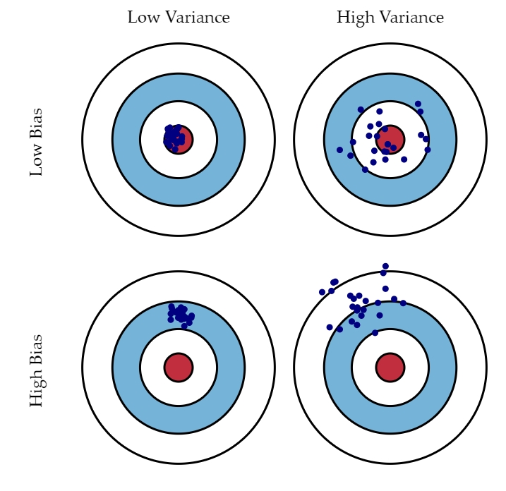
> 
> - 左上角的示例是理想状况：偏差和方差都非常小。如果有无穷的训练数据，以及完美的模型算法，我们是有办法达成这样的情况的。然而，现实中的工程问题，通常数据量是有限的，而模型也是不完美的。因此，这只是一个理想状况。
> - 右上角的示例表示偏差小而方差大。靶纸上的落点都集中分布在红心周围，它们的期望落在红心之内，因此偏差较小。另外一方面，落点虽然集中在红心周围，但是比较分散，这是方差大的表现。
> - 左下角的示例表示偏差大二方差小。显而易见，靶纸上的落点非常集中，说明方差小。但是落点集中的位置距离红心很远，这是偏差大的表现。
> - 右下角的示例则是最糟糕的情况，偏差和方差都非常大。这是我们最不希望看到的结果。
>
> 数学角度：
>
> 假如我们定义预测值 $Y$ 和变量 $X$ ，我们可以假设两者之间的关系是 $Y=f(X)+\epsilon$ ，其中，$\epsilon$ 是误差项，通常是由均值为 $0$ 的正态分布表示： $\epsilon \sim N(0, \sigma_\epsilon)$ 。我们可以评估预测在线性模型 $\hat{f}(X)$ 与真实值 $f(X)$ 在预测点 $x$ 的误差为：
> 
> $$
> Err(x) = E[(Y-\hat{f}(x))^2]
> $$
> 
> 这个误差可以分解为偏差分量和方差分量:
>
> $$
> \begin{align}
> Err(x) &= [E[\hat{f}(x)] - f(x)]^2 + E[(\hat{f}(x) - E[\hat{f}(x)])^2] + \sigma^2_e \\
> Err(x) &= Bias^2 + Variance + Irreducible Error
> \end{align}
> $$
> 
> 其中，偏差描述的是通过学习拟合出来的结果之期望，与真实值之间的**差距**，记作 $Bias(X) = E[\hat{f}(X)] - f(X)$ ， 方差是统计学中的定义，描述的是通过学习拟合出来的结果自身的**不稳定性**， 记作 $Var(X) = E[(\hat{f}(x) - E[\hat{f}(x)])^2]$ ， Irreducible Error是**噪声**，任何模型都无法从根本上减少它。
> 
> 使用一个案例理解偏差与方差之间的关系。下图分别是使用线性模型和多项式模型对**训练集**数据的拟合。通过下图可知，在**训练集**上线性模型的误差(Linear Model Error: 3.6043)是明显高于多项式模型(Polynomial Model Error：1.6956)的：数据是围绕一个近似线性的函数附近抖动的，那么用简单的线性模型，自然就无法准确地拟合数据；但是，高阶的多项式函数可以进行各种“扭曲”，以便将训练集的数据拟合得更好。
> 
> 
> 
> 这种情况，我们说线性模型在训练集上**欠拟合(underfitting)**，并且它的偏差(bias)要高于多项式模型的偏差。
> 但这并不意味着在这个问题里线性模型要弱于多项式模型。在下图的**测试集**上，线性模型的误差(Linear Model Error:3.5998)要明显小于多项式模型的误差(Polynomial Model Error：929.1222)，并且线性模型在训练集和测试集的误差相对接近，而多项式模型在两个数据集上的误差相对较大。
> 这种情况被称为多项式模型在训练集上**过拟合(overfitting)**。由于线性模型在两个数据集上的误差较为接近，我们可以说线性模型在未见的数据集上，**泛化能力**更高。毕竟，在后续的工作中，会使用有限的训练集去拟合无限的未见的真是样本。所以，泛化能力是一个非常重要的指标。所以，我们说在这个模型上，线性模型比多项式模型性能更好。
> 
> 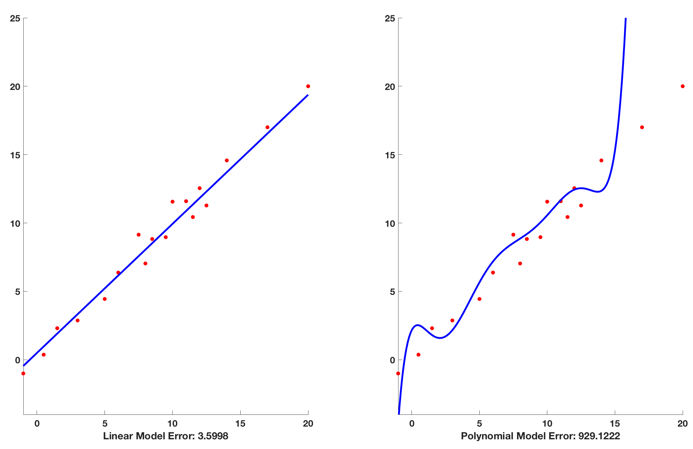
> 
> 根据以上的实验，我们可以做出偏差-方差权衡(bias-variance tradeoff)：
> 
> 通过上面两张图的比较可以发现，模型的复杂程度（简单的线性模型和复杂的多项式模型）会影响最终的偏差和方差。具体来说，随着模型复杂程度的增加，其表述能力也增加，此时，模型在数据上的表现是偏差会降低而方差会升高；而随着模型复杂程度的降低，其表述能力会下降，此时，模型在数据上的表现是偏差会升高而方差会降低。带入误差公式我们可以绘制出下图：
> 
> 
> 
> 图中的最优点是Total Error曲线的最小值。根据一阶导数的性质可得，当 $Err\prime(x)=0$ 时，可得到误差的最小值，所以我们可得：
> 
> $$
> \frac{\partial {Bias}}{\partial {Complexity}} = - \frac{\partial {Varance}}{\partial {Complexity}}
> $$
> 
> 上述公式给出了最优点的数学描述，结合图像可知，当模型复杂度**大于**平衡点，则模型的方差会偏高，模型倾向于**过拟合**；而当模型复杂度**小于**平衡点，则模型的偏差会偏高，模型倾向于**欠拟合**。
> 所以，根据上文所述，将误差降低到0是无法实现的，尽管得到一个完美的模型使得训练集上的误差为0，但是还有噪音带来的影响和训练集本身存在的误差也会带入到模型中。其次，由于训练样本的是无法完美反应真实情况的（样本容量有限、采样不均匀等），以及模型学习本身存在上限，也就意味着我们不可能会有“完美模型”。因此，我们不会去训练误差为0的模型，而是使得模型的结果逼近最优结果。

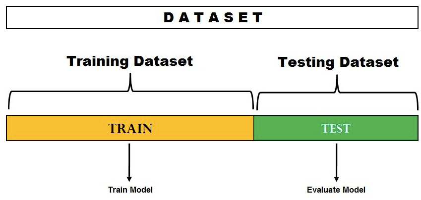

这个技术非常**容易产生过拟合**，因此，测试误差就变成了泛化误差的一个乐观偏差估计。然而，这并不是我们想要的。最终模型不能很好地泛化到未见过的或未来的数据集，[代码](../../../code/4/4.1/evaluation.ipynb)如下所示：

``` python
X = iris.data
y = iris.target
X_train, X_test, y_train, y_test = train_test_split(X, y, test_size = 0.3, random_state=42)
lg = linear_model.LogisticRegression()
lg.fit(X_train, y_train)
y_pred = lg.predict(X_test)
accuracy = accuracy_score(y_test, y_pred)
```

**注意，此过程用于模型评估，其基础是将数据集划分为训练数据集和测试数据集，并使用固定的超参数集**。还有一种技术是将数据分成三个集合（训练集、测试及和验证集），并使用这三个集合进行模型选择或超参数调优。我们将在下节介绍。

> 关于过拟合和欠拟合的说明。
> 
> 在实际环境中计算偏差和方差是比较困难的，所以，我们需要通过外在表现判断模型是否过拟合或者欠拟合。
> 在有限的数据集中，不断的增加模型的复杂度会使得误差不断降低，如下图：
> 
> 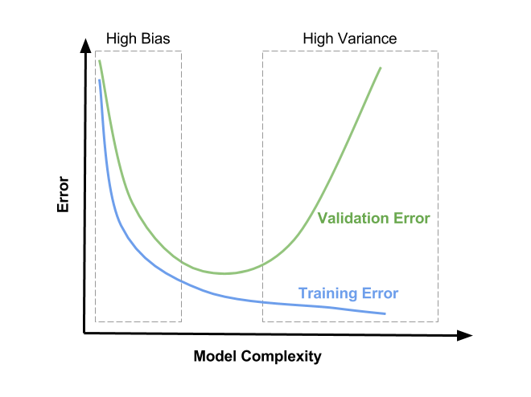
> 
> 从上图可得：
> 
> - 模型复杂度低时，模型处于欠拟合状态，训练集和验证集的误差都很高。
> - 模型复杂度高时，模型处于过拟合状态，训练集误差较低而验证集误差较高。
> 
> 那么，有了这些分析，我们就可以判断出模型所处的拟合状态。根据Andew Ng提供的一般处理方法如下图：
> 
> 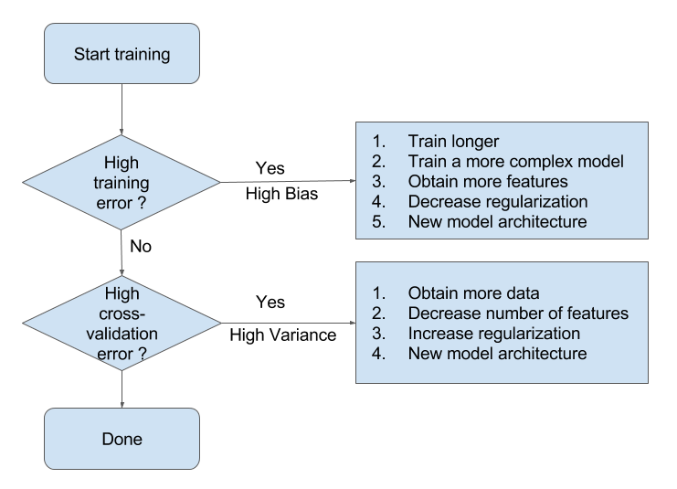
> 
> - 当模型处于欠拟合状态时，根本的办法是增加模型复杂度。有以下方法：
>   - 增加模型的迭代次数；
>   - 更换描述能力更强的模型；
>   - 生成更多特征供训练使用；
>   - 降低正则化水平。
> - 当模型处于过拟合状态时，根本的办法是降低模型复杂度。有以下方法：
>   - 扩增训练集；
>   - 减少训练使用的特征的数量；
>   - 提高正则化水平。

#### 3.1.2 模型选择

保留方法也可以用于模型选择或超参数调优。事实上，有时模型选择过程也被称为超参数调优。在模型选择的留出法中，数据集被分为三个不同的集——训练集、验证集和测试集，如下图。在使用将数据划分为三个不同集的留出法时，重要的是要确保训练数据集、验证数据集和测试数据集能够代表整个数据集。否则，模型可能在不可见的数据上表现不佳。

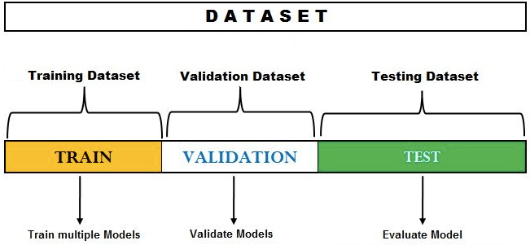

模型选择将会根据以下步骤选出最优模型：

1. 将数据集分割为**训练集**、**测试集**和**验证集**。
2. 使用不同的算法在**训练集**上训练模型，例如归回模型、随机森林或者是SVM等。
3. 对于用不同算法训练的模型，**调整超参数**，得到不同的模型。对于步骤2中提到的每个算法，更改超参数设置并提供多个模型。
4. 在**验证集**上测试每个模型(属于每个算法)的性能。
5. 从**验证集**上测试的模型中选择最优的模型。对于特定的算法，最优的模型将具有最优的超参数设置。
6. 在**测试集**上测试最优模型的性能。

上述过程如下图所示：

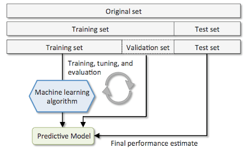

**注意：原始数据集的三种不同划分。训练、调优和评估的过程重复多次，选择最优的模型。最终的模型在测试集上进行评估**。

[代码](../../../code/4/4.1/evaluation.ipynb)如下所示：

``` python
lg = linear_model.LogisticRegression()
svc = svm.SVC()
knn = neighbors.KNeighborsClassifier()
models = [lg.fit(X_train, y_train), svc.fit(X_train, y_train), knn.fit(X_train, y_train)]
best_acc = 0.0
best_model = lg
for model in models:
    y_pred = model.predict(X_val)
    acc = accuracy_score(y_val, y_pred)
    if best_acc > acc:
        best_model = model
        best_acc = acc
y_pred = best_model.predict(X_test)
print(accuracy_score(y_test, y_pred))
```

其结果是：

``` shell
LogisticRegression() , accracy:  0.9666666666666667
SVC() , accracy:  0.9333333333333333
KNeighborsClassifier() , accracy:  0.9333333333333333
1.0
```

这里会发现 `accuracy_score(y_test, y_pred)` 输出结果为1.0，其分数太高，怀疑过拟合。下文中的交叉验证法会重新评估模型。

### 3.2 交叉验证法(Cross Validation)

在上述的留出法中，存在一个缺陷：如果分割的数据集恰好对这个模型非常有利或者是分割恰好导致较低的偏差，这就导致泛化能力的降低。交叉验证时一种创造性地划分数据进行模型验证的方法，为了获得“真实世界”数据的模型性能的最好估计，同时最小化验证错误。

#### 3.2.1 什么是交叉验证法？

K折交叉验证被定义为一种估计在未见数据上模型性能的方法。当**数据稀缺**，并且需要对训练和**泛化误差**进行很好的估计时，建议使用这种技术，从而理解欠拟合和过拟合等方面的问题。这种技术用于**超参数调优**，以便可以训练具有最优超参数值的模型。这是一种没有替换的重采样技术。这种方法的优点是每个样本只用于一次训练和验证(作为测试部分)。这产生了比留出法**更低的模型性能方差估计**。如前所述，使用这种技术是因为它有助于**避免**使用所有数据训练模型时可能出现的**过拟合**。通过使用K折交叉验证，我们能够在K个不同的数据集上“测试”模型，这有助于确保模型是**可泛化**的。下面是当 $K=10$ 时，交叉验证的示意图（第二步至第七步）以及过程：

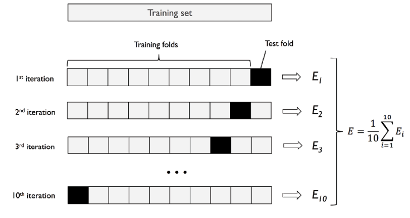

1. 将数据集划分为训练集和测试集。
2. 将训练集划分为K份。其中 $K$ 份为训练集
3. 将其中的 $K-1$ 份用于训练。
4. $1$ 份用于验证。 
5. 将带有不同超参数的模型放在 $K-1$ 份训练集中训练并且在剩下的一份验证集中验证。同时，记录模型的性能（第3、4、5步一直重复，直到经历 $K$ 次验证，这就是为什么被称作K折交叉验证）。
6. 取步骤5中计算的所有模型得分，计算模型性能的均值和标准差（如果只是评估模型，在这一步就已经得到K折后的平均分数）。 
7. 选择使得模型得分均值和标准差最优的超参数（如果进行模型选择，需要重复这一步）。
8. 最后，使用整个训练数据集训练模型(步骤2)，并在测试数据集上计算模型性能(步骤1)。

关于如何使用K-Fold进行模型评估，[代码](../../../code/4/4.1/evaluation.ipynb)如下所示：

``` python
pipeline = make_pipeline(StandardScaler(), linear_model.LogisticRegression())
strtfdKFold = StratifiedKFold(n_splits=10)
kfold = strtfdKFold.split(X, y)
scores = []
for k, (train, test) in enumerate(kfold):
    pipeline.fit(X[train,:], y[train])
    score = pipeline.score(X[test, :], y[test])
    scores.append(score)
    print('Fold: %2d, Training/Test Split Distribution: %s, Accuracy: %.3f' % (k+1, np.bincount(y[train]), score))
print('\n\nCross-Validation accuracy: %.3f +/- %.3f' %(np.mean(scores), np.std(scores)))
```

其结果是：

``` shell
Fold:  1, Training/Test Split Distribution: [45 45 45], Accuracy: 1.000
Fold:  2, Training/Test Split Distribution: [45 45 45], Accuracy: 0.933
Fold:  3, Training/Test Split Distribution: [45 45 45], Accuracy: 1.000
Fold:  4, Training/Test Split Distribution: [45 45 45], Accuracy: 1.000
Fold:  5, Training/Test Split Distribution: [45 45 45], Accuracy: 0.933
Fold:  6, Training/Test Split Distribution: [45 45 45], Accuracy: 0.933
Fold:  7, Training/Test Split Distribution: [45 45 45], Accuracy: 0.800
Fold:  8, Training/Test Split Distribution: [45 45 45], Accuracy: 1.000
Fold:  9, Training/Test Split Distribution: [45 45 45], Accuracy: 1.000
Fold: 10, Training/Test Split Distribution: [45 45 45], Accuracy: 1.000
Cross-Validation accuracy: 0.960 +/- 0.061
```

有个更简单的写法：

``` python
pipeline = make_pipeline(StandardScaler(), linear_model.LogisticRegression())
strtfdKFold = StratifiedKFold(n_splits=10)
scores = cross_val_score(pipeline, X, y, cv=10, n_jobs=1)
print('Cross Validation accuracy scores: %s' % scores)
print('Cross Validation accuracy: %.3f +/- %.3f' % (np.mean(scores),np.std(scores)))
```

其结果也是：

``` python
Cross Validation accuracy scores: [1.         0.93333333 1.         1.         0.93333333 0.93333333
 0.8        1.         1.         1.        ]
Cross Validation accuracy: 0.960 +/- 0.061
```

这里的结果是0.960 +/- 0.061，相比较于上文中 `accuracy_score(y_test, y_pred)` ，介个结果看起来合理一点（**这样判断并不科学，这里只是举个例子**）。

用一个例子进一步理解，假如我们有一个1000个样本的数据集，并且需要用k=5的交叉验证。首先，数据集按照 $8:2$ 的比例进行分割，即训练集为800，测试集为200。那么，在这800份训练集中中，需要按照k=5被分成5份（每份160个样本）。然后，可以在其中的4份中训练模型，在剩余的一份中验证性能。并且，将此过程重复五次，也就是说被分成的五份都可以被验证性能。其结果就是这个模型最终得到了五个估计矩阵（**然后得到的均值和标准差就是模型评估的分数**）。这个过程将会重复不同的超参数。然后，比较不同模型的均值和标准差，从所有模型中选择一个模型。最终，一个具有特定超参数和算法的新模型在整个800条记录上训练完成后在留出的200条记录上进行测试。

#### 3.2.2 为什么使用交叉验证法？

相比较留出法，交叉验证法有什么突出优势？在上文的留出法中，有两种划分，并带来不同的挑战，分别是：

- **训练集和测试集**：为了训练模型以获得最佳性能，需要适当调整超参数，以在测试数据上实现良好的模型性能。然而，这种技术存在过拟合测试集的风险。这是因为参数可以调整，直到estimator表现最佳。这样，关于测试集的知识可以“泄漏”到模型中，并且评估指标不再表现泛化性能。
- **训练集、验证集和测试集**：为了解决上述问题，我们创建了三个划分。它们是训练、验证和测试划分。使用训练和验证集对模型超参数进行调优。最后，使用测试数据来确定模型的泛化性能。然而，这种技术也有缺点。通过将数据划分为三个集合，可以减少用于模型学习的样本数量。结果取决于对(训练集、验证集)对的特定随机选择。

为了克服上述挑战，使用了**交叉验证技术**。创建了两种不同的划分，如训练集和测试集。然而，交叉验证是通过创建k折的训练数据来应用于训练数据，其中(K-1)折用于训练，其余折用于测试。该过程重复K次，并通过取所有创建的K个模型的均值和标准差来计算特定超参数集的模型性能。计算得到最优模型的超参数。最后，使用最优的超参数在训练数据集上再次训练模型，并通过计算模型在测试数据集上的性能来计算模型的泛化性能。

同时，交叉验证发也可以用于模型选择。下面总结了几个K折交叉验证的应用场景：

- **超参数调整**：可以用于估计不同超参数对于模型性能的影响，并且选出最佳超参数。
- **模型选择**：对于一些候选的模型，可以使用该技术去估计不同模型的性能。并且，选择最佳模型。
- **数据预处理**：可以用于估计不同数据预处理方案对于模型性能的影响。比如，使用不同的归一化方案对于模型性能的影响。

#### 3.2.3 K 值的选择

对于K值的选择有以下几个方法：

- K的标准值时10，并且可以用于适当的大小。
- 当数据集非常大时，K可以被设置为5。获得相对准确的估计的同时**减少计算成本**。
- 对于较少的数据集时，K可以适当增加。然而，较大的K值将会增加计算成本。由于数据集变少，因此该模型的性能估计方差会更高。
- 对于非常小的数据集，可以使用leave-one-out cross-validation (LOOCV)。在这种技术中，验证数据只包含一条记录。

**建议：使用StratifiedKFold，其目的是得到更佳的偏差和方差的估计，特别是在类别比例不均等的情况下**。

#### 3.2.4 交叉验证法的缺点

交叉验证法的缺点有**计算慢**和**难以并行化**。另外，K-Fold并不适合于所有的情况，例如以下场景：

- 不平衡数据集的分类问题：可以使用StratifiedKFold
- 不平衡数据集的回归问题。
- 非独立分布时，例如时间序列。

#### 3.2.5 总结

- K-Fold可用于模型选择和超参数选择
- k折交叉验证涉及将数据划分为训练数据集和测试数据集，在训练数据集上应用k折交叉验证，并选择性能最优的模型
- 有几种交叉验证生成器可以用于该技术，如KFold和StratifiedKFold。
- `Sklearn.model_selection` 模块的 `cross_val_score` 帮助类，可以使用一个简单的形式去使用K-Fold。 
- K的标准值时10，并且可以用于适当的大小。
- 当数据集非常大时，K可以被设置为5。获得相对准确的估计的同时**减少计算成本**。
- 对于较少的数据集时，K可以适当增加。然而，较大的K值将会增加计算成本。由于数据集变少，因此该模型的性能估计方差会更高。
- 对于非常小的数据集，可以使用leave-one-out cross-validation (LOOCV)。
- 建议使用StratifiedKFold，其目的是得到更佳的偏差和方差的估计，特别是在类别比例不均等的情况下。

### 3.3 自助法(Bootstrap)

设数据集 $D$ ，每次从数据集 $D$ 中进行**有放回取样**，挑选样本放入集合 $D\prime$ 中后再放回 $D$ 中，重复 $m$ 次，得到包含 $m$ 个样本的数据集。样本在m次采样中始终不被采到的概率是

$$
(1-\frac{1}{m})^m
$$

取极限得到

$$
\lim_{m \to \infty} = (1-\frac{1}{m})^m = \frac{1}{e} \approx 0.368
$$

即数据集 $D$ 约有36.8%的样本未出现在 $D \prime$ 中。于是将 $D \prime$ 作为训练集， $D \prime - D$ 作为测试集。这样，仍然使用 $m$ 个训练样本，但约有1/3未出现在训练集中的样本被用作测试集。

优点：自助法在数据集较小、难以有效划分训练/测试集时很有用；自助法能从初始数据集中产生多个不同的训练集，这对集成学习等方法有很大的好处。
缺点：自助法改变了初始数据集的分布，这会引入估计偏差。

## 4. 回归问题常用的评估指标

在这节中，将对MAE, MAPE, MSE, RMSE, $R^2$ 和 $Adjusted R^2$ 做一个梳理，并在最后讨论使用场景。

首先，对于简单的线性回归，在训练模型时，我们的目的是找到 $y^{(i)} = ax^{(i)} + b$ 中 $a$ 和 $b$ 的最小值。使得以下公式最小化，即：

$$
min = \sum_{i=1}^m(y^{(i)}_{train} - ax^{(i)}_{train} - b)^2
$$

当找到 $a$ 和 $b$ 的最优解后，使用测试集对模型进行评估，即：

$$
\hat{y}^{(i)}_{test} = ax^{(i)}_{test} + b
$$

所以，衡量标准可以用最简单的误差计算公式。即：

$$ 
Error = \sum_{i=1}^m(y^{(i)}_{test} - \hat{y}^{(i)}_{test})^2
$$

### 4.1 均方误差 (Mean Square Eroor, MSE)

但问题是，这个衡量标准和 $m$ 相关。举个例子，假如，模型一在10000个样本的数据集上，测试的累计误差是100；而模型而在100个样本的数据集上，测试累计误差是99。虽然99小于100，但不能说第二个模型优于第一个。所以，对上述误差公式除以 $m$，使得**与样本量无关**：

$$
MSE = \frac{1}{m}\sum_{i=1}^m(y^{(i)}_{test} - \hat{y}^{(i)}_{test})^2
$$

> MSE计算误差的平均平方和，即误差的平方。即估计值与实际值之间的平均平方差。
> 假设你在预测房价。MSE衡量的是实际价格和预测价格之间的平均平方差。例如，如果你预测房子是
$320000$，平方误差是 $(300000−320000)^2$ 。
> MSE对所有预测进行此操作并取平均值。它强调更大的误差，这在金融预测等场景中可能至关重要，因为大误差会带来更大的危害。

### 4.2 均方根误差 (Root-Mean-Square Error, RMSE)

到目前为止，虽然可以**消除样本数量之间**的对模型评估带来的差异。但是，为了使得误差为正数，对公式进行平方（为了可导，没有使用绝对值）。但这会造成**纲量不一致**的问题。所以，需要对MSE进行改进，即：

$$
RMSE = \sqrt{MSE_{test}} = \sqrt{\frac{1}{m}\sum_{i=1}^m(y^{(i)}_{test} - \hat{y}^{(i)}_{test})^2}
$$

> RMSE是均方误差的平方根，使**误差的尺度**与**目标的尺度**相同。例如：在房价的例子中，RMSE将误差指标带回了价格尺度。这使得用实际值来表示平均误差更容易理解。也就是说，如果RMSE为2000，这就意味着预测误差就是2000。
> 选择均方根误差(Root Mean Squared Error, RMSE)而不是均方误差(Mean Squared Error, MSE)有很多好处，特别是在实际应用和可解释性方面。
> MSE与RMSE的区别仅在于对量纲是否敏感。

### 4.3 平均绝对误差 (Mean Absolute Error, MAE)

消除纲量对误差的影响，除了平方根，还可以加绝对值，即：

$$
MAE = \frac{1}{m}\sum_{i=1}^m \vert y^{(i)}_{test} - \hat{y}^{(i)}_{test} \vert 
$$

**注意：此处使用绝对值，仅仅对于评价模型，而不能用于训练数据集。因为，训练模型时，要求可导，正是因为如此才不使用处处不可导的绝对值；但是，对于测试集来说，可以使用绝对值求误差（评估模型的误差公式和训练模型的损失函数公式可以不一样）**。

> MAE测量的是一组预测中误差的平均大小，不考虑预测的方向。它是预测值和实际值之间的平均绝对差。与MSE不同，它没有对误差进行平方，这意味着它**不会对较大的误差进行严厉的惩罚**。在我们的房价例子中，如果你偏离了4万，MAE线性处理这些错误。当希望**避免**对大误差进行额外的惩罚时，此指标特别有用。
> 在一些场景下MAE比RMSE会更加合适：
> 
> - 对异常值的鲁棒性:与MSE和RMSE相比，MAE对异常值不那么敏感。在MSE和RMSE中，误差在平均之前是平方的，这给了大误差(离群值)不成比例的大权重。如果你的数据有很多异常值或高度可变，这可能会使整体误差指标倾斜。MAE通过取误差的绝对值，平等地对待与真实值的所有偏差，在这种情况下提供了更稳健的误差度量。
> - 可解释性:MAE直观上更容易理解，因为它只是与数据相同单位的平均误差。例如，如果预测一种产品的价格，而MAE是5，这意味着平均来说，预测误差了5个单位。

### 4.4 平均绝对百分误差 (Mean Absolute Percentage Error, MAPE)

以上的所有误差公式给出的结果都倾向于可解释性。在MAPE中，提供了一个易于理解的指标，MAPE将误差表示为实际值的百分比，即：

$$
MAPE = \frac{100}{m}\sum_{i=1}^m \vert \frac{y^{(i)}_{test} - \hat{y}^{(i)}_{test}}{y^{(i)}_{test}s} \vert 
$$

例如，如果房子值20000，而预测值为18000，那么这个误差为10%。这种基于百分比的方法使MAPE具有很好的可解释性，特别是在向可能不是技术人员的涉众解释模型性能时。

### 4.5 决定系数 ($R^2$)

上文的MSE, RMSE, MAE都有一个问题，那就是纲量不一样。无论误差是5还是50000在不同的场景下是不一样的。举个例子：我预测的是房产数据，最后得到的 RMSE 也好，MAE 也好，它们的值是5，意思是说我们的误差是5万元，而我们预测学生的成绩可能预测的误差是10，也就是预测的差距是10分，那么在这种情况下，我们的算法是作用在预测房产中好呢？还是使用在预测学生成绩中好呢？这是无法判断的（不能评价我们的模型是更适合预测分数还是预测房价）。这是因为这个5万和10对应的是不同种类的东西，我们无法直接比较。这就是我们使用的 RMSE 和 MAE 的局限性。

那么可以使用 $R^2$ 来实现，即：

$$
R^2 = 1 - \frac{\sum_i{(\hat{y}^{(i)}_{test} - y^{(i)}_{test})^2}}{\sum_i{(\bar{y}_{test} - y^{(i)}_{test})^2}}
$$

其中， $\sum_i{(\hat{y}^{(i)}_{test} - y^{(i)}_{test})^2}$ 为预测模型产生的误差； $\sum_i{(\bar{y}_{test} - y^{(i)}_{test})^2}$ 是当 $y=\bar{y}$ 时产生的误差。

它的实际意义就是将 $\bar{y}$ 看作一个模型，这个模型是**所有真实值y的均值**，那么它是一个非常朴素的的预测结果，在机器学习中，这样的模型被称作**Baseline Model**。可以想象，这个基本model的误差肯定比较多。因为完全没有考虑x，而是直接非常生硬的预测所有的值为**这个样本的均值**，而我们的预测模型的误差应该是比较小的，因为**充分考虑了y与x之间的关系**。

那么基于此我们可以这样理解这个公式。这个公式描述的是：baseline model会产生许多误差，我们的预测模型也会产生误差，但是同时会减少一些误差（一般来说）。所以，用1减去预测模型和baseline模型的比值，就相当于衡量了我们的模型是否拟合样本数据。

基于此， $R^2$ 的结果会有三种不同的结论，即：

- 最理想的情况是完美的情况，即 $R^2=1$ ，这说明分子为0，所有的预测点都可以与目标值对应，说明我们的模型没有误差。
- $R^2$ 越大越好，最大值为理想情况 $R^2=1$ 。
- 当 $R^2=0$ 时，说明我们的模型性能等于Baseline模型的性能
- 当 $R^2<0$ 时，说明我们的模型性能不如Baseline模型的性能。此时，很有可能我们的数据不存在任何线性关系。

这样做有个好处，就是将回归问题的衡量结果归约到了区间 $[0,1]$ ，与分类任务一致，这样我们可以非常方便的使用这个指标来针对同一个回归算法应用在不同的问题上最终得到的结果来进行一个比较。不过，我们这个R方和分类问题使用的准确度有非常大的不同，就是存在R方小于0的情况。如果R方小于0，意味着我们模型得到的错误是大于我们使用基准模型得到的错误的，这意味着什么？意味着我们训练了半天我们的模型还不如不训练它呢，我们直接使用基准模型预测的结果都比我们训练出的模型预测的结果还要好。那么在这种情况下，R方就会小于0。其实我们在处理真实数据的时候，有可能会遇到R方小于0的这种情况，如果遇到这种情况就需要小心了，它说明你训练的这个模型实在是太差了，还不如直接使用基准模型。那么在这种情况下，通常很有可能意味着你的数据根本不存在线性关系。我们这里学习的是线性回归，它有一个非常重要的假设，它要**假设数据间真的存在一定的线性关系**，这里说的线性关系可以是正相关的线性关系，也可以是负相关的线性关系，只是那个斜率是大于0还是小于0而已。但是如果你的数据完全没有线性关系的话，那很有可能得到的 R方是小于0的，那么此时你可能就要考虑一下不能使用线性回归法来解决这个问题了。

> 关于为什么要使用决定系数：
> - 模型拟合度评估： R平方提供了一种量化模型对数据拟合程度的指标。当R平方接近1时，说明模型能够较好地解释目标变量的变异性，而当R平方接近0时，说明模型的解释能力较弱。
> - 对比模型性能： R平方可以用于比较不同模型的性能。在比较多个模型时，选择具有较高R平方值的模型通常意味着该模型对数据的拟合效果更好。

### 4.6 小结

|指标|使用理由|使用场景|
|---|---|---|
|MSE|强调较大的误差|当更关注于大误差时|
|RMSE|更加容易解释误差|当误差规模应该匹配目标值规模时|
|MAE|对离群值不敏感|有的大量的离群值时|
|MAPE|作为百分比更加容易解释误差|更加容易解释的场景|
|R-Squared|可以评估线性模型的拟合程度|需要评估线性模型的拟合程度时|

## 5. 分类问题常用的评估指标

### 5.1 混淆矩阵 (Confusion Matrix)

什么是混淆矩阵？如下图所示，这是一个用于二分类的 $2 \times 2$ 混淆矩阵。

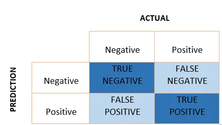

下面会以一个例子说明true negative, false negative, false positive, ture positive。

如果下图是一个预测病人中患有肿瘤的模型，测试数据集中包含100个患者。如下图所示：

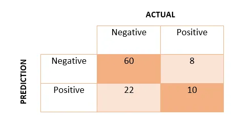

- **True Positive(TP)**：模型正确地预测了正类(预测和实际值都是正类)。在上面的例子中，该模型对10名患有肿瘤的人进行了正向预测。
- **Ture Negative(TN)**：模型正确地预测了负类(预测和实际值都是负的)。在上面的例子中，模型对60名没有患肿瘤的人进行了负向预测。
- **False Positive(FP)**：模型错误地预测了负类(预测正例，实际负例)。在上面的例子中，有22人被预测为肿瘤阳性，尽管他们并没有肿瘤。FP也称为第一类错误(TYPE I error)。
- **Flase Negative(FN)**：模型错误地预测了正类(预测负类，实际正类)。在上面的例子中，有8名患有肿瘤的人被预测为阴性。FN也称为II型错误(TYPE II error)。

根据上面四个值，我们可以计算得出

- True Positive Rate: $TPR=\frac{TP}{Actual Positive}=\frac{TP}{TP+FN}$  
- False Negative Rate: $FPR=\frac{FN}{Actual Positive}=\frac{FN}{TP+FN}$
- True Negative Rate: $TNR=\frac{TN}{Actual Negative}=\frac{TN}{TN+FP}$
- False Negative Rate: $FNR=\frac{FP}{Actual Negative}=\frac{FP}{TN+FP}$

即使数据是不平衡的，我们也可以弄清楚我们的模型是否工作良好。因此，TPR和TNR应较高，FPR和FNR应尽可能低。有了这几个数据的帮助，其他的性能指标可以被计算。

### 5.2 精确率 (Accuracy)

准确性是最基本的评估指标，衡量的是**模型正确预测的百分比**。它的计算方法是用正确预测的次数除以模型预测的总次数。

$$
Accuracy=\frac{TP+TN}{TP+TN+FP+FN}
$$

但是，它有两个严重的问题，会导致指标失效：

- 对于有倾向性的问题，往往不能用精度指标来衡量：比如，判断空中的飞行物是导弹还是其他飞行物，很显然为了减少损失，我们更倾向于相信是导弹而采用相应的防护措施。此时判断为导弹实际上是其他飞行物与判断为其他飞行物实际上是导弹这两种情况的重要性是不一样的；
- 对于样本类别数量严重不均衡的情况，也不能用精度指标来衡量：比如银行客户样本中好客户990个，坏客户10个。如果一个模型直接把所有客户都判断为好客户，得到精度为99%，但这显然是没有意义的。

所以，对于以上两种情况，单纯使用Accuracy来衡量算法的优劣是无效的。因此，就需要对真实值和预测值做更深入的分析。

### 5.3 查准率 (Precision)

Precision衡量的是所有正例(TP+FP)预测中，真例(TP)预测所占的比例。它的计算方法是用真阳性数据的个数除以真阳性数据和假阳性数据的总和:

$$
Precision=\frac{TP}{TP+FP}
$$

当**假阳性的代价很高**时，Precision是一个很好的衡量标准。例如，垃圾邮件检测。在垃圾邮件检测中，假阳性意味着一封**非垃圾**邮件(实际为**阴性**)被识别为**垃圾**邮件(预测为垃圾邮件)。垃圾邮件检测模型的准确率不高，会导致用户丢失重要邮件。

### 5.4 查全率 (Recall)

召回率(Recall)，也称为灵敏度(sensitivity)，衡量的是数据集中所有实际正例样本中真实正例预测的比例。它的计算方法是，真阳性数据的个数除以真阳性数据和假阴性数据的和：

$$
Recall=\frac{TP}{TP+FN}
$$

应用同样的理解，我们知道，当存在与**假阴性相关的高成本**时，Recall应该是我们用来选择最佳模型的模型指标。例如，在欺诈检测或病人检测中。如果**欺诈性**交易(实际为**阳性**)被预测为**非欺诈性**交易(预测为**阴性**)，那么对银行来说，后果可能非常糟糕。同样，在病人检测中。如果一个生病的病人(实际呈**阳性**)通过了测试，但被预测为没有生病(预测为**阴性**)。如果该疾病具有传染性，假阴性的成本将非常高。

> 对于Pricision和Recall有以下几个场景可以辅助理解：
> 
> - 地震预测：对于地震的预测，我们希望的是Recall非常高，也就是说每次地震我们都希望预测出来。这个时候我们可以牺牲Precision。情愿发出1000次警报，把10次地震都预测正确了；也不要预测100次对了8次漏了两次。“宁错拿一万，不放过一个”，分类阈值较低。
> - 嫌疑人定罪：基于不错怪一个好人的原则，对于嫌疑人的定罪我们希望是非常准确的。即使有时候放过了一些罪犯，但也是值得的。因此我们希望有较高的Precision值，可以合理地牺牲Recall。“宁放过一万，不错拿一个”，“疑罪从无”，分类阈值较高。
> 
> 问题1：某一家互联网金融公司风控部门的主要工作是利用机器模型抓取坏客户。互联网金融公司要扩大业务量，尽量多的吸引好客户，此时风控部门该怎样调整Recall和Precision？如果公司坏账扩大，公司缩紧业务，尽可能抓住更多的坏客户，此时风控部门该怎样调整Recall和Precision？
>
> 如果互联网公司要扩大业务量，为了减少好客户的误抓率，保证吸引更多的好客户，风控部门就会提高阈值，从而提高模型的查准率Precision，同时，导致查全率Recall下降。如果公司要缩紧业务，尽可能抓住更多的坏客户，风控部门就会降低阈值，从而提高模型的查全率Recall，但是这样会导致一部分好客户误抓，从而降低模型的查准率 Precision。

### 5.5 F1-Score 和 Fβ-Score 

根据上文的案例中，我们知道随着阈值的变化Recall和Precision往往会向着反方向变化，这种规律很难满足我们的期望，即Recall和Precision同时增大。有没有什么方法权衡Recall和Precision 的矛盾？

> 为什么准确率和召回率是互相影响？
> 
> recall和precision是相互矛盾的。如果想要更高的recall，那么就要让模型的预测能覆盖到更多的样本，但是这样模型就更有可能犯错，也就是说precision会比较低。如果模型很保守，只能检测出它很确定的样本，那么其precision会很高，但是recall会相对低。
>  
> - 当模型倾向于对样本进行较为保守的正类别预测时，只有非常确信的情况下才会将样本预测为正类别，这可能导致模型漏掉一些真正的正类别，从而使Recall降低。
> - 当模型更倾向于对样本进行激进的正类别预测时，即使对于不太确定的样本也会将其预测为正类别，这可能导致一些负类别样本被错误地预测为正类别，从而使Precision降低。

我们可以用一个指标来统一Recall和Precision的矛盾，即利用Recall和Precision的加权调和平均值作为衡量标准。

F-1 score是精确率和召回率的加权平均值，其中**权重是相等**的。它用于平衡精度和召回率之间的权衡：

$$
F1 score=\frac{2}{\frac{1}{Precision}+\frac{1}{Recall}}=2 \times \frac{Recall \times Precision}{Recall + Precision}
$$

F-1 score赋予召回率和准确率**相同的权重**。例如，如果一个模型具有高准确率但低召回率，这意味着它产生的假阳性较少，但错过了大量的真阳性。相比之下，具有高召回率但低准确率的模型产生了更多的假阳性，但捕获了更多的真阳性。在这种情况下，F-1 score可以帮助我们确定哪个模型更好。

有一个**加权**的F-1 score，我们可以给召回率和准确率赋予不同的权重。对于不同的问题对召回率和准确率的权重是不同的。所以，使用以下公式对不同方面进行加权：

$$
F_{\beta}=(1+\beta^2) \times \frac{Precision \times Recall}{\beta^2 \times Precision + Recall} 
$$

$\beta$ 表示召回率比准确率重要多少倍。如果召回率的重要性是准确率的两倍，则Beta值为2。

### 5.6 ROC曲线 (Receiver Operating Characteristic Curve) 和 AUC (Area Under Curve)

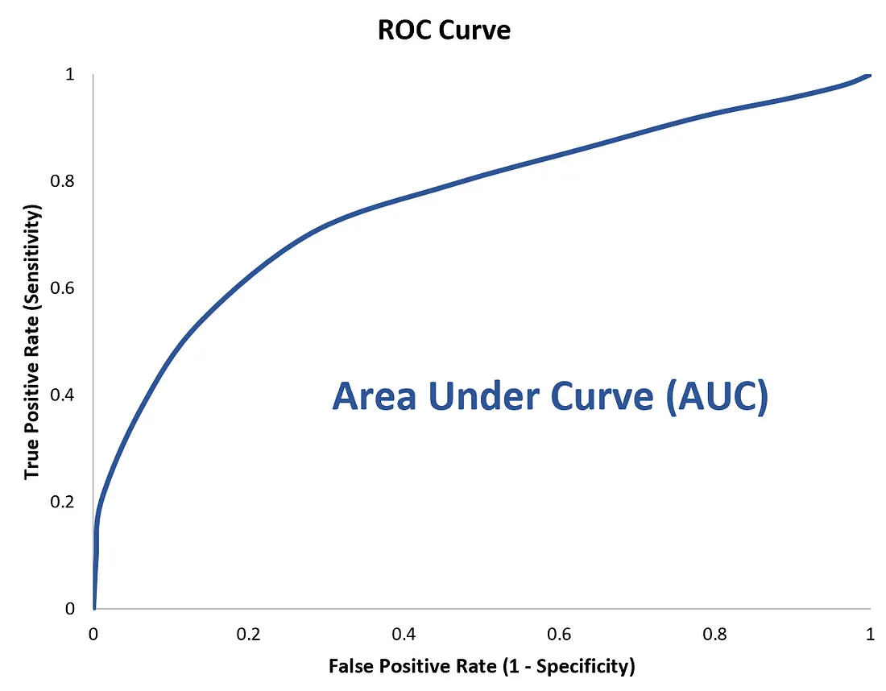

AUC是一种模型分类指标，且**仅仅**是二分类模型的评价指标。AUC是Area Under Curve的简称，那么Curve就是 ROC（Receiver Operating Characteristic），翻译为"接受者操作特性曲线"。也就是说ROC是一条曲线，AUC是一个面积值。

#### 5.6.1 ROC

ROC曲线为 FPR 与 TPR 之间的关系曲线，这个组合以 FPR 对 TPR，即是以代价 (costs) 对收益 (benefits)，显然**收益越高，代价越低，模型的性能就越好**。

- x 轴为假阳性率（FPR）：在所有的负样本中，分类器预测错误的比例， $FPR=\frac{FP}{FP+TN}$
- y 轴为真阳性率（TPR）：在所有的正样本中，分类器预测正确的比例（等于Recall）， $TPR=\frac{TP}{TP+FN}$

为了更好地理解ROC曲线，我们使用具体的实例来说明：

如在医学诊断的主要任务是尽量把生病的人群都找出来，也就是TPR越高越好。而尽量降低没病误诊为有病的人数，也就是FPR越低越好。不难发现，这两个指标之间是相互制约的。如果某个医生对于有病的症状比较敏感，稍微的小症状都判断为有病，那么他的TPR应该会很高，但是FPR也就相应地变高。最极端的情况下，他把所有的样本都看做有病，那么TPR达到1，FPR也为1。

我们以FPR为横轴，TPR为纵轴，得到如下ROC空间：

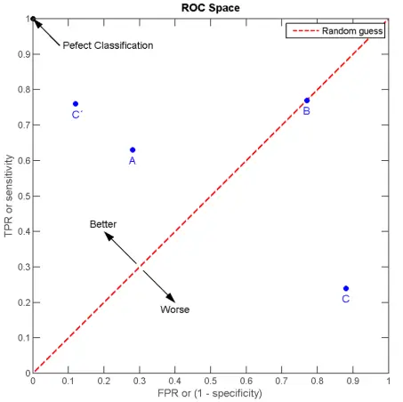

我们可以看出，左上角的点(TPR=1，FPR=0)，为完美分类，也就是这个医生医术高明，诊断全对。点A(TPR > FPR),医生A的判断大体是正确的。中线上的点B(TPR = FPR),也就是医生B全都是蒙的，蒙对一半，蒙错一半；下半平面的点C(TPR < FPR)，这个医生说你有病，那么你很可能没有病，医生C的话我们要反着听，为真庸医。

如何得到 ROC 曲线？

假设下图是某医生的诊断统计图，为未得病人群（上图）和得病人群（下图）的模型输出概率分布图（横坐标表示模型输出概率，纵坐标表示概率对应的人群的数量），显然未得病人群的概率值普遍低于得病人群的输出概率值（即正常人诊断出疾病的概率小于得病人群诊断出疾病的概率）。

竖线代表阈值。显然，图中给出了某个阈值对应的混淆矩阵，通过改变不同的阈值 ，得到一系列的混淆矩阵，进而得到一系列的TPR和FPR，绘制出ROC曲线。

阈值为1时，不管你什么症状，医生均未诊断出疾病（预测值都为N），此时 ，位于左下。阈值为 0 时，不管你什么症状，医生都诊断结果都是得病（预测值都为P），此时 ，位于右上。

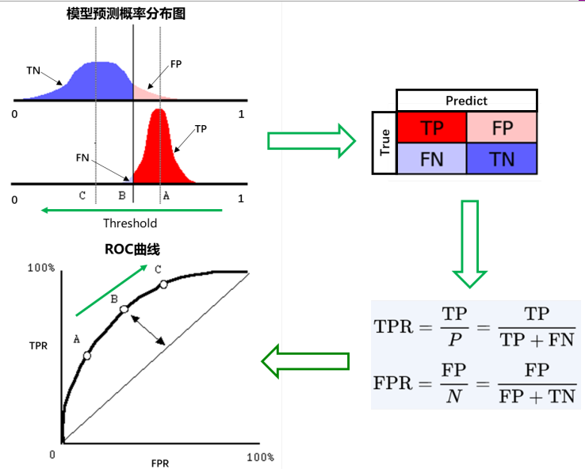

#### 5.6.2 AUC

AUC 值为 ROC 曲线所覆盖的**区域面积**，显然，AUC越大，分类器分类效果越好。

- AUC = 1，是完美分类器。
- 0.5 < AUC < 1，优于随机猜测。有预测价值。
- AUC = 0.5，跟随机猜测一样（例：丢铜板），没有预测价值。
- AUC < 0.5，比随机猜测还差；但只要总是反预测而行，就优于随机猜测。

#### 5.6.3 ROC曲线和AUC值的实例

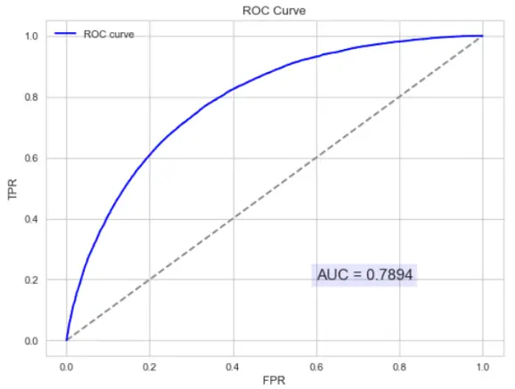

AUC的物理意义：AUC的物理意义正样本的预测结果大于负样本的预测结果的概率。所以AUC反应的是分类器对样本的排序能力。另外值得注意的是，**AUC对样本类别是否均衡并不敏感**，这也是不均衡样本通常用AUC评价分类器性能的一个原因。

> 问题：为什么说 ROC 和AUC都能应用于非均衡的分类问题？
> 
> ROC曲线只与横坐标 (FPR) 和 纵坐标 (TPR) 有关系 。我们可以发现TPR只是正样本中预测正确的概率，而FPR只是负样本中预测错误的概率，和正负样本的比例没有关系。因此 ROC 的值与实际的正负样本比例无关，因此既可以用于均衡问题，也可以用于非均衡问题。而 AUC 的几何意义为ROC曲线下的面积，因此也和实际的正负样本比例无关。
> 

### 5.7 PRC曲线 (Precision-Recall Curve)

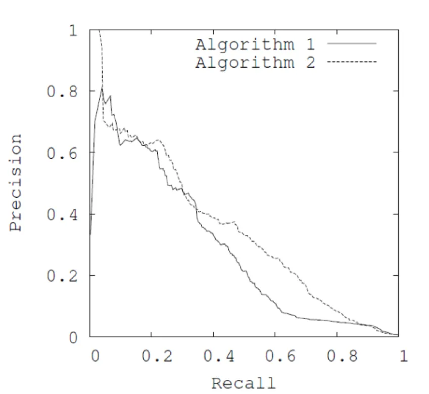

上图是PRC图像的示例，可以比较两个算法的Precision和Recall的比值，从而判断模型的性能，理想情况下曲线越趋向于**右上角**，模型的性能越好。既然有了ROC，为什么还要引入PRC？

这是因为如果数据集正负样本不均衡ROC不会很好的反应出模型的优劣。

上文可知，**ROC的面对不平衡数据的一致性表明其能够衡量一个模型本身的预测能力**，而这个预测能力是与样本正负比例无关的。但是这个不敏感的特性使得其较难以看出一个模型在面临样本**比例变化**时模型的预测情况。<u>而PRC因为对样本比例敏感，因此能够看出分类器随着样本比例变化的效果，而实际中的数据又是不平衡的，这样有助于了解分类器实际的效果和作用，也能够以此进行模型的改进</u>。

所以，PRC的**优势**就是，当正负样本差距不大的情况下，ROC和PR的趋势是差不多的，但是当负样本很多的时候，两者就截然不同了，ROC效果依然看似很好，但是PR上反映效果一般。

可以这样理解，如果一个数据集中，正样本数量为1，负样本数量为100。如果将正样本预测为负样本，则TPR可以一直维持在100%，预测错误则会突然下降到0%。**这就说明PR曲线在正负样本比例悬殊较大时更能反映分类的性能**。所以，在正负样本分布得极不均匀(highly imbalance datasets)的情况下，PRC比ROC能更有效地反应分类器的好坏。

综上，在实际工程中，我们可以使用ROC来**判断两个分类器的优良**，然后进行分类器的选择，然后可以根据PRC表现出来的结果衡量一个分类器面对**不平衡数据**进行分类时的能力，从而进行模型的改进和优化。

以下例子可以对PRC和ROC做一个更加深入的理解：

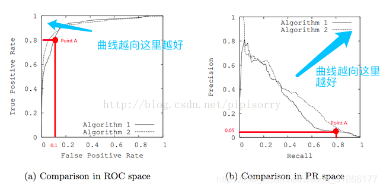


单从图a看，这两个分类器都接近完美(非常接近左上角)。图b对应着相同分类器的PR space。而从图b可以看出，这两个分类器仍有巨大的提升空间。那么原因是什么呢？

通过看Algorithm1的点 A，可以得出一些结论。首先图a和b中的点A是相同的点，只是在不同的空间里。因为TPR=Recall=TP/(TP+FN)，换言之，真阳性率(TPR)和召回率(Recall)是同一个东西，只是有不同的名字。所以图a中TPR为0.8的点对应着图b中Recall为0.8的点。

假设数据集有100个positive instances。由图a中的点A，可以得到以下结论：TPR=TP/(TP+FN)=TP/actual positives=TP/100=0.8，所以TP=80由图b中的点A，可得：Precision=TP/(TP+FP)=80/(80+FP)=0.05，所以FP=1520再由图a中点A，可得：FPR=FP/(FP+TN)=FP/actual negatives=1520/actual negatives=0.1，所以actual negatives是15200。

由此，可以得出原数据集中只有100个positive instances，却有15200个negative instances！这就是极不均匀的数据集。直观地说，在点A处，分类器将1600 (1520+80)个instance分为positive，而其中实际上只有80个是真正的positive。 我们凭直觉来看，其实这个分类器并不好。但由于真正negative instances的数量远远大约positive，ROC的结果却“看上去很美”。所以在这种情况下，PRC更能体现本质。

## 6. 面试题