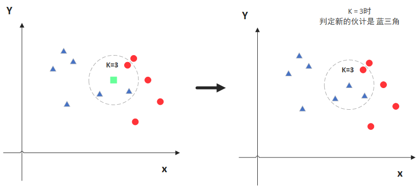
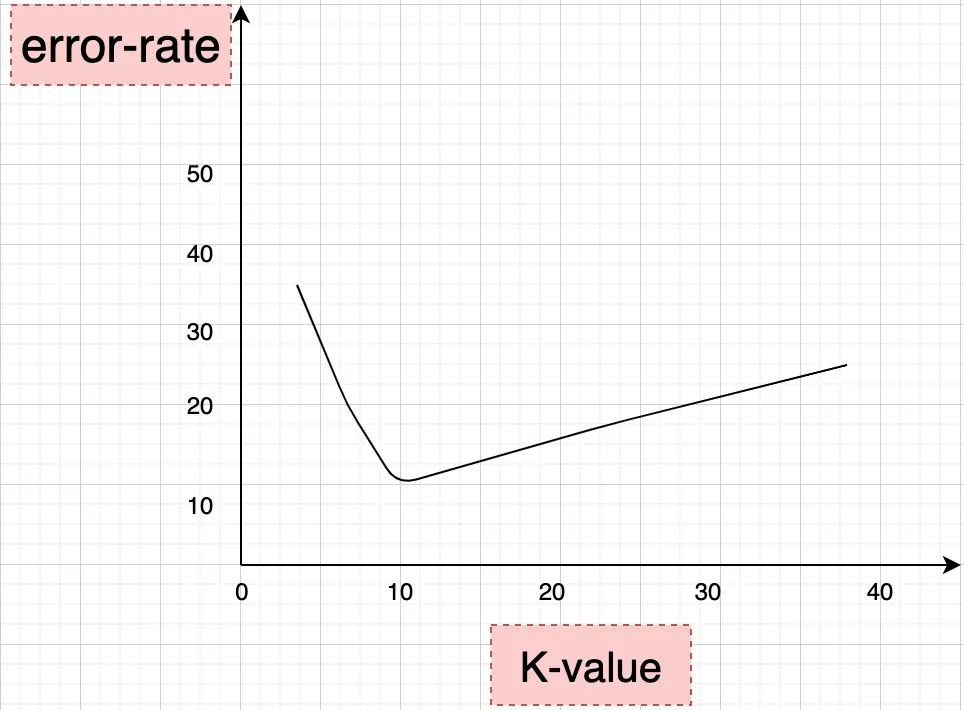
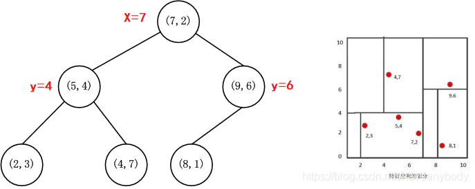
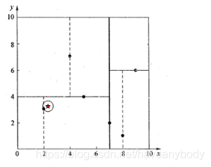

# KNN

- 编辑：李竹楠
- 日期：2024/03/05

## 1. 算法介绍

K近邻法(k-nearest neighbors,KNN)是一种应用比较多的机器学习算法模型，其核心思想就是未知的对象总是和距离自己最近的群体类似。简单地说就是一个人如果经常和好人走的近，那么我们可以认为（大概率）他是好人，如果他经常和坏人混迹在一起，那么我们就会认为他更可能是坏人，在推荐领域，KNN 可以用来为消费行为相似的人推荐商品。现在还有一个不确定的问题，就是距离最近的群体怎么衡量呢？这也正是KNN中K的含义，就是找距离自己最近的K个样本。这里需要注意 KNN 中的 K 和 K-Means 中的 K 是不同的， K-Means 的 K 表示把样本分为 K 个簇（类别），KNN 的 K 则是为了找最近的 K 个点，不过两者之间也有一些相似点，核心思想都是距离最小化。

由原理可知，KNN 算法可以认为是**没有**训练过程的，在预测阶段，计算未知点和所有样本的距离，然后选择距离未知点最近的 K 的样本，如果是**分类任务**，则根据 K 个样本的类别投票决定预测结果，如果是**回归任务**，则输出 K 个样本的平均值，可以发现 KNN 的输出策略和决策树是一致的。

算法过程如下：

1. 计算预测值到其他样本之间的距离；
2. 根据k的取值，选出距离最近的k个样本；
3. 根据投票结果，选出预测值。

> 我们通过变化 K 的取值来进行判断。在该算法中K的取值一般是奇数，防止两个类别的个数相同，无法判断对象的类别 $K=1, 3, 5, 7 \dots$。

## 2. K的取值

当 K 取值不同的时候，判别的结果是不同的。所以该算法中K值如何选择将非常重要，因为它会影响到我们最终的结果。

> K 值一般是通过**交叉验证**来确定的；经验规则来说，一般 k 是低于训练样本数的平方根。所谓交叉验证就是通过将原始数据按照一定的比例，比如 6/4 ，拆分成训练数据集和测试数据集，K 值从一个较小的值开始选取，逐渐增大，然后计算整个集合的方差，从而确定一个合适的 K 值。

经过使用交叉验证，我们会得到类似如下的图形，从图形中可以明显的：

- 当 K 先不断增大的时候，误差率会先进行降低。因为数据会包含更多的样本可以使用，从而分类效果会更好；
- 当 K=10 的附近，出现误差率的变化，建议 K=9 或者 11 ；
- 当 K 不断增大的时候，误差率将会不断增加。此时，KNN 算法将会变得没有意义。比如有 50 个样本，当 K 增加到 45 的时候，算法没有意义，几乎使用了全部样本数据，没有体现出最近邻的思想。

所以：

- **k值太小：容易受到噪声点的影响**。用较小的邻域中的实例进行预测，近似误差减小，估计误差增大，预测结果对近邻的实例点非常敏感，如果近邻点恰好是噪声，预测出错。
- **k 值太大：分类太多，太细，导致包含太多其他类别的点**。用较大的邻域中的实例点进行预测，减少学习的估计误差，但是近似误差增大，与输入实例较远的点的训练实例也会起预测作用，k 值增大意味着整个模型变得简单。

## 2. 度量距离

在统计学中，向量距离度量的方式很多，比较常用的主要有以下几种：

- 欧氏距离：$D(x, y) = \sqrt{(x_1-y_1)^2+(x_2-y_2)^2+ \dots +(x_n-y_n)^2} = \sqrt{\sum ^n_{i=1} (x_i - y_i)^2}$
- 曼哈顿距离：$D(x, y) = \vert x_1-y_1 \vert + \vert x_2-y_2 \vert + \dots + \vert x_n-y_n \vert = \sum ^n_{i=1} \vert x_i - y_i \vert$

## 3. KD 树

前面我们介绍了 KNN 的原理，但是有一个问题，就是在预测的时候，KNN 不同于传统有监督算法，只要把待预测样本的特征在训练好的模型中计算一遍即可，也不同于K-Means，只需要计算待预测样本和所有簇质心的距离即可，KNN 需要计算待预测样本和所有已知样本的距离，如果样本量有千百万级、特征也达到几千个，即使利用elkan K-means优化，那么这个计算量无疑也是很大的。因此为了优化这个问题，大神们也提出了解决方法，其中之一就是基于 KD 树的近邻搜索。KD树算法包括三步:

1. 第一步是建树；
2. 第二部是搜索最近邻；
3. 最后一步是预测。

### 3.1 KD树的建立

KD树建树采用的是从m个样本的n维特征中，分别计算n个特征的取值的方差，用方差最大的第k维特征 $n_k$ 对应的中位数样本 $x_{n_k}$ 来作为根节点。对于所有第k维特征的取值小于 $x_{n_k}$ 的样本，我们划入左子树，对于第k维特征的取值大于 $x_{n_k}$ 的样本，我们划入右子树，对于左子树和右子树，我们采用和刚才同样的办法来找方差最大的特征来做根节点，递归的生成KD树。

例如我们有6个二维特征样本：{(2,3)，(5,4)，(9,6)，(4,7)，(8,1)，(7,2)}，构建kd树的具体步骤为：

1. 分别计算两个特征的样本方差：$var(x1)=6.97$，$var(x2)=5.37$，可以发现 $x1$ 的方差更大，因此选择 $x1$ 作为第一次划分特征。
2. 对 $x1$ 特征排序后，对应的中位数特征样本为 $(7,2)$，即第一次划分的超平面为  $x=7$。因此，左子树样本集为：${(2,3), (4,7), (5,4)}$$，右子树样本集为：{(8,1), (9,6)}$
3. 对左右子树重复过程1和2，直到所有样本到划到叶子节点。例如，上面的左子树，$x2$
 的方差更大，中位数划分样本为：$(5,4)$，则对应的二级左子树为：${(2,3)}$，二级右子树为：${(4,7)}$，同样右子树对应的划分点为：$(9,6)$，对应的二级左子树为：${(8,1)}$

最终得到的KD树如下：

上面在取中位数的时候，偶数个数时，选取的都是右节点，选取左节点也是可以的。另外，也有一些资料介绍在构建KD树的过程中是依次循环遍历所有特征的，没有基于方差进行特征选择，但是用方差选择后建立的kd树搜索近邻效率更高。因此现在主流 KNN 类库中 KD 树建立都不再是轮流而是**基于方差选择**了。

### 3.2 KD树最近邻搜索

在完成KD树构建后，就可以对未知点进行最近邻搜索了。对于一个目标点，我们首先在KD树里面找到包含目标点的叶子节点（或者和目标点一样的点，此时一定是最近邻点，距离为0）。以目标点为圆心，以目标点到叶子节点样本实例的距离为半径，得到一个超球体，最近邻的点一定在这个超球体内部。这里先以两个简单的实例来描述最邻近查找的基本思路：

- 查询点 $(2.1, 3.1)$:
    1. 对于点$(2.1,3.1)$ 沿着KD树搜索，首先找到叶子节点，根据前面构建的二叉树超平面 $x=7$ 和 $y=4$，显然叶子节点为 $(2,3)$，此时搜索路径中的节点为 $(7,2),(5,4), (2,3)$。
    2. 以 $(2,3)$ 作为当前最近邻点，计算其到查询点 $(2.1,3.1)$ 的距离为 $0.1414$。以 $(2.1,3.1)$ 为圆心，以 $0.1414$ 为半径画圆，如下图所示。发现该圆并不和超平面 $y=4$ 交割，因此不用进入 $(5,4)$ 节点右子空间中去搜索，也意味着点 $(2.1,3.1)$ 到点 $(5,4)$ 的距离大于 $0.1414$。
        
    3. 同样，以 $(2.1,3.1)$ 为圆心，以 $0.1414$ 为半径画圆也不和超平面 $y=4$ 相交，因此也不用进入 $(7,2)$ 右子空间进行查找，所以点 $(2.1,3.1)$ 的最近邻点时 $(2,3)$。

### 3.3 KNN预测

根据以上步骤完成最近邻搜索，再进行KNN预测的效率无疑就高了很多。在KD树搜索最近邻的基础上，我们选择到了第一个最近邻样本，就把它置为已选。在第二轮中，我们忽略置为已选的样本，重新选择最近邻，这样跑k次，就得到了目标的K个最近邻点。

对于选择K个最近邻点的优化方法就是，在第一轮寻找最近邻点的过程中，我们已经计算了目标点和搜索路径上所有点的距离并将路径记录下来（动态规划思想），因此实际中不必一定执行K次。

## 4. 优缺点

- 优点：
    - 理论成熟，简单易用，既可以用来做分类也可以用来做回归，即使没有很高的数学基础也能搞清楚它的原理
    - 训练时间复杂度低，因为是惰性的
    - 适合用于多分类问题（对象具有多个标签）
- 缺点：
    - 对计算机的内存要求高：因为它存储了整个训练数据，性能较低
    - 样本不平衡的时候，对稀有类别的预测准确率低
    - 可解释性问题，其实 KNN 的可解释性是取决于已有样本的解释程度的