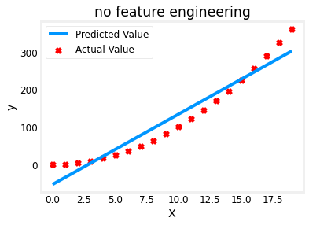

# 线性回归

- 编辑：李竹楠
- 日期：2024/02/14

## 1. 线性回归的实现与应用

### 1.1 线性回归模型

当 $y$ 是连续值的时候，监督学习的任务是学习到 $y$ 和 $x$ 的定量关系。如下图所示，$y$ 和 $x$ 的映射关系可以表示为一个一次函数。这种将 $x$ 映射到连续空间的问题就叫做**回归**。


举一个简单的线性回归模型，设 $x$ 为房屋面积，$y$ 为房屋价格，如果我们采集样本点 $(x, y)$，将这些点散落到坐标系中，可以明显发现 $y$ 和 $x$ 之间存在某种关系。具体而言，其关系可以使用一个 $y=ax+b$ 来描述。图中的点落在红色直线附近，这可能是因为测量的不准确，或者存在其他方面的**误差**。这里的 $y=ax+b$ 就是一个简单的一元线性回归模型，求出模型参数 $a$ 和 $b$， $y$ 和 $x$ 之间的关系也就确定下来。在这个例子中，也就知道了房屋的面积与价格的关系。

下面以房屋价格的例子介绍线性回归模型：

使用房价预测的例子。训练数据集包含三个示例，具有四个特征(大小、卧室、楼层和房龄)，如下表所示。**注意，与之前的实验不同，这里的尺寸是平方英尺，而不是1000平方英尺。这导致了一个问题，你将在下一个实验中解决**!

| Size (sqft) | Number of Bedrooms  | Number of floors | Age of  Home | Price (1000s dollars)  |   
| ----------------| ------------------- |----------------- |--------------|-------------- |  
| 2104            | 5                   | 1                | 45           | 460           |  
| 1416            | 3                   | 2                | 40           | 232           |  
| 852             | 2                   | 1                | 35           | 178           |  

首先，先定义以下符号：

|General <br />  Notation | Description| Python (if applicable) |
|:---|:---|:---|
| $a$ | scalar, non bold                                                      ||
| $\mathbf{a}$ | vector, bold                                                 ||
| $\mathbf{A}$ | matrix, bold capital                                         ||
| **Regression** |         |    |     |
|  $\mathbf{X}$ | training example matrix                  | `X_train` |   
|  $\mathbf{y}$  | training example  targets                | `y_train` 
|  $\mathbf{x}^{(i)}$, $y^{(i)}$ | $i_{th}$Training Example | `X[i]`, `y[i]`|
| m | number of training examples | `m`|
| n | number of features in each example | `n`|
|  $\mathbf{w}$  |  parameter: weight,                       | `w`    |
|  $b$           |  parameter: bias                                           | `b`    |     
| $f_{\mathbf{w},b}(\mathbf{x}^{(i)})$ | The result of the model evaluation at $\mathbf{x^{(i)}}$ parameterized by $\mathbf{w},b$: $f_{\mathbf{w},b}(\mathbf{x}^{(i)}) = \mathbf{w} \cdot \mathbf{x}^{(i)}+b$  | `f_wb` | 

并且定义部分数据：

``` python
X_train = np.array([[2104, 5, 1, 45], [1416, 3, 2, 40], [852, 2, 1, 35]]) # 分别对应房屋的属性
y_train = np.array([460, 232, 178]) # 房屋价格
```

对于训练集特征矩阵 $\mathbf{X}$ ，可以用一下形式表示：

$$\mathbf{X} = 
\begin{pmatrix}
 x^{(0)}_0 & x^{(0)}_1 & \cdots & x^{(0)}_{n-1} \\ 
 x^{(1)}_0 & x^{(1)}_1 & \cdots & x^{(1)}_{n-1} \\
 \cdots \\
 x^{(m-1)}_0 & x^{(m-1)}_1 & \cdots & x^{(m-1)}_{n-1} 
\end{pmatrix}
$$

- $\mathbf{x}^{(i)}$ 是一个**样本**，$\mathbf{x}^{(i)}$ $ = (x^{(i)}_0, x^{(i)}_1, \cdots,x^{(i)}_{n-1})$ 代表该样本中有 $n$ 个特征。
- $x^{(i)}_j$ 是样本 $i$ 中的元素 $j$ （用于标记哪一个特征）。

可得 $\mathbf{X}$ 是一个维度为 $(m, n)$ 的矩阵。其中，给训练集的样本数量为 $m$ （在上述代码中，array中有三个向量，每个向量代表一个**样本**）， 有 $n$ 个特征（在上述代码中，array中的每个向量中有四个数字，每个数字代表一个**特征**）。

通过以下代码展示输入数据：

``` python
# data is stored in numpy array/matrix
print(f'X shape: {X_train.shape}, X type: {type(X_train)}')
print(X_train)
print(f'Y shape: {y_train.shape}, X type: {type(y_train)}')
print(y_train)
```

``` shell
X shape: (3, 4), X type: <class 'numpy.ndarray'>
[[2104    5    1   45]
 [1416    3    2   40]
 [ 852    2    1   35]]
Y shape: (3,), X type: <class 'numpy.ndarray'>
[460 232 178]
```

接下来，定义模型**向量参数** $\mathbf{w}$ 和一个**标量参数** $b$ ：

$$\mathbf{w} = \begin{pmatrix}
w_0 \\ 
w_1 \\
\cdots\\
w_{n-1}
\end{pmatrix}
$$

其中，每个元素都对应一个特征，在这个例子中，$\mathbf{w}$ 大小为4。通常，我们将其定义为一个**列向量**。

在这里例子中，随意定义一个 $\mathbf{w}$ 和 $b$ 的初始值：

``` python
b_init = 785.1811367994083
w_init = np.array([ 0.39133535, 18.75376741, -53.36032453, -26.42131618])
print(f'w_init shape: {w_init.shape}, b_init type: {type(b_init)}')
```

``` shell
w_init shape: (4,), b_init type: <class 'float'>
```

这样我们就可以得到一个变量为 $\mathbf{x}$ $ = (x_0, x_1, \cdots,x_{n-1})$ 的**多变量线性回归模型**：

$$
f_{\mathbf{w},b}(\mathbf{x}) = \mathbf{w} \cdot \mathbf{x} + b
$$

$$
f_{\mathbf{w},b}(\mathbf{x}) =  w_0x_0 + w_1x_1 +... + w_{n-1}x_{n-1} + b
$$

相比较于一开始我们所展示的 $y=ax+b$ ，这个模型有更多的参数，将会更加合适的**拟合真实值**。线性回归的目标是找到一组权重向量 $\mathbf{w}$ 和偏置 $b$：当给定从 $\mathbf{X}$ 的同分布中取样的新样本特征时， 这组权重向量和偏置能够使得**新样本预测标签的误差尽可能小**。

### 1.2 损失函数 (Loss Function)

上文中提到，我们的**目标是找到一组权重向量和编制可以使得新样本预测标签的误差尽可能小**。

损失函数（loss function）能够量化目标的**真实值**与**预测值**之间的差距。 通常我们会选择**非负数**作为损失，且数值越小表示损失越小，完美预测时的损失为0。 回归问题中最常用的损失函数是平方误差函数。当样本 $i$ 的预测值为 $f_{\mathbf{w},b}(\mathbf{x}^{(i)})$ ，其相应的真实标签为 $y^{(i)}$ 时，平方误差公式可被定义为：

$$
loss^{(i)} = \frac{1}{2}(f_{\mathbf{w},b}(\mathbf{x}^{(i)}) - y^{(i)})^2
$$ 

其中，常数 $\frac{1}{2}$ 不会带来本质的差别，但这样在形式上稍微简单一些（因为当我们对损失函数求导后常数系数为1）。由于训练数据集并不受我们控制，所以经验误差只是关于模型参数的函数。下图为线性模型拟合数据的过程：


由于平方误差函数中的二次方项，估计值 $f_{\mathbf{w},b}(\mathbf{x}^{(i)})$ 和 真实标签 $y^{(i)}$ 之间**较大的差异将导致更大的损失**。 为了度量模型在整个数据集上的质量，我们需计算在训练集 $m$ 个样本的**损失均值**：

$$
J(\mathbf{w},b) = \frac{1}{2m} \sum\limits_{i = 0}^{m-1} (f_{\mathbf{w},b}(\mathbf{x}^{(i)}) - y^{(i)})^2
$$ 

其中，

$$
f_{\mathbf{w},b}(\mathbf{x}^{(i)}) = \mathbf{w} \cdot \mathbf{x}^{(i)} + b
$$ 

### 1.3 梯度下降 (Gradient Descent)


我们要求得最佳的 $\mathbf{w}$ 和 $b$，我们将会用到**梯度下降**， 这种方法几乎可以优化所有深度学习模型。它通过不断地在损失函数递减的方向上更新参数来降低误差。梯度下降最简单的用法是计算损失函数（数据集中所有样本的损失均值）关于模型参数的导数（在这里也可以称为梯度）。其迭代一次的过程如下：

$$\begin{align*} \text{repeat}&\text{ until convergence:} \; \lbrace \newline\;
& w_j = w_j -  \alpha \frac{\partial J(\mathbf{w},b)}{\partial w_j} \; & \text{for j = 0..n-1}\newline
&b\ \ = b -  \alpha \frac{\partial J(\mathbf{w},b)}{\partial b}  \newline \rbrace
\end{align*}$$

其中， $n$ 是特征的数量；参数 $w_j$ 和 $b$ 被计算出得出的梯度不断地更新；$\alpha$ 为学习率。

$$
\begin{align}
\frac{\partial J(\mathbf{w},b)}{\partial w_j}  &= \frac{1}{m} \sum\limits_{i = 0}^{m-1} (f_{\mathbf{w},b}(\mathbf{x}^{(i)}) - y^{(i)})x_{j}^{(i)} \\
\frac{\partial J(\mathbf{w},b)}{\partial b}  &= \frac{1}{m} \sum\limits_{i = 0}^{m-1} (f_{\mathbf{w},b}(\mathbf{x}^{(i)}) - y^{(i)})
\end{align}
$$

在训练了预先确定的若干迭代次数后（或者直到满足某些其他停止条件后）， 我们记录下模型参数的估计值，表示为 $w$ 和 $b$。 但是，即使我们的函数确实是线性的且无噪声，这些估计值也不会使损失函数真正地达到最小值。 因为算法会使得损失向最小值缓慢收敛，但却不能在有限的步数内非常精确地达到最小值。

>线性回归恰好是一个在整个域中只有一个最小值的学习问题。 但是对像深度神经网络这样复杂的模型来说，损失平面上通常包含多个最小值。 深度学习实践者很少会去花费大力气寻找这样一组参数，使得在训练集上的损失达到最小。 事实上，更难做到的是找到一组参数，这组参数能够在我们从未见过的数据上实现较低的损失， 这一挑战被称为泛化（generalization）。

梯度下降可分为以下几类，详细说明参考[模型优化](../4.2/optimization.md#4-梯度下降)：

- 批梯度下降
- 随机梯度下降
- Mini-batch 梯度下降

### 1.4 学习率 (Learning Rate)

正常情况下，每次像梯度的反方向走一步，误差都会变小。但是如果学习速率选择的过小，迈出的这一步就会很小，收敛速度会变慢。过大则可能越过了最佳点，导致在最优解附近震荡。


合适的学习速率，可以使得误差稳步减小，且减小幅度慢慢变少，最终能较为迅速地达到最佳点，如何选择合适的学习率，参考[模型优化](../4.2/optimization.md#3-学习率)。

### 1.5 矢量化 (Vectorization)

在训练我们的模型时，我们经常希望能够同时处理整个小批量的样本。 为了实现这一点，需要我们对计算进行矢量化， **从而利用线性代数库，而不是在Python中编写开销高昂的for循环**。以下实验对比：

``` python
n = 10000
a = torch.ones([n])
b = torch.ones([n])

# 使用for循环，每次执行一位的加法。
c = torch.zeros(n)
timer = Timer()
for i in range(n):
    c[i] = a[i] + b[i]
f'{timer.stop():.5f} sec'

d = a + b
f'{timer.stop():.5f} sec'
```

``` shell
'0.16749 sec'
'0.00042 sec'
```

结果很明显，第二种方法比第一种方法快得多。 矢量化代码通常会带来数量级的加速。 另外，我们将更多的数学运算放到库中，而无须自己编写那么多的计算，从而减少了出错的可能性。

## 2. 多项式回归的实现与应用

### 2.1 多项式回归 (Polynomial Regression)

前面介绍的线性回归法有一个很大的局限性: **假设数据背后是存在线性关系的**。但是在实际应用场景中, **具有线性关系**这么强的假设的数据集是比较少的, 更多数据之间是具有**非线性关系**的。然而，可以使用一种非常简单的手段改进线性回归法, 使得它可以对非线性的数据进行处理(预测), 也就是多项式回归。进而通过多项式回归这个方法引出机器学习中最为重要的一个概念: 模型泛化。


之前在线性回归中, 我们想找到一条直线, 使得这条直线能够尽可能地拟合这些数据。如果在这个简单的示例中, 所有的数据只有一个特征的话, 这条直线就可以写作 $y=ax+b$, $x$ 就是样本特征, $a$ 和 $b$ 是模型要求出来的参数。

不过对于有一些数据:


虽然也可以使用线性回归的方式来拟合这种数据, 但是其实它是具有更加强的非线性关系的。换句话说, 如果用一根二次曲线来拟合数据的话效果会更好. 对于一个二次曲线来说, 假设所有的样本也只有一个特征, 相应的方程就可以写成这样：$y=ax^2+bx+c$ 。

这个式子中, 虽然我们将它称为二次方程, 但是我们可以从另外一个角度来理解这个式子：**如果我们将 $x2$ 理解为一个特征, $x$ 理解为另外一个特征**。换句话说, 本来样本只有一个特征 $x$, 现在把它看作是有两个特征这样的一个数据集, 多了一个特征 $x2$ , 从这个角度理解的话, 其实这个式子依然是一个线性回归的式子。但是从 $x$ 的角度来看, 是一个非线性的方程. 这样的方式就叫做**多项式回归**。

> 相当于为样本多添加了一些特征, 这些特征是原来样本的多项式项。增加了这些项之后就可以使用线性回归的思路更好地拟合原来的数据, 但是本质上我们求出来的是对于原来的特征而言的非线性曲线。

多项式回归再机器学习算法上并没有新的地方, 完全是使用线性回归的思路. 它的关键在于**为原来的数据样本添加新的特征**, 而我们得到新的特征的方式是原有特征的多项式组合, 采用这样的方式就可以**解决非线性问题**。

> 于此同时, 这个思路也值得注意, **PCA算法**是对数据进行**降维**处理, 而**多项式回归算法**显然是做相反的事情, 它让数据集**升维**, 升高维度后(添加新的特征之后), 使得算法可以更好地拟合高维度的数据. 这个思路在后面SVM中还会再次见到。

### 2.2 多项式特征 (Polynomial Features)

我们将一点点的增加多项式特征，去观察模型的性能。

``` python
# 生成数据集
x = np.arange(0, 20, 1) 
y = 1 + x**2 
X = x.reshape(-1, 1)
# 训练模型
pred = train(x, y)

plt.scatter(x, y, marker='x', c='r', label="Actual Value"); plt.title("no feature engineering")
plt.plot(x, pred, label="Predicted Value");  plt.xlabel("X"); plt.ylabel("y"); plt.legend(); plt.show()
```



正如我们期望，这个模型没有很好的拟合真实值，如果我们添加多项式特征会发生什么？

``` python
# 生成数据集
x = np.arange(0, 20, 1)
y = 1 + x**2
# 添加多项式特征
X = x**2 
# 训练模型
pred = train(X, y)

plt.scatter(x, y, marker='x', c='r', label="Actual Value"); plt.title("Added x**2 feature")
plt.plot(x, pred, label="Predicted Value");  plt.xlabel("X"); plt.ylabel("y"); plt.legend(); plt.show()
```


得到一个完美的拟合曲线。从上面可知，$x^2$ 是必须的。但是，我们是不清楚如何构造多项式特征的。我们可以挨个加入去试试看：比如，加入 $y=w_0x_0 + w_1x_1^2 + w_2x_2^3+b$ 看下效果：

``` python
# 生成数据集
x = np.arange(0, 20, 1)
y = 1 + x**2
# 添加多项式特征
X = np.c_[x, x**2, x**3]
# 训练模型
pred = train(X, y)

plt.scatter(x, y, marker='x', c='r', label="Actual Value"); plt.title("Added x**2 feature")
plt.plot(x, pred, label="Predicted Value");  plt.xlabel("X"); plt.ylabel("y"); plt.legend(); plt.show()
```


以上，多项式特征是根据它们与目标数据的匹配程度来选择的。另一种思考方法是，一旦创建了新特征，我们仍然使用线性回归。因此，特征与目标是**线性**的。下图可以更好地理解这一点。


### 2.3 Scikit 中的多项式回归

在Scikit中，是通过 `PolynomialFeatures` 去生成多项式特征的。以 `X` 中有两个特征为例：

``` python
import numpy as np
from sklearn.preprocessing import PolynomialFeatures

if __name__ == '__main__':
    X = np.arange(1, 11).reshape(-1, 2)
    poly = PolynomialFeatures(degree=2)
    poly.fit(X)
    X2 = poly.transform(X)
    print(X2.shape)     # (5, 6)
    print(X2)
```

``` shell
(5, 6)
# 第一列是0次幂, 第二列和第三列是一次幂的项, x1和x2
# 二次幂的特征有3列, 分别x1平方, x1乘以x2, x2平方
[[  1.   1.   2.   1.   2.   4.]
 [  1.   3.   4.   9.  12.  16.]
 [  1.   5.   6.  25.  30.  36.]
 [  1.   7.   8.  49.  56.  64.]
 [  1.   9.  10.  81.  90. 100.]]
```

当参数 `degree` 传入 `i` 时，`PolynomialFeatures` 将会自动生成 `degree <= i` 的所有多项式的项，即上例中 ${1, x_1, x_2, x_1x_2, x_1^2, x_2^2}$ 。这个特性一方面使得 `PolynomialFeatures` 非常强大, 因为它涉及到所有可能的多项式的特征, 不过于此同时也会带来一些问题，比如过拟合与欠拟合问题，关于该问题可以参考[模型优化](../4.2/optimization.md)。

更加方便的使用多项式回归的的方式，使用Pipeline：

先来看一下如何使用多项式回归：首先，要将原本的数据通过 `PolynomialFeatures` 生成多项式的特征的样本数据。然后，之前是将生成的多项式样本数据直接送给了 `LinearRegression` 。但如果 `degree` 的值非常大, 这些样本数据之间生成的差距就会非常大例如1的100次方和10的100次方。而由于数据分布不均衡, 在梯度下降的过程中就会非常慢, 此时最好进行数据**归一化**。

因此整体进行了3步:

1. 生成多项式的特征
2. 数据的归一化
3. 线性回归

而Pipeline就可以将这三步合在一起, 使得每一次在调用的时候不用重复这三步：

``` python
import numpy as np
from sklearn.pipeline import Pipeline
from sklearn.preprocessing import PolynomialFeatures, StandardScaler

from sklearn.linear_model import LinearRegression

if __name__ == '__main__':
    x = np.random.uniform(-3, 3, size=100)
    X = x.reshape(-1, 1)
    y = 0.5 * x ** 2 + x + 2 + np.random.normal(0, 1, size=100)

    poly_reg = Pipeline([
        ('poly', PolynomialFeatures(degree=2)),
        ('std_scaler', StandardScaler()),
        ('lin_reg', LinearRegression())
    ])

    # 非常智能地, 先将X通过PolynomialFeatures
    # 再通过StandardScaler, 最后得到全新的X和y再送给LinearRegression
    poly_reg.fit(X, y)
    y_predict = poly_reg.predict(X)
```

也能得到一个二次曲线。`scikit-learn` 并没有多项式回归这样的类, 但是我们可以通过   `Pipeline` 方便地自己创建出多项式回归的类。

## 3. 面试题