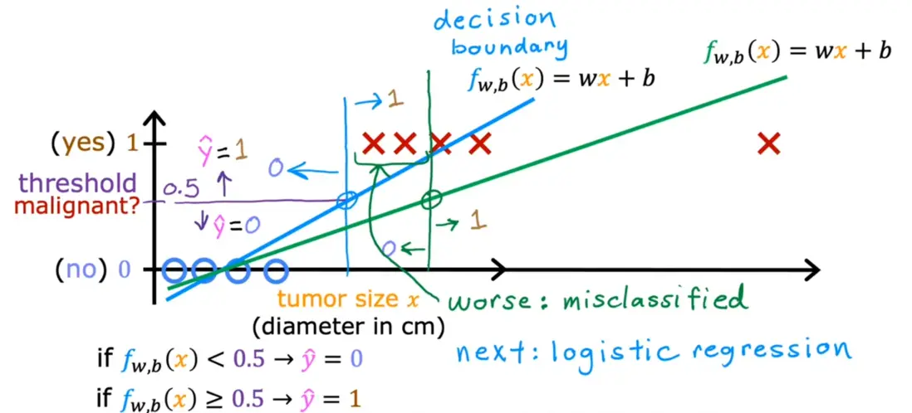
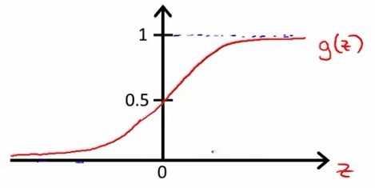
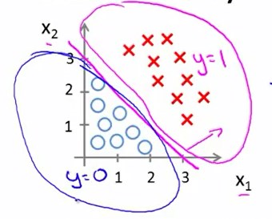
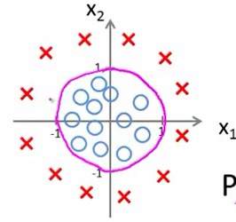
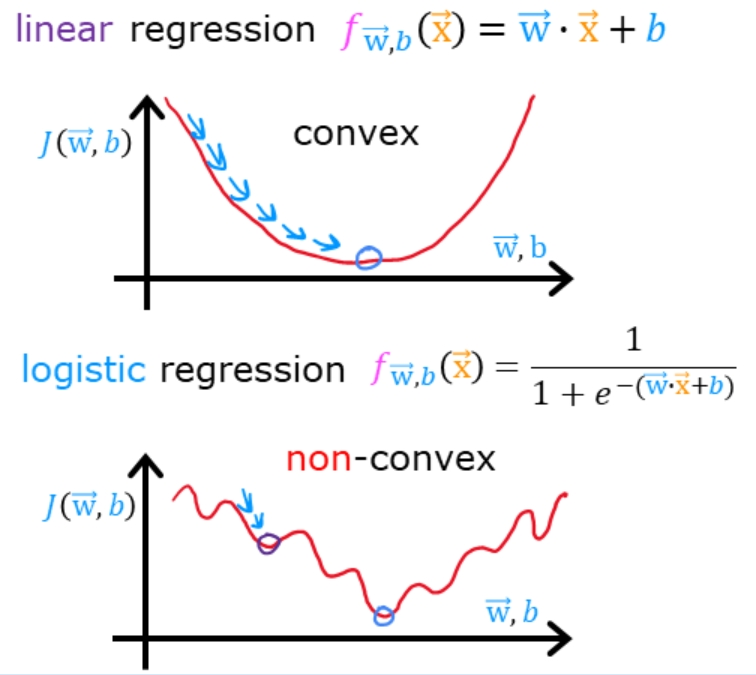
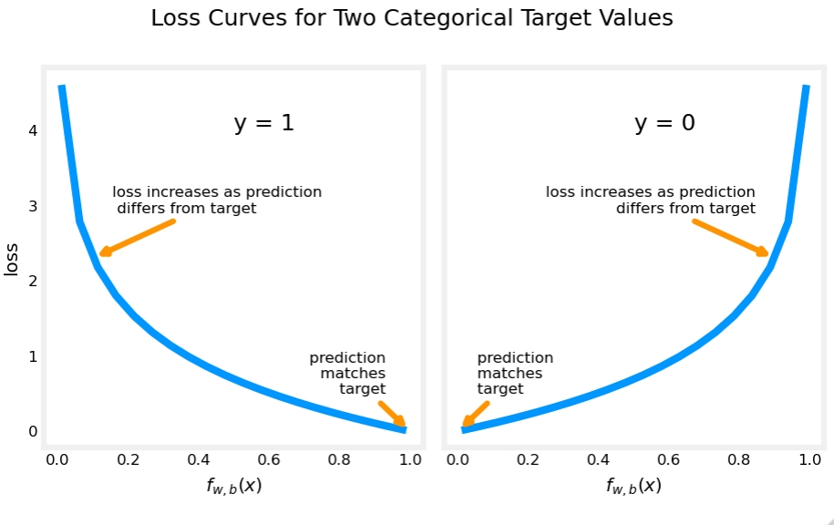

# 逻辑回归

- 编辑：李竹楠
- 日期：2024/02/14

## 1. 逻辑回归模型

分类问题和回归问题有一定的相似性，都是通过对数据集的学习来对未知结果进行预测，区别在于输出值不同。

- 分类问题的输出值是**离散值**（如垃圾邮件和正常邮件）。
- 回归问题的输出值是**连续值**（例如房子的价格）。

既然分类问题和回归问题有一定的相似性，那么我们能不能在回归的基础上进行分类呢？

可以想到的一种尝试思路是，先用线性拟合，然后对线性拟合的预测结果值进行量化，即将连续值量化为离散值，即使用**线性回归+阈值**解决分类问题。

我们来看一个例子。假如现在有一个关于肿瘤大小的数据集，需要根据肿瘤的大小来判定是良性（用⭕表示）还是恶性（用数字❌表示），这是一个很典型的二分类问题，如下图所示：

横轴为肿瘤大小，纵轴时可能输出的唯二的结果。假设，设置 `threshold=0.5` 作为是否为恶性肿瘤的阈值，则线性回归模型的预测值 

- $f_{w,b}(x)<0.5$ 时，得到预测值 $\hat{y}=0$，则说明良性肿瘤；
- $f_{w,b}(x) \geqslant 0.5$ 时，得到预测值 $\hat{y}=1$，则说明恶行肿瘤。

通过这些数据拟合出 **第一条（蓝色）** 拟合线：$f{w,b}(x)=wx+b$ ，做 $y=0.5$ 的水平线，与 $f{w,b}(x)=wx+b$ 相交，并在交点做一条垂线，即可得到决策边界。则：

- 在垂线左侧，所有的 $y$ 都将为0；
- 在垂线右侧，所有的 $y$ 都将为1.

但是，如果我们扩大数据集，在图中的右侧添加一组数据，并得到 **第二条（绿色）** 拟合线。如果此时不改变阈值，则决策边界向右移动。但是我们不能因为决策边界的右移而改变分类的标准，此时回归算法就成了一个糟糕的算法。

容易看出，有两个正例被错误的分类到负例当中。说明用线性函数去拟合并取阈值的办法行不通了。行不通的原因是函数图像过于直，容易受到训练集中的离群值（异常值）的影响。那么接下来需要考虑两个问题：

- 用一个不那么直的函数去拟合
- 选定正确的阈值

> 有两个原因不使用线性回归模型去做分类任务：
> 
> - 线性回归模型的输出是一个连续的实数，可以取任意实数值。而在分类任务中，我们通常需要将输入数据分为不同的类别，输出的结果应该是离散的类别标签。如果使用线性回归模型进行分类，它的输出可能会落在一个广泛的范围内，而不是限定在离散的类别上。
> -线性回归模型对于离群值（outliers）比较敏感，这可能导致在分类任务中出现问题。分类任务中，我们更关心的是样本属于哪个类别，而不是预测一个连续的值。线性回归模型可能会对离群值的影响过于敏感，导致分类错误（如在上文中分析）。

由于线性回归模型的值域在 $[-\infty, +\infty]$ ，这种情况下是无法获得稳定的判定阈值的。换句话说，我们希望把结果都映射到一个固定的大小区间，例如 $(0, 1)$ ，这样才能起到用回归模型去解决分类问题的作用。

那么，引进一个特殊函数去做**对连续值压缩变换**：**Sigmoid Function**：

$$
g(z) = \frac{1}{1+e^{-z}} \tag{1}
$$

where

$$
z= g(\mathbf{w} \cdot \mathbf{X} + b) \tag{2}
$$

带入 $(1)$ $(2)$，可得：

$$
f_{\mathbf{w}, b}(\mathbf{X})=g(\mathbf{w} \cdot \mathbf{X} + b)=\frac{1}{1+e^{-(\mathbf{w} \cdot \mathbf{X} + b)}}
$$

其图像如下所示：

可以看到，Sigmoid函数的输出值在0到1之间，即 $0<g(z)<1$。其中，$z$ 作为Sigmoid函数的输入，同时也是线性模型的输出。

这样就可以把**线性回归**的结果，压缩映射到**逻辑回归**中，完成分类任务。

在统计学中，逻辑回归函数 $g(z)$ 的意义给定输入样本特征 $x$ 和 参数 $\mathbf{w}, b$ 从而得出概率值 $P(y=1|\mathbf{x};\mathbf{w},b)$。
举个例子：加入输入样本 $\mathbf{X}$，其特征 $x$ 为肿瘤大小，函数输入值为 $g(z)=0.7$，预测值为 $\hat{y}=1$。就说明这个**样本有70%的可能性患有恶性肿瘤**，根据阈值判断 $g(z)>0.5$，即说明判定为恶性肿瘤，从而输出的预测值为 $\hat{y}=1$。

**注意：$P(y=0)+P(y=1)=1$**

## 2. 决策边界 (Decision Boundary)

### 2.1 线性决策边界

假设现在有数据集 $\mathbf{X}$，并且找到分类函数 $g(w_1x_1+w_2x_2+b)$ 的最佳参数 $w_1=1, w_2=1, b=-3$，可得：

$$
z=\mathbf{w} \mathbf{X} = x_1+x_2-3
$$

$x_1+x_2=3$ 图像如下所示，

那么在此例中：

- 直线上方，即 $x_1+x_2-3 \geqslant 0$时，预测 $y=1$；
- 直线下方，即 $x_1+x_2-3 < 0$时，预测 $y=0$。

我们将这条直线称为决策边界，也就是说在这条线的两边是不同的类，不同的决策。

### 2.2 非线性决策边界

假如，数据集分布如下图所示：

这显然需要**非线性**的函数才能最佳拟合。从[多项式回归](linear_regression.md#2-多项式回归的实现与应用)中可知，**可以添加额外的高次多项式项，来使函数图像发生变化**。
假设，已经找到分类函数 $g(w_1x_1+w_2x_2+w_3x_1^2+w_4x_2^2+b)$ 的最佳参数 $w_1=0, w_2=0, w_3=1, w_4=1, b=-1$，可得：

$$
z=\mathbf{w} \mathbf{X} = x_1^2+x_2^2-1
$$

那么在此例中：

- 在圆外部，$x_1^2+x_2^2-1 \geqslant 0$，预测 $y=1$
- 在圆内部，$x_1^2+x_2^2-1 < 0$，预测 $y=0$

同理，我们可以用更复杂的模型生成复杂的决策边界去拟合更为复杂的数据集。

## 3. 损失函数 (Loss Function)

前面的例子中，我们手动去了一些权重值和偏置，最后得到了决策边界。但是对于不同的参数，决策边界也不同。那么，那个参数是最佳参数？我们需要定义一个可以量化模型好坏的函数——损失函数。我们的目标是使得损失函数最小化。

我们如何衡量预测值和标准答案之间的差异呢？如果直接使用线性回归的损失函数（平方差损失）：

$$
J(w,b) = \frac{1}{2m} \sum\limits_{i = 0}^{m-1} (f_{w,b}(x^{(i)}) - y^{(i)})^2
$$ 

但是，在逻辑回归问题中**不适用**。Sigmoid 函数的变换使得我们最终得到损失函数曲线如下图（下）所示，是非常不光滑凹凸不平的，这种数学上叫做**非凸的损失函数**。

在逻辑回归模型场景下，如果使用的损失函数是非凸的，数学特性不太好，我们希望损失函数如下的凸函数。原因是，非凸的损失函数的**局部最优解不等于全局最优解**，并且**非常容易陷入局部最优解而无法到达全局最优解**。但是，凸优化问题中，局部最优解同时也是全局最优解，这一特性使得凸优化问题在一定意义上更易于解决，而一般的非凸最优化问题相比之下更难解决。所以我们更希望损失函数如上图（上）所示，是**凸函数**，我们在数学上有很好优化方法可以对其进行优化。

因此，在逻辑回归模型场景下，我们会改用**对数损失函数（二元交叉熵损失）**，这个损失函数同样能很好地衡量参数好坏，又能保证凸函数的特性。其中，对于每个样本都有对数损失函数的公式如下：

$$
\begin{equation}
  loss(f_{\mathbf{w},b}(\mathbf{x}^{(i)}), y^{(i)}) = \begin{cases}
    - \log\left(f_{\mathbf{w},b}\left( \mathbf{x}^{(i)} \right) \right) & \text{if $y^{(i)}=1$}\\
    - \log \left( 1 - f_{\mathbf{w},b}\left( \mathbf{x}^{(i)} \right) \right) & \text{if $y^{(i)}=0$}
  \end{cases}
\end{equation}
$$

函数图像如下图：

其中，$f_{\mathbf{w},b}$ 是模型的预测值，$y^{(i)}=1$ 是目标值。当 $g$ 为Sigmoid函数时，$f_{\mathbf{w},b}=g(\mathbf{w} \cdot \mathbf{x^{(i)}}+b)$。

- **$y_{(i)}=1$**：当一个样本为正样本时，若 $f_{\mathbf{w},b}$ ，的结果**接近0**（即预测为负样本），那么，$- \log\left(f_{\mathbf{w},b}\left( \mathbf{x}^{(i)} \right) \right)$ 的值很**大**，那么得到的惩罚就**大**；
- **$y_{(i)}=0$**：当一个样本为负样本时，若 $f_{\mathbf{w},b}$ ，的结果**接近1**（即预测为正样本），那么 $- \log \left( 1 - f_{\mathbf{w},b}\left( \mathbf{x}^{(i)} \right) \right)$ 的值很**大**，那么得到的惩罚就**大**。

上图的分段函数图像和并，与**平方差损失函数**非常相似。以下是对于损失函数的合并写法：

$$
loss(f_{\mathbf{w},b}(\mathbf{x}^{(i)}), y^{(i)}) = (-y^{(i)} \log\left(f_{\mathbf{w},b}\left( \mathbf{x}^{(i)} \right) \right) - \left( 1 - y^{(i)}\right) \log \left( 1 - f_{\mathbf{w},b}\left( \mathbf{x}^{(i)} \right) \right))
$$

其中，当 $ y^{(i)} = 0$ 时，

$$
\begin{align}
loss(f_{\mathbf{w},b}(\mathbf{x}^{(i)}), 0) &= (-(0) \log\left(f_{\mathbf{w},b}\left( \mathbf{x}^{(i)} \right) \right) - \left( 1 - 0\right) \log \left( 1 - f_{\mathbf{w},b}\left( \mathbf{x}^{(i)} \right) \right) \\
&= -\log \left( 1 - f_{\mathbf{w},b}\left( \mathbf{x}^{(i)} \right) \right)
\end{align}
$$

当 $ y^{(i)} = 1$ 时，

$$
\begin{align}
  loss(f_{\mathbf{w},b}(\mathbf{x}^{(i)}), 1) &=  (-(1) \log\left(f_{\mathbf{w},b}\left( \mathbf{x}^{(i)} \right) \right) - \left( 1 - 1\right) \log \left( 1 - f_{\mathbf{w},b}\left( \mathbf{x}^{(i)} \right) \right)\\
  &=  -\log\left(f_{\mathbf{w},b}\left( \mathbf{x}^{(i)} \right) \right)
\end{align}
$$

显然，简化后的函数在 $y=0 or 1$，的情况下，与简化前的分段函数是完全等价的。那么终于可以得出完整的逻辑回归**代价函数**如下：

$$ 
J(\mathbf{w},b) = \frac{1}{m} \sum_{i=0}^{m-1} \left[ loss(f_{\mathbf{w},b}(\mathbf{x}^{(i)}), y^{(i)}) \right] \tag{1} 
$$

其中，$loss(f_{\mathbf{w},b}(\mathbf{x}^{(i)}), y^{(i)})$ 是对每个样本的误差：

$$
loss(f_{\mathbf{w},b}(\mathbf{x}^{(i)}), y^{(i)}) = -y^{(i)} \log\left(f_{\mathbf{w},b}\left( \mathbf{x}^{(i)} \right) \right) - \left( 1 - y^{(i)}\right) \log \left( 1 - f_{\mathbf{w},b}\left( \mathbf{x}^{(i)} \right) \right) \tag{2} 
$$

$m$ 是训练集样本数量，并且

$$
\begin{align}
  f_{\mathbf{w},b}(\mathbf{x^{(i)}}) &= g(z^{(i)})\tag{3} \\
  z^{(i)} &= \mathbf{w} \cdot \mathbf{x}^{(i)}+ b\tag{4} \\
  g(z^{(i)}) &= \frac{1}{1+e^{-z^{(i)}}}\tag{5} 
\end{align}
$$

## 4. 梯度下降 (Gradient Decsent)

对于逻辑回归的梯度下降如下公式所示：

$$
\begin{align*}
&\text{repeat until convergence:} \; \lbrace \\
&  \; \; \;w_j = w_j -  \alpha \frac{\partial J(\mathbf{w},b)}{\partial w_j} \tag{1}  \; & \text{for j := 0..n-1} \\ 
&  \; \; \;  \; \;b = b -  \alpha \frac{\partial J(\mathbf{w},b)}{\partial b} \\
&\rbrace
\end{align*}
$$

其中，每次迭代都会更新 $w_j$ 

$$\begin{align*}
\frac{\partial J(\mathbf{w},b)}{\partial w_j}  &= \frac{1}{m} \sum\limits_{i = 0}^{m-1} (f_{\mathbf{w},b}(\mathbf{x}^{(i)}) - y^{(i)})x_{j}^{(i)} \tag{2} \\
\frac{\partial J(\mathbf{w},b)}{\partial b}  &= \frac{1}{m} \sum\limits_{i = 0}^{m-1} (f_{\mathbf{w},b}(\mathbf{x}^{(i)}) - y^{(i)}) \tag{3} 
\end{align*}$$

$m$ 是训练集样本的数量；$f_{\mathbf{w},b}(x^{(i)})$ 是预测值；$y^{(i)}$ 是目标值；并且

$$
\begin{align}
f_{\mathbf{w},b}(\mathbf{x}) &= g(z)\tag{3} \\
z &= \mathbf{w} \cdot \mathbf{x}+ b\tag{4} \\
g(z^{(i)}) &= \frac{1}{1+e^{-z}}\tag{5} 
\end{align}
$$

由上面的公式可见，**逻辑回归**的梯度下降与**线性回归**的梯度下降非常相似。但是，由于 $f_{\mathbf{w},b}(\mathbf{x})$ 函数的不同，使得它们是不同的算法。

## 5. 多分类问题

采用 One vs Rest 或者 One vs One。

## 6. 面试题

### 6.1 为什么逻辑回归的输出值可以作为概率

### 6.2 逻辑回归是否可以使用其他的函数替代 sigmoid 函数