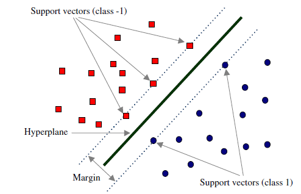
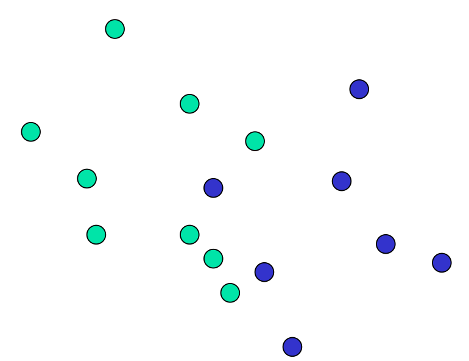
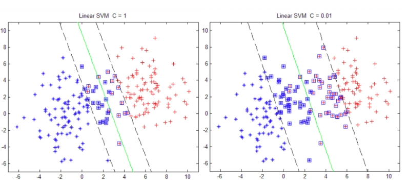

# Support Vector Machine

- 编辑：李竹楠
- 日期：2024/03/05

## 1. 直观理解

下图中有分别属于二分类的一些二维数据点和三条直线。如果三条直线分别代表三个分类器的话，请问哪一个分类器比较好？

我们凭直观感受应该觉得答案是H3。首先H1不能把类别分开，这个分类器肯定是不行的；H2可以，但分割线与最近的数据点只有很小的间隔，如果测试数据有一些噪声的话可能就会被H2错误分类(即对噪声敏感、泛化能力弱)。H3以较大间隔将它们分开，这样就能容忍测试数据的一些噪声而正确分类，是一个泛化能力不错的分类器。

对于支持向量机来说，数据点若是 $p$ 维向量，我们用 $p−1$ 维的超平面来分开这些点。但是可能有许多超平面可以把数据分类。最佳超平面的一个合理选择就是以最大间隔把两个类分开的超平面。因此，SVM选择能够**使离超平面最近**的数据点的到**超平面距离最大**的超平面。

以上介绍的SVM只能解决线性可分的问题，为了解决更加复杂的问题，支持向量机学习方法有一些由简至繁的模型:

- 线性可分SVM：当训练数据线性可分时，通过硬间隔(hard margin)最大化可以学习得到一个线性分类器，即硬间隔SVM，如上图的的H3。
- 线性SVM：当训练数据不能线性可分但是可以近似线性可分时，通过软间隔(soft margin)最大化也可以学习到一个线性分类器，即软间隔SVM。
- 非线性SVM：当训练数据线性不可分时，通过使用核技巧(kernel trick)和软间隔最大化，可以学习到一个非线性SVM。

## 2. 线性可分SVM（硬间隔）

考虑如下形式的线性可分的训练数据集，${(X_1, y_1), (X_2, y_2), \dots, (X_n, y_n)}$。其中 $X_i$ 是一个含有 $d$ 个元素的列向量, 即 $X_i∈R^d$; $y_i$是标量, $y∈+1,−1$, $y_i=+1$时表示 $X_i$ 属于正类别, $y_i=−1$ 时表示 $X_i$ 属于负类别。

回忆一下感知机的目标: 找到一个超平面使其能正确地将每个样本正确分类。感知机使用**误分类最小**的方法求得超平面，不过此时解有无穷多个(例如上图的H2和H3以及它俩的任意线性组合)。而线性可分支持向量机利用**间隔最大化**求最优分离超平面，这时解是唯一的。

### 2.1 超平面与间隔

一个超平面由法向量 $W$ 和截距 $b$ 决定,其方程为 $X^TW+b=0$, 可以规定法向量指向的一侧为正类,另一侧为负类。下图画出了三个平行的超平面，法方向取左上方向。

为了找到最大间隔超平面，我们可以先选择分离两类数据的两个平行超平面，使得它们之间的距离尽可能大。在这两个超平面范围内的区域称为“间隔(margin)”，最大间隔超平面是位于它们正中间的超平面。这个过程如上图所示。

### 2.2 间隔最大化

将高数里面求两条平行直线的距离公式推广到高维可求得上图中margin的 $\rho$:

$$
margin=\rho=\frac {2}{\Vert W \Vert}
$$

目标是使得 $\rho$ 最大，等价于使得 $\rho^2$ 最大：

$$
\mathop{\max} \limits_{W, b} \rho \Leftrightarrow \mathop{\max} \limits_{W, b} \rho^2 \Leftrightarrow \mathop{\min} \limits_{W, b} \frac{1}{2} \Vert W \Vert ^2
$$

上式的 $\frac{1}{2}$ 是为了后续求导后刚好能消去，没有其他特殊意义。

同时也不要忘了有一些约束条件：

$$
\begin{cases}
    X_i^TW+b>1,  & y_i=1 \\
    X_i^TW+b<1, & y_i=-1
\end{cases}
$$

总结一下，间隔最大化问题的数学表达就是：

$$
\mathop{\min} \limits_{W, b} J(W) = \mathop{\min} \limits_{W, b} \frac{1}{2} \Vert W \Vert ^2 \\
s.t. \qquad y_i(X_i^TW+b) > 1, i=1, 2, 3, \dots, n. 
$$

通过求解上式即可得到最优超平面 $\hat{W}$ 和 $\hat{b}$，如何求解见[对偶问题](#24-对偶问题)。

### 2.3 支持向量

在线性可分的情况下，训练数据集的样本点中与分离超平面距离最近的数据点称为支持向量(support vector)，支持向量是使中的约束条件取等的点，即满足：

$$
y_i(X_i^TW+b) = 1
$$

的点。也即所有在直线 $X_i^TW+b=1$ 或直线 $X_i^TW+b=-1$ 的点。如下图所示：

**在决定最佳超平面时只有支持向量起作用，而其他数据点并不起作用**。如果移动非支持向量，甚至删除非支持向量都不会对最优超平面产生任何影响。也就是说支持向量对模型起着决定性的作用，这也是“支持向量机”名称的由来。

### 2.4 对偶问题

日后再补

## 3. 线性SVM（软间隔）

在硬间隔中， 讨论的是假定训练数据是严格线性可分的，即存在一个超平面能完全将两类数据分开。但是现实任务这个假设往往不成立，例如下图所示的数据：

### 3.1 间隔最大化

解决该问题的一个办法是允许SVM在少量样本上出错，即将之前的硬间隔最大化条件放宽一点，为此引入“软间隔(soft margin)”的概念。即允许少量样本不满足约束：

$$
y_i(X_i^TW+b) > 1
$$

为了使不满足上述条件的样本点尽可能少，我们需要在优化的目标函数里面新增一个对这些点的惩罚项。最常用的是hinge损失:

$$
l_{hinge}=max(0, 1-z)
$$

即若样本点满足约束条件损失就是0, 否则损失就是 $1−z$，则优化函数为：

$$
\mathop{\min} \limits_{W, b} \frac{1}{2} \Vert W \Vert ^2 + C \sum ^n_{i=1} \mathop{\max}(0, 1-y_i(X_i^TW+b))
$$

其中，$C>0$ 称为惩罚项，$C$ 越小时对误分类惩罚越小，越大时对误分类惩罚越大。当 $C$ 取正无穷时就变成了硬间隔优化。实际应用时我们要合理选取 $C$ ，$C$ 越小越容易欠拟合，$C$ 越大越容易过拟合。

如果我们引入“松弛变量” $\xi_i>0$，那么公式：

$$
\mathop{\min} \limits_{W, b} \frac{1}{2} \Vert W \Vert ^2 + C \sum ^n_{i=1} \xi_i \\
s.t. \qquad y_i(X_i^TW+b) > 1-\xi_i \\
\xi_i>0, i=1, 2, 3, \dots, n. 
$$

上式所述问题即软间隔支持向量机。

### 3.2 对偶问题

日后再补

### 3.3 惩罚参数 $C$

对于不同惩罚参数 $C$，SVM结果如下图所示：

再来看看我们的原始目标函数:

$$
\mathop{\min} \limits_{W, b} \frac{1}{2} \Vert W \Vert ^2 + C \sum ^n_{i=1} \xi_i
$$

可以将上述公式看作两部分：

- 前半部分用来描述所求模型的某些性质(SVM就是要求间隔最大)；
- 用来描述模型与训练数据的契合程度（即误差）。

而参数 $C$ 就是用于对二者的折中,即我们一方面要求模型要满足某种性质另一方面又想使模型与训练数据很契合。所以，

- $C$ 越大即对误分类的惩罚越大(要求模型对训练模型更契合)，这可能会存在过拟合；
- $C$ 越小即相对更加看重公式的前半部分，此时可能存在欠拟合。

## 4. 非线性SVM（核技巧）

前面介绍的都是线性问题，但是我们经常会遇到非线性的问题(例如异或问题)，此时就需要用到核技巧(kernel trick)将线性支持向量机推广到非线性支持向量机。需要注意的是，不仅仅是SVM，很多线性模型都可以用核技巧推广到非线性模型，例如核线性判别分析(KLDA)。

### 4.1 核函数

如下图所示，核技巧的基本思路分为两步:

1. 使用一个变换将原空间的数据映射到新空间(例如更高维甚至无穷维的空间)；
2. 然后在新空间里用线性方法从训练数据中学习得到模型。

怎样映射到特征空间？

首先介绍核函数定义：

> 设 $\mathcal{X}$ 是输入空间(欧式空间 $R^n$ 的子集或离散集合)，又设 $\mathcal{H}$ 是特征空间(希尔伯特空间)，如果存在一个 $\mathcal{X}$ 到 $\mathcal{H}$ 的映射：
>
> $$
> \phi(x):\mathcal{X} \rightarrow \mathcal{H}
> $$
> 
> 使得对所有 $x, z ∈ \mathcal{X}$，函数 $K(x, z)$ 满足条件：
> 
> $$
> K(x, z)=\phi(x) \cdot \phi(z)
> $$
> 
> 则称 $K(x, z)$ 为核函数，\phi(x) 为映射函数。

通常，直接计算 $K(x,z)$ 比较容易而通过 $\phi(x)$ 和 $\phi(z)$ 计算 $K(x,z)$ 并不容易。而幸运的是，在线性支持向量机的对偶问题中，无论是目标函数还是决策函数都只涉及到输入样本与样本之间的內积，因此我们不需要显式地定义映射 $\phi(x)$ 是什么而只需事先定义核函数 $K(x,z)$ 即可。也就是说，在核函数 $K(x,z)$ 给定的情况下，可以利用解线性问题的方法求解非线性问题的支持向量机，此过程是隐式地在特征空间中进行的。

### 4.2 正定核

由上面的介绍可知，我们只需要定义核函数就可以了。但是如何不通过映射 $\phi(x)$ 判断给定的一个函数 $K(x,z)$ 是不是核函数呢？或者说，$K(x,z)$ 需要满足什么条件才是一个核函数。

通常所说的核函数就是正定核函数，下面不加证明的给出正定核的充要条件：

> 设 $\mathcal{X} ⊂ R^n$ 是定义在 $\mathcal{X} \times \mathcal{X}$ 上的对称函数，如果对任意 $x_i∈\mathcal{X}$，$K(x, z)$ 对应的Gram矩阵：
> 
> $$
> K=[k(x_i, y_i)]]_{m \times m} 
> $$
> 是半正定矩阵，则 $K(x,z)$ 是正定核。

虽然有了上述定义，但是实际应用时验证 $K(x,z)$ 是否是正定核依然不容易，因此在实际问题中一般使用已有的核函数，下面给出一些常用的核函数：

- 线性核函数
- 多项式核函数
- 高斯核函数

## 5. 总结

任何算法都有其优缺点，支持向量机也不例外。

- 优点：
    - 由于SVM是一个凸优化问题，所以求得的解一定是全局最优而不是局部最优。
    - 不仅适用于线性线性问题还适用于非线性问题(用核技巧)。
    - 拥有高维样本空间的数据也能用SVM，这是因为数据集的复杂度只取决于支持向量而不是数据集的维度，这在某种意义上避免了“维数灾难”。
    - 理论基础比较完善(例如神经网络就更像一个黑盒子)。
- 缺点：
    - 只适用于二分类问题。(SVM的推广SVR也适用于回归问题；可以通过多个SVM的组合来解决多分类问题)
    - 训练时间长

因此支持向量机目前只适合小批量样本的任务，无法适应百万甚至上亿样本的任务。

调参经验：

- 将原始数据转换为SVM算法期待的格式；
- 将数据进行scaling(很重要)；
- 使用交叉验证寻找最优参数 $C$；
- 用上面找到的最优参数在整个训练集上训练。