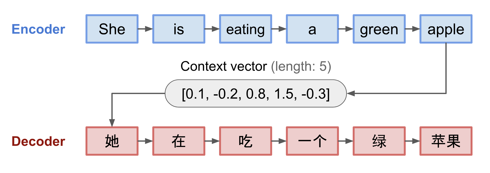

# 注意力机制

- 编辑：李竹楠
- 日期：2024/03/08

## 1. 原理

### 1.1 简单概括

在某种程度上，注意力机制是将注意力分配给图片或者句子的不同区域，如下图所示：

人类的视觉注意力允许我们以“高分辨率”去关注某个区域(即看黄色框中的尖耳朵)，而以“低分辨率”去感知周围的图像（即现在的雪景背景和服装），然后调整焦点或做相应的推断。给定图像的一个小块，其余的像素提供了应该在那里显示什么的线索。我们希望在黄色盒子里看到一个尖尖的耳朵，因为我们已经看到了狗的鼻子，另一个尖尖的耳朵在右边，以及柴犬神秘的眼睛(红色盒子里的东西)。然而，底部的毛衣和毯子不会像那些狗的特征那样有用。

类似地，我们可以解释一个句子或接近上下文中的单词之间的关系。当我们看到“吃”的时候，我们期望很快会遇到一个与食物有关的词。颜色术语描述的是食物，但可能与“吃”没有太多直接的联系。

简而言之，注意力机制可以大致理解为存在一个**带有权重的向量**：为了**预测或推断出一个元素**（如像素在一个图像或一个单词一个句子中），我们使用这个**向量**去计算需要分配多强烈的**关注度**，去关注**其他元素**。

### 1.2 为什么使用注意力机制

Seq2Seq模型在语言模型领域诞生(*[Sutskever, et al. 2014](https://arxiv.org/abs/1409.3215)*)。广义上讲，它旨在将输入序列(源)转换为新序列(目标)，两个序列都可以是任意长度的。转换任务的例子包括文本或音频中多语言之间的机器翻译，问答对话生成，甚至将句子解析为语法树。

Seq2Seq模型通常具有**编码器-解码器**架构，由以下部分组成:

- **编码器**处理输入序列并将信息压缩为固定长度的上下文向量(也称为句sentence embedding)。这种表示可以很好地概括整个源序列的含义。
- 使用上下文向量初始化**解码器**，用于输出转换后的内容。早期的工作只使用编码器网络的最后一个状态作为解码器的初始状态。

编码器和解码器都是循环神经网络，即使用LSTM或GRU单元。

这种**fixed-length context vector**的设计有一个关键的缺点就是无法记住长句子。当它完成对整个输入的处理后，往往会忘记第一部分。注意力机制(*[Bahdanau et al., 2015](https://arxiv.org/pdf/1409.0473.pdf)*)就是为了解决这个问题而诞生的。

### 1.3 注意力机制结构

注意力机制是用于帮助Seq2Seq模型去记忆长语句的结构在机器翻译领域。不是简单的在编码器的last hidden state创建一个单一context vector，**而是在编码器和context vector之间创建了一个注意力权重向量，这个向量中的参数可以通过学习得到**。

如下图所示，加入注意力后的context vector有着以下结构：

- encoder hidden states
- decoder hidden states
- alignment between source and target

在source与target之间使用context vector做对齐，并且在context vector中带有被学习得到的注意力权重，所以不用担心“遗忘”问题。

## 2. 注意力机制工作原理

下面使用数学定义去分析注意力机制。假设，定义长度为 $n$ 的输入向量source sequence $x$ 和长度为 $m$ 的输出向量target sequence $y$：

$$
x=[x_1, x_2, \dots, x_n] \\
y=[y_1, y_2, \dots, y_m]
$$

使用上图中的双向RNN网络，编码器可以如下表示，其中 $\overrightarrow{h_i}$ 是记忆单元的前馈，$\overleftarrow{h_i}$ 是记忆单元的后馈。两个简单的连接表示编码器状态。这样做的目的是在一个单词的注释中同时包含前两个单词和后一个单词。每个记忆单元表示如下：

$$
h_i=[\overrightarrow{h_i^T}， \overleftarrow{h_i^T}], i=1, \dots, n
$$

解码器是由在所有的位置 $t, t=1, \dots, m$ 上，有隐含状态 $s_t=f(s_{t-1}, y_{t-1}, c_t)$ 组成。其中，这里的context vector $c_t$ 是所有输入序列的隐含状态的总和，并且由对齐分数加权得到：

$$
\begin{align}
c_t&=\sum^n_{i=1} \alpha_{t,i}h_i  \\
\alpha_{t,i}&=align(y_t, x_i) \\
&=\frac{exp(score(s_{t-1}, h_i))}{\sum^n_{\prime {i}=1} exp(score(s_{t-1}, h_{\prime {i}}))}
\end{align}
$$

其中，$c_t$ 是对于输出 $y_i$ 的Context Vector；$\alpha_{t,i}$ 表示 $y_t$ 和 $x_i$ 是如何匹配的。

对齐模型(alignment model)根据在位置 $i$ 的输入和在位置 $t$ 的输出 $(y_t, x_i)$ 的匹配程度，为它们分配分数 $\alpha$。集合 $a_{t,i}$ 是权重，它定义了每个输出应该考虑多少每个源的隐藏状态。在Bahdanau的论文中，对齐分数 $\alpha$ 由具有单个隐藏层的**前馈网络**参数化，该网络与模型的其他部分联合训练。假设tanh作为非线性激活函数，score函数的形式如下:

$$
score(s_t, h_i)=v_a^Ttanh(W_\alpha[s_t;h_i])
$$

其中，权重矩阵 $v_a$ 和 $W_a$ 将会在对其模型中被训练。

对齐分数矩阵是一个很好的“副产品”，可以明确显示源词和目标词之间的相关性：

## 3. 自注意力(self-attention)

自注意力，也称为内部注意力(intra-attention)，是一种将单个序列的不同位置联系起来的注意力机制，以便计算相同序列的表示。它已被证明在机器阅读、抽象摘要或图像描述生成中非常有用。

在[Long Short-Term Memory-Networks for Machine Reading](https://arxiv.org/pdf/1601.06733.pdf)中采用自注意力机制进行机器阅读。在下面的例子中，自注意力机制使我们能够学习当前单词和句子前一部分之间的相关性。

在seq2seq模型中，我们将输入序列编码为上下文向量，然后将此上下文向量提供给解码器以产生预期的良好输出。

然而，如果输入序列变长，只依赖一个上下文向量的效果就会变差。我们需要输入序列(编码器)中隐藏状态的所有信息，以便更好地解码(注意力机制)。

利用输入隐藏状态的一种方法如下所示:

换句话说，在注意力机制中，上下文向量被计算为值的加权和，其中分配给每个值的权重是通过查询与相应键的兼容性函数计算的。

这里，查询来自解码器的隐藏状态，键和值来自编码器的隐藏状态(图中的键和值相同)。得分是查询和键之间的适配度，可以是查询和键之间的点积(或其他形式的适配度)。然后，得分通过softmax函数产生一组权重，其总和为1。每个权重乘以其相应的值以产生利用所有输入隐藏状态的上下文向量。

请注意，如果我们手动设置最后一个输入的权重为1，所有优先级为0，我们将注意力机制减少到原始的seq2seq上下文向量机制。也就是说，不关注早期的输入编码器状态。

现在，让我们考虑自注意力机制，如下图所示:

与上图不同的是，查询、键和值是相应的输入状态向量的转换。其他的保持不变。

注意，我们仍然可以使用原始编码器状态向量作为查询、键和值。那么，我们为什么需要转换呢?变换就是一个简单的矩阵乘法，如下所示:

## 4. 软注意力和硬注意力

在[Show, Attend and Tell: Neural Image Caption Generation with Visual Attention](https://proceedings.mlr.press/v37/xuc15.pdf)论文中，注意力机制被应用于图像来生成字幕。图像首先由CNN编码以提取特征。然后，LSTM解码器使用卷积特征来逐个产生描述性单词，其中的权重是通过注意力学习的。注意力权重的可视化清楚地展示了模型关注图像的哪些区域，从而输出某个单词。

首先根据注意力是否访问**整个**图像还是只访问一**部分**，提出了“软”注意力与“硬”注意力的区别:

- 软注意力：学习对齐权重矩阵，并放置在源图像中的所有块上;基本上与[Sutskever, et al. 2014](https://arxiv.org/abs/1409.3215)的关注类型相同，2015年。
    - 优点：模型是光滑和可微的。
    - 缺点：当源输入很大时，代价很高。
- 硬注意力：一次只选择图像的一个块进行注意力计算。
    - 优点：推理时计算量少。
    - 缺点：模型是不可微的，需要更复杂的技术，如方差减少或强化学习来训练。参考[Effective Approaches to Attention-based Neural Machine Translation](https://arxiv.org/abs/1508.04025)

## 5. 全局注意力和局部注意力

[Effective Approaches to Attention-based Neural Machine Translation](https://arxiv.org/abs/1508.04025)提出了“全局”和“局部”关注。全局注意力类似于软注意力，而局部注意力是硬注意力和软注意力的融合，是对硬注意力的改进，使其可微：模型首先预测当前目标单词的单个对齐位置，然后使用以源位置为中心的窗口来计算上下文向量。

## 4. NLP中的注意力机制

日后在补。

## 5. 计算机视觉中的注意力机制

日后在补。

## 6. 面试题