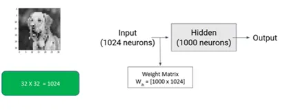

# 卷积神经网络

- 编辑：李竹楠
- 日期：2024/02/22

## 1. 为什么需要卷积网络？

以下面的图片为例，来说明为什么需要卷积网络而不是多层感知机(Multi-Layer Perceptron, MLP)处理图像问题：

在上面的例子中，我们会发现很难解释我们左边的图像到底是什么意思，但当我们看到右边的图像时，我们立即意识到这是一张狗的图像。有趣的是，这两个图像是相同的。右边的图像是狗的二维图像，而左边的图像只是一维图像。不仅人类，计算机也很难识别以一维表示的图像。

接下来考虑另外一个场景：

在上图中，第一幅图像是正常的狗的图像，而第二幅图像是经过处理的，其中我们交换了鼻子和眼睛。从目前的形式来看，我们很容易识别图像中的异常，但在一维情况下，很难找出这些异常。这是MLP的第一个问题，即**失去图像的空间方向(Loss Spatial Orientation of Image)**。我们必须记住，只有当鼻子、眼睛、耳朵等相对地出现在它们应该出现的位置时，狗才是狗。任何相对位置的变化都不能使该图像成为狗。

MLP使用图像的一维表示来识别或分类这些图像，而CNN使用二维表示来识别它们。因此**CNN保留了空间方向**。

另外一个问题是**MLP需要更多的计算量**。如果我们考虑相邻的图像并创建一个包含1000个神经元的神经网络，则权重矩阵的参数数量约为 $10^6$。

如果我们考虑具有更多像素数量的相邻图像并构建一个神经网络，在这种情况下，参数的数量将为 $600 \times 10^6$。

以上的两个问题对我们的计算机系统来说都是一场灾难。因此，我们所看到的同时考虑不同维度的两幅图像并使用单隐层构建神经网络的问题被称为神经网络中的参数探索。CNN解决了神经网络中丢失空间方向和参数探索两个问题。它既**保留了空间方向**，又**减少了神经网络中可训练参数的数量**。

## 2. 卷积网络结构

### 2.1 卷积层(Convolutional Layer)

#### 2.1.1 卷积操作

卷积核用于提取特征。因此，现在让我们讨论一下如何使用卷积核提取特征。关于卷积核的相关介绍可参考：

- [传统数字图像处理-滤波器](../4.3/preprocessing_td.md#1313-滤波)
- [Getting Started with Image Data-Deep Learning](https://medium.com/analytics-vidhya/getting-started-with-image-data-deep-learning-328faad6d929)

假设我们有一个表示图像的数字矩阵，我们使用 $3 \times 3$ 的滤波器，并使用滤波器对图像执行元素级乘法。过滤操作后得到的结果存储在新的矩阵中，称为**特征图(Feature Map)**。

卷积核以从左到右的方向移动。卷积核在水平方向上移动的像素数量称为列步长(column stride)。滤波器在垂直方向上移动的像素数量称为行步长(row stride)。这种操作称为**卷积操作(convolution operation)**，其中滤波器在图像中滑动，执行元素级操作并生成称为特征映射的新矩阵。

下面介绍图像输入维度、卷积核和特征图的关系。所有的卷积操作都离不开这个关系。

在上图中，我们有一个大小为(13 x 8)的输入图像，其次是通过卷积操作获得的大小为(3 x 3)的滤波器和大小为(11 x 6)的特征图。

再来思考下图：

当在输入图像的第一个patch上使用卷积核时，它比较目标像素34上下左右的像素值，并将结果值存储在特征图中。

基本上，特征图包含绿色框中突出显示的像素的值，但边缘的像素不考虑。

如果我们考虑边缘上的像素，即像素36，我们将注意到高亮像素周围没有像素，因此它在卷积操作中没有贡献，**因此在每次卷积操作后特征图的大小变得更小**。

#### 2.1.2 填充策略(Padding Strategies)和步长(Stride)

正如我们在上一节中所理解的那样，边界上的像素对卷积操作没有贡献，因此为了解决这个问题，让我们了解**填充策略**。

在构建卷积层时，我们可以设置两种类型的填充策略：

- same: 特征图和输入图像具有**相同的大小**，因为图像边缘周围添加了零。
- valid: 特征图和输入图像**大小不同**，因为没有加零。

如果使用 `valid` 处理一个 $720 \times 960$ 的图像，可以参考下面的公式来计算我们输出的高度和宽度，即特征图的高度和宽度：

$$
\begin{align}
height_{out} &= \frac{height_{in}-kernel_{height}}{stride_{row}}+1 \\
width_{out} &= \frac{width_{in}-kernel_{width}}{stride_{column}}+1
\end{align}
$$

注意：

- 每个卷积层可以有**多个**卷积核。
- 卷积核中的值不是固定的，并在**训练过程中学习**。这就像MLP一样，我们有在反向传播过程中学习的权重矩阵等参数。在CNN中，我们有在反向传播过程中学习的滤波器值。

使用以上公式可下列参数去理解下图：

- padding: valid
- stride: 1
- kernel: $3 \times 3$

#### 2.1.3 特征图操作

现在，我们用上节的情景下使用 $n$ 个卷积核，我们将 $n$ 个特征图堆叠在一起。每个卷积核中的值可以是不同的，并在反向传播中学习，因此我们也可以具有单个输入图像的不同特征图。

如果我们的输入图象是多通道的，即彩色图像：

使用上面的图像作为输入，我们不能将我们的2D卷积核用于卷积操作，因为**卷积核中的通道数量应该与输入图像中的通道数量相同**（如果我们同时使用RGB图像和2D卷积核，深度学习框架会自动处理它。我们不必提及渠道的数目）。如下图所示：

现在，我们将有27个值，而不是9个值，卷积核将会对这些值进行卷积操作并生成特征图，如以下操作：

#### 2.1.4 局部相关性(Local Connectivity)和参数共享(Parameter Sharing)

在**局部相关性**中，输出像素值从完整图像的一个(小)局部像素值组中获取输入。它与卷积运算相同，即逐元素进行卷积计算。CNN的架构(在后面部分讨论)确保学习到的卷积核对空间局部输入产生最强的响应。

在**参数共享**中，输入图像中的所有像素共享相同的卷积核矩阵。如果我们与MLP进行比较，每个输入层和隐藏层分配了不同的权重，因此可训练参数的数量取决于输入大小，但在这种情况下，对于完整的输入图像，无论输入图像大小，我们都使用相同的卷积核。

#### 2.1.4 卷积层

假设我们有1000张大小为 $200 \times 200 \times 3$ 的图像。现在，将这些图片输入到卷积层，对第一层卷积核以及参数做以下设置：

- input: 1000, $200 \times 200 \times 3$
- layer 1: 
    - kernel: 32, $3 \times 3 \times 3$ 
    - stride: 1
    - padding: valid 
- layer 1 output(layer 2 input): 1000, $198 \times 198 \times 32$
- layer 2:
    - kernel: 64, $3 \times 3 \times 32$ 
    - stride: 1
    - padding: valid
- layer 2 output(output): 1000, $196 \times 196 \times 64$

在每一步卷积操作之后，我们使用**激活函数**来引入非线性。它不会改变输出的尺寸。

### 2.2 全连接层(Fully-Connected Layer, FC Layer)

在上节的结果中，卷积层的输出是一个三维矩阵，并不是架构的最终输出。在卷积层之后，我们添加隐藏层，也称为**全连接层**。正如我们在MLP中所看到的，它只接受一维矩阵作为输入，因此我们从卷积层获得的三维输出将转换为一维, 并且在FC层中的图像大小将为2458624(1000,196x196x64)。这个过程被称为扁平化(Flattening)。

在上图中，对于1000分类的分类器来说，FC层的输出是非常大的。因此，为了处理这种情况，我们使用另一层称为池化层。

### 2.3 池化层(Pooling Layer)

池化层主要用于降维，目的是使得计算更容易，训练更快。有两种主要的池化技术，即最大池化和平均池化。在深入这些技术的细节之前，首先了解如何进行池化操作。

上图是大小为4x4的输入图像和大小为2x2的窗口，并设置步长为1。由于窗口大小为2x2，我们从输入图像中选择2x2patch，执行一些数学运算并生成输出。

我们目前讨论的例子是单通道图像作为输入。如果我们有RGB图像呢？需要注意的是**池化减少的是图像高度和宽度的维度，而不是通道的维度**。

还有一些池化技术也被使用，如GlobalAveragePooling和GlobalMaxPooling，它们将从所有通道中获得平均值或最大值，它通常在最后一层使用，以将我们的三维输入转换为一维。

## 3. 前向传播(Forward Propagation)

在前向传播中，卷积层在卷积核的帮助下从输入图像中提取特征，并将得到的输出发送到全连接层，全连接层使用输入的权重和偏差来计算输出。在反向传播过程中，这些卷积核的权重和偏差值被学习并不断更新。

为了简单起见，只考虑单个卷积层和隐藏层中的单个神经元。

## 4. 反向传播(Backward Propagation)

在反向传播中，我们将获得的输出与预测输出进行比较，并计算误差。如果误差很大，我们可以说预测与实际值相比较大。现在，这个误差值取决于3个参数，即权重，偏差和滤波器值。在反向传播期间，这些值会被更新。

## 5. 参考

- [Understanding Convolutional Neural Network (CNN): A Complete Guide](https://learnopencv.com/understanding-convolutional-neural-networks-cnn/)
- [Convolutional Neural Network Tutorial](https://www.simplilearn.com/tutorials/deep-learning-tutorial/convolutional-neural-network#learn_more_about_cnn_and_deep_learning)
- [A Comprehensive Guide to Convolutional Neural Networks](https://www.v7labs.com/blog/convolutional-neural-networks-guide)
- [Activation Functions in Neural Networks [12 Types & Use Cases]](https://www.v7labs.com/blog/neural-networks-activation-functions)
- 
- 

## 5. 面试题

### 深度学习为什么在计算机视觉领域这么好？

传统的计算机视觉方法需首先基于经验手动设计特征，然后使用分类器分类，这两个过程都是分开的。而深度学习里的卷积网络可实现对局部区域信息的提取，获得更高级的特征，当神经网络层数越多时，提取的特征会更抽象，将更有助于分类，同时神经网路将提取特征和分类融合在一个结构中。

### 阐述一下感受野的概念，并说一下在CNN中如何计算？

感受野指的是卷积神经网络每一层**输出**的特征图上每个像素点映射回**输入**图像上的区域的大小，神经元感受野的范围**越大**表示其接触到的原始图像范围就**越大**，也就意味着它能学习**更为全局**，语义层次更高的特征信息，相反，范围越小则表示其所包含的特征越趋向局部和细节。因此感受野的范围可以用来大致判断每一层的抽象层次，并且我们可以很明显地知道**网络越深**，神经元的**感受野越大**。卷积层的感受野大小与其之前层的**卷积核尺寸和步长**有关，与padding无关。

参考：
- https://blog.mlreview.com/a-guide-to-receptive-field-arithmetic-for-convolutional-neural-networks-e0f514068807
- https://blog.csdn.net/weixin_41950276/article/details/82880465

### 上采样的原理和常用方式

在卷积神经网络中，由于输入图像通过卷积神经网络(CNN)提取特征后，输出的尺寸往往会变小，而有时我们需要将图像恢复到原来的尺寸以便进行进一步的计算(如图像的语义分割)，这个使图像由小分辨率映射到大分辨率的操作，叫做上采样，它的实现一般有三种方式：

- 插值，一般使用的是双线性插值，因为效果最好，虽然计算上比其他插值方式复杂，但是相对于卷积计算可以说不值一提，其他插值方式还有最近邻插值、三线性插值等（插值所利用的信息越来越多，feature map越来越平滑，但是同时计算量也越来越大）；
- 转置卷积又或是说反卷积，双线性插值方法中不需要学习任何参数。而转置卷积就像卷积一样需要学习参数，通过对feature map的参数学习增加feature map的分辨率。
- Max Unpooling，在对称的max pooling位置记录最大值的索引位置，然后在unpooling阶段时将对应的值放置到原先最大值位置，其余位置补0。

参考：

- https://www.cnblogs.com/jiangkejie/p/12904304.html

### 下采样的作用是什么？通常有哪些方式？

下采样层有两个作用：

- 减少计算量，防止过拟合；
- 增大感受野，使得后面的卷积核能够学到更加全局的信息。

下采样的方式主要有两种：

- 采用stride为2的池化层，如Max-pooling和Average-pooling，目前通常使用Max-pooling，因为他**计算简单**而且能够更好的**保留纹理特征**；
- 采用stride为2的卷积层，下采样的过程是一个信息损失的过程，而池化层是不可学习的，用stride为2的可学习卷积层来代替pooling可以得到更好的效果，当然同时也增加了一定的计算量。

### 介绍一下空洞卷积的原理和作用

空洞卷积最初的提出是为了解决图像分割的问题而提出的,常见的图像分割算法通常使用**池化层和卷积层来增加感受野(Receptive Filed)**，同时也**缩小**了特征图尺寸(resolution)，然后再利用上采样还原图像尺寸，特征图缩小再放大的过程造成了**精度上的损失**，因此需要一种操作可以在**增加感受野的同时保持特征图的尺寸不变**，从而代替下采样和上采样操作，在这种需求下，空洞卷积就诞生了。

当然,如果不用空洞卷积这种方案,那怎么去弥补经过下采样而造成信息损失呢？其实，这是另一个思路了，于是才有了我们熟知的skip connection，它可以为上采样弥补信息，像FCN、U-Net这种典型的拓扑网络。其实我个人认为，如果一个问题如果从不同的思路去想的话，就会出现不同的解决方案。

与正常的卷积不同的是，空洞卷积引入了一个称为 **扩张率(dilation rate)** 的超参数，该参数定义了卷积核处理数据时各值的间距。扩张率中文也叫空洞数(Hole Size)。

缺点：

- 网格效应：连续使用三次r=2的空洞卷积会导致中间有很多空格，即很多像素没有利用到，这会导致出现网格效应，

如何解决？

既然空洞卷积存在着网格效应，那有什么方法可以解决这个问题吗。开门见山，论文中巧妙的使用了不同膨胀因子的空洞卷积，这样就能有效解决空洞卷积网格效应的问题。

### 深度可分离卷积的概念和作用

在计算资源受限制的移动端设备上，常规的卷积操作由于运算量大，经常难以满足实际运行速度的要求，这时，深度可分离卷积（Depthwise Separable Convolution）就排上了用场。深度可分离卷积是由**Depthwise(DW)卷积与Pointwise(PW)卷积**组成。该结构和常规卷积类似，可用来提取特征，但相比常规卷积，其参数量和运算成本较低。所以在一些轻量级网络中经常会用到此类结构，如MobileNet，ShuffleNet等。

参考：

- https://paddlepedia.readthedocs.io/en/latest/tutorials/CNN/convolution_operator/Separable_Convolution.html
- https://blog.csdn.net/kangdi7547/article/details/117925389

### 1×1卷积的概念和作用

- 降维，减少计算量；在ResNet模块中，先通过1×1卷积对通道数进行降通道，再送入3×3的卷积中，能够有效的减少神经网络的参数量和计算量；
- 升维；用最少的参数拓宽网络通道，通常在轻量级的网络中会用到，经过深度可分离卷积后，使用1×1卷积核增加通道的数量，例如mobilenet、shufflenet等；
- 实现跨通道的交互和信息整合；增强通道层面上特征融合的信息，在feature map尺度不变的情况下，实现通道升维、降维操作其实就是通道间信息的线性组合变化，也就是通道的信息交互整合的过程；
- 1×1卷积核的卷积过程相当于全连接层的计算过程，并且还加入了非线性激活函数，从而可以增加网络的非线性，使得网络可以表达更加复杂的特征。

### 有哪些经典的卷积类型？

- 转置卷积：上采样
- 深度可分离卷积：使用Depthwise对每个输入特征分量与卷积核操作和使用1×1×channel的卷积核对feature mape做Pointwise操作（升维操作）。
- 1×1卷积：可以改变通道数量，从而达到降维升维的操作，并且可以添加非线性的特性在里面。
- 空洞卷积：增加感受野的同时保持特征图的尺寸不变。

参考：

- https://blog.csdn.net/weixin_37737254/article/details/102920408

### 有哪些增大感受野的方法？

空洞卷积、池化操作、较大卷积核尺寸的卷积操作。

### 神经网络中Addition / Concatenate区别是什么？

### 为什么神经网络种常用relu作为激活函数？

### 卷积层和全连接层的区别是什么？

卷积层是局部连接，所以提取的是局部信息；全连接层是全局连接，所以提取的是全局信息。

### ReLU函数在0处不可导，为什么还能用？

### Pooling层的作用以及如何进行反向传播

### 为什么max pooling 要更常用？什么场景下 average pooling 比 max pooling 更合适？

### CV中的卷积操作和数学上的严格定义的卷积的关系？

### 简述CNN分类网络的演变脉络及各自的贡献与特点