# 神经网络

- 编辑：李竹楠
- 日期：2024/02/15

引言：

## 1. 为什么使用神经网络？

以房屋价格预测为例，按照房屋大小，面积越大，价格往往越高。分布如下图：

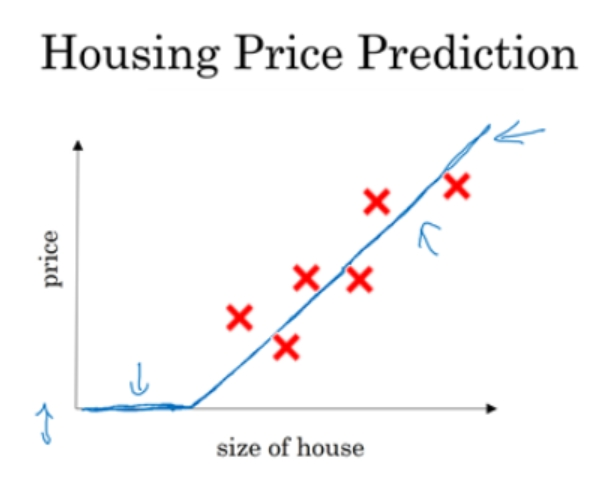

纵轴是预测值（房屋价格）。横轴是特征（房屋大小）。我们知道通过一条直线可以拟合只写样本点，并且房屋价格不会是负数，因此画出了上面这样一条直线。

然而，房屋价格并不是简单的随着价格的波动而变化。假如，人们对房子的户型有偏好，即部分小面积的房价高，部分大面积的房子价格低，如下图：

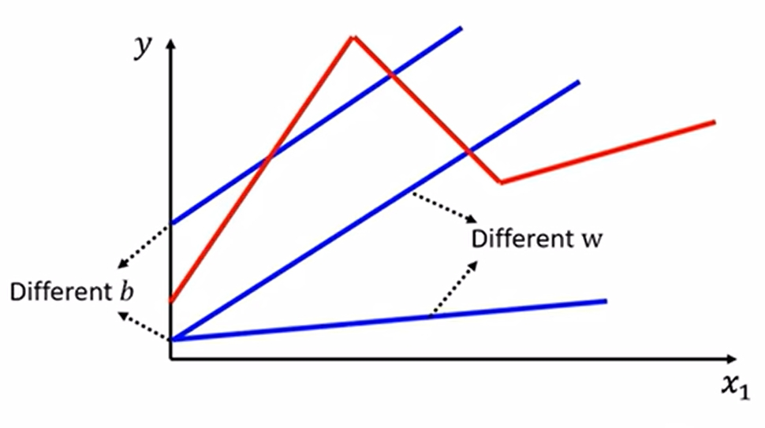

红线代表实际情况，价格随着面积的变化并不是呈严格正相关。而简单的线性模型（蓝线）并不能去拟合实际情况（b和w总有一点不回拟合红线）。所以，**线性模型太过于简单，我们需要找一个更加复杂的模型**。

## 2. 从线性模型到神经网络

### 2.1 定义模型

上文所述，我们需要一个更加复杂的模型去拟合现实情况。现在，我们基于线性模型尽量的去做复杂模型的拟合。思路是，由于红线的b和w有各种各样的变化。所以，我们将红线看作一个**常数**加上一堆**函数**的组合。即， `red curve = constant + sum of a set of function` 。过程如下图所示：

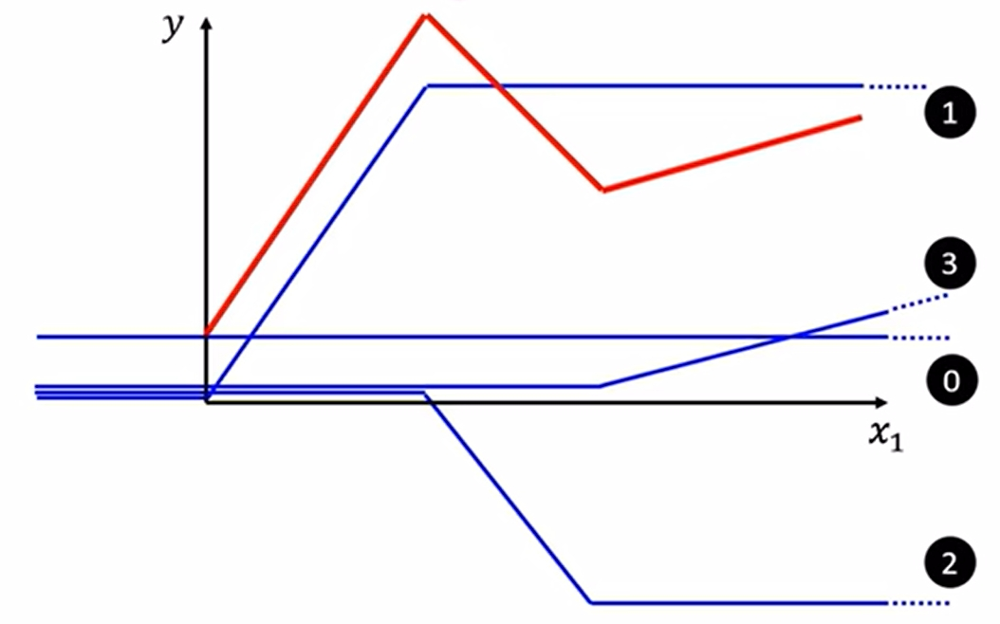

如果我们想拟合红线，则：

1. 需要常数constant(〇)做一个起始的截距；
2. 加上一个向上的线（①），拟合到第一个最大值点；
3. 加上一个向下的线（②），拟合到第一个最小值点；
4. 加上一个向上的线（③），拟合最后一段线。

这样，我们通过一个常数和一系列的函数就可以将红线拟合。

> 我们可以用常数项加一系列的函数，去拟合不同的Piecewise Linear Curve。

更进一步地，我们的需求由Piecewise Linear Curve换成了一般的曲线，如下图所示：

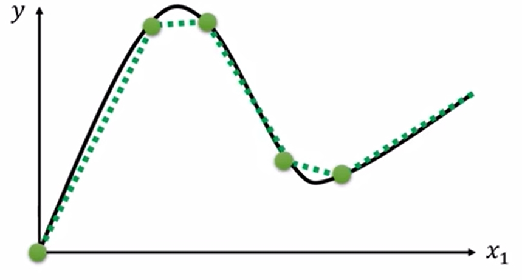

我们可以通过在曲线上估计连续值，用上面的方法去拟合这条曲线。所以，**我们只要有足够多的“线段”我们就可以拟合任意一个曲线**。

那么，现在如何去表示这个函数（function）？在这里选择使用Sigmoid函数（还有其他函数，在这里以Sigmoid函数为例）：

$$
\begin{align}
y &= c \cdot \frac{1}{1+e^{-(b + \mathbf{w} x_1)}} \\
&=c\cdot sigmoid(b + \mathbf{w} x_1)
\end{align} 
$$

函数图像如下所示：

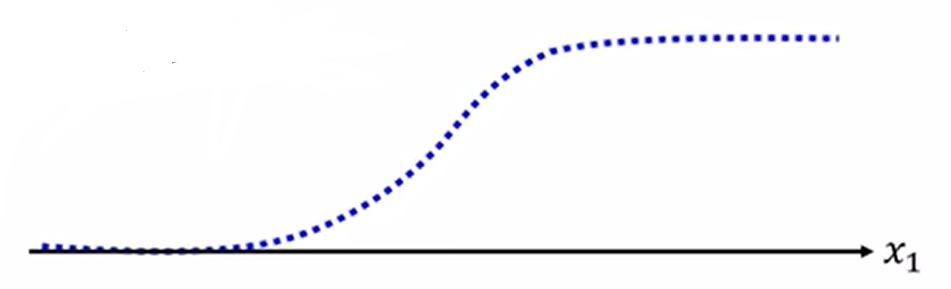

上文提到我们需要各种各样的函数才可以拟合复杂模型。所以，我们可以通过更改这个 $y$ 值，做出不同的函数。那么，我们可以得出（对应上面的零①②③步骤）可以得出：

$$
\begin{align}
y_1&=c_1 \cdot sigmoid(b_1 + \mathbf{w_1} x_1) \\
y_2&=c_2 \cdot sigmoid(b_2 + \mathbf{w_2} x_1) \\ 
y_3&=c_3 \cdot sigmoid(b_3 + \mathbf{w_3} x_1)
\end{align} 
$$

可以将上式整合得到：

$$
y=b + \sum_i c_i \cdot sigmoid(b_i+ \mathbf{w_i}x_1)
$$

至此，我们得到一个更加具有弹性的函数 $y$ 。

现实中，房价的因素不仅仅由面积决定，还有卧室的数量、邮编（代表能否步行去学校、超市，说的是交通便利性）和富裕程度等等的其他**特征**。

那么，我们的**特征**要求就变成了由原来的 $\mathbf{w} x_1$ 变成 $\sum_j \mathbf{w_j} x_j$，其中，$j$ 代表**特征数量（上文的卧室数量、邮编、富裕程度）**。所有，我们将函数 $y$ 做一次更新，得到以下函数：

$$
y=b + \sum_i \left[ c_i \cdot sigmoid \left(b_i+ \sum_j \mathbf{(w_{ij}} x_{j}) \right) \right]
$$

其中，$i:1,2,3, \dots$ 为sigmoid函数个数，$j:1,2,3, \dots$ 为特征个数。如果按照房价例子中将 $b_i+ \sum_j \mathbf{(w_{ij}} x_{j}$ 按照如下图所示展开：

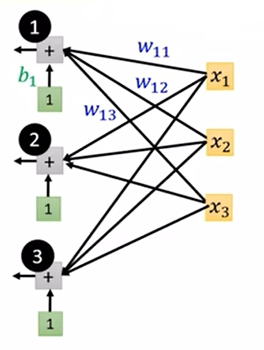

将会得到：

$$
\begin{align}
r_1&=b_1 + w_{11}x_1 + w_{12}x_2 + w_{13}x_3 \\
r_2&=b_2 + w_{21}x_1 + w_{22}x_2 + w_{23}x_3 \\ 
r_3&=b_3 + w_{31}x_1 + w_{32}x_2 + w_{33}x_3
\end{align} 
$$

可将上式简化为向量形式，即：

$$
\left[
    \begin{array}{c}
        r_1\\
        r_2\\
        r_3
    \end{array}
\right]=\left[
    \begin{array}{c}
        b_1\\
        b_2\\
        b_3
    \end{array}
\right] + \left[
    \begin{array}{c c c}
        w_{11}&w_{12}&w_{13}\\
        w_{21}&w_{22}&w_{23}\\
        w_{31}&w_{32}&w_{33}
    \end{array}
\right] \left[
    \begin{array}{c}
        x_1\\
        x_2\\
        x_3
    \end{array}
\right] 
$$

将上式带入sigmoid函数内可得：

$$
\begin{align}
a_1&=sigmoid(r_1)=\frac{1}{1+e^{-r_1}}\\
a_2&=sigmoid(r_2)=\frac{1}{1+e^{-r_2}}\\ 
a_3&=sigmoid(r_3)=\frac{1}{1+e^{-r_3}}
\end{align} 
$$

最后，将上式与 $b$ 相加，可得函数 $y。上述公式推导过程可用下图表示：

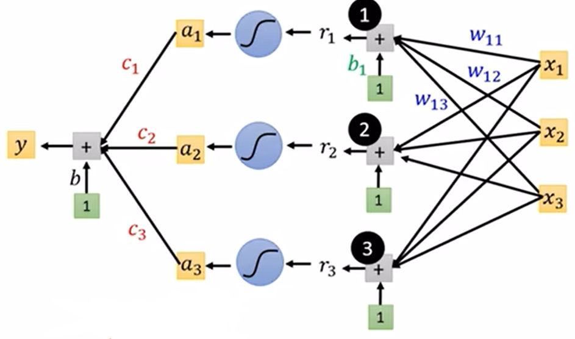

上面的是针对于房价的例子，其中有三个特征和三个sigmoid函数。如果，推广到整个实数域，我们可将sigmoid函数记为 $\sigma$，可得关于 $\mathbf{r}$ 的函数 $\mathbf{a}$，其中，$\mathbf{r}$ 将上述分式合并后的向量表示形式。可将上面的例子抽象为向量形式：

$$
\begin{align}
y &= b + \mathbf{c^T} \cdot \mathbf{a} \\
\mathbf{a} &= \sigma ({\mathbf{r}}) \\ 
\mathbf{r} &= \mathbf{b} + \mathbf{W} \cdot \mathbf{x}
\end{align}
$$

### 2.2 参数优化

参数优化过程同线性模型基本一致，根据上文中的 $(12) (13) (14)$ 式中可知，有参数 $\mathbf{W}$、$\mathbf{b}$、$\mathbf{c^T}$ 和 $b$。如果将上述参数整合为一个向量可得：

$$
\mathbf{\theta}= \left[
    \begin{array}{c}
        \theta _1\\
        \theta _2\\
        \theta _3\\
        \dots
    \end{array}
\right]
$$

其中，$\theta$ 的取值可来自于参数 $\mathbf{W}$、$\mathbf{b}$、$\mathbf{c^T}$ 和 $b$。如果初始参数的选择使用随机数 $\theta ^{[0]}$，并且对 $L(\mathbf{\theta)}$ 进行参数优化，过程如下：

1. 随机选择初始值 $\theta ^{[0]}$。
    如果初始参数的选择使用随机数 $\theta ^{[0]}$，并且对 $L(\mathbf{\theta)}$ 取最小值：
    $$
    \mathbf{\theta^*}=arg \min_\mathbf{\theta} L
    $$
2. 计算梯度 $\mathbf{g}$，可得对关于参数 $\mathbf{\theta}$ 的 $L$ 的梯度计算过程：
    $$
    \mathbf{gradient}=\nabla L(\theta ^{[0]})=\left[
        \begin{array}{c}
            \frac{\partial L}{\partial \theta _1} |_{\theta=\theta ^{[0]}}\\
            \frac{\partial L}{\partial \theta _2} |_{\theta=\theta ^{[0]}}\\
            \frac{\partial L}{\partial \theta _3} |_{\theta=\theta ^{[0]}}\\
            \dots
        \end{array}
    \right] 
    $$
3. 梯度下降，$\mathbf{\theta ^{[1]}} \leftarrow \mathbf{\theta ^{[0]}} - \alpha g$， 根据线性模型的梯度下降可得出以下过程：
    $$
    \left[
        \begin{array}{c}
            \theta _1\\
            \theta _2\\
            \theta _3\\
            \dots
        \end{array}
    \right] \leftarrow \left[
        \begin{array}{c}
            \theta ^{[0]}_1\\
            \theta ^{[0]}_2\\
            \theta ^{[0]}_3\\
            \dots
        \end{array}
    \right] - \alpha \left[
        \begin{array}{c}
            \frac{\partial L}{\partial \theta _1} |_{\theta=\theta ^{[0]}}\\
            \frac{\partial L}{\partial \theta _2} |_{\theta=\theta ^{[0]}}\\
            \frac{\partial L}{\partial \theta _3} |_{\theta=\theta ^{[0]}}\\
            \dots
        \end{array}
    \right] 
    $$

### 2.3 神经网络结构

上文中根据sigmoid函数搭建起一个**单层**结构简单的神经网络。如果将上文中的函数 $a$ 定义为激活函数。将这些激活函数的输出作为下层的输入，则得到下图结构：

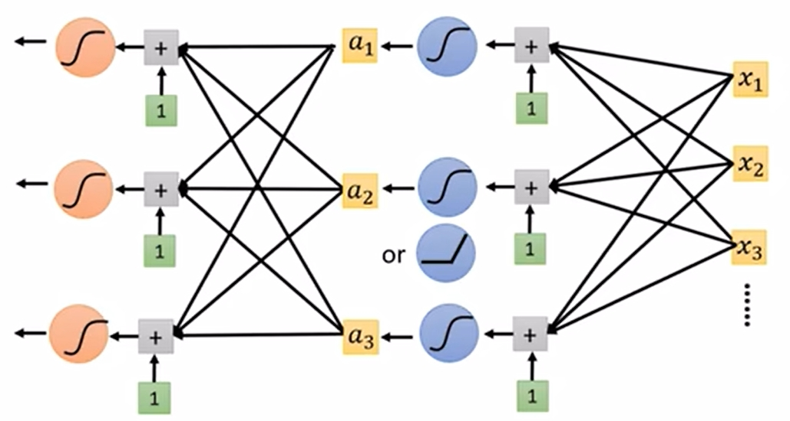

**从右到左**，分别是input layer和两个hidden layer。自此，神经网络搭建完成。其中，神经网络由不同的layer组成，每个 layer 由多个 neuron 节点组成。

### 2.4 全连接前馈神经网络 (Fully Connection Feedforward Network)

概念：前馈（feedforward）也可以称为前向，从信号流向来理解就是输入信号进入网络后，信号流动是单向的，即信号从前一层流向后一层，一直到输出层，其中任意两层之间的连接并没有反馈（feedback），亦即信号没有从后一层又返回到前一层，计算过程如下所示：

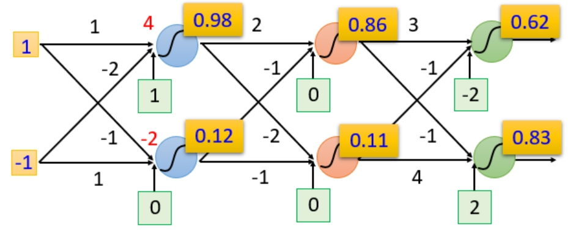

神经网络如果权重和偏差都知道的话就可以看成一个函数，他的输入是一个向量，对应的输出也是一个向量。不论是做回归模型（linear model）还是逻辑回归（logistics regression）都是定义了一个函数集（function set）。我们可以给上面的结构的参数设置为不同的数，就是不同的函数（function）。这些可能的函数（function）结合起来就是一个函数集（function set）。这个时候你的函数集（function set）是比较大的，是以前的回归模型（linear model）等没有办法包含的函数（function），所以说深度学习（Deep Learning）能表达出以前所不能表达的情况。

我们通过另一种方式显示这个函数集：

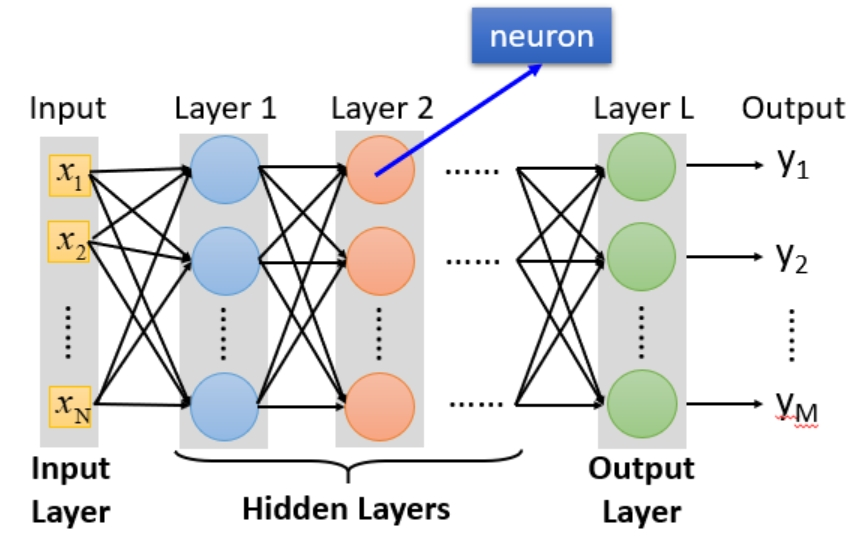

- 输入层（Input Layer）：1层
- 隐藏层（Hidden Layer）：N层
- 输出层（Output Layer）：1层

这些**函数集**的本质就是**通过隐藏层进行特征转换**。换句话说，把隐藏层通过**特征提取来替代原来的特征工程**，这样在最后一个隐藏层输出的就是一组新的特征（相当于黑箱操作）而对于输出层，其实是把前面的隐藏层的输出当做输入（经过特征提取得到的一组最好的特征）然后通过一个多分类器（可以是softmax函数）得到最后的输出y。

> 为什么叫全链接呢？
> 因为layer1与layer2之间两两都有连接，所以叫做Fully Connect；
> 
> 为什么叫前馈呢？
> 因为现在传递的方向是由后往前传，所以叫做Feedforward。

### 2.5 矩阵计算 (Matrix Operation)

随着层数变多，错误率降低，随之运算量增大，通常都是超过亿万级的计算。对于这样复杂的结构，我们一定不会一个一个的计算，对于亿万级的计算，使用loop循环效率很低。这里我们就引入矩阵计算（Matrix Operation）。由于可以使用**GPU加速**，能使得我们的运算的速度以及效率高很多。

### 2.6 选择最优模型

同基本一致，再次不做赘述。针对于不同的任务，选择的损失函数也有所不同。例如,回归任务中的[平方差](../4.1/linear_regression.md#12-损失函数-loss-function)和分类任务中的[交叉熵](../4.1/logistic_regression.md#3-损失函数-loss-function)。

## 3. 计算图 (Computational Graph)

计算图是用来描述运算的有向无环图，有两个主要元素：节点 (Node) 和边 (Edge)。节点表示数据，如向量、矩阵、张量。边表示运算，如加减乘除卷积等。以下图为例，看一下如何进行前向和反向传播：

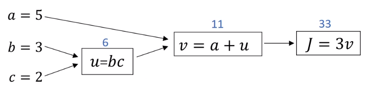

假设我们有函数 $J(a, b, c) = 3(a+bc)$，首先用计算图看一下如何进行前向传播：

1. 将 $bc$ 结果存入为 $u$；
2. 将 $a+u$ 结果存入为 $v$；
3. 最后，计算 $3v$，将结果存入 $J$。

该过程是**从左向右**的。接下来看一下计算出每个输入参数对应的偏导数的过程：

1. 该过程是**从右向左**，所以，首先要求 $J$ 对 $v$ 的导数：$\frac{dJ}{dv} = 3$；
2. 然后，再求 $J$ 对 $a$ 的偏导（根据链式法则，$a$ 和 $u$ 共同影响 $J$）：$\frac{dJ}{da} = \frac{dJ}{dv} \frac{dv}{da} = 3 \times 1 = 3$；
3. 同理，求 $J$ 对 $u$ 的偏导：$\frac{dJ}{du} = \frac{dJ}{dv} \frac{dv}{du} = 3 \times 1 = 3$
4. 同理，求$J$ 对 $b$ 的偏导：$\frac{dJ}{db} = \frac{dJ}{du} \frac{du}{db} = 3 \times c = 3 \times 2 = 6$
5. 同理，求$J$ 对 $c$ 的偏导：$\frac{dJ}{dc} = \frac{dJ}{du} \frac{du}{dc} = 3 \times b = 3 \times 3 = 9$

自此，前向传播得出模型的输出，反向传播得出模型参数的导数值；根据得出的导数值即可更新参数。

> 这里可以简单的理解为：前向传播就是根据输入得到输出的过程；而反向传播是指根据输出求得参数的梯度过程。

### 3.1 链式法则 (Chain Rule)

链式法则举例：

- case 1:
    设 $y=g(x), z=h(y)$，则 $x$ 的取值会影响 $y$，$y$ 的取值会影响 $z$：$\frac{dz}{dx}=\frac{dz}{dy} \frac{dy}{dx}$
- case 2:
    设 $x=g(s), y=h(s), z=k(x,y)$，则之间关系为：
    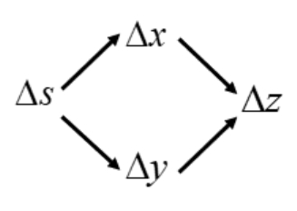
    即：$\frac{dz}{ds}=\frac{\partial z}{\partial x} \frac{dx}{ds} + \frac{\partial z}{\partial y} \frac{dy}{ds}$

### 3.2 前向传播 (Forward Propagation)

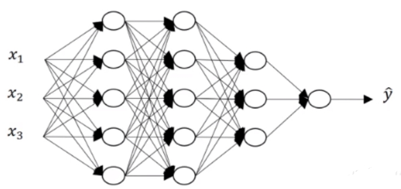

以上述图片为例，如何计算第一层激活值：

- 输入：$\mathbf{x^{[0]}}=\left[\begin{array}{c} x^{[0]}_1 \\ x^{[0]}_2 \\ x^{[0]}_3 \end{array} \right]$
- 计算参数： 
    1. $\mathbf{z^{[1]}}=\mathbf{w^{[1]}}x^{[0]}+b^{[1]}$
    2. $\mathbf{a^{[1]}}=g^{[1]}(\mathbf{z^{[1]}})$
- 输出：$\mathbf{a^{[1]}}=\left[\begin{array}{c} a^{[1]}_1 \\ a^{[1]}_2 \\ a^{[1]}_3 \\ a^{[1]}_4 \\ a^{[1]}_5 \end{array} \right]$

那么，第二层计算同上：

- 输入：$\mathbf{a^{[1]}}=\left[\begin{array}{c} a^{[1]}_1 \\ a^{[1]}_2 \\ a^{[1]}_3 \\ a^{[1]}_4 \\ a^{[1]}_5 \end{array} \right]$
- 计算参数： 
    1. $\mathbf{z^{[2]}}=\mathbf{w^{[2]}}a^{[1]}+b^{[2]}$
    2. $\mathbf{a^{[2]}}=g^{[2]}(\mathbf{z^{[2]}})$
- 输出：$\mathbf{a^{[2]}}=\left[\begin{array}{c} a^{[2]}_1 \\ a^{[2]}_2 \\ a^{[2]}_3 \\ a^{[2]}_4 \\ a^{[2]}_5 \end{array} \right]$

那么，第三层计算同上：

- 输入：$\mathbf{a^{[2]}}=\left[\begin{array}{c} a^{[2]}_1 \\ a^{[2]}_2 \\ a^{[2]}_3 \\ a^{[2]}_4 \\ a^{[2]}_5 \end{array} \right]$
- 计算参数： 
    1. $\mathbf{z^{[3]}}=\mathbf{w^{[3]}}a^{[2]}+b^{[3]}$
    2. $\mathbf{a^{[3]}}=g^{[3]}(\mathbf{z^{[3]}})$
- 输出：$\mathbf{a^{[3]}}=\left[\begin{array}{c} a^{[3]}_1 \\ a^{[3]}_2 \\ a^{[3]}_3 \end{array} \right]$

最后，输出层计算预测结果：

- 输入：$\mathbf{a^{[3]}}=\left[\begin{array}{c} a^{[3]}_1 \\ a^{[3]}_2 \\ a^{[3]}_3 \end{array} \right]$
- 计算参数： 
    1. $\mathbf{z^{[4]}}=\mathbf{w^{[4]}}a^{[3]}+b^{[4]}$
    2. $a^{[4]}=g^{[4]}(\mathbf{z^{[4]}})$
- 输出：$\hat{y}=a^{[4]}$

因此，我们可以总结规律为：

$$
\begin{align}
\mathbf{z^{[l]}}&=\mathbf{w^{[l]}}a^{[l-1]}+b^{[l]} \\
\mathbf{a^{[l]}}&=g^{[l]}(\mathbf{z^{[l]}})
\end{align}
$$

上面是针对一个样本，如果是 $n$ 个样本，向量化则为：

$$
\begin{align}
\mathbf{Z^{[l]}}&=\mathbf{W^{[l]}}A^{[l-1]}+b^{[l]} \\
\mathbf{A^{[l]}}&=g^{[l]}(\mathbf{Z^{[l]}})
\end{align}
$$

> 在代码实现中，矩阵的计算可以使用**矩阵计算（向量化）**。但是，对于每层的计算需要 `for l in range(1,L+1)` 对整个网络进行遍历操作。

### 3.3 反向传播 (Backward Propagation)

假设，我们定义一个神经网络结构 $\mathbf{x^{[0]}} \rightarrow \mathbf{l^{[1]}} \rightarrow \mathbf{y^{[2]}}$（上标代表层数，即：第一层是输入，第二层是hidden layer，第三层是输出；输入特征 $\mathbf{x}$ 通过hidden layer $\mathbf{l}$ 的计算得到输出 $\mathbf{y}$）：

$$
\left[
    \begin{array}{c}
        x _1^{[0]}\\
        x _2^{[0]}\\
        x _3^{[0]}\\
        \dots
    \end{array}
\right] \rightarrow \left[
    \begin{array}{c}
        n ^{[1]}_1\\
        n ^{[1]}_2\\
        n ^{[1]}_3\\
        \dots
    \end{array}
\right] +b \rightarrow \left[
    \begin{array}{c}
        y _1^{[3]}\\
        y _2^{[3]}\\
        y _3^{[3]}\\
        \dots
    \end{array}
\right] 
$$

在上述模型中，从输入到hidden layer有参数 $w^{([1]}, b^{([1]}$；从hidden layer到输出层有参数 $w^{([2]}, b^{([1]}$。 

假如，使用以上结构对 $m$ 个样本做分类任务，我们使用与逻辑回归相同的Cost Funtion如下所示：

$$
J(\mathbf{W^{[1]}}, b^{[1]}, \mathbf{W^{[2]}}, b^{[2]}) = \frac{1}{m} \sum ^m_{i=1}L(\hat{y}, y)
$$

使用训练神经网络时，采用梯度下降，且使用随机值将参数初始化：

$$
\begin{align*} \text{repeat}&\text{ until convergence:} \; \lbrace \newline\;
&\text{ compute prediction} (\hat{y}, i=1, \dots, m) \newline
& w_j = w_j -  \alpha \frac{\partial J(\mathbf{w},b)}{\partial w_j} \; & \text{for j = 0..n-1}\newline
&b\ \ = b -  \alpha \frac{\partial J(\mathbf{w},b)}{\partial b}  \newline \rbrace
\end{align*}
$$

## 4. 激活函数

上文涉及到的激活函数只有sigmoid，其他函数参考[模型优化](optimization.md)。

## 5. 随机初始化

关于参数初始化，参考[模型优化](optimization.md)。

## 6. 面试题