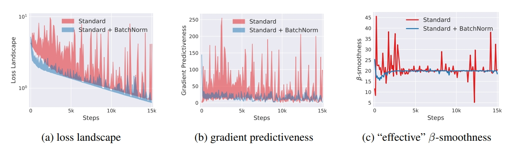
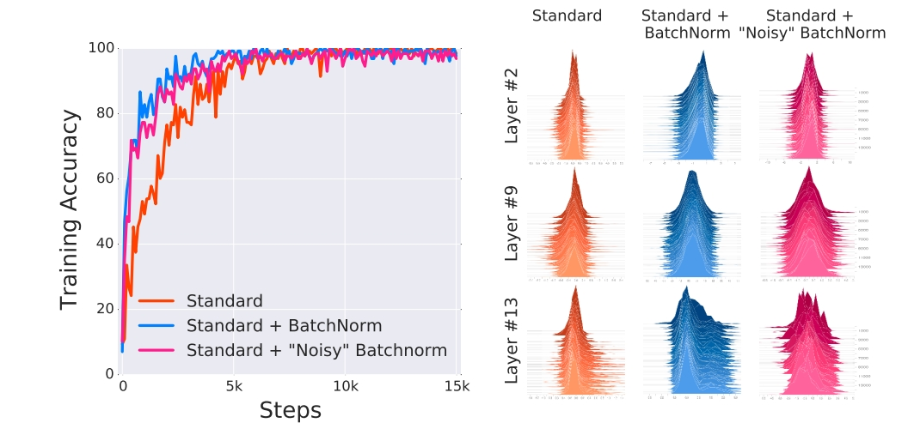

# Normalization

- 编辑：李竹楠
- 日期：2024/04/01

## 1. 概述

### 1.1 介绍

在机器学习中，一个重要的假设便是 **独立同分布 (independent and identically distributed, i.i.d.)**。独立同分布并非所有机器学习模型的必然要求（如 Naive Bayes 建立在特征彼此独立的基础上），而 LR 和 NN 则在非独立的特征数据上依然可以训练出很好的模型，但独立同分布的数据的确能够简化机器学习模型训练并提升机器学习模型的预测能力。因此，在将数据馈入机器学习模型前，白化(Whitening)作为一个重要的数据预处理步骤，旨在**去除特征之间的相关性（独立）**，并使所有特征具有**相同的均值和方差 (同分布)**，其中最典型的方法便是PCA。

对于输入数据可以用以下两种Normalization来优化输入分布以便于加速收敛：

- Min-Max Normalization: $x\prime = \frac{x-min(x)}{max(x)-min(x)}$
- Z-sore Normalization: $x\prime = \frac{x-E(x)}{D(x)}$

对于深度学习的隐含层输入的操作分为以下几类：

- 对**神经网络层输出值**Normalization，例如 Batch Norm、Layer Norm、Instance Norm、Group Norm。
- 对**神经元连接边权重**Normalization，例如 Weight Norm。

### 1.2 Internal Covariate Shift(ICS)

Internal Covariate Shift(ICS)指**神经网络在更新参数后各层输入的分布会发生变化，从而给训练带来困难的现象**。换言之，若网络在传播过程中使数据分布稍微变化，负面影响便会不断累积至深层，以至于最终产生**梯度消失**或**梯度爆炸**的问题。更直白地，尽管一开始标准化原始输入，但是再经历过一个网络层后它的分布就发生了改变，那么下一层又需要重新学习另外一种分布，这就意味着每一层其实都是在学习不同的分布。因此，这种由于网络参数发生变化而引起分布发生改变的现象称为网络的Internal Covariate Shift问题。

ICS所带来以下几个问题：

- 在训练时，每层网络输出的分布都在变化，使深层网络需不断适应浅层分布变化，从而降低了网络收敛速度。
- 在训练时，模型容易陷入激活函数的饱和区 (如 Sigmoid 和 Tanh)，使梯度变小，从而降低了参数更新速度，甚至使学习过早停止。
- 在训练时，每层更新都会影响到其它层，因此每层的参数更新策略需尽可能谨慎。

## 2. Batch Normalization(BN)

起初，大多人采用**较小的学习率**和**特定的权重初始化**来缓解和应对。然而，参数初始化的方式非常依赖于激活函数，且难以给出通用的解决方案。为此，Google在2015年在文章 *[Batch Normalization: Accelerating Deep Network Training by Reducing Internal Covariate Shift](https://static.googleusercontent.com/media/research.google.com/zh-CN//pubs/archive/43442.pdf)* 中给出了 Batch Normalization 这一解决方法。

### 2.1 原理

#### 2.1.1 BN计算过程

以视觉场景为例（如上图所示），设当前有一个batch的feature map $x \in \mathbb{R}^{N \times C \times H \times W}$，其 $batch size=N$，通道数 $channal=C$，图片尺寸为 $H,W$。

计算 BN 时，**将沿维度 $C$ 在维度 $N, H, W$ 上操作**。更具体地，先对batch中每个feature map的第1个通道求和得到 $N \times H \times W$ 个 pixel 之和，然后除以 $N \times H \times W$ 得到第 1 个通道的均值 $\mu_{c=1}(x)$。同理，可得到其他均值 $\mu_{c=i}(x), i \in 1, 2, \dots, N$，从而得到**batch内各个通道的均值向量**：$\mu_c(x)=[\mu_{c=1}(x), \mu_{c=2}(x), \dots, \mu_{c=C}(x)]^T \in \mathbb{R}^C$。类似地，可以计算出**batch内各个通道的标准差向量**：$\sigma_c(x)=[\sigma_{c=1}(x), \sigma_{c=2}(x), \dots, \sigma_{c=C}(x)]^T \in \mathbb{R}^C$。$\mu_c(x)$ 和 $\sigma_c(x)$ 的计算公式如下：

$$
\begin{align}
\mu_c(x) &= \frac{1}{NHW} \sum^N_{n=1} \sum^H_{h=1} \sum^W_{w=1} x_{nchw} \\
\sigma_c(x) &= \sqrt{\frac{1}{NHW} \sum^N_{n=1} \sum^H_{h=1} \sum^W_{w=1} (x_{nchw} - \mu_c(x))^2 + \epsilon}
\end{align}
$$

> 对上面的公式可以进行以下理解：
> 如果把 $x \in \mathbb{R}^{N \times C \times H \times W}$ 类比一摞书，这摞书一共有 $N$ 本，每本有 $C$ 页，每页有 $H$ 行，每行有 $W$ 个字符。BN求均值时，相当于把这些书的页码一一对应加起来（例如，第1本的第36页，第2本的第36页……），再除以每个页码下的字符总数：$N \times H \times W$，因此可以把BN看成求“平均书”（注意：这个平均书每页只有一个字），求标准差也是同理。

每一层经过标准化（特指BN）后的feature map满足**均值为0且方差为1的标准正态分布**：

$$
\hat{x}=\frac{x-\mu_c(x)}{\sqrt{\sigma^2_c(x)+\epsilon}}
$$

其中，$\epsilon$ 为方式除零而进入的可忽略最小值。

#### 2.1.2 BN可学习参数

BN包含另外两个可学习参数：**放缩参数(Scale Parameter) $\gamma$ 和 平移参数(Shift Parameter) $\beta$**。

经过标准化后的feature map，将会再进行缩放平移后得到新的分布：

$$
BN_{\gamma, \beta}(x)=\gamma \hat{x}+\beta
$$

这就是BN最终结果，均值为 $\beta$ 且方差为 $\gamma$。 从而，BN整体过程可表示为(dimension i 即 channel i)：

可见，输入的一个batch的feature maps x通过BN后，其均值和方差将分别变为待学习的 $\beta$ 和 $\gamma$。

**注意，在推理期间，均值和方差是固定的，即不再是可学习、会变化的参数**。

- 一方面，**BN仅适用于通道数固定的场景**，如 CNN。而对于RNN、LSTM和Transformer等序列长度不一致网络而言，BN并不适用，通常改用LN。
-  另一方面，BN在大、中batch size中具有良好的性能，并对多个视觉任务 (如，NAS) 具有良好的泛化性。然而，在ImageNet实验中，**BN在小batch size时难以通过少量样本来估计训练数据整体的均值和方差**，因而性能显著下降了10%。而以通道分组为核心思想的GN应运而生。

### 2.2 细节

#### 2.2.1 BN的作用

- 可**使用更大的学习率，使训练过程更稳定，加快模型训练的收敛速度** (因为分布被归一化了)。
- 对**权重初始化不再敏感，通常权重采样自零均值某方差的高斯分布**，以往对高斯分布的方差设置十分重要。有了BN后，对与同一个输出节点相连的权重进行放缩，其标准差 $\sigma$ 也会放缩同样倍数，最后相除抵消影响。
- 对**权重的尺度不再敏感**，理由同上，尺度统一由 $\gamma$ 控制，在训练中决定。
- 深层网络可使用Sigmoid和Tanh了，理由同上，BN使数据跳出激活函数饱和区，抑制了梯度消失和弥散问题。
- BN具有 某种正则作用，无需太依赖Dropout来缓解过拟合。

#### 2.2.2 卷积层的BN有多少参数？

一方面，1个卷积核生成1个feature map（有1对 $\gamma$ 和 $\beta$ 参数）；另一方面，同一batch中，相同通道的feature maps共享同一对 $\gamma$ 和 $\beta$ 参数。因此，**若卷积层有n个卷积核，则有n对 $\gamma$ 和 $\beta$ 参数**。

#### 2.2.3 BN可不可以没有缩放偏移(Scale & Shift)过程？

BN由两个过程构成：标准化（Standardization）和 缩放偏移（Scale & Shift）。其中，Standardization作为机器学习常用的数据预处理技术，在浅层模型中只需对数据进行Standardization即可。然而，BN可否只有Standardization过程呢？**可以，但网络的表达能力会下降**。

直觉上，在浅层模型中只需令模型适应数据分布即可，故Standardization足矣。然而，对于深度神经网络，每层的输入分布和权重需相互协调。但浅层神经元可能很努力地在学习，但不论其如何变化，其输出的结果在交给深层神经元之前，将被Standardization过程 “粗暴” 地重新调整到并非最佳选择的固定范围（把数据分布强行限制在均值为0且方差为1的标准正态分布）。所以，加入 $\gamma$ 和 $\beta$ 参数对Standardization后的数据进行缩放和偏移，使得每个神经元对应的输入分布是针对该神经元 “量身定制” 的分布（均值为 $\gamma^2$ 且方差为 $\beta$），从而**有利于分布与权重的相互协调**。缩放偏移的参数 $\gamma$ 和 $\beta$ 都是可以学习的，这就使得 BN 层可学习如何去 “尊重” 浅层神经元的学习结果。特别地，$\gamma = 1$ 且 $\beta = 0$ 时，等价于只使用Standardization；$\gamma = \sigma$ 且 $\beta = \mu$ 时，等价于没有 BN 层。**缩放偏移涵盖了上述2种特殊情况，在训练过程中将通过学习决定何种分布合适（正常情况或特殊情况），故缩放偏移过程充分利用了神经元的学习能力**。

除了充分利用浅层神经元的学习能力，**缩放偏移还可以使获得模型非线性的表达能力**。Sigmoid 等激活函数通过区分饱和区和非饱和区，使得神经网络的数据变换具有非线性表达能力。而**Standardization过程很容易将几乎所有数据分布映射到激活函数的非饱和区（线性区），仅具有线性表达能力即降低了神经网络的（非线性）表达能力**。而**缩放偏移则可将数据从线性区变换到非线性区，恢复模型的非线性表达能力**。从而，可学习参数 $\gamma$ 和 $\beta$ 保证模型的表达能力不因Standardization而下降，甚至增强了网络的表达能力。

**注意：表达能力强不一定在实践中效果更好，就像参数越多不见得性能越好一样**。

#### 2.2.4 BN放在ReLU前后？

在原论文中，BN被建议插入在ReLU激活层前面，从而构成Conv+BN+ReLU的组合即：$a^{l+1}=ReLU[BN(W^{l+1}a^{l}+b^{l+1})]$。但是在[实验](https://github.com/ducha-aiki/caffenet-benchmark/blob/master/batchnorm.md)中表明BN放在上一层ReLU之后，效果更好，即：$a^{l+1}=ReLU[W^{l+1}BN(a^{l})+b^{l+1}]$。但是由于这些都是试验证明，而非理论证明，因此无法肯定BN放在ReLU后就一定更好。在实践中可以都试试。

#### 2.2.5 BN为什么有效？

BN 层的有效性目共睹，但具体原因还需进一步研究，以下存在若干角度的解释：

- **BN层让损失函数更平滑**：在论文 *[How Does Batch Normalization Help Optimization?](https://arxiv.org/pdf/1805.11604.pdf)* 中，作者定义了一个描述损失函数平滑度的函数，观察加入BN的前后，损失函数平滑性的变化。如下图所示：

    

    在图c中，纵轴的数值越小，表明损失函数曲面越平滑；纵轴数值越大，表明损失函数曲面越颠簸。蓝色线为加入BN后的损失函数的平滑度，可以看到，加入BN后，损失函数曲面的平滑程度得到了显著改善，梯度的预测性也趋于平稳。因此得到的结论是：BN的加入使得损失函数曲面变得平滑，而平滑的损失函数进行梯度下降法变得非常容易。

    > 什么是损失函数的平滑性？
    > 
    > 
    > 
    > 上图所展示的是ResNet中引入的shortcut connection后对损失函数平滑性的影响。显然，对于左侧的损失函数，梯度下降将是异常困难；而对于右侧，即经过平滑的损失函数，将大大提升训练效率。
- **BN更有利于梯度下降**：在论文 *[An empirical analysis of the optimization of deep network loss surfaces](https://arxiv.org/pdf/1612.04010.pdf)* 中，作者说明了BN对梯度下降（Loss Surface）的影响，如下图所示：

    

    在上图中，没有BN层则存在Plateau（梯度近乎为0的平坦、难收敛、难优化区域）；有BN层则存在Valley（较大的梯度，较为陡峭的区域，该区域可以更好的进行梯度下降）。
- **BN有利于降低分布调整难度**：一个直觉上的理解是，没有 BN 层时，网络无法直接控制每层输入的分布，其分布由前面层的权重共同决定，或者说分布的均值和方差 “隐藏” 在前面层的每个权重中。因此，网络若想调整其输入的分布，需通过复杂的反向传播过程来调整前面层的权重。而BN层则相当于将分布的均值和方差从权重中剥离了出来，只需调整 $\gamma$ 和 $\beta$ 两个参数即可直接调整分布，让分布和权重的协调和配合变得更加容易。

应用了BN，观察到的右图（Standard+BatchNorm）的激活值分布变化很明显，理论上将引起明显的ICS问题。在BN层后叠加噪音（输入到后面的非线性激活，相当于BN白干了），观察到的右图（Standard+"Noisy" BatchNorm）的激活值分布变化更为突出，理论上将引起更为明显的ICS问题。然而两种情况下，左图BN的表现依然非常稳定。即BN并没有减少ICS。

#### 2.2.6 BN改善了ICS吗？

原作者认为BN是旨在解决了 ICS（Internal Covariate Shift）问题。原文是这样解释：

> We define Internal Covariate Shift as the change in the distribution of network activations due to the change in network parameters during training. To improve the training, we seek to reduce the internal covariate shift. By fixing the distribution of the layer inputs x as the training progresses, we expect to improve the training speed.

但是，在 *[How Does Batch Normalization Help Optimization?](https://arxiv.org/pdf/1805.11604.pdf)* 中对比了标准VGG以及加了BN层的VGG每层分布随训练过程的变化，发现两者并无明显差异，认为BN并没有改善 Internal Covariate Shift。

左图表明，三个网络训练曲线，最终都达成了较高的精度；右图是三个网络中抽出3个层的激活值，绘制9个HISTOGRAMS图，每层激活值的分布都在训练过程中不断变化（HISTOGRAMS图），尤其是网络中更深的层，这导致了ICS问题（根据上文的ICS定义）。

## 3. Layer Normalization(LN)

### 3.1 BN的问题

- 需要较大的batch size才能合理估计训练数据整体的均值和方差，因此对内存需求高：BN是按照样本数计算归一化统计量的，当样本数很少时，比如说只有4个。这四个样本的均值和方差便不能反映全局的统计分布息，所以基于少量样本的BN的效果会变得很差。在一些场景中，比如说硬件资源受限，在线学习等场景，BN是非常不适用的。
- 且很难应用在数据长度不同的RNN模型上：RNN可以展开成一个隐藏层共享参数的MLP，随着时间片的增多，展开后的MLP的层数也在增多，最终层数由输入数据的时间片的数量决定，所以RNN是一个动态的网络。如下图所示：

    

    在一个batch中，通常各个样本的长度都是不同的，基于这个样本的统计信息不能反映全局分布，所以这时BN的效果并不好。另外如果在测试时我们遇到了长度大于任何一个训练样本的测试样本，我们无法找到保存的归一化统计量，所以BN无法运行。

而Layer Normalization(LN)的一个优势便是无需批训练，其在单个样本内部就能归一化。

### 3.2 LN原理

以上图为例，设当前有一个batch的feature map $x \in \mathbb{R}^{N \times C \times H \times W}$，其 $batch size=N$，通道数 $channal=C$，尺寸为 $H,W$。**计算LN时，将沿维度 $N$ 在维度 $C, H, W$ 上操作**。更具体地，先对batch中第一个feature map求和得到 $C \times H \times W$ 个 pixel 之和，然后除以 $C \times H \times W$ 得到第 1 个feature map的均值 $\mu_{n=1}(x)$。同理，可得到其他均值 $\mu_{n=i}(x), i \in 1, 2, \dots, N$，从而得到**batch内各个样本的均值向量**：$\mu_n(x)=[\mu_{n=1}(x), \mu_{n=2}(x), \dots, \mu_{n=C}(x)]^T \in \mathbb{R}^C$。类似地，可以计算出**batch内各个batch的标准差向量**：$\sigma_n(x)=[\sigma_{n=1}(x), \sigma_{n=2}(x), \dots, \sigma_{n=C}(x)]^T \in \mathbb{R}^C$。$\mu_n(x)$ 和 $\sigma_n(x)$ 的计算公式如下：

$$
\begin{align}
\mu_n(x) &= \frac{1}{CHW} \sum^C_{c=1} \sum^H_{h=1} \sum^W_{w=1} x_{nchw} \\
\sigma_n(x) &= \sqrt{\frac{1}{CHW} \sum^C_{c=1} \sum^H_{h=1} \sum^W_{w=1} (x_{nchw} - \mu_n(x))^2 + \epsilon}
\end{align}
$$

> 对上面的公式可以进行以下理解：
> 如果把 $x \in \mathbb{R}^{N \times C \times H \times W}$ 类比一摞书，这摞书一共有 $N$ 本，每本有 $C$ 页，每页有 $H$ 行，每行有 $W$ 个字符。LN求均值时，相当于把每本书的所有字都加起来，再除以这本书的总字数：$C \times H \times W$，即求整本书的“平均字”，求标准差同理。

类似于 BN，LN 也包含另外两个可学习参数：放缩参数（Scale Parameter）$\gamma$ 和平移参数（Shift Parameter）$\beta$，二者在所有时间步中共享。

对于LN与BN而言，**BN取的是不同样本的同一个特征**，而**LN取的是同一个样本的不同特征**。在LN和BN都能使用的场景中，BN的效果一般优于LN，原因是**基于不同数据，由同一特征得到的归一化特征更不容易损失信息**。通常，LN适用于RNN、LSTM和Transformer等不定长序列模型（动态网络）。以RNN的角度为例，**LN的均值和方差计算仅取决于当前时间步的层输入，而不取决于当前batch的所有输入，因此可用于任意长度的序列（batch size不固定），由LN得到的模型更稳定且起到正则化的作用**。

但是当将LN添加到CNN之后，实验结果发现破坏了卷积学习到的特征，模型无法收敛，所以在CNN之后使用非LN的Normalization是一个更好的选择。然而，在论文 *[A ConvNet for the 2020s](https://arxiv.org/pdf/2201.03545.pdf)* 中提到一个问题，2020年的CNN应该是什么样子。以下是 ConvNext 对于 ConvNet的改进总结：

其中有一项就是将BN换成LN，最终Accuracy涨了0.1%。以下是原文：

> Directly substituting LN for BN in the original ResNet will result in suboptimal performance [83]. With all the modifications in network architecture and training techniques, here we revisit the impact of using LN in place of BN. We observe that our ConvNet model does not have any difficulties training with LN; in fact, the performance is slightly better, obtaining an accuracy of 81.5%.

为什么在此之前，CNN使用BN比LN更优呢？答案在文中提到改进的ConvNext模型涉及到以下方面：

- 需要更大的卷积核；
- ReLU对LN不合适；
- stage ratio问题；
- 用的不是depth separable conv等。

所以，简单来说LayerNorm在现代CNN里是适用的，甚至是更好的。

### 3.3 LN与ICS和损失平面平滑

LN能减轻ICS吗？当然可以，至少LN将每个训练样本都归一化到了相同的分布上。而在BN的文章中介绍过几乎所有的归一化方法都能起到平滑损失平面的作用。所以从原理上讲，LN能加速收敛速度的。

## 4. Instance Normalization(IN)

Instance Normalization(IN)最初用于图像风格迁移。作者发现，在生成模型中，feature maps的各channel的均值和方差会影响到最终生成图像的风格，因此可以**先把图像在channel维度归一化，然后再用目标风格图片对应channel的均值和标准差“去归一化”，以获得目标图片的风格**。IN也在单个样本内进行，不依赖batch size。

以上图为例，设当前有一个batch的feature map $x \in \mathbb{R}^{N \times C \times H \times W}$，其 $batch size=N$，通道数 $channal=C$，尺寸为 $H,W$。**计算IN时，将沿维度 $N$ 和维度 $C$ 在维度 $H, W$ 上操作**。更具体地，先对batch中第1个feature map的第1个channel求和得到 $H \times W$ 个 pixel 之和，然后除以 $H \times W$ 得到第1个feature map的第1个channel的均值 $\mu_{n=1,c=1}(x)$。同理，可得到其他均值 $\mu_{n=i,c=j}(x), i \in 1, 2, \dots, N, c \in 1, 2, \dots, C$，从而得到**batch内各个样本各个通道的均值向量**：$\mu_{nc}(x)=[\mu_{n=1,c=1}(x), \mu_{n=1,c=2}(x), \dots, \mu_{n=N,c=C}(x)]^T \in \mathbb{R}^C$。类似地，可以计算出**batch内各个batch各个通道的标准差向量**：$\sigma_{nc}(x)=[\sigma_{n=1,c=1}(x), \sigma_{n=1,c=2}(x), \dots, \sigma_{n=N,c=C}(x)]^T \in \mathbb{R}^C$。$\mu_{nc}(x)$ 和 $\sigma_{nc}(x)$ 的计算公式如下：

$$
\begin{align}
\mu_{nc}(x) &= \frac{1}{HW} \sum^H_{h=1} \sum^W_{w=1} x_{nchw} \\
\sigma_{nc}(x) &= \sqrt{\frac{1}{HW} \sum^H_{h=1} \sum^W_{w=1} (x_{nchw} - \mu_{nc}(x))^2 + \epsilon}
\end{align}
$$

> 对上面的公式可以进行以下理解：
> 如果把 $x \in \mathbb{R}^{N \times C \times H \times W}$ 类比一摞书，这摞书一共有 $N$ 本，每本有 $C$ 页，每页有 $H$ 行，每行有 $W$ 个字符。LN求均值时，相当于把一页书中所有的字都加起来，再除以该页的总字数：$H \times W$，即求该页的“平均字”，求标准差同理。

有别于BN在判别任务上的优势，IN 在GAN，Style Transfer和Domain Adaptation等生成任务上的效果优于BN。因为**BN同时对多个样本（batch内）统计均值和方差，而这多个样本的Domain很可能不同，相当于把不同Domain的数据分布进行了归一化**。而IN仅对单样本单通道内进行归一化，避免了不同Doman之间的相互影响。

## 5. Group Normalization(GN)

Group Normalization(GN)适用于**图像分割等显存占用较大**的任务。对于这类任务，batch size的大小设置很可能只能是个位数（如 1、2、4 等），再大就爆显存了。而当batchsize取小数字时，BN的表现很差，因为无法通过几个样本来近似数据集整体的均值和标准差（代表性较差）。而作为LN和IN的折中，GN也是独立于batch的。

以上图为例，设当前有一个batch的feature map $x \in \mathbb{R}^{N \times C \times H \times W}$，其 $batch size=N$，通道数 $channal=C$，尺寸为 $H,W$。**计算GN时，将沿维度 $N$ 和维度 $C$ （准确的说是通道组维度 $G$）在维度 $H, W$ 上操作**。更具体地，先对batch中第1个feature map的channel划分为 $G$ 组，则每组共有 $C/G$ 个channels。对batch中第一个feature map的第1组channels求和得到 $C/G \times H \times W$ 个 pixel 之和，然后除以 $C/G \times H \times W$ 得到第1个feature map的第1组channels的均值 $\mu_{n=1,g=1}(x)$。同理，可得到其他均值 $\mu_{n=i,g=j}(x), i \in 1, 2, \dots, N, j \in 1, 2, \dots, G$，从而得到**batch内各个样本各个组通道的均值向量**：$\mu_{ng}(x)=[\mu_{n=1,g=1}(x), \mu_{n=1,g=2}(x), \dots, \mu_{n=N,g=G}(x)]^T \in \mathbb{R}^{N \times G}$。类似地，可以计算出**batch内各个样本各个组通道的标准差向量**：$\sigma_{ng}(x)=[\sigma_{n=1,g=1}(x), \sigma_{n=1,g=2}(x), \dots, \sigma_{n=N,g=G}(x)]^T \in \mathbb{R}^{N \times G}$。$\mu_{ng}(x)$ 和 $\sigma_{ng}(x)$ 的计算公式如下：

$$
\begin{align}
\mu_{ng}(x) &= \frac{1}{(C/G)HW} \sum^{(g+1)C/G}_{c=gC/G} \sum^H_{h=1} \sum^W_{w=1} x_{nchw} \\
\sigma_{ng}(x) &= \sqrt{\frac{1}{(C/G)HW} \sum^{(g+1)C/G}_{c=gC/G} \sum^H_{h=1} \sum^W_{w=1} (x_{nchw} - \mu_{ng}(x))^2 + \epsilon}
\end{align}
$$

> 对上面的公式可以进行以下理解：
> 如果把 $x \in \mathbb{R}^{N \times C \times H \times W}$ 类比一摞书，这摞书一共有 $N$ 本，每本有 $C$ 页，每页有 $H$ 行，每行有 $W$ 个字符。GN求均值时，相当于把一本C页的书平均分为G份，每份分成有 $C/G$ 页的小册子，求小册子的“平均字”，求标准差同理。

**在batch size较大时，GN效果略低于BN，但当batch size较小时，明显优于BN**。 由于GN在channel维度上分组，因此要求channel数 $C$是组数 $G$ 的倍数。 GN常应用于目标检测，语义分割等**要求图像分辨率尽可能大的任务，由于内存限制，更大分辨率意为着只能取更小的batch size**，此时可以选择GN这种不依赖于batch size的归一化方法。

## 6. Weight Normalization(WN)

Weight Normalization(WN)出自 *[Weight Normalization: A Simple Reparameterization to Accelerate Training of Deep Neural Networks](https://arxiv.org/pdf/1602.07868.pdf)*。

在神经网络中权重向量的重参数化，**将这些权重向量的长度与其方向解耦**。通过以这种方式重新设置权重，改善了优化问题的条件，并加快了随机梯度下降的收敛速度。WN受到BN的启发，但并未在小batch中引入实例间的任何依赖关系（不依赖batch size）。这意味WN还可以成功地应用于递归模型（如 LSTM）和对噪声敏感的应用（例如深度强化学习或生成模型），而BN则不太适合此类方法。此外，WN的计算开销较低，从而允许在相同的时间内采取更多的优化步骤。**可见，诸如BN、LN、IN、GN等都对feature maps进行Normalization，而WN则对weights进行Normalization**。

## 参考文献

- [Batch Normalization: Accelerating Deep Network Training by Reducing Internal Covariate Shift](https://static.googleusercontent.com/media/research.google.com/zh-CN//pubs/archive/43442.pdf)
- [How Does Batch Normalization Help Optimization?](https://arxiv.org/pdf/1805.11604.pdf)
- [An empirical analysis of the optimization of deep network loss surfaces](https://arxiv.org/pdf/1612.04010.pdf)
- [Layer Normalization](https://arxiv.org/pdf/1607.06450.pdf)
- [A ConvNet for the 2020s](https://arxiv.org/pdf/2201.03545.pdf)
- [Weight Normalization: A Simple Reparameterization to Accelerate Training of Deep Neural Networks](https://arxiv.org/pdf/1602.07868.pdf)