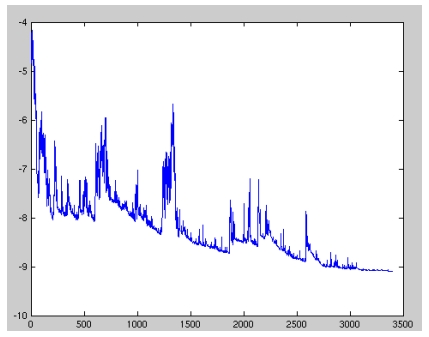
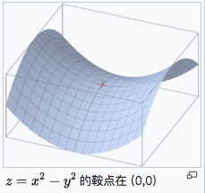
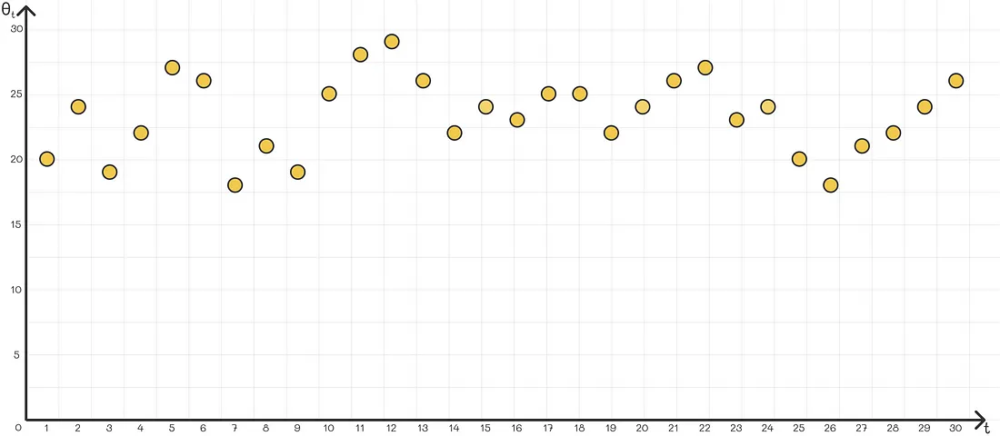
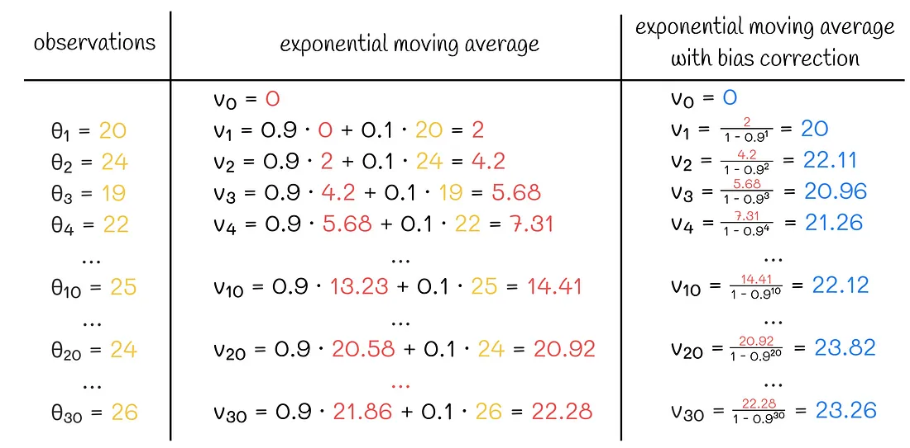
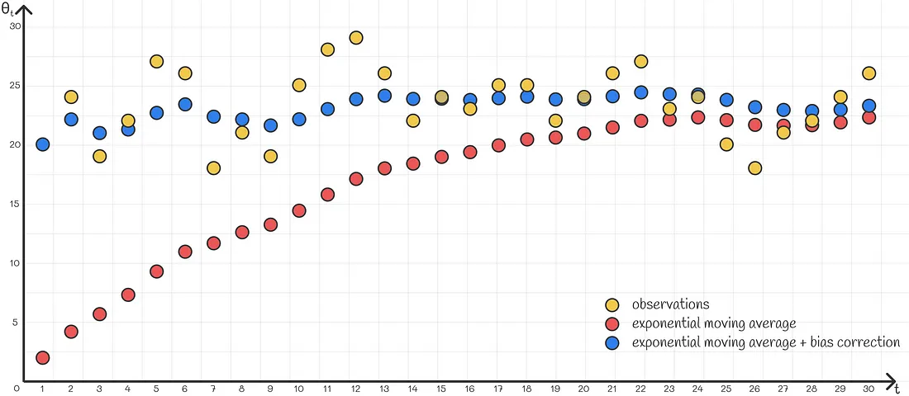

# 优化器(Optimizer)

- 编辑：李竹楠
- 日期：2024/04/04

## 1. 前言

## 2. 梯度下降种类

梯度下降法有三种变体，不同的变体用于计算目标函数梯度的数据量不同。根据数据量，我们在参数更新的准确性和执行更新所需的时间之间进行权衡。

### 2.1 梯度下降法(Gradient Descent, GD)

梯度下降法是最基本的优化算法之一。梯度下降法就是沿着梯度下降最快的方向求极小值。梯度下降法参数更新为：

$$
w_{t+1}=w_t-\alpha \cdot \nabla_{w}J(w)
$$

梯度下降算法中，沿着梯度的方向不断减小模型参数，从而最小化损失函数。基本策略可以理解为“在你目光所及的范围内，不断寻找最陡最快的路径下山”

真正在使用时，主要使用以下三个变种，区别在于每次参数更新时计算的样本数据量不同：

- 批量梯度下降法(Batch Gradient Descent, BGD)
- 随机梯度下降法(Stochastic Gradient Descent, SGD)
- 小批量梯度下降法(Mini-batch Gradient Descent, MBGD)

### 2.2 批量梯度下降法(Batch Gradient Descent, BGD)

**这里的“批量”其实指的就是整个训练集的数据，后面 MBGD 中的 mini-batch 才是真正意义上的 “一批”**。BGD相对于标准GD进行了改进，所谓“批量”，也就是不再像标准GD一样，对每个样本输入都进行参数更新，而是针对**所有的数据**输入进行参数更新。假设所有的训练样本总数为 $n$，样本为 ${(x_1,y_1), \dots, (x_n,y_n)}$，模型参数为 $w$，在对第 $i$ 个样本 $(x_i,y_i)$ 上的损失函数关于参数的梯度为 $\nabla_{w}J_i(w, x_i, y_i)$，则使用BGD更新参数的公式为：

$$
w_{t+1}=w_t-\alpha \cdot \frac{1}{n} \cdot \sum^n_{i=1} \nabla_{w}J(w, x_i, y_i)
$$

- 优点：由于**每一步迭代使用了全部样本**，每次下降的方向为总体的平均梯度，因此损失函数**收敛过程会比较稳定**。对于凸函数可以收敛到**全局最小值**，对于非凸函数可以收敛到**局部最小值**。
- 缺点：每一步更新中，都要利用全部样本计算梯度，**计算非常慢**，遇到很**大量的数据集也会非常棘手**，而且**不能投入新数据实时更新模型**。

### 2.3 随机梯度下（Stochastic Gradient Descent, SGD）

随机梯度下降法，不像BGD每一次参数更新，需要计算整个数据样本集的梯度，而是每次参数更新时，仅仅选取一个样本 $(x_i,y_i)$  计算其梯度，参数更新公式为：

$$
w_{t+1}=w_t-\alpha \cdot \nabla_{w}J(w, x_i, y_i)
$$

可以看到BGD和SGD是两个极端，SGD由于每次参数更新仅仅需要计算一个样本的梯度，训练速度很快，即使在样本量很大的情况下，可能只需要其中一部分样本就能迭代到最优解，由于每次迭代并不是都向着整体最优化方向，导致梯度下降的波动非常大（如下图），更容易从一个局部最优跳到另一个局部最优，准确度下降。

在文章[An overview of gradient descent optimization algorithms](https://arxiv.org/pdf/1609.04747.pdf)中提到，当缓慢降低学习率时，SGD会显示与BGD相同的收敛行为，几乎一定会收敛到局部（非凸优化）或全局最小值（凸优化）。

随机梯度下降是通过每个样本来迭代更新一次，如果样本量很大的情况，那么可能只用其中部分的样本，就已经将t参数迭代到最优解了，对比上面的批量梯度下降，迭代一次需要用到十几万训练样本，一次迭代不可能最优，如果迭代10次的话就需要遍历训练样本10次。**缺点是SGD的噪音较BGD要多，使得SGD并不是每次迭代都向着整体最优化方向。所以虽然训练速度快，但是准确度下降，并不是全局最优。虽然包含一定的随机性，但是从期望上来看，它是等于正确的导数的**。

总结：

- SGD因为更新比较频繁，会造成cost function有严重的震荡。
- BGD可以收敛到局部极小值，当然SGD的震荡可能会跳到更好的局部极小值处。
- 当我们稍微减小learning rate，SGD和BGD的收敛性是一样的。

### 2.4 小批量梯度下降（Mini-batch Gradient Descent, MBGD or SGD）

小批量梯度下降法就是结合BGD和SGD的折中，对于含有 $n$ 个训练样本的数据集，每次参数更新，选择一个大小为 $m(m<n)$ 的mini-batch数据样本计算其梯度，其参数更新公式如下：

$$
w_{t+1}=w_t-\alpha \cdot \sum^{i=x+m-1}_{i=x} \nabla_{w}J_i(w, x_i, y_i)
$$

小批量梯度下降法即保证了训练的速度，又能保证最后收敛的准确率，目前的SGD默认是小批量梯度下降算法。常用的小批量尺寸范围在50到256之间，但可能因不同的应用而异。

MBGD每一次利用一小批样本，即 $m$ 个样本进行计算，**这样它可以降低参数更新时的方差，收敛更稳定，另一方面可以充分地利用深度学习库中高度优化的矩阵操作来进行更有效的梯度计算**。

但是MBGD存在一下缺点：**不能保证很好的收敛性**，learning rate 如果选择的太小，收敛速度会很慢，如果太大，loss function 就会在极小值处不停地震荡甚至偏离。（有一种措施是先设定大一点的学习率，当两次迭代之间的变化低于某个阈值后，就减小 learning rate，不过这个阈值的设定需要提前写好，这样的话就不能够适应数据集的特点。）对于非凸函数，还要避免陷于局部极小值处，或者鞍点处，因为鞍点周围的误差是一样的，所有维度的梯度都接近于0，SGD 很容易被困在这里，会在鞍点或者局部最小点震荡跳动，因为在此点处，如果是训练集全集带入即BGD，则优化会停止不动，如果是mini-batch或者SGD，每次找到的梯度都是不同的，就会发生震荡，来回跳动。

> 关于鞍点：
> 
> 一个光滑函数的鞍点邻域的曲线，曲面，或超曲面，都位于这点的切线的不同边。例如下图二维图形，像个马鞍：在x轴方向往上曲，在y轴方向往下曲，鞍点就是（0，0）。
> 
> 

为了应对上面的两点挑战就有了下面这些算法。

## 3. 梯度下降优化算法

### 3.1 指数加权平均(Exponentially weighted averages)

#### 3.1.1 指数加权平均原理

在时间序列分析中，通常需要通过考虑序列之前的值来了解序列的趋势方向。序列中下一个值的近似值有几种方法，包括使用简单的基线或构建高级机器学习模型。指数加权平均也被称为指数移动平均，是这两种方法之间的稳健权衡。只要在底层使用简单的递归方法，就可以高效地实现该算法。同时，它非常灵活，可以成功地适应大多数类型的序列。下面介绍该方法背后的动机，描述了其工作流程和偏差校正（一种克服逼近偏差障碍的有效技术）。

想象一个随时间变化的给定参数的近似问题。在每次迭代中，我们都知道它之前的所有值。目标是根据前一个值预测下一个值。一种简单的策略是简单地取最后几个值的平均值。这在某些情况下可能有效，但不太适合参数更多地依赖于最近的值的情况。克服这个问题的一种可能方法是为**最近的值分配更高的权重**，并为之前的值分配更少的权重。指数平均就是遵循这一原则的策略。它基于这样的假设：**一个变量最近的值比先前的值对下一个值的形成贡献更大**。

以下是指数平均的递归方程:

$$
v_t=\beta v_{t-1}+(1-\beta) \theta
$$

- $v_t$ 是一个近似给定变量的时间序列。它的索引 $t$ 对应于时间戳。由于该公式是递归的，因此需要初始时间戳 $t = 0$ 的值 $v_0$。在实际操作中，$v_0$ 通常取 $0$。
- $\theta$ 是当前迭代的观测值。
- $\beta$ 是一个介于 $0$ 和 $1$ 之间的超参数，它定义了权重重要性应该如何在之前的平均值 $v_{t-1}$ 和当前观测值 $\theta$ 之间分布。

带有若干参数的公式如下所示：

$$
\begin{align}
v_0 &= 0 \\
v_1 &= \beta v_0 +(1-\beta) \theta _1 = (1-\beta) \theta _1 \\
v_2 &= \beta v_1 +(1-\beta) \theta _2 = (1-\beta) (\theta _2 + \beta \theta _1) \\
v_3 &= \beta v_2 +(1-\beta) \theta _3 = (1-\beta) (\theta _3 + \beta \theta _2 + \beta ^2 \theta _1) \\
\dots \\
v_t &= \beta v_{t-1} +(1-\beta) \theta _{t} = (1-\beta) (\theta _t + \beta \theta _{t-1} + \beta ^2 \theta _{t-2} + \dots + \beta ^{t-1} \theta_1) \\
\end{align}
$$

上式的最终形式如下：

$$
v_t=(1-\beta) \sum ^t_{i=0} \beta ^{t-i} \theta _i
$$

我们可以看到，最近的观测值 $θ$ 的权重为 $1$，第二个最后一个观测值为 $\beta$，第三个最后一个观测值为 $\beta ^2$，以此类推。由于 $0 < \beta < 1$，乘法项 $\beta ^k$ 随着 $k$ 的增加呈指数下降，因此观测值越往前，它们的重要性越低。最后，每个求和项都乘以 $(1-\beta)$。

> 实际情况下，$\beta$ 的取值一般为0.9。

#### 3.1.2 偏差校正(Bias correction)

使用指数加权平均的常见问题是，在大多数问题中，它不能很好地逼近第一个序列值。它是由于在第一次迭代中缺乏足够的数据而发生的。例如，假设我们有以下时间序列：

我们的目标是用指数加权平均值来近似它。然而，如果我们使用正常的公式，那么前几个值将给 $v_0$ 带来很大的权重，它是$0$，而散点图上的大多数点都在20以上。因此，第一次加权平均的序列将太低，无法精确逼近原始序列。

一个简单的解决方案是取 $v_0$ 的值，接近第一个观测值 $\theta _1$。虽然这种方法在某些情况下可以很好地工作，但它仍然不是完美的，特别是在给定序列不稳定的情况下。例如，如果 $\theta _2$ 与 $\theta _1$ 差异太大，那么在计算第二个值 $v_2$ 时，加权平均通常会比当前观测到的 $\theta _2$ 更重视以前的趋势 $v_1$。因此，近似值将非常差。

一个更灵活的解决方案是使用一种称为“偏差校正”的技术。不是简单地使用计算值 $v_k$，而是除以 $(1-\beta ^k)$。假设 $\beta$ 的取值接近于 $0.9$ 至 $1$，在第一次迭代中，且 $k$ 很小时，这个表达式趋向于 $0$。因此，$v_0=0$不是慢慢累积前几个值，而是除以一个相对较小的数字，将它们扩展为更大的值。

一般来说，这种缩放效果很好，可以精确地适应前几个项。当 $k$ 变大时，分母逐渐接近 $1$，从而逐渐忽略不再需要的缩放的影响，因为从某一次迭代开始，算法可以对其最近的值有较高的置信度，而不需要任何额外的缩放。

指数加权平均在时间序列分析中有着广泛的应用范围。此外，为了加快收敛速度，将其应用于梯度下降算法的变种中。其中最受欢迎的是深度学习中的动量优化器，它消除了优化函数不必要的振荡，使其更精确地对齐到局部最小值。

### 3.2 动量优化法(Momentum)

### 3.3 NAG(Nesterov accelerated gradient)

### 3.4 自适应学习率优化算法

## 9. 总结

## 参考文献

- [An overview of gradient descent optimization algorithms](https://arxiv.org/pdf/1609.04747.pdf)