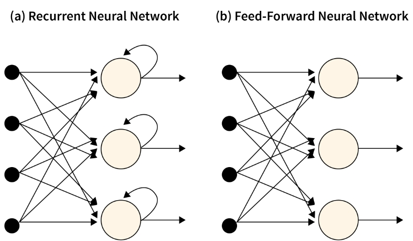
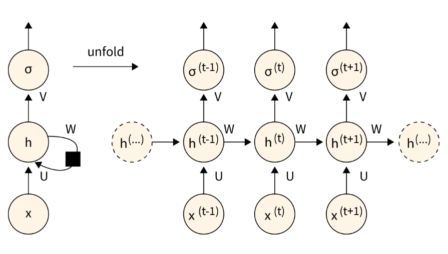
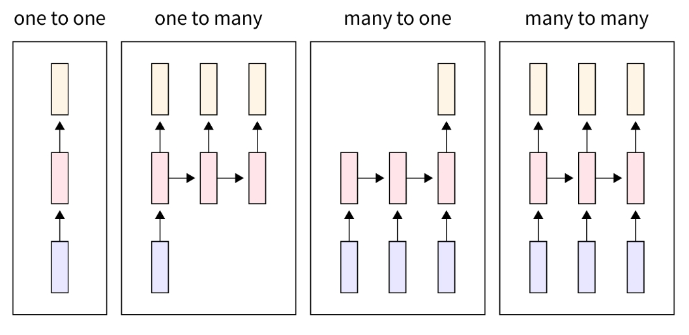

# 循环神经网络

- 编辑：李竹楠
- 日期：2024/03/08

## 1. RNN 介绍

### 1.1 什么是 RNN？

标准前馈神经网络只适用于独立数据点。为了包含这些数据点之间的**依赖关系**，我们必须改变神经网络(如果数据的组织顺序是每个数据点依赖于**之前**的数据点)。一种独特的深度学习网络称为RNN全形式循环神经网络，旨在处理时间序列数据或包含序列的数据。

RNN中的“记忆”思想使它们能够存储早期输入的状态或细节，以产生序列中的后续输出。基于输入和输出的数量，RNN有不同的类型。它们是:

- 一对一
- 一对多
- 多对一
- 多对多

### 1.2 RNN 结构

如上图所示，与在标准的神经网络不同，循环神经网络包含一个反馈循环，该反馈循环使用**之前**的隐藏状态沿着输入预测输出。因此，让我们展开RNN神经网络并详细了解它。

RNN之所以被称为循环神经网络，是因为它们始终如一地对序列中的每个元素完成相同的任务，而结果**取决于之前的计算**。

上图在左侧显示了一个RNN展开前的结构，在右侧显示了一个RNN展开后的结构。展开是指写出整个序列的网络。如右图所示，这是一个三层的网络，可以想象成这是一个句子，而每个 $h^{(t)}$ 代表一个单词。

- Input
- Weights
- Hidden Layer

### 1.3 时间反向传播(Backward Propagation Through Time, BPTT)

### 1.4 RNN 的的优势与缺点

### 1.5 不同的 RNN 架构

### 1.6 总结

## 2. Long Short-Term Memory(LSTM)

## 3. Gated Recurrent Unit(GRU)

## 4. Bidirectional RNN

## 5. Sequence to Sequence model(Seq2Seq model)

## 6. 总结

## 7. 面试题