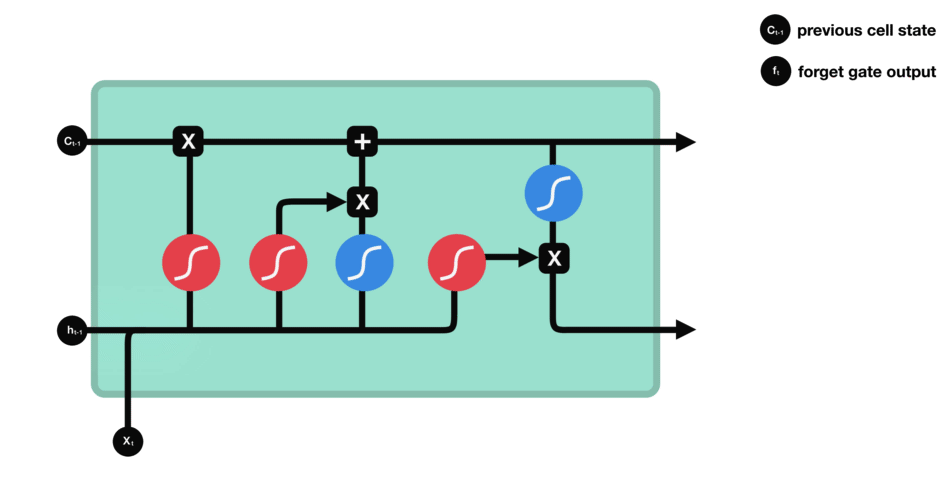
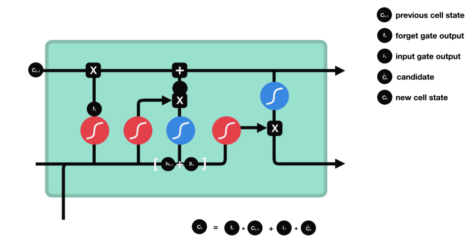
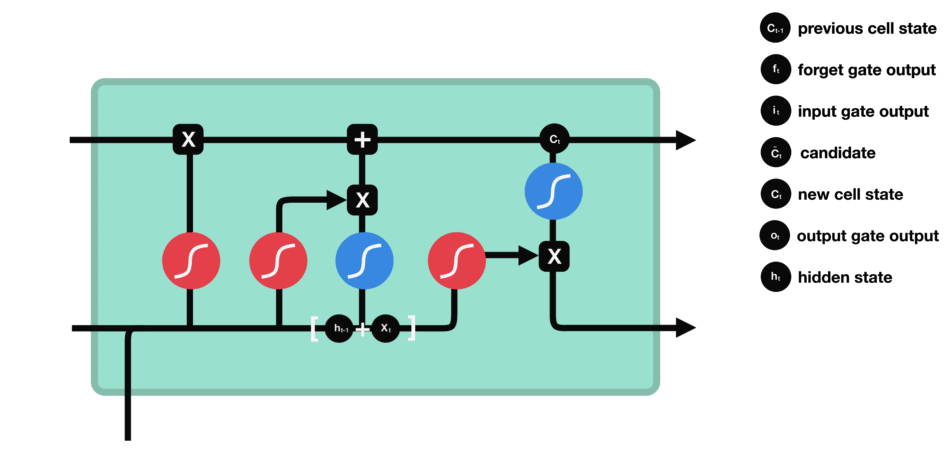
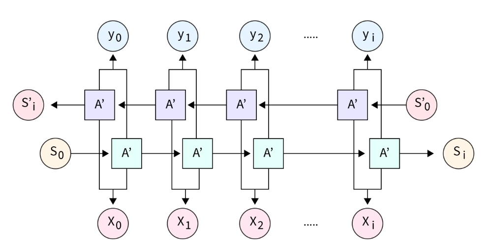

# 循环神经网络

- 编辑：李竹楠
- 日期：2024/03/08

## 1. RNN 介绍

### 1.1 什么是 RNN？

标准前馈神经网络只适用于独立数据点。为了包含这些数据点之间的**依赖关系**，我们必须改变神经网络(如果数据的组织顺序是每个数据点依赖于**之前**的数据点)。一种独特的深度学习网络称为RNN全形式循环神经网络，旨在处理时间序列数据或包含序列的数据。

RNN中的“记忆”思想使它们能够存储早期输入的状态或细节，以产生序列中的后续输出。基于输入和输出的数量，RNN有不同的类型。它们是:

- 一对一：最基本的RNN神经网络类型，只支持单个输入和输出。可以应用于图像分类。
- 一对多：多个输出对应一个输入。接受一个固定大小的输入并且产生一系列的输出。应用有图片解释和音乐生成。
- 多对一：一系列的输入对应于一个固定大小的输出。多用于情感分析。
- 多对多：当读取每个输入的时候，输出从多对多模型中产生。换句话说，多对多模型可以理解输入序列中每个标记的特征。

### 1.2 RNN 结构

如上图所示，与在标准的神经网络不同，循环神经网络包含一个反馈循环，该反馈循环使用**之前**的隐藏状态沿着输入预测输出。因此，让我们展开RNN神经网络并详细了解它。

RNN之所以被称为循环神经网络，是因为它们始终如一地对序列中的每个元素完成相同的任务，而结果**取决于之前的计算**。

上图在左侧显示了一个RNN展开前的结构，在右侧显示了一个RNN展开后的结构。展开是指写出整个序列的网络。如右图所示，这是一个三层的网络，可以想象成这是一个句子，而每个 $h^{(t)}$ 代表一个单词。

- Input：对于每一步t，$x^{(t)}$ 被用作网络的输入。例如，被独热编码后的 $x^1$ 可以代表一段话里的一个单词。
- Weights：这些权重 $(U,V,W)$ 随着时间的推移而共享：
    - 由权重矩阵 $U$ 参数化的隐藏输入连接
    - 由权重矩阵 $W$ 参数化的隐藏到隐藏循环连接
    - 由权重矩阵 $V$ 参数化的隐藏到输出连接。
- Hidden Layer：$h^{(t)}$ 作为网络的“记忆单元”表示在时间 $t$ 的隐含状态。这个隐含状态是由前一步用以下公式计算可得：$h^{(t)}=f(Ux^{(t)}+Wh^{(t-1)})$。

根据输入和输出数量的不同，可以分为以下几种结构：

根据输入输出单位相等和不相等，该模型可进一步分为两种类型:

- 相等单位大小(Equal Unit Size)
- 不相等单位大小(Unequal Unit Size)

### 1.3 时间反向传播(Backward Propagation Through Time, BPTT)

时间反向传播(BPTT)技术将反向传播训练方法应用于循环神经网络，在序列数据(如时间序列)上训练的深度学习模型中。由于RNN神经网络一次一步处理序列，因此在这个反向传播过程中，梯度在时间步骤中反向流动。

总的来说，每一个单元都有隐含层、一个输出和一个输入。通过对每个单元进行前馈操作。然后，计算每个时间步长的误差并加起来。最后，调整权重，并将网络回滚。

首先，对于每个 $t$ 时刻，使用**交叉熵损失**计算每个单元的损失：

$$
L_t=-y_t \log(\hat{y}_t)
$$

在 $T-1$ 层的总体损失可以被表示为：

$$
L=\sum^{T-1}_{j=0}L_j
$$

我们的目标是减少误差。通过确定RNN的最优权重，从而减少误差。RNN有三个权重，输入到隐含层参数 $U$，隐含层到下一个隐含层参数 $W$，隐含层到输出 $V$。因此，我们可以选择梯度下降算法来确定理想的权重，并按照权重更新规则更新权重：

$$
\begin{align}
V &= V - \alpha \frac{\partial L}{\partial V} \\
U &= U - \alpha \frac{\partial L}{\partial U} \\
W &= W - \alpha \frac{\partial L}{\partial W}
\end{align}
$$

**注意：如果输入序列包含具有数千个单元的输入序列，可能会造成梯度爆炸或消失**。

### 1.4 RNN 的的优势与缺点

- 优点：
    - 对顺序数据的处理。
    - 记住和保存主要结果的能力。
    - 在计算新的结果时，考虑最近的和以前的结果。
    - 模型大小不像输入大小那样改变。随着时间的推移，它将权重分配给其他组件。
- 缺点:
    - 消失和梯度爆炸的问题。
    - 训练RNN模型是非常具有挑战性的。
    - 使用Tanh或Relu作为激活特征可以阻止它处理长序列。

## 2. 短期记忆问题

循环神经网络存在短时记忆问题，它是指如果序列足够长，RNN将很难将较早的单元信息信息传递到较晚的单元信息。因此，如果你试图处理一段文本来进行预测，RNN可能会从一开始就遗漏重要的信息。

在反向传播过程中，递归神经网络会遇到梯度消失问题。梯度是用于更新神经网络权重的值。梯度消失问题是当梯度在时间中反向传播时收缩。如果梯度值变得非常小，它就不会对学习贡献太多。

因此，在RNN中，那些得到小梯度更新的层中，会停止学习。因此，由于这些层无法学习，RNN会忘记它在较长的序列中看到的内容，因此具有短期记忆。

LSTM 和 GRU可以被用于解决短期记忆问题。它们带有一个叫做门(gates)的内部结构，从而帮助控制信息流。

这些门可以学习序列中哪些数据是重要的，应该保留或丢弃。通过这样做，它可以将相关信息沿长序列链传递以进行预测。几乎所有基于递归神经网络的最新成果都是通过这两个网络实现的。LSTM和GRU可以用于语音识别、语音合成和文本生成中，甚至可以用它们来为视频生成字幕。

### 2.1 直觉理解

当我们在网上购物时，会参考其他顾客的评论：

当你阅读评论时，你的大脑下意识地只记住重要的关键词。你会说"Amazing" "perfectly balanced breakfast"你不太关心“this”、“gave”、“all”、“should”等词。如果一个朋友第二天问你评论说了什么，你可能一个字也记不住。你可能会记得一些要点，比如“will definitely be buying again”。其他的词就会从记忆中消失。

这就是LSTM或GRU所做的。它可以**学习只保留相关信息来进行预测，而忘记不相关的数据**。在这个例子中，只需要记住评判产品的好坏的词。

### 2.2 回顾RNN

为了理解LSTM或GRU是如何实现这一点的，让我们回顾RNN。RNN是这样工作的：第一个单词被转换为机器可读的向量；然后RNN逐个处理这些向量序列。

在处理过程中，它将之前的隐藏状态传递给序列的下一步。隐藏状态充当神经网络的记忆。它保存了网络之前看到的先前数据的信息。

对于RNN的每一个单元格是这样计算隐藏状态：

1. 首先，将输入和先前的隐藏状态组合成一个向量。该向量现在具有当前输入和以前输入的信息；
2. 向量经过tanh激活，输出是新的隐藏状态（网络的记忆）。

tanh激活函数用于帮助调节流经网络的值。tanh函数将值压缩到始终在-1到1之间。

当向量流经神经网络时，由于各种数学运算，它会经历许多变换。假设有一个值继续乘以3。你可以看到一些值如何爆炸并变成天文数字，导致其他值看起来微不足道。

tanh函数确保值保持在-1和1之间，从而调节神经网络的输出。你可以看到上面的值如何保持在tanh函数允许的边界之间。

这就是RNN。它内部的操作很少，但在适当的情况下(如短序列)工作得很好。RNN使用的计算资源比它的变种(LSTM和GRU)少得多。

### 2.3 LSTM

LSTM具有与循环神经网络类似的控制流。它在向前传播的过程中处理传递信息的数据。区别在于LSTM单元内的操作。这些操作用于允许LSTM保留或忘记信息。

#### 2.3.1 核心概念

LSTM的核心概念是单元状态(Cell State)和它们的各种门(Gate)。单元状态就像一条传输高速公路，沿着序列链一路传输相关信息。你可以把它想象成网络的“记忆”。理论上，单元状态可以在整个序列处理过程中携带相关信息。因此，即使是早期的信息也可以传到后期，从而降低短期记忆的影响。随着单元状态的发展，信息通过门被添加或删除到单元状态中。“门”是不同的神经网络，决定单元状态允许哪些信息留下。“门”可以了解哪些信息是相关的，需要在训练中保留或忘记。

#### 2.3.2 Sigmoid

Gates包含sigmoid激活函数。sigmoid激活函数类似于tanh激活函数。但是，它不是将值压缩到-1到1之间，而是将值压缩到0到1之间。这有助于更新或忘记数据，**因为任何数字乘以0都是0，导致值消失或“忘记”。任何数字乘以1都是相同的值，因此该值保持不变或被“保留”**。网络可以知道哪些数据不重要，因此可以被遗忘，或者哪些数据需要保留。

#### 2.3.3 遗忘门(Forget Gate)

首先，我们有遗忘门。这个门决定哪些信息应该被丢弃或保留。来自前一个隐藏状态的信息和来自当前输入的信息通过sigmoid函数传递。值在0和1之间。越接近0意味着忘记，越接近1意味着保留。

#### 2.3.4 输入门(Input Gate)

使用输入门更新单元状态：

1. 首先，将前一个隐藏状态和当前输入传递给一个sigmoid函数。它通过将值转换为0到1之间来决定哪些值将被更新。0表示不重要，1表示重要。
2. 并且还将隐藏状态和当前输入传递到tanh函数中，以将值压缩到-1和1之间，以帮助调节网络。
3. 然后将tanh输出与sigmoid输出相乘。sigmoid输出将决定在tanh输出中保留哪些重要信息。

#### 2.3.5 单元状态(Cell State)

现在应该有足够的信息来计算单元状态。

1. 首先，单元状态逐点乘以遗忘向量。如果它乘以接近0的值，则有可能删除单元状态中的值。
2. 然后我们从输入门获取输出并逐点相加，将单元状态更新为神经网络发现相关的新值。这样就获得了新的单元状态。

#### 2.3.6 输出门(Output Gate)

输出门决定下一个隐藏状态应该是什么。需要注意的是：**隐藏状态包含先前输入的信息，并且隐藏状态也用于预测**。首先，将前一个隐藏状态和当前输入传递给一个sigmoid函数。然后我们将新修改的单元状态传递给tanh函数。我们将tanh输出与sigmoid输出相乘，以确定隐藏状态应该携带哪些信息。输出是隐藏状态。然后将新的单元状态和新的隐藏状态转移到下一个单元。

回顾一下，遗忘门决定从之前的步骤中保留哪些相关内容。输入门决定从当前步骤添加哪些相关信息。输出门决定下一个隐藏状态应该是什么。

### 2.4 GRU

GRU是新一代的递归神经网络，与LSTM非常相似。GRU摆脱了单元状态，使用隐藏状态来传输信息。它也只有两个门，一个重置门和更新门。

- 更新门(Update Gate)：更新门的行为类似于LSTM的忘记和输入门。它决定丢弃哪些信息，添加哪些新信息。
- 重置门(Reset Gate)：重置门是另一个门，用来决定忘记多少过去的信息。

## 3. 双向循环神经网络(Bidirectional RNN, Bi-RNN)

### 3.1 什么是 Bi-RNN？

双向循环神经网络是一种循环神经网络，可以前向和后向处理输入数据。Bi-RNN的目标是通过在两个方向上处理输入数据来**捕获上下文依赖关系**，这在各种自然语言处理(NLP)任务中很有用。

在Bi-RNN中，输入数据通过两个单独的RNN：一个向前方向处理数据，而另一个向反方向处理数据。然后，这两个RNN的输出以某种方式组合以产生最终输出。

组合正向RNN和反向RNN输出的一种常见方法是将它们连接起来。不过，也可以使用其他方法，如元素加法或乘法。组合方法的选择可以取决于特定的任务和最终输出的期望属性。

### 3.2 为什么需要 Bi-RNN？

单向循环神经网络以单一方向处理输入序列，从左到右或从右到左。这意味着，当在以后的时间步进行预测时，网络只能使用来自早期时间步的信息。但是网络可能无法捕获与输出预测相关的重要上下文信息。例如，在自然语言处理任务中，如果前面的单词为当前单词提供了重要的上下文，单向RNN可能无法准确预测句子中的下一个单词。

考虑一个例子，我们可以使用循环网络来预测句子中被屏蔽的单词：

- 苹果是我最喜欢的_____。
- 苹果是我最喜欢的_____，我在那里工作。
- 苹果是我最喜欢的_____，我打算买一个。

在第一句中，答案可以是水果、公司或电话。但第二、三句话里不能是水果。只能处理从左到右输入的循环神经网络可能无法准确预测上述句子的正确答案。为了在自然语言任务上表现良好，模型必须能够在两个方向上处理序列。

### 3.3 Bi-RNN 工作过程

网络有两个独立的rnn:

- 从左到右处理输入序列的程序
- 另一个从右到左处理输入序列。

这两个RNN通常分别被称为前向RNN和后向RNN。如下图所示：

在RNN的前向传递过程中，前向RNN以正常的方式处理输入序列，即在每个时间步长获取输入，并使用它来更新隐藏状态。然后使用更新后的隐藏状态来预测输出。

在双向RNN的情况下，BPTT涉及两个单独的反向传播过程：一个用于前向RNN，一个用于后向RNN。在前向传递期间，前向RNN以正常的方式处理输入序列，并对输出序列进行预测。然后将这些预测与目标输出序列进行比较，并通过网络反向传播误差以更新前向RNN的权重。

反向RNN在反向传递期间反向处理输入序列并预测输出序列。然后将这些预测与反向的目标输出序列进行比较，并通过网络反向传播误差以更新反向RNN的权重。

一旦两次传递完成，前向和后向RNN的权重分别根据前向和后向传递期间计算的误差进行更新。这个过程重复多次迭代，直到模型收敛，双向RNN的预测准确为止。

这使得双向RNN在进行预测时可以考虑来自过去和未来时间步长的信息，这可以显著提高模型的准确性。

### 3.4 组合输出

在Bi-RNN中，两个独立的RNN以相反的方向(向前和向后)处理输入数据。然后，这两个RNN的输出被以某种方式组合或“合并”，以产生模型的最终输出。

有几种方法可以合并前向和后向RNN的输出，这取决于模型的特定需求和使用它的任务。一些常见的合并模式包括:

- Concatenation：在这种模式下，前向和后向RNN的输出连接在一起，产生一个输出张量，其长度是原始输入的两倍。
- Sum：在这种模式下，前向和后向RNN的输出按元素相加在一起，产生与原始输入形状相同的单个输出张量。
- Average：在这种模式下，前向和后向RNN的输出按元素平均，产生与原始输入具有相同形状的单个输出张量。
- Maximum:在这种模式下，在每个时间步都取正向和反向输出的最大值，从而得到与原始输入形状相同的单个输出张量。

使用哪种合并模式将取决于模型的特定需求和使用它的任务。拼接通常是一个不错的默认选择，在许多情况下效果很好，但其他合并模式可能更适合某些任务。

## 4. Sequence to Sequence model(Seq2Seq model)

## 4.1 介绍

seq2seq模型使用的是RNN的多对多架构。它能够将任意长度的输入序列转换为任意长度的输出序列，这使得它具有广泛的应用前景。seq2seq模型的概念中包括语言翻译、音乐创作、语音创作和聊天机器人。

在大多数情况下，输入和输出的长度是不同的。例如，如果我们接受一个翻译任务。假设我们需要将一个句子从英语转换为法语。把“我正在做好事”这句话映射为“Je vais bien”。可以看到，输入提要有4个单词，但在输出中，我们将只看到3个单词。因此，该算法可以用不同的输入和输出序列长度来处理这些场景。

seq2seq模型的体系结构包括两个组件:

- Encoder
- Decoder

编码器学习输入句子的嵌入(embeddings)。嵌入是包含句子含义的向量。然后解码器将嵌入向量作为输入并尝试构建目标句子。简而言之，在翻译任务中，编码器将英语句子作为输入，从中学习参数，并将嵌入提供给决策器。解码器使用嵌入生成目标法语句子。

## 4.2 编码器-解码器架构

该模型的概述如下图所示。右边是解码器，左边是编码器。将编码器和解码器的输出组合起来，在每个时间步预测下面的单词。

通过seq2seq模型将一个序列转换为另一个序列。它使用循环神经网络，或者更常见的是使用LSTM或GRU来解决梯度消失问题。首先，编码器将每个单词转换为包含单词及其上下文的相应隐含层向量。然后，将前一个输出作为输入上下文，解码器反转该过程并生成向量作为输出项。

编码器：使用深度神经网络层将输入单词转换为匹配的隐含层向量。每个向量表示当前的单词及其上下文。

解码器：为了创建后续的隐含层向量并最终预测后续的单词，它使用当前单词、其隐藏状态和编码器创建的隐含层向量作为输入。除了这两个，许多优化必须导致以下额外的序列到序列模型组件。

## 5. 面试题