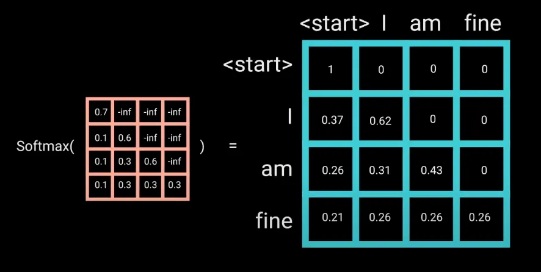
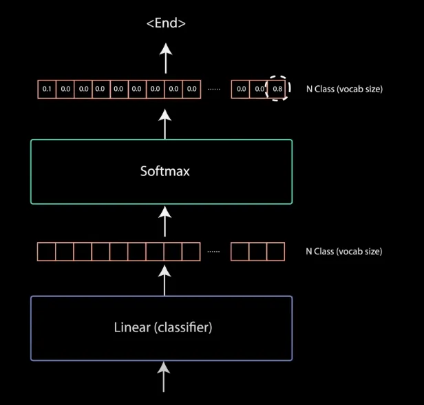

# Transformer

- 编辑：李竹楠
- 日期：2024/03/08

注意力机制的强大在论文 *[Attention Is All You Need](https://arxiv.org/abs/1706.03762)* 中得到了证明，作者介绍了一种新的名为transformer的新型神经网络，这是一种**基于注意力的编码器-解码器**类型架构。

如上图所示，编码器将输入序列映射为抽象的连续表示，其中包含该输入的所有学习到的信息。然后，解码器接收连续的表示，并逐步生成单个输出，同时也接收前一个输出。

下面将以对话机器人作为例子：

- Our input: Hi, how are you?
- Transformer output: I am fine.

## 1. 输入嵌入层(Input Embeddings)

第一步是将输入输入到单词嵌入层(word embeddings layer)。单词嵌入层可以被认为是一个查找表，用于获取每个单词的学习向量表示。神经网络通过数字学习，因此每个单词都映射到一个具有连续值的向量来表示该单词。

## 2. 位置编码(Position Encoding)

下一步是向Input Embeddings向量中注入位置信息。因为transformer编码器不像递归神经网络那样具有递归性，所以我们必须在输入嵌入中添加一些位置信息。这是使用位置编码完成的。作者利用 $\sin$ 和 $\cos$ 函数想出了一个聪明的技巧：

$$
\begin{align}
PE_{(pos, 2i)} &= \sin(pos / 10000^{2i/d_{model}}) \\
PE_{(pos, 2i+1)} &= \cos(pos / 10000^{2i/d_{model}})
\end{align}
$$

对于输入向量上的每个奇数下标，使用 $\cos$ 函数创建一个向量。对于每个偶数下标，使用 $\sin$ 函数创建一个向量。然后将这些向量与它们相应的输入嵌入相加。这成功地给出了每个向量位置的网络信息。$\sin$ 和 $\cos$ 函数之所以被串联选择，是因为它们具有线性特性，模型很容易学习处理。

## 3. 编码器层(Encoder Layer)

接下来进入编码器层。编码器层的工作是将所有输入序列映射到一个抽象的连续的“表示”中，该“表示”保存了对整个序列学习到的信息。它包含两个子模块：多头注意力和一个全连接网络。在两个子模块周围还有残差连接和层归一化。

下面对以上模块进行介绍。

### 3.1 多头注意力(Multi-Headed Attention)

编码器中采用了一种称为**自注意力**的特定注意力机制。自注意力允许模型将**输入中的每个单词与其他单词关联起来**。因此，在我们的示例中，我们的模型可能可以学习将单词“you”与“how”和“are”联系起来。每个多头注意力模块结构如下所示：

#### 3.1.1 Query, Key, and Value Vectors

为了实现自注意力，我们将输入向量输入到3个不同的全连接层，以 Q, K 和 V 向量。

query, key 和 value 的概念来自于检索系统。例如，当你输入一个query来搜索Youtube上的一些视频时，搜索引擎会将你的query映射到数据库中与候选视频相关联的一组key(视频标题、描述等)，然后向你显示最佳匹配的视频(value)。

#### 3.1.2 Dot Product of Query and Key

在将query向量、key向量和value向量输入到线性层之后，query向量和key向量进行点积矩阵乘法，生成分数矩阵(score matrix)。

分数矩阵(score matrix)决定了一个单词对其他单词的**关注程度**。因此，每个单词将有一个分数，对应于序列上的其他单词。**分数越高越专注**。这就是将查询映射到键的方式。

#### 3.1.3 Scaling Down the Attention Scores

然后，通过除以query和key的维度的平方根，分数会缩小。这是为了获得更稳定的梯度，因为相乘的值可能会产生爆炸效果。

#### 3.1.4 Softmax of the Scaled Scores

接下来，对缩放后的分数进行softmax操作以获得注意力权重，这将给出0到1之间的概率值。通过使用softmax，**得分越高关系被增强，得分越低关系被压制**。这使得模型对需要关注的单词也更有信心。

#### 3.1.5 Multiply Softmax Output with Value vector

然后将注意力权重乘以value向量以得到输出向量。较高的softmax分数将保持模型学习到的单词的value。较低的分数会淹没不相关的单词。

然后，将其输出输入到线性层进行处理。

#### 3.1.6 计算多头注意力

实现一个多头注意力计算，需要在应用self-attention之前将query、key和value分割为N个向量。然后，每个分裂后的向量单独经历self-attention过程。每个自注意力过程被称为一个头。每个头产生一个输出向量，在通过最后的线性层之前，该向量被连接成一个向量。理论上，每个头会学习不同的东西，因此**编码器模型有更强大的表示能力**（与从不同方位观察物体一样，从前面、侧面、后面看物体，肯定能获取关于这个物体更多的信息，提取更多特征，从而有更深的理解）。

总而言之，多头注意力是transformer网络中的一个模块，它计算输入的注意力权重，并产生一个输出向量，其中包含每个单词如何关注序列中所有其他单词的编码信息。

### 3.2 残差连接， 层归一化和 前馈网络(The Residual Connections, Layer Normalization, and Feed Forward Network)

在原始位置输入嵌入(original positional input embedding)中添加多头注意力输出向量。这称为残差连接(residual connection)。残差连接的输出经过一层归一化。

归一化残差输出通过逐点前馈网络进行投影，以进行进一步处理。逐点前馈网络是一对中间带有ReLU激活函数的线性层。然后将其输出再次添加到逐点前馈网络的输入中，并进一步归一化。

- 残差连接(Residual Connections)解决梯度消失和梯度爆炸问题，同时也可以帮助模型更快地收敛；
- 层归一化(Layer Normalization)用于稳定网络，从而大大减少了训练时间；
- 逐点前馈层(Feed Forward Network)，主要目的还是想提取更深层次的特征，在Multi-Head Attention中，主要是进行矩阵乘法，即都是线性变换，而线性变换的学习能力不如非线性变换的学习能力强，我们希望通过引入ReLu激活函数，使模型增加非线性成分，强化学习能力。。

## 4. Decoder Layer

解码器的工作是生成文本序列。解码器与编码器具有相似的子层。它有两个多头注意力层，一个逐点前馈层，残差连接，以及每个子层后的层归一化。这些子层的行为类似于编码器中的层，但每个多头注意力层有不同的工作，并且由一个作为分类器的线性层和一个用于获取单词概率的softmax组成。

解码器是自回归的：

1. 以一个起始标记(\<start>)开始；
2. 输入：上文中给定的outputs和注意力信息的编码器输出；
3. 解码器在生成token(\<end>)作为输出时停止解码。

### 4.1 编码器的嵌入层和位置编码(Decoder Input Embeddings & Positional Encoding)

解码器的开头和编码器的开头几乎一样。输入经过嵌入层和位置编码层以获得位置嵌入。位置嵌入被输入到第一个多头注意力层，该层计算解码器输入的注意力分数。

### 4.2 第一层多头注意力

这个多头注意力层的运作略有不同。由于解码器是自回归的，并逐字生成序列，因此需要防止它对未来的token进行调节。例如，在计算单词“am”的注意力得分时，你不应该访问单词“fine”，因为该单词是在其后生成的未来单词。单词“am”只能访问它自身和它前面的单词。对于其他单词来说也是如此，它们只能关注前面的单词。

我们需要一种方法来避免计算未来单词的注意力分数。这种方法称为掩码(masking)。为了防止解码器查看未来的token，可以使用look-ahead mask（向前看掩码）。掩码在计算softmax之前和缩放分数之后添加。让我们来看看它是如何工作的：

掩码是一个与注意力分数相同大小的矩阵，由0和负无穷大的值填充。当你将掩码添加到缩放后的注意力分数时，你会得到一个分数矩阵，其中右上角的三角形充满了负无穷大。

掩码的原因是，一旦对掩码分数进行softmax，负无穷大将被归零，为未来的token留下零注意力分数。正如下图所示，“am”的注意力分数本身和之前的所有单词都有值，但单词“fine”的注意力分数为零。**这本质上告诉模型不要关注这些单词**。

**这种掩码操作是与编码器中的多头注意力层中进行计算注意力分数的唯一区别**。在被进一步处理之前（拼接和线性处理）该层被掩码修饰过的注意力层仍然有多个头部。第一个多头注意力的输出是一个掩码输出向量，其中包含模型应该如何关注解码器输入的信息。

如上图所示，在缩放和softmax之间，加入了mask optional。并且按照规则输出矩阵（这与编码器的曹祖一致，再次不做赘述）。

### 4.3 第二层多头注意力

在第二个多头注意力层中，query和key来自于编码器；value来自于解码器的第一个多头注意力。这个过程将编码器的输入与解码器的输入进行匹配，让解码器决定关注哪个编码器的输入。然后，第二个多头注意力的输出通过逐点前馈层进行进一步处理。

### 4.4 Classifier 

最终，前馈层的输出经过最终的线性层，该线性层充当分类器。分类器的大小与类别数相同。例如，如果你有10000个单词对应10000个类，那么分类器的输出大小将为10000。然后将分类器的输出输入到softmax层，该层将产生0到1之间的概率分数。我们取概率分数最高的索引，它等于我们预测的单词。然后，解码器获取输出，将其添加到解码器输入列表中，并继续解码，直到预测到最后一个token(\<end>)。

解码器也可以堆叠N层，每一层从编码器及其之前的层接收输入。通过堆叠层，模型可以学习从其注意力头中提取和关注不同的注意力组合，可能会提高其预测能力。

## 5. 基于transformer的架构

## 6. 计算机视觉中的transformer

## 7. 面试题

## 参考

- [Attention Is All You Need](https://proceedings.neurips.cc/paper_files/paper/2017/file/3f5ee243547dee91fbd053c1c4a845aa-Paper.pdf)