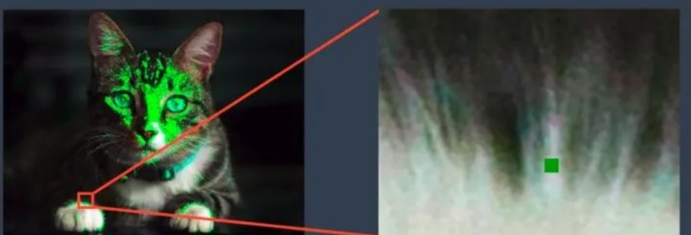

# 图像特征提取与匹配

## 1. 拟合

在[数据预处理](preprocessing_td.md)中知道如何检测边缘，现在我们如何检测特定物体的边界？例如，桌子上的硬币，当我们检测完边界后，会有噪声、桌子上其他纹理的边界和硬币的边界。现在我们需要找到一个数学模型，去获得物体的边界、圆心等，并且将物体画出来，将物体的轮廓勾勒出来，而不是简单的一条一条的边。

### 1.1 问题难点和解决

> 

如上图所示，当我们处理完图像并获取到边缘后，可能会遇到以下几个问题：
- 噪声：是指由于数据预处理造成的不在边缘上的点。
- 外点：假如我们需要勾勒出车顶部分的直线，结果也勾勒出车底的直线，那么车底的直线就是外点。
- 缺失值：被遮挡并断掉的边缘。

对于以上问题我们有以下解决方案：

- 如果已知每个点属于特定的边缘，我们如何匹配“最优”的边缘？使用**最小二乘法**
- 如果有很多的点不属于特定的边缘（有很多噪声点）。如果噪声点比较少，使用**Robust fitting**；如果噪声点比较多，使用**RANSAC**。
- 如果有多个边缘。使用**RANSAC**或者**霍夫变换**。
- 如果是复杂边缘甚至是不知道是否为完整边缘，则使用一些特殊的方法。比如：**Snake**。

### 1.2 最小二乘法

### 1.3 Robust Fitting

### 1.4 RANSAC

### 1.5 霍夫变换

### 1.5 Snake

## 1. 背景知识与重要概念

特征是什么？
> 特征是与解决某个应用程序相关的计算任务有关的一条信息。特征可能是图像中的特定结构，例如点，边缘或对象。特征也可能是应用于图像的一般邻域操作或特征检测的结果。这些功能可以分为两大类：
> - 图片中特定位置的特征，如山峰、建筑角落、门口或有趣形状的雪块。这种局部化的特征通常被称为关键点特征(或者甚至是角点) ，它们通常以点位置周围出现的像素块来描述，这个像素块往往被称作图像补丁(Image patch)。
> - 可以根据其方向和局部外观（边缘轮廓）进行匹配的特征称为边缘，它们也可以很好地指示图像序列中的对象边界和遮挡事件。

特征点是什么？
> 

什么是角点？
> 角点是图像中具有突出的、明显变化的位置，通常是图像边缘或纹理的交汇点。角点通常表现为图像中局部区域的亮度或颜色变化相对于周围区域更为显著。

特征提取和匹配的主要组成部分：

1. 检测(detection)：识别感兴趣点
2. 描述(description): 描述每个特征点周围的局部外观，这种描述在光照、平移、尺度和平面内旋转的变化下是(理想的)不变的。我们通常会为每个特征点提供一个描述符向量。
3. 匹配(mataching): 通过比较图像中的描述符来识别相似的特征。对于两幅图像，我们可以得到一组对(Xi，Yi)->(Xi’ ，Yi’) ，其中(Xi，Yi)是一幅图像的特征，(Xi’ ，Yi’)是另一幅图像的特征.

## 2. 特征提取

## 3. 特征描述

## 4. 特征匹配

## 2. OpenCV实战案例

### 2.1 人脸挂件

### 2.2 人脸识别

### 2.3 全景拼接

### 2.4 图像修复

### 2.5 车辆计数

### 2.6 车道线检测

### 2.7 运动检测器

### 2.8 人脸替换

### 2.9 语义分割

### 2.10 目标识别

### 2.11 行为检测

### 2.12 目标追踪