# OpenCV

- 作者：李竹楠
- 日期：2024/01/01

介绍OpenCV之前，作为先导的理论知识，应该先介绍数字图像处理内容。数字图像处理这门课很多大学开过，类似课程名包括但不限于图像处理、数字图像等等。这个课程主要是讲图像在计算机中是如何存储和处理的，通过一些处理手段，可以帮助我们实现既定功能。

OpenCV是一个工具库，如果单独去学习会无的放矢并且会非常的空（学了就忘了）。所以，在数字图像处理的基础概念中，会引入OpenCV的相关用法，并且在后续会有大量的使用OpenCV的实际案例去做说明。在最后，会有一些面试题。

## 1. 数字图像处理

理论阶段不是非常复杂，可以说是泛泛而谈，更加详细而又复杂的内容将会在实战案例和面试题中体现。在这里，理论只是起到一个大纲或者索引的作用，在后续的章节中遇到概念和数学模型会有一个大概的印象。

### 1.1 基本概念

#### 1.1.1 图像采样与量化

图像分为两大类：

- 模拟图像（连续的）
    - 通过某种连续的**物理量**（光或电的强弱**变化**），记录图像的亮度信息
- 数字图像（离散的）
    - 采用**数字**表示方式，记录图像**亮度**信息，使用计算机存储与处理

通过采样或量化可以得到数字图像。这里先引入一维模拟信号的采样和量化：

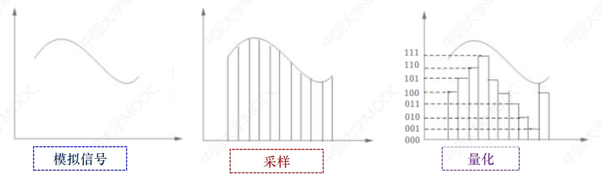

$$f(t)\rightarrow 000...111$$

在时间轴上对模拟信号进行等建模的采样，同时，对幅值做一个量化。这样就可以讲一个连续量离散化（数字化）。如果推广到二维的数字图像：

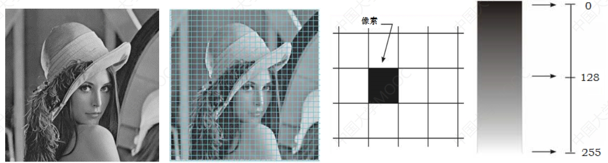

$$f(x,y)$$

在水平和垂直方向都进行等建模采样，其中(x,y)表示像素位置，函数f表示像素灰度值。以上是对图像进行了采样，如果继续对图像进行量化，首先要明确**精度**，精度分为**空间分辨率精度**和**亮度分辨率精度**。首先来看空间分辨率精度：衡量将模拟图像转化为数字图像的**空间精度**。

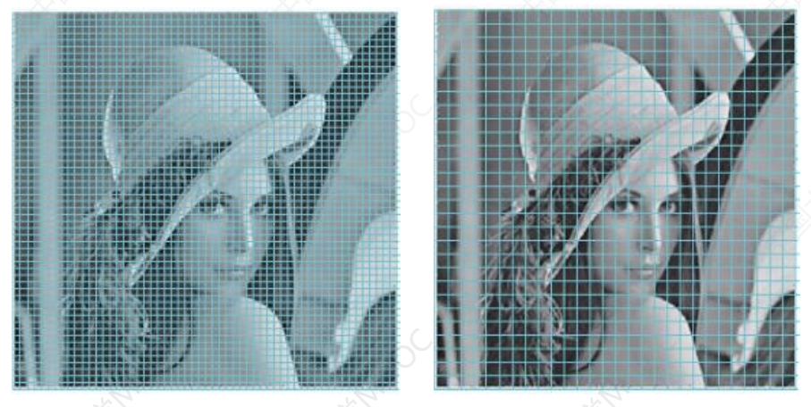

从上图可以看出，左图的栅格比起右图的更为细密，则代表精度越高。反映到具体图像则是：采样间隔越小，则更接近于原图画质。

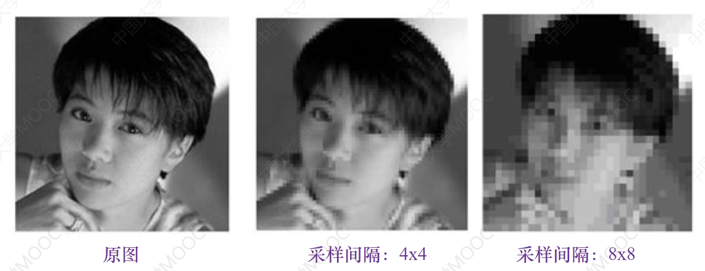

对于亮度分辨率：衡量图像亮度的**量化精度**。反映到具体图像则是：数量级越低，精度越低。最极端的情况是两个灰度级，这就是黑白图像。

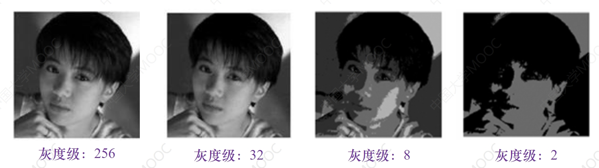

#### 1.1.2 图像的存储与格式

以上是采样和量化。下面介绍存储与格式。如果存储一个图像需要多少比特呢？答案是：

$$b=M*N*k$$

这里假设图像的宽为$M$，高为$N$，灰度级（量化级别）为$L=2^k$，举个例子：图像大小为$384*384$的图像，灰度级是256，那么$b=384*384*8$。

图像存储格式：BMP(无损、与设备无关、下到上左到右扫描)、JPEG(有损压缩)、PNG(网络图像格式、压缩比高、存储量相对小)。

### 1.2 分布直方图

在介绍分布直方图之前观察三个图片。

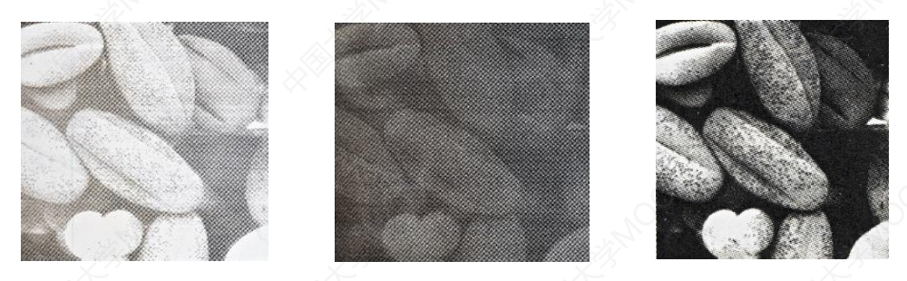

通过观察，最左边的图像偏亮，中间的偏暗，左边的亮暗分明。什么原因造成这样的情况？原因是不同**灰度级**的分布构成导致了这个原因。直观点说，就是大部分像素灰度级偏大，造成了左边的图像，如果大部分像素的灰度级偏小则造成中间这幅图。

所以，我们可以说分布直方图是描述不同灰度级数量的图。如果我们用数学模型表示：

$$h(r_k)=n_k$$

$r_k$为灰度级，$n_k$为该灰度级的像素个数（其实就是一个统计图，例如灰度级为1的有10个像素，灰度级为2的有11个像素之类的）。如果更加直观的描述：

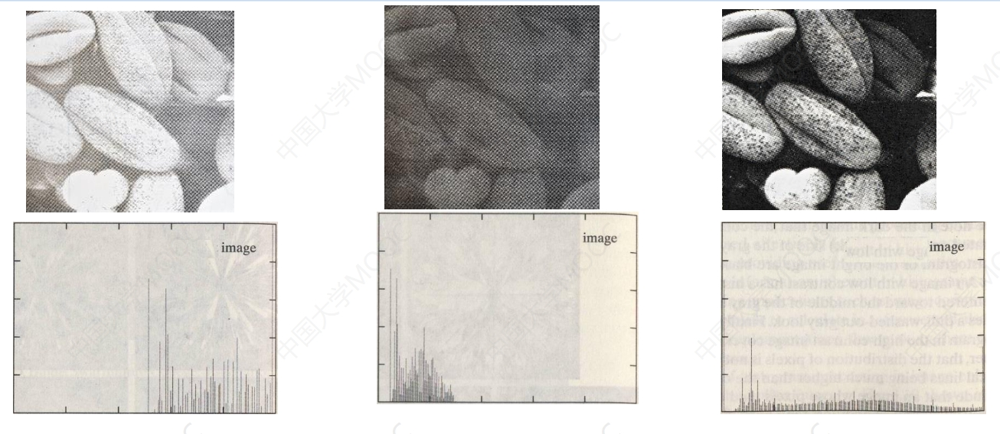

可以看到，如果灰度级趋向于均衡，则图象是亮暗分明的。

在具体应用上有：图像增强（直方图均衡）、图像分割（根据直方图获取分割阈值）、图像识别和分类（直方图对比）

### 1.3 图像增强

为什么要进行图像增强？先引入几个图片：

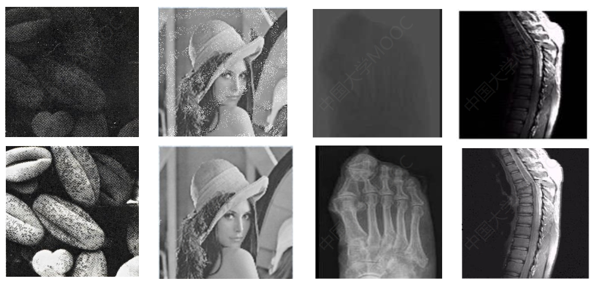

从图中可以看到，相比较于下面的四幅图，上面的图片视觉效果不佳（灰度级分布不均、噪点和难以分析）。经过图像增强后的效果使得图像适合于分析。所以说，图像增强是根据需要，**突出**和**去除**图像中的某些信息。但是需要注意图像增强：

- 没有**增加**图像中的信息量，还可能会损失
- 没有统一的客观标准，特定用途特定方法

图像增强的方法：

- 灰度变换
- 滤波器（空间域和频域）
- 代数运算

#### 1.3.1 空间域

直接对图像中的灰度级进行操作。假设输入图像$x(i,j)$，输出图像$y(i,j)$，则

$$y(i,j)=T[x(i,j)]$$

其中$T$是指对输入图像灰度级的变换。**只改变了像素的灰度级，并没有改变像素位置**。

##### 1.3.1.1 灰度变换

由于不对像素位置进行改变，则将上述公式简化为：

$$s=T[r]$$

其中，$T$为灰度变换**函数**。根据函数性质，可分为**线性**和**非线性**。

首先，来看线性变换的例子(反转)：$s=255-r$

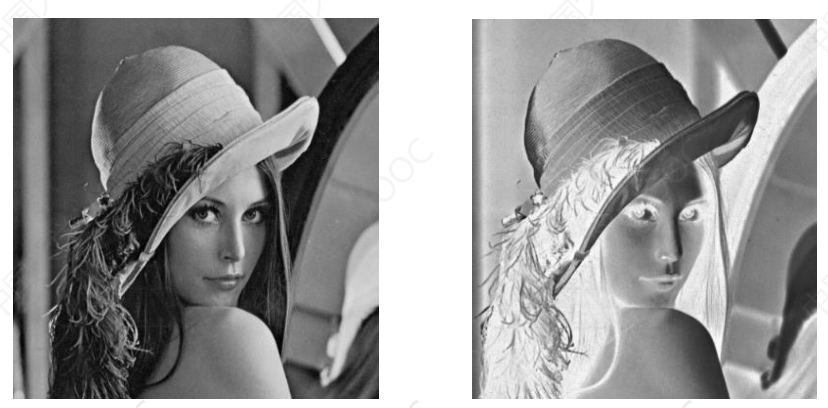

再比如下图（左）图像偏暗，如果对灰度级进行拉伸会有右图的效果：$s=Ar$

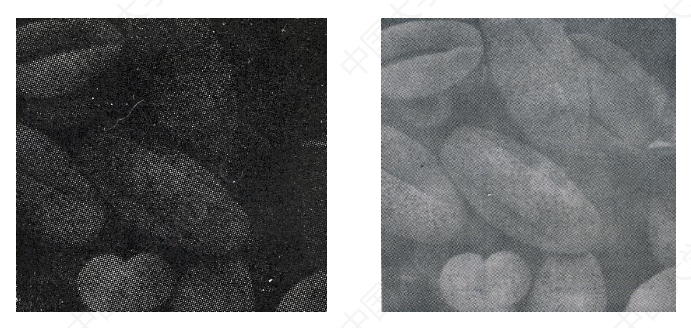

但是，实际上图像处理是非常复杂的，所以单纯一个函数是无法对图像进行合适的处理。那么就需要进行更为复杂的函数：分段线性变换。

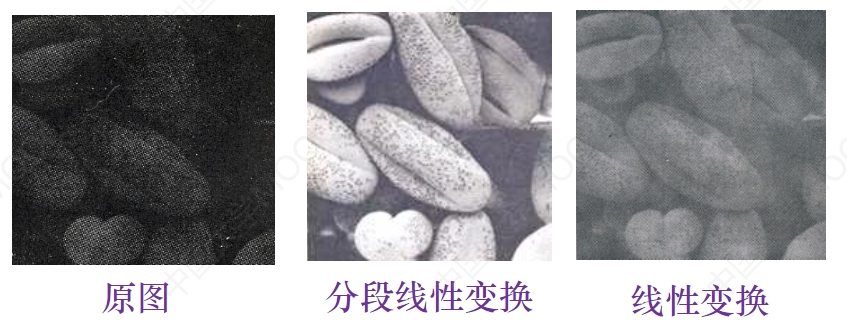

这样可以突出感兴趣区间，相对抑制不感兴趣的灰度区域。

然后，再看非线性变换，其中有对数变换、幂次变换。

**注意：这部分需要结合函数图像进行分析。要分析灰度级需要拉伸还是压缩。通过实验可以更加直观的观察。**

**这些操作都是为了灰度直方图均匀，那么如何做到呢？可以看下面的推论，如果不看数学部分也没关系。**

上述的操作对灰度级进行了运算，现在要看一下变换前后的灰度直方图分布的变化。我们可以假设灰度变换函数：

$$D_B=f(D_A)$$

并且设$H_A(D)$是变换之前的分布直方图；设$H_B(D)$是变换之后的分布直方图。这样问题转换为$H_A(D)$和$H_B(D)$存在什么样的关系。

先说结论：灰度变换后灰度分布直方图是变换前灰度分布直方图与**变换函数导数**之比：

$$H_B(D_B)=\frac{H_A(D_A)}{f\prime(D_A)}$$

推导过程：
> 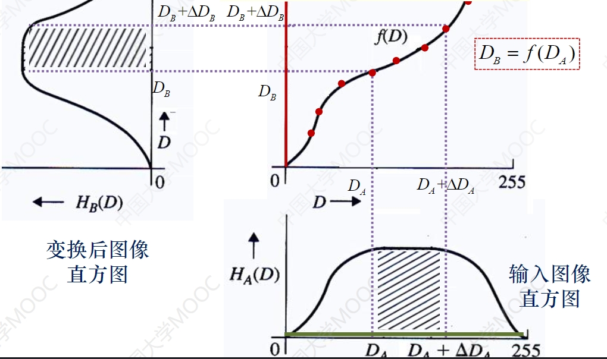
> 上图中，是$H_A(D)$经过函数变换后转换为$H_B(D)$的函数图像。其中，每个像素点经过函数变换都会对应相对变换后的值。那么，利用积分原理，我们可以得到两块阴影部分面积是相同的。
> 两块阴影面积相同：是因为$H_A(D)$的x轴是拟变换像素的总个数，对应变换后的像素个数是不变的。换句话说，更改的像素个数是一定的（分布直方图就是不同灰度级的像素个数分布），所以变换前后像素是不变的。
> 基于以上的理论我们可以推出公式：
> $$\int_{D_B}^{D_B+\Delta D_B}H_B(D_B)\,dD=\int_{D_A}^{D_A+\Delta D_A}H_A(D_A)\,dD$$
> 如果$\Delta D_B$和$\Delta D_A$都趋于极小值，则可以简化为：
> $$H_B(D)\Delta D_B=H_A(D)\Delta D_A$$
> 则$H_B(D_B)=\frac{H_A(D_A)}{\Delta D_B/\Delta D_A}$
> 如果$\Delta D_B$和$\Delta D_A$都趋于0
> 可以得到$\Delta D_B$和$\Delta D_A$之比是函数在$D_A$的导数
> 则推出分布直方图转换前后公式

如何做到分布直方图均匀？我们需要每个灰度级拥有相同（理想）的像素个数。为了达到这个要求，反映在上述公式上是：$H_B(D_B)=\frac{A_0}{D_m}$，这里的$\frac{A_0}{D_m}$是一个常数（不难理解，我们需要将灰度级都均衡成一个常数）。$D_m$代表灰度级，$A_0$代表像素总数。

那么我们可以得到公式

$$f\prime(D_A)=H_B(D_B)=\frac{A_0}{D_m}H_A(D_A)$$

对两边同时积分，可得到（注意函数是离散的，所以用的是求和而不是积分）：

$$D_B=f(D_A)=\frac{D_m}{A_0}\sum_0^{D_A}H_A(D_A)$$

举一个例子：

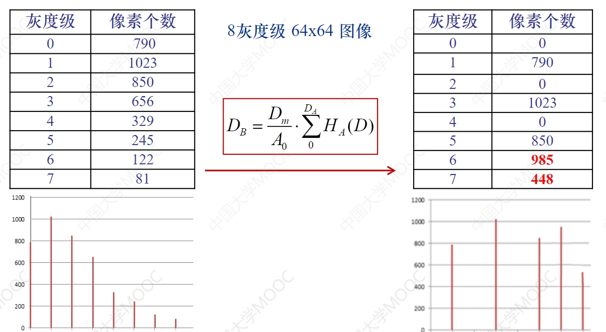

这样图像就均衡很多了。

关于直方图的应用，最直观的就是人脸识别。因为，获取人脸照片时光照都是不一样的，所以，为了一个高性能的识别率，我们都是需要对图片做直方图均衡的，经过这样的操作后，灰度的分布都差不多。这样我们再去识别，精度会提升很多。

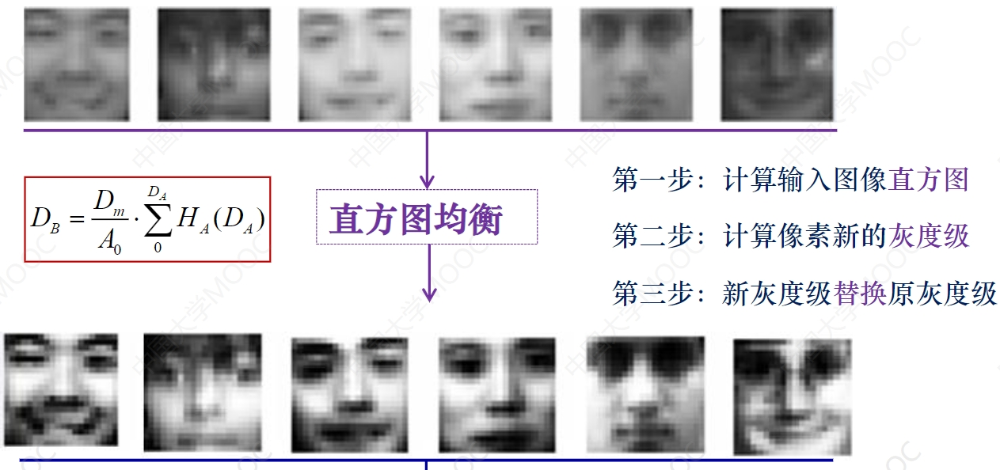

这个图是人脸识别中的流程图。可以看到采集到的图像有的偏亮有的偏暗，所以我们第一步是计算新的图像的直方图然后去替换原灰度级。得到直方图均衡的图片后再送去做识别。

##### 1.3.1.2 代数运算

代数运算中包含加、减和乘运算。

加法运算是指两幅或多幅图片相加，用于**去除叠加噪声**。公式如下：

$$C(x,y)=A(x,y)+B(x,y)$$

举一个例子，如果图像$f(x,y)$在传输或获取的过程中被噪音$n_i(x,y)$所污染，得到被污染的图像$g_i(x,y)$，则

$$g_i(x,y)=f(x,y)+n_i(x,y),i=1,\dots N$$

如何恢复原始图像：
> 假设噪声均值为0且互不相关，可以用N幅图像的均值：
> $$\frac{\sum_{i=1}^Ng_i(x,y)}{N}=\frac{Nf(x,y)}{N}+\frac{\sum_{i=1}^Nn_i(x,y)}{N}=f(x,y)$$
> 求多个图片的均值可以去除叠加性噪声，在视频图像中使用特别多，比如如果对一帧有噪声的图像进行识别，可以叠加前后几帧图像。

减法运算是指两幅图像相减，用于**分割特定区域**和**检测场景变化**。公式如下：

$$C(x,y)=A(x,y)-B(x,y)$$

如何做特定区域检测：
> 如果有一个背景图$A(x,y)$，用背景图减去图像$B(x,y)$，然后再对图像做个二值化，这样就可以分割特定的区域。还可以用作低成本的入侵检测，当有人入侵指定区域时，只需要计算差值就好。

乘法运算是指两幅图像相乘，用于**获取图像中特定部分**。公式如下：

$$C(x,y)=A(x,y)\times B(x,y)$$

如何提取特定区域：
> 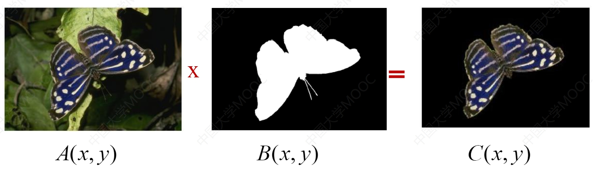
> 如果要对上图进行抠图，只需要对原图乘以掩码。

##### 1.3.1.3 滤波

滤波是通过**信号系统分析**去寻找输入和输出图像之间的关系。介绍滤波之前，需要先介绍一下**信号与系统分析**(可以跳过不看，之间看二维的，这里使用一维的去一步一步的引出二维然后再引出滤波)。

- 系统是指接受输入并产生相应的输出
- 分析是指输入和输出之间的对应关系

如果对于一维的线性时不变系统$x(t) \rightarrow y(t)$可以使用以下公式：

$$y(t)=h(t)\ast x(t)=\int_{-\infty}^{+\infty}h(\tau)x(t-\tau)d\tau$$

$h(t)$卷积$x(t)$，这里的$h(t)$是冲击响应。推广到一维离散则是：

$$y(i)=h(i)\ast x(i)=\sum_{n}h(i)x(i+n)$$

这里可以回顾以下一维的线性时不变系统：
> **线性**是指系统的输入/输出关系具有线性映射性质，即对于输入的线性组合，其输出也等于输入的线性组合
> **时不变**则是指系统的参数不随时间而变化，即系统的特性不随时间而改变
> **关于滤波的一点自己的想法，可能不准确**：假如拍一张照片，除了自己还有其他的游客，我们可能会使用裁剪功能将其他游客去除。这就是空间域的滤波。如果是频域滤波是指我们的采样滤波是256Hz，但是我只想采15-30Hz的信号。就需要将其余的“杂波”去除。在频域部分会有更加详细的说明。

如果对于数字图像来说，则需要推广到二维：

$$
y(i,j)=h(i,j)\ast x(i,j)=\sum_{m}\sum_{n}h(m,n)x(i+n,j+m)
$$

**卷积操作**：数字图像是一个二维的数组，对数字图像做卷积操作其实就是利用卷积核在图像上滑动，将图像点上的像素值与对应的卷积核上的数值相乘，然后将所有相乘后的值相加作为卷积核中间像素点的像素值，并最终滑动完所有图像的过程。

基于以上理论，使用**空间域滤波**对图像进行增强如下图所示：

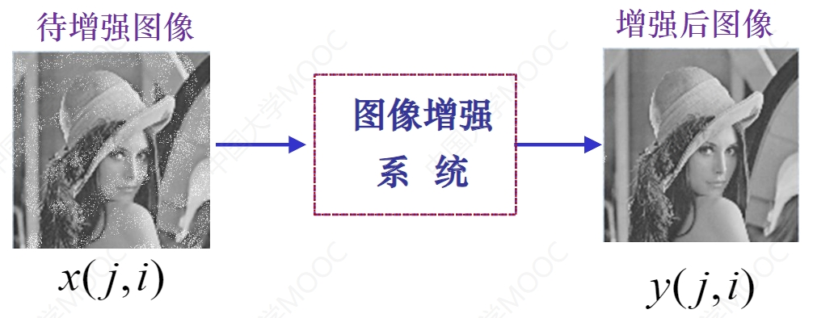

对于图像增强系统的卷积$h(m,n)$，先介绍几种低通滤波器：

- 均值滤波器：输入图像像素及周边8个灰度级的平均值

    $$h(m,n)=\begin{bmatrix}
    1&1&1\\
    1&1&1\\
    1&1&1\\
    \end{bmatrix}\times \frac {1}{9}$$

- 高斯低通滤波器：中心点的加权是4；周围的加权是2；最后一圈的加权是1，这样做比起均值滤波器可以很好的突出中心点。

    $$h(m,n)=\begin{bmatrix}
    1&2&1\\
    2&4&2\\
    1&2&1\\
    \end{bmatrix}\times \frac {1}{16}$$

正如下图所示，在应用上，不同的低通滤波器在去除噪声的对比：

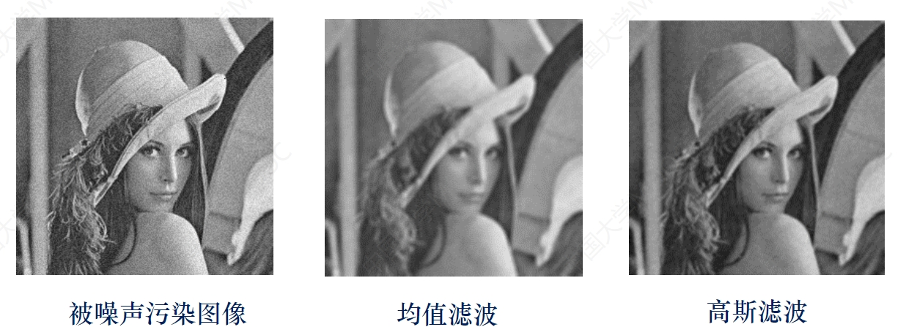

可以看出，低通滤波器在去除噪声的同时也使得图像更加**平滑**，所以低通滤波器的另一个作用就是**图像平滑**。

上述的几种低通滤波器把图像的噪声去除了，但是边缘也模糊了。

造成这个问题的原因可以用一个一维的信号举例：
> 设一维信号 $s={0,0,0,6,0,0,0,0,0,2,2,2,2,\dots}$
> 如果对其使用均值滤波后得到 $s\prime={0,2,2,2,0,0,0,2/3,4/3,2,\dots}$
> 可以看出6变成了三个2，这说明在一定程度上**抑制噪声**，但是边缘部分2变成了2/3和4/3，边缘出现了一个坡度变化这就造成了**边缘模糊**。
> 为了解决这个问题，就需要使用**中值滤波器**（3个值排序，取中间）则得到：$s\prime\prime={0,0,0,0,0,0,0,0,2,2,2,2,\dots}$，这样就抑制了噪声并且保留边缘。

如果推广到图像上：

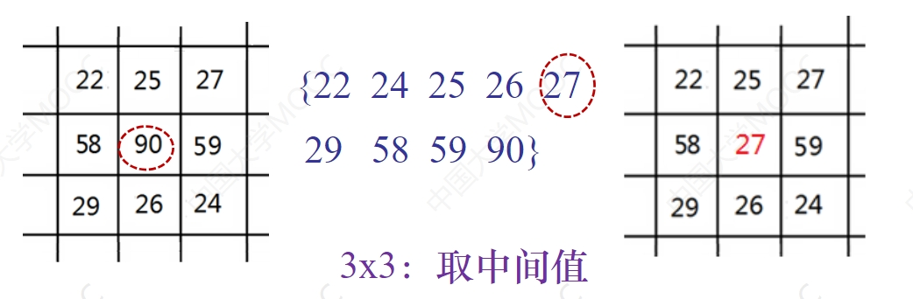

相比较与均值滤波，中值滤波效果是非常好的，如下图：

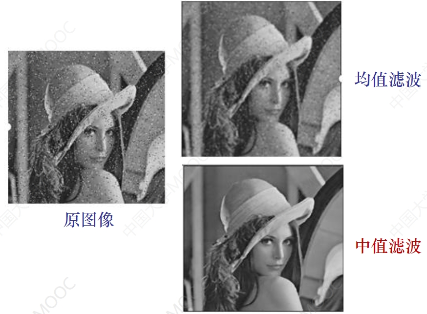

以上，低通滤波和中值滤波都是针对于去除噪点等问题。接下来的高通滤波是**突出图像的细节特征**并且**增强图像模糊的边缘**。这就是**图像锐化**（如下图）。

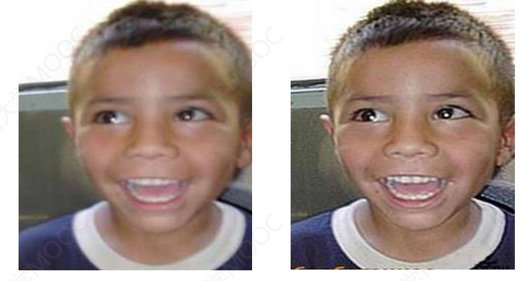

之前讲到的低通滤波是**积分运算**，但高通滤波是**微分运算**。

图像的高通滤波（锐化）分为两个步骤：

1. 找到边缘
2. 边缘叠加到原图，使得边缘更加突出

所以，如何找到边缘，我们首先需要计算图像中像素的梯度（下面是推理过程，可以不看，直接跳过看结论）。

如何找到图像的边缘？
> 因为图像是二维的，所有有水平和垂直两个方向的梯度，所以我们假设图像$f(x,y)$在像素$(x,y)$的水平和垂直梯度分别记为：
> $$
> G_x=\frac{\partial f}{x}=\frac{\partial f(x,y)}{x}=f(x+1,y)-f(x,y)\\
> G_y=\frac{\partial f}{y}=\frac{\partial f(x,y)}{y}=f(x,y+1)-f(x,y)
> $$
> 由此可得图像$f(x,y)$在像素$(x,y)$的梯度$\nabla f(x,y)$为一个向量：
> $$
> \nabla f(x,y)=[G_x G_y]^T=[\frac{\partial f}{\partial x} \frac{\partial f}{\partial y}]^T
> $$
> 通过计算差分值即可知道是否为边缘。由导数的性质可知，只要有跳动变化的即为边缘。

- 平坦区（灰度不变区域）差分值为**零**
- 边缘（灰度变化区域）差分值为**非零**

这样我们就可以找到边缘了。接下来就是做叠加，将**原图**加上**图像边缘**即可得到**锐化图像**：

$$
f(x,y)+|\nabla f(x,y)|\\
$$

这就是基于梯度的图像增强。上述看来，最重要的是边缘检测，这里提及几个比较重要的边缘检测算子。具体来说，基于梯度的边缘检测算子分为以下几类：

- 基于一阶导数的边缘检测算子：通过模板作为核与图像的每个像素点做卷积和运算，然后选取合适的阈值来提取图像的边缘，以最大值作为对应的边缘的位置，常见的有Roberts算子、Sobel算子和Prewitt算子
- 基于二阶导数的边缘检测算子，依据于二阶导数过零点，常见的有Laplacian算子
- 其他边缘算子：前面两类均是通过微分算子来检测图像边缘，还有一种就是Canny算子，其是在满足一定约束条件下推导出来的边缘检测最优化算子（原理不熟）。

对于一阶和二阶导数的算子比较，以下做了详细说明（可以和下文中关于算子的介绍结合着看）：
> 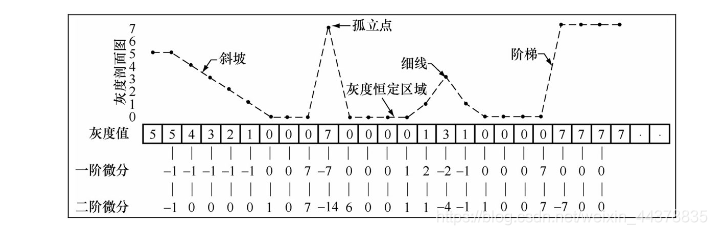
> 设上图最上面部分的灰度剖面图对应于图像中的一条具有代表性的水平像素线，其中包括了：
> 
> - 灰度较缓变化的斜坡（软边缘）
> - 孤立点（很可能为噪声）
> - 细线（细节）
> - 以及灰度跳变的阶梯（硬边缘）
> 
> 为了简单起见，考虑图像中只有8个灰度级的情况。图中下面的一行给出了这条像素线中各个像素的灰度值，由此计算出的一阶微分和二阶微分在图中的第3行和第4行中给出。
> 为了模型的简化，像素线在图像中是水平分布的（没有使用类似于图像的二维表示），因此微分方程也是一维的。
>
> 一维情况下的一阶微分：
> $$\frac{\partial f}{\partial x}=f(x+1)-f(x)$$
> 一维情况下的二阶微分：
> $$\frac{\partial ^2f}{\partial x^2}=f(x+1)+f(x-1)-2f(x)$$
> 
> 通过分析这个典型的灰度变化模型，就可以很好地比较噪声点、细节以及边缘的一阶和二阶微分结果。所以，接下来对不同的情况做出分析。
> - 首先是图中的斜坡（软边缘），如下图，**一阶微分都具有非0响应**，并且当这种斜坡的灰度过渡近似线时，对应于变化率的一阶微分的响应为**恒定值（这里为-1）**；**而二阶微分的非0响应则只出现在斜坡的起始和终点处，在灰度变化率恒定的斜面上二阶微分值为0**，这就是拉普拉斯锐化图像周围出现**双边缘**的原因。由此得出结论，对于图像中的软边缘，**一阶微分通常产生较粗的边缘，而二阶微分则细得多**。
>
>   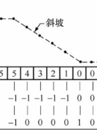
> 
> - 再来看孤立噪声点，注意到**二阶微分对于噪声点的响应较一阶微分要强很多**，这也就是拉普拉斯锐化图像中出现一些零星的高响应的原因，当然二阶微分的这一性质是我们所不希望的。
> 
>   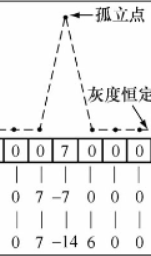
> 
> - 细线常常对应于图像中的细节，**二阶微分对细线的较强**响应说明了二阶微分对于细节增强的优越性。
> 
>   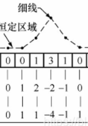
> 
> - 最后，**一、二阶微分对于灰度阶梯有着相同的响应，只是在二阶微分中有一个从正到负的过渡**，这一性质用于边缘检测。
> 
>   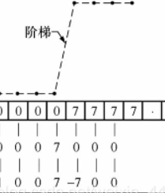
>
> 对以上的总结如下：
> - 一阶导数通常会产生较宽的边缘。
> - 二阶导数对细节有较强的响应，如细线和孤立噪声点。
> 
> 对于图像增强而言，基于二阶导数的算子应用更多一些，因为它对于细节响应更强，增强效果也就更明显。而在边缘检测的时候，基于一阶导数的算子则会更多地发挥作用。尽管如此，一阶算子在图像增强中依然不可或缺，它们常常同二阶算子结合在一起以达到更好的锐化增强效果。

上面图中一、二阶求导作为演示用，数值是随机的。如果实践过程中如何计算梯度？基于以上的理论，下面介绍几个计算梯度的主要算子：

- Roberts算子：又称为交叉微分算法，它是基于交叉差分的梯度算法，通过局部差分计算检测边缘线条。常用来处理具有陡峭的低噪声图像，当图像边缘接近于正45度或负45度时，该算法处理效果更理想。其缺点是对边缘的定位不太准确，提取的边缘线条较粗。
- Prewitt算子
- Sobel算子
- Laplacian算子
- Canndy算子

对于该章节做一个简短的总结，滤波器分为低通、中值和高通。其中，低通滤波器去除噪点的同时模糊了边缘，会使得边缘平滑。所以，如果不希望模糊边缘则选择中值滤波器。

#### 1.3.2 频域

图像进行傅里叶变换等，对变换后的系数进行操作。

##### 1.3.2.1 滤波

### 1.4 形态学

## 2. OpenCV实战案例

### 2.1 在人脸添加挂件

### 2.2 人脸识别

### 2.3 全景图像拼接

### 2.4 图像修复

### 2.5 车辆计数

### 2.6 车道线检测

### 2.7 运动检测器

### 2.8 人脸替换

### 2.9 语义分割

### 2.10 目标识别

### 2.11 行为检测

### 2.12 目标追踪

## 3. 面试题