# OpenCV

- 作者：李竹楠
- 日期：2024/01/01

介绍OpenCV之前，作为先导的理论知识，应该先介绍数字图像处理内容。数字图像处理这门课很多大学开过，类似课程名包括但不限于图像处理、数字图像等等。这个课程主要是讲图像在计算机中是如何存储和处理的，通过一些处理手段，可以帮助我们实现既定功能。

OpenCV是一个工具库，如果单独去学习会无的放矢并且会非常的空（学了就忘了）。所以，在数字图像处理的基础概念中，会引入OpenCV的相关用法，并且在后续会有大量的使用OpenCV的实际案例去做说明。在最后，会有一些面试题。

## 1. 数字图像处理

理论阶段不是非常复杂，可以说是泛泛而谈，更加详细而又复杂的内容将会在实战案例和面试题中体现。在这里，理论只是起到一个大纲或者索引的作用，在后续的章节中遇到概念和数学模型会有一个大概的印象。

### 1.1 基本概念

#### 1.1.1 图像采样与量化

图像分为两大类：

- 模拟图像（连续的）
    - 通过某种连续的**物理量**（光或电的强弱**变化**），记录图像的亮度信息
- 数字图像（离散的）
    - 采用**数字**表示方式，记录图像**亮度**信息，使用计算机存储与处理

通过采样或量化可以得到数字图像。这里先引入一维模拟信号的采样和量化：

$$f(t)\rightarrow 000...111$$

在时间轴上对模拟信号进行等建模的采样，同时，对幅值做一个量化。这样就可以讲一个连续量离散化（数字化）。如果推广到二维的数字图像：

$$f(x,y)$$

在水平和垂直方向都进行等建模采样，其中(x,y)表示像素位置，函数f表示像素灰度值。以上是对图像进行了采样，如果继续对图像进行量化，首先要明确**精度**，精度分为**空间分辨率精度**和**亮度分辨率精度**。首先来看空间分辨率精度：衡量将模拟图像转化为数字图像的**空间精度**。

从上图可以看出，左图的栅格比起右图的更为细密，则代表精度越高。反映到具体图像则是：采样间隔越小，则更接近于原图画质。

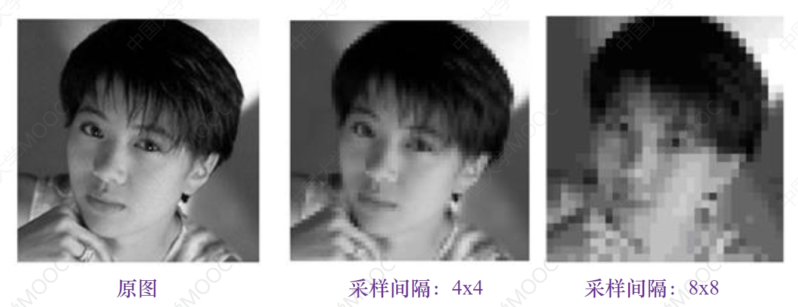

对于亮度分辨率：衡量图像亮度的**量化精度**。反映到具体图像则是：数量级越低，精度越低。最极端的情况是两个灰度级，这就是黑白图像。

#### 1.1.2 图像的存储与格式

以上是采样和量化。下面介绍存储与格式。如果存储一个图像需要多少比特呢？答案是：

$$b=M*N*k$$

这里假设图像的宽为$M$，高为$N$，灰度级（量化级别）为$L=2^k$，举个例子：图像大小为$384*384$的图像，灰度级是256，那么$b=384*384*8$。

图像存储格式：BMP(无损、与设备无关、下到上左到右扫描)、JPEG(有损压缩)、PNG(网络图像格式、压缩比高、存储量相对小)。

### 1.2 分布直方图

在介绍分布直方图之前观察三个图片。

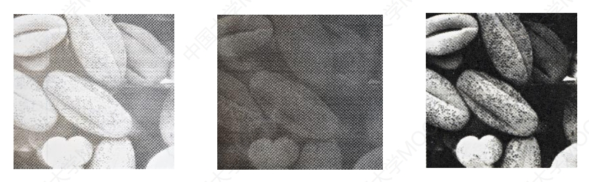

通过观察，最左边的图像偏亮，中间的偏暗，左边的亮暗分明。什么原因造成这样的情况？原因是不同**灰度级**的分布构成导致了这个原因。直观点说，就是大部分像素灰度级偏大，造成了左边的图像，如果大部分像素的灰度级偏小则造成中间这幅图。

所以，我们可以说分布直方图是描述不同灰度级数量的图。如果我们用数学模型表示：

$$h(r_k)=n_k$$

$r_k$为灰度级，$n_k$为该灰度级的像素个数（其实就是一个统计图，例如灰度级为1的有10个像素，灰度级为2的有11个像素之类的）。如果更加直观的描述：

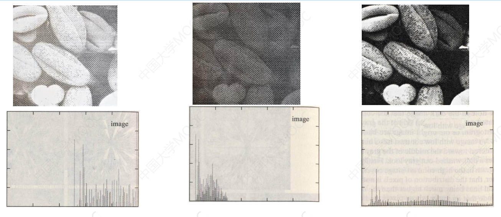

可以看到，如果灰度级趋向于均衡，则图象是亮暗分明的。

在具体应用上有：图像增强（直方图均衡）、图像分割（根据直方图获取分割阈值）、图像识别和分类（直方图对比）

### 1.3 图像增强

为什么要进行图像增强？先引入几个图片：

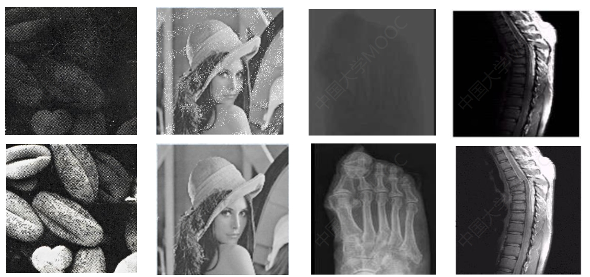

从图中可以看到，相比较于下面的四幅图，上面的图片视觉效果不佳（灰度级分布不均、噪点和难以分析）。经过图像增强后的效果使得图像适合于分析。所以说，图像增强是根据需要，**突出**和**去除**图像中的某些信息。但是需要注意图像增强：

- 没有**增加**图像中的信息量，还可能会损失
- 没有统一的客观标准，特定用途特定方法

图像增强的方法：

- 灰度变换
- 滤波器（空间域和频域）
- 代数运算

#### 1.3.1 空间域

直接对图像中的灰度级进行操作。假设输入图像$x(i,j)$，输出图像$y(i,j)$，则

$$y(i,j)=T[x(i,j)]$$

其中$T$是指对输入图像灰度级的变换。**只改变了像素的灰度级，并没有改变像素位置**。

##### 1.3.1.1 灰度变换

由于不对像素位置进行改变，则将上述公式简化为：

$$s=T[r]$$

其中，$T$为灰度变换**函数**。根据函数性质，可分为**线性**和**非线性**。

首先，来看线性变换的例子(反转)：$s=255-r$

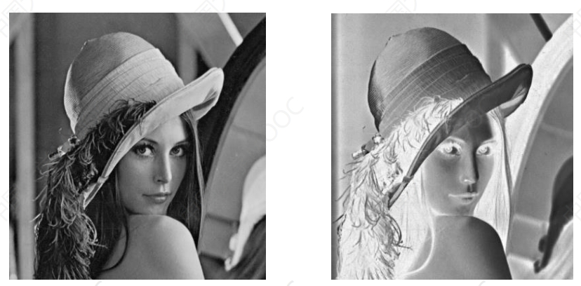

再比如下图（左）图像偏暗，如果对灰度级进行拉伸会有右图的效果：$s=Ar$

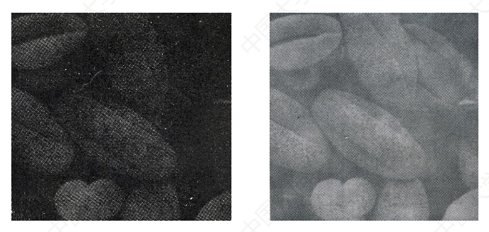

但是，实际上图像处理是非常复杂的，所以单纯一个函数是无法对图像进行合适的处理。那么就需要进行更为复杂的函数：分段线性变换。

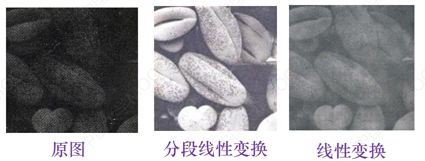

这样可以突出感兴趣区间，相对抑制不感兴趣的灰度区域。

然后，再看非线性变换，其中有对数变换、幂次变换。

**注意：这部分需要结合函数图像进行分析。要分析灰度级需要拉伸还是压缩。通过实验可以更加直观的观察。**

**这些操作都是为了灰度直方图均匀，那么如何做到呢？可以看下面的推论，如果不看数学部分也没关系。**

上述的操作对灰度级进行了运算，现在要看一下变换前后的灰度直方图分布的变化。我们可以假设灰度变换函数：

$$D_B=f(D_A)$$

并且设$H_A(D)$是变换之前的分布直方图；设$H_B(D)$是变换之后的分布直方图。这样问题转换为$H_A(D)$和$H_B(D)$存在什么样的关系。

先说结论：灰度变换后灰度分布直方图是变换前灰度分布直方图与**变换函数导数**之比：

$$H_B(D_B)=\frac{H_A(D_A)}{f\prime(D_A)}$$

推导过程：
> 
> 上图中，是$H_A(D)$经过函数变换后转换为$H_B(D)$的函数图像。其中，每个像素点经过函数变换都会对应相对变换后的值。那么，利用积分原理，我们可以得到两块阴影部分面积是相同的。
> 两块阴影面积相同：是因为$H_A(D)$的x轴是拟变换像素的总个数，对应变换后的像素个数是不变的。换句话说，更改的像素个数是一定的（分布直方图就是不同灰度级的像素个数分布），所以变换前后像素是不变的。
> 基于以上的理论我们可以推出公式：
> $$\int_{D_B}^{D_B+\Delta D_B}H_B(D_B)\,dD=\int_{D_A}^{D_A+\Delta D_A}H_A(D_A)\,dD$$
> 如果$\Delta D_B$和$\Delta D_A$都趋于极小值，则可以简化为：
> $$H_B(D)\Delta D_B=H_A(D)\Delta D_A$$
> 则$H_B(D_B)=\frac{H_A(D_A)}{\Delta D_B/\Delta D_A}$
> 如果$\Delta D_B$和$\Delta D_A$都趋于0
> 可以得到$\Delta D_B$和$\Delta D_A$之比是函数在$D_A$的导数
> 则推出分布直方图转换前后公式

如何做到分布直方图均匀？我们需要每个灰度级拥有相同（理想）的像素个数。为了达到这个要求，反映在上述公式上是：$H_B(D_B)=\frac{A_0}{D_m}$，这里的$\frac{A_0}{D_m}$是一个常数（不难理解，我们需要将灰度级都均衡成一个常数）。$D_m$代表灰度级，$A_0$代表像素总数。

那么我们可以得到公式

$$f\prime(D_A)=H_B(D_B)=\frac{A_0}{D_m}H_A(D_A)$$

对两边同时积分，可得到（注意函数是离散的，所以用的是求和而不是积分）：

$$D_B=f(D_A)=\frac{D_m}{A_0}\sum_0^{D_A}H_A(D_A)$$

举一个例子：

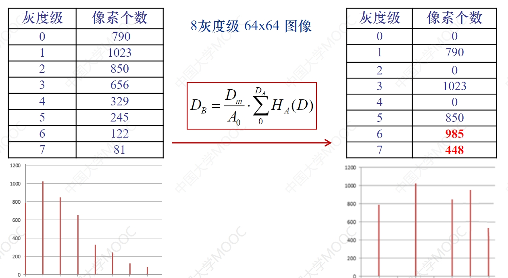

这样图像就均衡很多了。

关于直方图的应用，最直观的就是人脸识别。因为，获取人脸照片时光照都是不一样的，所以，为了一个高性能的识别率，我们都是需要对图片做直方图均衡的，经过这样的操作后，灰度的分布都差不多。这样我们再去识别，精度会提升很多。

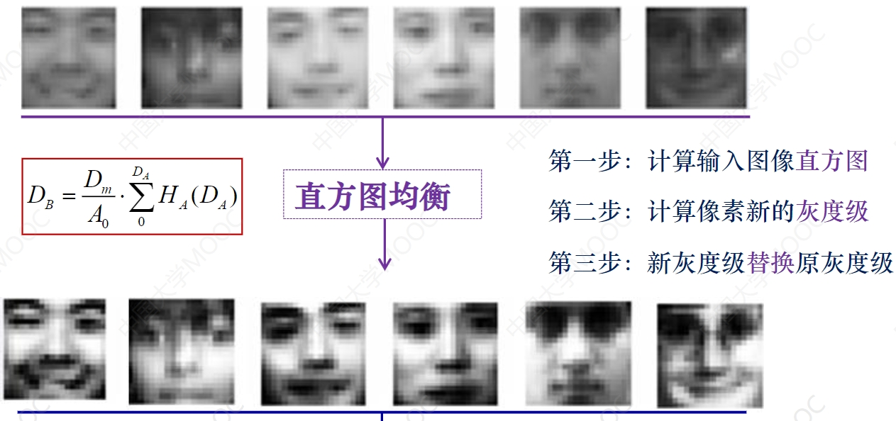

这个图是人脸识别中的流程图。可以看到采集到的图像有的偏亮有的偏暗，所以我们第一步是计算新的图像的直方图然后去替换原灰度级。得到直方图均衡的图片后再送去做识别。

##### 1.3.1.2 代数运算

代数运算中包含加、减和乘运算。

加法运算是指两幅或多幅图片相加，用于**去除叠加噪声**。公式如下：

$$C(x,y)=A(x,y)+B(x,y)$$

举一个例子，如果图像$f(x,y)$在传输或获取的过程中被噪音$n_i(x,y)$所污染，得到被污染的图像$g_i(x,y)$，则

$$g_i(x,y)=f(x,y)+n_i(x,y),i=1,\dots N$$

如何恢复原始图像：
> 假设噪声均值为0且互不相关，可以用N幅图像的均值：
> $$\frac{\sum_{i=1}^Ng_i(x,y)}{N}=\frac{Nf(x,y)}{N}+\frac{\sum_{i=1}^Nn_i(x,y)}{N}=f(x,y)$$
> 求多个图片的均值可以去除叠加性噪声，在视频图像中使用特别多，比如如果对一帧有噪声的图像进行识别，可以叠加前后几帧图像。

减法运算是指两幅图像相减，用于**分割特定区域**和**检测场景变化**。公式如下：

$$C(x,y)=A(x,y)-B(x,y)$$

如何做特定区域检测：
> 如果有一个背景图$A(x,y)$，用背景图减去图像$B(x,y)$，然后再对图像做个二值化，这样就可以分割特定的区域。还可以用作低成本的入侵检测，当有人入侵指定区域时，只需要计算差值就好。

乘法运算是指两幅图像相乘，用于**获取图像中特定部分**。公式如下：

$$C(x,y)=A(x,y)\times B(x,y)$$

如何提取特定区域：
> 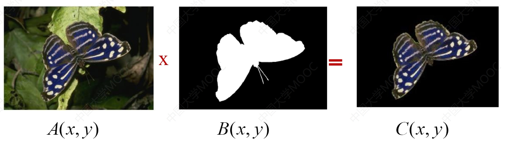
> 如果要对上图进行抠图，只需要对原图乘以掩码。

##### 1.3.1.3 滤波

滤波是通过**信号系统分析**去寻找输入和输出图像之间的关系。介绍滤波之前，需要先介绍一下**信号与系统分析**(可以跳过不看，之间看二维的，这里使用一维的去一步一步的引出二维然后再引出滤波)。

- 系统是指接受输入并产生相应的输出
- 分析是指输入和输出之间的对应关系

如果对于一维的线性时不变系统$x(t) \rightarrow y(t)$可以使用以下公式：

$$y(t)=h(t)\ast x(t)=\int_{-\infty}^{+\infty}h(\tau)x(t-\tau)d\tau$$

$h(t)$卷积$x(t)$，这里的$h(t)$是冲击响应。推广到一维离散则是：

$$y(i)=h(i)\ast x(i)=\sum_{n}h(i)x(i+n)$$

这里可以回顾以下一维的线性时不变系统：
> **线性**是指系统的输入/输出关系具有线性映射性质，即对于输入的线性组合，其输出也等于输入的线性组合
> **时不变**则是指系统的参数不随时间而变化，即系统的特性不随时间而改变
> **关于滤波的一点自己的想法，可能不准确**：假如拍一张照片，除了自己还有其他的游客，我们可能会使用裁剪功能将其他游客去除。这就是空间域的滤波。如果是频域滤波是指我们的采样滤波是256Hz，但是我只想采15-30Hz的信号。就需要将其余的“杂波”去除。在频域部分会有更加详细的说明。

如果对于数字图像来说，则需要推广到二维：

$$
y(i,j)=h(i,j)\ast x(i,j)=\sum_{m}\sum_{n}h(m,n)x(i+n,j+m)
$$

**卷积操作**：数字图像是一个二维的数组，对数字图像做卷积操作其实就是利用卷积核在图像上滑动，将图像点上的像素值与对应的卷积核上的数值相乘，然后将所有相乘后的值相加作为卷积核中间像素点的像素值，并最终滑动完所有图像的过程。

基于以上理论，使用**空间域滤波**对图像进行增强如下图所示：

对于图像增强系统的卷积$h(m,n)$，先介绍几种低通滤波器：

- 均值滤波器：输入图像像素及周边8个灰度级的平均值

    $$h(m,n)=\begin{bmatrix}
    1&1&1\\
    1&1&1\\
    1&1&1\\
    \end{bmatrix}\times \frac {1}{9}$$

- 高斯低通滤波器：中心点的加权是4；周围的加权是2；最后一圈的加权是1，这样做比起均值滤波器可以很好的突出中心点。

    $$h(m,n)=\begin{bmatrix}
    1&2&1\\
    2&4&2\\
    1&2&1\\
    \end{bmatrix}\times \frac {1}{16}$$

正如下图所示，在应用上，不同的低通滤波器在去除噪声的对比：

可以看出，低通滤波器在去除噪声的同时也使得图像更加**平滑**，所以低通滤波器的另一个作用就是**图像平滑**。

上述的几种低通滤波器把图像的噪声去除了，但是边缘也模糊了。

造成这个问题的原因可以用一个一维的信号举例：
> 设一维信号 $s={0,0,0,6,0,0,0,0,0,2,2,2,2,\dots}$
> 如果对其使用均值滤波后得到 $s_1={0,2,2,2,0,0,0,2/3,4/3,2,\dots}$
> 可以看出6变成了三个2，这说明在一定程度上**抑制噪声**，但是边缘部分2变成了2/3和4/3，边缘出现了一个坡度变化这就造成了**边缘模糊**。
> 为了解决这个问题，就需要使用**中值滤波器**（3个值排序，取中间）则得到：$s_2={0,0,0,0,0,0,0,0,2,2,2,2,\dots}$，这样就抑制了噪声并且保留边缘。

如果推广到图像上：

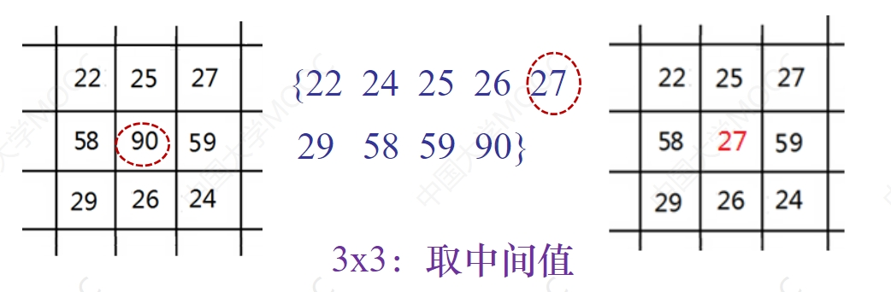

相比较与均值滤波，中值滤波效果是非常好的，如下图：

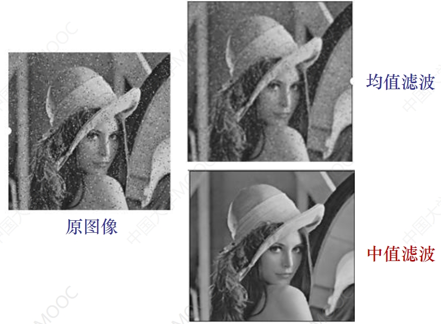

插入一个关于噪声的知识点：
> 噪声总体分为：**椒盐噪声、高斯噪声和泊松噪声**
> 噪声是如何产生的？在图像数据的存储、传输过程中，通常会因为电子元器件之间的电磁干扰产生，又或者图像数据在传输过程中遇到来自自然界、或者人为的干扰。举个例子来说，过去黑白电视机经常由于电信号干扰，而在图像中产生雪花。又或者是拿一个强磁，对着电子管的电视机进行干扰，而在图像中出现一些水纹波。
> 先说椒盐噪声：
> 
> 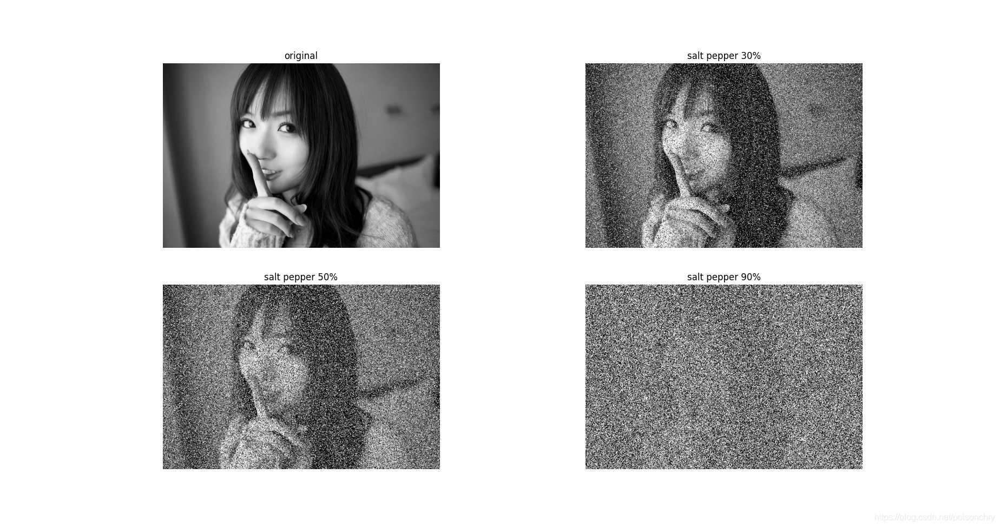
> 
> 椒盐噪声(salt-and-pepper noise)又称脉冲噪声，它随机改变一些像素值，在二值图像上表现为使一些像素点变白，一些像素点变黑。 **是由图像传感器，传输信道，解码处理等产生的黑白相间的亮暗点噪声**，也就是老人们比较熟悉的所谓“雪花”。
> 高斯噪声：
>
> 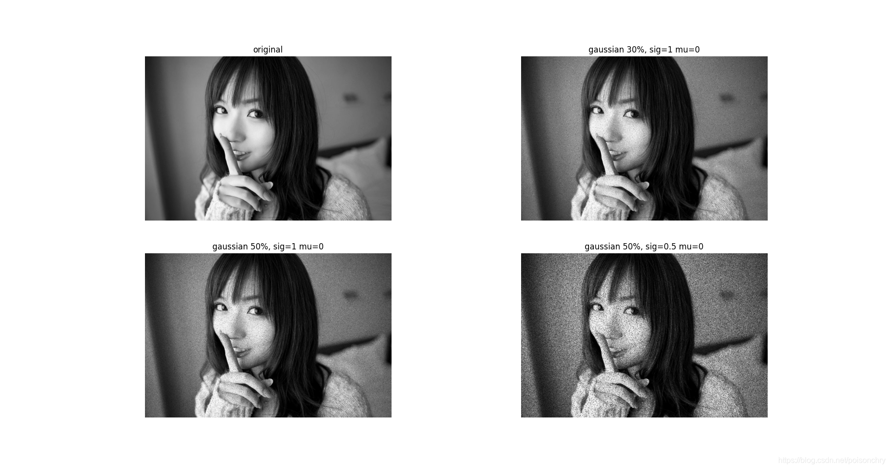
>
> ~~高斯噪声是指噪声密度函数服从高斯分布的一类噪声。由于高斯噪声在空间和频域中数学上的易处理性，这种噪声(也称为正态噪声)模型经常被用于实践中。~~
> 以上的解释非常枯燥（但是是非常准确的），这里放一个图就非常好理解了：
>
> 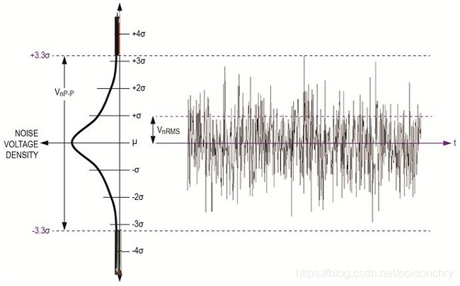
> 首先从一维来介绍，假设某一种有效信号它表示为$\mu$，而随着时间的延续，比方说这个信号是来自某种温度传感器，由于传感器老化或者传输信号出现了某种干扰，这些干扰的信号范围在$[-3\sigma, 3\sigma]$之间，然后我们把这段时间内噪音的振幅收集并且整理后，发现它符合正态分布曲线，亦或者称为高斯曲线，那么这样的噪音就称为高斯噪音。公式如下：
> $$f(x)=\frac{1}{\sqrt{2\pi \sigma}}e^{-\frac{(x-\mu)^2}{2\sigma^2}}$$
> - 曲线关于$x=\mu$对称，通常这个值对应的是**信号本身**
> - $x=\mu$处为正态分布的最大值，振幅为$\frac{1}{\sqrt{2\pi \sigma}}$，也就是信号本号自身的强度，亦或者说是**期望值**
> - 而$\sigma$所决定的，就是噪音信号的分布情况，数学上称这玩意为标准差
> - 当标准差越小，信号噪音就越集中在期望值附近，换句话说也就是信号受噪音影响程度越小，而标准差越大，信号就越模糊。
> 所以，如果将信号挪到了0上，而噪音分布的标准差为1的时候，这个就是标准正态分布了。
> 
> 产生原因有以下几点：
> - 图像传感器在拍摄时市场不够明亮、亮度不够均匀；
> - 电路各元器件自身噪声和相互影响；
> - 图像传感器长期工作，温度过高。
> 
> 关于泊松噪声后期补上。

针对于以上噪声，我们如何进行选择滤波器？
> 对于高斯噪声，选择高斯滤波。高斯滤波是一种线性平滑滤波器，对于服从正态分布的噪声有很好的抑制作用。在实际场景中，我们通常会假定图像包含的噪声为高斯白噪声，所以在许多实际应用的预处理部分，都会采用高斯滤波抑制噪声，如传统车牌识别等。
> 对于椒盐噪声，选择中值滤波。
> 至于均值滤波，本身存在着固有的缺陷，即它不能很好地保护图像细节，在图像去噪的同时也破坏了图像的细节部分，从而使图像变得模糊，不能很好地去除噪声点。特别是椒盐噪声。

以上，低通滤波都是针对于去除噪点等问题。接下来的高通滤波是**突出图像的细节特征**并且**增强图像模糊的边缘**。这就是**图像锐化**（如下图）。

之前讲到的低通滤波是**积分运算**，但高通滤波是**微分运算**。

图像的高通滤波（锐化）分为两个步骤：

1. 找到边缘
2. 边缘叠加到原图，使得边缘更加突出

所以，如何找到边缘，我们首先需要计算图像中像素的梯度（下面是推理过程，可以不看，直接跳过看结论）。

如何找到图像的边缘？
> 因为图像是二维的，所有有水平和垂直两个方向的梯度，所以我们假设图像$f(x,y)$在像素$(x,y)$的水平和垂直梯度分别记为：
> $$
> G_x=\frac{\partial f}{x}=\frac{\partial f(x,y)}{x}=f(x+1,y)-f(x,y)\\
> G_y=\frac{\partial f}{y}=\frac{\partial f(x,y)}{y}=f(x,y+1)-f(x,y)
> $$
> 由此可得图像$f(x,y)$在像素$(x,y)$的梯度$\nabla f(x,y)$为一个向量：
> $$
> \nabla f(x,y)=[G_x G_y]^T=[\frac{\partial f}{\partial x} \frac{\partial f}{\partial y}]^T
> $$
> 通过计算差分值即可知道是否为边缘。由导数的性质可知，只要有跳动变化的即为边缘。

- 平坦区（灰度不变区域）差分值为**零**
- 边缘（灰度变化区域）差分值为**非零**

这样我们就可以找到边缘了。接下来就是做叠加，将**原图**加上**图像边缘**即可得到**锐化图像**：

$$
f(x,y)+|\nabla f(x,y)|\\
$$

这就是基于梯度的图像增强。上述看来，最重要的是边缘检测，这里提及几个比较重要的边缘检测算子。具体来说，基于梯度的边缘检测算子分为以下几类：

- 基于一阶导数的边缘检测算子：通过模板作为核与图像的每个像素点做卷积和运算，然后选取合适的阈值来提取图像的边缘，以最大值作为对应的边缘的位置，常见的有Roberts算子、Sobel算子和Prewitt算子
- 基于二阶导数的边缘检测算子，依据于二阶导数过零点，常见的有Laplacian算子
- 其他边缘算子：前面两类均是通过微分算子来检测图像边缘，还有一种就是Canny算子，其是在满足一定约束条件下推导出来的边缘检测最优化算子（原理不熟）。

对于一阶和二阶导数的算子比较，以下做了详细说明（可以和下文中关于算子的介绍结合着看）：
> 
> 设上图最上面部分的灰度剖面图对应于图像中的一条具有代表性的水平像素线，其中包括了：
> 
> - 灰度较缓变化的斜坡（软边缘）
> - 孤立点（很可能为噪声）
> - 细线（细节）
> - 以及灰度跳变的阶梯（硬边缘）
> 
> 为了简单起见，考虑图像中只有8个灰度级的情况。图中下面的一行给出了这条像素线中各个像素的灰度值，由此计算出的一阶微分和二阶微分在图中的第3行和第4行中给出。
> 为了模型的简化，像素线在图像中是水平分布的（没有使用类似于图像的二维表示），因此微分方程也是一维的。
>
> 一维情况下的一阶微分：
> $$\frac{\partial f}{\partial x}=f(x+1)-f(x)$$
> 一维情况下的二阶微分：
> $$\frac{\partial ^2f}{\partial x^2}=f(x+1)+f(x-1)-2f(x)$$
> 
> 通过分析这个典型的灰度变化模型，就可以很好地比较噪声点、细节以及边缘的一阶和二阶微分结果。所以，接下来对不同的情况做出分析。
> - 首先是图中的斜坡（软边缘），如下图，**一阶微分都具有非0响应**，并且当这种斜坡的灰度过渡近似线时，对应于变化率的一阶微分的响应为**恒定值（这里为-1）**；**而二阶微分的非0响应则只出现在斜坡的起始和终点处，在灰度变化率恒定的斜面上二阶微分值为0**，这就是拉普拉斯锐化图像周围出现**双边缘**（常用来判断边缘像素位于图像的明区或暗区）的原因。由此得出结论，对于图像中的软边缘，**一阶微分通常产生较粗的边缘，而二阶微分则细得多**。
>
>   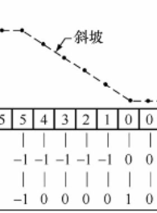
> 
> - 再来看孤立噪声点，注意到**二阶微分对于噪声点的响应较一阶微分要强很多**，这也就是拉普拉斯锐化图像中出现一些零星的高响应的原因，当然二阶微分的这一性质是我们所不希望的。
> 
>   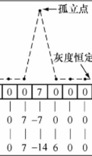
> 
> - 细线常常对应于图像中的细节，**二阶微分对细线的较强**响应说明了二阶微分对于细节增强的优越性。
> 
>   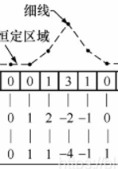
> 
> - 最后，**一、二阶微分对于灰度阶梯有着相同的响应，只是在二阶微分中有一个从正到负的过渡**，这一性质用于边缘检测。
> 
>   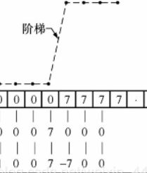
>
> 对以上的总结如下：
> - 一阶导数通常会产生较宽的边缘。
> - 二阶导数对细节有较强的响应，如细线和孤立噪声点。
> 
> 对于图像增强而言，基于二阶导数的算子应用更多一些，因为它对于细节响应更强，增强效果也就更明显。而在边缘检测的时候，基于一阶导数的算子则会更多地发挥作用。尽管如此，一阶算子在图像增强中依然不可或缺，它们常常同二阶算子结合在一起以达到更好的锐化增强效果。

上面图中一、二阶求导作为演示用，数值是随机的。如果实践过程中如何计算梯度？基于以上的理论，下面介绍几个计算梯度的主要算子：

- **Roberts算子**又称为交叉微分算法，它是基于交叉差分的梯度算法，通过局部差分计算检测边缘线条。**常用来处理具有陡峭的低噪声图像**，**当图像边缘接近于正45度或负45度时，该算法处理效果更理想**。**其缺点是对边缘的定位不太准确，提取的边缘线条较粗**。Roberts算子的模板分为水平方向和垂直方向，如下式所示，从其模板可以看出，Roberts算子能较好的增强正负45度的图像边缘。
    $$
    d_x=\begin{bmatrix}
        -1&0\\
        0&1\\
        \end{bmatrix}
    d_y=\begin{bmatrix}
        0&-1\\
        1&0\\
        \end{bmatrix}
    $$
    例如，下面给出Roberts算子的模板，在像素点P5处x和y方向上的梯度大小${g}_{x}$和${g}_{y}$分别计算为：
    
    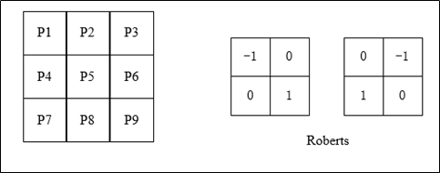

    $$
    g_x=\frac{\partial f}{\partial x}=P9-P5\\
    g_y=\frac{\partial f}{\partial y}=P8-P6
    $$
- **Prewitt算子**是一种图像边缘检测的微分算子，其原理是利用特定区域内像素灰度值产生的差分实现边缘检测。由于Prewitt算子通过像素平均来抑制噪声，这相当于对图像进行低通滤波。虽然这种方法有助于抑制噪声，但同时也可能平滑掉一些边缘信息，导致**边缘定位不够准确**。而Roberts算子利用局部差分算子寻找边缘，定位较为准确，但对噪声较为敏感。总的来说，Roberts算子通常用于**边缘明显且噪声较少**的图像分割，而Prewitt算子则更适用于**噪声较多的图像**。其计算公式如下所示：
    $$
    d_x=\begin{bmatrix}
        -1&0&1\\
        -1&0&1\\
        -1&0&1\\
        \end{bmatrix}
    d_x=\begin{bmatrix}
        -1&-1&-1\\
        0&0&0\\
        1&1&1\\
        \end{bmatrix}
    $$
    例如，下面给出Prewitt算子的模板，在像素点P5处x和y方向上的梯度大小${g}_{x}$和${g}_{y}$分别计算为：

    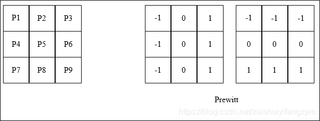

    $$
    g_x=\frac{\partial f}{\partial x}=(P7+P8+P9)-(P1+P2+P3)\\
    g_y=\frac{\partial f}{\partial y}=(P3+P6+P9)-(P1+P4+P7)
    $$
- **Sobel算子**是一种用于边缘检测的离散微分算子，它结合了高斯平滑和微分求导。该算子用于计算图像明暗程度近似值，根据图像边缘旁边明暗程度把该区域内超过某个数的特定点记为边缘。Sobel算子在Prewitt算子的基础上增加了权重的概念，认为相邻点的距离远近对当前像素点的影响是不同的，**距离越近的像素点对应当前像素的影响越大，从而实现图像锐化并突出边缘轮廓**。Sobel算子根据像素点上下、左右邻点灰度加权差，在边缘处达到极值这一现象检测边缘。**对噪声具有平滑作用，提供较为精确的边缘方向信息**。因为Sobel算子结合了高斯平滑和微分求导（分化），**因此结果会具有更多的抗噪性，当对精度要求不是很高时，Sobel算子是一种较为常用的边缘检测方法**。Sobel算子的边缘定位更准确，常用于**噪声较多、灰度渐变的图像**。其算法模板如下面的公式所示：
    $$
    d_x=\begin{bmatrix}
        -1&0&1\\
        -2&0&2\\
        -1&0&1\\
        \end{bmatrix}
    d_x=\begin{bmatrix}
        -1&-2&-1\\
        0&0&0\\
        1&2&1\\
        \end{bmatrix}
    $$
    例如，下面给出Sobel算子的模板，在像素点P5处x和y方向上的梯度大小${g}_{x}$和${g}_{y}$分别计算为：

    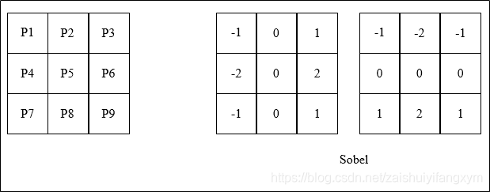

    $$
    g_x=\frac{\partial f}{\partial x}=(P7+2P8+P9)-(P1+2P2+P3)\\
    g_y=\frac{\partial f}{\partial y}=(P3+2P6+P9)-(P1+2P4+P7)
    $$
- **Laplacian算子**是一种二阶微分算子，用于图像处理和计算机视觉中的边缘检测和图像平滑。它通过对图像中的像素值进行二阶导数运算，检测图像中的局部变化，特别是边缘和纹理等特征。在图像处理中，拉普拉斯算子通常用于边缘检测，通过计算像素点处的二阶导数来判断该点是否为边缘点。**由于边缘处的像素值变化较大，因此二阶导数在该处具有较大的值**。通过将拉普拉斯算子应用于图像，可以突出显示边缘，从而检测出图像中的特征。拉普拉斯算子具有各向同性的特性，即在不同方向上对图像的微分处理是相同的。这使得拉普拉斯算子在处理具有不同方向性的边缘时更加鲁棒。然而，由于拉普拉斯算子是一个高阶微分算子，它可能会**增强噪声的影响，导致检测出的边缘不准确或出现伪边缘**。在实际应用中，为了降低噪声的影响并提高边缘检测的准确性，通常会将拉普拉斯算子与其他算子结合使用，例如**先对图像进行平滑处理再应用拉普拉斯算子**。

- Canndy算子
    分为四步：
    1. **去噪**：首先要去除图像的噪声，边缘检测很容易受到噪声的影响。去噪操作中我们使用的是$5\times 5$的高斯滤波器。
    2. **计算梯度**：在这一步要计算图像的梯度。不但要计算梯度的大小，还要求出梯度的方向。梯度的方向被归为四类：水平，垂直，两条对角线方向。计算图像梯度的大小和方向的公式如下：
    $$
    Edge_Gradient(G)=\sqrt{{G^2}_x+{G^2}_y}\\
    Angle(\theta)=tan^{-1}(\frac{G_x}{G_y})
    $$
    3. **非极大抑制**：经过以上操作得出的边界是非常粗糙且精度低的。我们需要在计算出梯度的大小和方向之后对整幅图像的像素点进行遍历。去除那些不在边界上的点。对每一个像素点进行检查，看它是否是周围同方向梯度的点中梯度最大的。如果是最大的，就保留，如果不是，就抑制（归0），如图，黄色点被保留，白色点被抑制：

    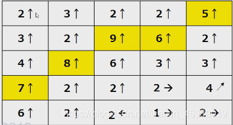

    4. **滞后阈值**：这是确定点是否在边界上的最后一关。我们设置两个阈值$(maxVal，minVal)$：
        - 凡是梯度大于$maxVal$的点我么就认为这个点处在边界上，保留
        - 梯度值大于$minVal < maxVal$的点，如果这个点与某个确定为边界的点相连，保留；否则就抛弃
        - 梯度值小于$minVal$的点，全部抛弃
        
        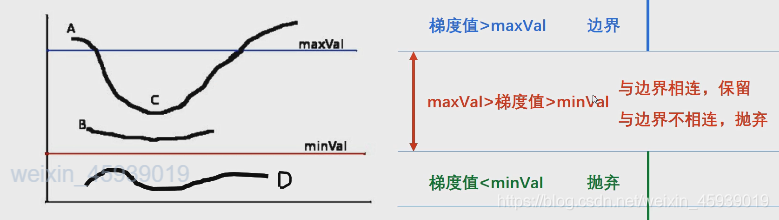

    经过这四步操作，我们就可以得到所想要的真正边界。关于设置阈值还是很有讲究的：**如果我们吧maxVal设置的太高，就会导致高于maxVal的点很少，边界就会不清楚时断时续；如果设置的太低就会导致大于maxVal的点很多，噪声也就太多，不利于我们的后续操作**。所以在实际操作中可以多试几次，找到最合适的值。相比较于其他算子Canndy算子有以下优势：
    - 采用了高斯滤波器平滑图像，能够有效地抑制噪声干扰，并准确检测边缘像素。相比之下，一些其他算子可能在噪声干扰下出现误检测或漏检的情况。
    - Canny算子采用了双阈值的方法，将边缘像素分为强边缘和弱边缘，并通过边缘连接算法将弱边缘与强边缘进行连接，得到连续的边缘线条。这种边缘连接的特性使得Canny算子在处理复杂图像时能够更好地连接边缘线条，**避免了边缘断裂的情况**。
    - Canny算子的**参数可调性**也是一个优势。通过调整高斯滤波器的大小、双阈值的设置等参数，可以根据具体应用的需求得到满足需求的边缘检测结果。

对于该章节做一个简短的总结，滤波器分为低通、中值和高通。其中，低通滤波器去除噪点的同时模糊了边缘，会使得边缘平滑。所以，如果不希望模糊边缘则选择中值滤波器。以上是针对于图像平滑或者是去除噪点。如果希望对图像进行锐化则需要使用高通滤波。

#### 1.3.2 频域

这一部分分为以下几个部分：首先会介绍为什么需要频域滤波（相比较之前的空间域滤波）；然后，中间穿插着对相关数学基础的介绍（傅里叶变换等）；最后，介绍滤波方法。

上文说到空间域滤波，对于空间域滤波会有以下几个问题，在空间域滤波中，平滑滤波器算法简单，处理速度快，但在降噪同时使图像产生模糊，特别是在边缘和细节处。中值滤波器对椒盐噪声抑制效果比较好,但对点、线等细节较多的图像却不太合适。低通滤波器对椒盐噪声过滤效果差,图像较为模糊。空间域滤波算法简单，处理速度较快，在锐化方面效果明显,线条突出。

所以，对于**低通滤波器对椒盐噪声过滤效果差**，这种噪声在空间域中表现为一些突兀的像素点，空间域滤波器可能无法准确地检测和去除这些噪声点，或者在去除噪声的同时造成图像失真。此外，空间域滤波器通常会对整个图像进行平滑处理，以减少图像中的噪声和细节信息。这种全局平滑可能会导致图像的细节信息丢失或模糊，尤其是在噪声较多的情况下。因此，对于含有高频率噪声的图像，频域滤波可能更加适合处理这些噪声点，因为它可以根据频率特性有针对性地滤除噪声，同时保留更多的图像细节信息。

相比之下，频域滤波可以更好地处理高频率噪声。频域滤波器可以利用图像的频率特性进行有针对性的处理，通过滤除特定频率的噪声来提高图像质量。例如，低通滤波器可以抑制高频噪声，而高通滤波器则可以突出高频细节信息。因此，在处理含有高频率噪声的图像时，频域滤波可以弥补空间域滤波的不足之处。

对于处理步骤，如下图所示，输入原始图像，经过傅里叶变换后再进行频域滤波处理，最后经过傅里叶反变换得到增强后图像。

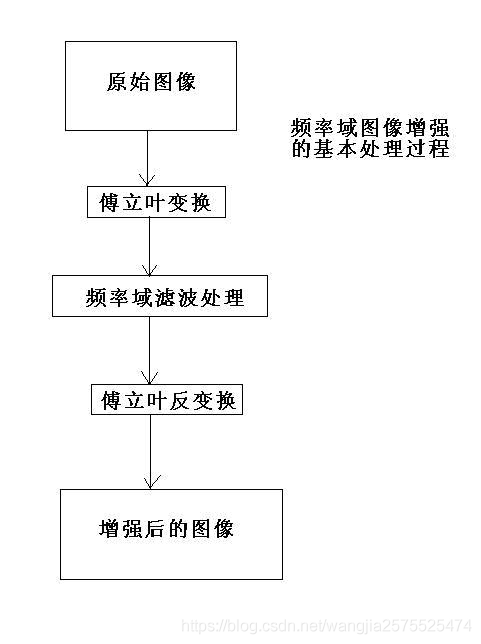

**这样做的目的是可以把时域内的信号变换到频域中，更容易处理**。

##### 1.3.2.1 滤波

介绍频域滤波之前，需要介绍傅里叶变换（可跳过不看，可直接看高低通滤波部分）。

为什么要用傅里叶变换？
> 用傅里叶变换表示的函数特征可以完全通过傅里叶反过程重建，不丢失任何东西。这是这些表示法的最重要特征之一，因为它可以使我们工作于频域，而且在转换会函数的原始域时不丢失任何信息。

这是结论，如果不知道什么是傅里叶级数，以上结论看起来比较抽象。下面是关于傅里叶级数的介绍。

什么是傅里叶级数（不用公式版本，全凭个人理解。以本人的经验，对于工程而言，公式的推导证明并不是重点）？
> 任何周期函数都可以表示为不同频率的正弦或余弦的形式，每个正弦或余弦乘以各自不同的系数。无论函数有多么复杂，只要它是周期的，并且满足某些数学条件，都可以用这样的和来表示，如下图，**周期性信号可以表示为一系列不同频率的正弦波的线性叠加**。
>
> 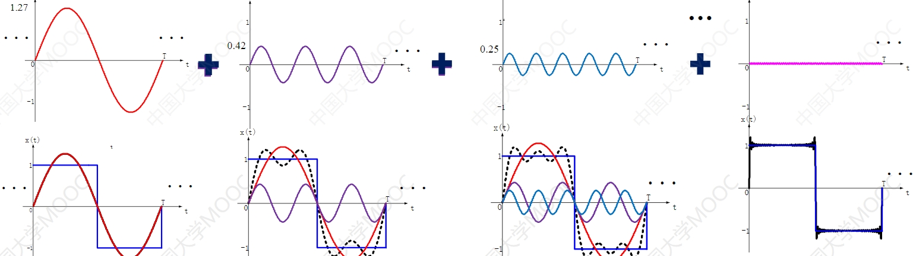
> 
> 上面是比较严谨的说法，摘录自教材。但是以我的说法就是，可以看下图想象一下，Z轴有不同的曲线，代表不同的简谐波。坐标0的曲线是我们最终“合成”的曲线，而它正是由2、4、6、8曲线合成的，曲线2会让0有一个比较高的振幅，4、6、8会让0有细微的“波浪”。如果用一个比喻来说，0曲线就像毫无逻辑的宇宙，看似混乱，但实际上是由其他的事物组合而成。
> 
> 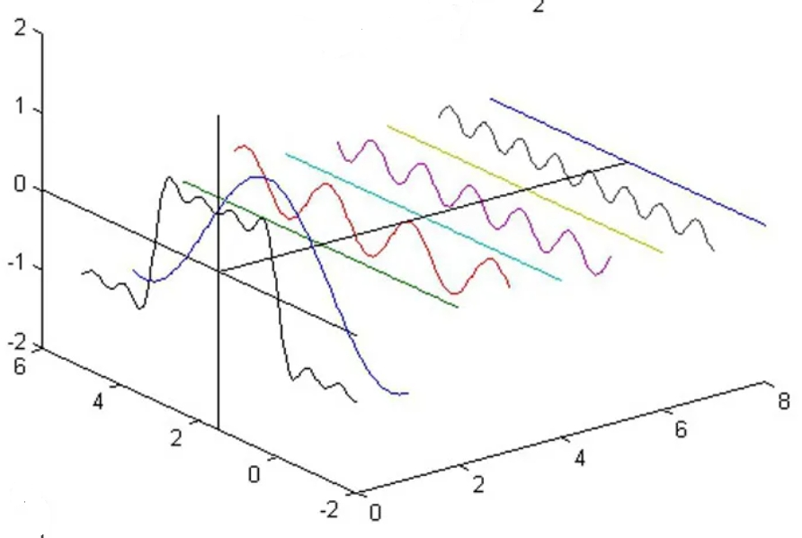
> 
> 那么，跟我们的频域有什么关系？
>
> 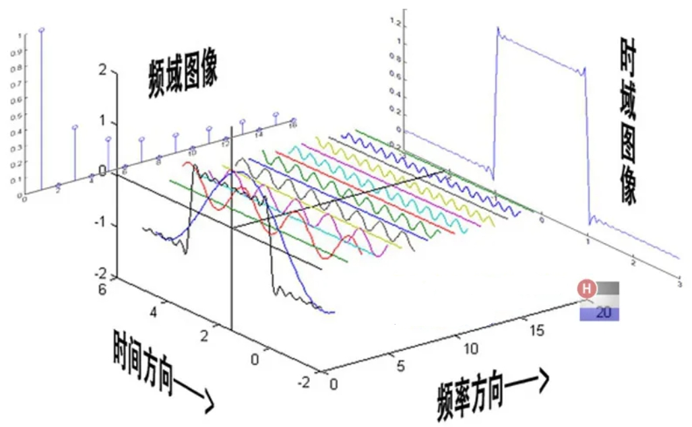
> 
> 首先，说一下什么是频域。看上图，在一维信号中，曲线会随着时间不停的往前行进，我们可以看到时域图像，但是从频率方向看，就看到频域图像。在图中，可以清晰的看到最终的曲线是如何组合而成的，又是如何分解的。
> 说一句题外话，某种程度上来说。世间万物貌似像时域曲线那样不断变化，是动态的。但是，从频域方向看来，又是永恒的而且静止的。
> 那么频域有什么用呢？假如这个信号就是$f(x)=2sin(3x)+3con(2x)$。那么，如果我想分离出$2sin(3x)$信号该如何做到呢？显然，单纯从时域方面下手是非常困难的（如果我们以正常角度看到一个信号是时间方向上的）。如果我们换一个角度，从频域角度来看。这个问题就好解决的多（直接过滤掉不想要的曲线就可以了）。这就是为什么需要傅里叶变换。**这个就是去除特定频率的操作，也就是滤波**。同样地，这种滤波的思想也可以推广到二维，也就是数字图像。
> 通过前面的介绍，已经了解了什么是傅里叶级数。简单来说，**在时域是一个周期且连续的函数，而在频域是一个非周期离散的函数**。而解析来说到的傅里叶变换(FT)就是**将一个时域非周期的连续信号，转换为一个在频域非周期的连续信号**（为什么是非周期的？宇宙万物很少有周期性的东西，或者是周期性无限大，可能吧）。
> 到目前为止，我们知道在**一维**世界中如何将**连续信号**时域和频域互相转换。其实，推广到图像中，我们所需的就是离散傅里叶变换(DFT)，它是将**二维**世界中的**离散信号**时域和频域互相转换，其方法与一维的大同小异（**严格的说不是大同小异，只是说很好理解**）。
> 至于快速傅里叶变换(FFT)其实就是DFT的一种简化计算复杂度的快速傅里叶变换，它是根据离散傅氏变换的奇、偶、虚、实等特性，对离散傅立叶变换的算法进行改进获得的。在软件领域可以把复杂度降到又DFT的$O(N*N)$降到$O(nlogn)$（如果是二维图像应该是$O( M*N*log(M*N))$）。
> **注意：以上的解释不严谨，只是为了一个简单的理解，具体的定论还需要看相关资料和论文。这段文字只是为了可以从一个比较直观的角度入门，如果后续做研究，不可以参考这段文字。**
> **这块地方的数学知识还是有点难的，涉及到复数域、欧拉公式以及傅里叶级数和转化公式的推导。个人感觉先要会用，再去细究原理。先把实验做出来，对比不同滤波器去思考为什么会带来效果的差异，再从中通过数学的工具去探究原理。**

以上是个人比较直观的理解，下面就是严格的公式：
> 对于一维傅里叶变换(FT)以及反变换(IFT)
> $$
> F(u)=\int_{-\infty}^{+\infty}f(x)e^{-j2\pi ux}dx=\mathcal{F}(f(x))\\
f(x)=\int_{-\infty}^{+\infty}F(u)e^{j2\pi ux}du=\mathcal{F}(F(u))
> $$
> 这两个等式组成傅里叶变换对，将其推广到二维则是：
> $$
> F(u,v)=\int_{-\infty}^{+\infty}\int_{-\infty}^{+\infty}f(x,y)e^{-j2\pi u(ux_vy)}dxdy=\mathcal{F}(f(x,y))\\
F(x,y)=\int_{-\infty}^{+\infty}\int_{-\infty}^{+\infty}f(u,v)e^{-j2\pi u(ux_vy)}dudv=\mathcal{F}(f(u,v))
> $$
> 推广到二维DFT和IDFT则是：
> $$
> F(u,v)=\frac{1}{MN}\sum_{x=0}^{M-1}\sum_{y=0}^{N-1}f(x,y)e^{-j2\pi (ux/M+vy/N)}, u=0,1 \dots,M-1, v=0,1 \dots,N-1\\
F(x,y)=\sum_{u=0}^{M-1}\sum_{v=0}^{N-1}f(u,v)e^{j2\pi (ux/M+vy/N)}, x=0,1 \dots,M-1, y=0,1 \dots,N-1
> $$
> 这里的$M,N$是图像的宽高，$(x,y)$是空间变量，$(u,v)$是频率变量
> 对上述公式取模即可得到幅度谱$|F(u,v)|$和后面跟着的相位谱$e^{j\phi (u,v)}$
> 三者关系如图所示
>
> 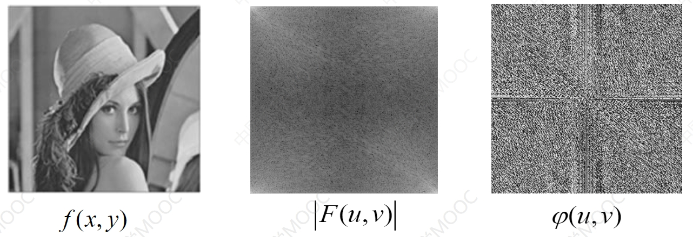

接下来，介绍数字图像中的频谱：

- 频率：对于图像来说就是指图像颜色值的梯度，即灰度级的变化速度
- 幅度：可以简单的理解为是频率的权，即该频率所占的比例
- 对于一个正弦信号，如果它的幅度变化很快，我们称之为高频信号，如果变化非常慢，我们称之为低频信号。迁移到图像中，图像哪里的幅度变化非常大呢？边界点或者噪声。所以我们说边界点和噪声是图像中的高频分量（这里的高频是指变化非常快，不是出现的次数多），图像的主要部分集中在低频分量。

接下来开始介绍各种滤波器，在开始介绍滤波器之前可选看一下如何看频域图：

什么是图像的频域图？
> 假设$(x,y)$是图像$f(x,y)$的像素灰度值。根据傅里叶级数的知识，函数可以写成多个不同振幅及频率的正弦函数的和。因此，通过傅里叶变换，灰度$x$函数就变换为振幅$u$函数，灰度$y$函数就换为振幅$v$函数。建立以$(u,v)$为正交轴的平面坐标系，这样就得到了频率图。
> 由于二维DFT通常为复函数，因此可以用极坐标形式表示（可以与上面给出的公式结合起来看）：
> $$
> F(u,v)=R(u,v)+jI(u,v)=|F(u,v)|e^{j\phi (u,v)}\\
> |F(u,v)|=(R^2(u,v)+I^2(u,v))^\frac{1}{2}
> $$
> 其中，$|F(u,v)|$为幅度谱（幅度）
> 如何去理解呢？
> 图像二维频谱图通过对输入图像进行水平和竖直两个方向的所有扫描线的一维傅立叶变换进行叠加得到,用来表示输入图像的频率分布。 频谱图以图像的中心为圆心,圆的相位对应原图中频率分量的相位,半径对应频率高低。低频半径小,高频半径大,中心为直流分量,某点的灰度值对应该频率的能量高低(我的理解是频谱图用来表示图像的频率分布,频率分布是图像的整体特征,因此频谱图与原图像之间并不存在坐标点上的-对应关系。频谱图的中心为0频率点,可以视为直流分量,这一点的表示完全没有灰度变化的部分的能量高低。以该点为圆心做同心圆,半径越大,表示频率越大;亮度越大,表示能量越大。
> 所以有以下几个特征：
> 
> - 在频谱图中,中心部分(u-v坐标系中点(0.0)附近)表示原图像中的低频部分。
> - 如果原始图像具有十分明显的规律,那么其频谱一般表现为坐标原点周围的一圈亮点。
> - 如果频谱图中暗的点数更多,那么实际图像是比较柔和的(各点与邻域差异都不大,梯度相对较小) ;反之,如果频谱图中亮的点数多,那么实际图像一定是尖锐的(边界分明且边界两边像素差异较大)。
> - 频谱图中心对称,并且将一张灰度图像反相后,其频谱样式不变。
> 
> 让我们看一个例子。下面这张图是原图像及其频域图。
> 
> 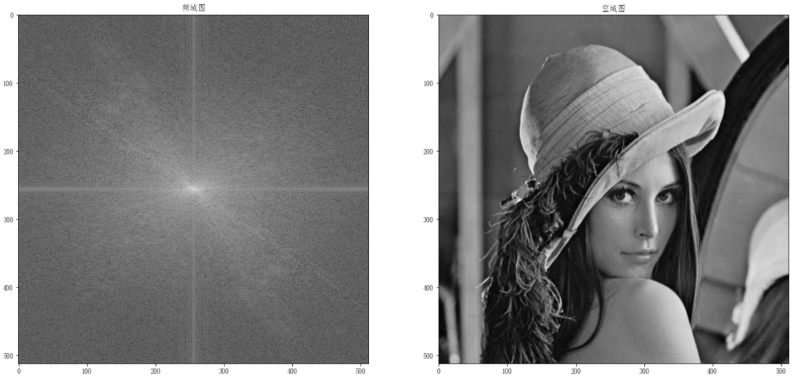
> 
> 下图是经过低通滤波器的结果。保留低频信息，去除高频信息。可以发现图像中细节部分丢失。
> 
> 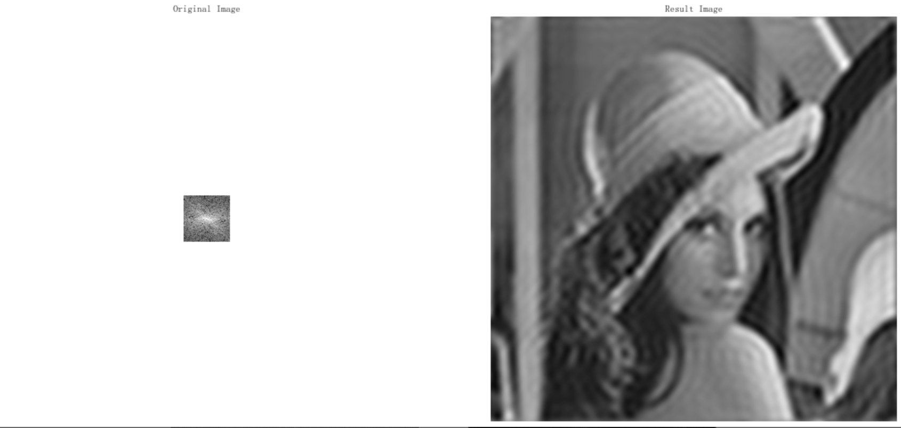
> 
> 下面这张图是经过高通滤波器，也就是去除频率域中的低频信息，只保存高频信息后的结果。可以发现图像只保留了细节部分。
> 

对于滤波器，分为高通和低通。顾名思义，高通滤波器为：让高频信息通过，过滤低频信息；低通滤波相反。有以下几种：

- 理想高低通滤波器ILPF/IHPF
- Butterworth高低通滤波器BLPF/BHPF
- 高斯高低通滤波器GLPF/GHPF

**对于这滤波器的详细介绍，后续补上**。

### 1.4 形态学

形态学（morphology）一词通常表示生物学的一个分支，该分支主要研究动植物的形态和结构。这里，我们使用同一词语表示数学形态学的内容，将数学形态学作为工具从图像中提取表达和描绘区域形状的有用图像分量，如边界、骨架和凸壳等。形态学处理主要针对的是二值图像（0或1）。形态学通常使用**图像腐蚀**和**图像膨胀**两个操作，这些操作是形态学处理的基础。

#### 1.4.1 腐蚀

作为$Z^2$中集合$A$和$B$，表示$A\ominus B$的$B$对$A$的腐蚀定义为：

$$A\ominus B=\{z|(B)_z \subseteq A\}$$

上式表示图像$A$用卷积模板$B$来进行腐蚀处理，通过模板$B$与图像$A$进行卷积计算，得出$B$覆盖区域的像素点最小值，并用这个最小值来替代参考点的像素值。如图所示，将左边的原始图像$A$腐蚀处理为右边的效果图$A\ominus B$

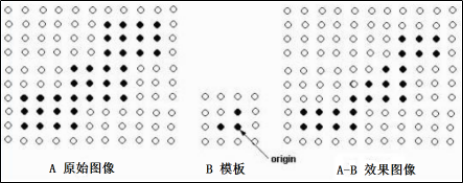

图像腐蚀的效果如下图所示：

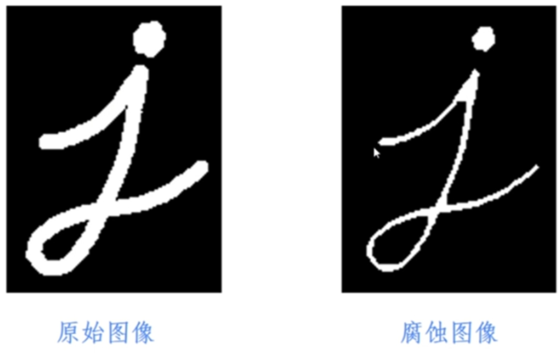

图像腐蚀类似于“邻域被蚕食”，将图像中的高亮区域或白色部分进行缩减细化，其运行结果图比原图的高亮区域更小。其主要包括两个输入对象：

- 二值图像
- 卷积核

#### 1.4.2 膨胀

作为$Z^2$中集合$A$和$B$，表示$A\oplus B$的$B$对$A$的腐蚀定义为：

$$A\oplus B=\{z|(B)_z \bigcap A \not= \emptyset \}$$

图像膨胀是腐蚀操作的逆操作，类似于“领域扩张”，将图像中的高亮区域或白色部分进行扩张，其运行结果图比原图的高亮区域更大，线条变粗了，主要用于去噪。

- 图像被腐蚀后，去除了噪声，但是会压缩图像。
- 对腐蚀过的图像，进行膨胀处理，可以去除噪声，并且保持原有形状。

它也包括两个输入对象：

- 二值图像或原始图像
- 卷积核

图像膨胀的效果如下图所示：

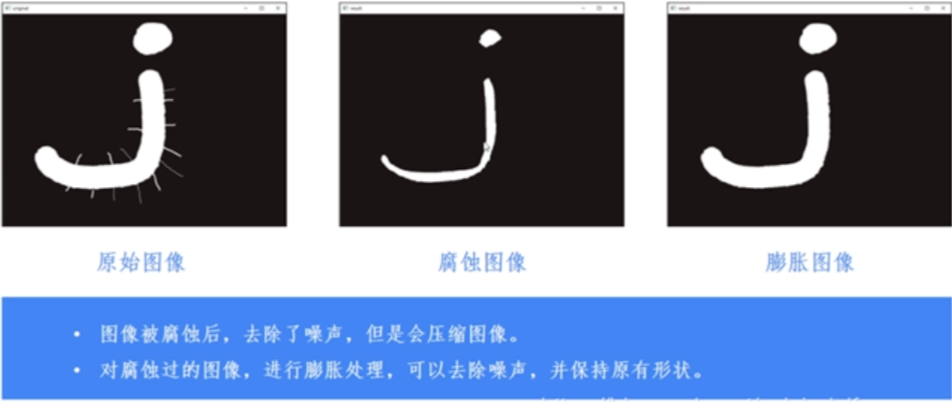

#### 1.4.3 开运算

先用B对A腐蚀，然后用B对结果膨胀。**使图像的轮廓变得光滑，断开狭窄的间断和消除细的突出物，也可以用于去噪**。效果如下图

#### 1.4.4 闭运算

先用B对A膨胀，然后用B对结果腐蚀。同样使图像的轮廓变得光滑，但与开操作相反，它能**消除狭窄的间断和长细的鸿沟，消除小的孔洞，并填补轮廓线中的裂痕**。

## 2. 面试题